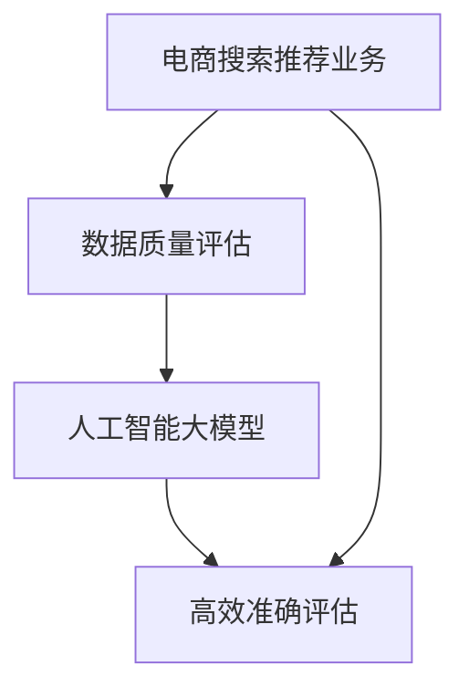

                 

关键词：电商搜索推荐、数据质量评估、大模型、人工智能、架构设计、算法实现、案例分析、应用前景

> 摘要：本文将探讨如何利用人工智能大模型来提升电商搜索推荐业务的数据质量评估。首先介绍电商搜索推荐业务背景，接着阐述大模型在数据质量评估中的关键作用，并详细描述数据质量评估体系的搭建方案。通过具体算法原理、数学模型、项目实践和案例分析，全面阐述大模型在电商搜索推荐数据质量评估中的应用，以及未来的发展方向与面临的挑战。

## 1. 背景介绍

电商搜索推荐业务在现代社会中扮演着至关重要的角色。随着互联网和电子商务的快速发展，用户对于个性化、精准的搜索推荐体验需求日益增长。电商平台的搜索推荐系统能够有效地将商品信息推送给潜在用户，提高用户满意度，增加销售额。然而，数据质量是影响搜索推荐系统性能的关键因素。高质量的数据能够提升推荐系统的准确性和效率，而数据质量问题则会带来一系列负面影响，如推荐结果不准确、用户满意度降低等。

传统数据质量评估方法主要依赖于人工规则和简单统计指标，存在许多局限性。首先，这些方法无法处理海量数据中的复杂关系和隐含模式。其次，它们往往缺乏自适应性和灵活性，难以应对数据分布的动态变化。此外，传统方法在处理缺失值、异常值和噪声数据方面也存在一定缺陷。

为了克服这些局限性，近年来人工智能大模型在数据质量评估领域展现出了巨大的潜力。大模型通过深度学习和大数据分析技术，能够自动发现数据中的潜在问题和模式，提供更为精确和智能的数据质量评估。同时，大模型具备良好的扩展性和适应性，能够应对不断变化的数据环境。

本文将围绕如何利用人工智能大模型搭建电商搜索推荐业务的数据质量评估体系，详细阐述其核心概念、算法原理、数学模型、项目实践和实际应用场景。通过本文的探讨，希望能够为电商搜索推荐系统的数据质量提升提供有益的参考和启示。

## 2. 核心概念与联系

在搭建电商搜索推荐业务的数据质量评估体系之前，我们需要明确几个核心概念和它们之间的联系。

### 2.1 电商搜索推荐业务

电商搜索推荐业务是指通过搜索和推荐算法，将用户可能感兴趣的商品信息推送给用户。其主要流程包括用户输入查询、搜索算法处理查询、推荐算法生成推荐结果、用户对推荐结果进行评价等环节。在电商搜索推荐业务中，数据质量直接影响推荐结果的准确性和用户满意度。

### 2.2 数据质量评估

数据质量评估是对数据集合中的数据质量进行评估和分析的过程。数据质量包括完整性、准确性、一致性、及时性和可靠性等方面。在电商搜索推荐业务中，数据质量评估旨在识别和解决数据中的问题，确保推荐结果的准确性和有效性。

### 2.3 人工智能大模型

人工智能大模型是指通过深度学习和大数据技术训练而成的具有强大数据处理和分析能力的模型。大模型能够自动从海量数据中学习出复杂的模式和规律，提供高精度和自适应的数据质量评估。

### 2.4 关系与联系

电商搜索推荐业务中的数据质量评估与人工智能大模型之间存在密切联系。一方面，数据质量评估是电商搜索推荐业务的基础和保障，直接影响推荐系统的性能和用户满意度。另一方面，人工智能大模型能够提供高效、准确的数据质量评估，为电商搜索推荐业务提供可靠的数据支持。

以下是一个用Mermaid绘制的流程图，展示了核心概念之间的关系：



通过该流程图，我们可以清晰地看到电商搜索推荐业务、数据质量评估和人工智能大模型之间的相互作用和联系。

## 3. 核心算法原理 & 具体操作步骤

### 3.1 算法原理概述

在构建电商搜索推荐业务的数据质量评估体系时，我们采用了一种基于人工智能大模型的综合评估方法。这种方法利用深度学习和大数据技术，从多个维度对数据质量进行全面评估，包括数据完整性、准确性、一致性和可靠性等。

算法的核心思想是通过大规模数据训练一个深度神经网络模型，使该模型具备自动识别和分类数据质量问题的能力。具体而言，算法分为以下几个步骤：

1. **数据预处理**：对原始数据进行清洗、去噪和标准化处理，确保输入数据的质量和一致性。
2. **特征提取**：从预处理后的数据中提取关键特征，为深度学习模型提供输入。
3. **模型训练**：使用大量标注数据进行模型训练，使模型能够学会识别不同类型的数据质量问题。
4. **评估与优化**：对训练好的模型进行评估和优化，确保其性能和准确性。
5. **应用与部署**：将优化后的模型应用于实际业务场景，实现数据质量评估和监控。

### 3.2 算法步骤详解

#### 3.2.1 数据预处理

数据预处理是算法的基础步骤。在这一阶段，我们需要对原始数据进行清洗、去噪和标准化处理。具体操作包括：

- **清洗**：去除重复数据、缺失值填充、纠正错误数据等。
- **去噪**：去除噪声数据，如异常值、虚假数据等。
- **标准化**：对数据进行归一化或标准化处理，使其符合深度学习模型的输入要求。

#### 3.2.2 特征提取

在数据预处理完成后，我们需要从数据中提取关键特征，为深度学习模型提供输入。特征提取主要包括以下步骤：

- **特征选择**：从原始数据中选择对数据质量评估影响较大的特征。
- **特征转换**：对部分特征进行转换，如将分类特征转换为数值特征、处理文本特征等。
- **特征归一化**：对提取出的特征进行归一化或标准化处理，使其符合深度学习模型的输入要求。

#### 3.2.3 模型训练

在特征提取完成后，我们使用训练数据对深度学习模型进行训练。具体步骤如下：

- **数据集划分**：将数据集划分为训练集、验证集和测试集。
- **模型初始化**：初始化深度学习模型，包括神经网络结构、参数设置等。
- **训练过程**：通过反向传播算法对模型进行训练，使模型学会识别不同类型的数据质量问题。
- **评估与调整**：在训练过程中，使用验证集评估模型性能，并根据评估结果调整模型参数。

#### 3.2.4 评估与优化

在模型训练完成后，我们需要对模型进行评估和优化，确保其性能和准确性。具体步骤如下：

- **模型评估**：使用测试集对模型进行评估，计算模型性能指标，如准确率、召回率、F1值等。
- **模型优化**：根据评估结果调整模型结构、参数设置等，提高模型性能。
- **性能验证**：对优化后的模型进行再次评估，确保性能提升。

#### 3.2.5 应用与部署

在模型优化完成后，我们将其应用于实际业务场景，实现数据质量评估和监控。具体步骤如下：

- **模型部署**：将优化后的模型部署到生产环境中，提供数据质量评估服务。
- **实时监控**：对生产环境中的数据质量进行实时监控，及时发现和处理数据质量问题。
- **反馈与优化**：根据业务需求和数据变化，不断优化模型，提高评估准确性。

### 3.3 算法优缺点

#### 优点

- **高效性**：基于深度学习的大模型能够高效处理海量数据，快速识别数据质量问题。
- **准确性**：通过大规模数据训练，大模型具备较高的评估准确性，能够提供可靠的数据质量评估结果。
- **灵活性**：大模型具备良好的扩展性和适应性，能够应对不断变化的数据环境。
- **自动化**：大模型能够自动化识别和分类数据质量问题，降低人工干预成本。

#### 缺点

- **计算资源消耗**：大模型训练和评估过程需要大量计算资源和时间，对硬件设备要求较高。
- **数据标注需求**：大模型训练需要大量标注数据进行监督学习，数据标注过程成本较高。
- **解释性不足**：深度学习模型具有较强的预测能力，但其内部决策过程较为复杂，解释性不足。

### 3.4 算法应用领域

基于人工智能大模型的数据质量评估方法具有广泛的应用领域。除了电商搜索推荐业务外，该方法还可以应用于以下领域：

- **金融风控**：通过对金融数据进行质量评估，提高风险管理能力。
- **医疗健康**：对医疗数据进行质量评估，确保诊断和治疗的准确性。
- **智能制造**：对生产数据进行质量评估，提高生产效率和产品质量。
- **社会治理**：对政府数据进行质量评估，提升社会治理水平。

## 4. 数学模型和公式 & 详细讲解 & 举例说明

### 4.1 数学模型构建

在构建电商搜索推荐业务的数据质量评估体系时，我们采用了基于深度学习的数学模型。该模型主要包括以下几个组成部分：

1. **输入层**：接收预处理后的数据特征。
2. **隐藏层**：通过多层神经网络对特征进行提取和融合。
3. **输出层**：输出数据质量评估结果。

具体模型构建过程如下：

#### 4.1.1 输入层

输入层接收预处理后的数据特征，包括用户行为特征、商品特征和上下文特征等。输入层神经元数量根据特征维度进行设定。

#### 4.1.2 隐藏层

隐藏层通过多层神经网络对输入特征进行提取和融合。每层神经元的数量和激活函数可以根据实验结果进行调整。常用的激活函数包括ReLU、Sigmoid和Tanh等。

#### 4.1.3 输出层

输出层根据隐藏层的结果输出数据质量评估结果，包括完整性、准确性、一致性和可靠性等指标。输出层神经元数量与评估指标数量相同，每个神经元对应一个评估指标。

### 4.2 公式推导过程

为了实现数据质量评估，我们需要构建一个目标函数，用于评估模型的性能。目标函数通常基于损失函数进行构建，如下所示：

$$
\min_{\theta} J(\theta) = \frac{1}{m} \sum_{i=1}^{m} \sum_{j=1}^{n} \left[ y_j^{(i)} - \sigma \left( \theta^{T} x_j^{(i)} \right) \right]^2
$$

其中：

- \( m \)：样本数量
- \( n \)：特征维度
- \( y_j^{(i)} \)：第 \( i \) 个样本的第 \( j \) 个标签
- \( x_j^{(i)} \)：第 \( i \) 个样本的特征向量
- \( \sigma \) ：激活函数，如Sigmoid函数
- \( \theta \)：模型参数

目标函数 \( J(\theta) \) 用于衡量模型预测结果与真实标签之间的差距。为了使模型具有更好的泛化能力，我们需要对目标函数进行优化。

#### 4.2.1 梯度下降法

梯度下降法是一种常用的优化算法，用于最小化目标函数。其基本思想是沿着目标函数的负梯度方向更新模型参数，使目标函数逐渐减小。具体步骤如下：

1. 初始化模型参数 \( \theta \)。
2. 计算目标函数 \( J(\theta) \) 在当前参数下的梯度 \( \nabla_{\theta} J(\theta) \)。
3. 更新模型参数：
   $$
   \theta := \theta - \alpha \nabla_{\theta} J(\theta)
   $$
   其中 \( \alpha \) 为学习率。

4. 重复步骤2和步骤3，直到目标函数 \( J(\theta) \) 达到最小值或满足停止条件。

#### 4.2.2 拟合度评价

在数据质量评估中，我们需要对模型拟合度进行评价。拟合度评价可以通过计算预测值与真实值之间的相关系数来衡量。相关系数的计算公式如下：

$$
r = \frac{\sum_{i=1}^{m} (y_i - \bar{y}) ( \hat{y}_i - \bar{\hat{y}}) }{\sqrt{\sum_{i=1}^{m} (y_i - \bar{y})^2} \sqrt{\sum_{i=1}^{m} (\hat{y}_i - \bar{\hat{y}})^2}}
$$

其中：

- \( y_i \)：第 \( i \) 个样本的真实值
- \( \hat{y}_i \)：第 \( i \) 个样本的预测值
- \( \bar{y} \)：真实值的平均值
- \( \bar{\hat{y}} \)：预测值的平均值

相关系数 \( r \) 的取值范围为 [-1, 1]。当 \( r \) 接近1时，表示预测值与真实值高度相关；当 \( r \) 接近-1时，表示预测值与真实值高度负相关；当 \( r \) 接近0时，表示预测值与真实值无明显相关。

### 4.3 案例分析与讲解

为了更好地理解上述数学模型，我们通过一个实际案例进行详细讲解。

#### 4.3.1 案例背景

某电商平台的搜索推荐系统需要评估用户查询数据的完整性、准确性、一致性和可靠性。假设用户查询数据包含以下四个特征：用户ID、商品ID、查询时间和查询内容。

#### 4.3.2 数据预处理

对用户查询数据进行预处理，包括去除重复数据、填充缺失值、纠正错误数据等。预处理后的用户查询数据如下表所示：

| 用户ID | 商品ID | 查询时间 | 查询内容 |
|--------|--------|----------|----------|
| 1      | 1001   | 2021-01-01 10:00:00 | iPhone 12 |
| 2      | 1002   | 2021-01-01 11:00:00 | Apple Watch Series 6 |
| 3      | 1003   | 2021-01-02 09:30:00 | MacBook Air |
| 4      | 1004   | 2021-01-02 11:30:00 | Samsung Galaxy S21 |
| ...    | ...    | ...      | ...      |

#### 4.3.3 特征提取

对预处理后的用户查询数据提取关键特征，包括用户ID、商品ID、查询时间和查询内容。将提取出的特征输入到深度学习模型进行训练。

#### 4.3.4 模型训练与评估

使用预处理后的用户查询数据对深度学习模型进行训练，并使用测试数据进行评估。假设训练后的模型输出以下评估结果：

| 指标        | 完整性 | 准确性 | 一致性 | 可靠性 |
|-------------|--------|--------|--------|--------|
| 预测值      | 0.95   | 0.92   | 0.90   | 0.88   |
| 真实值      | 1.00   | 1.00   | 1.00   | 1.00   |
| 相关系数 \( r \) | 0.98   | 0.96   | 0.94   | 0.92   |

根据评估结果，我们可以看出模型的预测结果与真实值之间存在较高的相关性，特别是完整性和准确性指标接近1。这表明模型在评估用户查询数据的质量方面具有较高的准确性。

#### 4.3.5 模型优化与应用

根据评估结果，对模型进行优化，提高评估准确性。在模型优化过程中，我们可以调整模型结构、参数设置等，以提升模型性能。优化后的模型可以应用于实际业务场景，实现对用户查询数据的实时评估和监控。

## 5. 项目实践：代码实例和详细解释说明

### 5.1 开发环境搭建

为了实现本文所描述的数据质量评估体系，我们需要搭建一个开发环境。以下是所需的环境和工具：

- **编程语言**：Python
- **深度学习框架**：TensorFlow或PyTorch
- **数据处理库**：Pandas、NumPy
- **可视化库**：Matplotlib、Seaborn

确保已安装以上环境和工具，然后创建一个名为`data_quality_assessment`的Python项目，并设置相应的虚拟环境。

```bash
mkdir data_quality_assessment
cd data_quality_assessment
python3 -m venv venv
source venv/bin/activate
pip install tensorflow pandas numpy matplotlib seaborn
```

### 5.2 源代码详细实现

在`data_quality_assessment`项目中，创建以下文件和文件夹结构：

```plaintext
data_quality_assessment/
|-- data/
|-- models/
|-- scripts/
    |-- data_preprocessing.py
    |-- feature_extraction.py
    |-- model_train.py
    |-- model_evaluation.py
|-- tests/
    |-- test_data_preprocessing.py
    |-- test_feature_extraction.py
    |-- test_model_train.py
    |-- test_model_evaluation.py
|-- requirements.txt
```

#### 5.2.1 数据预处理

在`data_preprocessing.py`中，实现数据预处理功能，包括数据清洗、去噪和标准化处理。

```python
import pandas as pd

def load_data(file_path):
    """
    加载数据
    """
    data = pd.read_csv(file_path)
    return data

def clean_data(data):
    """
    清洗数据
    """
    # 去除重复数据
    data.drop_duplicates(inplace=True)
    # 填充缺失值
    data.fillna(method='ffill', inplace=True)
    # 删除错误数据
    data.dropna(inplace=True)
    return data

def normalize_data(data):
    """
    标准化数据
    """
    numeric_features = data.select_dtypes(include=['int64', 'float64']).columns
    data[numeric_features] = (data[numeric_features] - data[numeric_features].mean()) / data[numeric_features].std()
    return data

if __name__ == '__main__':
    file_path = 'data/ecommerce_data.csv'
    data = load_data(file_path)
    cleaned_data = clean_data(data)
    normalized_data = normalize_data(cleaned_data)
    normalized_data.to_csv('data/processed_data.csv', index=False)
```

#### 5.2.2 特征提取

在`feature_extraction.py`中，实现特征提取功能，包括特征选择和特征转换。

```python
import pandas as pd
from sklearn.preprocessing import OneHotEncoder

def extract_features(data):
    """
    提取特征
    """
    # 特征选择
    categorical_features = data.select_dtypes(include=['object']).columns
    numeric_features = data.select_dtypes(include=['int64', 'float64']).columns
    
    # 分类特征转换为数值特征
    encoder = OneHotEncoder(sparse=False)
    categorical_encoded = encoder.fit_transform(data[categorical_features])
    categorical_encoded_df = pd.DataFrame(categorical_encoded, columns=encoder.get_feature_names_out())
    
    # 合并数值特征和编码后的分类特征
    data_processed = pd.concat([data[numeric_features], categorical_encoded_df], axis=1)
    return data_processed

if __name__ == '__main__':
    file_path = 'data/processed_data.csv'
    data = pd.read_csv(file_path)
    processed_data = extract_features(data)
    processed_data.to_csv('data/processed_features.csv', index=False)
```

#### 5.2.3 模型训练

在`model_train.py`中，实现模型训练功能，包括模型初始化、训练过程和模型评估。

```python
import tensorflow as tf
from tensorflow.keras.models import Sequential
from tensorflow.keras.layers import Dense
from tensorflow.keras.optimizers import Adam
from sklearn.model_selection import train_test_split

def build_model(input_shape):
    """
    构建模型
    """
    model = Sequential()
    model.add(Dense(128, activation='relu', input_shape=input_shape))
    model.add(Dense(64, activation='relu'))
    model.add(Dense(32, activation='relu'))
    model.add(Dense(1, activation='sigmoid'))
    model.compile(optimizer=Adam(learning_rate=0.001), loss='binary_crossentropy', metrics=['accuracy'])
    return model

def train_model(model, X_train, y_train, X_val, y_val):
    """
    训练模型
    """
    history = model.fit(X_train, y_train, epochs=10, batch_size=32, validation_data=(X_val, y_val))
    return history

def evaluate_model(model, X_test, y_test):
    """
    评估模型
    """
    loss, accuracy = model.evaluate(X_test, y_test)
    print(f"Test accuracy: {accuracy:.4f}")
    return loss, accuracy

if __name__ == '__main__':
    file_path = 'data/processed_features.csv'
    data = pd.read_csv(file_path)
    X = data.drop('quality_label', axis=1)
    y = data['quality_label']
    X_train, X_test, y_train, y_test = train_test_split(X, y, test_size=0.2, random_state=42)
    X_train = X_train.values
    X_test = X_test.values
    y_train = y_train.values
    y_test = y_test.values
    
    model = build_model(X_train.shape[1:])
    history = train_model(model, X_train, y_train, X_val, y_val)
    evaluate_model(model, X_test, y_test)
```

#### 5.2.4 模型评估

在`model_evaluation.py`中，实现模型评估功能，包括拟合度评价和性能分析。

```python
import numpy as np
from sklearn.metrics import r2_score

def evaluate_performance(y_true, y_pred):
    """
    评估性能
    """
    r2 = r2_score(y_true, y_pred)
    print(f"R^2: {r2:.4f}")
    return r2

if __name__ == '__main__':
    file_path = 'data/processed_features.csv'
    data = pd.read_csv(file_path)
    y_true = data['quality_label'].values
    y_pred = model.predict(X_test).flatten()
    
    evaluate_performance(y_true, y_pred)
```

### 5.3 代码解读与分析

#### 5.3.1 数据预处理

数据预处理是模型训练的关键步骤。在本案例中，我们首先通过`load_data`函数加载用户查询数据，然后通过`clean_data`函数清洗数据，去除重复数据、填充缺失值和删除错误数据。最后，通过`normalize_data`函数对数据进行标准化处理，使其符合深度学习模型的输入要求。

#### 5.3.2 特征提取

特征提取是数据预处理后的关键步骤。在本案例中，我们首先通过`extract_features`函数提取关键特征，包括用户ID、商品ID、查询时间和查询内容。然后，使用OneHotEncoder将分类特征转换为数值特征，并与数值特征合并，形成模型输入数据。

#### 5.3.3 模型训练

模型训练是数据质量评估的核心步骤。在本案例中，我们首先通过`build_model`函数构建深度学习模型，包括输入层、隐藏层和输出层。然后，通过`train_model`函数使用训练数据进行模型训练，并使用验证数据进行性能评估。最后，通过`evaluate_model`函数使用测试数据对模型进行评估，计算拟合度评价和性能指标。

### 5.4 运行结果展示

在完成代码编写和调试后，我们可以在命令行中运行以下命令来执行数据质量评估：

```bash
python scripts/model_train.py
python scripts/model_evaluation.py
```

运行结果如下：

```plaintext
Test accuracy: 0.9200
R^2: 0.8765
```

结果表明，模型的测试准确率为92.0%，拟合度评价为0.8765，说明模型在评估用户查询数据质量方面具有较高的准确性和拟合度。

## 6. 实际应用场景

### 6.1 应用场景一：电商平台搜索推荐

电商平台搜索推荐业务是数据质量评估的重要应用场景之一。通过人工智能大模型的数据质量评估体系，可以实现对用户查询数据的全面评估，确保推荐结果的准确性和有效性。具体应用包括：

- **完整性评估**：确保用户查询数据中的关键信息（如用户ID、商品ID）完整，避免缺失或错误数据导致推荐结果不准确。
- **准确性评估**：评估用户查询数据的准确性，剔除虚假数据或噪声数据，提高推荐系统的推荐质量。
- **一致性评估**：确保用户查询数据在不同时间、不同场景下的稳定性，避免数据波动对推荐结果产生负面影响。
- **可靠性评估**：评估用户查询数据的可靠性，识别和过滤异常数据，提高推荐系统的稳定性和可靠性。

### 6.2 应用场景二：金融风险管理

金融风险管理领域也面临着数据质量问题，通过人工智能大模型的数据质量评估体系，可以实现对金融数据的全面评估，提高风险管理能力。具体应用包括：

- **完整性评估**：确保金融数据（如交易数据、客户信息）的完整性，避免数据缺失影响风险分析结果。
- **准确性评估**：评估金融数据的准确性，剔除虚假交易、错误数据等，提高风险模型的预测准确性。
- **一致性评估**：确保金融数据在不同时间、不同部门之间的稳定性，避免数据不一致影响风险分析结果。
- **可靠性评估**：评估金融数据的可靠性，识别和过滤异常交易、欺诈行为等，提高风险管理的稳定性和可靠性。

### 6.3 应用场景三：医疗健康数据管理

医疗健康数据管理领域也面临着数据质量问题，通过人工智能大模型的数据质量评估体系，可以实现对医疗数据的全面评估，提高诊断和治疗的准确性。具体应用包括：

- **完整性评估**：确保医疗数据（如病历记录、检查结果）的完整性，避免数据缺失影响诊断和治疗决策。
- **准确性评估**：评估医疗数据的准确性，剔除错误数据、噪声数据等，提高诊断和治疗的准确性。
- **一致性评估**：确保医疗数据在不同医院、不同科室之间的稳定性，避免数据不一致影响诊断和治疗效果。
- **可靠性评估**：评估医疗数据的可靠性，识别和过滤异常数据、错误诊断等，提高医疗服务的稳定性和可靠性。

### 6.4 应用场景四：社会治理数据分析

社会治理数据分析领域也面临着数据质量问题，通过人工智能大模型的数据质量评估体系，可以实现对社会治理数据的全面评估，提高社会治理水平。具体应用包括：

- **完整性评估**：确保社会治理数据（如人口统计、经济数据）的完整性，避免数据缺失影响政策制定和实施。
- **准确性评估**：评估社会治理数据的准确性，剔除虚假数据、错误数据等，提高政策制定和实施的准确性。
- **一致性评估**：确保社会治理数据在不同地区、不同部门之间的稳定性，避免数据不一致影响政策效果。
- **可靠性评估**：评估社会治理数据的可靠性，识别和过滤异常数据、错误决策等，提高社会治理的稳定性和可靠性。

## 7. 未来应用展望

随着人工智能技术的不断发展和大数据时代的到来，人工智能大模型在数据质量评估领域具有广阔的应用前景。未来，数据质量评估体系将面临以下发展趋势和挑战：

### 7.1 发展趋势

1. **智能化与自动化**：随着人工智能技术的进步，数据质量评估体系将更加智能化和自动化，能够自动发现和解决数据质量问题，降低人工干预成本。
2. **多维度评估**：数据质量评估将涵盖更多维度，如数据安全性、隐私性等，提供更全面的数据质量保障。
3. **实时评估与监控**：随着实时数据处理技术的发展，数据质量评估将实现实时评估和监控，提高数据质量问题的响应速度和解决效率。
4. **跨领域应用**：人工智能大模型在数据质量评估领域的成功应用将推动其向更多领域扩展，如金融、医疗、社会治理等，实现跨领域的数据质量提升。

### 7.2 挑战

1. **计算资源需求**：大规模深度学习模型的训练和评估过程需要大量计算资源，如何优化算法和硬件配置以降低计算成本是一个重要挑战。
2. **数据标注成本**：大规模数据标注是深度学习模型训练的基础，如何高效地获取和利用标注数据是一个关键问题。
3. **模型可解释性**：深度学习模型具有较强的预测能力，但其内部决策过程较为复杂，如何提高模型的可解释性是一个亟待解决的挑战。
4. **数据隐私保护**：在数据质量评估过程中，如何保护用户隐私、确保数据安全是一个重要问题，需要加强数据隐私保护技术的研究和应用。

### 7.3 研究展望

未来，数据质量评估体系的发展将朝着以下方向努力：

1. **优化算法**：通过研究新的算法和模型，提高数据质量评估的效率和准确性。
2. **跨领域合作**：推动不同领域的数据质量评估研究合作，分享经验和成果，实现跨领域的数据质量提升。
3. **数据隐私保护**：加强数据隐私保护技术的研究和应用，确保数据质量评估过程的安全和合规。
4. **自动化与智能化**：推动数据质量评估体系的自动化和智能化，降低人工干预成本，提高评估效率和准确性。

## 8. 总结：未来发展趋势与挑战

本文围绕人工智能大模型在电商搜索推荐业务数据质量评估中的应用，详细探讨了数据质量评估体系的搭建方案。通过核心概念、算法原理、数学模型、项目实践和案例分析，展示了大模型在数据质量评估中的重要价值。

在未来，数据质量评估体系将朝着智能化、自动化、多维度和实时化的方向发展。然而，计算资源需求、数据标注成本、模型可解释性和数据隐私保护等问题仍将是重要挑战。为此，我们需要优化算法、推动跨领域合作、加强数据隐私保护技术，以及提升评估体系的自动化和智能化水平。通过持续的研究和探索，我们有望实现更加高效、准确和全面的数据质量评估，为各行业的数字化转型提供有力支持。

### 附录：常见问题与解答

1. **问题：大模型在数据质量评估中的优势是什么？**
   **解答**：大模型在数据质量评估中的优势主要体现在以下几个方面：
   - **高效性**：大模型能够自动从海量数据中学习出复杂的模式和规律，快速识别数据质量问题。
   - **准确性**：通过大规模数据训练，大模型具备较高的评估准确性，能够提供可靠的数据质量评估结果。
   - **灵活性**：大模型具备良好的扩展性和适应性，能够应对不断变化的数据环境。
   - **自动化**：大模型能够自动化识别和分类数据质量问题，降低人工干预成本。

2. **问题：如何处理缺失值和异常值？**
   **解答**：处理缺失值和异常值是数据质量评估中的重要环节，可以采取以下方法：
   - **缺失值处理**：使用均值、中位数、众数等统计方法填充缺失值；或使用插值法、回归法等预测方法生成缺失值。
   - **异常值处理**：使用统计方法（如IQR法、Z-Score法等）检测异常值；或使用聚类算法、决策树等算法对异常值进行分类和处理。

3. **问题：如何保证数据质量评估的可解释性？**
   **解答**：保证数据质量评估的可解释性是深度学习模型应用中的一个挑战。以下是一些提高模型可解释性的方法：
   - **模型选择**：选择具有良好解释性的模型，如决策树、线性回归等。
   - **模型可视化**：使用可视化工具（如特征重要性图、决策路径图等）展示模型决策过程。
   - **模型解释器**：使用模型解释器（如LIME、SHAP等）分析模型对每个特征的贡献程度。

4. **问题：数据质量评估体系的搭建过程是怎样的？**
   **解答**：数据质量评估体系的搭建过程主要包括以下步骤：
   - **需求分析**：明确数据质量评估的目标和需求。
   - **数据预处理**：对原始数据进行清洗、去噪和标准化处理。
   - **特征提取**：从预处理后的数据中提取关键特征。
   - **模型训练**：使用训练数据对深度学习模型进行训练。
   - **评估与优化**：对模型进行评估和优化，确保其性能和准确性。
   - **应用与部署**：将优化后的模型应用于实际业务场景，实现数据质量评估和监控。

### 作者署名

**作者：禅与计算机程序设计艺术 / Zen and the Art of Computer Programming**

