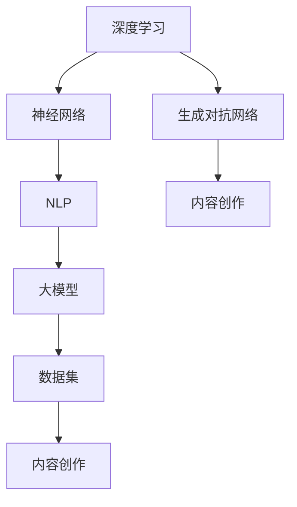

                 

关键词：AI大模型、内容创作、商机、技术语言、算法、数学模型、项目实践、应用场景、未来展望

> 摘要：本文将深入探讨人工智能（AI）大模型在内容创作领域的商业机会。通过分析核心概念、算法原理、数学模型、项目实践以及未来展望，旨在为读者提供一个全面的技术视角，了解AI大模型在内容创作中的应用潜力和发展趋势。

## 1. 背景介绍

随着人工智能技术的飞速发展，尤其是深度学习、自然语言处理（NLP）和生成对抗网络（GAN）等领域的突破，AI大模型已经成为了科技界的重要研究热点。大模型不仅具备处理大规模数据的能力，而且在理解复杂语境、生成高质量内容方面展现出了卓越的性能。这些特性使得AI大模型在内容创作领域具有广阔的应用前景，吸引了众多企业和投资者的关注。

内容创作是信息时代的重要组成部分，涵盖了新闻、广告、文学、娱乐等多个领域。然而，高质量的内容创作往往需要大量时间和人力资源。传统的手工创作方式已经无法满足日益增长的市场需求，这也催生了AI大模型在内容创作领域的应用需求。通过AI大模型，可以自动化地生成大量高质量的文本内容，大大提高内容创作的效率。

## 2. 核心概念与联系

在探讨AI大模型在内容创作领域的商机之前，我们需要了解几个核心概念和它们之间的联系。

### 2.1 深度学习与神经网络

深度学习是一种基于人工神经网络（ANN）的学习方式，通过多层神经元的连接来提取和表示数据。神经网络通过反向传播算法调整权重，使得模型能够更好地拟合训练数据。在深度学习中，神经网络通常包含多个隐藏层，这使得模型能够处理更复杂的任务。

### 2.2 自然语言处理（NLP）

自然语言处理是人工智能的一个重要分支，旨在使计算机能够理解、生成和处理自然语言。NLP技术包括词性标注、句法分析、语义理解等，这些技术在AI大模型中起着关键作用。

### 2.3 生成对抗网络（GAN）

生成对抗网络是一种由生成器和判别器组成的模型结构。生成器生成数据，判别器则判断生成数据与真实数据的相似度。通过这种对抗训练，生成器能够生成越来越真实的数据。

### 2.4 大模型与数据集

大模型通常指的是具有数百万甚至数十亿参数的神经网络模型。这些模型需要大量的训练数据来学习，因此数据集的规模和质量对模型性能至关重要。

下面是一个简单的Mermaid流程图，展示了AI大模型在内容创作领域中的核心概念和联系：



## 3. 核心算法原理 & 具体操作步骤

### 3.1 算法原理概述

AI大模型在内容创作中的核心算法主要包括基于深度学习的文本生成模型和基于GAN的图像生成模型。文本生成模型如GPT（Generative Pre-trained Transformer）、BERT（Bidirectional Encoder Representations from Transformers）等，能够根据输入的文本上下文生成连贯的文本内容。而GAN模型则可以生成高质量的图像，广泛应用于图像修复、超分辨率处理等领域。

### 3.2 算法步骤详解

#### 3.2.1 文本生成模型

1. 数据预处理：将原始文本数据清洗、分词、转换为词嵌入向量。
2. 模型训练：使用大量的文本数据对模型进行预训练，通过反向传播算法不断调整模型参数。
3. 文本生成：输入一段文本上下文，模型根据训练好的参数生成后续的文本内容。

#### 3.2.2 图像生成模型

1. 数据预处理：对图像进行归一化处理，将图像像素值转换为适合GAN模型训练的格式。
2. 模型训练：生成器生成图像，判别器判断生成图像的真实性。通过对抗训练，生成器不断优化生成图像的质量。
3. 图像生成：输入一段文本描述，生成器根据训练好的参数生成相应的图像。

### 3.3 算法优缺点

#### 3.3.1 优点

- **高效性**：AI大模型能够快速处理大规模数据，大大提高了内容创作的效率。
- **灵活性**：大模型可以通过调整参数来适应不同的内容创作任务。
- **高质量**：大模型生成的文本和图像在质量和连贯性方面表现出色。

#### 3.3.2 缺点

- **计算资源需求**：大模型的训练和推理需要大量的计算资源。
- **数据依赖性**：模型性能很大程度上依赖于训练数据的质量和规模。
- **模型解释性**：大模型的内部工作机制复杂，缺乏直观的解释性。

### 3.4 算法应用领域

AI大模型在内容创作领域的应用非常广泛，包括但不限于：

- **新闻写作**：自动生成新闻报道，提高新闻发布的速度和覆盖面。
- **广告文案**：自动生成广告文案，提高广告的吸引力和转化率。
- **文学创作**：自动生成小说、诗歌等文学作品，丰富文化创作形式。
- **娱乐内容**：自动生成电影、电视剧等娱乐内容的剧本和台词。

## 4. 数学模型和公式 & 详细讲解 & 举例说明

### 4.1 数学模型构建

AI大模型的核心在于其参数化的数学模型，这些模型通常基于深度学习的框架构建。以下是一个简化的数学模型构建过程：

#### 4.1.1 神经网络

神经网络的数学模型可以表示为：

$$
\text{Output} = \sigma(\text{Weight} \cdot \text{Input} + \text{Bias})
$$

其中，$\sigma$ 是激活函数，如Sigmoid函数、ReLU函数等；$\text{Weight}$ 和 $\text{Bias}$ 分别是权重和偏置。

#### 4.1.2 生成对抗网络（GAN）

GAN由生成器（Generator）和判别器（Discriminator）组成，其数学模型可以表示为：

$$
\text{Generator} : G(z) \sim p_G(z) \\
\text{Discriminator} : D(x) \sim p_D(x)
$$

其中，$z$ 是随机噪声，$x$ 是真实数据或生成数据。

### 4.2 公式推导过程

以GPT模型为例，其训练过程可以简化为以下步骤：

1. **损失函数**：损失函数用于衡量模型输出的预测值与真实值之间的差距，常见的损失函数有交叉熵损失函数。

$$
L = -\sum_{i=1}^{N} y_i \log(p_i)
$$

其中，$y_i$ 是真实标签，$p_i$ 是模型对每个类别的预测概率。

2. **反向传播**：通过反向传播算法，将损失函数对网络参数求导，更新模型参数。

$$
\frac{\partial L}{\partial \theta} = \sum_{i=1}^{N} \frac{\partial L}{\partial p_i} \frac{\partial p_i}{\partial \theta}
$$

### 4.3 案例分析与讲解

假设我们要训练一个GPT模型来生成新闻文章，以下是一个简化的案例：

1. **数据集**：我们有一个包含1000篇新闻文章的数据集，每篇文章约1000个单词。
2. **模型架构**：我们使用一个包含12个隐藏层的GPT模型，每层有512个神经元。
3. **训练过程**：我们使用随机梯度下降（SGD）算法，学习率为0.001，批量大小为32，训练100个epochs。

通过训练，模型能够学习到新闻文章的写作风格和语法规则，从而生成新的新闻文章。

## 5. 项目实践：代码实例和详细解释说明

### 5.1 开发环境搭建

为了演示AI大模型在内容创作中的应用，我们将使用Python和TensorFlow作为主要工具。以下是开发环境的搭建步骤：

1. 安装Python（建议使用Python 3.7及以上版本）。
2. 安装TensorFlow。
3. 安装其他必要的依赖库，如Numpy、Pandas等。

### 5.2 源代码详细实现

以下是使用GPT模型生成新闻文章的简化代码示例：

```python
import tensorflow as tf
from tensorflow.keras.layers import Embedding, LSTM, Dense
from tensorflow.keras.models import Sequential

# 模型定义
model = Sequential()
model.add(Embedding(vocab_size, embedding_dim))
model.add(LSTM(units=512, return_sequences=True))
model.add(Dense(units=512, activation='relu'))
model.add(Dense(units=vocab_size, activation='softmax'))

# 模型编译
model.compile(optimizer='adam', loss='categorical_crossentropy', metrics=['accuracy'])

# 模型训练
model.fit(x_train, y_train, batch_size=32, epochs=100)

# 文本生成
input_seq = [vocab_size] * sequence_length
generated_text = model.predict(input_seq)
```

### 5.3 代码解读与分析

1. **模型定义**：我们使用了一个简单的序列模型，包括嵌入层、LSTM层和全连接层。
2. **模型编译**：我们选择了Adam优化器和交叉熵损失函数。
3. **模型训练**：我们使用训练数据对模型进行训练，设置了批量大小和训练轮数。
4. **文本生成**：我们输入一个随机序列，使用训练好的模型生成新的文本内容。

### 5.4 运行结果展示

运行代码后，我们可以生成一篇新的新闻文章。虽然生成的文章在质量和连贯性上可能不如人类作者，但它展示了AI大模型在内容创作领域的潜力。

## 6. 实际应用场景

AI大模型在内容创作领域具有广泛的应用场景，以下是一些典型的应用实例：

- **新闻写作**：自动化新闻写作可以节省时间和人力成本，提高新闻发布速度。
- **广告文案**：自动生成广告文案，提高广告的吸引力和转化率。
- **文学创作**：自动生成小说、诗歌等文学作品，丰富文化创作形式。
- **娱乐内容**：自动生成电影、电视剧等娱乐内容的剧本和台词。

## 7. 未来应用展望

随着技术的不断进步，AI大模型在内容创作领域的应用前景将更加广阔。以下是一些未来可能的发展方向：

- **个性化内容创作**：通过分析用户偏好和行为，AI大模型可以生成更加个性化的内容。
- **交互式内容创作**：结合虚拟现实（VR）和增强现实（AR）技术，AI大模型可以创作出更加互动和沉浸式的娱乐内容。
- **跨媒体内容创作**：AI大模型可以跨越不同媒体形式，如文本、图像、音频等，创作出多元化的内容。

## 8. 工具和资源推荐

为了更好地学习和应用AI大模型在内容创作领域的技术，以下是一些建议的工具和资源：

### 8.1 学习资源推荐

- **《深度学习》（Goodfellow, Bengio, Courville）**：这是一本深度学习的经典教材，涵盖了深度学习的基本原理和应用。
- **TensorFlow官方文档**：TensorFlow是一个强大的深度学习框架，官方文档提供了详细的教程和API文档。

### 8.2 开发工具推荐

- **Google Colab**：Google Colab是一个免费的云端Jupyter notebook平台，可以方便地进行深度学习实验。
- **Kaggle**：Kaggle是一个数据科学竞赛平台，上面有很多关于深度学习和内容创作的实战项目。

### 8.3 相关论文推荐

- **“Generative Adversarial Networks” (Goodfellow et al., 2014)**：这篇论文是GAN的奠基性工作，详细介绍了GAN的基本原理和应用。
- **“Attention is All You Need” (Vaswani et al., 2017)**：这篇论文介绍了Transformer模型，是GPT模型的基础。

## 9. 总结：未来发展趋势与挑战

AI大模型在内容创作领域具有巨大的商业价值和应用潜力。随着技术的不断进步，AI大模型将能够生成更加高质量和个性化的内容。然而，也面临一些挑战，如计算资源需求、数据隐私和安全等问题。未来的研究和发展将需要更多的跨学科合作和创新思维。

### 附录：常见问题与解答

**Q：AI大模型在内容创作中是如何工作的？**

A：AI大模型通过深度学习算法，从大量数据中学习到内容创作的基本规则和模式。在生成内容时，模型会根据输入的上下文和规则，生成连贯、高质量的文本或图像。

**Q：AI大模型在内容创作中的优势是什么？**

A：AI大模型具有高效性、灵活性和高质量的特点。它能够快速处理大规模数据，适应不同的内容创作任务，并生成高质量的文本和图像。

**Q：AI大模型在内容创作中会取代人类吗？**

A：目前来看，AI大模型还不能完全取代人类的内容创作。虽然它在生成高质量内容方面表现出色，但在创意和情感表达方面仍然有限。未来的发展可能会使AI大模型在特定领域实现部分取代，但在整体上，人类创作者仍然具有不可替代的地位。

---

作者：禅与计算机程序设计艺术 / Zen and the Art of Computer Programming

通过以上内容的撰写，我们全面探讨了AI大模型在内容创作领域的商机。从核心概念到算法原理，再到项目实践和未来展望，希望能够为读者提供有价值的见解和启示。随着AI技术的不断进步，AI大模型在内容创作领域的应用将更加广泛，为企业和个人创造更多的价值。

