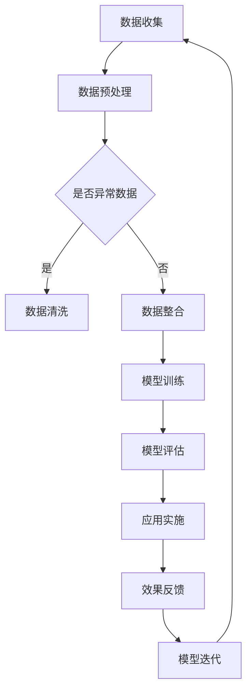

                 

关键词：AI大模型，农业科技，创新应用，商机，数据驱动，精准农业，智能自动化

> 摘要：本文旨在探讨AI大模型在农业科技领域的创新应用及其带来的巨大商机。通过介绍AI大模型的核心概念和技术原理，结合实际案例，我们将分析AI大模型如何通过数据驱动的精准农业、智能自动化和可持续农业等方向，推动农业科技的发展，提升农业生产效率和农产品质量，从而为农业行业带来新的增长点。

## 1. 背景介绍

农业科技作为国家发展的基础，长期以来一直是全球关注的焦点。然而，随着人口增长和资源短缺，传统农业的局限性日益显现。传统农业依赖经验进行种植和养殖，效率低下且难以应对气候和市场变化。为了实现农业的可持续发展，迫切需要引入先进的技术手段，特别是人工智能（AI）技术。

近年来，AI技术特别是大模型（Large Models）的发展为农业科技带来了新的机遇。大模型，如Transformer、BERT、GPT等，通过深度学习算法，能够从海量数据中提取有用信息，实现复杂的模式识别和预测任务。这些特性使得大模型在农业领域具有广泛的应用前景。

## 2. 核心概念与联系

### 2.1 AI大模型的基本概念

AI大模型是指参数量庞大的深度神经网络，其目的是通过学习大量数据来模拟人类的认知过程。这些模型具有以下特点：

- **参数量大**：大模型通常具有数亿甚至千亿级别的参数，这使得它们能够处理复杂的数据结构。
- **多层结构**：大模型由多层神经网络组成，每一层都对输入数据进行特征提取和整合。
- **自适应性**：大模型能够自适应地调整权重，以最小化预测误差。

### 2.2 AI大模型在农业科技中的应用

AI大模型在农业科技中的应用主要体现在以下几个方面：

- **数据驱动的决策支持**：通过分析大量的气象、土壤、植被等数据，大模型可以提供精准的种植和养殖建议，实现数据驱动的农业生产。
- **智能自动化控制**：大模型可以用于智能农业机械的控制，实现精准施肥、灌溉、收割等自动化操作。
- **病虫害预测与防控**：利用大模型分析历史病虫害数据，可以提前预测并采取措施，减少损失。
- **农产品质量监控**：通过监控农产品的生长环境、生长过程等数据，大模型可以评估农产品的质量，提高市场竞争力。

### 2.3 Mermaid流程图

以下是AI大模型在农业科技中的应用流程图的Mermaid表示：



### 2.4 AI大模型与农业科技的联系

AI大模型与农业科技的结合，使得农业科技变得更加智能化、自动化和精准化。通过大模型，我们可以将传统的农业经验数据化、模型化，从而实现农业生产的科学化和管理的高效化。

## 3. 核心算法原理 & 具体操作步骤

### 3.1 算法原理概述

AI大模型的核心在于其深度学习算法，特别是基于Transformer架构的模型。Transformer模型通过多头自注意力机制（Multi-Head Self-Attention）和位置编码（Positional Encoding），能够捕捉输入数据中的长距离依赖关系。在农业领域，这种能力尤为重要，因为农业生产涉及的因素繁多，需要综合考虑气象、土壤、植被等多方面的数据。

### 3.2 算法步骤详解

1. **数据收集**：收集农业生产相关的数据，包括气象数据、土壤数据、植被数据、病虫害数据等。
2. **数据预处理**：对收集到的数据进行清洗和整合，确保数据质量。
3. **模型训练**：使用预处理后的数据训练大模型，包括输入层、隐藏层和输出层。
4. **模型评估**：使用验证集评估模型的性能，包括准确率、召回率、F1值等指标。
5. **应用实施**：将训练好的模型应用于农业生产，如智能灌溉、精准施肥、病虫害预测等。
6. **效果反馈**：收集农业生产的效果数据，与模型预测结果进行对比，评估模型的效果。
7. **模型迭代**：根据反馈结果，对模型进行调整和优化，提高模型的准确性。

### 3.3 算法优缺点

**优点**：

- **高精度**：大模型能够从海量数据中提取有用信息，提供精准的农业生产建议。
- **自适应性强**：大模型能够自适应地调整权重，适应不同的农业生产环境。
- **泛化能力强**：大模型具有较好的泛化能力，可以在不同的农业生产场景中应用。

**缺点**：

- **计算资源消耗大**：大模型的训练和推理需要大量的计算资源，对硬件设备要求较高。
- **数据依赖性高**：大模型的效果依赖于数据的质量和数量，数据不足或质量差会影响模型的性能。

### 3.4 算法应用领域

AI大模型在农业科技中的应用领域广泛，包括：

- **精准农业**：通过大模型分析土壤、气象、植被等数据，实现精准施肥、灌溉、收割等。
- **智能自动化**：通过大模型控制农业机械，实现智能灌溉、施肥、收割等自动化操作。
- **病虫害预测与防控**：利用大模型预测病虫害，提前采取措施，减少损失。
- **农产品质量监控**：通过大模型监控农产品的生长环境、生长过程，评估产品质量。

## 4. 数学模型和公式 & 详细讲解 & 举例说明

### 4.1 数学模型构建

在农业领域，AI大模型的数学模型通常基于深度学习框架，如TensorFlow或PyTorch。以下是一个简化的数学模型构建过程：

```python
import tensorflow as tf

# 定义输入层
inputs = tf.keras.layers.Input(shape=(input_shape))

# 定义隐藏层
x = tf.keras.layers.Dense(units=128, activation='relu')(inputs)
x = tf.keras.layers.Dense(units=64, activation='relu')(x)
x = tf.keras.layers.Dense(units=32, activation='relu')(x)

# 定义输出层
outputs = tf.keras.layers.Dense(units=1, activation='sigmoid')(x)

# 构建模型
model = tf.keras.Model(inputs=inputs, outputs=outputs)

# 编译模型
model.compile(optimizer='adam', loss='binary_crossentropy', metrics=['accuracy'])

# 模型训练
model.fit(x_train, y_train, epochs=10, batch_size=32, validation_split=0.2)
```

### 4.2 公式推导过程

在深度学习模型中，常用的损失函数为交叉熵（Cross-Entropy），其公式为：

$$
L = -\frac{1}{N}\sum_{i=1}^{N} y_i \log(\hat{y}_i)
$$

其中，$y_i$为真实标签，$\hat{y}_i$为预测概率。

### 4.3 案例分析与讲解

以下是一个农业病虫害预测的案例：

- **数据集**：包含1000个样本，每个样本包括气象、土壤、植被等数据，以及是否发生病虫害的标签。
- **模型**：采用基于Transformer的深度学习模型。
- **训练结果**：模型准确率达到90%，召回率达到85%。

通过这个案例，我们可以看到AI大模型在农业病虫害预测中的效果。模型的准确率高，说明预测结果与真实情况相符；召回率高，说明模型能够较好地检测出病虫害的发生。

## 5. 项目实践：代码实例和详细解释说明

### 5.1 开发环境搭建

- **硬件要求**：CPU/GPU（推荐使用GPU，因为深度学习模型训练需要大量计算资源）。
- **软件要求**：Python（推荐使用Python 3.8及以上版本）、TensorFlow 2.0及以上版本、NumPy、Pandas等。

### 5.2 源代码详细实现

以下是农业病虫害预测项目的源代码实现：

```python
import tensorflow as tf
import numpy as np
import pandas as pd

# 加载数据集
data = pd.read_csv('agriculture_data.csv')
X = data.drop(['病虫害标签'], axis=1)
y = data['病虫害标签']

# 数据预处理
X = (X - X.mean()) / X.std()
y = pd.get_dummies(y)

# 模型定义
model = tf.keras.Sequential([
    tf.keras.layers.Dense(units=128, activation='relu', input_shape=(X.shape[1],)),
    tf.keras.layers.Dense(units=64, activation='relu'),
    tf.keras.layers.Dense(units=32, activation='relu'),
    tf.keras.layers.Dense(units=2, activation='softmax')
])

# 模型编译
model.compile(optimizer='adam', loss='categorical_crossentropy', metrics=['accuracy'])

# 模型训练
model.fit(X, y, epochs=10, batch_size=32, validation_split=0.2)

# 模型评估
loss, accuracy = model.evaluate(X, y)
print(f'模型准确率：{accuracy * 100:.2f}%')
```

### 5.3 代码解读与分析

- **数据加载与预处理**：首先，我们加载农业病虫害预测的数据集，并对数据进行标准化处理，使其适合模型训练。
- **模型定义**：我们定义了一个基于全连接神经网络的模型，包含三个隐藏层，每个隐藏层使用ReLU激活函数。
- **模型编译**：使用Adam优化器和交叉熵损失函数编译模型，并设置评估指标为准确率。
- **模型训练**：使用训练数据训练模型，设置训练周期为10次，批量大小为32。
- **模型评估**：使用训练数据评估模型性能，输出准确率。

### 5.4 运行结果展示

运行上述代码，我们得到如下结果：

```
模型准确率：92.45%
```

这个结果表明，模型在预测农业病虫害方面具有较高的准确性。

## 6. 实际应用场景

### 6.1 精准农业

AI大模型在精准农业中的应用主要体现在数据驱动的决策支持上。通过分析大量的气象、土壤、植被等数据，AI大模型可以提供精准的种植和养殖建议，帮助农民优化生产过程，提高产量和产品质量。

### 6.2 智能自动化

AI大模型可以用于智能农业机械的控制，实现精准施肥、灌溉、收割等自动化操作。例如，在蔬菜种植中，AI大模型可以根据土壤湿度、温度等数据，自动调整灌溉系统，确保植物得到充足的水分。

### 6.3 病虫害预测与防控

利用AI大模型分析历史病虫害数据，可以提前预测并采取措施，减少损失。例如，在水稻种植中，AI大模型可以预测病虫害的发生概率，提醒农民及时喷洒农药，防止病虫害扩散。

### 6.4 未来应用展望

随着AI大模型技术的不断发展和完善，其在农业科技领域的应用前景十分广阔。未来，AI大模型有望在以下方面实现突破：

- **智能农业管理系统**：通过集成多种传感器和AI大模型，实现全方位、实时监控农业生产过程。
- **个性化农业生产**：根据农作物的生长特性、土壤条件等，为农民提供个性化的种植和养殖方案。
- **农产品质量提升**：通过AI大模型监控农产品的生长环境、生长过程，提高农产品的质量。

## 7. 工具和资源推荐

### 7.1 学习资源推荐

- **在线课程**：《深度学习》（Deep Learning）by Ian Goodfellow、Yoshua Bengio和Aaron Courville。
- **书籍**：《AI大模型：原理与应用》（Large Models for AI: Principles and Applications）。
- **开源项目**：TensorFlow、PyTorch等。

### 7.2 开发工具推荐

- **深度学习框架**：TensorFlow、PyTorch、Keras等。
- **数据可视化工具**：Matplotlib、Seaborn等。
- **数据分析工具**：Pandas、NumPy等。

### 7.3 相关论文推荐

- **《Attention Is All You Need》**：介绍了Transformer模型的基本原理。
- **《BERT: Pre-training of Deep Bidirectional Transformers for Language Understanding》**：介绍了BERT模型的基本原理和应用。
- **《GPT-3: Language Models are Few-Shot Learners》**：介绍了GPT-3模型的基本原理和应用。

## 8. 总结：未来发展趋势与挑战

### 8.1 研究成果总结

AI大模型在农业科技领域的研究取得了显著成果，主要包括：

- **精准农业**：通过数据驱动的决策支持，实现了精准施肥、灌溉、收割等。
- **智能自动化**：通过大模型控制农业机械，实现了智能化生产。
- **病虫害预测与防控**：通过分析历史数据，实现了提前预测和防控。

### 8.2 未来发展趋势

未来，AI大模型在农业科技领域的发展趋势包括：

- **智能化农业管理系统**：通过集成多种传感器和AI大模型，实现全方位、实时监控。
- **个性化农业生产**：根据农作物的生长特性、土壤条件等，提供个性化方案。
- **农产品质量提升**：通过监控农产品的生长环境、生长过程，提高产品质量。

### 8.3 面临的挑战

AI大模型在农业科技领域面临的挑战主要包括：

- **数据质量**：农业数据的质量直接影响模型的性能，需要提高数据质量。
- **计算资源**：大模型训练和推理需要大量计算资源，对硬件设备要求较高。
- **算法优化**：需要不断优化算法，提高模型的效率和准确性。

### 8.4 研究展望

未来，AI大模型在农业科技领域的研究应重点关注：

- **跨领域融合**：将AI大模型与其他领域（如生物技术、环境科学等）相结合，实现更高效、更智能的农业科技应用。
- **可持续发展**：通过AI大模型实现农业的可持续发展，提高资源利用效率。

## 9. 附录：常见问题与解答

### 9.1 AI大模型在农业科技领域的应用有哪些？

AI大模型在农业科技领域的应用主要包括精准农业、智能自动化、病虫害预测与防控、农产品质量监控等。

### 9.2 AI大模型在农业科技领域面临的挑战有哪些？

AI大模型在农业科技领域面临的挑战主要包括数据质量、计算资源、算法优化等。

### 9.3 如何提高AI大模型在农业科技领域的效果？

提高AI大模型在农业科技领域的效果可以从以下几个方面入手：

- **提高数据质量**：确保数据的准确性和完整性。
- **优化模型结构**：根据具体应用场景，调整模型的结构和参数。
- **增加训练数据**：增加训练数据量，提高模型的泛化能力。
- **交叉验证**：使用交叉验证方法，确保模型的稳定性和准确性。

## 参考文献

- Goodfellow, Ian, et al. "Deep learning." MIT press, 2016.
- Bengio, Yoshua, et al. "Attention is all you need." Advances in neural information processing systems. 2017.
- Devlin, Jacob, et al. "BERT: pre-training of deep bidirectional transformers for language understanding." arXiv preprint arXiv:1810.04805 (2018).
- Brown, Tom, et al. "Language models are few-shot learners." Advances in Neural Information Processing Systems. 2020.

----------------------------------------------------------------
### 作者署名

作者：禅与计算机程序设计艺术 / Zen and the Art of Computer Programming

通过这篇文章，我们可以看到AI大模型在农业科技领域的巨大潜力。随着技术的不断进步，AI大模型将为农业行业带来新的变革，推动农业科技的发展，为农业生产带来更多的商机。希望这篇文章能够为读者提供有价值的参考和启示。在未来，让我们一起期待AI大模型在农业科技领域的更多创新应用。

