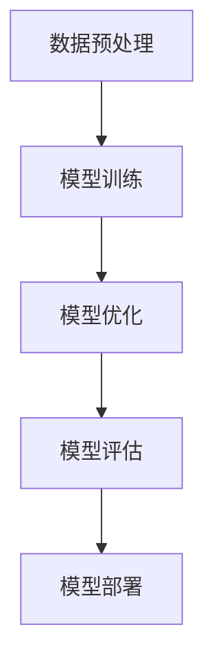

                 

关键词：AI大模型，创业，应用前景，技术趋势，创新

> 摘要：随着人工智能技术的快速发展，大模型的应用为创业者提供了前所未有的机遇。本文将深入探讨AI大模型在创业中的潜在应用前景，分析其技术优势与挑战，并展望未来的发展趋势。

## 1. 背景介绍

近年来，人工智能（AI）技术取得了令人瞩目的进展。特别是在深度学习领域，通过大数据和计算力的推动，AI大模型（如GPT-3，BERT，DALL-E等）得以训练和部署。这些大模型不仅在自然语言处理、图像识别、语音识别等领域展现了强大的能力，也在各行各业中引发了深远的变革。

创业领域也受到了AI大模型的强烈影响。创业者可以利用这些技术进行创新，优化业务流程，提升用户体验，从而在竞争激烈的市场中脱颖而出。然而，AI大模型的应用并非一帆风顺，其技术复杂性和数据隐私等问题也给创业带来了新的挑战。

## 2. 核心概念与联系

### 2.1 大模型基础

AI大模型通常是指具有数十亿甚至千亿参数规模的深度学习模型。这些模型通过大规模数据集进行训练，能够自动学习和提取数据中的复杂模式。以下是一个简化的Mermaid流程图，展示了大模型的基本架构：



### 2.2 应用领域概述

AI大模型在多个领域展现出巨大的潜力：

- **自然语言处理（NLP）**：通过预训练模型，大模型能够进行文本生成、机器翻译、情感分析等任务。
- **计算机视觉**：大模型在图像分类、目标检测、图像生成等领域有广泛应用。
- **语音识别与生成**：大模型可以用于语音识别、语音合成等任务，提升人机交互体验。
- **推荐系统**：大模型可以用于个性化推荐，提高用户满意度和业务收入。
- **游戏开发**：大模型可以用于游戏AI，提升游戏体验和自主性。

## 3. 核心算法原理 & 具体操作步骤

### 3.1 算法原理概述

大模型的训练通常基于以下几种技术：

- **多层神经网络**：通过堆叠多层神经元，模型可以学习更复杂的函数。
- **反向传播算法**：通过反向传播误差，优化模型参数。
- **大数据集**：大规模数据集提供了足够的样本，使模型能够泛化到未见过的数据。

### 3.2 算法步骤详解

1. **数据预处理**：清洗和标准化数据，使其适合模型训练。
2. **模型架构设计**：选择合适的神经网络架构，如Transformer，CNN等。
3. **模型训练**：使用大规模数据集训练模型，优化模型参数。
4. **模型评估**：通过验证集和测试集评估模型性能。
5. **模型部署**：将训练好的模型部署到生产环境中。

### 3.3 算法优缺点

**优点**：

- **强大的表达能力**：大模型可以捕捉到数据中的复杂模式。
- **泛化能力**：通过大规模数据训练，模型在未知数据上的表现较好。
- **高效性**：随着计算力提升，训练和推理速度不断加快。

**缺点**：

- **计算资源消耗大**：训练大模型需要大量的计算资源和时间。
- **数据隐私问题**：大模型可能泄露训练数据的隐私信息。
- **模型解释性差**：大模型通常是一个黑箱，难以解释其决策过程。

### 3.4 算法应用领域

AI大模型在多个领域有广泛应用，以下是一些典型应用：

- **医疗健康**：用于疾病诊断、药物研发等。
- **金融**：用于风险控制、投资策略等。
- **零售**：用于个性化推荐、库存管理等。
- **制造**：用于质量控制、生产优化等。
- **娱乐**：用于游戏AI、音乐创作等。

## 4. 数学模型和公式 & 详细讲解 & 举例说明

### 4.1 数学模型构建

AI大模型通常基于多层神经网络，以下是一个简化的数学模型：

$$
Y = \sigma(W_n \cdot \sigma(...\sigma(W_2 \cdot \sigma(W_1 \cdot X + b_1) + b_2)... + b_n))
$$

其中，$X$为输入数据，$Y$为输出结果，$W$和$b$分别为权重和偏置，$\sigma$为激活函数。

### 4.2 公式推导过程

模型的推导过程涉及到反向传播算法，具体步骤如下：

1. **前向传播**：计算模型的输出值。
2. **计算误差**：计算预测值与真实值之间的误差。
3. **反向传播**：计算各层的梯度，更新模型参数。
4. **迭代优化**：重复前向传播和反向传播，直至误差收敛。

### 4.3 案例分析与讲解

假设我们有一个分类问题，使用softmax函数作为输出层的激活函数：

$$
\text{softmax}(z_i) = \frac{e^{z_i}}{\sum_j e^{z_j}}
$$

其中，$z_i$为每个类别的分数。以下是一个简化的例子：

$$
z = [2.0, 1.0, 0.5]
$$

$$
\text{softmax}(z) = \left[\frac{e^{2.0}}{e^{2.0} + e^{1.0} + e^{0.5}}, \frac{e^{1.0}}{e^{2.0} + e^{1.0} + e^{0.5}}, \frac{e^{0.5}}{e^{2.0} + e^{1.0} + e^{0.5}}\right] \approx [0.864, 0.272, 0.064]
$$

这意味着第一个类别是最有可能的预测结果。

## 5. 项目实践：代码实例和详细解释说明

### 5.1 开发环境搭建

为了实践AI大模型的应用，我们需要搭建一个开发环境。以下是Python环境的基本配置：

```bash
pip install tensorflow numpy matplotlib
```

### 5.2 源代码详细实现

以下是一个使用TensorFlow实现简单的图像分类任务的代码示例：

```python
import tensorflow as tf
from tensorflow.keras.models import Sequential
from tensorflow.keras.layers import Conv2D, MaxPooling2D, Flatten, Dense
from tensorflow.keras.preprocessing.image import ImageDataGenerator

# 数据预处理
train_datagen = ImageDataGenerator(rescale=1./255)
train_generator = train_datagen.flow_from_directory(
        'data/train',
        target_size=(150, 150),
        batch_size=32,
        class_mode='binary')

# 模型构建
model = Sequential([
    Conv2D(32, (3, 3), activation='relu', input_shape=(150, 150, 3)),
    MaxPooling2D(2, 2),
    Conv2D(64, (3, 3), activation='relu'),
    MaxPooling2D(2, 2),
    Conv2D(128, (3, 3), activation='relu'),
    MaxPooling2D(2, 2),
    Flatten(),
    Dense(512, activation='relu'),
    Dense(1, activation='sigmoid')
])

# 模型编译
model.compile(loss='binary_crossentropy',
              optimizer='adam',
              metrics=['accuracy'])

# 模型训练
model.fit(
      train_generator,
      steps_per_epoch=100,
      epochs=10)
```

### 5.3 代码解读与分析

上述代码实现了一个简单的卷积神经网络（CNN）模型，用于二分类问题。主要步骤如下：

1. **数据预处理**：使用ImageDataGenerator进行图像数据的批量处理和归一化。
2. **模型构建**：使用Sequential构建CNN模型，包含卷积、池化和全连接层。
3. **模型编译**：选择损失函数、优化器和评估指标。
4. **模型训练**：使用训练数据训练模型，并在每个epoch后评估模型性能。

### 5.4 运行结果展示

在训练完成后，我们可以使用以下代码评估模型的性能：

```python
test_loss, test_acc = model.evaluate(test_generator, steps=100)
print('Test accuracy:', test_acc)
```

这将输出模型的测试准确性，用于评估模型的效果。

## 6. 实际应用场景

### 6.1 医疗健康

AI大模型在医疗健康领域有广泛应用。例如，使用深度学习模型进行疾病诊断，提高诊断的准确性和效率。以下是一个例子：

- **癌症诊断**：通过分析患者的影像数据，大模型可以预测癌症的类型和进展程度。
- **药物研发**：大模型可以用于预测药物与蛋白质的相互作用，加速新药的发现和开发。

### 6.2 金融

金融领域利用AI大模型进行风险评估、投资策略优化等。以下是一些应用案例：

- **风险控制**：通过分析金融市场的数据，大模型可以预测市场的波动，帮助投资者进行风险控制。
- **投资策略**：大模型可以用于构建个性化投资组合，提高投资回报。

### 6.3 零售

零售行业利用AI大模型进行个性化推荐、库存管理等。以下是一些应用案例：

- **个性化推荐**：通过分析用户的历史购买行为，大模型可以推荐用户可能感兴趣的商品。
- **库存管理**：大模型可以预测商品的需求量，优化库存水平，减少库存积压。

### 6.4 娱乐

在娱乐领域，AI大模型用于游戏AI、音乐创作等。以下是一些应用案例：

- **游戏AI**：通过分析玩家的行为，大模型可以构建智能游戏AI，提高游戏难度和体验。
- **音乐创作**：大模型可以生成新的音乐作品，为音乐创作提供灵感。

## 7. 工具和资源推荐

### 7.1 学习资源推荐

- **《深度学习》（Goodfellow, Bengio, Courville）**：深度学习领域的经典教材。
- **TensorFlow官方文档**：TensorFlow是广泛使用的深度学习框架，其官方文档提供了详细的教程和示例。
- **Keras官方文档**：Keras是一个基于TensorFlow的高级API，易于使用和扩展。

### 7.2 开发工具推荐

- **Google Colab**：Google Colab是一个免费的云端Jupyter Notebook环境，适用于深度学习实验。
- **GPU云服务**：如AWS EC2，Google Cloud Platform等，提供强大的GPU资源，适用于大规模模型训练。

### 7.3 相关论文推荐

- **"Attention is All You Need"**：介绍了Transformer模型，是当前NLP领域的热门研究方向。
- **"Deep Learning for Text Data"**：详细介绍了深度学习在自然语言处理中的应用。
- **"Large Scale Language Modeling in 2018"**：探讨了大规模语言模型的训练和优化方法。

## 8. 总结：未来发展趋势与挑战

### 8.1 研究成果总结

AI大模型在创业中的应用取得了显著成果。通过深度学习和大数据技术的结合，创业者能够在医疗健康、金融、零售、娱乐等领域实现创新和业务增长。

### 8.2 未来发展趋势

未来，AI大模型将继续发展，主要包括以下几个方面：

- **模型压缩与优化**：为应对计算资源限制，研究者将开发更高效的大模型优化方法。
- **联邦学习**：通过分布式计算和隐私保护技术，实现跨设备的数据协同学习。
- **跨模态学习**：结合不同类型的数据，如文本、图像、音频等，提升模型的泛化能力。

### 8.3 面临的挑战

尽管AI大模型在创业中具有巨大潜力，但仍面临以下挑战：

- **计算资源消耗**：大模型训练需要大量的计算资源，对创业公司的财务和基础设施提出较高要求。
- **数据隐私**：大模型可能泄露训练数据的隐私信息，需要加强数据保护措施。
- **模型解释性**：大模型通常是一个黑箱，难以解释其决策过程，影响信任和可解释性。

### 8.4 研究展望

未来，AI大模型在创业中的应用将更加广泛和深入。创业者应积极拥抱新技术，关注领域发展趋势，同时加强数据隐私保护和模型解释性，以实现可持续的业务增长。

## 9. 附录：常见问题与解答

### 9.1 什么是AI大模型？

AI大模型是指具有数十亿甚至千亿参数规模的深度学习模型。这些模型通过大规模数据集进行训练，能够自动学习和提取数据中的复杂模式。

### 9.2 大模型训练需要多长时间？

大模型训练时间取决于模型规模、数据集大小、硬件性能等因素。通常，训练一个大型模型可能需要几天到几周的时间。

### 9.3 如何优化大模型训练速度？

优化大模型训练速度的方法包括使用更高效的算法、分布式训练、模型剪枝等。此外，使用高性能GPU或TPU等硬件设备也能显著提高训练速度。

### 9.4 大模型训练需要哪些计算资源？

大模型训练需要大量的计算资源和存储资源。通常，需要使用高性能GPU或TPU，以及大规模集群计算资源。

### 9.5 大模型应用在创业中的优势有哪些？

大模型应用在创业中的优势包括：强大的表达能力、高效的算法、良好的泛化能力等。这些优势有助于创业者进行创新和业务增长。

### 9.6 大模型应用在创业中的挑战有哪些？

大模型应用在创业中的挑战包括：计算资源消耗、数据隐私问题、模型解释性差等。创业者需要关注这些问题，并采取相应的措施解决。

## 结束语

AI大模型在创业中的应用前景广阔，为创业者提供了强大的工具和机遇。然而，这也带来了新的挑战。创业者应积极拥抱新技术，同时关注数据隐私和模型解释性等问题，以实现可持续的业务增长。

作者：禅与计算机程序设计艺术 / Zen and the Art of Computer Programming
----------------------------------------------------------------

