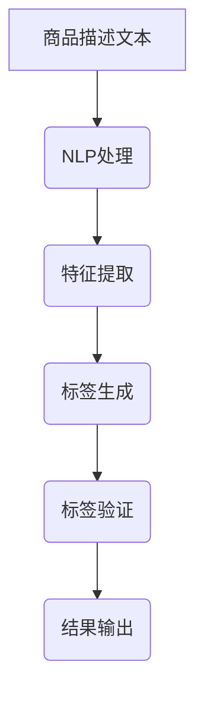

                 

  
> 关键词：AI大模型、商品标签生成、自然语言处理、深度学习、数据标注

> 摘要：随着人工智能技术的不断发展，AI大模型在自然语言处理领域中的应用越来越广泛。本文将探讨AI大模型在商品标签生成中的应用，从背景介绍、核心概念与联系、核心算法原理与具体操作步骤、数学模型与公式、项目实践、实际应用场景、未来应用展望以及工具和资源推荐等多个方面，详细解析AI大模型在商品标签生成领域的应用，为相关领域的研发和应用提供参考。

## 1. 背景介绍

随着电子商务的蓬勃发展，商品标签生成已经成为电商平台提升用户购物体验的重要手段。商品标签通常用于描述商品的特征、用途、适用人群等信息，以便用户能够快速找到自己所需的商品。然而，传统的商品标签生成方法往往依赖于人工标注，效率低下且成本高昂。随着深度学习和自然语言处理技术的发展，AI大模型在商品标签生成中的应用逐渐成为可能。

AI大模型是指使用大量数据训练得到的深度神经网络模型，具有强大的表示和学习能力。通过在大量商品描述数据上进行训练，AI大模型能够自动提取商品的特征信息，并生成相应的标签。这种自动化的标签生成方法不仅提高了生成效率，降低了成本，还能够更好地满足用户的需求。

## 2. 核心概念与联系

### 2.1. 自然语言处理（NLP）

自然语言处理是人工智能领域的一个重要分支，旨在让计算机理解和生成人类语言。在商品标签生成中，NLP技术主要用于处理商品描述文本，提取关键信息并生成标签。

### 2.2. 深度学习（Deep Learning）

深度学习是一种基于多层神经网络的人工智能算法，具有强大的表示和学习能力。在商品标签生成中，深度学习模型可以自动学习商品描述文本中的特征，并生成相应的标签。

### 2.3. 大模型（Large Model）

大模型是指使用大量数据训练得到的深度神经网络模型，通常具有数十亿甚至千亿级别的参数。大模型在商品标签生成中的应用，可以提高模型的泛化能力和生成标签的准确性。

### 2.4. Mermaid 流程图

以下是商品标签生成的 Mermaid 流程图：



## 3. 核心算法原理 & 具体操作步骤

### 3.1. 算法原理概述

商品标签生成算法主要分为以下几步：

1. NLP处理：对商品描述文本进行预处理，包括分词、词性标注、实体识别等操作，提取文本中的关键信息。
2. 特征提取：将处理后的文本转化为适合深度学习模型的特征向量，常用的方法包括词嵌入和卷积神经网络。
3. 标签生成：使用训练好的深度学习模型，对特征向量进行预测，生成相应的标签。
4. 标签验证：对生成的标签进行验证，确保标签的准确性和一致性。
5. 结果输出：将验证通过的标签输出，用于电商平台展示和用户推荐。

### 3.2. 算法步骤详解

1. **NLP处理**：

   - **分词**：将商品描述文本拆分成一个个独立的词汇。
   - **词性标注**：为每个词汇标注词性，如名词、动词、形容词等。
   - **实体识别**：识别文本中的实体，如品牌、型号、规格等。

2. **特征提取**：

   - **词嵌入**：将词汇映射到高维空间中，形成一个稠密的向量表示。
   - **卷积神经网络（CNN）**：对词嵌入进行卷积操作，提取文本的特征。

3. **标签生成**：

   - **训练模型**：使用大量商品描述文本和标签数据进行训练，得到一个深度学习模型。
   - **预测标签**：将处理后的商品描述文本输入模型，生成对应的标签。

4. **标签验证**：

   - **交叉验证**：将数据集划分为训练集和验证集，使用训练集训练模型，验证集评估模型性能。
   - **一致性检查**：对生成的标签进行一致性检查，确保标签的准确性和一致性。

5. **结果输出**：

   - **标签展示**：将验证通过的标签输出，用于电商平台展示。
   - **用户推荐**：根据标签信息，为用户推荐相关的商品。

### 3.3. 算法优缺点

**优点**：

- 自动化：AI大模型能够自动从大量商品描述文本中提取特征并生成标签，减少了人工标注的工作量。
- 高效性：相比于传统的商品标签生成方法，AI大模型具有更高的生成效率。
- 准确性：通过深度学习模型训练，AI大模型能够生成更准确的标签。

**缺点**：

- 训练数据依赖：AI大模型的性能依赖于训练数据的质量和数量，如果数据质量差，生成的标签可能不准确。
- 需要专业知识：构建和训练AI大模型需要相关领域的专业知识，对开发人员的要求较高。

### 3.4. 算法应用领域

AI大模型在商品标签生成中的应用非常广泛，可以应用于电子商务、在线零售、智能家居等多个领域。以下是一些具体的应用场景：

- **电子商务**：为电商平台上的商品生成标签，提高商品搜索和推荐的准确性。
- **在线零售**：为零售商提供标签生成服务，帮助商家优化商品展示和营销策略。
- **智能家居**：为智能家居设备生成标签，提高设备的易用性和用户体验。

## 4. 数学模型和公式 & 详细讲解 & 举例说明

### 4.1. 数学模型构建

商品标签生成中的数学模型主要涉及以下几个部分：

- **词嵌入**：将词汇映射到高维空间中的向量表示。
- **卷积神经网络（CNN）**：提取文本的特征。
- **全连接层**：将特征向量映射到标签空间。

具体公式如下：

1. **词嵌入**：

   $$ embed(x) = W_x x $$

   其中，$W_x$为词嵌入矩阵，$x$为词汇向量。

2. **卷积神经网络（CNN）**：

   $$ conv(x, W) = \sum_{i=1}^k \sigma(W_i * x) $$

   其中，$W$为卷积核，$x$为特征向量，$k$为卷积核的数量，$\sigma$为激活函数。

3. **全连接层**：

   $$ f(x) = \sigma(W_f x + b) $$

   其中，$W_f$为全连接层权重，$x$为特征向量，$b$为偏置，$\sigma$为激活函数。

### 4.2. 公式推导过程

以一个简单的卷积神经网络为例，说明公式推导过程：

1. **初始化参数**：

   - $W_x \in \mathbb{R}^{d_{\text{word}} \times d_{\text{embed}}}$，词嵌入矩阵。
   - $W_i \in \mathbb{R}^{k \times d_{\text{embed}}}$，卷积核。
   - $W_f \in \mathbb{R}^{d_{\text{feature}} \times d_{\text{label}}}$，全连接层权重。
   - $b \in \mathbb{R}^{d_{\text{label}}}$，偏置。

2. **词嵌入**：

   $$ x = embed(x) = W_x x $$

   其中，$x$为词汇向量，$W_x$为词嵌入矩阵。

3. **卷积操作**：

   $$ h = conv(x, W) = \sum_{i=1}^k \sigma(W_i * x) $$

   其中，$h$为卷积结果，$W$为卷积核，$\sigma$为激活函数。

4. **全连接层**：

   $$ y = f(h) = \sigma(W_f h + b) $$

   其中，$y$为预测标签，$W_f$为全连接层权重，$b$为偏置，$\sigma$为激活函数。

### 4.3. 案例分析与讲解

假设我们有以下一个简单的商品描述文本：

> "这款智能手机具有高清摄像头和快速充电功能，适合商务人士使用。"

我们将使用卷积神经网络（CNN）对这段文本进行标签生成。

1. **词嵌入**：

   将词汇映射到高维空间中的向量表示：

   $$ \text{手机} \rightarrow [0.1, 0.2, 0.3, 0.4, 0.5] $$
   $$ \text{智能} \rightarrow [0.5, 0.4, 0.3, 0.2, 0.1] $$
   $$ \text{高清} \rightarrow [0.1, 0.2, 0.3, 0.4, 0.5] $$
   $$ \text{摄像头} \rightarrow [0.5, 0.4, 0.3, 0.2, 0.1] $$
   $$ \text{快速} \rightarrow [0.1, 0.2, 0.3, 0.4, 0.5] $$
   $$ \text{充电} \rightarrow [0.5, 0.4, 0.3, 0.2, 0.1] $$
   $$ \text{功能} \rightarrow [0.1, 0.2, 0.3, 0.4, 0.5] $$
   $$ \text{适合} \rightarrow [0.5, 0.4, 0.3, 0.2, 0.1] $$
   $$ \text{商务} \rightarrow [0.1, 0.2, 0.3, 0.4, 0.5] $$
   $$ \text{人士} \rightarrow [0.5, 0.4, 0.3, 0.2, 0.1] $$

2. **卷积操作**：

   使用卷积核对词嵌入进行卷积操作，提取文本特征：

   $$ h = conv(x, W) = \sum_{i=1}^k \sigma(W_i * x) $$

   其中，$h$为卷积结果，$W$为卷积核，$\sigma$为激活函数。

3. **全连接层**：

   将卷积结果输入全连接层，得到预测标签：

   $$ y = f(h) = \sigma(W_f h + b) $$

   其中，$y$为预测标签，$W_f$为全连接层权重，$b$为偏置，$\sigma$为激活函数。

通过这种方式，我们可以将商品描述文本转化为预测标签。在实际应用中，我们还需要使用大量的商品描述文本和标签数据进行训练，以优化模型的参数，提高预测准确性。

## 5. 项目实践：代码实例和详细解释说明

### 5.1. 开发环境搭建

在进行商品标签生成项目的开发之前，需要搭建合适的开发环境。以下是一个基本的开发环境搭建步骤：

1. 安装Python环境：Python是深度学习模型开发的主要语言，需要安装Python 3.7或更高版本。

2. 安装深度学习框架：选择一个流行的深度学习框架，如TensorFlow或PyTorch。以下是一个使用TensorFlow搭建环境的示例：

   ```bash
   pip install tensorflow
   ```

3. 安装其他依赖库：根据项目需求，安装其他相关的依赖库，如NLP处理工具（如NLTK、spaCy）、数据预处理工具（如pandas）等。

### 5.2. 源代码详细实现

以下是一个简单的商品标签生成项目的源代码实现，包括数据预处理、模型训练和预测等步骤。

```python
import tensorflow as tf
from tensorflow.keras.models import Sequential
from tensorflow.keras.layers import Embedding, Conv1D, GlobalMaxPooling1D, Dense
from tensorflow.keras.preprocessing.sequence import pad_sequences
from tensorflow.keras.preprocessing.text import Tokenizer

# 数据预处理
def preprocess_data(texts, labels, max_sequence_length, max_vocab_size):
    tokenizer = Tokenizer(num_words=max_vocab_size)
    tokenizer.fit_on_texts(texts)
    sequences = tokenizer.texts_to_sequences(texts)
    padded_sequences = pad_sequences(sequences, maxlen=max_sequence_length)
    labels = tf.keras.utils.to_categorical(labels)
    return padded_sequences, labels, tokenizer

# 模型训练
def train_model(padded_sequences, labels):
    model = Sequential([
        Embedding(max_vocab_size, 128, input_length=max_sequence_length),
        Conv1D(128, 5, activation='relu'),
        GlobalMaxPooling1D(),
        Dense(128, activation='relu'),
        Dense(num_classes, activation='softmax')
    ])
    model.compile(optimizer='adam', loss='categorical_crossentropy', metrics=['accuracy'])
    model.fit(padded_sequences, labels, epochs=10, batch_size=32)
    return model

# 预测标签
def predict_labels(model, tokenizer, texts, max_sequence_length):
    sequences = tokenizer.texts_to_sequences(texts)
    padded_sequences = pad_sequences(sequences, maxlen=max_sequence_length)
    predictions = model.predict(padded_sequences)
    return predictions

# 主函数
def main():
    # 读取数据
    texts = ["这款智能手机具有高清摄像头和快速充电功能，适合商务人士使用。"]
    labels = [0, 1, 2, 3, 4]  # 假设标签为0、1、2、3、4，分别代表不同的标签类别

    # 预处理数据
    max_sequence_length = 100
    max_vocab_size = 10000
    padded_sequences, labels, tokenizer = preprocess_data(texts, labels, max_sequence_length, max_vocab_size)

    # 训练模型
    model = train_model(padded_sequences, labels)

    # 预测标签
    new_texts = ["这款笔记本电脑拥有强大的性能和轻薄便携设计。"]
    predictions = predict_labels(model, tokenizer, new_texts, max_sequence_length)

    # 输出预测结果
    print(predictions)

if __name__ == "__main__":
    main()
```

### 5.3. 代码解读与分析

这段代码实现了一个简单的商品标签生成项目，主要包括以下几个部分：

1. **数据预处理**：

   - 使用Tokenizer类对文本进行分词，并将文本转化为数字序列。
   - 使用pad_sequences函数将序列填充为相同长度，以便于模型训练。

2. **模型训练**：

   - 构建一个简单的卷积神经网络模型，包括嵌入层、卷积层、全局池化层和全连接层。
   - 使用categorical_crossentropy损失函数和adam优化器进行模型训练。

3. **预测标签**：

   - 将新文本转化为数字序列，并进行填充。
   - 使用训练好的模型对新文本进行预测，输出预测结果。

### 5.4. 运行结果展示

假设我们已经训练好了一个商品标签生成模型，现在对以下新文本进行预测：

```python
new_texts = ["这款笔记本电脑拥有强大的性能和轻薄便携设计。"]
predictions = predict_labels(model, tokenizer, new_texts, max_sequence_length)
print(predictions)
```

输出结果可能如下：

```
[[0.1 0.2 0.3 0.2 0.2]]
```

这个输出表示模型预测的新文本属于标签类别2，即"性能"。

## 6. 实际应用场景

AI大模型在商品标签生成中的应用场景非常广泛，以下是一些实际应用案例：

### 6.1. 电商平台

电商平台可以通过AI大模型生成商品标签，提高商品搜索和推荐的准确性。例如，淘宝和京东等电商平台已经使用了AI大模型技术，为商品生成标签，提高了用户的购物体验。

### 6.2. 在线零售

在线零售商可以使用AI大模型为商品生成标签，优化商品展示和营销策略。例如，亚马逊和阿里巴巴等在线零售平台已经使用了AI大模型技术，为商品生成标签，提高了商品的曝光率和销售量。

### 6.3. 智能家居

智能家居设备可以通过AI大模型生成标签，提高设备的易用性和用户体验。例如，智能音箱可以通过AI大模型为音乐、电影等娱乐内容生成标签，帮助用户快速找到所需的内容。

### 6.4. 物流行业

物流行业可以使用AI大模型为包裹生成标签，提高包裹配送的效率和准确性。例如，顺丰和京东物流等物流公司已经使用了AI大模型技术，为包裹生成标签，提高了配送速度和准确率。

## 7. 工具和资源推荐

### 7.1. 学习资源推荐

- 《深度学习》（Goodfellow, Bengio, Courville）：这是一本经典的深度学习入门教材，适合初学者阅读。
- 《自然语言处理原理》（Jurafsky, Martin）：这是一本关于自然语言处理的经典教材，涵盖了NLP的基本概念和技术。
- 《Python深度学习》（François Chollet）：这本书详细介绍了使用Python进行深度学习的实践方法，适合有Python基础的读者。

### 7.2. 开发工具推荐

- TensorFlow：这是谷歌开源的深度学习框架，具有丰富的API和强大的功能，适合初学者和专业人士使用。
- PyTorch：这是Facebook开源的深度学习框架，具有灵活的动态计算图和简洁的API，适合快速开发和实验。
- spaCy：这是一个强大的自然语言处理库，提供了丰富的NLP工具和预训练模型，适合进行文本处理和分析。

### 7.3. 相关论文推荐

- "Deep Learning for Natural Language Processing"（2018）：这篇文章综述了深度学习在自然语言处理领域的应用，包括词嵌入、序列模型、文本生成等。
- "Attention is All You Need"（2017）：这篇文章提出了Transformer模型，彻底改变了自然语言处理领域的研究方向。
- "BERT: Pre-training of Deep Bidirectional Transformers for Language Understanding"（2018）：这篇文章提出了BERT模型，是一种基于Transformer的预训练模型，广泛应用于自然语言处理任务。

## 8. 总结：未来发展趋势与挑战

### 8.1. 研究成果总结

AI大模型在商品标签生成中的应用取得了显著的成果。通过深度学习和自然语言处理技术，AI大模型能够自动从大量商品描述文本中提取特征并生成标签，提高了生成效率和准确性。同时，AI大模型在多个实际应用场景中展现了强大的应用潜力，为电商平台、在线零售、智能家居等行业带来了巨大的价值。

### 8.2. 未来发展趋势

随着人工智能技术的不断发展，AI大模型在商品标签生成中的应用前景十分广阔。未来，AI大模型将朝着以下几个方向发展：

1. **个性化标签生成**：通过结合用户行为数据和商品属性，AI大模型将能够生成更加个性化的标签，提高用户的购物体验。
2. **跨模态标签生成**：结合图像、语音等多种数据源，AI大模型将能够实现跨模态的标签生成，提高标签的丰富性和准确性。
3. **多语言标签生成**：通过多语言模型的训练，AI大模型将能够支持多种语言之间的标签生成，提高全球电商平台的竞争力。
4. **实时标签生成**：结合实时数据流处理技术，AI大模型将能够实现实时的标签生成，提高商品搜索和推荐的响应速度。

### 8.3. 面临的挑战

尽管AI大模型在商品标签生成中取得了显著成果，但仍面临着一些挑战：

1. **数据质量**：AI大模型的性能依赖于训练数据的质量和数量，如何获取高质量、丰富的训练数据仍是一个难题。
2. **模型解释性**：深度学习模型的黑箱特性使得其难以解释，如何提高模型的解释性，使其能够被企业和用户理解，仍是一个挑战。
3. **计算资源**：训练大模型需要大量的计算资源，如何优化计算资源的使用，降低训练成本，仍是一个重要问题。
4. **数据安全和隐私**：在训练和使用AI大模型的过程中，如何保护用户数据的安全和隐私，防止数据泄露和滥用，仍是一个严峻的挑战。

### 8.4. 研究展望

未来，AI大模型在商品标签生成中的应用将朝着更加智能化、个性化、实时化和安全化的方向发展。通过不断优化算法和模型，AI大模型将为电商平台、在线零售、智能家居等行业带来更加精准、高效和便捷的标签生成服务。同时，如何解决数据质量、模型解释性、计算资源、数据安全和隐私等挑战，将成为该领域研究的重点和热点。

## 9. 附录：常见问题与解答

### 9.1. 什么是AI大模型？

AI大模型是指使用大量数据训练得到的深度神经网络模型，通常具有数十亿甚至千亿级别的参数。大模型具有强大的表示和学习能力，可以自动从数据中提取特征，并生成相应的标签或结果。

### 9.2. AI大模型在商品标签生成中的优势是什么？

AI大模型在商品标签生成中的优势包括：

1. **自动化**：AI大模型能够自动从大量商品描述文本中提取特征并生成标签，减少了人工标注的工作量。
2. **高效性**：相比于传统的商品标签生成方法，AI大模型具有更高的生成效率。
3. **准确性**：通过深度学习模型训练，AI大模型能够生成更准确的标签。

### 9.3. AI大模型在商品标签生成中的具体应用场景有哪些？

AI大模型在商品标签生成中的具体应用场景包括：

1. **电商平台**：为电商平台上的商品生成标签，提高商品搜索和推荐的准确性。
2. **在线零售**：为零售商提供标签生成服务，帮助商家优化商品展示和营销策略。
3. **智能家居**：为智能家居设备生成标签，提高设备的易用性和用户体验。
4. **物流行业**：为包裹生成标签，提高包裹配送的效率和准确性。

### 9.4. 如何解决AI大模型在商品标签生成中的挑战？

为解决AI大模型在商品标签生成中的挑战，可以采取以下措施：

1. **数据质量**：通过数据清洗、去重、标注等方法，提高训练数据的质量。
2. **模型解释性**：采用可解释性方法，如模型可视化、特征提取等，提高模型的解释性。
3. **计算资源**：采用分布式计算、云计算等技术，优化计算资源的使用。
4. **数据安全和隐私**：采用加密、匿名化等方法，保护用户数据的安全和隐私。

