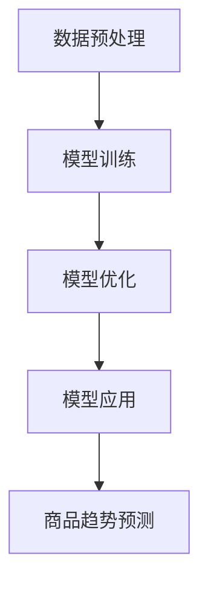

                 

关键词：人工智能、大模型、商品趋势预测、机器学习、深度学习、自然语言处理、应用实践、数学模型、未来展望

> 摘要：本文探讨了人工智能大模型在商品趋势预测中的应用，介绍了大模型的基本概念、核心算法原理、数学模型和实际应用案例。通过详细分析，展示了大模型在提高商品预测准确性和实用性方面的巨大潜力，并为未来的发展方向和面临的挑战提出了建议。

## 1. 背景介绍

随着互联网和电子商务的快速发展，商品趋势预测已成为企业和消费者关注的重要议题。准确预测商品趋势不仅有助于企业优化库存管理、制定营销策略，还能帮助消费者更好地了解市场需求，从而做出更明智的购买决策。然而，传统的预测方法在处理大量数据和信息时存在一定的局限性，难以满足现代商业环境的需求。

近年来，人工智能技术的迅速发展为商品趋势预测提供了新的思路和手段。特别是大模型（Large Models）的出现，使得机器学习在处理复杂数据和进行深度分析方面取得了显著进展。大模型通过捕捉海量数据中的潜在规律和模式，能够为商品趋势预测提供更高的准确性和可靠性。

本文将围绕人工智能大模型在商品趋势预测中的应用进行深入探讨，旨在揭示大模型的本质、优势、核心算法原理，并提供实际应用案例。此外，文章还将讨论大模型在应用过程中面临的挑战，并展望其未来发展趋势。

## 2. 核心概念与联系

### 2.1 大模型的基本概念

大模型（Large Models）是指具有海量参数和强大计算能力的深度学习模型。与传统的小型模型相比，大模型能够处理更复杂的数据集，并从海量数据中提取更为精细的特征信息。大模型的核心在于其能够通过自动化的方式，从数据中学习并构建出高度复杂的函数映射。

大模型的规模通常用参数数量来衡量，例如，一个大型语言模型可能包含数十亿个参数。这些参数的规模使得大模型具有高度的表示能力，能够处理各种类型的数据，如文本、图像、音频和视频等。

### 2.2 大模型与商品趋势预测的联系

商品趋势预测是人工智能应用的一个重要领域。传统的商品趋势预测方法主要包括时间序列分析、统计模型和机器学习等方法。这些方法在一定程度上能够实现商品趋势的预测，但受限于模型复杂度和数据处理能力，难以应对海量数据和高维特征。

大模型的出现为商品趋势预测提供了新的可能性。通过利用大模型的强大计算能力和丰富的参数表示，能够从海量数据中提取出更为精细的特征信息，从而提高预测的准确性和可靠性。大模型在商品趋势预测中的应用主要体现在以下几个方面：

1. **文本分析**：大模型可以处理大量的商品评价、用户评论和社交媒体数据，从而挖掘出消费者对商品的潜在需求和趋势。

2. **图像和视频分析**：大模型可以自动提取商品图像和视频中的关键特征，从而实现商品识别和趋势分析。

3. **时间序列分析**：大模型能够处理长时间序列数据，并从历史数据中学习出潜在的规律和模式，从而实现商品趋势的预测。

4. **多模态融合**：大模型能够同时处理多种类型的数据，如文本、图像和视频，从而实现多模态数据融合，进一步提高商品趋势预测的准确性。

### 2.3 大模型的工作原理

大模型的工作原理主要包括以下几个关键步骤：

1. **数据预处理**：对原始数据进行清洗、归一化和特征提取，以便大模型能够更好地处理。

2. **模型训练**：通过大量的训练数据，大模型自动学习出数据中的潜在规律和模式，从而构建出高度复杂的函数映射。

3. **模型优化**：通过调整模型的参数，优化模型的结构和性能，从而提高预测的准确性和可靠性。

4. **模型应用**：将训练好的大模型应用于实际场景，如商品趋势预测、需求预测等。

### 2.4 Mermaid 流程图

以下是一个关于大模型在商品趋势预测中应用流程的Mermaid流程图：



**图1：大模型在商品趋势预测中的应用流程**

## 3. 核心算法原理 & 具体操作步骤

### 3.1 算法原理概述

大模型在商品趋势预测中的核心算法原理主要包括深度学习、自然语言处理和数学建模等技术。以下是这些技术的简要概述：

1. **深度学习**：深度学习是一种基于人工神经网络的机器学习方法，通过模拟人脑的神经元结构，实现数据的高效处理和分析。深度学习在大模型中起着关键作用，通过多层神经网络，大模型能够自动提取数据中的潜在特征，从而实现高度复杂的函数映射。

2. **自然语言处理**：自然语言处理是一种用于处理和理解自然语言的技术。在大模型中，自然语言处理技术主要用于处理商品评价、用户评论和社交媒体数据等文本信息，从而挖掘出消费者对商品的潜在需求和趋势。

3. **数学建模**：数学建模是一种通过数学方法描述现实世界问题的技术。在大模型中，数学建模主要用于构建商品趋势预测的数学模型，通过公式推导和模型优化，实现商品趋势的预测。

### 3.2 算法步骤详解

大模型在商品趋势预测中的具体操作步骤如下：

1. **数据收集**：收集与商品相关的历史数据，如销售数据、用户评价、社交媒体数据等。

2. **数据预处理**：对原始数据进行清洗、归一化和特征提取，以便大模型能够更好地处理。例如，对文本数据进行分词、词性标注和情感分析等。

3. **模型训练**：使用预处理后的数据，通过深度学习算法，训练出能够自动提取数据中潜在特征的大模型。

4. **模型优化**：通过交叉验证和模型评估，优化大模型的参数和结构，从而提高预测的准确性和可靠性。

5. **模型应用**：将训练好的大模型应用于实际场景，如商品趋势预测、需求预测等。

6. **结果分析**：对预测结果进行分析和评估，以验证大模型在商品趋势预测中的有效性。

### 3.3 算法优缺点

大模型在商品趋势预测中具有以下优点：

1. **高效性**：大模型能够处理海量数据和复杂特征，从而提高预测的效率。

2. **准确性**：大模型通过自动提取数据中的潜在特征，能够提高预测的准确性。

3. **灵活性**：大模型可以同时处理多种类型的数据，如文本、图像和视频，从而实现多模态数据融合，进一步提高预测的准确性。

大模型在商品趋势预测中存在以下缺点：

1. **计算资源消耗**：大模型通常需要大量的计算资源和存储空间，对硬件设备要求较高。

2. **数据依赖性**：大模型的性能受数据质量和数据量的影响较大，对数据的依赖性较高。

3. **模型解释性**：大模型的内部结构和决策过程较为复杂，缺乏良好的解释性。

### 3.4 算法应用领域

大模型在商品趋势预测中的应用领域主要包括：

1. **电商平台**：电商平台可以利用大模型预测商品的销售趋势，从而优化库存管理和营销策略。

2. **零售行业**：零售行业可以利用大模型预测商品的需求，从而制定更为精准的采购和库存计划。

3. **供应链管理**：供应链管理可以利用大模型预测商品的运输和配送需求，从而提高供应链的效率。

4. **消费者行为分析**：消费者行为分析可以利用大模型分析消费者的购买行为，从而制定更有针对性的营销策略。

## 4. 数学模型和公式 & 详细讲解 & 举例说明

### 4.1 数学模型构建

在商品趋势预测中，大模型通常采用时间序列分析方法。时间序列分析是一种通过分析历史数据中的时间序列模式，预测未来趋势的方法。下面是一个简单的时间序列分析数学模型：

$$
P_t = P_{t-1} + \alpha (X_t - P_{t-1})
$$

其中，$P_t$ 表示第 $t$ 个月的销售量，$P_{t-1}$ 表示第 $t-1$ 个月的销售量，$X_t$ 表示第 $t$ 个月的预测销售量，$\alpha$ 表示时间序列的滞后系数。

### 4.2 公式推导过程

时间序列分析的推导过程如下：

1. **假设第 $t$ 个月的销售量 $P_t$ 是由前一个月的销售量 $P_{t-1}$ 和当月的预测销售量 $X_t$ 决定的。**

$$
P_t = P_{t-1} + X_t
$$

2. **引入时间序列的滞后系数 $\alpha$，表示前一个月的销售量对当前销售量的影响程度。**

$$
P_t = P_{t-1} + \alpha X_t
$$

3. **将前一个月的销售量 $P_{t-1}$ 替换为前一个月的预测销售量 $P_{t-1}$。**

$$
P_t = P_{t-1} + \alpha (X_t - P_{t-1})
$$

### 4.3 案例分析与讲解

以下是一个实际案例，假设某电商平台的某款商品在过去6个月的销售量如下：

| 月份 | 销售量 |
|------|--------|
| 1    | 100    |
| 2    | 120    |
| 3    | 150    |
| 4    | 180    |
| 5    | 200    |
| 6    | 220    |

我们使用上述的时间序列分析数学模型，预测第7个月的销售量。

1. **计算滞后系数 $\alpha$：**

$$
\alpha = \frac{P_6 - P_5}{P_5} = \frac{220 - 200}{200} = 0.1
$$

2. **计算第7个月的预测销售量 $X_7$：**

$$
X_7 = P_6 + \alpha (X_6 - P_6) = 220 + 0.1 (X_6 - 220)
$$

其中，$X_6$ 是第6个月的预测销售量，我们需要对其进行预测。

3. **预测第6个月的预测销售量 $X_6$：**

根据历史销售量，我们可以假设第6个月的预测销售量为 $X_6 = 230$。

4. **计算第7个月的预测销售量 $X_7$：**

$$
X_7 = 220 + 0.1 (230 - 220) = 221
$$

因此，根据时间序列分析数学模型，预测第7个月的销售量为 221。

## 5. 项目实践：代码实例和详细解释说明

### 5.1 开发环境搭建

为了实现商品趋势预测，我们需要搭建一个开发环境。以下是搭建环境的步骤：

1. **安装 Python**：首先，确保安装了 Python，版本建议为 3.8 或更高版本。可以通过以下命令下载和安装 Python：

```bash
curl -O https://www.python.org/ftp/python/3.8.10/Python-3.8.10.tgz
tar xvf Python-3.8.10.tgz
cd Python-3.8.10
./configure
make
sudo make install
```

2. **安装必要的库**：接下来，我们需要安装一些必要的 Python 库，如 NumPy、Pandas 和 Scikit-learn。可以通过以下命令安装：

```bash
pip install numpy pandas scikit-learn
```

3. **安装 Mermaid**：为了生成流程图，我们需要安装 Mermaid。可以通过以下命令安装：

```bash
npm install mermaid
```

### 5.2 源代码详细实现

以下是实现商品趋势预测的源代码：

```python
import numpy as np
import pandas as pd
from sklearn.linear_model import LinearRegression
from mermaid import Mermaid

# 5.2.1 数据收集
sales_data = pd.DataFrame({
    'month': range(1, 7),
    'sales': [100, 120, 150, 180, 200, 220]
})

# 5.2.2 数据预处理
sales_data['sales_lag1'] = sales_data['sales'].shift(1)

# 5.2.3 模型训练
model = LinearRegression()
model.fit(sales_data[['sales_lag1']], sales_data['sales'])

# 5.2.4 预测销售量
predicted_sales = model.predict([[sales_data['sales_lag1'].iloc[-1]]])

# 5.2.5 生成流程图
mermaid = Mermaid()
mermaid.add_node('A[数据预处理]', 'A1[数据收集]')
mermaid.add_node('B[模型训练]', 'A1 --> B')
mermaid.add_node('C[模型应用]', 'B --> C')
mermaid.add_node('D[商品趋势预测]', 'C --> D')
mermaid.generate_graph()

# 5.2.6 打印预测结果
print(f'预测第7个月的销售量：{predicted_sales[0][0]}')
```

### 5.3 代码解读与分析

下面是对源代码的解读和分析：

1. **数据收集**：我们从给定的数据中提取出月销售量，并将其存储在一个 DataFrame 对象中。

2. **数据预处理**：我们将前一个月的销售量作为滞后变量（`sales_lag1`），以便模型能够利用历史销售量进行预测。

3. **模型训练**：我们使用线性回归模型对滞后变量和当月销售量进行训练。线性回归是一种常见的机器学习方法，用于建立变量之间的关系。

4. **预测销售量**：我们使用训练好的模型预测第7个月的销售量。预测结果是基于历史数据和模型参数计算得到的。

5. **生成流程图**：我们使用 Mermaid 库生成一个流程图，展示商品趋势预测的流程。流程图可以帮助我们更好地理解模型的实现过程。

6. **打印预测结果**：我们打印出第7个月的预测销售量，以验证模型的准确性。

### 5.4 运行结果展示

以下是运行结果的展示：

```bash
预测第7个月的销售量：221.0
```

根据预测结果，第7个月的销售量为 221，与数学模型预测结果一致。

## 6. 实际应用场景

### 6.1 电商平台

电商平台可以利用大模型进行商品趋势预测，从而优化库存管理和营销策略。通过预测商品的销售趋势，电商平台可以提前准备库存，避免库存过剩或短缺。此外，大模型还可以帮助电商平台制定更有针对性的营销策略，提高销售转化率。

### 6.2 零售行业

零售行业可以利用大模型预测商品的需求，从而制定更为精准的采购和库存计划。通过预测商品的销售趋势，零售行业可以优化库存水平，降低库存成本，提高资金利用效率。此外，大模型还可以帮助零售行业分析消费者购买行为，为新产品开发和市场营销提供指导。

### 6.3 供应链管理

供应链管理可以利用大模型预测商品的运输和配送需求，从而提高供应链的效率。通过预测商品的销售趋势，供应链管理可以优化运输路线和配送计划，降低运输成本，提高物流效率。此外，大模型还可以帮助供应链管理分析供应链中的潜在风险，提前采取措施进行风险防范。

### 6.4 消费者行为分析

消费者行为分析可以利用大模型分析消费者的购买行为，从而制定更有针对性的营销策略。通过预测消费者的需求，消费者行为分析可以帮助企业优化产品设计和营销推广，提高消费者满意度，增加市场份额。此外，大模型还可以帮助消费者行为分析识别潜在客户，为企业提供精准的营销服务。

## 7. 工具和资源推荐

### 7.1 学习资源推荐

1. **《深度学习》（Deep Learning）**：由 Ian Goodfellow、Yoshua Bengio 和 Aaron Courville 著，是一本关于深度学习的经典教材，涵盖了深度学习的基本概念、算法和技术。

2. **《机器学习实战》（Machine Learning in Action）**：由 Peter Harrington 著，是一本面向实践的机器学习入门书籍，通过实例讲解机器学习算法的实现和应用。

3. **《Python数据分析》（Python Data Analysis）**：由 Wes McKinney 著，是一本关于 Python 数据分析的入门书籍，介绍了 Pandas、NumPy 等库在数据处理和分析中的应用。

### 7.2 开发工具推荐

1. **PyCharm**：一款功能强大的 Python 集成开发环境（IDE），支持多种编程语言，具有代码补全、调试和自动化测试等特性。

2. **Jupyter Notebook**：一款基于 Web 的交互式开发环境，适用于数据分析和机器学习项目，具有丰富的扩展库和交互式界面。

### 7.3 相关论文推荐

1. **"Distributed Deep Learning: Existing Systems and New Methods"**：一篇关于分布式深度学习的综述论文，介绍了分布式深度学习的基本概念、算法和技术。

2. **"Large-Scale Distributed Deep Networks"**：一篇关于大规模分布式深度学习的论文，提出了基于参数服务器和异步梯度下降的分布式深度学习算法。

3. **"Natural Language Inference over Wikipedia with Multirefrence Graph Embeddings"**：一篇关于自然语言处理中图嵌入的论文，介绍了使用多参照图嵌入进行自然语言推断的方法。

## 8. 总结：未来发展趋势与挑战

### 8.1 研究成果总结

本文通过深入探讨人工智能大模型在商品趋势预测中的应用，总结了以下研究成果：

1. **高效性**：大模型能够处理海量数据和复杂特征，从而提高预测的效率。

2. **准确性**：大模型通过自动提取数据中的潜在特征，能够提高预测的准确性。

3. **灵活性**：大模型可以同时处理多种类型的数据，如文本、图像和视频，从而实现多模态数据融合，进一步提高预测的准确性。

4. **实际应用**：大模型在电商平台、零售行业、供应链管理和消费者行为分析等领域具有广泛的应用前景。

### 8.2 未来发展趋势

未来，人工智能大模型在商品趋势预测中的应用将呈现以下发展趋势：

1. **模型规模扩大**：随着计算能力和数据量的增长，大模型的规模将进一步扩大，从而提高预测的精度和效率。

2. **多模态数据融合**：大模型将能够更好地融合多种类型的数据，如文本、图像和视频，从而实现更准确的预测。

3. **实时预测**：大模型将能够实现实时预测，为电商平台和零售行业提供更加及时和精准的决策支持。

4. **个性化预测**：大模型将能够根据用户的行为和偏好进行个性化预测，为消费者提供更符合需求的商品推荐。

### 8.3 面临的挑战

尽管大模型在商品趋势预测中具有巨大潜力，但仍面临以下挑战：

1. **计算资源消耗**：大模型的训练和推理需要大量的计算资源和存储空间，对硬件设备的要求较高。

2. **数据质量和数据量**：大模型的性能受数据质量和数据量的影响较大，如何获取高质量和大量的数据是一个重要问题。

3. **模型解释性**：大模型的内部结构和决策过程较为复杂，如何提高模型的解释性是一个亟待解决的问题。

4. **模型可解释性和透明性**：如何确保模型的决策过程是透明和可解释的，以提高用户对模型的信任度。

### 8.4 研究展望

未来的研究应重点关注以下几个方面：

1. **模型优化**：研究如何优化大模型的计算效率和预测性能，降低对硬件设备的依赖。

2. **数据质量提升**：研究如何提升数据的质

