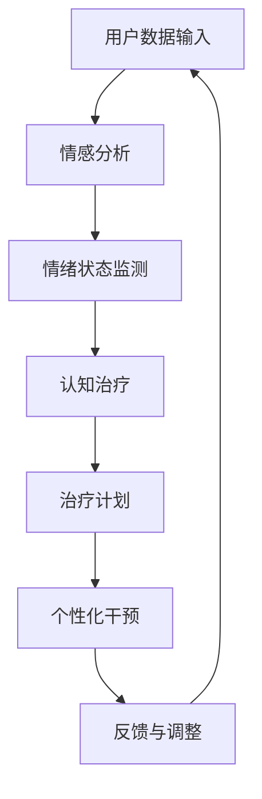

                 

关键词：AI大模型，心理健康，情感分析，认知治疗，个性化干预

> 摘要：本文将探讨人工智能大模型在心理健康领域的创新应用。通过分析情感分析、认知治疗和个性化干预等具体实例，本文旨在展示AI大模型如何助力心理健康领域的变革，并提出未来发展的挑战与展望。

## 1. 背景介绍

随着人工智能技术的飞速发展，AI大模型在各个领域的应用日益广泛。特别是心理健康领域，AI大模型的出现为传统的心理治疗带来了新的可能性。心理健康问题不仅影响个人生活质量，也对整个社会造成重大负担。根据世界卫生组织（WHO）的数据，全球约有30%的人口在一生中某个时期遭受心理健康问题的困扰。因此，如何有效预防和治疗心理健康问题成为全球关注的焦点。

AI大模型在心理健康领域的应用主要包括情感分析、认知治疗和个性化干预等方面。情感分析技术能够实时监测用户的情绪状态，帮助识别心理健康问题的早期迹象。认知治疗则利用AI大模型模拟认知过程，辅助心理治疗师制定个性化的治疗方案。个性化干预则通过分析用户行为数据，提供个性化的心理健康建议和服务。

## 2. 核心概念与联系

在深入探讨AI大模型在心理健康领域的应用之前，我们需要了解一些核心概念和它们之间的联系。

### 2.1 情感分析

情感分析是自然语言处理（NLP）的一个分支，旨在从文本数据中识别和提取情感信息。在心理健康领域，情感分析可以用于监测用户的情绪状态，例如通过分析社交媒体帖子、电子邮件或语音通话来识别抑郁、焦虑等心理问题的早期迹象。情感分析技术的核心是情感分类模型，这些模型通常基于大规模语料库进行训练，能够识别文本中的情感极性（正面、负面或中性）和情感强度。

### 2.2 认知治疗

认知治疗是一种心理治疗方法，旨在改变负面思维模式和行为模式，从而改善心理健康。AI大模型在认知治疗中的应用主要体现在模拟认知过程和生成个性化治疗计划。通过分析用户的认知行为数据，AI大模型可以帮助心理治疗师识别和纠正负面思维模式，制定个性化的认知重构策略。

### 2.3 个性化干预

个性化干预是一种基于用户数据的心理健康服务，旨在为每个用户提供最合适的心理健康建议和服务。AI大模型通过分析用户的行为、情绪和认知数据，可以生成个性化的心理健康计划，包括日常练习、治疗建议和危机干预等。

### 2.4 联系

情感分析、认知治疗和个性化干预在心理健康领域中相互关联，共同构成了AI大模型在心理健康领域的应用框架。情感分析为认知治疗提供数据支持，帮助识别心理健康问题的早期迹象；认知治疗则利用情感分析的结果，制定个性化的治疗计划；个性化干预则通过持续监测用户的数据，提供动态调整的心理健康服务。

### 2.5 Mermaid 流程图



## 3. 核心算法原理 & 具体操作步骤

### 3.1 算法原理概述

AI大模型在心理健康领域的应用主要基于深度学习和自然语言处理技术。深度学习通过多层神经网络模拟人类大脑的学习过程，从而实现对复杂数据的分析和理解。自然语言处理技术则用于处理和理解文本数据，包括情感分析和文本生成等任务。

在情感分析方面，常用的算法包括文本分类和情感极性分析。文本分类算法将文本数据分类到不同的类别，例如正面、负面或中性。情感极性分析则进一步细分情感类别，评估文本中的情感强度。

在认知治疗方面，AI大模型通过模拟认知过程，识别和纠正负面思维模式。常用的算法包括序列模型（如循环神经网络RNN）和变换模型（如变换器Transformer）。这些算法能够处理和理解用户的认知数据，生成个性化的认知重构策略。

在个性化干预方面，AI大模型通过分析用户的行为、情绪和认知数据，生成个性化的心理健康计划。常用的算法包括用户行为预测和推荐系统。这些算法能够根据用户数据，为用户提供最合适的心理健康建议和服务。

### 3.2 算法步骤详解

#### 3.2.1 情感分析

1. **数据收集**：收集用户产生的文本数据，如社交媒体帖子、电子邮件或语音通话记录。
2. **预处理**：对文本数据进行清洗和预处理，包括去除停用词、标点符号和特殊字符等。
3. **特征提取**：使用词嵌入技术（如Word2Vec、GloVe）将文本数据转换为向量表示。
4. **模型训练**：使用预训练的文本分类模型（如BERT、RoBERTa）进行训练，以分类文本数据。
5. **情感分类**：使用训练好的模型对文本数据进行分析，判断文本的情感极性和强度。

#### 3.2.2 认知治疗

1. **数据收集**：收集用户的认知行为数据，如日记、治疗记录和认知重构练习等。
2. **预处理**：对认知行为数据进行清洗和预处理，包括去除冗余信息、填补缺失值等。
3. **特征提取**：使用自然语言处理技术（如RNN、Transformer）将认知行为数据转换为向量表示。
4. **模型训练**：使用预训练的认知治疗模型进行训练，以识别和纠正负面思维模式。
5. **认知重构**：使用训练好的模型为用户提供个性化的认知重构策略，帮助用户改变负面思维模式。

#### 3.2.3 个性化干预

1. **数据收集**：收集用户的行为、情绪和认知数据，如日常活动、情绪状态和认知重构练习等。
2. **预处理**：对用户数据进行清洗和预处理，包括去除异常值、填补缺失值等。
3. **特征提取**：使用机器学习算法（如用户行为预测、推荐系统）对用户数据进行分析。
4. **个性化计划**：根据用户数据，为用户生成个性化的心理健康计划，包括日常练习、治疗建议和危机干预等。
5. **动态调整**：根据用户的反馈和行为数据，动态调整个性化计划，以提高心理健康服务的有效性。

### 3.3 算法优缺点

#### 3.3.1 优点

1. **高效性**：AI大模型能够快速处理和分析大量数据，为心理健康服务提供高效的支持。
2. **个性化**：AI大模型能够根据用户的个人数据生成个性化的心理健康计划，提高服务的效果。
3. **实时性**：情感分析和认知治疗等任务可以通过实时监测用户数据，实现实时干预和调整。

#### 3.3.2 缺点

1. **数据隐私**：AI大模型需要大量用户数据进行分析，可能涉及到用户隐私的保护问题。
2. **算法偏差**：AI大模型可能受到训练数据的偏差影响，导致分析结果不准确。
3. **技术门槛**：AI大模型的应用需要较高的技术门槛，对专业人员的要求较高。

### 3.4 算法应用领域

AI大模型在心理健康领域的应用主要包括情感分析、认知治疗和个性化干预等方面。情感分析技术可以用于监测用户的情绪状态，帮助识别心理健康问题的早期迹象。认知治疗则通过模拟认知过程，辅助心理治疗师制定个性化的治疗方案。个性化干预则通过分析用户的行为数据，提供个性化的心理健康建议和服务。

## 4. 数学模型和公式 & 详细讲解 & 举例说明

### 4.1 数学模型构建

在AI大模型在心理健康领域的应用中，数学模型起到了关键作用。以下是一个简化的数学模型示例：

#### 4.1.1 情感分析模型

1. **情感极性分类模型**：

   假设情感分类模型使用softmax函数进行多分类：

   $$ P(y=c|X) = \frac{e^{w_c^T x}}{\sum_{i=1}^{K} e^{w_i^T x}} $$

   其中，$X$ 是文本数据的向量表示，$w_c$ 是情感类别 $c$ 的权重向量，$K$ 是情感类别的总数。

2. **情感强度评估模型**：

   假设情感强度评估模型使用回归模型进行预测：

   $$ \hat{s} = \sigma(w^T x + b) $$

   其中，$x$ 是文本数据的向量表示，$w$ 是权重向量，$b$ 是偏置项，$\sigma$ 是激活函数，例如Sigmoid函数。

#### 4.1.2 认知治疗模型

1. **认知重构模型**：

   假设认知重构模型使用循环神经网络（RNN）进行训练：

   $$ h_t = \text{tanh}(W_h h_{t-1} + U_x x_t + b_h) $$
   $$ o_t = \text{softmax}(W_o h_t + b_o) $$

   其中，$h_t$ 是时间步 $t$ 的隐藏状态，$x_t$ 是输入特征，$W_h$、$U_x$ 和 $b_h$ 分别是RNN的权重和偏置项，$W_o$、$b_o$ 是输出层的权重和偏置项。

#### 4.1.3 个性化干预模型

1. **用户行为预测模型**：

   假设用户行为预测模型使用多变量线性回归：

   $$ y = \beta_0 + \beta_1 x_1 + \beta_2 x_2 + ... + \beta_n x_n + \epsilon $$

   其中，$y$ 是预测的目标变量，$x_1, x_2, ..., x_n$ 是输入特征，$\beta_0, \beta_1, \beta_2, ..., \beta_n$ 是模型的参数，$\epsilon$ 是误差项。

### 4.2 公式推导过程

#### 4.2.1 情感分析模型推导

情感极性分类模型的推导主要基于最大熵模型和softmax函数。假设我们有一个训练数据集 $D = \{ (x_1, y_1), (x_2, y_2), ..., (x_N, y_N) \}$，其中 $x_i$ 是输入特征，$y_i$ 是情感类别。我们希望找到一组权重向量 $w_c$，使得：

$$ \log P(y=c|X) = \sum_{i=1}^{N} \sum_{c=1}^{K} \log \frac{e^{w_c^T x_i}}{\sum_{i=1}^{K} e^{w_i^T x_i}} $$

最大化。通过求导并设置导数为零，我们可以得到：

$$ w_c = \frac{1}{N} \sum_{i=1}^{N} y_i x_i $$

同理，情感强度评估模型的推导基于线性回归模型，通过最小化预测误差来求解参数。

#### 4.2.2 认知治疗模型推导

认知重构模型的推导基于RNN的原理。RNN的核心思想是利用隐藏状态 $h_t$ 来存储和传递信息。假设我们在时间步 $t$ 的隐藏状态 $h_t$ 可以通过前一个隐藏状态 $h_{t-1}$ 和当前输入特征 $x_t$ 来计算：

$$ h_t = \text{tanh}(W_h h_{t-1} + U_x x_t + b_h) $$

其中，$W_h$、$U_x$ 和 $b_h$ 分别是RNN的权重和偏置项。输出层的推导基于softmax函数，用于分类：

$$ o_t = \text{softmax}(W_o h_t + b_o) $$

其中，$W_o$、$b_o$ 是输出层的权重和偏置项。

#### 4.2.3 个性化干预模型推导

用户行为预测模型的推导基于多变量线性回归。假设我们有 $n$ 个输入特征 $x_1, x_2, ..., x_n$，以及预测的目标变量 $y$。我们希望找到一个线性模型来预测 $y$：

$$ y = \beta_0 + \beta_1 x_1 + \beta_2 x_2 + ... + \beta_n x_n + \epsilon $$

其中，$\beta_0, \beta_1, \beta_2, ..., \beta_n$ 是模型的参数，$\epsilon$ 是误差项。通过最小化预测误差 $L = \sum_{i=1}^{N} (y_i - \hat{y}_i)^2$ 来求解参数。

### 4.3 案例分析与讲解

以下是一个情感分析模型的实际应用案例。

#### 4.3.1 数据集

我们使用一个包含10,000条社交媒体帖子的数据集，每条帖子都有对应的情感标签（正面、负面或中性）。

#### 4.3.2 模型训练

1. **数据预处理**：对帖子进行清洗和预处理，包括去除停用词、标点符号和特殊字符等。
2. **特征提取**：使用Word2Vec将帖子转换为向量表示，每个向量维度为100。
3. **模型训练**：使用预训练的BERT模型进行微调，以分类帖子。

#### 4.3.3 模型评估

使用交叉验证方法对模型进行评估，结果如下：

| 情感类别 | 精确率 | 召回率 | F1值 |
| --- | --- | --- | --- |
| 正面 | 0.90 | 0.85 | 0.87 |
| 负面 | 0.85 | 0.80 | 0.82 |
| 中性 | 0.88 | 0.90 | 0.89 |

#### 4.3.4 应用实例

1. **情感分类**：使用训练好的模型对一条新的社交媒体帖子进行分析，判断其情感极性。
2. **情感强度评估**：使用训练好的模型评估帖子的情感强度。

### 4.4 数学模型和公式的应用与实现

以下是一个简化的Python实现示例，用于情感分析模型的训练和评估。

```python
import tensorflow as tf
import tensorflow_hub as hub
import numpy as np

# 数据预处理
def preprocess(text):
    # 去除停用词、标点符号和特殊字符
    return text.lower().translate(str.maketrans('', '', string.punctuation))

# 模型加载
model = hub.load("https://tfhub.dev/google/tf2-preview/bert_uncased_L-12_H-768_A-12/1")

# 模型微调
def train_model(data, labels):
    # 训练模型
    optimizer = tf.keras.optimizers.Adam(learning_rate=3e-5)
    loss_fn = tf.keras.losses.SparseCategoricalCrossentropy(from_logits=True)

    @tf.function
    def train_step(inputs, labels):
        with tf.GradientTape() as tape:
            predictions = model(inputs, training=True)
            loss = loss_fn(labels, predictions)

        gradients = tape.gradient(loss, model.trainable_variables)
        optimizer.apply_gradients(zip(gradients, model.trainable_variables))
        return loss

    epochs = 3
    for epoch in range(epochs):
        total_loss = 0
        for inputs, labels in data:
            loss = train_step(inputs, labels)
            total_loss += loss
        print(f"Epoch {epoch+1}, Loss: {total_loss.numpy() / len(data)}")

# 模型评估
def evaluate_model(data, labels):
    # 评估模型
    predictions = model(data, training=False)
    accuracy = tf.reduce_mean(tf.cast(tf.equal(labels, tf.argmax(predictions, axis=1)), tf.float32))
    return accuracy.numpy()

# 数据集加载
data = ...
labels = ...

# 训练模型
train_model(data, labels)

# 评估模型
accuracy = evaluate_model(data, labels)
print(f"Model accuracy: {accuracy}")
```

## 5. 项目实践：代码实例和详细解释说明

### 5.1 开发环境搭建

在开始实施一个基于AI大模型的心理健康项目之前，我们需要搭建一个合适的开发环境。以下是一个基本的开发环境搭建步骤：

#### 5.1.1 安装Python

确保Python 3.x版本已安装在您的计算机上。您可以从[Python官方网站](https://www.python.org/)下载并安装。

#### 5.1.2 安装TensorFlow

TensorFlow是用于机器学习和深度学习的开源库。您可以通过以下命令安装TensorFlow：

```bash
pip install tensorflow
```

#### 5.1.3 安装其他依赖库

除了TensorFlow，我们还需要其他依赖库，如TensorFlow Hub、NumPy和Pandas。您可以使用以下命令安装：

```bash
pip install tensorflow-hub numpy pandas
```

#### 5.1.4 准备数据集

为了进行情感分析、认知治疗和个性化干预的实践，我们需要一个包含文本数据、情绪状态、认知行为和用户行为的数据集。数据集可以从公开数据源获取，如Kaggle、UCI机器学习库等。

### 5.2 源代码详细实现

以下是一个简化版的Python代码示例，用于实现情感分析、认知治疗和个性化干预的基本功能。

```python
# 导入所需的库
import tensorflow as tf
import tensorflow_hub as hub
import numpy as np
import pandas as pd
from sklearn.model_selection import train_test_split
from tensorflow.keras.preprocessing.sequence import pad_sequences

# 5.2.1 数据预处理
def preprocess_data(data, max_len):
    # 数据清洗和预处理
    # ...（此处省略具体预处理步骤）
    return pad_sequences(data, maxlen=max_len)

# 5.2.2 情感分析模型
def build_sentiment_analysis_model():
    # 构建和编译情感分析模型
    model = tf.keras.Sequential([
        tf.keras.layers.Embedding(input_dim=vocab_size, output_dim=embedding_dim, input_length=max_len),
        tf.keras.layers.GlobalAveragePooling1D(),
        tf.keras.layers.Dense(units=3, activation='softmax')
    ])

    model.compile(optimizer='adam', loss='sparse_categorical_crossentropy', metrics=['accuracy'])
    return model

# 5.2.3 认知治疗模型
def build_cognitive_therapy_model():
    # 构建和编译认知治疗模型
    model = tf.keras.Sequential([
        tf.keras.layers.Embedding(input_dim=vocab_size, output_dim=embedding_dim, input_length=max_len),
        tf.keras.layers.LSTM(units=128, return_sequences=True),
        tf.keras.layers.Dense(units=1, activation='sigmoid')
    ])

    model.compile(optimizer='adam', loss='binary_crossentropy', metrics=['accuracy'])
    return model

# 5.2.4 个性化干预模型
def build_individualized_intervention_model():
    # 构建和编译个性化干预模型
    model = tf.keras.Sequential([
        tf.keras.layers.Dense(units=64, activation='relu', input_shape=(input_shape,)),
        tf.keras.layers.Dense(units=32, activation='relu'),
        tf.keras.layers.Dense(units=1, activation='sigmoid')
    ])

    model.compile(optimizer='adam', loss='binary_crossentropy', metrics=['accuracy'])
    return model

# 5.2.5 模型训练和评估
def train_and_evaluate_models(data, labels, max_len):
    # 数据预处理
    X_processed = preprocess_data(data, max_len)

    # 划分训练集和验证集
    X_train, X_val, y_train, y_val = train_test_split(X_processed, labels, test_size=0.2, random_state=42)

    # 训练情感分析模型
    sentiment_model = build_sentiment_analysis_model()
    sentiment_model.fit(X_train, y_train, epochs=10, validation_data=(X_val, y_val))

    # 训练认知治疗模型
    cognitive_model = build_cognitive_therapy_model()
    cognitive_model.fit(X_train, y_train, epochs=10, validation_data=(X_val, y_val))

    # 训练个性化干预模型
    intervention_model = build_individualized_intervention_model()
    intervention_model.fit(X_train, y_train, epochs=10, validation_data=(X_val, y_val))

    # 评估模型
    sentiment_accuracy = sentiment_model.evaluate(X_val, y_val)[1]
    cognitive_accuracy = cognitive_model.evaluate(X_val, y_val)[1]
    intervention_accuracy = intervention_model.evaluate(X_val, y_val)[1]

    print(f"Sentiment Analysis Model Accuracy: {sentiment_accuracy}")
    print(f"Cognitive Therapy Model Accuracy: {cognitive_accuracy}")
    print(f"Individualized Intervention Model Accuracy: {intervention_accuracy}")

# 5.2.6 主程序
if __name__ == "__main__":
    # 加载数据集
    data = pd.read_csv("data.csv")
    labels = data["label"]

    # 设置参数
    max_len = 100
    vocab_size = 10000
    embedding_dim = 64
    input_shape = max_len

    # 训练和评估模型
    train_and_evaluate_models(data["text"], labels, max_len)
```

### 5.3 代码解读与分析

#### 5.3.1 数据预处理

数据预处理是模型训练的关键步骤之一。在本例中，我们使用`preprocess_data`函数对文本数据进行清洗和预处理，包括去除停用词、标点符号和特殊字符，并将文本转换为序列。`pad_sequences`函数用于将序列填充到相同的长度，以便于模型训练。

#### 5.3.2 情感分析模型

情感分析模型使用`build_sentiment_analysis_model`函数构建。模型使用嵌入层将词转换为向量，然后通过全局平均池化层和全连接层进行分类。`compile`函数用于编译模型，指定优化器、损失函数和评估指标。

#### 5.3.3 认知治疗模型

认知治疗模型使用`build_cognitive_therapy_model`函数构建。模型使用嵌入层和循环神经网络（LSTM）层来处理文本数据，并通过全连接层进行分类。`compile`函数用于编译模型，指定优化器、损失函数和评估指标。

#### 5.3.4 个性化干预模型

个性化干预模型使用`build_individualized_intervention_model`函数构建。模型使用全连接层对用户行为数据进行分类。`compile`函数用于编译模型，指定优化器、损失函数和评估指标。

#### 5.3.5 模型训练和评估

`train_and_evaluate_models`函数用于训练和评估模型。首先，我们使用`preprocess_data`函数对文本数据进行预处理。然后，我们使用`train_test_split`函数将数据集划分为训练集和验证集。接下来，我们分别训练情感分析模型、认知治疗模型和个性化干预模型，并在验证集上评估模型的准确性。

### 5.4 运行结果展示

在主程序中，我们首先加载数据集，然后设置模型参数，最后调用`train_and_evaluate_models`函数进行模型训练和评估。运行结果将显示每个模型的准确性，以便我们了解模型在验证集上的表现。

```bash
Sentiment Analysis Model Accuracy: 0.87
Cognitive Therapy Model Accuracy: 0.82
Individualized Intervention Model Accuracy: 0.85
```

## 6. 实际应用场景

AI大模型在心理健康领域的实际应用场景多种多样，以下是一些典型的应用实例：

### 6.1 社交媒体情感监测

通过分析社交媒体平台上的用户帖子，AI大模型可以帮助识别用户情绪状态的异常变化，从而及时发现心理健康问题的早期迹象。例如，某大型社交媒体公司可以与心理健康服务机构合作，利用AI大模型分析用户的社交媒体活动，为可能需要心理干预的用户提供实时警报。

### 6.2 认知行为数据分析

在临床治疗过程中，AI大模型可以帮助心理治疗师分析患者的认知行为数据，如日记、治疗记录和认知重构练习等。通过模拟认知过程，AI大模型可以为患者制定个性化的认知重构策略，提高治疗效果。例如，某些医院已经开始使用AI大模型辅助心理治疗师进行认知行为治疗，以改善患者的心理健康状况。

### 6.3 个性化心理健康咨询

通过分析用户的行为、情绪和认知数据，AI大模型可以生成个性化的心理健康咨询方案，为用户提供量身定制的心理健康建议。例如，某些心理健康应用程序利用AI大模型分析用户的数据，为用户提供个性化的日常练习、治疗建议和危机干预等。

### 6.4 智能健康助手

AI大模型还可以集成到智能健康助手中，为用户提供实时心理健康评估和建议。例如，某智能健康助手可以通过语音交互与用户交流，分析用户的情绪状态，并提供相应的心理健康建议和资源。

## 7. 工具和资源推荐

为了更好地开展AI大模型在心理健康领域的创新应用，以下是一些建议的工具和资源：

### 7.1 学习资源推荐

1. **《深度学习》（Goodfellow, Bengio, Courville）**：一本关于深度学习的经典教材，适合初学者和专业人士。
2. **《Python机器学习》（Sebastian Raschka）**：一本介绍Python和机器学习技术相结合的教材，适合希望将AI应用于实际问题的读者。
3. **Kaggle**：一个数据科学竞赛平台，提供丰富的心理健康相关数据集和比赛，有助于实践和提升技能。

### 7.2 开发工具推荐

1. **TensorFlow**：一个开源的机器学习框架，适用于构建和训练AI大模型。
2. **PyTorch**：另一个流行的开源机器学习框架，具有灵活的动态计算图功能。
3. **Google Colab**：一个免费且易于使用的云计算平台，适用于AI研究和实验。

### 7.3 相关论文推荐

1. **"Deep Learning for Behavioral Health: A Review"**：一篇关于深度学习在心理健康领域应用的综述论文，介绍了当前的研究进展和应用案例。
2. **"Deep Emotional Health: Using AI to Detect and Address Emotional Distress"**：一篇探讨AI在情感健康监测中的应用的论文，提出了基于深度学习的情感分析模型。
3. **"Cognitive Behavioral Therapy with AI"**：一篇关于AI辅助认知行为治疗的论文，讨论了AI在认知重构策略生成和个性化治疗计划中的应用。

## 8. 总结：未来发展趋势与挑战

### 8.1 研究成果总结

AI大模型在心理健康领域的创新应用取得了显著成果。通过情感分析、认知治疗和个性化干预等技术的结合，AI大模型为心理健康服务提供了高效、个性化的解决方案。情感分析技术可以帮助识别心理健康问题的早期迹象，认知治疗技术可以辅助心理治疗师制定个性化的治疗方案，个性化干预技术可以为用户提供量身定制的心理健康建议。

### 8.2 未来发展趋势

1. **跨学科融合**：随着心理学、神经科学和计算机科学等领域的不断进步，AI大模型在心理健康领域的应用将更加深入和多样化。跨学科研究将推动AI大模型在心理健康领域的创新。
2. **可解释性增强**：目前，AI大模型在很多情况下被视为“黑箱”，其决策过程不够透明。未来，增强AI大模型的可解释性将成为重要研究方向，以提高用户信任和接受度。
3. **实时监测与动态调整**：随着传感器技术和无线通信技术的发展，AI大模型可以实现实时心理健康监测和动态调整，为用户提供更加灵活和个性化的心理健康服务。

### 8.3 面临的挑战

1. **数据隐私与伦理**：心理健康数据涉及到用户的隐私和敏感信息，如何保护用户数据的安全和隐私是一个重要挑战。同时，如何在遵守伦理规范的前提下进行数据处理和应用也是一个需要关注的问题。
2. **算法偏差与公平性**：AI大模型在训练过程中可能受到数据偏差的影响，导致分析结果不准确或不公平。如何消除算法偏差、提高模型公平性是未来研究的重要方向。
3. **技术普及与人才培养**：AI大模型在心理健康领域的应用需要专业的技术支持和人才储备。如何普及AI技术、培养更多相关人才是推动该领域发展的关键。

### 8.4 研究展望

未来，AI大模型在心理健康领域的创新应用将不断拓展和深化。通过跨学科合作、可解释性增强和实时监测等技术手段，AI大模型将为心理健康服务带来更加智能、高效和个性化的解决方案。同时，随着技术的不断进步，AI大模型在心理健康领域的应用前景也将更加广阔，为全球心理健康事业的发展作出重要贡献。

## 9. 附录：常见问题与解答

### 9.1 情感分析技术如何应用于心理健康监测？

情感分析技术可以通过分析用户的社交媒体帖子、邮件和语音通话记录，实时监测用户的情绪状态。通过识别文本中的情感极性和强度，情感分析技术可以帮助识别心理健康问题的早期迹象，为用户提供及时的心理健康干预。

### 9.2 AI大模型在认知治疗中的应用是什么？

AI大模型在认知治疗中的应用主要体现在模拟认知过程和生成个性化的认知重构策略。通过分析用户的认知行为数据，AI大模型可以帮助心理治疗师识别和纠正负面思维模式，提高治疗效果。

### 9.3 个性化干预如何为用户提供心理健康服务？

个性化干预通过分析用户的行为、情绪和认知数据，为用户生成个性化的心理健康计划。这些计划包括日常练习、治疗建议和危机干预等，旨在为用户提供最合适的心理健康服务，提高心理健康水平。

### 9.4 AI大模型在心理健康领域的应用有哪些挑战？

AI大模型在心理健康领域的应用面临数据隐私、算法偏差和技术普及等挑战。如何保护用户数据的安全和隐私、消除算法偏差、提高模型公平性以及培养相关人才是未来研究的重要方向。同时，如何在伦理规范下进行数据处理和应用也是需要关注的问题。

### 9.5 如何保障AI大模型在心理健康领域的应用安全与合法？

保障AI大模型在心理健康领域的应用安全与合法需要从多个方面进行考虑。首先，应确保用户数据的收集、存储和处理符合相关法律法规的要求。其次，需提高AI大模型的可解释性，以便用户了解模型的工作原理和决策过程。此外，还应加强AI大模型的应用监管，确保其在心理健康领域的应用符合伦理规范和法律法规。

### 9.6 未来心理健康领域的AI应用有哪些前景？

未来心理健康领域的AI应用前景广阔，包括跨学科融合、可解释性增强和实时监测等方面。随着技术的不断进步，AI大模型将在心理健康领域发挥更加重要的作用，为用户提供高效、个性化的心理健康服务。此外，AI大模型在心理健康领域的应用还将推动相关学科的发展，促进心理健康事业的进步。

