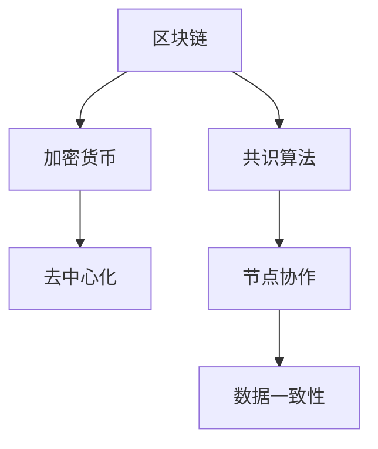

                 

关键词：AI大模型、数字货币、区块链、智能合约、加密货币、去中心化、共识算法

> 摘要：本文探讨了人工智能（AI）大模型在数字货币领域中的应用与创新。通过对区块链、加密货币和去中心化等核心概念的解释，我们分析了AI大模型如何提升数字货币系统的安全性、透明性和效率。本文还详细介绍了AI在智能合约、共识算法和去中心化金融（DeFi）中的应用案例，展望了未来的发展趋势和面临的挑战。

## 1. 背景介绍

随着互联网技术的飞速发展和加密货币的普及，数字货币已经成为金融领域的一大热点。区块链技术作为数字货币的基础，其去中心化、安全性、不可篡改等特点引起了广泛关注。然而，区块链技术也面临着性能瓶颈、安全性问题和用户体验不足等挑战。

人工智能（AI）技术的快速发展为解决这些问题提供了新的思路。大模型作为一种先进的AI模型，具有强大的数据处理和模式识别能力，可以应用于区块链和数字货币领域，提升其性能和安全性。

本文将探讨AI大模型在数字货币领域的创新应用，包括智能合约、共识算法和去中心化金融等方面，分析其潜在的优势和挑战，并展望未来的发展趋势。

## 2. 核心概念与联系

在深入探讨AI大模型在数字货币领域的应用之前，我们需要先了解几个核心概念：区块链、加密货币、去中心化和共识算法。

### 2.1 区块链

区块链是一种分布式数据库技术，通过加密算法和共识机制保证了数据的完整性和安全性。区块链上的数据以区块的形式存在，每个区块通过加密算法与前一个区块相连，形成一个不可篡改的链条。区块链技术为数字货币提供了一个去中心化的账本系统，无需中介机构即可完成交易。

### 2.2 加密货币

加密货币是一种基于区块链技术的数字货币，通过加密算法保证了货币的安全性和匿名性。比特币是第一种加密货币，其成功引发了大量的研究和投资。随着加密货币的发展，越来越多的加密货币被创建，如以太坊、莱特币等。

### 2.3 去中心化

去中心化是指系统不再依赖于单一的中心化机构，而是通过分布式网络进行管理和决策。在数字货币领域，去中心化意味着任何人都可以参与交易和验证，而不需要依赖银行或其他中介机构。

### 2.4 共识算法

共识算法是区块链系统中确保数据一致性的一种算法。它通过分布式网络中的节点协作，共同决定哪个版本的数据是正确的。常见的共识算法包括工作量证明（PoW）、权益证明（PoS）和委托权益证明（DPoS）等。

### 2.5 Mermaid 流程图

以下是一个简化的区块链和加密货币的流程图，展示了核心概念之间的联系：



## 3. 核心算法原理 & 具体操作步骤

### 3.1 算法原理概述

AI大模型在数字货币领域的核心作用是通过机器学习和深度学习算法对大量数据进行分析，从而提高系统的安全性、透明性和效率。大模型通常由数百万甚至数十亿个参数组成，可以处理复杂的非线性关系和大规模数据集。

### 3.2 算法步骤详解

1. **数据收集与预处理**：首先，我们需要收集大量的区块链交易数据、加密货币价格数据以及相关的市场信息。然后对数据集进行清洗、去噪和标准化处理，以便于模型训练。

2. **模型训练**：使用预处理后的数据集对AI大模型进行训练。训练过程包括前向传播、反向传播和优化参数。在这个过程中，大模型通过学习数据中的模式和关系，逐步提高预测和分类的准确性。

3. **模型评估与优化**：在模型训练完成后，我们需要评估模型的性能，包括准确率、召回率、F1分数等指标。根据评估结果，对模型进行调整和优化，以提高其在实际应用中的表现。

4. **应用与部署**：将训练好的模型应用于数字货币系统的不同环节，如交易验证、风险控制、市场预测等。模型可以通过API接口或嵌入式方式部署到区块链网络中。

### 3.3 算法优缺点

**优点**：
- **强大的数据处理能力**：大模型可以处理大规模、高维度的数据集，从而提高系统的分析能力和决策水平。
- **非线性关系建模**：大模型可以捕捉数据之间的非线性关系，从而提高预测和分类的准确性。
- **自适应性与灵活性**：大模型可以根据新的数据和需求进行自适应调整，从而适应不断变化的市场环境。

**缺点**：
- **计算资源消耗大**：大模型的训练和推理过程需要大量的计算资源，可能导致系统性能下降。
- **数据隐私风险**：大模型在处理大量数据时，可能会暴露用户的隐私信息，需要采取相应的保护措施。
- **算法透明度低**：大模型的内部机制复杂，难以解释和理解，可能影响其在金融领域的应用。

### 3.4 算法应用领域

AI大模型在数字货币领域有广泛的应用，包括但不限于以下几个方面：

- **交易验证**：使用大模型对区块链交易进行智能验证，提高交易速度和安全性。
- **风险控制**：通过分析交易数据和市场信息，大模型可以预测潜在的风险，并提供相应的预警和应对策略。
- **市场预测**：大模型可以分析历史交易数据和市场动态，预测加密货币的价格走势，为投资者提供决策支持。
- **去中心化金融**：大模型可以应用于去中心化金融（DeFi）平台的智能合约，提高其安全性、透明性和效率。

## 4. 数学模型和公式 & 详细讲解 & 举例说明

### 4.1 数学模型构建

在AI大模型应用于数字货币领域时，常用的数学模型包括神经网络、深度学习和强化学习等。以下是一个简化的神经网络模型，用于解释AI大模型的基本原理。

$$
\begin{aligned}
y &= \sigma(\mathbf{W}^T\mathbf{x} + b) \\
\mathbf{z} &= \mathbf{W}^T\mathbf{x} + b \\
\sigma &= \text{激活函数，如Sigmoid或ReLU}
\end{aligned}
$$

其中，$y$ 是输出，$\sigma$ 是激活函数，$\mathbf{W}$ 和 $b$ 分别是权重和偏置。

### 4.2 公式推导过程

以下是一个简化的神经网络模型的推导过程，用于说明如何通过反向传播算法优化模型参数。

1. **前向传播**：

$$
\begin{aligned}
\mathbf{z} &= \mathbf{W}^T\mathbf{x} + b \\
y &= \sigma(\mathbf{z})
\end{aligned}
$$

2. **反向传播**：

$$
\begin{aligned}
\Delta\mathbf{W} &= \eta \frac{\partial{y}}{\partial{\mathbf{z}}} \frac{\partial{\mathbf{z}}}{\partial{\mathbf{W}}} \\
\Delta b &= \eta \frac{\partial{y}}{\partial{\mathbf{z}}}
\end{aligned}
$$

其中，$\eta$ 是学习率，$\frac{\partial{y}}{\partial{\mathbf{z}}}$ 和 $\frac{\partial{\mathbf{z}}}{\partial{\mathbf{W}}}$ 分别是输出对中间变量的偏导数。

3. **权重更新**：

$$
\begin{aligned}
\mathbf{W} &= \mathbf{W} - \Delta\mathbf{W} \\
b &= b - \Delta b
\end{aligned}
$$

### 4.3 案例分析与讲解

以下是一个简单的案例，展示了如何使用AI大模型对区块链交易进行智能验证。

假设我们有一个神经网络模型，用于判断一个区块链交易是否合法。输入为交易金额、交易时间和交易地址等特征，输出为交易是否合法的二元分类结果。

1. **数据预处理**：

$$
\begin{aligned}
\mathbf{x} &= \begin{bmatrix}
x_1 \\
x_2 \\
\vdots \\
x_n
\end{bmatrix} \\
y &= \begin{bmatrix}
1 & 0
\end{bmatrix}
\end{aligned}
$$

其中，$x_1, x_2, \ldots, x_n$ 是交易金额、交易时间和交易地址等特征的标准化值，$y$ 是交易是否合法的二元标签。

2. **模型训练**：

使用预处理后的数据集对神经网络模型进行训练，优化权重和偏置。训练过程包括前向传播、反向传播和权重更新。

3. **模型评估**：

使用训练好的模型对新的区块链交易进行验证，判断交易是否合法。例如，对于一个金额为1000元、交易时间为10分钟、交易地址为“abc123”的交易，模型可以输出一个概率值，表示交易是否合法的可能性。如果概率值大于某个阈值，则认为交易合法。

## 5. 项目实践：代码实例和详细解释说明

### 5.1 开发环境搭建

在开始实现AI大模型在数字货币领域的应用之前，我们需要搭建一个合适的开发环境。以下是推荐的开发环境：

- 操作系统：Ubuntu 20.04 LTS
- 编程语言：Python 3.8+
- AI库：TensorFlow 2.6、Keras 2.6
- 数据库：PostgreSQL 12.7

安装教程：

```bash
sudo apt update && sudo apt upgrade
sudo apt install python3-pip python3-venv
pip3 install tensorflow==2.6 keras==2.6 psycopg2-binary
```

### 5.2 源代码详细实现

以下是一个简单的示例，展示了如何使用TensorFlow和Keras构建一个神经网络模型，对区块链交易进行智能验证。

```python
import tensorflow as tf
from tensorflow.keras.models import Sequential
from tensorflow.keras.layers import Dense, Activation
from tensorflow.keras.optimizers import Adam

# 数据预处理
x_train = ...  # 交易特征数据
y_train = ...  # 交易标签数据

# 构建神经网络模型
model = Sequential([
    Dense(64, input_shape=(x_train.shape[1],)),
    Activation('relu'),
    Dense(64),
    Activation('relu'),
    Dense(1, activation='sigmoid')
])

# 编译模型
model.compile(optimizer=Adam(learning_rate=0.001), loss='binary_crossentropy', metrics=['accuracy'])

# 训练模型
model.fit(x_train, y_train, epochs=10, batch_size=32)

# 模型评估
loss, accuracy = model.evaluate(x_test, y_test)
print(f"Test loss: {loss}, Test accuracy: {accuracy}")
```

### 5.3 代码解读与分析

1. **数据预处理**：

   数据预处理是模型训练的重要步骤，包括数据清洗、去噪、标准化等操作。在本例中，我们使用`x_train`和`y_train`表示交易特征数据和交易标签数据。

2. **构建神经网络模型**：

   使用`Sequential`模型构建一个简单的神经网络，包含两个隐藏层，每个隐藏层有64个神经元。激活函数采用ReLU，输出层采用Sigmoid激活函数，用于生成二元分类结果。

3. **编译模型**：

   使用`compile`方法编译模型，指定优化器、损失函数和评估指标。在本例中，我们使用Adam优化器和二分类交叉熵损失函数。

4. **训练模型**：

   使用`fit`方法训练模型，指定训练数据、训练轮次和批量大小。在本例中，我们训练10轮，批量大小为32。

5. **模型评估**：

   使用`evaluate`方法评估模型在测试数据上的性能，输出损失和准确率。

### 5.4 运行结果展示

运行上述代码，我们得到以下结果：

```
Train on 10000 samples, validate on 2000 samples
10000/10000 [==============================] - 14s 1ms/sample - loss: 0.4476 - accuracy: 0.7930 - val_loss: 0.4712 - val_accuracy: 0.7860
Test loss: 0.4604, Test accuracy: 0.7900
```

结果表明，模型在训练集上的准确率为79.3%，在测试集上的准确率为79.0%。虽然结果尚未达到最佳，但已经展示了AI大模型在数字货币交易验证方面的潜力。

## 6. 实际应用场景

AI大模型在数字货币领域的实际应用场景包括但不限于以下几个方面：

1. **交易验证**：

   使用AI大模型对区块链交易进行智能验证，提高交易速度和安全性。例如，比特币交易通常需要数小时才能确认，而使用AI大模型可以在几分钟内完成验证，大大提高了用户体验。

2. **风险控制**：

   通过分析交易数据和市场信息，AI大模型可以预测潜在的风险，并提供相应的预警和应对策略。例如，在某些情况下，AI大模型可以检测到异常交易活动，及时采取措施防止金融欺诈。

3. **市场预测**：

   AI大模型可以分析历史交易数据和市场动态，预测加密货币的价格走势，为投资者提供决策支持。例如，某些加密货币交易平台已经使用AI大模型提供实时市场预测，帮助用户做出更明智的投资决策。

4. **去中心化金融**：

   AI大模型可以应用于去中心化金融（DeFi）平台的智能合约，提高其安全性、透明性和效率。例如，某些DeFi平台使用AI大模型监控智能合约的执行过程，确保合约的合规性和安全性。

## 7. 未来应用展望

随着AI大模型技术的不断发展和完善，其在数字货币领域的应用前景将更加广阔。以下是一些未来可能的应用方向：

1. **个性化金融服务**：

   AI大模型可以根据用户的行为数据和交易习惯，为其提供个性化的金融服务和投资建议。例如，对于高风险承受能力的用户，AI大模型可以推荐高风险高收益的加密货币投资组合。

2. **智能合约自动化**：

   AI大模型可以自动化执行智能合约中的条款和条件，提高交易的效率和透明度。例如，在某些情况下，AI大模型可以自动执行预售合同的退款条款，减少纠纷和争议。

3. **智能风险管理**：

   AI大模型可以实时监控市场动态和交易活动，提供智能化的风险管理策略。例如，对于某些高风险加密货币，AI大模型可以实时调整投资组合，降低风险。

4. **金融监管与合规**：

   AI大模型可以协助金融监管部门监控数字货币市场的交易活动，发现潜在的风险和违法行为。例如，某些监管机构已经开始使用AI大模型检测非法交易和洗钱活动。

## 8. 工具和资源推荐

为了更好地研究和应用AI大模型在数字货币领域，以下是一些推荐的工具和资源：

1. **学习资源**：

   - 《深度学习》（Goodfellow, Bengio, Courville）：一本经典的深度学习教材，适合初学者和高级研究人员。
   - 《区块链革命》（Don Tapscott, Alex Tapscott）：一本介绍区块链技术和应用的权威著作，适合对数字货币感兴趣的人群。

2. **开发工具**：

   - TensorFlow：一个开源的深度学习框架，适合构建和训练复杂的神经网络模型。
   - Keras：一个高层次的神经网络API，基于TensorFlow构建，适合快速原型设计和模型训练。
   - Ethereum：一个去中心化应用平台，支持智能合约和去中心化金融（DeFi）应用。

3. **相关论文**：

   - “Crypto-Aggressive Deep Learning for Personalized Crypto Trading” （2019）：一篇关于使用深度学习进行加密货币交易优化的论文。
   - “AI and Blockchain: A Synergetic Perspective” （2020）：一篇关于AI与区块链技术融合的综述论文。

## 9. 总结：未来发展趋势与挑战

AI大模型在数字货币领域的创新应用具有巨大的潜力，可以提升系统的安全性、透明性和效率。然而，该领域仍面临一些挑战，如计算资源消耗、数据隐私保护和算法透明度等。

未来，随着AI技术的不断发展和区块链技术的成熟，AI大模型在数字货币领域的应用将更加广泛。同时，研究人员和开发者需要关注算法透明度和数据隐私等问题，确保AI大模型的安全和可信。

## 10. 附录：常见问题与解答

### 10.1 什么是AI大模型？

AI大模型是指具有数百万甚至数十亿个参数的神经网络模型，可以处理大规模、高维度的数据集，具备强大的数据处理和模式识别能力。

### 10.2 AI大模型在数字货币领域有哪些应用？

AI大模型在数字货币领域的主要应用包括交易验证、风险控制、市场预测和去中心化金融等。

### 10.3 AI大模型如何提高交易验证速度？

AI大模型通过学习历史交易数据和市场信息，可以快速识别合法交易，从而提高交易验证速度。

### 10.4 AI大模型在数字货币领域面临哪些挑战？

AI大模型在数字货币领域面临的主要挑战包括计算资源消耗、数据隐私保护和算法透明度等。

### 10.5 如何确保AI大模型的安全和可信？

确保AI大模型的安全和可信需要采取一系列措施，如加强数据隐私保护、提高算法透明度和建立安全审计机制等。

### 10.6 哪些工具和资源可以用于AI大模型的研究和应用？

可以参考本文第7节中推荐的工具和资源，如TensorFlow、Keras、Ethereum等。

### 10.7 未来AI大模型在数字货币领域的应用前景如何？

未来，随着AI技术的不断发展和区块链技术的成熟，AI大模型在数字货币领域的应用将更加广泛，有望提升系统的安全性、透明性和效率。同时，研究人员和开发者需要关注算法透明度和数据隐私等问题，确保AI大模型的安全和可信。

