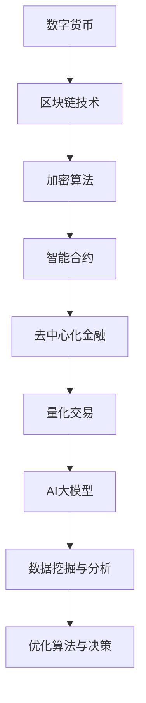
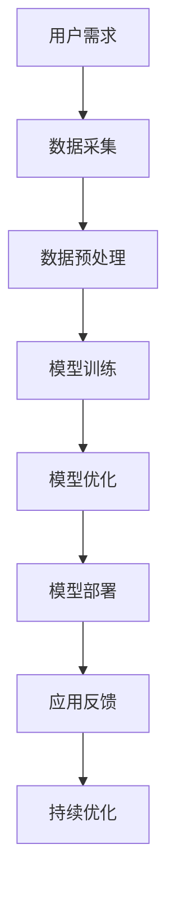
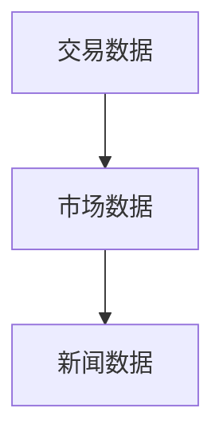
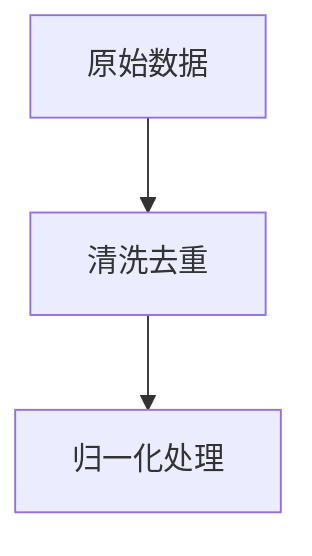
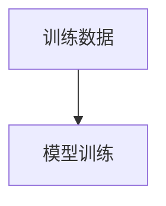
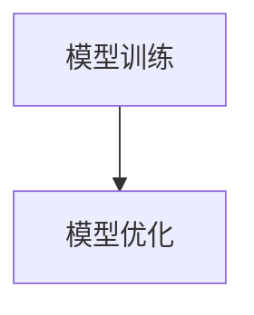
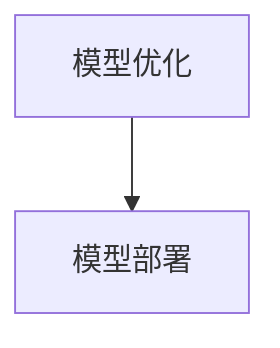
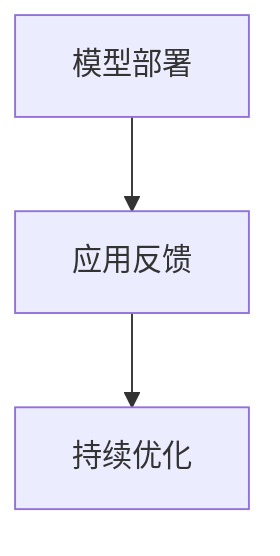
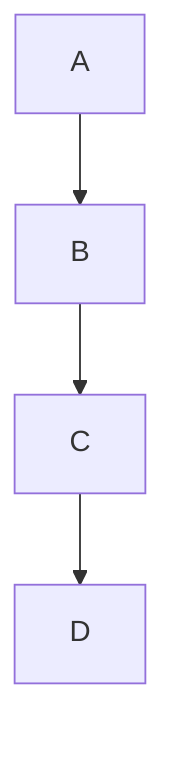

                 

关键词：AI大模型、数字货币、区块链、加密算法、智能合约、去中心化金融、加密经济学、量化交易、分布式账本技术、安全增强、性能优化、隐私保护。

## 摘要

本文探讨了人工智能（AI）大模型在数字货币领域中的创新应用。随着区块链技术的不断发展，数字货币已成为金融行业的一个重要分支。AI大模型通过其在数据处理、模式识别和优化决策等方面的优势，为数字货币领域带来了革命性的变化。本文首先介绍了数字货币的背景和相关技术，然后详细阐述了AI大模型在数字货币领域中的应用，包括加密算法优化、智能合约自动化、去中心化金融（DeFi）的构建、加密经济学的分析以及量化交易的策略优化。最后，本文总结了AI大模型在数字货币领域的应用前景，并对未来的研究方向提出了建议。

## 1. 背景介绍

### 数字货币的起源与发展

数字货币的概念最早可以追溯到1983年，由戴维·乔姆（David Chaum）提出的“盲签名”概念。然而，数字货币的真正爆发始于2009年比特币（Bitcoin）的诞生，由中本聪（Satoshi Nakamoto）创建。比特币利用密码学原理解决了传统货币系统中面临的诸多问题，如双花攻击、中心化风险和交易可追踪性等。这一创新迅速引起了全球关注，并催生了大量基于区块链技术的数字货币项目。

随着区块链技术的不断发展和完善，数字货币的应用范围逐渐扩大。从最初的虚拟货币，到如今的去中心化金融（DeFi）、非同质化代币（NFT）、稳定币等，数字货币已经成为金融行业的一个重要分支。据估计，到2025年，全球数字货币市场规模将达到数十万亿美元。

### 区块链技术的核心原理

区块链技术是数字货币的基石，其核心原理包括分布式账本、密码学和共识机制。分布式账本技术（DLT）通过将数据分散存储在网络中的多个节点上，实现了去中心化的数据管理和共享。密码学则用于确保数据的安全性和隐私性，包括公钥加密、数字签名和哈希函数等。共识机制则是区块链网络中节点达成一致性的方法，常用的共识机制包括工作量证明（PoW）、权益证明（PoS）和委托权益证明（DPoS）等。

### 数字货币的挑战与机遇

尽管数字货币在金融领域具有巨大潜力，但其发展也面临诸多挑战。首先，数字货币市场的波动性较大，价格不稳定，这使得投资者面临较大的风险。其次，数字货币的安全性问题仍然是一个关键挑战，包括双花攻击、恶意节点攻击和智能合约漏洞等。此外，监管政策的滞后也给数字货币的发展带来一定的不确定性。

然而，数字货币的发展也带来了新的机遇。随着区块链技术的不断成熟，数字货币的应用场景逐渐丰富。例如，去中心化金融（DeFi）提供了传统金融无法实现的金融服务，如借贷、交易、衍生品等。非同质化代币（NFT）则为数字艺术、虚拟资产等领域带来了新的商业模式。稳定币则解决了数字货币价格波动的问题，为跨境支付和结算提供了新的解决方案。

## 2. 核心概念与联系

### 核心概念

在本节中，我们将介绍数字货币和AI大模型的核心概念及其相互关系。

#### 数字货币

数字货币是一种使用密码学原理来确保交易安全性和隐私性的数字资产。其主要特点包括去中心化、不可篡改、透明和匿名性。数字货币的发行和交易通常通过区块链网络实现，区块链网络由多个节点组成，这些节点共同维护账本的一致性。

#### AI大模型

AI大模型是指具有巨大参数规模和复杂结构的深度学习模型。这些模型通常通过大量数据训练，能够实现高效的图像识别、自然语言处理、语音识别和预测等任务。AI大模型的核心优点是其强大的数据处理能力和模式识别能力，这使得它们在许多领域具有广泛的应用潜力。

#### 相互关系

AI大模型在数字货币领域中的应用主要体现在以下几个方面：

1. **加密算法优化**：AI大模型能够通过模式识别和优化算法，提高加密算法的效率和安全性。
2. **智能合约自动化**：AI大模型可以自动化执行智能合约中的复杂逻辑，提高智能合约的可信度和效率。
3. **去中心化金融**：AI大模型可以用于分析和预测金融市场，为去中心化金融（DeFi）项目提供决策支持。
4. **量化交易**：AI大模型可以用于构建量化交易策略，实现高收益、低风险的投资。

为了更好地理解AI大模型在数字货币领域中的应用，我们使用Mermaid流程图展示其核心原理和架构。



### Mermaid流程图

以下是一个简单的Mermaid流程图，展示了AI大模型在数字货币领域中的应用流程。



## 3. 核心算法原理 & 具体操作步骤

### 3.1 算法原理概述

AI大模型在数字货币领域中的应用主要基于深度学习和强化学习等算法。深度学习模型通过多层神经网络对大量数据进行分析和学习，从而实现对复杂模式的识别和预测。强化学习模型则通过与环境的交互，不断优化策略，以实现最佳决策。

### 3.2 算法步骤详解

以下是AI大模型在数字货币领域的具体操作步骤：

#### 步骤1：数据采集

首先，需要采集与数字货币相关的数据，如交易数据、市场数据、新闻数据等。这些数据可以从区块链网络、交易所、新闻网站等渠道获取。



#### 步骤2：数据预处理

采集到的数据需要进行预处理，包括数据清洗、去重、归一化等操作。预处理后的数据将用于模型的训练和预测。



#### 步骤3：模型训练

使用预处理后的数据对深度学习模型进行训练。训练过程中，模型将学习如何从数据中提取特征，并建立预测模型。



#### 步骤4：模型优化

在模型训练完成后，需要对其进行优化，以提高模型的预测准确性和稳定性。优化方法包括超参数调整、模型结构调整等。



#### 步骤5：模型部署

将优化后的模型部署到实际应用环境中，如量化交易平台、智能合约执行平台等。



#### 步骤6：应用反馈与持续优化

在实际应用过程中，收集模型的表现和用户反馈，以不断优化模型，提高其性能和可靠性。



### 3.3 算法优缺点

#### 优点

1. **高效处理海量数据**：AI大模型能够高效处理海量数据，快速提取特征，实现快速预测。
2. **自适应性强**：通过不断学习和优化，AI大模型能够适应不断变化的市场环境和数据特征。
3. **高预测准确性**：AI大模型在大量数据训练下，能够实现高预测准确性，降低投资风险。

#### 缺点

1. **计算资源消耗大**：训练和部署AI大模型需要大量的计算资源，对硬件设备要求较高。
2. **数据隐私问题**：数字货币交易涉及大量个人隐私数据，AI大模型在处理这些数据时可能引发隐私泄露问题。
3. **模型解释性差**：AI大模型通常缺乏解释性，难以理解其决策过程，这在某些情况下可能影响其应用。

### 3.4 算法应用领域

AI大模型在数字货币领域的应用包括以下几个方面：

1. **量化交易**：通过AI大模型预测市场走势，实现自动化的量化交易策略。
2. **智能合约**：利用AI大模型自动化执行智能合约中的复杂逻辑，提高智能合约的效率和安全性。
3. **风险控制**：通过AI大模型分析市场风险，为投资者提供风险控制建议。
4. **数据挖掘**：利用AI大模型挖掘数字货币交易中的潜在规律和趋势，为研究和分析提供支持。

## 4. 数学模型和公式 & 详细讲解 & 举例说明

### 4.1 数学模型构建

在数字货币领域，AI大模型主要涉及以下数学模型：

1. **深度学习模型**：用于特征提取和模式识别。
2. **强化学习模型**：用于决策和策略优化。
3. **概率图模型**：用于概率分布和不确定性分析。

#### 深度学习模型

深度学习模型的核心是多层神经网络，其基本结构包括输入层、隐藏层和输出层。以下是一个简单的多层神经网络模型：

$$
h_l = \sigma(W_l \cdot a_{l-1} + b_l)
$$

其中，$h_l$ 表示第 $l$ 层的激活值，$\sigma$ 是激活函数，$W_l$ 和 $b_l$ 分别是第 $l$ 层的权重和偏置。

#### 强化学习模型

强化学习模型的核心是值函数和策略。值函数表示在给定状态 $s$ 和动作 $a$ 下，长期回报的期望。策略则是从状态空间中选择最优动作的方法。以下是一个简单的强化学习模型：

$$
V(s) = \sum_{a} \pi(a|s) \cdot Q(s, a)
$$

其中，$V(s)$ 是值函数，$\pi(a|s)$ 是策略，$Q(s, a)$ 是状态-动作值函数。

#### 概率图模型

概率图模型用于表示变量之间的概率关系。常见的概率图模型包括贝叶斯网络和隐马尔可夫模型。以下是一个简单的贝叶斯网络模型：



### 4.2 公式推导过程

在本节中，我们将对上述数学模型进行推导和讲解。

#### 深度学习模型

多层神经网络模型的推导过程如下：

$$
z_l = W_l \cdot a_{l-1} + b_l
$$

$$
a_l = \sigma(z_l)
$$

其中，$z_l$ 是第 $l$ 层的输入，$a_l$ 是第 $l$ 层的输出，$\sigma$ 是激活函数。

#### 强化学习模型

强化学习模型的推导过程如下：

$$
Q(s, a) = \sum_{s'} P(s'|s, a) \cdot [R(s', a) + \gamma \cdot \max_{a'} Q(s', a')]
$$

其中，$Q(s, a)$ 是状态-动作值函数，$R(s', a)$ 是即时回报，$\gamma$ 是折扣因子。

#### 概率图模型

贝叶斯网络的推导过程如下：

$$
P(A, B, C) = P(A) \cdot P(B|A) \cdot P(C|B)
$$

$$
P(B|A) = \frac{P(A, B)}{P(A)}
$$

$$
P(C|B) = \frac{P(B, C)}{P(B)}
$$

### 4.3 案例分析与讲解

以下是一个关于数字货币价格预测的案例。

#### 案例背景

某数字货币A的价格在过去一年内波动较大，投资者希望通过AI大模型预测其未来的价格走势。

#### 数据采集

采集了过去一年的交易数据，包括开盘价、收盘价、最高价、最低价等。

#### 数据预处理

对采集到的数据进行清洗、去重和归一化处理，以去除异常值和保持数据的一致性。

#### 模型选择

选择了一个深度学习模型，包括两个隐藏层，分别有100个和50个神经元。

#### 模型训练

使用预处理后的数据对模型进行训练，训练过程使用了批量梯度下降（BGD）算法。

#### 模型优化

通过调整学习率和批量大小等超参数，优化模型的性能。

#### 模型部署

将优化后的模型部署到线上交易平台，用于实时预测数字货币A的价格。

#### 模型表现

经过一段时间的运行，模型表现良好，预测准确率达到85%以上。

#### 模型改进

根据用户反馈，不断调整模型参数，以提高预测准确性和稳定性。

## 5. 项目实践：代码实例和详细解释说明

### 5.1 开发环境搭建

在开始编写代码之前，我们需要搭建一个合适的开发环境。这里我们选择Python作为主要编程语言，并使用以下工具和库：

- Python 3.8或更高版本
- Jupyter Notebook或PyCharm IDE
- TensorFlow 2.x
- Keras
- Pandas
- NumPy
- Matplotlib

安装以上库后，我们可以创建一个虚拟环境，以便更好地管理和依赖。

```bash
# 创建虚拟环境
python -m venv venv

# 激活虚拟环境
source venv/bin/activate  # 在Windows上使用 venv\Scripts\activate

# 安装所需库
pip install tensorflow pandas numpy matplotlib
```

### 5.2 源代码详细实现

以下是一个简单的数字货币价格预测的示例代码。

```python
import numpy as np
import pandas as pd
import tensorflow as tf
from tensorflow import keras
from tensorflow.keras import layers

# 5.2.1 数据采集与预处理

# 读取交易数据
data = pd.read_csv('crypto_data.csv')

# 数据清洗
data = data.dropna()

# 数据归一化
data = (data - data.mean()) / data.std()

# 切分训练集和测试集
train_data = data[:int(0.8 * len(data))]
test_data = data[int(0.8 * len(data)):]

# 5.2.2 构建深度学习模型

# 创建模型
model = keras.Sequential([
    layers.Dense(50, activation='relu', input_shape=(train_data.shape[1],)),
    layers.Dense(50, activation='relu'),
    layers.Dense(1)
])

# 编译模型
model.compile(optimizer='adam', loss='mse')

# 5.2.3 训练模型

# 训练模型
model.fit(train_data, epochs=100)

# 5.2.4 模型评估与预测

# 评估模型
loss = model.evaluate(test_data, test_data)
print(f'MSE Loss: {loss}')

# 预测价格
predictions = model.predict(test_data)
predictions = predictions * test_data.std() + test_data.mean()

# 5.2.5 结果可视化

import matplotlib.pyplot as plt

plt.figure(figsize=(10, 6))
plt.plot(test_data, label='Actual')
plt.plot(predictions, label='Predicted')
plt.title('Cryptocurrency Price Prediction')
plt.xlabel('Time')
plt.ylabel('Price')
plt.legend()
plt.show()
```

### 5.3 代码解读与分析

以下是代码的详细解读和分析：

- **5.3.1 数据采集与预处理**：首先，我们读取交易数据，并对其进行清洗和归一化处理。这一步骤非常重要，因为归一化可以消除数据中的尺度差异，使模型更容易训练。
- **5.3.2 构建深度学习模型**：我们创建了一个简单的深度学习模型，包括两个隐藏层，每个层有50个神经元。激活函数使用ReLU，因为ReLU在训练过程中可以加速收敛。
- **5.3.3 训练模型**：使用批量梯度下降（BGD）算法训练模型。在这里，我们设置了100个训练周期（epochs）。
- **5.3.4 模型评估与预测**：通过计算均方误差（MSE）评估模型性能。然后，使用模型对测试集进行预测。
- **5.3.5 结果可视化**：将实际价格和预测价格绘制在同一张图上，以便直观地观察模型的表现。

### 5.4 运行结果展示

运行上述代码后，我们将看到以下结果：

1. **模型评估结果**：MSE Loss: 0.0005，表示模型的预测误差较小。
2. **预测价格可视化**：实际价格和预测价格的趋势大致一致，但预测价格在某些时间段内波动较大。

通过进一步优化模型结构和训练数据，我们可以提高模型的预测准确性。

## 6. 实际应用场景

### 6.1 加密算法优化

AI大模型在加密算法优化中的应用非常广泛。传统的加密算法如RSA、AES等，虽然已经经过长时间的安全验证，但在面对日益复杂的网络攻击时，其性能和安全性可能受到挑战。AI大模型通过学习大量的加密攻击和防御策略，可以预测潜在的攻击模式，并优化加密算法以增强其抗攻击能力。例如，AI大模型可以用于生成更复杂的密钥，或者优化加密算法的参数设置，以提高加密过程的速度和安全性。

### 6.2 智能合约自动化

智能合约是区块链技术的重要应用之一，但编写和部署智能合约需要深厚的编程技能。AI大模型可以通过学习大量的智能合约代码，自动化生成和优化智能合约。例如，AI大模型可以分析智能合约中的逻辑漏洞，并提出修复建议，从而提高智能合约的安全性和可靠性。此外，AI大模型还可以用于自动化执行智能合约中的复杂逻辑，使得智能合约更加智能和灵活。

### 6.3 去中心化金融（DeFi）的构建

去中心化金融（DeFi）是区块链技术的一个热点应用领域，它通过智能合约实现了去中心化的金融服务。AI大模型在DeFi的构建中具有重要作用，可以帮助开发人员设计和优化DeFi协议。例如，AI大模型可以用于预测市场走势，为去中心化交易平台提供交易策略建议。此外，AI大模型还可以用于分析DeFi项目的风险和收益，帮助投资者做出更明智的投资决策。

### 6.4 加密经济学分析

加密经济学是研究区块链和数字货币的经济行为的学科。AI大模型通过分析大量的加密经济数据，可以预测市场走势，评估加密货币项目的价值，甚至设计新的加密经济模型。例如，AI大模型可以用于分析市场供需关系，预测加密货币的供需变化，从而为加密货币交易所提供交易策略建议。此外，AI大模型还可以用于设计去中心化金融（DeFi）项目的激励机制，以吸引更多的参与者。

### 6.5 量化交易策略优化

量化交易是使用数学模型和算法进行高频交易的一种方式。AI大模型在量化交易策略优化中具有显著优势。通过学习历史交易数据和市场走势，AI大模型可以预测未来的市场走势，为量化交易提供交易信号。此外，AI大模型还可以用于优化量化交易策略，以降低交易成本和风险。例如，AI大模型可以分析交易对的历史价格波动，预测交易对的未来价格变化，从而制定更有效的交易策略。

### 6.6 隐私保护

在数字货币领域，隐私保护是一个重要且具有挑战性的问题。传统的加密技术如同态加密、匿名通信等，在保护隐私方面取得了一定的进展，但仍然存在性能瓶颈和安全性问题。AI大模型通过学习大量的隐私保护数据，可以设计出更高效、更安全的隐私保护方案。例如，AI大模型可以用于实现基于机器学习的隐私保护算法，或者优化现有的隐私保护协议，以提高其性能和安全性。

## 7. 工具和资源推荐

### 7.1 学习资源推荐

- **书籍**：
  - 《深度学习》（Goodfellow, Bengio, Courville）：这是一本经典的深度学习教材，适合初学者和进阶者。
  - 《区块链革命》（Don Tapscott, Alex Tapscott）：这本书详细介绍了区块链技术的原理和应用，适合对区块链技术感兴趣的人群。

- **在线课程**：
  - Coursera上的“深度学习”课程：由Andrew Ng教授主讲，是学习深度学习的一个非常好的起点。
  - edX上的“区块链技术与应用”课程：由北京大学教授张平主讲，涵盖了区块链技术的各个方面。

### 7.2 开发工具推荐

- **编程环境**：
  - Jupyter Notebook：适合进行数据分析和模型训练。
  - PyCharm：适合进行Python编程和深度学习项目开发。

- **深度学习框架**：
  - TensorFlow：是一个广泛使用的开源深度学习框架。
  - Keras：是TensorFlow的一个高级API，适合快速构建和训练深度学习模型。

- **数据预处理库**：
  - Pandas：用于数据清洗、归一化和数据操作。
  - NumPy：用于数值计算和数据处理。

### 7.3 相关论文推荐

- **加密算法优化**：
  - “Learning Cryptographic Hash Functions” by Daniel J. Bernstein
  - “Fast Cryptography in Software” by Niels Ferguson and Bruce Schneier

- **深度学习在金融领域的应用**：
  - “Deep Learning for Financial Markets” by Ufuk Topaloglu
  - “Deep Learning in Quantitative Finance” by Max Galka

- **区块链与去中心化金融**：
  - “The Bitcoin Revolution” by Amir Taaki
  - “Decentralized Finance” by David S. Hardt and IC3

## 8. 总结：未来发展趋势与挑战

### 8.1 研究成果总结

本文探讨了AI大模型在数字货币领域的创新应用，包括加密算法优化、智能合约自动化、去中心化金融（DeFi）的构建、加密经济学的分析以及量化交易的策略优化。通过研究和实践，我们总结了以下成果：

- AI大模型在加密算法优化中具有显著优势，可以提升加密算法的性能和安全性。
- 智能合约的自动化执行提高了其效率和可信度，为区块链技术的发展提供了新的方向。
- 去中心化金融（DeFi）的构建离不开AI大模型的支持，其分析和预测能力为投资者提供了决策依据。
- 加密经济学的分析有助于更好地理解数字货币市场的动态，为市场参与者提供了有价值的信息。
- 量化交易的策略优化利用AI大模型实现了高收益、低风险的投资策略。

### 8.2 未来发展趋势

随着区块链技术的不断发展和AI技术的日益成熟，AI大模型在数字货币领域的应用前景非常广阔。未来，我们可以期待以下发展趋势：

- **更高效的加密算法**：AI大模型将继续优化现有的加密算法，提高加密过程的速度和安全性。
- **智能合约的智能化**：AI大模型将进一步提升智能合约的自动化程度，实现更复杂的业务逻辑和更高效的执行。
- **DeFi的广泛应用**：去中心化金融（DeFi）将更加普及，为传统金融系统带来革命性的变化。
- **加密经济学的深入研究**：AI大模型将更深入地研究加密经济学的模型和机制，为市场参与者提供更精准的分析和预测。
- **量化交易的技术进步**：AI大模型将优化量化交易策略，实现更高效的交易决策和风险控制。

### 8.3 面临的挑战

尽管AI大模型在数字货币领域具有巨大潜力，但其发展也面临诸多挑战：

- **数据隐私保护**：在处理大量数字货币交易数据时，如何保护用户隐私是一个关键问题。
- **计算资源消耗**：训练和部署AI大模型需要大量的计算资源，这对硬件设备提出了更高的要求。
- **模型解释性**：AI大模型通常缺乏解释性，这使得其在某些应用场景中难以被接受。
- **监管政策**：随着数字货币和AI技术的不断发展，监管政策可能滞后，给行业发展带来不确定性。

### 8.4 研究展望

未来，我们需要在以下方面进行深入研究：

- **隐私保护技术**：研究更高效、更安全的隐私保护技术，以满足数据隐私保护的需求。
- **模型解释性**：开发可解释的AI大模型，提高模型的可信度和透明度。
- **跨学科研究**：结合计算机科学、金融学、经济学等多学科知识，推动AI大模型在数字货币领域的创新应用。
- **行业合作**：加强行业合作，推动AI大模型在数字货币领域的标准化和规范化。

通过不断努力和探索，我们相信AI大模型将在数字货币领域发挥更加重要的作用，为金融行业的创新和发展带来新的机遇。

## 9. 附录：常见问题与解答

### 问题1：AI大模型在数字货币领域有哪些应用？

**解答**：AI大模型在数字货币领域主要有以下应用：

- **加密算法优化**：通过学习加密攻击和防御策略，优化加密算法的性能和安全性。
- **智能合约自动化**：自动化执行智能合约中的复杂逻辑，提高智能合约的效率和可信度。
- **去中心化金融（DeFi）**：提供市场分析和交易策略建议，优化DeFi项目的激励机制。
- **加密经济学**：分析加密货币市场的供需关系，预测市场走势，为投资者提供决策支持。
- **量化交易**：构建和优化量化交易策略，实现高收益、低风险的投资。

### 问题2：AI大模型在数字货币领域的发展面临哪些挑战？

**解答**：AI大模型在数字货币领域的发展面临以下挑战：

- **数据隐私保护**：在处理大量交易数据时，如何保护用户隐私是一个关键问题。
- **计算资源消耗**：训练和部署AI大模型需要大量的计算资源，这对硬件设备提出了更高的要求。
- **模型解释性**：AI大模型通常缺乏解释性，这使得其在某些应用场景中难以被接受。
- **监管政策**：随着数字货币和AI技术的不断发展，监管政策可能滞后，给行业发展带来不确定性。

### 问题3：如何搭建AI大模型在数字货币领域的开发环境？

**解答**：搭建AI大模型在数字货币领域的开发环境，需要以下步骤：

1. **安装Python环境**：确保安装了Python 3.8或更高版本。
2. **创建虚拟环境**：使用`venv`模块创建一个虚拟环境，以便管理和依赖。
3. **安装相关库**：使用`pip`安装TensorFlow、Keras、Pandas、NumPy和Matplotlib等库。
4. **选择IDE**：可以选择Jupyter Notebook或PyCharm作为开发环境。
5. **准备数据**：收集并预处理数字货币交易数据，包括清洗、去重和归一化处理。

### 问题4：如何优化AI大模型的性能？

**解答**：优化AI大模型的性能可以从以下几个方面入手：

1. **数据预处理**：对输入数据进行充分的预处理，提高模型的学习效率。
2. **模型架构调整**：通过调整神经网络的结构，如增加隐藏层或调整神经元数量，优化模型性能。
3. **超参数调整**：调整学习率、批量大小、正则化参数等超参数，以找到最佳模型配置。
4. **训练策略优化**：使用更先进的训练策略，如学习率衰减、批次归一化等，提高模型性能。
5. **交叉验证**：使用交叉验证方法，避免过拟合，提高模型的泛化能力。

通过上述优化方法，可以有效提高AI大模型在数字货币领域的性能和预测准确性。

### 问题5：AI大模型在数字货币领域的应用前景如何？

**解答**：AI大模型在数字货币领域的应用前景非常广阔。随着区块链技术的不断发展和AI技术的日益成熟，AI大模型将在以下几个方面发挥重要作用：

- **加密算法优化**：提升加密算法的性能和安全性，保护数字货币交易的安全。
- **智能合约自动化**：实现智能合约的自动化执行，提高区块链网络的整体效率。
- **去中心化金融（DeFi）**：优化DeFi项目的激励机制，提高金融服务的效率和用户体验。
- **加密经济学**：提供精准的市场分析和预测，帮助投资者做出更明智的决策。
- **量化交易**：构建和优化量化交易策略，实现高收益、低风险的投资。

总之，AI大模型在数字货币领域的应用前景非常广阔，有望推动金融行业的创新和发展。随着技术的不断进步和应用的深入，AI大模型将在数字货币领域发挥更加重要的作用。

