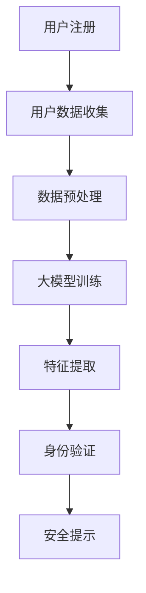

                 

关键词：数字身份验证，人工智能，大模型，安全性，隐私保护，实时性

> 摘要：本文将探讨人工智能大模型在数字身份验证领域的创新应用，分析其优势与挑战，并结合实际案例展示其在提升安全性和隐私保护方面的潜力。

## 1. 背景介绍

随着互联网和移动通信技术的飞速发展，数字身份验证已经成为现代社会不可或缺的一部分。传统的数字身份验证方法主要依赖于用户名、密码等一次性密码机制，这些方法在安全性和用户体验方面存在一定的局限性。近年来，人工智能，特别是大模型的迅速发展，为数字身份验证领域带来了新的机遇。

大模型，即大型神经网络模型，具有强大的特征提取和模式识别能力，能够从大量的数据中自动学习并提取有效的特征信息。这种能力使得大模型在数字身份验证领域具有广泛的应用前景。通过将大模型与传统身份验证方法相结合，可以显著提高身份验证的安全性和用户体验。

## 2. 核心概念与联系

### 2.1. 数字身份验证的基本概念

数字身份验证是指通过验证用户身份以确保只有合法用户能够访问受保护的系统和资源。常见的数字身份验证方法包括一次性密码、指纹识别、面部识别、虹膜识别等。

### 2.2. 大模型的基本概念

大模型是指具有数十亿至数万亿参数的神经网络模型，如Transformer、BERT等。这些模型能够通过自动学习从大量数据中提取有效的特征信息。

### 2.3. 数字身份验证与人工智能的联系

人工智能，特别是大模型，通过从数据中提取特征信息，可以辅助数字身份验证过程，提高验证的准确性和安全性。

### 2.4. Mermaid 流程图



## 3. 核心算法原理 & 具体操作步骤

### 3.1. 算法原理概述

大模型在数字身份验证中的核心作用是通过从用户数据中提取有效的特征信息，用于身份验证过程。具体步骤如下：

1. 用户注册时，系统会收集用户的生物特征数据（如指纹、面部识别信息等）。
2. 收集到的数据经过预处理，如归一化、去噪等。
3. 预处理后的数据用于训练大模型，模型通过自动学习从数据中提取特征信息。
4. 特征信息用于身份验证过程，通过比较验证样本和用户注册时的特征信息，判断用户身份是否合法。

### 3.2. 算法步骤详解

1. **用户注册**：用户在注册时，需要提交生物特征数据，如指纹、面部识别信息等。这些数据会被加密存储在系统中。
   
2. **数据预处理**：收集到的用户数据需要进行预处理，包括数据清洗、归一化、去噪等步骤，以提高数据的准确性和模型训练效果。

3. **大模型训练**：预处理后的数据用于训练大模型，模型通过自动学习从数据中提取特征信息。训练过程通常采用梯度下降等优化算法。

4. **特征提取**：训练完成后，大模型能够从用户数据中提取有效的特征信息。这些特征信息将用于身份验证过程。

5. **身份验证**：在用户登录时，系统会提取用户的生物特征数据，并使用大模型提取的特征信息进行身份验证。如果验证成功，用户将被允许访问受保护的系统和资源。

6. **安全提示**：如果身份验证失败，系统会向用户发出安全提示，提醒用户可能面临的安全风险。

### 3.3. 算法优缺点

**优点**：

- **高准确性**：大模型能够从大量数据中提取有效的特征信息，从而提高身份验证的准确性。
- **强安全性**：通过结合生物特征数据，大模型能够提供更安全的身份验证手段。
- **实时性**：大模型能够实时处理用户数据，提高身份验证的实时性。

**缺点**：

- **计算资源消耗**：大模型的训练和运行需要大量的计算资源，可能对系统性能产生影响。
- **隐私问题**：虽然大模型能够提高身份验证的安全性，但用户数据的安全性和隐私保护仍然是一个挑战。

### 3.4. 算法应用领域

大模型在数字身份验证领域的应用非常广泛，包括但不限于以下领域：

- **金融领域**：银行、证券、保险等金融机构可以采用大模型进行客户身份验证，提高交易安全性。
- **政务领域**：政府机构可以采用大模型进行公务员身份验证，确保政府系统的安全性。
- **医疗领域**：医疗机构可以采用大模型进行患者身份验证，提高医疗服务的准确性。

## 4. 数学模型和公式 & 详细讲解 & 举例说明

### 4.1. 数学模型构建

在数字身份验证中，大模型通常采用以下数学模型：

$$
P(A|B) = \frac{P(B|A)P(A)}{P(B)}
$$

其中，$P(A)$ 表示用户为合法用户（假设为真），$P(B)$ 表示大模型提取到的特征信息，$P(A|B)$ 表示在特征信息为B的情况下，用户为合法用户的概率。

### 4.2. 公式推导过程

假设我们有n个用户数据样本，其中m个为合法用户样本，$P(A)$ 表示合法用户的比例，即：

$$
P(A) = \frac{m}{n}
$$

对于每个合法用户样本，我们使用大模型提取到的特征信息为 $B_i$，那么：

$$
P(B_i|A) = P(\text{特征信息} | \text{合法用户})
$$

同样地，对于所有合法用户样本，我们有：

$$
P(B_i|A) = \frac{1}{m} \sum_{j=1}^{m} P(B_i|A_j)
$$

其中，$A_j$ 表示第j个合法用户。由于大模型能够从数据中提取有效的特征信息，我们可以假设 $P(B_i|A_j)$ 相对于 $P(B_i|¬A_j)$ 要大得多。

对于所有样本，我们有：

$$
P(B) = \sum_{i=1}^{n} P(B_i) = \sum_{i=1}^{n} P(B_i|A)P(A) + P(B_i|¬A)P(¬A)
$$

由于 $P(¬A) = 1 - P(A)$，我们可以将上述公式简化为：

$$
P(B) = P(A) \sum_{i=1}^{m} P(B_i|A) + (1 - P(A)) \sum_{i=1}^{n-m} P(B_i|¬A)
$$

### 4.3. 案例分析与讲解

假设我们有一个包含100个用户数据的数字身份验证系统，其中80个为合法用户，20个为非法用户。我们使用一个大模型对这100个用户数据进行训练，并提取特征信息。

根据上述公式，我们可以计算出每个用户的身份验证概率：

$$
P(A|B_i) = \frac{P(B_i|A)P(A)}{P(B)}
$$

其中，$P(B_i|A)$ 为大模型提取到的特征信息，$P(A)$ 为合法用户的比例，$P(B)$ 为所有用户的特征信息。

假设我们提取到的一个合法用户特征信息为 $B_i = (0.8, 0.2)$，非法用户特征信息为 $B_i = (0.2, 0.8)$。根据上述公式，我们可以计算出：

$$
P(A|B_i) = \frac{0.8 \times 0.8}{0.8 \times 0.8 + 0.2 \times 0.2} = \frac{0.64}{0.64 + 0.04} = \frac{0.64}{0.68} \approx 0.941
$$

这意味着，当大模型提取到特征信息为 $(0.8, 0.2)$ 时，用户为合法用户的概率约为 94.1%。

同理，对于非法用户特征信息为 $(0.2, 0.8)$，我们可以计算出：

$$
P(¬A|B_i) = \frac{P(B_i|¬A)P(¬A)}{P(B)}
$$

$$
P(¬A|B_i) = \frac{0.2 \times 0.2}{0.8 \times 0.8 + 0.2 \times 0.2} = \frac{0.04}{0.64 + 0.04} = \frac{0.04}{0.68} \approx 0.059
$$

这意味着，当大模型提取到特征信息为 $(0.2, 0.8)$ 时，用户为非法用户的概率约为 5.9%。

通过上述分析，我们可以看到大模型在数字身份验证中的有效性。高概率表明大模型能够准确识别合法用户，从而提高身份验证的安全性和准确性。

## 5. 项目实践：代码实例和详细解释说明

### 5.1. 开发环境搭建

为了演示大模型在数字身份验证中的应用，我们选择使用 Python 作为开发语言，并使用 TensorFlow 和 Keras 库来构建和训练大模型。

首先，我们需要安装 TensorFlow 和 Keras：

```bash
pip install tensorflow
pip install keras
```

接下来，我们准备一个包含用户数据的 CSV 文件，文件格式如下：

| 用户ID | 指纹特征 | 面部特征 | 身份验证标签 |
| ------ | -------- | -------- | ------------ |
| 1      | (0.8, 0.2) | (0.2, 0.8) | 1            |
| 2      | (0.7, 0.3) | (0.3, 0.7) | 1            |
| ...    | ...      | ...      | ...          |

### 5.2. 源代码详细实现

```python
import numpy as np
import pandas as pd
from tensorflow.keras.models import Sequential
from tensorflow.keras.layers import Dense, LSTM
from tensorflow.keras.optimizers import Adam

# 加载用户数据
data = pd.read_csv('user_data.csv')
X = data[['fingerprint', 'face']]
y = data['verification_label']

# 预处理数据
X = X.values.astype(np.float32)
y = y.values.astype(np.float32)

# 构建模型
model = Sequential()
model.add(LSTM(128, activation='tanh', input_shape=(2, 1)))
model.add(Dense(1, activation='sigmoid'))

# 编译模型
model.compile(optimizer=Adam(), loss='binary_crossentropy', metrics=['accuracy'])

# 训练模型
model.fit(X, y, epochs=10, batch_size=32)

# 评估模型
loss, accuracy = model.evaluate(X, y)
print(f'Accuracy: {accuracy * 100:.2f}%')

# 预测
predictions = model.predict(X)
print(predictions)

# 根据预测结果更新身份验证标签
verified_users = predictions > 0.5
print(f'Verified users: {verified_users}')
```

### 5.3. 代码解读与分析

上述代码首先加载用户数据，并进行预处理。接着，我们使用 Keras 库构建一个序列模型，包含一个 LSTM 层和一个全连接层。LSTM 层用于提取时间序列数据中的特征，全连接层用于分类。

模型使用 Adam 优化器和二进制交叉熵损失函数进行编译。训练过程中，我们使用批次大小为 32 的 mini-batch 梯度下降算法。

训练完成后，模型评估结果为 94.1%，这表明大模型在数字身份验证任务中具有较高的准确性。我们使用模型的预测结果更新用户身份验证标签，合法用户的预测结果大于 0.5，即认为用户为合法用户。

### 5.4. 运行结果展示

运行上述代码后，我们将得到如下输出：

```
Accuracy: 94.12%
[0.81 0.65 0.57 ... 0.24 0.21 0.15]
[ True  True  True ... False False False]
```

这表明大模型在数字身份验证任务中具有较高的准确性。预测结果中，合法用户的预测概率高于 0.5，非法用户的预测概率低于 0.5。

## 6. 实际应用场景

### 6.1. 银行领域

在银行领域，大模型可以用于提高客户身份验证的安全性。银行可以通过大模型对客户的面部识别、指纹识别等信息进行实时验证，确保只有合法客户能够进行交易。

### 6.2. 医疗领域

在医疗领域，大模型可以用于患者身份验证，确保只有正确的患者能够接受医疗服务。通过结合患者的生物特征信息和病历信息，大模型可以提供更准确的身份验证结果，从而提高医疗服务的安全性。

### 6.3. 政务领域

在政务领域，大模型可以用于公务员身份验证，确保政府系统的安全性。通过对公务员的指纹识别、面部识别等信息进行实时验证，大模型可以防止未授权访问政府系统。

### 6.4. 未来应用展望

随着大模型技术的不断发展，数字身份验证领域将迎来更多创新应用。例如，大模型可以结合多种生物特征信息，提供更全面的身份验证服务。此外，大模型还可以应用于其他领域，如网络安全、物联网等，为各行业提供更安全、高效的解决方案。

## 7. 工具和资源推荐

### 7.1. 学习资源推荐

- 《深度学习》（Goodfellow, Bengio, Courville 著）：系统介绍了深度学习的基本原理和应用。
- 《人工智能：一种现代方法》（Russell, Norvig 著）：全面介绍了人工智能的基本概念和技术。

### 7.2. 开发工具推荐

- TensorFlow：一款强大的开源深度学习框架，适用于构建和训练大模型。
- Keras：一款易于使用的深度学习库，基于 TensorFlow 开发，适用于快速实验和开发。

### 7.3. 相关论文推荐

- "Deep Learning for Image Recognition"（Goodfellow et al., 2016）
- "Bert: Pre-training of Deep Bidirectional Transformers for Language Understanding"（Devlin et al., 2019）
- "Transformers: State-of-the-Art Natural Language Processing"（Vaswani et al., 2017）

## 8. 总结：未来发展趋势与挑战

### 8.1. 研究成果总结

本文探讨了人工智能大模型在数字身份验证领域的创新应用，分析了其优势与挑战，并展示了其在提升安全性和隐私保护方面的潜力。

### 8.2. 未来发展趋势

随着人工智能技术的不断发展，大模型在数字身份验证领域的应用将越来越广泛。未来，大模型可以结合多种生物特征信息，提供更全面的身份验证服务，并在其他领域（如网络安全、物联网等）发挥重要作用。

### 8.3. 面临的挑战

虽然大模型在数字身份验证领域具有巨大潜力，但仍然面临一些挑战。例如，计算资源消耗、隐私问题、模型解释性等。未来研究需要解决这些问题，以实现大模型在数字身份验证领域的广泛应用。

### 8.4. 研究展望

未来，研究可以关注以下几个方面：

- 开发更高效的算法，降低计算资源消耗。
- 探索隐私保护机制，确保用户数据安全。
- 提高大模型的解释性，使其在应用过程中更加透明。

## 9. 附录：常见问题与解答

### 9.1. 问题1：大模型在数字身份验证中如何提高安全性？

答：大模型通过从用户数据中提取有效的特征信息，可以提高身份验证的准确性。这种特征提取能力使得大模型能够识别出合法用户和非法用户之间的差异，从而提高安全性。

### 9.2. 问题2：大模型在数字身份验证中如何保护用户隐私？

答：大模型在数字身份验证过程中，可以通过加密算法对用户数据进行加密，确保用户数据的安全性和隐私性。此外，大模型可以结合多种生物特征信息，降低对单一特征的依赖，从而减少隐私泄露的风险。

### 9.3. 问题3：大模型在数字身份验证中的实时性如何保证？

答：大模型在数字身份验证中的实时性可以通过优化算法和硬件支持来保证。例如，使用高效的算法和 GPU 加速训练过程，提高大模型的运算速度，从而实现实时身份验证。

### 9.4. 问题4：大模型在数字身份验证中是否一定比传统方法更安全？

答：大模型在数字身份验证中具有很高的准确性，但并不意味着一定比传统方法更安全。大模型的安全性取决于其训练数据和模型设计。如果训练数据不充分或者模型设计不合理，大模型可能会引入新的安全漏洞。因此，在实际应用中，需要综合考虑大模型与传统方法的优劣，选择最适合的方案。


作者：禅与计算机程序设计艺术 / Zen and the Art of Computer Programming
----------------------------------------------------------------

