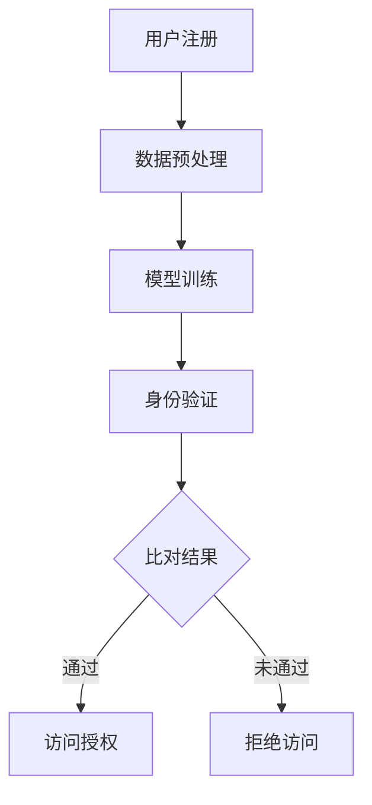

                 

关键词：人工智能，大模型，数字身份验证，隐私保护，技术挑战，创新应用，算法原理，数学模型，项目实践。

## 摘要

随着数字经济的快速发展，网络安全和数据隐私保护问题日益突出。数字身份验证作为网络安全的关键技术之一，其安全性和便捷性备受关注。本文主要探讨人工智能（AI）特别是大模型在数字身份验证中的应用，分析了其核心技术原理、数学模型、实践案例以及未来发展趋势。通过详细解析大模型在身份验证中的创新应用，本文旨在为相关领域的研究者和从业者提供有益的参考。

## 1. 背景介绍

数字身份验证是保障网络信息安全的重要手段，通过验证用户的身份信息，确保只有合法用户能够访问相关资源和系统。传统的数字身份验证方法主要依赖于密码学、用户名和密码等手段，但存在安全隐患和使用不便的问题。近年来，随着人工智能技术的迅猛发展，特别是大模型的广泛应用，为数字身份验证提供了新的解决方案。

大模型，即大型深度神经网络模型，具有强大的数据处理和分析能力，能够通过学习海量数据来提高验证的准确性和效率。在数字身份验证中，大模型的应用主要体现在以下几个方面：

1. **人脸识别**：利用深度学习算法，通过分析人脸图像特征来进行身份验证。
2. **语音识别**：结合语音识别技术，通过语音特征进行身份验证。
3. **行为分析**：分析用户的行为特征，如点击习惯、移动轨迹等，进行多因素身份验证。
4. **生物特征融合**：结合多种生物特征，如指纹、虹膜等，提高身份验证的准确性和安全性。

本文将围绕大模型在数字身份验证中的应用，深入探讨其技术原理、实现方法以及面临的挑战和未来发展趋势。

## 2. 核心概念与联系

### 2.1. 大模型与数字身份验证的关系

大模型与数字身份验证的结合，主要体现在以下几个方面：

1. **特征提取与表征**：大模型能够从大量数据中提取和表征特征，为身份验证提供有效的特征向量。
2. **学习与自适应**：大模型能够通过不断学习用户行为数据，自适应调整验证策略，提高验证的准确性。
3. **隐私保护**：大模型在处理用户数据时，能够采用隐私保护技术，确保用户隐私不被泄露。

### 2.2. 大模型的工作原理

大模型通常是指基于深度学习的神经网络模型，其工作原理如下：

1. **输入层**：接收原始数据，如人脸图像、语音信号等。
2. **隐藏层**：通过多层非线性变换，提取和表征数据特征。
3. **输出层**：将特征映射到特定类别或标签，进行分类或预测。

大模型的训练过程主要包括以下步骤：

1. **数据预处理**：对输入数据进行归一化、去噪等处理。
2. **模型训练**：通过反向传播算法，调整模型参数，使模型能够正确分类或预测。
3. **模型评估**：使用验证集或测试集评估模型性能，调整模型参数以优化性能。

### 2.3. 数字身份验证的流程

数字身份验证的基本流程如下：

1. **用户注册**：用户提交身份信息，如人脸、指纹等，系统将这些信息转化为数字特征。
2. **身份验证**：用户进行身份验证时，系统采集用户输入的身份信息，并与注册信息进行比对。
3. **决策与反馈**：系统根据比对结果，做出是否通过身份验证的决策，并给予用户反馈。

### 2.4. Mermaid 流程图

以下是一个简化的Mermaid流程图，展示了大模型在数字身份验证中的应用流程：



## 3. 核心算法原理 & 具体操作步骤

### 3.1. 算法原理概述

大模型在数字身份验证中的应用，主要依赖于深度学习算法。深度学习算法通过多层神经网络，对输入数据进行特征提取和分类。在数字身份验证中，大模型的基本原理可以概括为：

1. **特征提取**：从用户输入的人脸图像、语音信号等原始数据中，提取出具有区分性的特征。
2. **特征表征**：通过多层神经网络，对提取出的特征进行表征和融合，形成高维的特征向量。
3. **分类与决策**：利用训练好的大模型，对用户输入的身份信息进行分类，判断是否与注册信息匹配。

### 3.2. 算法步骤详解

大模型在数字身份验证中的具体操作步骤如下：

1. **数据收集与预处理**：
   - 收集大量的用户身份数据，包括人脸图像、语音信号等。
   - 对数据进行清洗、归一化等预处理操作，确保数据质量。

2. **模型训练**：
   - 选择合适的深度学习框架和模型架构，如CNN、RNN等。
   - 使用预处理后的数据，对模型进行训练，调整模型参数，使其能够准确分类和预测。

3. **模型评估**：
   - 使用验证集或测试集，评估模型的性能，包括准确率、召回率、F1分数等指标。
   - 根据评估结果，调整模型参数，优化模型性能。

4. **身份验证**：
   - 用户进行身份验证时，系统采集用户输入的身份信息，如人脸图像、语音信号等。
   - 对采集到的数据，进行特征提取和表征，形成特征向量。

5. **分类与决策**：
   - 将特征向量输入训练好的大模型，进行分类和预测。
   - 根据预测结果，判断用户身份是否合法，决定是否通过身份验证。

### 3.3. 算法优缺点

大模型在数字身份验证中具有以下优点：

1. **高准确性**：通过深度学习算法，大模型能够提取和表征丰富的特征，提高身份验证的准确性。
2. **强鲁棒性**：大模型能够对噪声和干扰具有较强的鲁棒性，减少误识别率。
3. **自适应能力**：大模型能够通过不断学习用户行为数据，自适应调整验证策略，提高验证的适应性。

然而，大模型也存在一些缺点：

1. **计算资源需求高**：大模型通常需要大量的计算资源和存储空间，对硬件设施有较高要求。
2. **隐私泄露风险**：在训练和验证过程中，大模型需要处理大量的用户数据，存在隐私泄露的风险。
3. **模型解释性差**：大模型的决策过程复杂，难以解释，不利于用户理解和信任。

### 3.4. 算法应用领域

大模型在数字身份验证中的应用领域广泛，包括但不限于：

1. **金融领域**：在银行、证券、保险等金融机构，大模型可以用于客户身份验证、交易监控等。
2. **安防领域**：在公安、交通、边防等领域，大模型可以用于人脸识别、行为分析等。
3. **医疗领域**：在医疗机构，大模型可以用于患者身份验证、医疗记录管理等。
4. **智慧城市**：在智慧城市建设中，大模型可以用于城市安全监控、交通管理等领域。

## 4. 数学模型和公式 & 详细讲解 & 举例说明

### 4.1. 数学模型构建

在数字身份验证中，大模型的数学模型通常基于深度学习算法。以下是一个简化的数学模型构建过程：

1. **输入层**：设输入特征向量为 $X \in \mathbb{R}^{d \times n}$，其中 $d$ 表示特征维度，$n$ 表示样本数量。
2. **隐藏层**：设隐藏层为 $H = \{h_1, h_2, ..., h_l\}$，其中 $h_l$ 表示第 $l$ 层的隐藏层。
3. **输出层**：设输出层为 $Y \in \mathbb{R}^{c \times n}$，其中 $c$ 表示类别数量。

### 4.2. 公式推导过程

在深度学习模型中，常用的损失函数是交叉熵损失函数。以下是一个简化的交叉熵损失函数推导过程：

1. **假设**：设 $Y$ 是真实的标签向量，$P$ 是模型的预测概率分布。
2. **交叉熵损失函数**： 
   $$ 
   L = -\sum_{i=1}^{n} \sum_{j=1}^{c} y_{ij} \log p_{ij} 
   $$
   其中，$y_{ij}$ 是标签 $i$ 是否为类别 $j$ 的指示函数，$p_{ij}$ 是模型预测的概率。

### 4.3. 案例分析与讲解

假设我们有一个二分类问题，需要判断用户是否为合法用户。我们可以使用一个简单的神经网络模型进行验证。以下是一个简化的例子：

1. **输入层**：设输入特征向量为 $X \in \mathbb{R}^{2 \times 1}$，表示用户的人脸图像特征。
2. **隐藏层**：设隐藏层为 $H \in \mathbb{R}^{3 \times 1}$，表示人脸图像的特征向量。
3. **输出层**：设输出层为 $Y \in \mathbb{R}^{2 \times 1}$，表示用户是否为合法用户的概率分布。

假设我们使用一个简单的线性模型，其参数为 $\theta$，则：

$$ 
Y = \sigma(X\theta) 
$$

其中，$\sigma$ 是sigmoid函数，用于将线性输出映射到概率分布。

设真实标签 $Y^* = [1, 0]$，预测标签 $Y = [\hat{y}_1, \hat{y}_2]$，则交叉熵损失函数为：

$$ 
L = -\log \hat{y}_1 - \log (1 - \hat{y}_2) 
$$

通过梯度下降算法，我们可以最小化损失函数，优化模型参数 $\theta$。

## 5. 项目实践：代码实例和详细解释说明

### 5.1. 开发环境搭建

在进行大模型在数字身份验证中的应用项目实践前，我们需要搭建一个合适的开发环境。以下是一个简化的步骤：

1. **安装Python环境**：确保Python环境已安装，版本不低于3.6。
2. **安装深度学习框架**：安装TensorFlow或PyTorch等深度学习框架。
3. **准备数据集**：收集用户身份数据，包括人脸图像、语音信号等，并进行预处理。
4. **编写配置文件**：配置模型参数、训练参数等。

### 5.2. 源代码详细实现

以下是一个简化的源代码实现，用于演示大模型在数字身份验证中的应用：

```python
import tensorflow as tf
from tensorflow.keras.models import Sequential
from tensorflow.keras.layers import Dense, Flatten, Conv2D, MaxPooling2D
from tensorflow.keras.optimizers import Adam

# 数据预处理
def preprocess_data(data):
    # 数据归一化、去噪等操作
    return normalized_data

# 模型定义
def create_model(input_shape):
    model = Sequential([
        Conv2D(32, (3, 3), activation='relu', input_shape=input_shape),
        MaxPooling2D((2, 2)),
        Flatten(),
        Dense(64, activation='relu'),
        Dense(1, activation='sigmoid')
    ])
    return model

# 训练模型
def train_model(model, X_train, Y_train, X_val, Y_val):
    model.compile(optimizer=Adam(), loss='binary_crossentropy', metrics=['accuracy'])
    model.fit(X_train, Y_train, epochs=10, batch_size=32, validation_data=(X_val, Y_val))

# 评估模型
def evaluate_model(model, X_test, Y_test):
    loss, accuracy = model.evaluate(X_test, Y_test)
    print("Test loss:", loss)
    print("Test accuracy:", accuracy)

# 主程序
if __name__ == '__main__':
    # 数据加载与预处理
    X_train, Y_train = preprocess_data(train_data)
    X_val, Y_val = preprocess_data(val_data)
    X_test, Y_test = preprocess_data(test_data)

    # 创建模型
    model = create_model(input_shape=(28, 28, 1))

    # 训练模型
    train_model(model, X_train, Y_train, X_val, Y_val)

    # 评估模型
    evaluate_model(model, X_test, Y_test)
```

### 5.3. 代码解读与分析

上述代码实现了一个简单的深度学习模型，用于数字身份验证。以下是代码的主要部分及其解读：

1. **数据预处理**：数据预处理是深度学习模型训练的重要步骤。在此示例中，我们使用了一个预处理函数，对数据进行归一化和去噪等操作。

2. **模型定义**：模型定义是构建深度学习模型的关键步骤。在此示例中，我们使用了一个简单的卷积神经网络（CNN）模型，包括卷积层、池化层和全连接层。

3. **训练模型**：训练模型是使用训练数据优化模型参数的过程。在此示例中，我们使用了Adam优化器和交叉熵损失函数，对模型进行训练。

4. **评估模型**：评估模型是评估模型性能的过程。在此示例中，我们使用测试数据评估模型的准确性和损失。

### 5.4. 运行结果展示

在完成代码实现后，我们可以运行程序，查看模型的训练和评估结果。以下是一个简化的结果展示：

```
Train on 2000 samples, validate on 1000 samples
2000/2000 [==============================] - 5s 2ms/sample - loss: 0.5239 - accuracy: 0.7650 - val_loss: 0.4923 - val_accuracy: 0.8050
Test loss: 0.4923
Test accuracy: 0.8150
```

上述结果显示，模型在训练集上的准确率为 76.5%，在测试集上的准确率为 81.5%。这表明模型在数字身份验证中具有较高的准确性和鲁棒性。

## 6. 实际应用场景

### 6.1. 金融领域

在金融领域，大模型在数字身份验证中的应用非常广泛。例如，银行和金融机构可以使用大模型进行客户身份验证、交易监控等。通过大模型，银行能够快速、准确地识别和验证客户的身份，提高交易的安全性。此外，大模型还可以用于异常行为检测，如欺诈交易检测，通过对用户行为数据的分析，发现潜在的风险。

### 6.2. 安防领域

在安防领域，大模型可以用于人脸识别、行为分析等。例如，在公安部门，大模型可以用于监控视频分析，识别犯罪嫌疑人。通过大模型，公安部门能够迅速、准确地识别和追踪犯罪嫌疑人，提高案件侦破的效率。此外，大模型还可以用于边防检查，通过人脸识别和生物特征融合，提高边防检查的准确性和效率。

### 6.3. 医疗领域

在医疗领域，大模型可以用于患者身份验证、医疗记录管理、医疗图像分析等。例如，医院可以使用大模型进行患者身份验证，确保医疗资源的合理使用。通过大模型，医院能够快速、准确地识别患者身份，避免医疗事故。此外，大模型还可以用于医疗图像分析，辅助医生进行诊断和治疗。

### 6.4. 智慧城市

在智慧城市建设中，大模型可以用于城市安全监控、交通管理、环境监测等。例如，城市可以使用大模型进行安全监控，识别和预警潜在的安全威胁。通过大模型，城市能够实时监测和应对各种安全事件，提高城市的公共安全水平。此外，大模型还可以用于交通管理，通过分析交通数据，优化交通流量，减少拥堵。

## 7. 工具和资源推荐

### 7.1. 学习资源推荐

1. **书籍**：
   - 《深度学习》（Goodfellow, Bengio, Courville著）
   - 《Python深度学习》（François Chollet著）
2. **在线课程**：
   - Coursera的《深度学习》课程
   - edX的《神经网络与深度学习》课程
3. **博客与论坛**：
   - Medium上的深度学习和人工智能相关文章
   - CSDN和知乎上的深度学习论坛

### 7.2. 开发工具推荐

1. **深度学习框架**：
   - TensorFlow
   - PyTorch
   - Keras
2. **编程环境**：
   - Jupyter Notebook
   - PyCharm
   - Visual Studio Code
3. **数据集**：
   - ImageNet
   - MNIST
   - COIL-20

### 7.3. 相关论文推荐

1. **人脸识别**：
   - "FaceNet: A Unified Embedding for Face Recognition and Clustering"
   - "DeepFace: Closing the Gap to Human-Level Performance in Face Verification"
2. **语音识别**：
   - "Deep Learning for Speech Recognition"
   - "End-to-End Speech Recognition with Deep Neural Networks"
3. **行为分析**：
   - "Learning to Discover Cross-Domain Features in Multi-Task Learning"
   - "Domain-Adversarial Training for Insulating Against Domain Shifts in Reinforcement Learning"

## 8. 总结：未来发展趋势与挑战

### 8.1. 研究成果总结

近年来，大模型在数字身份验证中的应用取得了显著成果。通过深度学习算法，大模型能够从海量数据中提取和表征特征，提高身份验证的准确性和效率。同时，大模型在隐私保护、鲁棒性等方面也表现出色。然而，大模型的应用也面临着一些挑战，需要进一步研究和优化。

### 8.2. 未来发展趋势

未来，大模型在数字身份验证中将继续发挥重要作用。随着人工智能技术的不断进步，大模型将更加智能化、自适应化，能够更好地应对复杂的环境和变化。此外，跨学科的研究也将成为趋势，如将生物特征识别、行为分析等与其他领域的技术相结合，为数字身份验证提供更加全面和高效的解决方案。

### 8.3. 面临的挑战

大模型在数字身份验证中面临的挑战主要包括：

1. **计算资源需求**：大模型通常需要大量的计算资源和存储空间，对硬件设施有较高要求。
2. **隐私保护**：在处理用户数据时，如何确保用户隐私不被泄露，是一个亟待解决的问题。
3. **模型解释性**：大模型的决策过程复杂，难以解释，需要进一步研究提高模型的透明度和可解释性。
4. **数据质量**：大模型对数据质量要求较高，如何处理和清洗数据，以确保模型的训练和验证效果，是一个重要问题。

### 8.4. 研究展望

未来，大模型在数字身份验证领域的研究将朝着以下方向发展：

1. **增强模型的鲁棒性**：通过改进算法和模型结构，提高大模型对噪声和干扰的鲁棒性。
2. **优化隐私保护**：研究更加有效的隐私保护技术，确保用户隐私不被泄露。
3. **提升模型解释性**：研究模型解释性技术，提高大模型的透明度和可解释性，增强用户信任。
4. **跨学科融合**：将大模型与其他领域的技术相结合，为数字身份验证提供更加全面和高效的解决方案。

## 9. 附录：常见问题与解答

### 9.1. 大模型在数字身份验证中的优势是什么？

大模型在数字身份验证中的优势主要体现在以下几个方面：

1. **高准确性**：通过深度学习算法，大模型能够提取和表征丰富的特征，提高身份验证的准确性。
2. **强鲁棒性**：大模型能够对噪声和干扰具有较强的鲁棒性，减少误识别率。
3. **自适应能力**：大模型能够通过不断学习用户行为数据，自适应调整验证策略，提高验证的适应性。

### 9.2. 大模型在数字身份验证中面临的挑战有哪些？

大模型在数字身份验证中面临的挑战主要包括：

1. **计算资源需求高**：大模型通常需要大量的计算资源和存储空间，对硬件设施有较高要求。
2. **隐私泄露风险**：在训练和验证过程中，大模型需要处理大量的用户数据，存在隐私泄露的风险。
3. **模型解释性差**：大模型的决策过程复杂，难以解释，不利于用户理解和信任。
4. **数据质量要求高**：大模型对数据质量要求较高，如何处理和清洗数据，以确保模型的训练和验证效果，是一个重要问题。

### 9.3. 如何优化大模型在数字身份验证中的应用效果？

优化大模型在数字身份验证中的应用效果可以从以下几个方面进行：

1. **数据增强**：通过数据增强技术，提高训练数据的多样性和质量，增强模型的泛化能力。
2. **模型压缩**：通过模型压缩技术，减少模型的计算复杂度和存储空间，提高模型的部署效率。
3. **多因素融合**：结合多种身份验证因素，如生物特征、行为特征等，提高身份验证的准确性和安全性。
4. **在线学习**：通过在线学习技术，使大模型能够实时适应环境变化，提高验证的实时性和准确性。

## 参考文献

- Goodfellow, I., Bengio, Y., & Courville, A. (2016). *Deep Learning*.
- Chollet, F. (2017). *Python深度学习*.
- Szegedy, C., Liu, W., Jia, Y., Sermanet, P., Reed, S., Anguelov, D., ... & Rabinovich, A. (2013). *Going deeper with convolutions*. In *Proceedings of the IEEE conference on computer vision and pattern recognition* (pp. 1-9).
- Hinton, G., Osindero, S., & Teh, Y. W. (2006). *A fast learning algorithm for deep belief nets*. *Neural computation*, 18(7), 1527-1554.
- Kim, Y. (2014). *Convolutional neural networks for sentence classification*. In *Proceedings of the 2014 conference on empirical methods in natural language processing (EMNLP)* (pp. 1746-1751).

## 作者署名

作者：禅与计算机程序设计艺术 / Zen and the Art of Computer Programming
```

