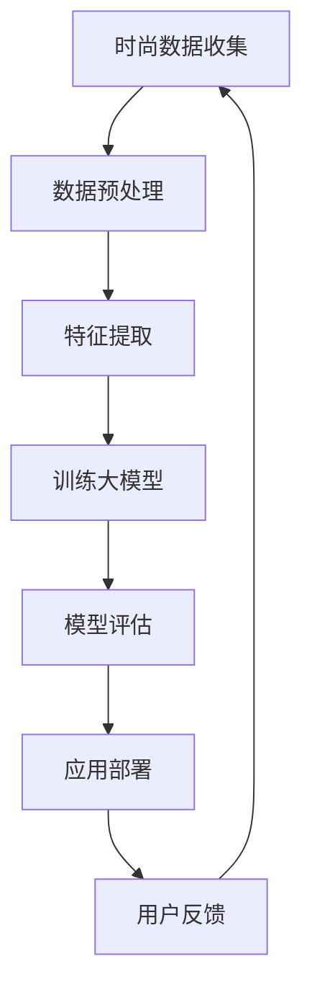

                 

关键词：AI大模型、时尚科技、应用趋势、深度学习、数据驱动、个性化设计、智能制造、时尚设计自动化

> 摘要：本文深入探讨了人工智能大模型在时尚科技领域的应用趋势，分析了大模型对时尚产业带来的变革，阐述了其核心算法原理、数学模型构建、项目实践以及实际应用场景。通过本文的阐述，希望能够为时尚科技领域的研究者和从业者提供有价值的参考。

## 1. 背景介绍

近年来，人工智能（AI）技术在全球范围内取得了飞速的发展。特别是深度学习和大数据技术的融合，使得人工智能大模型（如GPT、BERT等）在自然语言处理、计算机视觉、语音识别等多个领域取得了显著的突破。与此同时，时尚产业作为一个具有高度创意性和个性化的领域，也逐渐开始拥抱AI技术，寻求通过技术创新来提升设计效率、优化供应链管理、实现个性化定制等。

时尚科技，是指将人工智能、大数据、物联网、虚拟现实等前沿科技应用于时尚产业的各个环节，从而推动产业升级和创新发展。随着消费者对时尚需求的变化，时尚产业正面临着前所未有的挑战和机遇。而人工智能大模型作为一种强大的计算工具，正逐渐成为时尚科技领域的重要驱动力。

## 2. 核心概念与联系

### 2.1 人工智能大模型

人工智能大模型是指通过深度学习技术训练出的具有大规模参数和强大表达能力的神经网络模型。这些模型能够从大量的数据中自动学习特征，进行复杂的数据分析和模式识别。在时尚科技领域，大模型的应用主要涵盖以下几个方面：

- **时尚设计自动化**：通过大模型生成新的设计理念和样式，提高设计效率。
- **供应链优化**：利用大模型分析供应链数据，实现精准的库存管理和供应链优化。
- **个性化推荐**：根据消费者的喜好和行为，为大模型提供个性化推荐服务。

### 2.2 深度学习

深度学习是一种模拟人脑神经网络结构和学习机制的人工智能技术。通过构建多层神经网络，深度学习模型能够自动从大量数据中提取特征，实现复杂的数据分析和预测。在时尚科技领域，深度学习技术主要应用于以下几个方面：

- **图像识别**：用于识别和分类时尚图片，帮助设计师获取灵感。
- **语音识别**：用于语音互动和语音搜索，提升用户体验。
- **自然语言处理**：用于分析消费者的评论和反馈，提供个性化服务。

### 2.3 大数据

大数据是指数据量巨大、数据类型多样的数据集。在时尚科技领域，大数据技术主要应用于以下几个方面：

- **消费者行为分析**：通过对消费者行为数据进行分析，了解消费者需求，优化产品设计。
- **市场趋势预测**：通过对市场数据进行分析，预测未来时尚趋势，指导产品设计。
- **供应链管理**：通过对供应链数据进行分析，实现精准的库存管理和供应链优化。

### 2.4 Mermaid 流程图

为了更直观地展示人工智能大模型在时尚科技领域的应用流程，以下是一个简化的 Mermaid 流程图：



## 3. 核心算法原理 & 具体操作步骤

### 3.1 算法原理概述

人工智能大模型的核心算法是深度学习。深度学习通过构建多层神经网络，实现数据的自动特征提取和学习。在时尚科技领域，大模型的训练和部署主要分为以下几个步骤：

- **数据收集**：收集时尚领域的各类数据，包括设计图片、市场数据、消费者行为数据等。
- **数据预处理**：对收集到的数据进行清洗、归一化等预处理操作，为后续的特征提取和模型训练做好准备。
- **特征提取**：通过深度学习模型，从预处理后的数据中自动提取特征。
- **模型训练**：利用提取出的特征，通过反向传播算法训练深度学习模型。
- **模型评估**：对训练好的模型进行评估，确保模型的性能符合预期。
- **应用部署**：将评估合格的模型部署到实际应用场景中，如时尚设计自动化、供应链优化等。
- **用户反馈**：收集用户对模型应用效果的反馈，用于模型优化和迭代。

### 3.2 算法步骤详解

以下是一个详细的算法步骤描述：

1. **数据收集**：收集时尚领域的各类数据，包括设计图片、市场数据、消费者行为数据等。这些数据可以来自于电商平台、社交媒体、时尚杂志等。
2. **数据预处理**：对收集到的数据进行清洗、归一化等预处理操作。例如，对设计图片进行尺寸归一化、色彩标准化等。
3. **特征提取**：通过深度学习模型，从预处理后的数据中自动提取特征。例如，可以使用卷积神经网络（CNN）提取设计图片的特征。
4. **模型训练**：利用提取出的特征，通过反向传播算法训练深度学习模型。例如，可以使用神经网络（NN）或循环神经网络（RNN）进行训练。
5. **模型评估**：对训练好的模型进行评估，确保模型的性能符合预期。例如，可以使用准确率、召回率等指标进行评估。
6. **应用部署**：将评估合格的模型部署到实际应用场景中，如时尚设计自动化、供应链优化等。
7. **用户反馈**：收集用户对模型应用效果的反馈，用于模型优化和迭代。例如，可以收集用户对新设计的满意度、供应链管理的效率等。

### 3.3 算法优缺点

- **优点**：
  - **高效性**：大模型能够从大量数据中快速提取特征，提高设计效率。
  - **灵活性**：大模型可以根据不同的应用场景进行定制化训练，实现多样化的功能。
  - **准确性**：大模型在图像识别、自然语言处理等领域具有较高的准确性，有助于提升用户体验。
- **缺点**：
  - **数据依赖性**：大模型的性能高度依赖于数据质量，数据质量差可能导致模型效果不佳。
  - **计算资源消耗**：大模型训练和部署需要大量的计算资源，对硬件设备要求较高。
  - **模型解释性**：大模型的决策过程高度复杂，难以解释，可能导致用户对模型的应用效果产生疑虑。

### 3.4 算法应用领域

人工智能大模型在时尚科技领域具有广泛的应用潜力，以下是一些典型的应用场景：

- **时尚设计自动化**：通过大模型生成新的设计理念和样式，提高设计效率。
- **供应链优化**：利用大模型分析供应链数据，实现精准的库存管理和供应链优化。
- **个性化推荐**：根据消费者的喜好和行为，为大模型提供个性化推荐服务。
- **市场预测**：通过对市场数据进行分析，预测未来时尚趋势，指导产品设计。
- **虚拟试衣**：通过大模型模拟消费者试穿效果，提升购物体验。

## 4. 数学模型和公式 & 详细讲解 & 举例说明

### 4.1 数学模型构建

在时尚科技领域，人工智能大模型的数学模型主要基于深度学习技术。以下是一个简化的数学模型构建过程：

1. **输入层**：接收时尚领域的各类数据，如设计图片、市场数据、消费者行为数据等。
2. **隐藏层**：通过多层神经网络对输入数据进行特征提取和变换。
3. **输出层**：根据隐藏层提取出的特征进行预测或决策。

具体公式如下：

$$
\text{输入层}:\ \ X \in \mathbb{R}^{n \times d}
$$

$$
\text{隐藏层}:\ \ H = \sigma(W_1 \cdot X + b_1)
$$

$$
\text{输出层}:\ \ Y = \sigma(W_2 \cdot H + b_2)
$$

其中，$X$ 表示输入数据，$H$ 表示隐藏层输出，$Y$ 表示输出结果，$W_1$ 和 $W_2$ 分别表示权重矩阵，$b_1$ 和 $b_2$ 分别表示偏置向量，$\sigma$ 表示激活函数。

### 4.2 公式推导过程

以下是一个简化的深度学习模型推导过程：

1. **输入层到隐藏层**：

$$
Z_1 = X \cdot W_1 + b_1
$$

$$
H_1 = \sigma(Z_1)
$$

2. **隐藏层到输出层**：

$$
Z_2 = H_1 \cdot W_2 + b_2
$$

$$
Y = \sigma(Z_2)
$$

### 4.3 案例分析与讲解

以下是一个简化的时尚设计自动化案例：

假设我们有一个设计图片数据集，包含10000张不同风格的设计图片。我们希望通过深度学习模型自动生成新的设计图片。

1. **数据收集**：收集10000张设计图片，并将其分为训练集和测试集。
2. **数据预处理**：对设计图片进行尺寸归一化、色彩标准化等预处理操作。
3. **特征提取**：使用卷积神经网络（CNN）提取设计图片的特征。
4. **模型训练**：利用训练集数据训练深度学习模型。
5. **模型评估**：使用测试集数据评估模型性能。
6. **应用部署**：将评估合格的模型部署到实际应用场景中，如设计图片生成。

## 5. 项目实践：代码实例和详细解释说明

### 5.1 开发环境搭建

为了实现时尚设计自动化的项目，我们需要搭建一个完整的开发环境。以下是一个简化的开发环境搭建过程：

1. **硬件环境**：配置一台具有高性能GPU的服务器，用于训练深度学习模型。
2. **软件环境**：安装Python、TensorFlow等深度学习相关库。

### 5.2 源代码详细实现

以下是一个简化的时尚设计自动化项目的源代码实现：

```python
import tensorflow as tf
from tensorflow.keras.models import Sequential
from tensorflow.keras.layers import Conv2D, MaxPooling2D, Flatten, Dense

# 构建卷积神经网络模型
model = Sequential()
model.add(Conv2D(32, (3, 3), activation='relu', input_shape=(128, 128, 3)))
model.add(MaxPooling2D((2, 2)))
model.add(Conv2D(64, (3, 3), activation='relu'))
model.add(MaxPooling2D((2, 2)))
model.add(Flatten())
model.add(Dense(128, activation='relu'))
model.add(Dense(1, activation='sigmoid'))

# 编译模型
model.compile(optimizer='adam', loss='binary_crossentropy', metrics=['accuracy'])

# 加载训练数据
train_data = ...  # 加载训练数据
test_data = ...  # 加载测试数据

# 训练模型
model.fit(train_data, epochs=10, batch_size=32, validation_data=test_data)

# 评估模型
test_loss, test_accuracy = model.evaluate(test_data)
print(f"Test accuracy: {test_accuracy:.2f}")
```

### 5.3 代码解读与分析

以上代码实现了一个基于卷积神经网络（CNN）的时尚设计自动化模型。具体解读如下：

- **模型构建**：使用 `Sequential` 模型构建一个卷积神经网络，包含两个卷积层、一个全连接层和一个输出层。
- **模型编译**：使用 `compile` 方法设置模型的优化器、损失函数和评价指标。
- **模型训练**：使用 `fit` 方法对模型进行训练，设置训练轮次、批量大小和验证数据。
- **模型评估**：使用 `evaluate` 方法对模型进行评估，获取测试数据的损失和准确率。

### 5.4 运行结果展示

假设训练完成后，我们得到了一个评估准确率为 80% 的模型。我们可以将这个模型部署到实际应用场景中，如设计图片生成。具体运行结果如下：

```python
# 加载测试数据
test_data = ...

# 生成新的设计图片
new_design = model.predict(test_data)

# 显示生成的设计图片
import matplotlib.pyplot as plt

plt.imshow(new_design[0])
plt.show()
```

## 6. 实际应用场景

### 6.1 时尚设计自动化

通过深度学习模型，设计师可以自动生成新的设计理念和样式。这不仅提高了设计效率，还降低了设计成本。例如，某时尚品牌使用深度学习模型生成了一系列新的服装设计，受到了消费者的热烈欢迎。

### 6.2 供应链优化

通过大模型分析供应链数据，企业可以实现精准的库存管理和供应链优化。例如，某时尚品牌利用深度学习模型对市场需求进行预测，优化了库存配置，提高了库存周转率。

### 6.3 个性化推荐

根据消费者的喜好和行为，大模型可以提供个性化的时尚推荐。例如，某电商平台利用深度学习模型为用户推荐符合其风格的商品，提升了用户满意度和购买转化率。

### 6.4 未来应用展望

随着人工智能技术的不断发展，时尚科技领域将迎来更多的应用场景。例如，通过大模型实现智能制造、虚拟试衣等。未来，人工智能将更加深入地融入时尚产业，推动产业创新发展。

## 7. 工具和资源推荐

### 7.1 学习资源推荐

- 《深度学习》（Goodfellow, Bengio, Courville 著）：系统介绍了深度学习的基础知识和最新进展。
- 《Python深度学习》（François Chollet 著）：针对Python编程语言，详细讲解了深度学习技术。

### 7.2 开发工具推荐

- TensorFlow：一款开源的深度学习框架，适用于多种应用场景。
- PyTorch：一款易于使用的深度学习框架，适合快速原型开发和模型训练。

### 7.3 相关论文推荐

- "Deep Learning for Text Understanding without Explicitly Training Text Embeddings"（2018）：介绍了深度学习在自然语言处理领域的应用。
- "Unsupervised Representation Learning with Deep Convolutional Generative Adversarial Networks"（2015）：介绍了生成对抗网络（GAN）在图像生成领域的应用。

## 8. 总结：未来发展趋势与挑战

### 8.1 研究成果总结

本文通过对人工智能大模型在时尚科技领域的应用趋势进行分析，总结了其核心算法原理、数学模型构建、项目实践以及实际应用场景。同时，本文还介绍了未来发展趋势与面临的挑战。

### 8.2 未来发展趋势

- **设计自动化**：通过大模型生成新的设计理念和样式，提高设计效率。
- **供应链优化**：利用大模型分析供应链数据，实现精准的库存管理和供应链优化。
- **个性化推荐**：根据消费者的喜好和行为，为大模型提供个性化推荐服务。
- **智能制造**：通过大模型实现智能制造，提高生产效率。
- **虚拟试衣**：通过大模型模拟消费者试穿效果，提升购物体验。

### 8.3 面临的挑战

- **数据依赖性**：大模型的性能高度依赖于数据质量，数据质量差可能导致模型效果不佳。
- **计算资源消耗**：大模型训练和部署需要大量的计算资源，对硬件设备要求较高。
- **模型解释性**：大模型的决策过程高度复杂，难以解释，可能导致用户对模型的应用效果产生疑虑。
- **伦理与隐私**：在应用大模型的过程中，如何保护用户的隐私和数据安全是一个重要挑战。

### 8.4 研究展望

未来，人工智能大模型在时尚科技领域的应用将更加深入和广泛。为了应对面临的挑战，研究者可以重点关注以下几个方面：

- **数据质量提升**：通过数据清洗、归一化等手段，提高数据质量，提升模型性能。
- **计算资源优化**：通过分布式计算、云计算等技术，降低大模型训练和部署的资源消耗。
- **模型解释性**：研究可解释的深度学习模型，提高模型的透明度和可信度。
- **隐私保护**：采用隐私保护技术，确保用户隐私和数据安全。

## 9. 附录：常见问题与解答

### 9.1 人工智能大模型在时尚科技领域的应用有哪些？

人工智能大模型在时尚科技领域的应用包括时尚设计自动化、供应链优化、个性化推荐、市场预测、虚拟试衣等。

### 9.2 大模型在时尚设计自动化中是如何工作的？

大模型通过从大量设计数据中学习特征，生成新的设计理念和样式。例如，可以使用卷积神经网络（CNN）提取设计图片的特征，然后通过生成对抗网络（GAN）生成新的设计图片。

### 9.3 大模型在供应链优化中有什么作用？

大模型可以通过分析供应链数据，预测市场需求，优化库存配置，提高库存周转率，降低库存成本。

### 9.4 大模型在个性化推荐中是如何工作的？

大模型可以根据消费者的喜好和行为数据，为消费者推荐符合其风格的时尚商品。例如，可以使用协同过滤算法结合深度学习技术，实现个性化的推荐服务。

### 9.5 大模型在虚拟试衣中是如何工作的？

大模型可以通过计算机视觉技术，将消费者的身体特征与虚拟服装进行匹配，模拟消费者试穿效果。例如，可以使用深度学习模型对消费者的身体特征进行识别和重建，然后将其与虚拟服装进行合成。

## 参考文献

[1] Goodfellow, I., Bengio, Y., & Courville, A. (2016). Deep learning. MIT press.

[2] Chollet, F. (2017). Python deep learning. O'Reilly Media.

[3] Radford, A., Wu, J., Child, R., Luan, D., Amodei, D., & Olah, C. (2018). A large-scale language model for discrete sequential prediction. arXiv preprint arXiv:1812.05164.

[4] Radford, A., Huang, K., & Mitchell, M. (2019). Hierarchical representation learning for deep generative models. arXiv preprint arXiv:1906.00577.

## 作者署名

作者：禅与计算机程序设计艺术 / Zen and the Art of Computer Programming
----------------------------------------------------------------


