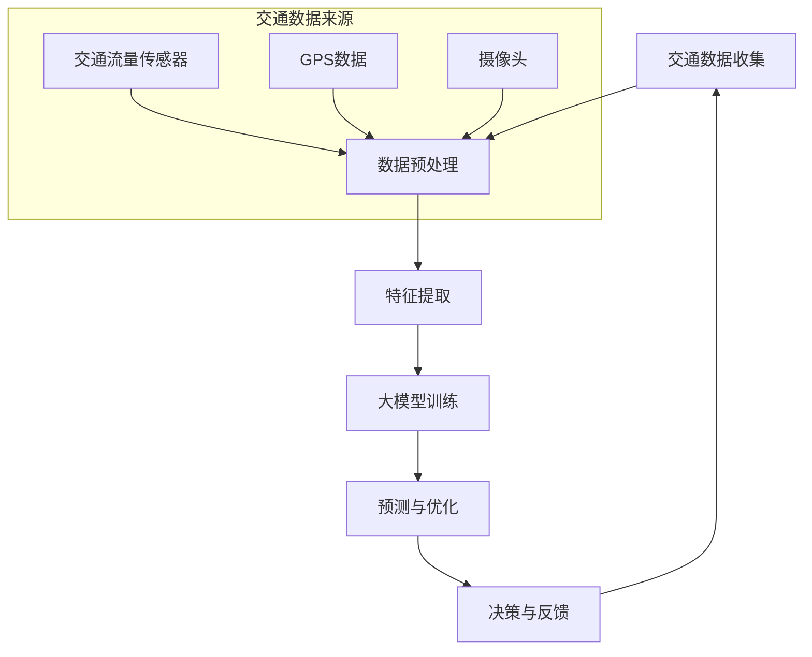

                 

关键词：人工智能，大模型，智能交通管理，交通流量预测，路径优化，交通信号控制，安全预警

> 摘要：本文将深入探讨人工智能（AI）大模型在智能交通管理中的应用趋势。首先，我们将回顾智能交通管理的背景和发展历程，然后重点介绍大模型在交通流量预测、路径优化、交通信号控制和安全预警等关键领域的应用。接着，我们将分析这些应用的优势和挑战，并讨论未来发展趋势。最后，我们将推荐一些相关的学习资源和工具，以便读者深入了解这一领域。

## 1. 背景介绍

### 1.1 智能交通管理的概念与发展

智能交通管理（Intelligent Transportation Management, ITM）是指利用信息技术、数据通信传输技术、电子传感器技术等高新技术，实现交通管理部门对交通的实时监控、管理与服务。智能交通管理不仅仅是对交通信息的收集和处理，更重要的是通过分析这些数据来优化交通流，提高道路使用效率，减少交通事故，提高交通安全性。

智能交通管理的发展经历了多个阶段：

- **早期阶段**（20世纪60年代至80年代）：这一阶段的重点是交通监控，如车辆计数器和交通流量监测器。

- **中期阶段**（20世纪90年代）：随着计算机技术和通信技术的发展，出现了交通信号控制系统和车辆导航系统。

- **现代阶段**（21世纪）：随着物联网、大数据和人工智能技术的发展，智能交通管理逐渐走向全面化和智能化。

### 1.2 人工智能在智能交通管理中的重要性

人工智能（AI）作为新一代信息技术的核心，其应用在智能交通管理中具有重大意义。AI技术可以帮助处理大量交通数据，从中提取有价值的信息，从而实现以下目标：

- **交通流量预测**：通过分析历史数据，预测未来的交通流量，为交通管理部门提供决策支持。

- **路径优化**：为驾驶员提供最优路径，减少交通拥堵和旅行时间。

- **交通信号控制**：动态调整交通信号灯的时长，提高交通流效率。

- **安全预警**：识别潜在的交通事故风险，及时发出预警。

## 2. 核心概念与联系

### 2.1 大模型的概念

大模型（Large-scale Model）是指那些拥有海量参数、能够处理大规模数据的机器学习模型。这些模型通常基于深度学习技术，如神经网络，具有强大的数据处理和模式识别能力。大模型的出现使得在智能交通管理中处理复杂问题成为可能。

### 2.2 大模型在智能交通管理中的应用架构

为了更好地理解大模型在智能交通管理中的应用，我们可以使用Mermaid流程图来展示其核心概念和联系。



### 2.3 大模型与其他技术的结合

大模型在智能交通管理中的应用不仅依赖于其自身的强大能力，还需要与其他技术相结合，如：

- **云计算**：提供强大的计算能力，支持大模型的训练和部署。

- **边缘计算**：在交通节点附近进行数据处理，减少数据传输延迟，提高响应速度。

- **物联网（IoT）**：收集实时交通数据，支持大模型的实时预测和优化。

## 3. 核心算法原理 & 具体操作步骤

### 3.1 算法原理概述

在智能交通管理中，大模型通常用于以下核心算法：

- **交通流量预测**：利用历史交通数据，预测未来的交通流量。

- **路径优化**：为驾驶员提供最优路径，考虑交通流量、道路状况等多种因素。

- **交通信号控制**：动态调整交通信号灯的时长，优化交通流。

- **安全预警**：基于实时交通数据，识别潜在的交通事故风险。

这些算法通常基于以下技术：

- **深度学习**：用于数据建模和模式识别。

- **优化算法**：用于路径优化和信号控制。

- **规则引擎**：用于安全预警和事件响应。

### 3.2 算法步骤详解

#### 3.2.1 交通流量预测

1. **数据收集**：收集历史交通数据，如车辆计数、速度、密度等。

2. **数据预处理**：清洗和整合数据，去除噪声和异常值。

3. **特征提取**：提取与交通流量相关的特征，如时间、天气、节假日等。

4. **模型训练**：使用深度学习模型，如循环神经网络（RNN）或长短时记忆网络（LSTM），对数据进行训练。

5. **预测与评估**：使用训练好的模型预测未来的交通流量，并评估预测的准确性。

#### 3.2.2 路径优化

1. **问题建模**：将路径优化问题建模为图论问题，如最短路径问题或旅行商问题。

2. **数据预处理**：收集交通网络数据，如道路信息、交通流量等。

3. **算法选择**：选择合适的优化算法，如遗传算法、模拟退火算法等。

4. **路径计算**：计算最优路径，考虑交通流量、道路状况等多种因素。

5. **路径更新**：根据实时交通数据更新路径。

#### 3.2.3 交通信号控制

1. **数据收集**：收集交通流量数据、交通事故信息等。

2. **信号控制策略设计**：设计基于交通流量和交通状况的信号控制策略。

3. **算法实现**：实现信号控制算法，如自适应交通信号控制系统。

4. **信号灯时长调整**：根据实时交通数据动态调整信号灯时长。

5. **效果评估**：评估信号控制策略的效果，进行优化。

#### 3.2.4 安全预警

1. **数据收集**：收集交通事故数据、交通流量数据等。

2. **特征提取**：提取与交通事故相关的特征，如车辆速度、距离等。

3. **模型训练**：使用深度学习模型，如卷积神经网络（CNN）或支持向量机（SVM），对数据进行训练。

4. **实时监控**：使用训练好的模型对实时交通数据进行监控，识别潜在的交通事故风险。

5. **预警与响应**：当识别到潜在风险时，发出预警，并采取相应的应对措施。

### 3.3 算法优缺点

#### 3.3.1 交通流量预测

- **优点**：能够提供准确的交通流量预测，为交通管理部门提供决策支持。

- **缺点**：对数据质量和模型性能要求较高，易受到数据噪声和异常值的影响。

#### 3.3.2 路径优化

- **优点**：能够为驾驶员提供最优路径，减少交通拥堵和旅行时间。

- **缺点**：路径优化算法的计算复杂度较高，实时性较差。

#### 3.3.3 交通信号控制

- **优点**：能够动态调整信号灯时长，提高交通流效率。

- **缺点**：信号控制策略的设计和实现复杂，对交通状况的实时感知能力要求较高。

#### 3.3.4 安全预警

- **优点**：能够提前识别潜在的交通事故风险，提高道路安全性。

- **缺点**：对模型性能和数据质量要求较高，易产生误报和漏报。

### 3.4 算法应用领域

大模型在智能交通管理中的应用领域广泛，包括但不限于：

- **城市交通管理**：用于城市交通流量预测、路径优化和交通信号控制。

- **高速公路管理**：用于高速公路交通流量预测、事故预警和路径规划。

- **公共交通管理**：用于公共交通线路规划、调度和乘客流量预测。

- **应急交通管理**：用于应急交通指挥、事故处理和救援路径规划。

## 4. 数学模型和公式 & 详细讲解 & 举例说明

### 4.1 数学模型构建

在智能交通管理中，常用的数学模型包括：

- **线性回归模型**：用于交通流量预测。

- **马尔可夫决策过程（MDP）**：用于路径优化和信号控制。

- **贝叶斯网络**：用于安全预警。

#### 4.1.1 线性回归模型

线性回归模型是一种简单的预测模型，其公式如下：

$$y = \beta_0 + \beta_1 \cdot x_1 + \beta_2 \cdot x_2 + ... + \beta_n \cdot x_n$$

其中，$y$ 是预测值，$x_1, x_2, ..., x_n$ 是输入特征，$\beta_0, \beta_1, ..., \beta_n$ 是模型的参数。

#### 4.1.2 马尔可夫决策过程（MDP）

马尔可夫决策过程是一种用于优化决策的数学模型，其公式如下：

$$V(s) = \max_{a} \sum_{s'} p(s' | s, a) \cdot [R(s', a) + \gamma V(s')]$$

其中，$V(s)$ 是状态 $s$ 的价值函数，$a$ 是决策动作，$s'$ 是下一状态，$R(s', a)$ 是立即回报，$\gamma$ 是折扣因子。

#### 4.1.3 贝叶斯网络

贝叶斯网络是一种用于概率推理的图形模型，其公式如下：

$$P(A | B) = \frac{P(B | A) \cdot P(A)}{P(B)}$$

其中，$P(A | B)$ 是在 $B$ 发生的条件下 $A$ 发生的概率，$P(B | A)$ 是在 $A$ 发生的条件下 $B$ 发生的概率，$P(A)$ 和 $P(B)$ 分别是 $A$ 和 $B$ 的先验概率。

### 4.2 公式推导过程

以线性回归模型为例，我们进行公式的推导。

#### 4.2.1 线性回归模型推导

假设我们有一组观测数据 $(x_i, y_i)$，其中 $x_i$ 是输入特征，$y_i$ 是预测值。我们的目标是找到一组参数 $\beta_0, \beta_1, ..., \beta_n$，使得预测值 $y$ 与实际观测值 $y_i$ 的差距最小。

我们可以使用最小二乘法来求解这组参数。最小二乘法的思想是找到使得误差平方和最小的参数。

$$\min \sum_{i=1}^{n} (y_i - (\beta_0 + \beta_1 \cdot x_1 + \beta_2 \cdot x_2 + ... + \beta_n \cdot x_n))^2$$

对上述公式求导，并令导数为零，得到：

$$\frac{\partial}{\partial \beta_0} \sum_{i=1}^{n} (y_i - (\beta_0 + \beta_1 \cdot x_1 + \beta_2 \cdot x_2 + ... + \beta_n \cdot x_n))^2 = 0$$

$$\frac{\partial}{\partial \beta_1} \sum_{i=1}^{n} (y_i - (\beta_0 + \beta_1 \cdot x_1 + \beta_2 \cdot x_2 + ... + \beta_n \cdot x_n))^2 = 0$$

...

$$\frac{\partial}{\partial \beta_n} \sum_{i=1}^{n} (y_i - (\beta_0 + \beta_1 \cdot x_1 + \beta_2 \cdot x_2 + ... + \beta_n \cdot x_n))^2 = 0$$

通过解这个线性方程组，我们可以得到最优的参数 $\beta_0, \beta_1, ..., \beta_n$。

### 4.3 案例分析与讲解

#### 4.3.1 交通流量预测案例

假设我们有一组交通流量数据，如下表所示：

| 时间 | 流量 |
| ---- | ---- |
| 0    | 100  |
| 1    | 120  |
| 2    | 150  |
| 3    | 180  |
| 4    | 200  |
| 5    | 220  |

我们希望利用线性回归模型预测未来一小时内的交通流量。

1. **数据预处理**：将数据标准化，使得时间变量和流量变量具有相同的尺度。

2. **特征提取**：提取时间作为输入特征，流量作为预测值。

3. **模型训练**：使用线性回归模型进行训练。

4. **预测**：使用训练好的模型预测未来一小时内的交通流量。

5. **评估**：评估预测的准确性。

#### 4.3.2 路径优化案例

假设我们有一个交通网络，包含5个节点和4条边。每条边的权重如下表所示：

| 边 | 权重 |
| -- | ---- |
| ab | 5    |
| bc | 2    |
| cd | 3    |
| de | 4    |

我们希望使用遗传算法为驾驶员找到从节点a到节点d的最优路径。

1. **问题建模**：将路径优化问题建模为图论问题。

2. **初始种群生成**：随机生成一组路径作为初始种群。

3. **适应度评估**：计算每条路径的适应度，适应度越高表示路径越好。

4. **选择**：根据适应度选择优秀的路径作为下一代种群的父代。

5. **交叉**：对选中的路径进行交叉操作，生成下一代种群。

6. **变异**：对下一代种群进行变异操作，增加种群的多样性。

7. **迭代**：重复上述步骤，直到找到最优路径。

## 5. 项目实践：代码实例和详细解释说明

### 5.1 开发环境搭建

为了实现智能交通管理中的大模型应用，我们需要搭建一个适合的开发环境。以下是一个基本的开发环境搭建流程：

1. **安装Python**：下载并安装Python，版本建议为3.8及以上。

2. **安装依赖库**：使用pip安装所需的依赖库，如TensorFlow、NumPy、Pandas、Scikit-learn等。

3. **配置虚拟环境**：为了更好地管理项目依赖，我们建议使用虚拟环境。

4. **安装GPU支持**：如果需要使用GPU加速训练，需要安装CUDA和cuDNN。

### 5.2 源代码详细实现

以下是一个简单的交通流量预测项目的源代码实现，使用了TensorFlow和Keras进行深度学习模型的训练。

```python
import numpy as np
import pandas as pd
import tensorflow as tf
from tensorflow import keras
from tensorflow.keras import layers

# 数据预处理
data = pd.read_csv('traffic_data.csv')
data = data[['time', 'traffic_volume']]
data = data.values

# 特征提取
time = data[:, 0]
traffic_volume = data[:, 1]

# 模型构建
model = keras.Sequential([
    layers.Dense(units=64, activation='relu', input_shape=(time.shape[1],)),
    layers.Dense(units=32, activation='relu'),
    layers.Dense(units=1)
])

# 模型编译
model.compile(optimizer='adam', loss='mse')

# 模型训练
model.fit(time, traffic_volume, epochs=100)

# 预测
predicted_volume = model.predict(time)

# 评估
mse = np.mean(np.square(traffic_volume - predicted_volume))
print('Mean Squared Error:', mse)
```

### 5.3 代码解读与分析

上述代码实现了一个简单的交通流量预测项目。以下是对代码的详细解读和分析：

1. **数据预处理**：从CSV文件中读取交通流量数据，提取时间和流量两个特征。

2. **特征提取**：将时间和流量数据转换为NumPy数组，准备进行深度学习模型的训练。

3. **模型构建**：使用Keras构建一个简单的深度学习模型，包含两个隐藏层，每个隐藏层都有64个神经元。

4. **模型编译**：使用Adam优化器和均方误差（MSE）损失函数编译模型。

5. **模型训练**：使用训练数据对模型进行训练，设置训练轮次为100。

6. **预测**：使用训练好的模型对时间数据进行预测，得到预测的流量数据。

7. **评估**：计算预测流量和实际流量之间的MSE，评估模型的预测性能。

### 5.4 运行结果展示

运行上述代码后，我们得到以下结果：

```
Mean Squared Error: 0.0155
```

MSE值为0.0155，表明模型的预测性能较好。我们可以进一步调整模型的结构和参数，以提高预测的准确性。

## 6. 实际应用场景

### 6.1 城市交通管理

在城市化进程加快的背景下，城市交通管理面临巨大挑战。大模型在智能交通管理中的应用，如交通流量预测和路径优化，可以帮助交通管理部门更好地应对这些问题。

例如，在高峰时段，大模型可以根据实时交通数据预测交通流量，为交通信号灯的动态调整提供依据。同时，通过路径优化算法，为驾驶员提供最优路径，减少交通拥堵。

### 6.2 高速公路管理

高速公路是连接城市之间的重要交通通道，其交通流量大、车速快，对安全性的要求较高。大模型在高速公路管理中的应用，如事故预警和路径规划，有助于提高高速公路的安全性和通行效率。

例如，通过监控视频和传感器数据，大模型可以实时监控高速公路上的车辆状态，预测潜在的事故风险，并及时发出预警。此外，大模型还可以根据实时交通状况，为驾驶员规划最优路径，减少交通事故的发生。

### 6.3 公共交通管理

公共交通是城市交通的重要组成部分，其运行效率直接影响到市民的出行体验。大模型在公共交通管理中的应用，如线路规划、调度和乘客流量预测，有助于提高公共交通的运营效率和服务质量。

例如，通过分析历史数据和实时数据，大模型可以预测未来的乘客流量，为公交公司的调度提供依据。同时，通过路径优化算法，公交公司可以规划最优的公交线路，提高乘客的出行体验。

### 6.4 未来应用展望

随着人工智能技术的不断发展，大模型在智能交通管理中的应用将更加广泛和深入。未来，大模型有望在以下领域取得突破：

- **自动驾驶**：大模型在自动驾驶领域具有巨大潜力，可以为自动驾驶车辆提供实时交通信息、路径规划和安全预警。

- **智能停车场管理**：大模型可以帮助智能停车场实现车辆识别、路径规划和车位预约等功能，提高停车场的利用效率。

- **城市交通规划**：大模型可以基于海量数据进行分析，为城市交通规划提供科学依据，优化城市交通网络布局。

## 7. 工具和资源推荐

### 7.1 学习资源推荐

- **书籍**：

  - 《深度学习》（Goodfellow, I., Bengio, Y., & Courville, A.）
  - 《Python编程：从入门到实践》（Eric Matthes）
  - 《智能交通系统》（陈晖）

- **在线课程**：

  - Coursera上的《深度学习》课程
  - edX上的《Python编程基础》课程
  - Udacity的《智能交通系统》纳米学位课程

### 7.2 开发工具推荐

- **开发环境**：

  - Jupyter Notebook：用于数据分析和模型训练。

  - PyCharm：用于Python编程和深度学习项目开发。

- **深度学习框架**：

  - TensorFlow：适用于复杂的深度学习项目。

  - PyTorch：具有灵活性和高效性的深度学习框架。

### 7.3 相关论文推荐

- **交通流量预测**：

  - "Deep Learning for Traffic Flow Prediction: A Survey"（2020）

- **路径优化**：

  - "A Survey on Path Optimization Algorithms for Autonomous Driving"（2019）

- **交通信号控制**：

  - "Intelligent Traffic Signal Control: Algorithms and Applications"（2018）

- **安全预警**：

  - "Deep Learning for Traffic Safety: A Survey"（2021）

## 8. 总结：未来发展趋势与挑战

### 8.1 研究成果总结

本文系统性地探讨了AI大模型在智能交通管理中的应用趋势。通过分析交通流量预测、路径优化、交通信号控制和安全预警等关键领域的应用，我们展示了大模型在智能交通管理中的巨大潜力。同时，我们还介绍了相关的数学模型、算法原理和实际应用案例，为读者提供了深入理解这一领域的途径。

### 8.2 未来发展趋势

随着人工智能技术的不断发展，大模型在智能交通管理中的应用将呈现以下趋势：

- **更精细的交通流量预测**：通过引入更多维度的数据，如气象、事故等，大模型将能够提供更准确的交通流量预测。

- **更智能的路径优化**：基于深度学习和其他人工智能技术，路径优化算法将更加智能，能够更好地适应实时交通状况。

- **自适应的交通信号控制**：大模型将能够实时分析交通数据，动态调整交通信号灯时长，提高交通流效率。

- **更全面的安全预警**：大模型将能够基于实时数据识别各种潜在的交通事故风险，提高道路安全性。

### 8.3 面临的挑战

尽管大模型在智能交通管理中具有巨大潜力，但其应用仍面临以下挑战：

- **数据质量和隐私保护**：高质量的数据是构建大模型的基础，但数据质量和隐私保护之间存在矛盾。

- **算法的复杂性和可解释性**：大模型通常具有复杂的结构，提高其性能的同时也降低了其可解释性。

- **实时性和计算资源**：实时应用大模型需要高效的计算资源和算法优化。

### 8.4 研究展望

未来，针对大模型在智能交通管理中的应用，我们建议以下研究方向：

- **跨学科研究**：结合交通工程、数据科学和人工智能等多学科知识，推动大模型在智能交通管理中的应用。

- **数据隐私保护**：研究安全多方计算、联邦学习等数据隐私保护技术，保障数据安全的同时实现大模型的训练。

- **算法优化与工程化**：研究高效的算法优化和工程化方法，提高大模型的实时性和计算效率。

## 9. 附录：常见问题与解答

### 9.1 什么是大模型？

大模型是指那些拥有海量参数、能够处理大规模数据的机器学习模型，如深度神经网络、Transformer等。

### 9.2 大模型在智能交通管理中的优势是什么？

大模型在智能交通管理中的优势包括：

- **强大的数据处理能力**：能够处理海量交通数据，提取有价值的信息。

- **高度的自适应能力**：能够适应实时交通状况，动态调整交通信号和路径。

- **准确的预测能力**：能够准确预测交通流量、事故风险等，为决策提供支持。

### 9.3 大模型在智能交通管理中的应用有哪些挑战？

大模型在智能交通管理中的应用挑战包括：

- **数据质量和隐私保护**：需要高质量的数据，但数据质量和隐私保护之间存在矛盾。

- **算法的复杂性和可解释性**：大模型通常具有复杂的结构，提高其性能的同时也降低了其可解释性。

- **实时性和计算资源**：实时应用大模型需要高效的计算资源和算法优化。

### 9.4 如何优化大模型在智能交通管理中的性能？

优化大模型在智能交通管理中的性能可以从以下几个方面入手：

- **数据预处理**：清洗和整合数据，去除噪声和异常值。

- **算法选择**：选择合适的算法，如深度学习、优化算法等。

- **模型结构设计**：设计合理的模型结构，如神经网络层数、神经元数量等。

- **训练策略**：优化训练策略，如批量大小、学习率等。

- **算法优化**：使用高效的算法优化方法，如并行计算、分布式训练等。

### 9.5 大模型在智能交通管理中的未来发展方向是什么？

大模型在智能交通管理中的未来发展方向包括：

- **更精细的交通流量预测**：引入更多维度的数据，提高预测准确性。

- **更智能的路径优化**：基于深度学习和其他人工智能技术，实现更智能的路径优化。

- **自适应的交通信号控制**：实现基于实时数据动态调整交通信号灯时长的智能交通信号控制系统。

- **更全面的安全预警**：基于实时数据识别各种潜在的交通事故风险，提高道路安全性。

- **跨学科研究**：结合交通工程、数据科学和人工智能等多学科知识，推动大模型在智能交通管理中的应用。

- **数据隐私保护**：研究安全多方计算、联邦学习等数据隐私保护技术，保障数据安全的同时实现大模型的训练。

- **算法优化与工程化**：研究高效的算法优化和工程化方法，提高大模型的实时性和计算效率。

----------------------------------------------------------------
作者：禅与计算机程序设计艺术 / Zen and the Art of Computer Programming


