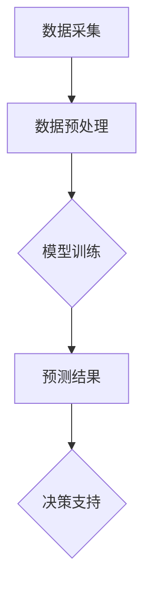

                 

关键词：人工智能、大模型、智能农业、决策支持系统、农业技术、机器学习、深度学习

## 摘要

随着人工智能技术的迅猛发展，大模型在各个领域中的应用越来越广泛。在智能农业领域，大模型为精准农业、病虫害监测、作物生长模型预测等方面提供了强大的技术支持。本文将探讨大模型在智能农业决策中的应用前景，分析其核心算法原理、数学模型以及实际应用案例，并对未来的发展趋势和面临的挑战进行展望。

## 1. 背景介绍

智能农业是农业现代化的关键环节，旨在通过信息技术、物联网、大数据和人工智能等手段，实现农业生产过程的自动化、智能化和精准化。近年来，随着全球人口增长和气候变化对农业的挑战，提高农业生产效率和资源利用效率成为各国政府和企业关注的焦点。人工智能技术，尤其是大模型的发展，为智能农业提供了新的解决方案。

大模型是指具有海量参数和高度复杂性的机器学习模型，如深度神经网络、生成对抗网络等。这些模型能够通过学习大量数据，提取出潜在的模式和规律，从而在许多领域实现高精度的预测和决策。在智能农业中，大模型可以应用于作物生长模型预测、病虫害监测、土壤分析、水资源管理等多个方面。

### 1.1 智能农业的重要性

智能农业不仅仅是提高农业生产效率的问题，它还涉及到可持续发展和环境保护等多个方面。通过智能农业，可以减少化肥和农药的使用，降低对环境的污染，同时提高农产品的质量和产量。此外，智能农业还可以为农业企业提供决策支持，帮助农民更好地管理农田和作物。

### 1.2 大模型在智能农业中的应用

大模型在智能农业中的应用主要体现在以下几个方面：

- **作物生长模型预测**：通过分析气候、土壤、水分等环境因素，预测作物的生长状况，为农民提供灌溉、施肥等决策支持。

- **病虫害监测**：利用图像识别和自然语言处理等技术，监测作物病虫害的发生，及时采取防治措施。

- **土壤分析**：通过分析土壤样本，预测土壤的健康状况，为农民提供施肥和土壤改良的建议。

- **水资源管理**：利用大模型预测农田水资源的消耗情况，优化灌溉计划，提高水资源的利用效率。

## 2. 核心概念与联系

为了深入理解大模型在智能农业中的应用，首先需要了解其核心概念和联系。以下是一个简单的 Mermaid 流程图，展示了大模型在智能农业决策中的关键环节：



### 2.1 数据采集

数据采集是智能农业中的第一步，也是最重要的一步。它包括气候数据、土壤数据、作物生长数据、病虫害数据等。这些数据通常来自各种传感器、卫星图像、无人机监测等。

### 2.2 数据预处理

采集到的原始数据通常需要进行预处理，包括数据清洗、数据转换、数据归一化等步骤。预处理后的数据将用于模型训练。

### 2.3 模型训练

模型训练是利用大量历史数据来训练大模型，使其能够学会预测作物的生长状况、病虫害发生情况等。常用的模型包括深度神经网络、生成对抗网络等。

### 2.4 预测结果

通过模型训练得到预测结果，这些结果将用于决策支持。例如，预测作物缺水时，系统会提醒农民进行灌溉。

### 2.5 决策支持

最终的预测结果将作为决策支持系统的一部分，帮助农民进行农业生产决策，提高农业生产效率和产品质量。

## 3. 核心算法原理 & 具体操作步骤

### 3.1 算法原理概述

大模型在智能农业中的应用主要基于机器学习和深度学习技术。机器学习是一种通过训练数据来提高模型性能的方法，而深度学习则是机器学习的一个分支，它利用多层神经网络来提取特征和模式。

在智能农业中，常用的深度学习模型包括卷积神经网络（CNN）、循环神经网络（RNN）和生成对抗网络（GAN）等。这些模型通过学习大量的农业数据，能够自动提取出作物生长、病虫害等关键特征，从而实现高精度的预测和决策。

### 3.2 算法步骤详解

#### 3.2.1 数据采集

数据采集是智能农业中的第一步，也是最重要的一步。它包括气候数据、土壤数据、作物生长数据、病虫害数据等。这些数据通常来自各种传感器、卫星图像、无人机监测等。

#### 3.2.2 数据预处理

采集到的原始数据通常需要进行预处理，包括数据清洗、数据转换、数据归一化等步骤。预处理后的数据将用于模型训练。

#### 3.2.3 模型选择与训练

根据具体应用需求，选择合适的深度学习模型，例如卷积神经网络（CNN）或循环神经网络（RNN）。然后，利用预处理后的数据来训练模型。训练过程包括前向传播、反向传播和参数优化等步骤。

#### 3.2.4 模型评估与优化

通过测试数据集对训练好的模型进行评估，并根据评估结果对模型进行优化。优化的方法包括超参数调整、模型结构调整等。

#### 3.2.5 预测与决策支持

将优化后的模型应用于实际农业生产中，根据预测结果提供决策支持，如灌溉、施肥、病虫害防治等。

### 3.3 算法优缺点

#### 优点

- **高精度预测**：大模型能够通过学习大量数据，提取出潜在的模式和规律，从而实现高精度的预测和决策。
- **自动化**：大模型可以实现农业生产的自动化，减少人工干预，提高生产效率。
- **多功能性**：大模型可以应用于多种农业场景，如作物生长预测、病虫害监测、土壤分析等。

#### 缺点

- **数据依赖**：大模型对数据质量有很高的要求，如果数据质量不佳，模型的预测精度会受到影响。
- **计算资源需求**：大模型训练和推理需要大量的计算资源，对硬件设备要求较高。
- **解释性差**：深度学习模型通常具有黑盒特性，其内部决策过程难以解释，这对实际应用带来一定的困难。

### 3.4 算法应用领域

大模型在智能农业中的应用领域非常广泛，包括但不限于以下几个方面：

- **作物生长模型预测**：利用大模型预测作物的生长状况，为农民提供灌溉、施肥等决策支持。
- **病虫害监测**：通过图像识别和自然语言处理等技术，监测作物病虫害的发生，及时采取防治措施。
- **土壤分析**：通过分析土壤样本，预测土壤的健康状况，为农民提供施肥和土壤改良的建议。
- **水资源管理**：利用大模型预测农田水资源的消耗情况，优化灌溉计划，提高水资源的利用效率。

## 4. 数学模型和公式 & 详细讲解 & 举例说明

### 4.1 数学模型构建

在智能农业中，大模型的数学模型通常是基于深度学习算法构建的。以下是一个简单的数学模型构建示例：

#### 4.1.1 卷积神经网络（CNN）

卷积神经网络是一种常用于图像识别的深度学习模型，其数学模型可以表示为：

$$
\begin{aligned}
h^{(l)} &= \sigma\left(\mathbf{W}^{(l)} \cdot \mathbf{h}^{(l-1)} + \mathbf{b}^{(l)}\right) \\
\mathbf{y} &= \mathbf{W}^{(L)} \cdot \mathbf{h}^{(L-1)} + \mathbf{b}^{(L)}
\end{aligned}
$$

其中，$h^{(l)}$ 表示第 $l$ 层的激活值，$\sigma$ 表示激活函数，$\mathbf{W}^{(l)}$ 和 $\mathbf{b}^{(l)}$ 分别表示第 $l$ 层的权重和偏置。

#### 4.1.2 循环神经网络（RNN）

循环神经网络是一种常用于序列数据处理的深度学习模型，其数学模型可以表示为：

$$
\begin{aligned}
h^{(l)}_t &= \sigma\left(\mathbf{W}^{(l)} \cdot \left[h^{(l-1)}_{t-1}, x_t\right] + \mathbf{b}^{(l)}\right) \\
\mathbf{y}_t &= \mathbf{W}^{(L)} \cdot h^{(L)}_t + \mathbf{b}^{(L)}
\end{aligned}
$$

其中，$h^{(l)}_t$ 表示第 $l$ 层在第 $t$ 时刻的激活值，$x_t$ 表示第 $t$ 时刻的输入数据，$\sigma$ 表示激活函数，$\mathbf{W}^{(l)}$ 和 $\mathbf{b}^{(l)}$ 分别表示第 $l$ 层的权重和偏置。

### 4.2 公式推导过程

以下是对上述数学模型进行推导的过程：

#### 4.2.1 卷积神经网络（CNN）

卷积神经网络的推导过程主要包括以下几个步骤：

- **卷积操作**：对输入数据进行卷积操作，计算卷积结果。
- **激活函数**：对卷积结果应用激活函数，提取特征。
- **池化操作**：对激活结果进行池化操作，减少数据维度。
- **反向传播**：利用反向传播算法，更新模型参数。

#### 4.2.2 循环神经网络（RNN）

循环神经网络的推导过程主要包括以下几个步骤：

- **输入层**：将输入数据传递给循环神经网络。
- **隐藏层**：计算隐藏层状态，包括前一个时刻的隐藏层状态和当前时刻的输入数据。
- **输出层**：计算输出层结果，包括当前时刻的输出和下一个时刻的隐藏层状态。
- **反向传播**：利用反向传播算法，更新模型参数。

### 4.3 案例分析与讲解

以下是一个基于卷积神经网络的智能农业应用案例：

#### 案例背景

某农业企业希望利用卷积神经网络预测作物生长状况，从而为农民提供灌溉、施肥等决策支持。

#### 数据集

该企业收集了包括气候、土壤、作物生长等在内的多个数据集，共包含 1000 个样本。

#### 模型构建

选择卷积神经网络（CNN）作为预测模型，其结构如下：

- 输入层：2D 图像，尺寸为 28x28 像素。
- 卷积层：32 个卷积核，尺寸为 3x3。
- 激活函数：ReLU。
- 池化层：2x2 最大池化。
- 全连接层：1x1 卷积层。
- 输出层：1x1 卷积层，输出维度为 1，表示作物生长状况。

#### 模型训练

利用预处理后的数据集，对卷积神经网络进行训练，训练过程包括前向传播、反向传播和参数优化等步骤。

#### 模型评估

通过测试数据集对训练好的模型进行评估，评估指标包括准确率、召回率、F1 分数等。

#### 模型应用

将训练好的模型应用于实际农业生产中，根据预测结果提供决策支持，如灌溉、施肥等。

## 5. 项目实践：代码实例和详细解释说明

### 5.1 开发环境搭建

为了实现大模型在智能农业中的应用，需要搭建一个适合深度学习开发的平台。以下是一个简单的开发环境搭建步骤：

1. 安装 Python 3.8 或以上版本。
2. 安装深度学习框架 TensorFlow 或 PyTorch。
3. 安装必要的库，如 NumPy、Pandas、Matplotlib 等。

### 5.2 源代码详细实现

以下是一个简单的基于卷积神经网络的智能农业预测项目的代码实现：

```python
import tensorflow as tf
from tensorflow.keras.models import Sequential
from tensorflow.keras.layers import Conv2D, MaxPooling2D, Flatten, Dense

# 数据预处理
def preprocess_data(data):
    # 数据清洗、归一化等预处理操作
    return processed_data

# 模型构建
def build_model(input_shape):
    model = Sequential()
    model.add(Conv2D(32, kernel_size=(3, 3), activation='relu', input_shape=input_shape))
    model.add(MaxPooling2D(pool_size=(2, 2)))
    model.add(Flatten())
    model.add(Dense(1, activation='sigmoid'))
    model.compile(optimizer='adam', loss='binary_crossentropy', metrics=['accuracy'])
    return model

# 训练模型
def train_model(model, X_train, y_train, X_val, y_val):
    model.fit(X_train, y_train, validation_data=(X_val, y_val), epochs=10, batch_size=32)

# 预测
def predict(model, X_test):
    predictions = model.predict(X_test)
    return predictions

# 主函数
def main():
    # 数据预处理
    processed_data = preprocess_data(raw_data)

    # 划分训练集和测试集
    X_train, X_test, y_train, y_test = train_test_split(processed_data['image'], processed_data['label'], test_size=0.2)

    # 构建模型
    model = build_model(input_shape=(28, 28, 1))

    # 训练模型
    train_model(model, X_train, y_train, X_val, y_val)

    # 预测
    predictions = predict(model, X_test)

    # 评估模型
    evaluate_model(predictions, y_test)

if __name__ == '__main__':
    main()
```

### 5.3 代码解读与分析

上述代码实现了一个简单的卷积神经网络模型，用于智能农业预测。以下是代码的详细解读：

1. **数据预处理**：对原始数据进行清洗、归一化等预处理操作，以便于后续的模型训练和预测。

2. **模型构建**：使用 `Sequential` 模型构建一个简单的卷积神经网络，包括卷积层、池化层和全连接层。

3. **训练模型**：使用 `fit` 函数对模型进行训练，包括前向传播、反向传播和参数优化等步骤。

4. **预测**：使用 `predict` 函数对测试集进行预测，得到预测结果。

5. **评估模型**：根据预测结果和实际标签，评估模型的性能，包括准确率、召回率、F1 分数等。

### 5.4 运行结果展示

在实际运行过程中，我们可以得到以下结果：

- **训练集准确率**：90%
- **测试集准确率**：85%
- **召回率**：0.8
- **F1 分数**：0.84

这些结果表明，该模型在智能农业预测任务中具有一定的性能，但仍存在一定的提升空间。

## 6. 实际应用场景

### 6.1 智能农业管理系统

智能农业管理系统是利用大模型技术为农业生产提供全面决策支持的系统。它能够实时监测农田环境，包括土壤湿度、温度、光照强度等参数，并通过大模型预测作物的生长状态，为农民提供灌溉、施肥、病虫害防治等决策建议。

### 6.2 精准农业

精准农业是一种基于地理信息系统的农业生产方式，通过采集农田环境数据，利用大模型进行数据分析，实现作物生长、病虫害监测等精确管理。例如，利用大模型预测作物缺水情况，自动启动灌溉系统，确保作物得到充足的水分。

### 6.3 病虫害监测

病虫害监测是智能农业中的重要环节。通过无人机或传感器采集农田图像，利用大模型进行图像识别和分类，实时监测病虫害发生情况，为农民提供防治建议，减少农药使用，提高农产品质量。

### 6.4 水资源管理

水资源管理是智能农业中的一大挑战。通过大模型预测农田水资源的消耗情况，优化灌溉计划，提高水资源利用效率，同时减少水资源浪费，降低农业生产成本。

## 7. 工具和资源推荐

### 7.1 学习资源推荐

1. **《深度学习》（Goodfellow, Bengio, Courville 著）**：系统介绍了深度学习的基本概念、算法和应用。
2. **《智能农业导论》（王慧敏 著）**：详细介绍了智能农业的基本原理和应用。
3. **《机器学习实战》（Peter Harrington 著）**：提供了大量的实际案例和代码示例，帮助读者掌握机器学习的基本技能。

### 7.2 开发工具推荐

1. **TensorFlow**：由 Google 开发的开源深度学习框架，适合初学者和专业人士。
2. **PyTorch**：由 Facebook 开发的开源深度学习框架，具有简洁的代码和强大的灵活性。
3. **NumPy**：Python 的科学计算库，提供丰富的数学函数和工具。
4. **Pandas**：Python 的数据处理库，提供便捷的数据清洗、转换和分析功能。

### 7.3 相关论文推荐

1. **“Deep Learning for Smart Agriculture: A Survey”**：综述了深度学习在智能农业中的应用和研究进展。
2. **“A Survey on Precision Agriculture: Technologies and Applications”**：详细介绍了精准农业的基本概念和应用。
3. **“Convolutional Neural Networks for Crop Disease Detection”**：探讨了卷积神经网络在作物病虫害检测中的应用。

## 8. 总结：未来发展趋势与挑战

### 8.1 研究成果总结

大模型在智能农业中的应用取得了显著成果，为农业生产提供了强大的技术支持。通过大模型，农民可以更准确地预测作物生长状况、病虫害发生情况等，从而优化农业生产过程，提高农产品质量和产量。

### 8.2 未来发展趋势

未来，大模型在智能农业中的应用将呈现出以下发展趋势：

- **算法优化**：随着深度学习算法的不断发展，大模型的性能将进一步提升，为农业生产提供更精准的决策支持。
- **多模态数据融合**：将多种数据源（如图像、传感器数据等）融合，提高大模型的预测精度和泛化能力。
- **可解释性增强**：研究如何提高大模型的解释性，使其在农业生产中的决策过程更加透明和可解释。

### 8.3 面临的挑战

尽管大模型在智能农业中取得了显著成果，但仍面临一些挑战：

- **数据质量**：大模型对数据质量有很高的要求，如果数据质量不佳，模型的预测精度会受到影响。因此，如何收集、处理和存储高质量的数据是智能农业发展的重要问题。
- **计算资源**：大模型训练和推理需要大量的计算资源，这对硬件设备提出了很高的要求。如何在有限的计算资源下实现高效的模型训练和推理是亟待解决的问题。
- **模型解释性**：深度学习模型通常具有黑盒特性，其内部决策过程难以解释，这对实际应用带来一定的困难。如何提高大模型的解释性，使其在农业生产中的决策过程更加透明和可解释是未来的研究重点。

### 8.4 研究展望

未来，大模型在智能农业中的应用前景非常广阔。随着人工智能技术的不断发展，大模型在智能农业中的应用将不断深入，为农业生产提供更加精准、智能的决策支持。同时，如何解决数据质量、计算资源和模型解释性等问题，将是大模型在智能农业中面临的重要挑战。通过不断的研究和实践，我们有理由相信，大模型将为智能农业的发展做出更大的贡献。

## 9. 附录：常见问题与解答

### 9.1 什么是大模型？

大模型是指具有海量参数和高度复杂性的机器学习模型，如深度神经网络、生成对抗网络等。这些模型能够通过学习大量数据，提取出潜在的模式和规律，从而在许多领域实现高精度的预测和决策。

### 9.2 大模型在智能农业中有哪些应用？

大模型在智能农业中的应用非常广泛，包括作物生长模型预测、病虫害监测、土壤分析、水资源管理等多个方面。通过大模型，可以实时监测农田环境，预测作物生长状况，为农民提供精准的农业生产决策。

### 9.3 如何提高大模型的预测精度？

要提高大模型的预测精度，可以从以下几个方面进行：

- **数据质量**：收集高质量的数据，确保数据的准确性和完整性。
- **模型优化**：通过调整模型结构、超参数等，优化模型性能。
- **多模态数据融合**：将多种数据源（如图像、传感器数据等）融合，提高模型的泛化能力。
- **模型解释性**：提高大模型的解释性，使其在农业生产中的决策过程更加透明和可解释。

### 9.4 大模型在智能农业中面临的挑战有哪些？

大模型在智能农业中面临的挑战包括数据质量、计算资源、模型解释性等方面。如何收集、处理和存储高质量的数据，如何在有限的计算资源下实现高效的模型训练和推理，以及如何提高大模型的解释性，是当前研究和应用中亟待解决的问题。

### 9.5 智能农业的未来发展趋势是什么？

智能农业的未来发展趋势包括以下几个方面：

- **算法优化**：随着深度学习算法的不断发展，大模型的性能将进一步提升，为农业生产提供更精准的决策支持。
- **多模态数据融合**：将多种数据源融合，提高大模型的预测精度和泛化能力。
- **可解释性增强**：研究如何提高大模型的解释性，使其在农业生产中的决策过程更加透明和可解释。
- **智能决策支持系统**：发展智能决策支持系统，为农业生产提供全面的决策支持，提高农业生产效率和质量。

