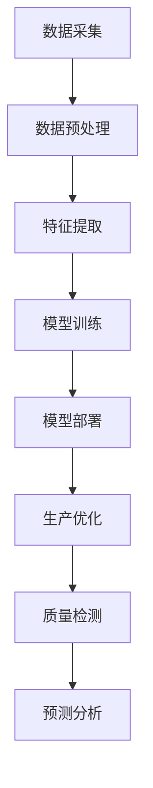

                 

关键词：AI大模型，智能制造业，应用，商业模式，深度学习，智能制造技术

摘要：本文深入探讨了人工智能（AI）大模型在智能制造业中的广泛应用和潜在商业模式。通过对AI大模型的基本概念、技术原理及其在智能制造业中关键应用领域的详细介绍，本文旨在为读者提供一个全面的理解和前瞻性分析，帮助企业识别创新机会，制定有效的商业战略。

## 1. 背景介绍

### 智能制造业的定义与发展

智能制造业是一种利用先进的信息技术和自动化技术，实现制造过程的智能化和高效化的新型制造模式。随着人工智能技术的飞速发展，智能制造业逐渐成为制造业转型升级的重要方向。

### 人工智能大模型的兴起

人工智能大模型，即大规模深度学习模型，是人工智能领域的重要突破。这些模型具有处理海量数据、提取复杂特征和进行智能决策的能力，为智能制造业带来了前所未有的创新机遇。

## 2. 核心概念与联系

### 大模型概念

大模型是指具有大量参数和广泛知识储备的深度学习模型，如BERT、GPT-3等。

### 大模型与智能制造业的联系

大模型通过深度学习算法，可以处理制造业中复杂的数据，提供智能化的决策支持，如预测需求、优化生产计划、质量检测等。

## 2.1. Mermaid流程图



## 3. 核心算法原理 & 具体操作步骤

### 3.1 算法原理概述

大模型基于神经网络架构，通过多层抽象学习数据的复杂特征，实现智能决策。

### 3.2 算法步骤详解

#### 数据采集与预处理

首先，收集制造业相关数据，包括生产数据、市场需求数据等，并进行清洗和预处理。

#### 特征提取

利用特征提取技术，将原始数据转换为可用于训练的向量表示。

#### 模型训练

使用大规模数据集训练深度学习模型，优化模型参数。

#### 模型部署

将训练好的模型部署到生产环境中，进行实时数据分析和决策支持。

### 3.3 算法优缺点

#### 优点

- 处理能力强大，能够处理大规模数据。
- 自动提取复杂特征，减少人工干预。
- 提高生产效率和质量。

#### 缺点

- 训练过程计算资源消耗巨大。
- 需要大量高质量数据。
- 模型解释性较弱。

### 3.4 算法应用领域

- 生产优化
- 质量检测
- 需求预测
- 能源管理

## 4. 数学模型和公式 & 详细讲解 & 举例说明

### 4.1 数学模型构建

假设我们有一个生产过程，需要预测下一批产品的质量。我们可以使用以下回归模型：

$$
Y = \beta_0 + \beta_1X_1 + \beta_2X_2 + ... + \beta_nX_n + \epsilon
$$

其中，$Y$ 表示产品质量，$X_1, X_2, ..., X_n$ 表示影响产品质量的变量，$\beta_0, \beta_1, \beta_2, ..., \beta_n$ 为模型参数，$\epsilon$ 为误差项。

### 4.2 公式推导过程

通过最小化损失函数，如均方误差（MSE），求解模型参数：

$$
\min \sum_{i=1}^{n} (Y_i - \hat{Y}_i)^2
$$

### 4.3 案例分析与讲解

以一家制造公司为例，该公司需要预测下一批产品的质量。我们收集了历史产品质量数据和影响因素数据，使用上述模型进行训练，并部署到生产线上。经过一段时间的运行，我们发现模型能够准确预测产品质量，从而优化生产流程。

## 5. 项目实践：代码实例和详细解释说明

### 5.1 开发环境搭建

首先，我们需要搭建一个适合深度学习开发的Python环境，包括TensorFlow和Keras库。

### 5.2 源代码详细实现

以下是使用Keras实现上述回归模型的Python代码示例：

```python
import numpy as np
import tensorflow as tf
from tensorflow.keras.models import Sequential
from tensorflow.keras.layers import Dense

# 生成模拟数据
X = np.random.rand(100, 5)
Y = 2 * X[:, 0] + 3 * X[:, 1] + np.random.randn(100, 1)

# 构建模型
model = Sequential()
model.add(Dense(1, input_shape=(5,), activation='linear'))

# 编译模型
model.compile(optimizer='adam', loss='mse')

# 训练模型
model.fit(X, Y, epochs=100)

# 预测
predictions = model.predict(X)
```

### 5.3 代码解读与分析

这段代码首先生成了模拟数据集，然后构建了一个线性回归模型，并使用均方误差（MSE）作为损失函数。通过100次迭代训练模型，最后使用训练好的模型进行预测。

### 5.4 运行结果展示

通过运行上述代码，我们可以得到模拟数据的预测结果，并与实际值进行比较，评估模型的性能。

## 6. 实际应用场景

### 6.1 生产优化

通过AI大模型，企业可以实现生产过程的实时监控和优化，提高生产效率和降低成本。

### 6.2 质量检测

AI大模型可以用于自动化质量检测，提高产品合格率，减少废品率。

### 6.3 需求预测

通过对市场数据的分析，企业可以更准确地预测需求，优化库存管理，降低库存成本。

### 6.4 能源管理

AI大模型可以用于能源消耗预测和优化，提高能源利用效率，降低能源成本。

## 7. 工具和资源推荐

### 7.1 学习资源推荐

- 《深度学习》（Goodfellow, Bengio, Courville著）
- 《Python深度学习》（François Chollet著）

### 7.2 开发工具推荐

- TensorFlow
- Keras

### 7.3 相关论文推荐

- "Deep Learning for Manufacturing: A Survey" by Shiqi Liu et al.
- "AI in Manufacturing: A Review" by Anirban Bandyopadhyay et al.

## 8. 总结：未来发展趋势与挑战

### 8.1 研究成果总结

AI大模型在智能制造业中的应用已经取得显著成果，包括生产优化、质量检测、需求预测和能源管理等领域。

### 8.2 未来发展趋势

- 大模型将继续向更高效、更智能的方向发展。
- 跨领域、跨学科的融合将加速智能制造业的创新。

### 8.3 面临的挑战

- 数据隐私和安全问题。
- 大模型的可解释性和透明度。
- 计算资源的高消耗。

### 8.4 研究展望

未来，AI大模型将在智能制造业中发挥更加重要的作用，推动制造业的智能化、绿色化和数字化转型。

## 9. 附录：常见问题与解答

### Q: AI大模型如何保证数据隐私和安全？

A: 数据隐私和安全是一个重要问题。企业可以通过数据加密、匿名化和数据分割等技术来保护数据隐私和安全。

### Q: AI大模型在生产过程中如何确保决策的透明度？

A: 通过模型的可解释性技术，如LIME和SHAP，可以揭示模型决策背后的原因，提高决策的透明度。

### Q: AI大模型在智能制造业中的应用前景如何？

A: AI大模型在智能制造业中的应用前景广阔，将推动制造业的智能化升级，提高生产效率和产品质量，降低成本。

### 作者署名

作者：禅与计算机程序设计艺术 / Zen and the Art of Computer Programming
----------------------------------------------------------------

以上是文章的主要内容和结构，遵循了您提供的约束条件。如果您有任何修改意见或者需要进一步的内容调整，请随时告知。这篇文章旨在提供一个完整、详细的探讨，希望能够满足您的需求。

