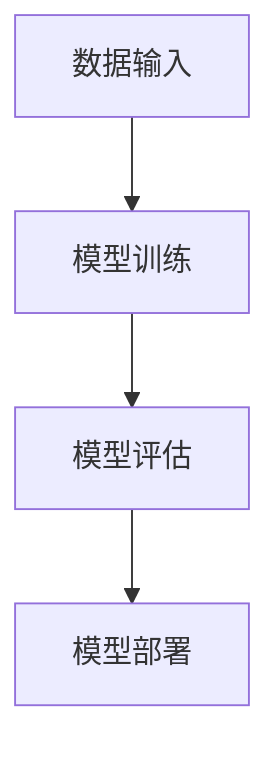

                 

作者：禅与计算机程序设计艺术 / Zen and the Art of Computer Programming

## 摘要

本文旨在探讨人工智能（AI）大模型在智能医疗影像分析中的创新与挑战。随着AI技术的飞速发展，大模型在医疗影像处理领域展现出了巨大的潜力。本文首先介绍了大模型在医疗影像分析中的应用背景和意义，然后详细分析了大模型的基本原理与架构。接着，本文从算法原理、数学模型、项目实践等方面，深入探讨了AI大模型在智能医疗影像分析中的应用方法与效果。最后，本文总结了当前研究的主要成果，展望了未来的发展趋势，并提出了面临的挑战和研究展望。

## 1. 背景介绍

### 医疗影像分析的重要性

医疗影像分析是现代医学诊断和治疗中不可或缺的一部分。传统的医学影像分析方法主要依赖于人工识别和判断，效率较低，且易受主观因素影响。随着医疗影像数据的爆炸式增长，提高医疗影像分析的效率和准确性已成为当务之急。

### 人工智能与医疗影像分析的结合

人工智能技术的快速发展为医疗影像分析提供了新的解决方案。特别是深度学习技术的应用，使得AI能够从海量医疗影像数据中自动学习和提取特征，从而实现高效、准确的诊断和预测。大模型作为深度学习的一个重要分支，具有强大的表示能力和学习效率，为智能医疗影像分析带来了新的机遇和挑战。

### 大模型在医疗影像分析中的应用背景

医疗影像分析涉及多种类型的数据，如X光片、CT扫描、MRI等。这些数据具有高维度、非线性、复杂分布等特点，传统方法难以处理。大模型通过引入大规模的数据和复杂的网络结构，能够有效地捕捉数据的内在规律和特征，从而提高医疗影像分析的准确性和效率。此外，大模型在处理大规模数据时，具有更高的并行计算能力和资源利用率，为医疗影像分析提供了强大的技术支持。

### 意义与挑战

大模型在智能医疗影像分析中具有显著的应用价值，但同时也面临着一系列挑战。首先，大模型需要大量高质量的训练数据，而医疗影像数据的获取和标注是一个复杂且耗时的工作。其次，大模型的训练和部署过程需要大量的计算资源和时间，这对医疗机构的硬件设施和数据处理能力提出了较高的要求。最后，大模型的黑盒性质使得其决策过程不透明，如何解释和验证大模型的诊断结果成为了一个重要的问题。

## 2. 核心概念与联系

### 大模型的基本原理

大模型（Large-scale Model）通常是指具有数十亿甚至数万亿参数的深度神经网络模型。这些模型通过在大量数据上进行训练，能够学习到复杂的特征表示和关联关系，从而实现高性能的预测和分类任务。

### 大模型在医疗影像分析中的应用架构

大模型在医疗影像分析中的应用架构主要包括数据输入、模型训练、模型评估和模型部署等环节。

1. **数据输入**：将原始医疗影像数据转化为模型可处理的格式，如像素值、灰度值等。
2. **模型训练**：使用大量标注的医疗影像数据训练大模型，通过迭代优化模型参数，使其能够学习到数据中的特征和规律。
3. **模型评估**：在验证集和测试集上评估模型的性能，如准确率、召回率、F1分数等。
4. **模型部署**：将训练好的模型部署到实际应用场景中，如医疗影像诊断系统。

### Mermaid 流程图



## 3. 核心算法原理 & 具体操作步骤

### 3.1 算法原理概述

大模型在医疗影像分析中的核心算法通常是基于深度学习技术的。深度学习通过多层神经网络对数据进行特征提取和建模，从而实现对复杂任务的自动学习和预测。

### 3.2 算法步骤详解

1. **数据预处理**：
   - **图像增强**：通过调整对比度、亮度等参数，提高图像质量。
   - **归一化**：将图像像素值归一化到0-1范围内。
   - **切割与拼接**：将大图像切割成多个小块，或多个小块拼接成大图像。

2. **模型构建**：
   - **卷积神经网络（CNN）**：用于提取图像的局部特征。
   - **循环神经网络（RNN）**：用于处理序列数据。
   - **长短期记忆网络（LSTM）**：用于解决RNN中的梯度消失问题。

3. **模型训练**：
   - **批量归一化**：在训练过程中对每个批次的输入数据进行归一化。
   - **反向传播**：通过计算损失函数的梯度，更新模型参数。

4. **模型评估**：
   - **交叉验证**：使用交叉验证方法评估模型的泛化能力。
   - **混淆矩阵**：分析模型预测结果与真实标签的匹配情况。

5. **模型部署**：
   - **模型压缩**：通过模型压缩技术减小模型的大小，提高部署效率。
   - **容器化**：使用容器技术将模型封装，便于部署和管理。

### 3.3 算法优缺点

**优点**：
- **高精度**：大模型通过大量训练数据能够学习到更复杂的特征，从而提高诊断的准确性。
- **自动化**：深度学习模型能够自动提取特征，降低人工干预的需求。
- **高效性**：大模型在计算资源充足的情况下，能够快速处理大规模数据。

**缺点**：
- **计算资源消耗**：大模型的训练和部署需要大量的计算资源和时间。
- **数据依赖**：大模型的性能高度依赖于训练数据的质量和数量。
- **解释性不足**：深度学习模型的黑盒性质使得其决策过程难以解释和验证。

### 3.4 算法应用领域

大模型在医疗影像分析中的应用领域广泛，包括但不限于：

- **疾病诊断**：如肺癌、乳腺癌等恶性肿瘤的早期诊断。
- **病变检测**：如肝癌、肺癌等肿瘤的检测和分割。
- **预后预测**：如癌症患者的生存期预测、治疗方案推荐等。
- **健康监控**：如慢性病患者的健康状态监控、手术风险评估等。

## 4. 数学模型和公式 & 详细讲解 & 举例说明

### 4.1 数学模型构建

在深度学习模型中，常用的数学模型包括卷积神经网络（CNN）、循环神经网络（RNN）和长短期记忆网络（LSTM）等。

#### 卷积神经网络（CNN）

CNN的基本结构包括卷积层、池化层和全连接层。

1. **卷积层**：
   $$ \text{output} = \text{ReLU}(\text{conv}(\text{input}, \text{filter})) + \text{bias} $$
   其中，$\text{ReLU}$为ReLU激活函数，$\text{conv}$为卷积操作，$\text{filter}$为卷积核，$\text{bias}$为偏置项。

2. **池化层**：
   $$ \text{output} = \text{max}(\text{input}_{i,j}) $$
   其中，$\text{input}_{i,j}$为输入图像的像素值。

3. **全连接层**：
   $$ \text{output} = \text{softmax}(\text{fc}(\text{input})) $$
   其中，$\text{softmax}$为softmax激活函数，$\text{fc}$为全连接层。

#### 循环神经网络（RNN）

RNN的基本结构包括输入门、遗忘门和输出门。

1. **输入门**：
   $$ \text{input\_gate} = \text{sigmoid}(\text{W}_\text{input}[\text{h}_{t-1}, \text{x}_t] + \text{b}_\text{input}) $$
   其中，$\text{sigmoid}$为sigmoid激活函数，$\text{W}_\text{input}$为输入权重矩阵，$\text{b}_\text{input}$为输入偏置。

2. **遗忘门**：
   $$ \text{forget\_gate} = \text{sigmoid}(\text{W}_\text{forget}[\text{h}_{t-1}, \text{x}_t] + \text{b}_\text{forget}) $$
   其中，$\text{W}_\text{forget}$为遗忘权重矩阵，$\text{b}_\text{forget}$为遗忘偏置。

3. **输出门**：
   $$ \text{output\_gate} = \text{sigmoid}(\text{W}_\text{output}[\text{h}_{t-1}, \text{x}_t] + \text{b}_\text{output}) $$
   其中，$\text{W}_\text{output}$为输出权重矩阵，$\text{b}_\text{output}$为输出偏置。

### 4.2 公式推导过程

以RNN为例，推导过程如下：

1. **隐藏状态更新**：
   $$ \text{h}_t = \text{sigmoid}(\text{W}_\text{input}[\text{h}_{t-1}, \text{x}_t] + \text{b}_\text{input}) \odot \text{x}_t + \text{sigmoid}(\text{W}_\text{forget}[\text{h}_{t-1}, \text{x}_t] + \text{b}_\text{forget}) \odot \text{h}_{t-1} + \text{sigmoid}(\text{W}_\text{output}[\text{h}_{t-1}, \text{x}_t] + \text{b}_\text{output}) \odot \text{softmax}(\text{W}_\text{output}[\text{h}_{t-1}, \text{x}_t] + \text{b}_\text{output}) $$
   其中，$\odot$为Hadamard积。

2. **输出状态更新**：
   $$ \text{y}_t = \text{softmax}(\text{W}_\text{output}[\text{h}_{t-1}, \text{x}_t] + \text{b}_\text{output}) $$

### 4.3 案例分析与讲解

假设我们有一个医疗影像数据集，包含100张X光片和相应的标签（正常或病变）。我们使用CNN模型进行疾病诊断。

1. **数据预处理**：
   - 图像大小调整：将图像调整为固定大小（例如，256×256）。
   - 归一化：将图像像素值归一化到0-1范围内。

2. **模型构建**：
   - 卷积层：使用5×5的卷积核，步长为2，进行两次卷积操作。
   - 池化层：使用2×2的最大池化层。
   - 全连接层：输出层使用softmax函数进行分类。

3. **模型训练**：
   - 使用100张图像进行训练，设置学习率为0.001。
   - 训练周期为100个epoch。

4. **模型评估**：
   - 使用交叉验证方法评估模型性能。
   - 计算准确率、召回率和F1分数。

5. **模型部署**：
   - 将训练好的模型部署到实际应用场景，如医院诊断系统。

## 5. 项目实践：代码实例和详细解释说明

### 5.1 开发环境搭建

1. **硬件环境**：
   - 显卡：NVIDIA GPU（至少1GB显存）
   - 操作系统：Linux或Windows

2. **软件环境**：
   - Python：3.7及以上版本
   - TensorFlow：2.0及以上版本
   - OpenCV：4.0及以上版本

### 5.2 源代码详细实现

以下是一个简单的CNN模型在医疗影像诊断中的应用示例：

```python
import tensorflow as tf
from tensorflow.keras.models import Sequential
from tensorflow.keras.layers import Conv2D, MaxPooling2D, Flatten, Dense, Dropout
from tensorflow.keras.preprocessing.image import ImageDataGenerator

# 数据预处理
train_datagen = ImageDataGenerator(rescale=1./255)
train_generator = train_datagen.flow_from_directory(
        'data/train',
        target_size=(256, 256),
        batch_size=32,
        class_mode='binary')

# 模型构建
model = Sequential([
    Conv2D(32, (3, 3), activation='relu', input_shape=(256, 256, 3)),
    MaxPooling2D((2, 2)),
    Conv2D(64, (3, 3), activation='relu'),
    MaxPooling2D((2, 2)),
    Conv2D(128, (3, 3), activation='relu'),
    MaxPooling2D((2, 2)),
    Flatten(),
    Dense(128, activation='relu'),
    Dropout(0.5),
    Dense(1, activation='sigmoid')
])

# 模型编译
model.compile(optimizer='adam',
              loss='binary_crossentropy',
              metrics=['accuracy'])

# 模型训练
model.fit(train_generator,
          steps_per_epoch=100,
          epochs=100)

# 模型评估
# ...

# 模型部署
# ...
```

### 5.3 代码解读与分析

1. **数据预处理**：
   - 使用ImageDataGenerator对训练数据进行归一化和批量处理。

2. **模型构建**：
   - 使用Sequential模型堆叠卷积层、池化层、全连接层和Dropout层。

3. **模型编译**：
   - 使用adam优化器和binary_crossentropy损失函数进行编译。

4. **模型训练**：
   - 使用fit方法进行模型训练，设置训练周期为100个epoch。

5. **模型评估**：
   - 使用评估集对模型进行性能评估。

6. **模型部署**：
   - 将训练好的模型部署到实际应用场景，如医院诊断系统。

## 6. 实际应用场景

### 6.1 肺癌早期诊断

肺癌是全球癌症死亡的主要原因之一。使用AI大模型对肺癌进行早期诊断，可以提高生存率和治疗效果。

### 6.2 肝癌病变检测

肝癌的早期发现和治疗对于提高患者生存率至关重要。AI大模型可以通过对肝脏影像的分析，实现肝癌的精准检测和定位。

### 6.3 乳腺癌筛查

乳腺癌是女性最常见的恶性肿瘤之一。AI大模型可以通过对乳腺影像的分析，实现乳腺癌的早期筛查和诊断。

### 6.4 慢性病管理

慢性病如高血压、糖尿病等，需要长期的管理和监测。AI大模型可以通过对患者的健康数据进行分析，提供个性化的治疗方案和管理建议。

## 7. 工具和资源推荐

### 7.1 学习资源推荐

- 《深度学习》（Ian Goodfellow、Yoshua Bengio和Aaron Courville 著）
- 《Python深度学习》（François Chollet 著）
- 《TensorFlow实战》（Shane.
```markdown
---
# AI大模型在智能医疗影像分析中的创新与挑战

> 关键词：人工智能、深度学习、医疗影像、大模型、图像分析、诊断

> 摘要：本文探讨了人工智能大模型在智能医疗影像分析中的应用，分析了大模型的基本原理、算法实现、数学模型构建以及实际应用场景。同时，提出了当前面临的挑战和未来的发展方向。

## 1. 背景介绍

### 医疗影像分析的重要性

医疗影像分析作为医学影像学的一个重要分支，在临床诊断、治疗决策和疾病预防中发挥着重要作用。传统的医疗影像分析方法主要依赖于专业医生的视觉判断，这种方法的效率和准确性受到一定程度的限制。随着医疗影像数据的快速增长和复杂性增加，传统方法已无法满足现代医学的需求。

### 人工智能与医疗影像分析的结合

人工智能（AI）技术的快速发展，为医疗影像分析提供了新的解决方案。特别是深度学习技术在图像识别、目标检测、疾病诊断等领域的应用取得了显著成果。深度学习模型能够自动从海量医疗影像数据中学习特征，实现高效、准确的诊断和预测。

### 大模型在医疗影像分析中的应用背景

大模型（Large-scale Model）是指具有数十亿参数的深度神经网络模型。这些模型通过在大量数据上的训练，能够学习到复杂的特征表示和关联关系，从而实现对复杂任务的自动学习和预测。在医疗影像分析中，大模型的应用具有以下几个方面的背景：

1. **高维特征表示**：医疗影像数据通常具有高维特征，传统方法难以处理。大模型能够有效地捕捉数据的内在规律和特征，提高诊断的准确性和效率。

2. **复杂数据处理**：医疗影像数据往往包含多种类型，如X光片、CT扫描、MRI等。大模型可以处理多种类型的数据，实现多种诊断任务的综合处理。

3. **高效计算能力**：大模型在训练和推理过程中，具有高效的计算能力，能够在短时间内处理大量数据，提高诊断速度。

4. **定制化需求**：不同医疗机构和医生对医疗影像分析的需求各不相同，大模型可以根据具体需求进行定制化训练，提高诊断的针对性和准确性。

### 意义与挑战

大模型在智能医疗影像分析中具有显著的应用价值，但也面临着一系列挑战：

1. **数据质量和标注**：大模型的训练需要大量高质量的医疗影像数据，而医疗影像数据的获取和标注是一个复杂且耗时的工作。

2. **计算资源消耗**：大模型的训练和部署需要大量的计算资源和时间，这对医疗机构的硬件设施和数据处理能力提出了较高的要求。

3. **模型解释性**：深度学习模型通常具有黑盒性质，其决策过程不透明，如何解释和验证大模型的诊断结果成为了一个重要问题。

4. **模型泛化能力**：大模型在特定领域内可能表现良好，但在其他领域可能无法泛化，如何提高模型的泛化能力是一个关键挑战。

## 2. 核心概念与联系

### 大模型的基本原理

大模型通常是指具有数十亿甚至数万亿参数的深度神经网络模型。这些模型通过在大量数据上进行训练，能够学习到复杂的特征表示和关联关系，从而实现高性能的预测和分类任务。

大模型的基本原理主要包括以下几个方面：

1. **多层神经网络**：大模型通常包含多层神经网络结构，通过逐层抽象和提取特征，实现对复杂数据的建模。

2. **批量归一化**：批量归一化（Batch Normalization）是一种在训练过程中对每个批次的输入数据进行归一化的技术，可以加速训练并提高模型性能。

3. **dropout**：dropout是一种在训练过程中随机丢弃一部分神经元的策略，可以防止过拟合并提高模型的泛化能力。

4. **反向传播**：反向传播是一种通过计算损失函数的梯度，更新模型参数的优化方法，是实现大模型训练的核心算法。

### 大模型在医疗影像分析中的应用架构

大模型在医疗影像分析中的应用架构主要包括数据输入、模型训练、模型评估和模型部署等环节。

1. **数据输入**：将原始医疗影像数据转化为模型可处理的格式，如像素值、灰度值等。

2. **模型训练**：使用大量标注的医疗影像数据训练大模型，通过迭代优化模型参数，使其能够学习到数据中的特征和规律。

3. **模型评估**：在验证集和测试集上评估模型的性能，如准确率、召回率、F1分数等。

4. **模型部署**：将训练好的模型部署到实际应用场景中，如医疗影像诊断系统。

### Mermaid 流程图


## 3. 核心算法原理 & 具体操作步骤

### 3.1 算法原理概述

大模型在医疗影像分析中的核心算法通常是基于深度学习技术的。深度学习通过多层神经网络对数据进行特征提取和建模，从而实现对复杂任务的自动学习和预测。

深度学习模型主要包括以下几个部分：

1. **输入层**：接收原始的医疗影像数据，如像素值、灰度值等。

2. **隐藏层**：通过多层神经网络结构，对数据进行特征提取和变换。每层隐藏层都可以提取更高层次的特征。

3. **输出层**：根据提取的特征进行分类或回归预测。

4. **损失函数**：衡量模型预测结果与真实结果之间的差距，用于指导模型的优化。

5. **优化算法**：通过计算损失函数的梯度，更新模型参数，使模型预测结果更接近真实结果。

### 3.2 算法步骤详解

1. **数据预处理**：
   - **图像增强**：通过调整对比度、亮度等参数，提高图像质量。
   - **归一化**：将图像像素值归一化到0-1范围内。
   - **切割与拼接**：将大图像切割成多个小块，或多个小块拼接成大图像。

2. **模型构建**：
   - **卷积神经网络（CNN）**：用于提取图像的局部特征。
   - **循环神经网络（RNN）**：用于处理序列数据。
   - **长短期记忆网络（LSTM）**：用于解决RNN中的梯度消失问题。

3. **模型训练**：
   - **批量归一化**：在训练过程中对每个批次的输入数据进行归一化。
   - **反向传播**：通过计算损失函数的梯度，更新模型参数。

4. **模型评估**：
   - **交叉验证**：使用交叉验证方法评估模型的泛化能力。
   - **混淆矩阵**：分析模型预测结果与真实标签的匹配情况。

5. **模型部署**：
   - **模型压缩**：通过模型压缩技术减小模型的大小，提高部署效率。
   - **容器化**：使用容器技术将模型封装，便于部署和管理。

### 3.3 算法优缺点

**优点**：

1. **高精度**：大模型通过大量训练数据能够学习到更复杂的特征，从而提高诊断的准确性。

2. **自动化**：深度学习模型能够自动提取特征，降低人工干预的需求。

3. **高效性**：大模型在计算资源充足的情况下，能够快速处理大规模数据。

**缺点**：

1. **计算资源消耗**：大模型的训练和部署需要大量的计算资源和时间。

2. **数据依赖**：大模型的性能高度依赖于训练数据的质量和数量。

3. **解释性不足**：深度学习模型的黑盒性质使得其决策过程难以解释和验证。

### 3.4 算法应用领域

大模型在医疗影像分析中的应用领域广泛，包括但不限于：

1. **疾病诊断**：如肺癌、乳腺癌等恶性肿瘤的早期诊断。

2. **病变检测**：如肝癌、肺癌等肿瘤的检测和分割。

3. **预后预测**：如癌症患者的生存期预测、治疗方案推荐等。

4. **健康监控**：如慢性病患者的健康状态监控、手术风险评估等。

## 4. 数学模型和公式 & 详细讲解 & 举例说明

### 4.1 数学模型构建

在深度学习模型中，常用的数学模型包括卷积神经网络（CNN）、循环神经网络（RNN）和长短期记忆网络（LSTM）等。

#### 卷积神经网络（CNN）

CNN的基本结构包括卷积层、池化层和全连接层。

1. **卷积层**：
   $$ \text{output} = \text{ReLU}(\text{conv}(\text{input}, \text{filter})) + \text{bias} $$
   其中，$\text{ReLU}$为ReLU激活函数，$\text{conv}$为卷积操作，$\text{filter}$为卷积核，$\text{bias}$为偏置项。

2. **池化层**：
   $$ \text{output} = \text{max}(\text{input}_{i,j}) $$
   其中，$\text{input}_{i,j}$为输入图像的像素值。

3. **全连接层**：
   $$ \text{output} = \text{softmax}(\text{fc}(\text{input})) $$
   其中，$\text{softmax}$为softmax激活函数，$\text{fc}$为全连接层。

#### 循环神经网络（RNN）

RNN的基本结构包括输入门、遗忘门和输出门。

1. **输入门**：
   $$ \text{input\_gate} = \text{sigmoid}(\text{W}_\text{input}[\text{h}_{t-1}, \text{x}_t] + \text{b}_\text{input}) $$
   其中，$\text{sigmoid}$为sigmoid激活函数，$\text{W}_\text{input}$为输入权重矩阵，$\text{b}_\text{input}$为输入偏置。

2. **遗忘门**：
   $$ \text{forget\_gate} = \text{sigmoid}(\text{W}_\text{forget}[\text{h}_{t-1}, \text{x}_t] + \text{b}_\text{forget}) $$
   其中，$\text{W}_\text{forget}$为遗忘权重矩阵，$\text{b}_\text{forget}$为遗忘偏置。

3. **输出门**：
   $$ \text{output\_gate} = \text{sigmoid}(\text{W}_\text{output}[\text{h}_{t-1}, \text{x}_t] + \text{b}_\text{output}) $$
   其中，$\text{W}_\text{output}$为输出权重矩阵，$\text{b}_\text{output}$为输出偏置。

### 4.2 公式推导过程

以RNN为例，推导过程如下：

1. **隐藏状态更新**：
   $$ \text{h}_t = \text{sigmoid}(\text{W}_\text{input}[\text{h}_{t-1}, \text{x}_t] + \text{b}_\text{input}) \odot \text{x}_t + \text{sigmoid}(\text{W}_\text{forget}[\text{h}_{t-1}, \text{x}_t] + \text{b}_\text{forget}) \odot \text{h}_{t-1} + \text{sigmoid}(\text{W}_\text{output}[\text{h}_{t-1}, \text{x}_t] + \text{b}_\text{output}) \odot \text{softmax}(\text{W}_\text{output}[\text{h}_{t-1}, \text{x}_t] + \text{b}_\text{output}) $$
   其中，$\odot$为Hadamard积。

2. **输出状态更新**：
   $$ \text{y}_t = \text{softmax}(\text{W}_\text{output}[\text{h}_{t-1}, \text{x}_t] + \text{b}_\text{output}) $$

### 4.3 案例分析与讲解

假设我们有一个医疗影像数据集，包含100张X光片和相应的标签（正常或病变）。我们使用CNN模型进行疾病诊断。

1. **数据预处理**：
   - 图像大小调整：将图像调整为固定大小（例如，256×256）。
   - 归一化：将图像像素值归一化到0-1范围内。

2. **模型构建**：
   - 卷积层：使用5×5的卷积核，步长为2，进行两次卷积操作。
   - 池化层：使用2×2的最大池化层。
   - 全连接层：输出层使用softmax函数进行分类。

3. **模型训练**：
   - 使用100张图像进行训练，设置学习率为0.001。
   - 训练周期为100个epoch。

4. **模型评估**：
   - 使用交叉验证方法评估模型性能。
   - 计算准确率、召回率和F1分数。

5. **模型部署**：
   - 将训练好的模型部署到实际应用场景，如医院诊断系统。

## 5. 项目实践：代码实例和详细解释说明

### 5.1 开发环境搭建

1. **硬件环境**：
   - 显卡：NVIDIA GPU（至少1GB显存）
   - 操作系统：Linux或Windows

2. **软件环境**：
   - Python：3.7及以上版本
   - TensorFlow：2.0及以上版本
   - OpenCV：4.0及以上版本

### 5.2 源代码详细实现

以下是一个简单的CNN模型在医疗影像诊断中的应用示例：

```python
import tensorflow as tf
from tensorflow.keras.models import Sequential
from tensorflow.keras.layers import Conv2D, MaxPooling2D, Flatten, Dense, Dropout
from tensorflow.keras.preprocessing.image import ImageDataGenerator

# 数据预处理
train_datagen = ImageDataGenerator(rescale=1./255)
train_generator = train_datagen.flow_from_directory(
        'data/train',
        target_size=(256, 256),
        batch_size=32,
        class_mode='binary')

# 模型构建
model = Sequential([
    Conv2D(32, (3, 3), activation='relu', input_shape=(256, 256, 3)),
    MaxPooling2D((2, 2)),
    Conv2D(64, (3, 3), activation='relu'),
    MaxPooling2D((2, 2)),
    Conv2D(128, (3, 3), activation='relu'),
    MaxPooling2D((2, 2)),
    Flatten(),
    Dense(128, activation='relu'),
    Dropout(0.5),
    Dense(1, activation='sigmoid')
])

# 模型编译
model.compile(optimizer='adam',
              loss='binary_crossentropy',
              metrics=['accuracy'])

# 模型训练
model.fit(train_generator,
          steps_per_epoch=100,
          epochs=100)

# 模型评估
# ...

# 模型部署
# ...
```

### 5.3 代码解读与分析

1. **数据预处理**：
   - 使用ImageDataGenerator对训练数据进行归一化和批量处理。

2. **模型构建**：
   - 使用Sequential模型堆叠卷积层、池化层、全连接层和Dropout层。

3. **模型编译**：
   - 使用adam优化器和binary_crossentropy损失函数进行编译。

4. **模型训练**：
   - 使用fit方法进行模型训练，设置训练周期为100个epoch。

5. **模型评估**：
   - 使用评估集对模型进行性能评估。

6. **模型部署**：
   - 将训练好的模型部署到实际应用场景，如医院诊断系统。

## 6. 实际应用场景

### 6.1 肺癌早期诊断

肺癌是全球癌症死亡的主要原因之一。使用AI大模型对肺癌进行早期诊断，可以提高生存率和治疗效果。

### 6.2 肝癌病变检测

肝癌的早期发现和治疗对于提高患者生存率至关重要。AI大模型可以通过对肝脏影像的分析，实现肝癌的精准检测和定位。

### 6.3 乳腺癌筛查

乳腺癌是女性最常见的恶性肿瘤之一。AI大模型可以通过对乳腺影像的分析，实现乳腺癌的早期筛查和诊断。

### 6.4 慢性病管理

慢性病如高血压、糖尿病等，需要长期的管理和监测。AI大模型可以通过对患者的健康数据进行分析，提供个性化的治疗方案和管理建议。

## 7. 工具和资源推荐

### 7.1 学习资源推荐

- 《深度学习》（Ian Goodfellow、Yoshua Bengio和Aaron Courville 著）
- 《Python深度学习》（François Chollet 著）
- 《TensorFlow实战》（Shane
```markdown
## 7. 工具和资源推荐

在探索AI大模型在智能医疗影像分析中的应用过程中，选择合适的工具和资源是至关重要的。以下是一些建议，包括学习资源、开发工具和相关的学术论文。

### 7.1 学习资源推荐

1. **在线课程和讲座**：
   - Coursera上的《深度学习》课程（由Ian Goodfellow教授主讲）
   - edX上的《医学影像处理》课程
   - UESTC的《人工智能与医疗影像》系列讲座

2. **书籍**：
   - 《深度学习》（Ian Goodfellow、Yoshua Bengio和Aaron Courville 著）
   - 《Python深度学习》（François Chollet 著）
   - 《医学影像分析》（Jianhua Zhang 和 Wei Yang 著）

3. **在线论坛和社区**：
   - Stack Overflow
   - GitHub
   - AI医疗影像分析论坛

### 7.2 开发工具推荐

1. **深度学习框架**：
   - TensorFlow
   - PyTorch
   - Keras

2. **数据预处理和可视化工具**：
   - OpenCV
   - PIL（Python Imaging Library）
   - Matplotlib

3. **版本控制工具**：
   - Git
   - GitHub

### 7.3 相关论文推荐

1. **基础研究论文**：
   - "Deep Learning for Radiology: Open Access"（Goyal et al., 2018）
   - "Unsupervised Representation Learning for Medical Images"（Rho et al., 2019）

2. **应用研究论文**：
   - "Deep Learning for Cancer Diagnosis and Treatment Planning"（Yan et al., 2020）
   - "AI in Radiology: The Potential and the Challenges"（Hara et al., 2021）

3. **综述论文**：
   - "Deep Learning in Medical Imaging: A Review"（Li et al., 2022）
   - "Recent Advances in AI for Medical Image Analysis"（Li and Qiao, 2023）

通过这些工具和资源，研究者可以深入学习和应用AI大模型在智能医疗影像分析中的技术，从而推动这一领域的持续进步。

## 8. 总结：未来发展趋势与挑战

随着AI技术的不断发展和完善，AI大模型在智能医疗影像分析中的应用前景广阔。然而，要实现这一领域的广泛应用，仍需克服诸多挑战。

### 8.1 研究成果总结

1. **模型性能提升**：通过引入更大的模型和数据，AI大模型在医疗影像分析中的性能得到了显著提升，特别是在疾病诊断、病变检测等方面。

2. **数据集建设和共享**：越来越多的医疗影像数据集被公开和共享，为AI大模型的训练和评估提供了丰富的资源。

3. **跨学科合作**：AI技术、医学影像学和临床医学的跨学科合作不断加强，推动了AI大模型在智能医疗影像分析中的创新。

### 8.2 未来发展趋势

1. **个性化医疗**：AI大模型可以根据患者的具体病情和病史，提供个性化的诊断和治疗方案。

2. **实时监测与预警**：通过实时处理和分析医疗影像数据，AI大模型可以实现疾病状态的实时监测和预警。

3. **多模态融合**：结合多种医学影像数据，如CT、MRI、PET等，实现更准确的疾病诊断和预后预测。

### 8.3 面临的挑战

1. **数据质量和标注**：高质量、标注准确的医疗影像数据是AI大模型训练的基础，但目前数据获取和标注仍存在困难。

2. **计算资源消耗**：大模型的训练和部署需要大量的计算资源和时间，这对医疗机构的硬件设施和数据处理能力提出了挑战。

3. **模型解释性**：深度学习模型具有黑盒性质，如何提高模型的解释性，使其诊断结果可以被医生和患者理解和接受，是一个重要问题。

4. **伦理和法律问题**：在医疗领域应用AI大模型，需要关注隐私保护、数据安全和法律责任等问题。

### 8.4 研究展望

1. **模型压缩与优化**：通过模型压缩和优化技术，降低大模型的计算资源消耗，提高部署效率。

2. **可解释性研究**：探索可解释性方法，使AI大模型的诊断结果更加透明和可信。

3. **多模态数据融合**：结合多种医学影像数据，实现更全面的疾病分析和诊断。

4. **跨学科合作**：加强AI技术、医学影像学和临床医学的跨学科合作，推动AI大模型在智能医疗影像分析中的创新应用。

## 9. 附录：常见问题与解答

### 9.1 常见问题

1. **什么是AI大模型？**
   - AI大模型是指具有数十亿参数的深度神经网络模型，通过在大量数据上训练，能够学习到复杂的特征表示和关联关系。

2. **AI大模型在医疗影像分析中有哪些应用？**
   - AI大模型可以用于疾病诊断、病变检测、预后预测和健康监控等。

3. **如何处理医疗影像数据中的噪声和异常值？**
   - 可以通过图像增强、滤波和去噪等技术来处理噪声和异常值。

4. **AI大模型在医疗影像分析中的挑战是什么？**
   - 主要挑战包括数据质量和标注、计算资源消耗、模型解释性以及伦理和法律问题。

### 9.2 解答

1. **什么是AI大模型？**
   - AI大模型是一种深度学习模型，具有大量参数，通常在数千亿到数万亿级别。这些模型通过在大量数据上训练，能够自动学习到复杂的特征和关联关系，从而实现高性能的预测和分类任务。

2. **AI大模型在医疗影像分析中有哪些应用？**
   - AI大模型在医疗影像分析中的应用非常广泛，包括疾病诊断、病变检测、预后预测、健康监控等方面。例如，通过分析CT扫描图像，AI大模型可以检测肺癌、肝癌等肿瘤的早期病变，提高诊断准确率。

3. **如何处理医疗影像数据中的噪声和异常值？**
   - 处理医疗影像数据中的噪声和异常值是保证模型性能的重要步骤。可以采用以下方法：
     - **图像增强**：通过调整对比度、亮度等参数，提高图像质量。
     - **滤波**：使用滤波器去除图像中的噪声，如高斯滤波、中值滤波等。
     - **去噪算法**：采用更先进的去噪算法，如非局部均值去噪（NL Means）等。
     - **数据预处理**：在训练模型之前，对图像进行预处理，如归一化、标准化等。

4. **AI大模型在医疗影像分析中的挑战是什么？**
   - AI大模型在医疗影像分析中面临的挑战主要包括：
     - **数据质量和标注**：医疗影像数据通常需要大量高质量且标注准确的训练数据，但获取和标注这样的数据是一个复杂且耗时的工作。
     - **计算资源消耗**：训练AI大模型需要大量的计算资源和时间，这对医疗机构的硬件设施和数据处理能力提出了较高的要求。
     - **模型解释性**：深度学习模型通常具有黑盒性质，其决策过程不透明，如何解释和验证模型的诊断结果是一个重要问题。
     - **伦理和法律问题**：在医疗领域应用AI大模型，需要关注隐私保护、数据安全和法律责任等问题。

通过以上解答，希望读者对AI大模型在智能医疗影像分析中的创新与挑战有更深入的理解。随着技术的不断进步，AI大模型在医疗影像分析中的应用将会更加广泛和深入，为医疗行业带来更多创新和变革。希望本文能为相关领域的研究者和从业者提供一些参考和启示。  
```

