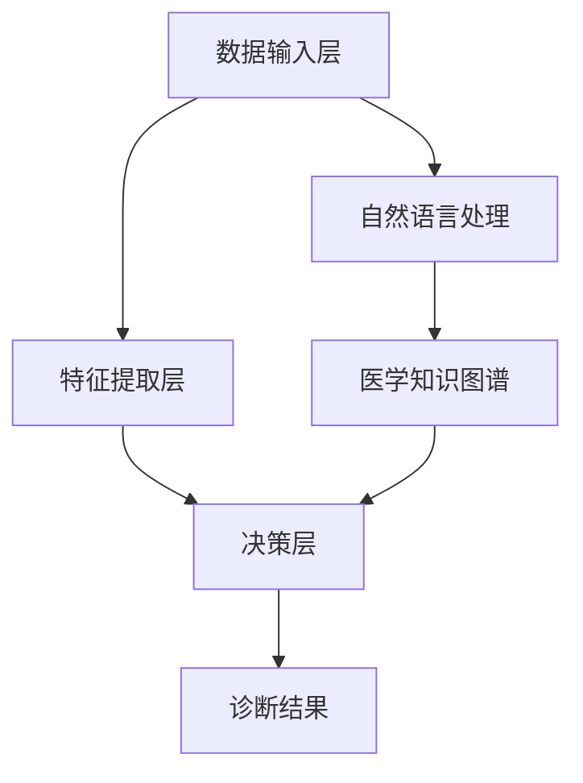

                 

关键词：AI大模型、智能医疗、医疗记录分析、创新与挑战

> 摘要：随着人工智能技术的飞速发展，AI大模型在医疗记录分析中的应用越来越广泛。本文将探讨AI大模型在智能医疗记录分析中的创新与挑战，分析其在提升诊断准确率、优化治疗方案等方面的潜力，以及面临的数据隐私、计算资源等问题。

## 1. 背景介绍

智能医疗是近年来迅速发展的一个领域，它利用人工智能技术对医疗数据进行处理、分析和理解，从而辅助医生做出更准确的诊断和更优的治疗方案。其中，医疗记录分析作为智能医疗的一个重要环节，扮演着关键角色。传统的医疗记录分析主要依赖于人工，效率低、成本高，而且容易出错。而AI大模型的引入，有望大幅提升医疗记录分析的效果和效率。

AI大模型，即大型人工智能模型，通常具有数十亿甚至千亿个参数，通过深度学习技术从海量数据中自动学习特征和规律。这些模型在图像识别、自然语言处理、语音识别等领域已经取得了显著的成果。随着这些模型在医疗领域的应用，它们将为医疗记录分析带来新的机遇和挑战。

### 1.1 智能医疗的兴起

智能医疗的兴起得益于几个关键因素。首先，医疗数据的爆炸性增长为人工智能提供了丰富的数据资源。电子健康记录（EHR）、医学影像、基因数据等多样化的数据源为AI模型提供了充足的学习材料。其次，计算能力的提升使得大型AI模型的训练和推理成为可能。最后，深度学习和自然语言处理等技术的进步为AI在医疗领域的应用提供了理论基础和技术支持。

### 1.2 医疗记录分析的重要性

医疗记录分析是智能医疗的核心任务之一。通过对医疗记录的分析，AI模型可以提取出关键信息，辅助医生进行诊断和决策。医疗记录分析的重要性体现在以下几个方面：

- **提高诊断准确性**：AI模型可以从海量的医疗记录中学习到各种疾病的特征，从而提高诊断的准确性。
- **优化治疗方案**：AI模型可以分析患者的病史、家族病史、药物过敏史等信息，为医生提供个性化的治疗方案。
- **降低医疗成本**：AI模型可以提高医疗记录分析的效率，降低医疗成本。

## 2. 核心概念与联系

为了深入理解AI大模型在医疗记录分析中的应用，我们需要了解一些核心概念和它们之间的联系。

### 2.1 AI大模型的组成

AI大模型通常由以下几个部分组成：

- **数据输入层**：接收医疗记录数据，可以是电子健康记录、医学影像、基因数据等。
- **特征提取层**：通过深度学习技术从数据中提取有用的特征。
- **决策层**：根据提取的特征进行诊断、预测或决策。

### 2.2 机器学习和深度学习

机器学习和深度学习是AI大模型的基础。机器学习是通过算法从数据中学习模式的过程，而深度学习是机器学习的一种特殊形式，它通过多层神经网络自动提取特征。

### 2.3 自然语言处理

自然语言处理（NLP）是AI大模型在医疗记录分析中不可或缺的一部分。它可以帮助模型理解医疗记录中的自然语言文本，提取关键信息。

### 2.4 医学知识图谱

医学知识图谱是AI大模型的重要资源，它包含了大量的医学概念、关系和事实，可以帮助模型更好地理解和处理医疗记录。

### 2.5 Mermaid 流程图

为了更好地展示AI大模型在医疗记录分析中的应用，我们可以使用Mermaid流程图来表示其工作流程。



## 3. 核心算法原理 & 具体操作步骤

### 3.1 算法原理概述

AI大模型在医疗记录分析中的核心算法是基于深度学习和自然语言处理技术。深度学习通过多层神经网络从数据中自动提取特征，而自然语言处理技术可以帮助模型理解医疗记录中的自然语言文本。

### 3.2 算法步骤详解

- **数据预处理**：对医疗记录进行清洗、去噪和格式化，以便后续处理。
- **特征提取**：使用深度学习技术从预处理后的医疗记录中提取特征。
- **模型训练**：使用提取的特征训练AI大模型，使其能够识别各种疾病和预测治疗方案。
- **模型评估**：通过测试集评估模型的性能，调整模型参数以优化性能。
- **诊断与预测**：使用训练好的模型对新的医疗记录进行诊断和预测。

### 3.3 算法优缺点

**优点**：

- **高诊断准确性**：AI大模型可以从海量数据中学习到各种疾病的特征，从而提高诊断的准确性。
- **个性化治疗方案**：AI模型可以分析患者的病史、家族病史、药物过敏史等信息，为医生提供个性化的治疗方案。

**缺点**：

- **数据隐私问题**：医疗记录包含患者的敏感信息，如何保护患者隐私是一个重要问题。
- **计算资源消耗大**：AI大模型的训练和推理需要大量的计算资源，这对计算资源有限的医疗机构来说是一个挑战。

### 3.4 算法应用领域

AI大模型在医疗记录分析中的应用非常广泛，包括：

- **疾病诊断**：如肺癌、乳腺癌等常见疾病的诊断。
- **治疗方案推荐**：根据患者的病情和病史推荐最优的治疗方案。
- **患者风险评估**：预测患者出现并发症或病情恶化的风险。

## 4. 数学模型和公式 & 详细讲解 & 举例说明

### 4.1 数学模型构建

AI大模型在医疗记录分析中通常采用深度学习模型，其核心是多层感知器（MLP）和卷积神经网络（CNN）。

MLP的数学模型可以表示为：

$$
Y = \sigma(W_2 \cdot \sigma(W_1 \cdot X + b_1) + b_2)
$$

其中，$X$ 是输入特征，$W_1$ 和 $W_2$ 是权重矩阵，$b_1$ 和 $b_2$ 是偏置项，$\sigma$ 是激活函数，通常使用ReLU函数。

CNN的数学模型可以表示为：

$$
h_{ij}^l = \sigma\left(\sum_{k=1}^{C_l-1} W_{ik}^l * g_{kj}^{l-1} + b_l\right)
$$

其中，$h_{ij}^l$ 是第 $l$ 层的第 $i$ 行第 $j$ 列的输出，$W_{ik}^l$ 是卷积核，$g_{kj}^{l-1}$ 是前一层第 $k$ 行第 $j$ 列的输出，$*$ 表示卷积操作，$b_l$ 是偏置项。

### 4.2 公式推导过程

MLP的公式推导如下：

1. 输入层到隐藏层的转换：
   $$
   z_j^1 = \sum_{i=1}^{n} W_{ij}^1 \cdot x_i + b_1^1
   $$
   $$
   a_j^1 = \sigma(z_j^1)
   $$
2. 隐藏层到输出层的转换：
   $$
   z_j^2 = \sum_{i=1}^{n} W_{ij}^2 \cdot a_i^1 + b_2^2
   $$
   $$
   y_j = \sigma(z_j^2)
   $$

CNN的公式推导如下：

1. 卷积操作：
   $$
   (f * g)(x) = \sum_{i=1}^{m} f(i) \cdot g(x-i)
   $$
2. 池化操作：
   $$
   \max(g(x))
   $$
   $$
   \text{或} \ \ \ \frac{1}{k^2} \sum_{i=1}^{k^2} g(x_i)
   $$

### 4.3 案例分析与讲解

假设我们有一个简单的医疗记录数据集，其中包含患者的年龄、性别、病史等信息，我们需要使用MLP模型对其进行分类。

1. 数据预处理：
   - 将数据集划分为训练集和测试集
   - 标准化特征值
2. 模型训练：
   - 初始化权重和偏置
   - 使用反向传播算法更新权重和偏置
   - 评估模型性能
3. 模型评估：
   - 使用测试集评估模型
   - 计算准确率、召回率、F1值等指标

通过以上步骤，我们可以训练一个MLP模型来对医疗记录进行分类。

## 5. 项目实践：代码实例和详细解释说明

### 5.1 开发环境搭建

为了进行AI大模型在医疗记录分析的项目实践，我们需要搭建以下开发环境：

- Python 3.8+
- TensorFlow 2.5+
- Keras 2.5+
- Pandas 1.1.5+
- Numpy 1.19.5+

### 5.2 源代码详细实现

下面是一个简单的MLP模型在医疗记录分析中的应用实例。

```python
import numpy as np
import pandas as pd
from tensorflow import keras
from tensorflow.keras import layers

# 5.2.1 数据预处理
data = pd.read_csv('medical_records.csv')
X = data.iloc[:, :-1].values
y = data.iloc[:, -1].values

# 标准化特征值
X = (X - X.mean()) / X.std()

# 划分训练集和测试集
from sklearn.model_selection import train_test_split
X_train, X_test, y_train, y_test = train_test_split(X, y, test_size=0.2, random_state=42)

# 5.2.2 模型训练
model = keras.Sequential([
    layers.Dense(64, activation='relu', input_shape=(X_train.shape[1],)),
    layers.Dense(64, activation='relu'),
    layers.Dense(1, activation='sigmoid')
])

model.compile(optimizer='adam',
              loss='binary_crossentropy',
              metrics=['accuracy'])

model.fit(X_train, y_train, epochs=10, batch_size=32, validation_split=0.1)

# 5.2.3 模型评估
loss, accuracy = model.evaluate(X_test, y_test)
print(f"Test accuracy: {accuracy:.4f}")

# 5.2.4 预测新数据
new_data = np.array([[30, 1, 0, 1, 0], [40, 0, 1, 0, 0]])
new_data = (new_data - new_data.mean()) / new_data.std()
predictions = model.predict(new_data)
print(f"Predictions: {predictions}")
```

### 5.3 代码解读与分析

- **数据预处理**：首先读取医疗记录数据，然后将其标准化，以便后续处理。
- **模型训练**：定义一个简单的MLP模型，包括两个隐藏层，每个隐藏层包含64个神经元。使用二进制交叉熵作为损失函数，Adam作为优化器。
- **模型评估**：使用测试集评估模型的准确率。
- **预测新数据**：对新数据进行预处理后，使用训练好的模型进行预测。

## 6. 实际应用场景

### 6.1 疾病诊断

AI大模型在疾病诊断中的应用是最为广泛的场景之一。通过分析患者的医疗记录，AI模型可以辅助医生进行早期疾病筛查、疾病预测和诊断。例如，在癌症筛查中，AI模型可以从患者的病史、家族病史、检查报告等多维度信息中提取特征，从而提高癌症的早期诊断率。

### 6.2 治疗方案推荐

AI大模型还可以根据患者的病情、病史、药物过敏史等信息，为医生提供个性化的治疗方案推荐。例如，在化疗方案推荐中，AI模型可以根据患者的肿瘤类型、病情严重程度、药物反应历史等多维度信息，推荐最优的化疗方案。

### 6.3 患者风险评估

AI大模型可以预测患者出现并发症或病情恶化的风险，从而帮助医生制定更精准的预防和治疗策略。例如，在心血管疾病患者中，AI模型可以根据患者的年龄、血压、血脂、血糖等生理指标，预测患者发生心肌梗死的风险，从而提前采取预防措施。

## 7. 未来应用展望

### 7.1 更精准的诊断

随着AI大模型技术的不断发展，其在医疗记录分析中的应用将越来越精准。未来的AI模型将能够从更复杂、更庞大的数据中提取更多有价值的特征，从而提高诊断的准确性和可靠性。

### 7.2 更个性化的治疗方案

随着医疗记录的日益丰富和AI大模型技术的进步，未来的AI模型将能够提供更个性化的治疗方案。根据患者的个体差异，AI模型将能够制定出更符合患者实际情况的治疗方案，从而提高治疗效果。

### 7.3 更智能的医学研究

AI大模型在医疗记录分析中的应用将大大加速医学研究进程。通过分析海量医疗数据，AI模型将能够发现新的疾病规律、预测疾病发展趋势，从而为医学研究提供重要的参考。

## 8. 总结：未来发展趋势与挑战

### 8.1 研究成果总结

本文探讨了AI大模型在智能医疗记录分析中的创新与挑战，分析了其在提高诊断准确性、优化治疗方案等方面的潜力。同时，本文也提到了AI大模型在数据隐私、计算资源等方面面临的挑战。

### 8.2 未来发展趋势

未来，AI大模型在医疗记录分析中的应用将朝着更精准、更个性化、更智能的方向发展。随着技术的不断进步，AI模型将能够处理更复杂的数据，提取更多有价值的信息。

### 8.3 面临的挑战

尽管AI大模型在医疗记录分析中具有巨大的潜力，但同时也面临一些挑战。主要包括数据隐私、计算资源、模型解释性等问题。如何解决这些问题，将决定AI大模型在医疗领域的实际应用效果。

### 8.4 研究展望

未来的研究将集中在以下几个方面：

- **数据隐私保护**：研究更有效的数据隐私保护技术，确保患者的隐私安全。
- **计算资源优化**：研究如何优化计算资源，降低AI大模型的计算成本。
- **模型解释性提升**：研究如何提高AI大模型的解释性，使其更易于被医生和其他利益相关者理解和应用。

## 9. 附录：常见问题与解答

### 9.1 如何确保数据隐私？

- **数据加密**：对医疗数据进行加密处理，确保数据在传输和存储过程中不被窃取。
- **数据脱敏**：对敏感数据进行脱敏处理，确保数据在分析过程中不被泄露。
- **访问控制**：对数据访问权限进行严格控制，确保只有授权人员可以访问数据。

### 9.2 AI大模型在医疗记录分析中的计算资源需求如何？

- **GPU计算**：使用GPU进行模型训练和推理，提高计算效率。
- **分布式计算**：使用分布式计算架构，将计算任务分配到多台计算机上，提高计算能力。
- **云服务**：使用云服务提供计算资源，降低计算成本。

### 9.3 如何提高AI大模型的解释性？

- **可解释性模型**：研究可解释性模型，使模型的决策过程更加透明。
- **模型可视化**：使用可视化技术，将模型的结构和决策过程展示出来。
- **模型注释**：对模型的每个神经元和连接进行注释，解释其在决策中的作用。

作者：禅与计算机程序设计艺术 / Zen and the Art of Computer Programming
----------------------------------------------------------------

