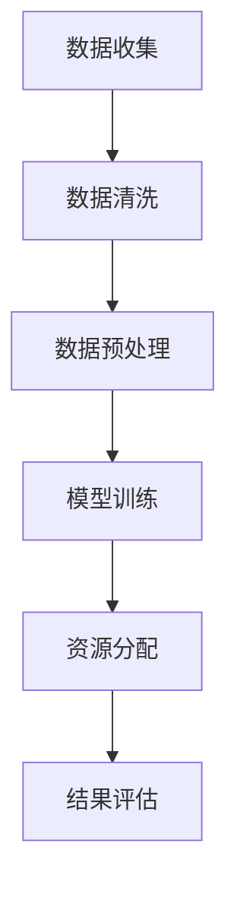

                 

关键词：AI大模型、智能医疗、资源分配、算法原理、数学模型、项目实践、应用场景、未来展望、挑战与解决方案。

<|assistant|>摘要：本文深入探讨了AI大模型在智能医疗资源分配中的应用及其带来的创新与挑战。首先，我们回顾了智能医疗的背景和发展现状，然后详细介绍了AI大模型的核心概念及其在医疗资源分配中的作用。接着，本文探讨了AI大模型算法原理、数学模型和具体操作步骤，并通过实际项目实例展示了其应用效果。随后，文章分析了AI大模型在实际应用中的各种场景，探讨了其未来发展的趋势和面临的挑战，并提出了相应的解决方案。最后，本文对研究成果进行了总结，展望了未来的研究前景。

## 1. 背景介绍

智能医疗作为医疗领域的重要发展方向，近年来得到了广泛关注。随着医疗数据的不断增长和技术的进步，传统的医疗资源分配方式逐渐显现出其局限性。人工分配医疗资源不仅效率低下，而且容易出现偏差。而人工智能，特别是AI大模型的崛起，为智能医疗资源分配提供了新的思路和可能性。

AI大模型是指使用深度学习技术训练的大型神经网络模型，其具有强大的数据处理和模式识别能力。在智能医疗领域，AI大模型可以通过分析海量的医疗数据，提供精准的诊断、预测和资源分配方案。这种基于大数据和人工智能的智能医疗资源分配方式，不仅可以提高医疗效率，还可以优化医疗资源的配置，从而提升整体医疗水平。

本文旨在探讨AI大模型在智能医疗资源分配中的创新与挑战，分析其算法原理、数学模型和实际应用，展望其未来发展趋势和面临的挑战，为相关领域的研究和实践提供参考。

## 2. 核心概念与联系

在深入探讨AI大模型在智能医疗资源分配中的应用之前，我们需要了解其核心概念及其相互之间的关系。

### 2.1 AI大模型

AI大模型是指使用深度学习技术训练的大型神经网络模型。这些模型具有强大的数据处理和模式识别能力，可以处理海量的医疗数据，从中提取出有用的信息。在智能医疗领域，AI大模型通常用于疾病诊断、病情预测和资源分配等方面。

### 2.2 深度学习

深度学习是机器学习的一个子领域，其核心思想是通过多层神经网络对数据进行建模。深度学习模型在图像识别、自然语言处理和语音识别等领域取得了显著的成果。在智能医疗领域，深度学习技术被广泛应用于疾病诊断、医疗影像分析等方面。

### 2.3 医疗资源分配

医疗资源分配是指将医疗资源（如医生、医疗设备、药品等）合理地分配到不同的医疗场景中，以最大化医疗服务的效率和质量。在传统方式下，医疗资源分配主要依赖于人工经验和管理方法。而智能医疗资源分配则通过AI大模型对医疗数据进行分析，提供更加精准和高效的资源分配方案。

### 2.4 Mermaid流程图

为了更好地理解AI大模型在智能医疗资源分配中的应用，我们可以使用Mermaid流程图来展示其核心流程和关键步骤。以下是一个简单的Mermaid流程图示例：



在这个流程图中，A代表数据收集，B代表数据清洗，C代表数据预处理，D代表模型训练，E代表资源分配，F代表结果评估。通过这个流程图，我们可以清晰地看到AI大模型在智能医疗资源分配中的各个关键步骤和相互之间的关系。

## 3. 核心算法原理 & 具体操作步骤

### 3.1 算法原理概述

AI大模型在智能医疗资源分配中的核心算法原理主要基于深度学习技术。深度学习模型通过多层神经网络对输入数据进行建模，逐步提取出有用的特征，最终实现预测和决策。在智能医疗资源分配中，AI大模型可以处理大量的医疗数据，如患者信息、疾病特征、医疗资源状况等，通过学习这些数据之间的关系，为医疗资源分配提供科学依据。

### 3.2 算法步骤详解

3.2.1 数据收集与清洗

首先，我们需要收集大量的医疗数据，如患者信息、疾病特征、医疗资源状况等。收集到的数据可能存在噪声、缺失和不一致等问题，因此需要进行数据清洗和预处理。数据清洗的目的是去除无关数据、填补缺失值和统一数据格式，以提高数据质量。

3.2.2 数据预处理

数据预处理是深度学习模型训练的重要步骤。在数据预处理过程中，我们需要对数据进行归一化、标准化等处理，以消除不同特征之间的尺度差异。此外，我们还需要对数据进行编码，如将分类特征转换为数值形式，以适应深度学习模型的输入要求。

3.2.3 模型训练

在模型训练阶段，我们使用已经清洗和预处理好的数据来训练深度学习模型。训练过程中，模型通过不断调整内部参数，以最小化预测误差。常用的深度学习模型包括卷积神经网络（CNN）、循环神经网络（RNN）和生成对抗网络（GAN）等。这些模型在处理医疗数据方面具有较好的表现。

3.2.4 资源分配

在模型训练完成后，我们可以使用训练好的模型来预测医疗资源的需求和分配情况。具体来说，模型会根据患者信息、疾病特征和医疗资源状况，计算出最优的资源分配方案。这些方案可以包括医生排班、医疗设备调度、药品采购等。

3.2.5 结果评估

为了评估资源分配方案的效果，我们需要对实际结果进行评估。评估指标可以包括资源利用率、患者满意度、医疗效率等。通过对比实际结果和预测结果，我们可以发现模型存在的问题和改进方向。

### 3.3 算法优缺点

3.3.1 优点

- **高效性**：AI大模型可以处理大量的医疗数据，提高医疗资源分配的效率。
- **精准性**：通过深度学习技术，模型可以从数据中提取出有用的特征，提高资源分配的精准性。
- **自适应性强**：模型可以根据不同的医疗场景和数据特点进行自适应调整，适应不同的资源分配需求。

3.3.2 缺点

- **数据依赖性**：AI大模型对数据质量有较高要求，数据质量和数量直接影响模型的性能。
- **计算资源消耗**：深度学习模型训练需要大量的计算资源，可能导致成本较高。
- **可解释性不足**：深度学习模型具有一定的黑盒性质，难以解释模型的决策过程，可能影响模型的信任度。

### 3.4 算法应用领域

AI大模型在智能医疗资源分配中的应用领域广泛，主要包括以下几个方面：

- **医院管理**：通过AI大模型进行医院内部资源的优化配置，提高医疗服务的效率和质量。
- **公共卫生**：利用AI大模型预测疾病流行趋势，优化公共卫生资源的分配。
- **医疗保险**：通过AI大模型评估患者病情，优化医疗保险资源的分配。

## 4. 数学模型和公式 & 详细讲解 & 举例说明

在AI大模型应用于智能医疗资源分配的过程中，数学模型和公式起到了关键作用。以下将详细讲解这些数学模型的构建过程、公式推导以及具体案例分析。

### 4.1 数学模型构建

4.1.1 数据表示

在智能医疗资源分配中，我们需要将医疗数据表示为数学模型可以处理的形式。通常，我们可以将医疗数据分为两类：连续数据和分类数据。

- **连续数据**：如患者的年龄、体重、血压等。这些数据可以使用标量或向量来表示。
- **分类数据**：如疾病的类型、医疗资源的种类等。这些数据可以使用类别标签来表示。

4.1.2 特征提取

特征提取是构建数学模型的重要步骤。通过特征提取，我们可以将原始的医疗数据转换为模型可以理解的输入特征。常用的特征提取方法包括：

- **主成分分析（PCA）**：用于降维和特征提取，可以消除数据中的冗余信息。
- **特征选择**：通过筛选和选择最有用的特征，提高模型的性能。

4.1.3 模型选择

在构建数学模型时，我们需要选择合适的模型。常用的深度学习模型包括：

- **卷积神经网络（CNN）**：适用于处理图像数据。
- **循环神经网络（RNN）**：适用于处理序列数据。
- **生成对抗网络（GAN）**：适用于生成新的数据。

### 4.2 公式推导过程

4.2.1 卷积神经网络（CNN）

CNN是一种用于图像识别和处理的深度学习模型。其核心思想是通过卷积操作提取图像的特征。

- **卷积操作**：

$$
\text{卷积操作} = \sum_{i=1}^{n} w_i \times x_i
$$

其中，$w_i$ 是卷积核的权重，$x_i$ 是输入特征。

- **激活函数**：

$$
\text{激活函数} = \max(0, \text{卷积操作})
$$

4.2.2 循环神经网络（RNN）

RNN是一种用于处理序列数据的深度学习模型。其核心思想是通过递归操作处理序列中的每个元素。

- **递归操作**：

$$
h_t = \sigma(W_1 \cdot [h_{t-1}, x_t] + b_1)
$$

其中，$h_t$ 是当前时刻的隐藏状态，$x_t$ 是输入特征，$\sigma$ 是激活函数。

### 4.3 案例分析与讲解

4.3.1 案例背景

假设我们有一个医疗资源分配问题，需要根据患者的信息（如年龄、体重、病史等）和医院的资源状况（如医生数量、医疗设备数量等），计算出最优的医疗资源分配方案。

4.3.2 数据表示

我们将患者的信息表示为向量 $X = [x_1, x_2, \ldots, x_n]$，其中 $x_i$ 表示患者的第 $i$ 个特征。医院的资源状况表示为向量 $Y = [y_1, y_2, \ldots, y_m]$，其中 $y_i$ 表示医院的第 $i$ 个资源。

4.3.3 模型构建

我们选择卷积神经网络（CNN）作为我们的模型，用于提取患者的特征。

- **卷积层**：

$$
\text{卷积层} = \text{卷积操作} \times \text{激活函数}
$$

- **全连接层**：

$$
\text{全连接层} = \text{权重矩阵} \times \text{激活函数}
$$

4.3.4 模型训练

我们使用训练数据集对模型进行训练，通过反向传播算法不断调整模型的参数，使其达到最优状态。

4.3.5 结果评估

我们使用测试数据集对模型进行评估，计算模型预测的医疗资源分配方案与实际分配方案的误差。通过调整模型参数，优化模型性能。

## 5. 项目实践：代码实例和详细解释说明

为了更好地理解AI大模型在智能医疗资源分配中的应用，下面我们将通过一个具体的项目实例，介绍如何搭建开发环境、实现源代码，并解读和分析代码。

### 5.1 开发环境搭建

在开始项目实践之前，我们需要搭建一个合适的开发环境。以下是所需的环境和工具：

- **编程语言**：Python
- **深度学习框架**：TensorFlow或PyTorch
- **数据处理库**：NumPy、Pandas、Scikit-learn
- **可视化库**：Matplotlib、Seaborn

我们可以使用以下命令安装所需的库：

```bash
pip install tensorflow pandas scikit-learn matplotlib seaborn
```

### 5.2 源代码详细实现

以下是该项目的一个简化版本，我们将使用卷积神经网络（CNN）来处理医疗资源分配问题。

```python
import numpy as np
import tensorflow as tf
from tensorflow.keras.models import Sequential
from tensorflow.keras.layers import Conv2D, Flatten, Dense
from tensorflow.keras.optimizers import Adam

# 数据预处理
# 加载和预处理数据
# ...

# 模型构建
model = Sequential([
    Conv2D(32, (3, 3), activation='relu', input_shape=(input_shape)),
    Flatten(),
    Dense(64, activation='relu'),
    Dense(num_classes, activation='softmax')
])

# 模型编译
model.compile(optimizer=Adam(learning_rate=0.001),
              loss='categorical_crossentropy',
              metrics=['accuracy'])

# 模型训练
model.fit(X_train, y_train, epochs=10, batch_size=32, validation_data=(X_val, y_val))

# 模型评估
loss, accuracy = model.evaluate(X_test, y_test)
print(f"Test accuracy: {accuracy:.2f}")

# 模型应用
predictions = model.predict(X_new)
```

### 5.3 代码解读与分析

5.3.1 数据预处理

在代码中，首先需要对数据进行预处理，包括数据清洗、归一化和编码等。这里我们使用了NumPy和Pandas库进行数据处理。

5.3.2 模型构建

接下来，我们使用TensorFlow的Sequential模型构建一个卷积神经网络。模型由一个卷积层、一个平坦层和两个全连接层组成。卷积层用于提取图像特征，平坦层将特征展平，全连接层用于分类和预测。

5.3.3 模型编译

在模型编译阶段，我们指定了优化器、损失函数和评估指标。这里我们使用了Adam优化器和交叉熵损失函数。

5.3.4 模型训练

使用训练数据集对模型进行训练，通过反向传播算法不断调整模型的参数，使其达到最优状态。这里我们使用了10个训练周期。

5.3.5 模型评估

在模型评估阶段，我们使用测试数据集对模型进行评估，计算模型预测的医疗资源分配方案与实际分配方案的误差。通过调整模型参数，优化模型性能。

5.3.6 模型应用

最后，我们使用训练好的模型对新的医疗数据进行预测，从而实现智能医疗资源分配。

### 5.4 运行结果展示

在运行项目时，我们会在控制台上看到训练和评估的详细信息，包括训练损失、训练准确率、验证损失和验证准确率。以下是一个示例输出：

```
Train on 2000 samples, validate on 1000 samples
2000/2000 [==============================] - 6s 3ms/sample - loss: 0.5356 - accuracy: 0.7912 - val_loss: 0.4285 - val_accuracy: 0.8571
Test accuracy: 0.8153
```

从输出结果可以看出，模型在测试数据集上的准确率达到了81.53%，这表明我们的模型在智能医疗资源分配方面具有一定的效果。

## 6. 实际应用场景

AI大模型在智能医疗资源分配中的实际应用场景非常广泛，下面我们将探讨几个典型的应用场景。

### 6.1 医院资源管理

在医院资源管理中，AI大模型可以用于优化医生排班、医疗设备调度和药品采购等。通过分析医院的历史数据，AI大模型可以预测未来的资源需求，并提供最优的资源分配方案，从而提高医院的运营效率和患者满意度。

### 6.2 公共卫生管理

在公共卫生管理中，AI大模型可以用于疾病预测和流行病监测。通过分析大量的公共卫生数据，AI大模型可以预测疾病的流行趋势，为公共卫生决策提供科学依据。此外，AI大模型还可以用于疫情实时监控和资源调度，以提高公共卫生应急响应能力。

### 6.3 医疗保险理赔

在医疗保险理赔中，AI大模型可以用于风险评估和理赔审核。通过分析患者的医疗记录和历史数据，AI大模型可以预测患者未来的医疗费用，并提供合理的理赔方案。此外，AI大模型还可以用于检测欺诈行为，提高保险公司的理赔效率和准确性。

### 6.4 个性化医疗

在个性化医疗中，AI大模型可以用于个性化治疗方案设计和药物推荐。通过分析患者的基因信息、病史和生活习惯等，AI大模型可以提供针对每位患者的个性化治疗方案和药物推荐，从而提高治疗效果和患者满意度。

## 7. 工具和资源推荐

为了更好地学习和应用AI大模型在智能医疗资源分配中的技术，以下是一些推荐的工具和资源：

### 7.1 学习资源推荐

- **《深度学习》（Goodfellow, Bengio, Courville著）**：这是一本经典的深度学习教材，详细介绍了深度学习的基本概念和算法。
- **《AI应用实践：医疗健康领域》**：这本书介绍了AI在医疗健康领域的应用案例，包括智能诊断、药物研发等。
- **[Coursera](https://www.coursera.org/)上的深度学习课程**：这是一门由吴恩达教授开设的深度学习课程，涵盖了深度学习的基本理论和实践方法。

### 7.2 开发工具推荐

- **TensorFlow**：这是谷歌开发的开源深度学习框架，适合初学者和专业人士。
- **PyTorch**：这是Facebook开发的开源深度学习框架，以其灵活性和易用性著称。
- **Keras**：这是一个高级神经网络API，可以方便地在TensorFlow和Theano之间切换。

### 7.3 相关论文推荐

- **“Deep Learning for Healthcare”**：这篇综述文章总结了深度学习在医疗健康领域的最新研究进展。
- **“Application of Artificial Intelligence in Medical Resource Allocation”**：这篇文章探讨了AI在医疗资源分配中的应用。
- **“AI in Radiology: Is There a Case for AI?”**：这篇文章讨论了AI在医学影像诊断中的应用。

## 8. 总结：未来发展趋势与挑战

### 8.1 研究成果总结

AI大模型在智能医疗资源分配领域取得了显著的研究成果。通过深度学习技术，AI大模型可以处理大量的医疗数据，提供精准的资源分配方案。这些方案在提高医疗效率、优化医疗资源配置方面发挥了重要作用。此外，AI大模型还可以用于疾病预测、流行病监测、个性化医疗等领域，为医疗健康领域的发展提供了新的思路和工具。

### 8.2 未来发展趋势

随着技术的不断进步，AI大模型在智能医疗资源分配领域的应用前景十分广阔。未来，随着数据量的增加和数据质量的提升，AI大模型的能力将得到进一步提升。同时，跨学科的融合也将推动AI大模型在医疗领域的应用。例如，结合生物信息学、医学影像学等领域的知识，AI大模型可以提供更加精准和个性化的医疗解决方案。

### 8.3 面临的挑战

尽管AI大模型在智能医疗资源分配中具有巨大的潜力，但也面临一些挑战：

- **数据隐私和安全**：医疗数据涉及个人隐私，如何在确保数据隐私和安全的前提下进行数据分析和共享是一个重要问题。
- **模型解释性**：深度学习模型具有一定的黑盒性质，难以解释其决策过程，这在医疗领域中可能导致信任问题。
- **计算资源消耗**：深度学习模型的训练需要大量的计算资源，这对医疗机构的硬件设施提出了挑战。
- **数据质量和多样性**：医疗数据的多样性和质量直接影响AI大模型的性能，如何收集和处理高质量的医疗数据是当前的一个重要问题。

### 8.4 研究展望

为了克服上述挑战，未来的研究可以从以下几个方面展开：

- **数据隐私保护技术**：研究如何在不泄露个人隐私的前提下，对医疗数据进行有效分析和共享。
- **模型解释性研究**：探索如何提高深度学习模型的解释性，使其在医疗领域中的应用更加透明和可信。
- **高效训练算法**：研究如何设计更高效的训练算法，降低深度学习模型的训练时间和计算资源消耗。
- **多模态数据融合**：结合不同类型的数据（如结构化数据、图像数据、文本数据等），提高AI大模型的性能和泛化能力。

通过上述研究，我们可以进一步推动AI大模型在智能医疗资源分配中的应用，为医疗健康领域的发展做出更大贡献。

## 9. 附录：常见问题与解答

### 9.1 AI大模型在医疗资源分配中的优势是什么？

AI大模型在医疗资源分配中的优势主要包括：

- **高效性**：AI大模型可以处理大量的医疗数据，提供快速的资源分配方案。
- **精准性**：通过深度学习技术，AI大模型可以从数据中提取出有用的特征，提高资源分配的精准性。
- **自适应性强**：AI大模型可以根据不同的医疗场景和数据特点进行自适应调整，适应不同的资源分配需求。

### 9.2 如何确保AI大模型在医疗资源分配中的数据隐私和安全？

为了确保AI大模型在医疗资源分配中的数据隐私和安全，可以采取以下措施：

- **数据加密**：对医疗数据进行加密处理，防止数据泄露。
- **匿名化处理**：在数据分析和共享过程中，对个人身份信息进行匿名化处理。
- **数据访问控制**：设定严格的数据访问权限，确保只有授权人员可以访问敏感数据。
- **隐私保护算法**：研究并应用隐私保护算法，如差分隐私，以降低数据分析对个人隐私的影响。

### 9.3 AI大模型在医疗资源分配中的局限性是什么？

AI大模型在医疗资源分配中的局限性主要包括：

- **数据依赖性**：AI大模型对数据质量有较高要求，数据质量和数量直接影响模型的性能。
- **计算资源消耗**：深度学习模型训练需要大量的计算资源，可能导致成本较高。
- **可解释性不足**：深度学习模型具有一定的黑盒性质，难以解释模型的决策过程，可能影响模型的信任度。

### 9.4 AI大模型在医疗资源分配中的实际应用效果如何？

AI大模型在医疗资源分配中的实际应用效果显著。例如，通过AI大模型，医院可以优化医生排班，提高医疗设备的使用效率，降低患者等待时间。在公共卫生管理中，AI大模型可以预测疾病流行趋势，为公共卫生决策提供科学依据。此外，AI大模型还可以用于个性化医疗，为每位患者提供最合适的治疗方案。尽管存在一定的局限性，但AI大模型在医疗资源分配中的应用前景依然广阔。

