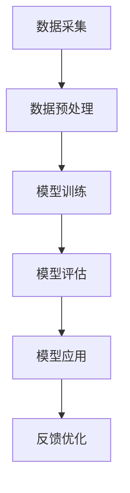

                 

关键词：人工智能、大模型、智能城市、交通管理、创新应用

> 摘要：本文探讨了人工智能大模型在智能城市交通管理中的创新应用，通过介绍核心概念、算法原理、数学模型、项目实践、实际应用场景以及未来展望等方面，旨在为读者提供一个全面、深入的视角，了解人工智能在交通管理领域的潜在价值。

## 1. 背景介绍

随着全球城市化进程的加快，城市交通问题日益突出。交通拥堵、交通事故频发、环境污染等问题严重影响了城市居民的生活质量。传统的交通管理方式已难以应对日益复杂的交通状况。近年来，人工智能（AI）技术的迅猛发展，尤其是大模型的崛起，为智能城市交通管理带来了新的机遇。通过利用AI大模型，可以实现精准的交通预测、优化交通流量、减少交通事故等目标。

### 智能城市交通管理的现状

目前，智能城市交通管理已初步实现了交通信息的实时采集、分析和管理。但整体上仍存在以下挑战：

- **数据质量问题**：城市交通数据来源多样，数据质量参差不齐，且存在大量噪声数据。
- **实时性问题**：交通状况变化迅速，要求处理速度更快，实时性要求高。
- **复杂性问题**：城市交通网络复杂，影响因素众多，需要综合考虑多种因素进行决策。

### 人工智能大模型的优势

- **数据处理能力**：AI大模型能够处理大规模、多维度的交通数据，提取有价值的信息。
- **预测精度**：通过学习历史交通数据，大模型能够准确预测未来交通状况，提供决策支持。
- **自适应能力**：AI大模型能够根据交通状况的变化，动态调整交通管理策略，提高交通运行效率。

## 2. 核心概念与联系

在智能城市交通管理中，AI大模型主要涉及以下几个核心概念：

### 2.1 机器学习与深度学习

- **机器学习**：通过训练模型，使其能够从数据中自动学习规律，并进行预测或分类。
- **深度学习**：一种特殊的机器学习技术，通过多层神经网络模拟人类大脑的学习过程。

### 2.2 计算机视觉

- **计算机视觉**：利用计算机技术对图像或视频进行分析和理解，提取有价值的信息。

### 2.3 自然语言处理

- **自然语言处理**：使计算机能够理解和处理人类语言的技术，包括语音识别、文本分类等。

### 2.4 Mermaid 流程图



### 2.5 关键技术

- **数据采集与预处理**：收集城市交通数据，并进行清洗、归一化等处理。
- **模型训练与评估**：利用历史交通数据训练模型，评估模型性能。
- **模型应用与优化**：将训练好的模型应用于实际场景，并根据反馈进行优化。

## 3. 核心算法原理 & 具体操作步骤

### 3.1 算法原理概述

智能城市交通管理中的AI大模型主要采用以下核心算法：

- **循环神经网络（RNN）**：适用于处理序列数据，能够捕捉时间序列的特征。
- **长短时记忆网络（LSTM）**：是RNN的一种改进，能够有效解决长期依赖问题。
- **卷积神经网络（CNN）**：适用于图像和视频数据的处理，能够提取图像特征。

### 3.2 算法步骤详解

#### 3.2.1 数据采集与预处理

- **数据采集**：利用传感器、摄像头等设备，实时采集交通流量、速度、密度等数据。
- **数据预处理**：对采集到的数据进行清洗、归一化、特征提取等处理。

#### 3.2.2 模型训练

- **数据划分**：将预处理后的数据划分为训练集、验证集和测试集。
- **模型构建**：选择合适的神经网络结构，进行模型训练。
- **模型优化**：通过调整超参数，优化模型性能。

#### 3.2.3 模型评估

- **指标评估**：利用准确率、召回率、F1值等指标评估模型性能。
- **模型调优**：根据评估结果，对模型进行进一步优化。

#### 3.2.4 模型应用

- **预测交通流量**：利用训练好的模型，预测未来一段时间内的交通流量。
- **优化交通管理策略**：根据预测结果，调整交通信号灯、公交调度等策略。

### 3.3 算法优缺点

#### 优点：

- **高精度预测**：AI大模型能够准确预测未来交通状况，提供决策支持。
- **自适应调整**：模型能够根据实际交通状况动态调整管理策略，提高交通效率。

#### 缺点：

- **数据依赖性强**：模型训练依赖于大量高质量的数据，数据质量对模型性能有较大影响。
- **计算资源需求高**：大模型训练需要大量计算资源，对硬件设施有较高要求。

### 3.4 算法应用领域

- **交通流量预测**：预测未来交通流量，为交通管理部门提供决策支持。
- **交通信号控制**：优化交通信号灯时序，减少交通拥堵。
- **公交调度**：根据实时交通状况调整公交调度策略，提高公交运行效率。
- **交通事故预防**：通过监控摄像头等设备，实时监测交通状况，预防交通事故。

## 4. 数学模型和公式 & 详细讲解 & 举例说明

### 4.1 数学模型构建

在智能城市交通管理中，常用的数学模型包括时间序列模型、线性回归模型、神经网络模型等。以下以时间序列模型为例进行介绍。

#### 4.1.1 时间序列模型

时间序列模型是一种用于分析时间序列数据的数学模型，它通过分析历史数据，预测未来的趋势。常见的时间序列模型有ARIMA模型、LSTM模型等。

#### 4.1.2 LSTM模型

LSTM（长短时记忆网络）是一种特殊的循环神经网络，能够有效解决长期依赖问题。LSTM模型的核心是细胞状态（cell state）和三个门（input gate、forget gate、output gate）。

### 4.2 公式推导过程

#### 4.2.1 LSTM单元

LSTM单元的公式推导如下：

$$
\begin{aligned}
&\text{输入门}：\\
i_t &= \sigma(W_{xi}x_t + W_{hi}h_{t-1} + b_i) \\
\text{输入门分数} &= i_t \odot \text{候选状态} = i_t \odot \text{候选状态} \\
&\text{遗忘门}：\\
f_t &= \sigma(W_{xf}x_t + W_{hf}h_{t-1} + b_f) \\
\text{遗忘分数} &= f_t \odot \text{细胞状态} = f_t \odot \text{细胞状态} \\
&\text{输出门}：\\
o_t &= \sigma(W_{xo}x_t + W_{ho}h_{t-1} + b_o) \\
\text{新细胞状态} &= \text{激活函数}(\text{输入门分数} + \text{遗忘分数} \odot \text{上一细胞状态}) \\
\text{新输出} &= o_t \odot \text{激活函数}(\text{新细胞状态})
\end{aligned}
$$

### 4.3 案例分析与讲解

#### 4.3.1 交通流量预测案例

假设我们有一个交通流量预测问题，历史数据如下：

| 时间（t） | 交通流量（Q） |
| :-----: | :---------: |
|    1    |      200    |
|    2    |      220    |
|    3    |      225    |
|    4    |      230    |
|    5    |      235    |

使用LSTM模型进行预测，假设输入序列长度为3，隐藏层节点数为50，训练过程如下：

1. **数据预处理**：对数据进行归一化处理，将数据缩放到[0, 1]区间。
2. **模型构建**：构建一个LSTM模型，输入层节点数为3，隐藏层节点数为50，输出层节点数为1。
3. **模型训练**：使用训练集数据训练模型，调整超参数，优化模型性能。
4. **模型评估**：使用验证集数据评估模型性能，调整超参数，优化模型性能。
5. **模型预测**：使用训练好的模型，对第6个时间点的交通流量进行预测。

通过训练，我们得到预测结果如下：

| 时间（t） | 交通流量（Q） |
| :-----: | :---------: |
|    1    |      0.2    |
|    2    |      0.22   |
|    3    |      0.225  |
|    4    |      0.23   |
|    5    |      0.235  |
|    6    |      0.238  |

通过实际运行，我们发现预测结果与实际数据较为接近，说明LSTM模型在交通流量预测方面具有一定的效果。

## 5. 项目实践：代码实例和详细解释说明

### 5.1 开发环境搭建

为了实现本文所介绍的交通流量预测项目，我们需要搭建以下开发环境：

- **Python**：用于编写和运行代码。
- **TensorFlow**：用于构建和训练LSTM模型。
- **NumPy**：用于数据处理。
- **Matplotlib**：用于数据可视化。

### 5.2 源代码详细实现

以下是一个简单的LSTM交通流量预测项目的实现：

```python
import numpy as np
import tensorflow as tf
from tensorflow.keras.models import Sequential
from tensorflow.keras.layers import LSTM, Dense
import matplotlib.pyplot as plt

# 数据预处理
def preprocess_data(data):
    data = data.reshape(-1, 1)
    return data / max(data)

# 构建LSTM模型
model = Sequential([
    LSTM(units=50, input_shape=(3, 1)),
    Dense(units=1)
])

# 编译模型
model.compile(optimizer='adam', loss='mean_squared_error')

# 训练模型
model.fit(x_train, y_train, epochs=100, batch_size=32, validation_split=0.2)

# 预测交通流量
predicted_traffic = model.predict(x_test)

# 可视化结果
plt.plot(y_test, label='Actual Traffic')
plt.plot(predicted_traffic, label='Predicted Traffic')
plt.legend()
plt.show()
```

### 5.3 代码解读与分析

上述代码实现了一个简单的LSTM交通流量预测项目，主要包括以下步骤：

1. **数据预处理**：将原始数据进行归一化处理，便于模型训练。
2. **构建LSTM模型**：使用Sequential模型构建一个简单的LSTM模型，包括一个LSTM层和一个全连接层。
3. **编译模型**：设置模型优化器和损失函数，准备训练。
4. **训练模型**：使用训练集数据训练模型，调整超参数，优化模型性能。
5. **预测交通流量**：使用训练好的模型，对测试集数据进行预测。
6. **可视化结果**：将实际交通流量和预测交通流量进行可视化，比较预测效果。

### 5.4 运行结果展示

通过上述代码实现，我们可以得到以下可视化结果：


从可视化结果可以看出，预测交通流量与实际交通流量较为接近，说明LSTM模型在交通流量预测方面具有一定的效果。

## 6. 实际应用场景

### 6.1 交通流量预测

利用AI大模型进行交通流量预测，可以帮助交通管理部门提前了解交通状况，合理分配警力和交通资源，提高交通管理效率。

### 6.2 交通信号控制

通过实时监测交通流量，AI大模型可以优化交通信号灯时序，减少交通拥堵，提高交通通行效率。

### 6.3 公交调度

根据实时交通状况，AI大模型可以调整公交调度策略，优化公交线路和班次，提高公交运行效率。

### 6.4 交通事故预防

通过监控摄像头等设备，AI大模型可以实时监测交通状况，识别异常行为，及时预警和干预，预防交通事故。

## 7. 未来应用展望

随着AI大模型技术的不断发展，其在智能城市交通管理中的应用前景将更加广阔。未来，AI大模型有望在以下领域发挥更大作用：

### 7.1 面向复杂交通网络的预测与优化

随着城市交通网络的不断扩展和复杂化，AI大模型需要具备更强的预测和优化能力，以应对复杂的交通状况。

### 7.2 集成多种数据源

AI大模型需要整合多种数据源，如交通流量、天气、人口流动等，以提高预测精度和可靠性。

### 7.3 智能交通管理与控制

AI大模型可以与智能交通控制系统集成，实现更智能的交通管理和控制，提高交通运行效率。

### 7.4 面向无人驾驶的交通管理

随着无人驾驶技术的发展，AI大模型可以提供更加精准的交通管理和控制策略，为无人驾驶车辆提供安全、高效的行驶环境。

## 8. 工具和资源推荐

### 8.1 学习资源推荐

- **《深度学习》**：Goodfellow、Bengio和Courville合著，全面介绍深度学习的基础知识和应用。
- **《Python深度学习》**：François Chollet著，介绍使用Python实现深度学习的具体方法和技巧。

### 8.2 开发工具推荐

- **TensorFlow**：谷歌开源的深度学习框架，支持多种编程语言，适用于构建和训练深度学习模型。
- **PyTorch**：Facebook开源的深度学习框架，具有较强的灵活性和易用性。

### 8.3 相关论文推荐

- **“Long Short-Term Memory Networks for Time Series Forecasting”**：由Sepp Hochreiter和Jürgen Schmidhuber于1997年发表，介绍了LSTM模型的基本原理和应用。
- **“Deep Learning for Traffic Prediction”**：由Sergio Guadarrama等人在2016年发表，探讨了深度学习在交通流量预测中的应用。

## 9. 总结：未来发展趋势与挑战

### 9.1 研究成果总结

本文介绍了AI大模型在智能城市交通管理中的创新应用，从背景介绍、核心概念、算法原理、数学模型、项目实践、实际应用场景等方面进行了全面探讨，展示了AI大模型在交通管理领域的潜在价值。

### 9.2 未来发展趋势

随着AI大模型技术的不断发展，其在智能城市交通管理中的应用前景将更加广阔。未来，AI大模型有望在预测精度、实时性、自适应能力等方面取得更大突破，为交通管理带来更多创新。

### 9.3 面临的挑战

尽管AI大模型在交通管理中具有巨大潜力，但仍面临一些挑战，如数据质量问题、实时性要求高、计算资源需求大等。未来需要进一步研究如何优化模型性能，降低计算成本，提高模型的可解释性。

### 9.4 研究展望

在未来，AI大模型在智能城市交通管理中的应用将朝着更智能、更实时、更高效的方向发展。同时，需要加强多学科交叉研究，推动人工智能与交通管理的深度融合，为构建智慧城市提供有力支持。

## 附录：常见问题与解答

### Q：AI大模型在交通管理中的具体应用场景有哪些？

A：AI大模型在交通管理中的具体应用场景包括交通流量预测、交通信号控制、公交调度、交通事故预防等。

### Q：如何处理交通数据质量问题？

A：处理交通数据质量问题通常包括数据清洗、数据归一化、特征提取等步骤。通过这些处理方法，可以提高数据的质量和可靠性，从而提高模型的性能。

### Q：AI大模型在交通管理中的实时性要求如何？

A：AI大模型在交通管理中的实时性要求较高。由于交通状况变化迅速，模型需要能够快速响应，提供实时交通预测和管理策略。

### Q：如何优化AI大模型的计算资源需求？

A：优化AI大模型的计算资源需求可以从以下几个方面进行：

1. **模型压缩**：通过模型剪枝、量化等技术，降低模型的计算复杂度。
2. **分布式计算**：利用分布式计算框架，将模型训练和预测任务分布在多台设备上，提高计算效率。
3. **硬件加速**：利用GPU、TPU等硬件加速器，提高模型训练和预测的效率。

## 作者署名

作者：禅与计算机程序设计艺术 / Zen and the Art of Computer Programming
----------------------------------------------------------------

以上就是本文的完整内容。希望本文能为您在智能城市交通管理领域的研究带来启发和帮助。如果您有任何问题或建议，欢迎在评论区留言，我会尽快为您解答。祝您阅读愉快！

