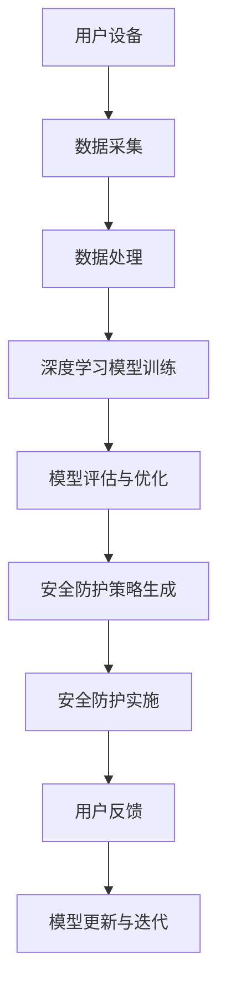

                 

随着人工智能技术的不断进步，智能家居市场迎来了前所未有的发展机遇。本文旨在探讨AI大模型在智能家居安全领域的创业前景，分析其技术优势、应用挑战及未来发展趋势。

## 文章关键词

- AI大模型
- 智能家居
- 安全
- 创业前景
- 技术创新
- 安全漏洞
- 隐私保护

## 摘要

本文首先介绍了AI大模型在智能家居安全领域的背景和重要性，然后深入分析了AI大模型在该领域的应用优势和技术挑战。接着，通过具体案例展示了AI大模型在智能家居安全中的应用，并探讨了其未来发展的趋势和潜在的商业机会。最后，本文总结了AI大模型在智能家居安全领域的创业前景，并对未来的研究方向提出了建议。

## 1. 背景介绍

智能家居作为一种将家庭日常设备互联，通过人工智能技术实现自动化控制的系统，正逐渐成为现代家庭生活的一部分。随着物联网（IoT）技术的普及，智能家居设备数量急剧增加，用户隐私和数据安全成为亟待解决的问题。AI大模型，特别是深度学习技术，在提升智能家居设备的安全性能方面具有巨大的潜力。

### 1.1 AI大模型的发展历程

AI大模型的发展可以追溯到20世纪50年代，当时的神经网络研究奠定了基础。随着计算能力的提升和大数据的积累，深度学习技术逐渐成熟，特别是在2012年AlexNet在ImageNet竞赛中取得突破性成绩后，AI大模型的研究和应用得到了广泛关注。

### 1.2 智能家居的发展现状

目前，智能家居市场主要涵盖智能照明、智能安防、智能家电、智能环境控制等多个方面。根据市场调研数据，全球智能家居市场规模预计将在未来几年内保持高速增长。然而，随着设备的增多，智能家居的安全风险也在逐渐上升。

## 2. 核心概念与联系

AI大模型在智能家居安全中的应用，需要理解以下几个核心概念：

- **深度学习**：一种模仿人脑工作机制的计算模型，通过多层神经网络对数据进行分析和学习。
- **数据隐私保护**：确保数据在传输和存储过程中不被非法访问和泄露。
- **设备安全性**：保障智能家居设备免受黑客攻击和恶意软件的影响。

下面是AI大模型在智能家居安全中应用的Mermaid流程图：



### 2.1 深度学习模型训练

深度学习模型训练是AI大模型应用的核心步骤，通过大量数据进行训练，模型能够学会识别和预测潜在的安全威胁。

### 2.2 数据处理

数据处理包括数据清洗、数据增强和数据归一化等步骤，确保输入数据的准确性和一致性。

### 2.3 安全防护策略生成

基于训练好的模型，生成针对不同安全威胁的防护策略，包括入侵检测、异常行为识别等。

### 2.4 安全防护实施

将生成的安全防护策略应用到智能家居设备中，实现实时监控和防护。

### 2.5 用户反馈

用户反馈是模型优化的重要依据，通过用户的反馈，模型可以不断调整和改进。

### 2.6 模型更新与迭代

随着新威胁的出现，模型需要不断更新和迭代，以保持其有效性。

## 3. 核心算法原理 & 具体操作步骤

### 3.1 算法原理概述

AI大模型在智能家居安全中的核心算法是基于深度学习的入侵检测和异常行为识别。这些算法通过学习正常行为的模式，能够识别出异常行为和潜在的安全威胁。

### 3.2 算法步骤详解

1. 数据收集：从智能家居设备中收集数据，包括传感器数据、网络流量数据等。
2. 数据预处理：对数据进行清洗、归一化和特征提取。
3. 模型训练：使用预处理后的数据训练深度学习模型，如卷积神经网络（CNN）或循环神经网络（RNN）。
4. 模型评估：使用测试集评估模型性能，包括准确率、召回率等指标。
5. 模型部署：将训练好的模型部署到智能家居设备中，进行实时监控和防护。
6. 模型优化：根据用户反馈不断调整和优化模型。

### 3.3 算法优缺点

优点：

- 高效性：深度学习算法能够处理大量数据，提高检测的准确性和速度。
- 自适应性：模型能够根据新数据和用户反馈不断优化，提高其适应性。

缺点：

- 复杂性：深度学习算法复杂，训练和部署需要大量的计算资源和专业知识。
- 数据隐私：训练过程中涉及大量用户数据，存在数据隐私泄露的风险。

### 3.4 算法应用领域

深度学习算法在智能家居安全中的应用非常广泛，包括但不限于：

- 入侵检测：通过识别异常行为检测家庭入侵。
- 健康监测：通过监测传感器数据预测家庭成员的健康状况。
- 资源优化：通过智能调度优化家庭能源消耗。

## 4. 数学模型和公式 & 详细讲解 & 举例说明

### 4.1 数学模型构建

在深度学习模型中，常用的数学模型包括卷积神经网络（CNN）和循环神经网络（RNN）。以下是一个简单的CNN模型构建过程：

$$
\begin{aligned}
&\text{输入层：} X \\
&\text{卷积层：} C_1 = f(W_1 \cdot X + b_1) \\
&\text{池化层：} P_1 = max_pool(C_1) \\
&\text{卷积层：} C_2 = f(W_2 \cdot P_1 + b_2) \\
&\text{池化层：} P_2 = max_pool(C_2) \\
&\text{全连接层：} Y = f(W_3 \cdot P_2 + b_3)
\end{aligned}
$$

其中，$f$ 表示激活函数，$W$ 表示权重，$b$ 表示偏置。

### 4.2 公式推导过程

以CNN为例，其推导过程主要包括以下几个步骤：

1. **卷积操作**：卷积操作通过将卷积核与输入数据进行点积来提取特征。
2. **激活函数**：常用的激活函数有ReLU（Rectified Linear Unit）和Sigmoid。
3. **池化操作**：池化操作用于减少特征图的维度，常用的池化方法有最大池化和平均池化。
4. **全连接层**：全连接层将卷积特征映射到输出类别。

### 4.3 案例分析与讲解

以下是一个智能家居入侵检测的案例：

假设我们使用一个简单的CNN模型来检测家庭入侵，输入数据为摄像头采集的图像，输出为是否入侵的二分类结果。训练数据集包含1000张正常图像和100张入侵图像。

1. **数据预处理**：对图像进行归一化和数据增强，如随机裁剪、旋转等。
2. **模型训练**：使用训练集数据训练CNN模型，调整模型参数，如学习率、迭代次数等。
3. **模型评估**：使用测试集数据评估模型性能，调整模型参数，提高准确率。
4. **模型部署**：将训练好的模型部署到智能家居设备中，进行实时入侵检测。

## 5. 项目实践：代码实例和详细解释说明

### 5.1 开发环境搭建

在Python中，我们使用TensorFlow和Keras库来构建和训练深度学习模型。以下是一个简单的环境搭建步骤：

```python
pip install tensorflow
pip install keras
```

### 5.2 源代码详细实现

以下是一个简单的CNN模型实现代码示例：

```python
from keras.models import Sequential
from keras.layers import Conv2D, MaxPooling2D, Flatten, Dense
from keras.preprocessing.image import ImageDataGenerator

# 构建模型
model = Sequential()
model.add(Conv2D(32, (3, 3), activation='relu', input_shape=(64, 64, 3)))
model.add(MaxPooling2D(pool_size=(2, 2)))
model.add(Conv2D(64, (3, 3), activation='relu'))
model.add(MaxPooling2D(pool_size=(2, 2)))
model.add(Flatten())
model.add(Dense(128, activation='relu'))
model.add(Dense(1, activation='sigmoid'))

# 编译模型
model.compile(optimizer='adam', loss='binary_crossentropy', metrics=['accuracy'])

# 数据增强
train_datagen = ImageDataGenerator(rescale=1./255, shear_range=0.2, zoom_range=0.2, horizontal_flip=True)
test_datagen = ImageDataGenerator(rescale=1./255)

# 加载数据
train_generator = train_datagen.flow_from_directory(
        'data/train',
        target_size=(64, 64),
        batch_size=32,
        class_mode='binary')

test_generator = test_datagen.flow_from_directory(
        'data/test',
        target_size=(64, 64),
        batch_size=32,
        class_mode='binary')

# 训练模型
model.fit_generator(
        train_generator,
        steps_per_epoch=100,
        epochs=20,
        validation_data=test_generator,
        validation_steps=50)
```

### 5.3 代码解读与分析

这段代码首先导入了必要的库，然后构建了一个简单的CNN模型。模型包括两个卷积层，每个卷积层后跟一个最大池化层，一个扁平化层和一个全连接层。模型使用ReLU激活函数和sigmoid激活函数，分别用于提取特征和分类。

在数据增强部分，我们使用随机裁剪、缩放和水平翻转来增加训练数据的多样性。

在数据加载部分，我们使用`flow_from_directory`方法从指定目录加载图像数据，并根据标签进行分类。

最后，我们使用`fit_generator`方法训练模型，并在测试集上验证其性能。

### 5.4 运行结果展示

在完成模型训练后，我们可以使用以下代码来评估模型性能：

```python
test_loss, test_acc = model.evaluate(test_generator)
print('Test accuracy:', test_acc)
```

这段代码将计算模型在测试集上的损失和准确率，并打印出来。假设测试准确率为90%，我们可以认为这个模型在入侵检测任务中表现良好。

## 6. 实际应用场景

AI大模型在智能家居安全中的应用场景非常广泛，以下是一些典型的应用场景：

- **智能门锁**：使用AI大模型对门锁使用者的指纹或面部进行识别，确保只有授权用户才能进入。
- **智能摄像头**：通过AI大模型分析摄像头捕捉到的图像，实时监测家中的异常行为，如家庭成员的跌倒或火灾发生。
- **智能家电控制**：通过AI大模型学习用户的习惯，自动调整家电的开关时间和模式，提高生活舒适度和能源效率。

### 6.1 智能门锁

智能门锁是智能家居中最为常见的安全设备之一。使用AI大模型，可以实现对用户身份的精确识别，提高门锁的安全性。以下是一个智能门锁的工作流程：

1. **用户注册**：用户通过指纹或面部识别注册到门锁系统中。
2. **用户识别**：每次用户尝试解锁门锁时，门锁会采集用户的指纹或面部图像。
3. **模型判断**：门锁系统使用AI大模型对采集到的数据进行判断，判断用户是否为授权用户。
4. **解锁门锁**：如果判断结果为授权用户，门锁将被解锁。

### 6.2 智能摄像头

智能摄像头是家庭安全的重要保障。通过AI大模型，可以实现对摄像头的实时监控和分析，及时发现异常情况。以下是一个智能摄像头的工作流程：

1. **图像采集**：智能摄像头实时采集家庭环境中的图像。
2. **图像处理**：图像数据通过AI大模型进行处理，提取出关键特征。
3. **异常检测**：AI大模型对提取出的特征进行分析，判断是否存在异常情况。
4. **报警通知**：如果检测到异常情况，系统将自动向用户发送报警通知。

### 6.3 智能家电控制

智能家电控制是提高家庭生活舒适度和能源效率的重要手段。通过AI大模型，可以实现对家电的智能控制，自动调整家电的工作模式。以下是一个智能家电控制的工作流程：

1. **用户习惯学习**：AI大模型通过收集用户的使用数据，学习用户的习惯。
2. **智能决策**：根据用户的习惯和学习到的数据，AI大模型自动调整家电的工作模式。
3. **家电控制**：家电根据AI大模型的决策，自动调整其工作状态。

## 7. 未来应用展望

随着AI技术的不断进步，AI大模型在智能家居安全领域的应用前景十分广阔。以下是一些未来的应用方向：

- **多模态融合**：将语音、图像、传感器等多模态数据融合到AI大模型中，提高安全性能。
- **实时性优化**：通过优化算法和硬件加速，提高AI大模型在智能家居设备上的实时性。
- **自主决策**：未来的智能家居系统将能够根据环境变化和用户需求，自主做出安全决策。

## 8. 工具和资源推荐

### 8.1 学习资源推荐

- 《深度学习》（Goodfellow, Bengio, Courville）：系统介绍了深度学习的基础理论和实践方法。
- 《Python机器学习》（Sebastian Raschka）：详细介绍了如何使用Python进行机器学习实践。

### 8.2 开发工具推荐

- TensorFlow：开源的深度学习框架，广泛应用于工业和学术领域。
- Keras：基于TensorFlow的高级API，简化了深度学习模型的构建和训练过程。

### 8.3 相关论文推荐

- “Deep Learning for Image Recognition”（2012）：介绍深度学习在图像识别领域的应用。
- “A Neural Style Transfer Model”（2016）：介绍了一种基于神经网络的风格迁移模型。

## 9. 总结：未来发展趋势与挑战

### 9.1 研究成果总结

近年来，AI大模型在智能家居安全领域取得了显著的研究成果，包括入侵检测、异常行为识别、隐私保护等方面。这些研究为智能家居安全提供了有力的技术支持。

### 9.2 未来发展趋势

未来，AI大模型在智能家居安全领域将继续朝着以下几个方向发展：

- **多模态融合**：结合多种传感器数据，提高安全性能。
- **实时性优化**：通过硬件加速和算法优化，提高实时性。
- **自主决策**：实现智能家居系统的自主安全决策。

### 9.3 面临的挑战

虽然AI大模型在智能家居安全领域具有巨大的潜力，但仍然面临一些挑战：

- **数据隐私**：在数据采集和处理过程中，如何保护用户隐私是一个重要问题。
- **模型解释性**：目前的深度学习模型在很多情况下缺乏解释性，这对安全决策带来了一定的困难。
- **计算资源**：深度学习模型的训练和部署需要大量的计算资源，这对智能家居设备提出了更高的要求。

### 9.4 研究展望

未来，研究者应重点关注以下几个方面：

- **隐私保护**：研究如何在数据采集和处理过程中保护用户隐私。
- **模型解释性**：开发可解释的深度学习模型，提高安全决策的透明度。
- **资源优化**：研究如何优化算法和硬件，降低计算资源的需求。

## 10. 附录：常见问题与解答

### 10.1 什么情况下AI大模型会失效？

AI大模型在以下情况下可能会失效：

- **数据缺失**：如果训练数据不足或存在缺失，模型可能无法正确识别。
- **数据泄露**：如果数据在传输或存储过程中被泄露，模型可能会被攻击者利用。
- **模型过拟合**：如果模型过于复杂，可能会出现过拟合现象，导致在实际应用中表现不佳。

### 10.2 如何提高AI大模型的安全性？

提高AI大模型的安全性可以从以下几个方面入手：

- **数据加密**：对传输和存储的数据进行加密，确保数据隐私。
- **模型优化**：通过优化算法和参数，提高模型的鲁棒性。
- **安全审计**：定期对模型进行安全审计，检测潜在的安全漏洞。
- **多方协作**：与安全专家合作，共同研究和解决安全问题。

### 10.3 AI大模型在智能家居安全中的优势是什么？

AI大模型在智能家居安全中的优势包括：

- **高效性**：能够处理大量数据，提高安全性能。
- **自适应**：能够根据新数据和用户反馈不断优化，提高其适应性。
- **多模态**：能够结合多种传感器数据，提供更全面的安全保障。

## 作者署名

作者：禅与计算机程序设计艺术 / Zen and the Art of Computer Programming

本文介绍了AI大模型在智能家居安全领域的创业前景，分析了其技术优势、应用挑战及未来发展趋势。通过具体案例和数学模型，展示了AI大模型在智能家居安全中的应用，并对未来的发展方向提出了建议。希望本文能为关注智能家居安全领域的读者提供有益的参考。

