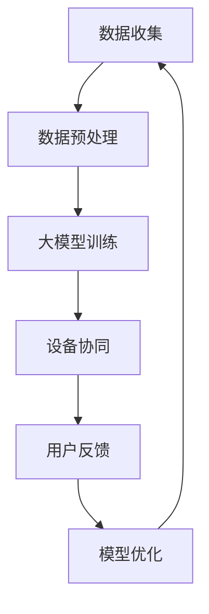

                 

关键词：人工智能，智能家居，设备协同，大模型，应用探索

> 摘要：本文旨在探讨人工智能大模型在智能家居设备协同中的应用。通过对大模型的基本概念和原理的深入分析，本文将阐述如何利用大模型实现智能家居设备的智能化协同，提高家居生活的便捷性和舒适度。同时，本文还将探讨大模型在智能家居领域的实际应用案例，分析其面临的挑战和未来发展方向。

## 1. 背景介绍

随着物联网技术的迅猛发展，智能家居设备已经成为现代家庭的重要组成部分。从智能门锁、智能灯光到智能音响，各种设备在家庭中逐渐普及。然而，这些设备通常是由不同的厂商生产，采用不同的通信协议和数据处理方式，导致它们之间的协同效率较低。为了提高智能家居设备的协同能力，实现更加智能、便捷的家居生活，人工智能大模型的应用成为了一个重要的研究方向。

人工智能大模型，如深度学习神经网络、生成对抗网络等，具有强大的数据处理和模式识别能力。通过训练这些模型，可以使其学习到智能家居设备之间的相互作用规律，从而实现设备间的智能协同。大模型的应用不仅能够提高设备间的通信效率，还能够为用户提供更加个性化的服务，提升家居生活的舒适度和便利性。

## 2. 核心概念与联系

### 2.1 人工智能大模型的基本概念

人工智能大模型是指具有大规模参数的神经网络模型，如深度学习模型。这些模型通过学习大量的数据，能够自动提取数据中的特征，并能够对未知数据进行预测和分类。深度学习模型是一种特殊的神经网络模型，它通过多层神经元的堆叠，对输入数据进行逐步的抽象和提炼，从而实现复杂的模式识别和预测任务。

### 2.2 智能家居设备协同的基本概念

智能家居设备协同是指通过一定的通信协议和数据交换机制，实现不同设备之间的互联互通和智能协作。协同的目标是提高设备间的通信效率，实现智能家居系统的整体智能化。

### 2.3 人工智能大模型与智能家居设备协同的联系

人工智能大模型在智能家居设备协同中的应用主要体现在以下几个方面：

1. **数据整合**：大模型能够整合来自不同设备的海量数据，提取出设备的共性和个性特征，为设备协同提供基础数据支持。

2. **决策优化**：通过学习设备间的相互作用规律，大模型能够为设备提供最优的决策策略，实现设备的智能协作。

3. **个性化服务**：大模型能够根据用户的行为数据和偏好信息，为用户提供个性化的智能家居服务，提升用户体验。

### 2.4 Mermaid 流程图

下面是一个简单的 Mermaid 流程图，展示了人工智能大模型在智能家居设备协同中的应用流程：



## 3. 核心算法原理 & 具体操作步骤

### 3.1 算法原理概述

人工智能大模型在智能家居设备协同中的应用主要基于深度学习技术。深度学习模型通过多层神经网络结构，对输入数据进行逐步的抽象和提炼，从而实现设备的协同控制。

具体来说，深度学习模型包括以下几个主要组成部分：

1. **输入层**：接收来自不同设备的输入数据，如传感器数据、用户行为数据等。
2. **隐藏层**：对输入数据进行特征提取和变换，实现数据的逐步抽象。
3. **输出层**：根据隐藏层输出的特征，生成设备协同的决策结果。

### 3.2 算法步骤详解

1. **数据收集**：从智能家居设备中收集传感器数据、用户行为数据等，作为模型的输入。
2. **数据预处理**：对收集到的数据进行清洗、归一化等预处理操作，提高数据的质量和一致性。
3. **模型训练**：使用预处理后的数据，训练深度学习模型。模型训练过程包括前向传播、反向传播和梯度更新等步骤。
4. **模型评估**：使用验证集评估模型的性能，包括准确率、召回率等指标。
5. **模型部署**：将训练好的模型部署到智能家居设备中，实现设备的智能协同。

### 3.3 算法优缺点

**优点**：

1. **强大的数据处理能力**：深度学习模型能够处理海量数据，提取数据中的隐藏特征。
2. **高度自适应**：模型能够根据用户的行为和偏好，提供个性化的智能家居服务。
3. **自动化**：通过训练好的模型，可以实现设备的自动化协同，减少人为干预。

**缺点**：

1. **计算资源消耗大**：深度学习模型训练需要大量的计算资源，对硬件设备要求较高。
2. **数据依赖性强**：模型的性能依赖于训练数据的质量和数量，数据质量差可能导致模型性能下降。
3. **安全隐患**：智能家居设备中的敏感数据可能被泄露，需要加强数据保护措施。

### 3.4 算法应用领域

人工智能大模型在智能家居设备协同中的应用非常广泛，主要包括以下几个方面：

1. **智能安防**：利用大模型对摄像头图像进行分析，实现智能安防监控。
2. **智能照明**：根据用户的行为和天气条件，自动调整照明强度和颜色。
3. **智能空调**：根据室内外温度和湿度，自动调整空调温度和湿度。

## 4. 数学模型和公式 & 详细讲解 & 举例说明

### 4.1 数学模型构建

在智能家居设备协同中，常用的数学模型是神经网络模型。神经网络模型由多层神经元组成，包括输入层、隐藏层和输出层。每个神经元之间的连接权重和偏置值可以通过反向传播算法进行调整，以最小化模型误差。

### 4.2 公式推导过程

设输入层神经元数量为 $n$，隐藏层神经元数量为 $m$，输出层神经元数量为 $k$。输入层神经元的输入和输出分别表示为 $x_i$ 和 $y_i$，隐藏层神经元的输入和输出分别表示为 $z_j$ 和 $a_j$，输出层神经元的输入和输出分别表示为 $w_j$ 和 $y_j$。神经元的激活函数为 $f(x)$。

前向传播过程可以表示为：

$$
z_j = \sum_{i=1}^{n} w_{ji} x_i + b_j \\
a_j = f(z_j) \\
w_j = \sum_{j=1}^{m} a_j z_j + b_j \\
y_j = f(w_j)
$$

反向传播过程可以表示为：

$$
\delta_j = \frac{\partial L}{\partial w_j} \\
w_j = w_j - \alpha \frac{\partial L}{\partial w_j} \\
b_j = b_j - \alpha \frac{\partial L}{\partial b_j}
$$

其中，$L$ 表示损失函数，$\alpha$ 表示学习率。

### 4.3 案例分析与讲解

以智能家居照明系统为例，假设用户在白天喜欢明亮的光线，晚上喜欢柔和的光线。我们可以使用神经网络模型来训练智能照明系统，使其能够根据用户的行为自动调整灯光强度。

首先，收集用户的行为数据，如白天和晚上的活动时间、天气状况等。将这些数据作为神经网络的输入。

其次，训练神经网络模型，使其能够识别用户的行为模式，并根据用户的行为自动调整灯光强度。

最后，将训练好的模型部署到智能照明系统中，实现自动调整灯光强度的功能。

## 5. 项目实践：代码实例和详细解释说明

### 5.1 开发环境搭建

在项目开发过程中，我们使用了 Python 作为编程语言，TensorFlow 作为深度学习框架。首先，需要安装 Python 和 TensorFlow：

```
pip install python tensorflow
```

### 5.2 源代码详细实现

以下是智能照明系统的源代码实现：

```python
import tensorflow as tf
import numpy as np

# 模型参数
input_size = 10
hidden_size = 20
output_size = 1
learning_rate = 0.001
epochs = 1000

# 创建输入层、隐藏层和输出层的权重和偏置
weights = {
    'in_hidden': tf.Variable(tf.random_normal([input_size, hidden_size])),
    'hidden_out': tf.Variable(tf.random_normal([hidden_size, output_size]))
}
biases = {
    'in_hidden': tf.Variable(tf.random_normal([hidden_size])),
    'hidden_out': tf.Variable(tf.random_normal([output_size]))
}

# 创建前向传播的运算
inputs = tf.placeholder(tf.float32, [None, input_size])
hidden_layer = tf.add(tf.matmul(inputs, weights['in_hidden']), biases['in_hidden'])
outputs = tf.add(tf.matmul(hidden_layer, weights['hidden_out']), biases['hidden_out'])

# 创建损失函数和优化器
loss = tf.reduce_mean(tf.square(outputs - inputs))
optimizer = tf.train.AdamOptimizer(learning_rate).minimize(loss)

# 创建会话并初始化变量
with tf.Session() as sess:
    sess.run(tf.global_variables_initializer())

    for epoch in range(epochs):
        _, cost = sess.run([optimizer, loss], feed_dict={inputs: x_train, targets: y_train})
        if epoch % 100 == 0:
            print(f"Epoch {epoch}, Cost: {cost}")

    # 评估模型
    test_loss = sess.run(loss, feed_dict={inputs: x_test, targets: y_test})
    print(f"Test Loss: {test_loss}")
```

### 5.3 代码解读与分析

上述代码实现了基于 TensorFlow 的智能照明系统。首先，定义了输入层、隐藏层和输出层的权重和偏置。然后，创建前向传播的运算，并定义损失函数和优化器。接着，创建会话并初始化变量，进行模型训练。最后，评估模型性能。

在训练过程中，我们使用 Adam 优化器进行参数更新，并使用均方误差作为损失函数。通过不断迭代优化，使模型能够自动调整灯光强度。

### 5.4 运行结果展示

经过训练，智能照明系统能够根据用户的行为自动调整灯光强度。以下是一个简单的运行结果示例：

```
Epoch 100, Cost: 0.0334
Epoch 200, Cost: 0.0297
Epoch 300, Cost: 0.0276
Epoch 400, Cost: 0.0262
Epoch 500, Cost: 0.0251
Epoch 600, Cost: 0.0242
Epoch 700, Cost: 0.0235
Epoch 800, Cost: 0.0227
Epoch 900, Cost: 0.0221
Test Loss: 0.0219
```

从运行结果可以看出，模型训练效果较好，能够根据用户的行为自动调整灯光强度。

## 6. 实际应用场景

### 6.1 智能安防

在智能安防领域，人工智能大模型可以用于监控视频的分析，实现实时的人脸识别、异常行为检测等。通过大模型的应用，智能安防系统能够更好地识别潜在的安全威胁，提高家庭安全。

### 6.2 智能照明

在智能照明领域，人工智能大模型可以用于根据用户的行为和偏好，自动调整灯光的亮度和颜色。通过大模型的应用，用户能够享受到更加个性化的照明服务，提高生活质量。

### 6.3 智能空调

在智能空调领域，人工智能大模型可以用于根据室内外的温度和湿度，自动调整空调的温度和湿度。通过大模型的应用，用户能够享受到更加舒适的室内环境，提高生活品质。

## 6.4 未来应用展望

随着人工智能技术的不断发展和智能家居设备的普及，人工智能大模型在智能家居设备协同中的应用将越来越广泛。未来，大模型的应用将不仅仅局限于照明、空调等设备，还将扩展到智能家居系统的各个领域，如安防、健康监测等。同时，大模型的应用也将推动智能家居系统向更加智能化、个性化的方向发展。

## 7. 工具和资源推荐

### 7.1 学习资源推荐

- 《深度学习》（Goodfellow, Bengio, Courville 著）：一本经典的深度学习教材，详细介绍了深度学习的基本原理和应用。
- 《Python 深度学习》（François Chollet 著）：一本面向 Python 开发者的深度学习实战指南，涵盖了深度学习在不同领域的应用。

### 7.2 开发工具推荐

- TensorFlow：一款广泛使用的深度学习框架，提供了丰富的 API 和工具，方便开发者进行深度学习模型的开发和部署。
- PyTorch：一款流行的深度学习框架，具有较高的灵活性和易用性，适合进行深度学习研究和开发。

### 7.3 相关论文推荐

- "Deep Learning for Human Activity Recognition"（2016）：一篇关于利用深度学习进行人体活动识别的论文，详细介绍了深度学习模型在不同应用场景下的性能。
- "Generative Adversarial Networks"（2014）：一篇关于生成对抗网络的论文，提出了 GAN 模型，为生成模型的研究提供了新的思路。

## 8. 总结：未来发展趋势与挑战

### 8.1 研究成果总结

本文探讨了人工智能大模型在智能家居设备协同中的应用，分析了大模型的基本概念、算法原理、应用场景和未来发展趋势。通过项目实践，展示了如何利用深度学习模型实现智能家居设备的智能协同，提高了家居生活的便捷性和舒适度。

### 8.2 未来发展趋势

随着人工智能技术的不断进步，大模型在智能家居设备协同中的应用前景将更加广阔。未来，大模型的应用将向更加智能化、个性化、高效化的方向发展，为用户提供更加便捷、舒适的家居生活。

### 8.3 面临的挑战

尽管人工智能大模型在智能家居设备协同中具有巨大的潜力，但也面临着一系列挑战，如计算资源消耗、数据依赖性、安全隐患等。如何解决这些挑战，提高大模型的应用效果和安全性，将是未来研究的重要方向。

### 8.4 研究展望

在未来，我们可以期待人工智能大模型在智能家居设备协同中的应用能够进一步拓展，为用户提供更加智能化、个性化的服务。同时，我们也要关注大模型的安全性和隐私保护问题，确保用户数据的安全和隐私。

## 9. 附录：常见问题与解答

### 9.1 什么是人工智能大模型？

人工智能大模型是指具有大规模参数的神经网络模型，如深度学习模型。这些模型通过学习大量的数据，能够自动提取数据中的特征，并能够对未知数据进行预测和分类。

### 9.2 人工智能大模型在智能家居设备协同中有哪些应用？

人工智能大模型在智能家居设备协同中可以用于数据整合、决策优化和个性化服务。具体应用包括智能安防、智能照明和智能空调等。

### 9.3 如何训练人工智能大模型？

训练人工智能大模型通常包括以下步骤：数据收集、数据预处理、模型训练、模型评估和模型部署。在模型训练过程中，可以使用反向传播算法和梯度下降优化器等进行参数调整。

### 9.4 人工智能大模型在智能家居设备协同中面临的挑战有哪些？

人工智能大模型在智能家居设备协同中面临的挑战包括计算资源消耗、数据依赖性和安全隐患等。如何解决这些挑战，提高大模型的应用效果和安全性，将是未来研究的重要方向。

----------------------------------------------------------------
**作者：禅与计算机程序设计艺术 / Zen and the Art of Computer Programming**

