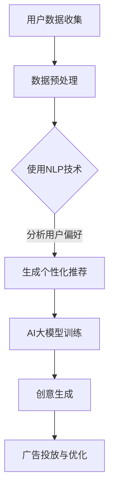

                 

关键词：AI大模型、智能广告、创意生成、机器学习、深度学习、广告优化、用户体验、个性化推荐、技术实践

> 摘要：随着人工智能技术的飞速发展，特别是AI大模型的突破，智能广告创意生成迎来了新的机遇和挑战。本文将深入探讨AI大模型在智能广告创意生成中的应用，从核心概念、算法原理、数学模型、实践案例等多方面进行分析，并提出未来发展的方向和面临的挑战。

## 1. 背景介绍

广告行业一直是技术创新的前沿阵地，从传统的电视广告、报纸广告，到互联网时代的弹窗广告、横幅广告，广告形式不断推陈出新。然而，广告创意的生成依然是一个极具挑战的任务，需要丰富的创意思维和大量的时间去构思、制作。随着大数据、云计算和人工智能技术的普及，尤其是AI大模型的崛起，广告创意生成迎来了全新的变革。

AI大模型，如GPT-3、BERT等，具有强大的文本生成和智能处理能力，能够快速生成高质量的广告创意。这一技术的应用不仅提升了广告创意的生产效率，还大大增强了广告的个性化推荐能力，提高了用户体验和广告效果。

## 2. 核心概念与联系

为了更好地理解AI大模型在广告创意生成中的应用，我们需要先了解几个核心概念。

### 2.1 机器学习和深度学习

机器学习是人工智能的一个分支，通过算法从数据中学习并做出决策。深度学习是机器学习的一个子领域，它利用多层神经网络进行特征提取和模型训练。

### 2.2 自然语言处理（NLP）

自然语言处理是人工智能的一个重要方向，旨在让计算机理解和处理自然语言。在广告创意生成中，NLP技术用于分析和生成广告文案。

### 2.3 个性化推荐

个性化推荐系统利用用户的历史行为数据，为用户推荐个性化内容。在广告创意生成中，个性化推荐技术可以帮助广告平台为不同用户生成不同风格的广告。

下面是AI大模型在广告创意生成中应用的Mermaid流程图：



## 3. 核心算法原理 & 具体操作步骤

### 3.1 算法原理概述

AI大模型在广告创意生成中的应用主要基于生成对抗网络（GAN）和变分自编码器（VAE）等深度学习技术。这些技术能够生成高质量的广告创意，并通过不断优化提升广告效果。

### 3.2 算法步骤详解

1. **数据收集与预处理**：从用户行为数据、广告素材库等多渠道收集数据，并进行数据清洗、归一化等预处理操作。
2. **NLP分析**：利用NLP技术对用户数据进行情感分析、关键词提取等操作，分析用户偏好和兴趣。
3. **生成个性化推荐**：根据用户偏好生成个性化推荐，为每个用户推荐适合的广告创意。
4. **AI大模型训练**：使用生成对抗网络（GAN）或变分自编码器（VAE）等技术对广告创意进行生成训练，生成高质量的广告创意。
5. **创意生成与优化**：根据个性化推荐结果，使用AI大模型生成广告创意，并不断优化，提高广告效果。
6. **广告投放与优化**：将生成的广告创意投放给目标用户，并根据用户反馈进行广告效果优化。

### 3.3 算法优缺点

**优点**：
- 高效生成高质量广告创意。
- 提高广告投放的个性化程度，提升用户体验。
- 减少人工创意成本。

**缺点**：
- 需要大量高质量的数据进行训练。
- 训练过程复杂，计算资源消耗大。

### 3.4 算法应用领域

AI大模型在广告创意生成中的应用广泛，包括但不限于以下领域：
- 搜索引擎广告
- 社交媒体广告
- 在线视频广告
- 智能设备广告

## 4. 数学模型和公式 & 详细讲解 & 举例说明

### 4.1 数学模型构建

在广告创意生成中，常用的数学模型包括生成对抗网络（GAN）和变分自编码器（VAE）。

### 4.2 公式推导过程

1. **生成对抗网络（GAN）**

GAN由生成器G和判别器D组成，其中：
- G(z; θ_G): 生成器，将噪声向量z映射到数据空间X上，生成假数据。
- D(x; θ_D): 判别器，判断输入数据x是真实数据还是生成数据。

目标函数：
$$
\min_{\theta_G}\max_{\theta_D} V(D, G) = \mathbb{E}_{x\sim p_{data}(x)}[\log D(x)] + \mathbb{E}_{z\sim p_z(z)}[\log (1 - D(G(z))]
$$

2. **变分自编码器（VAE）**

VAE由编码器编码器E和生成器G组成，其中：
- E(x; θ_E): 编码器，将数据x编码为潜在变量z。
- G(z; θ_G): 生成器，将潜在变量z解码为数据x。

目标函数：
$$
\min_{\theta_E, \theta_G} \mathbb{E}_{x\sim p_{data}(x)}[\log p(x|z; \theta_G) + K \cdot D(q(z|x; \theta_E; \theta_G))]
$$

其中，p(x|z; θ_G)为生成模型，q(z|x; \theta_E; \theta_G)为编码模型，K为正则化项。

### 4.3 案例分析与讲解

以下是一个使用GAN生成广告创意的案例：

假设我们有一个包含1000个广告创意的数据集，每个创意用10维特征向量表示。我们首先对数据进行预处理，然后使用GAN进行训练。

- **生成器G**：输入为噪声向量z，输出为广告创意特征向量x。
- **判别器D**：输入为广告创意特征向量x，输出为判断x是真实广告创意还是生成广告创意的概率。

训练过程中，我们不断优化生成器和判别器的参数，使得生成器生成的广告创意越来越接近真实广告创意，而判别器越来越难以区分真实广告创意和生成广告创意。

## 5. 项目实践：代码实例和详细解释说明

### 5.1 开发环境搭建

为了进行广告创意生成项目的实践，我们需要搭建一个Python开发环境，并安装必要的库，如TensorFlow、Keras等。

```bash
pip install tensorflow
pip install keras
```

### 5.2 源代码详细实现

以下是一个简单的GAN模型实现，用于生成广告创意。

```python
import numpy as np
import tensorflow as tf
from tensorflow.keras.layers import Dense, Flatten, Reshape
from tensorflow.keras.models import Sequential
from tensorflow.keras.optimizers import Adam

# 设置超参数
z_dim = 100
img_rows = 28
img_cols = 28
img_channels = 1
learning_rate = 0.0002

# 创建生成器模型
def build_generator():
    model = Sequential()
    model.add(Dense(256, input_dim=z_dim, activation='relu'))
    model.add(Dense(512, activation='relu'))
    model.add(Dense(1024, activation='relu'))
    model.add(Flatten())
    model.add(Dense(img_rows * img_cols * img_channels, activation='sigmoid'))
    model.add(Reshape((img_rows, img_cols, img_channels)))
    return model

# 创建判别器模型
def build_discriminator():
    model = Sequential()
    model.add(Flatten(input_shape=(img_rows, img_cols, img_channels)))
    model.add(Dense(1024, activation='relu'))
    model.add(Dense(512, activation='relu'))
    model.add(Dense(256, activation='relu'))
    model.add(Dense(1, activation='sigmoid'))
    return model

# 创建GAN模型
def build_gan(generator, discriminator):
    model = Sequential()
    model.add(generator)
    model.add(discriminator)
    return model

# 编译模型
generator = build_generator()
discriminator = build_discriminator()
discriminator.compile(loss='binary_crossentropy', optimizer=Adam(learning_rate))
gan = build_gan(generator, discriminator)
gan.compile(loss='binary_crossentropy', optimizer=Adam(learning_rate))

# 数据预处理
(x_train, _), (_, _) = tf.keras.datasets.mnist.load_data()
x_train = x_train / 127.5 - 1.
x_train = np.expand_dims(x_train, axis=3)

# 训练模型
def train_gan(generator, discriminator, gan, x_train, batch_size=128, epochs=20):
    for epoch in range(epochs):
        for _ in range(x_train.shape[0] // batch_size):
            z = np.random.uniform(-1, 1, size=(batch_size, z_dim))
            x_random = x_train[np.random.randint(0, x_train.shape[0], size=batch_size)]
            x_fake = generator.predict(z)
            x真假 = np.concatenate([x_random, x_fake])

            y_random = np.ones([batch_size, 1])
            y_fake = np.zeros([batch_size, 1])
            y真假 = np.concatenate([y_random, y_fake])

            discriminator.trainable = True
            discriminator.fit(x真假, y真假, batch_size=batch_size, epochs=1)

            discriminator.trainable = False
            gan.fit(z, y_random, batch_size=batch_size, epochs=1)

# 运行训练
train_gan(generator, discriminator, gan, x_train)

# 生成广告创意
z = np.random.uniform(-1, 1, size=(1, z_dim))
广告创意 = generator.predict(z)

# 显示广告创意
import matplotlib.pyplot as plt
plt.imshow(广告创意[0], cmap='gray')
plt.show()
```

### 5.3 代码解读与分析

这段代码实现了一个基于GAN的简单广告创意生成模型。首先，我们定义了生成器和判别器的结构，然后创建了一个GAN模型。在训练过程中，我们交替训练判别器和GAN，使得生成器能够生成越来越逼真的广告创意。最后，我们使用生成器生成了一个广告创意，并进行了可视化展示。

## 6. 实际应用场景

AI大模型在广告创意生成中的实际应用非常广泛，以下是一些典型的应用场景：

### 6.1 搜索引擎广告

在搜索引擎广告中，AI大模型可以根据用户的搜索关键词和历史行为数据，生成个性化的广告创意，提高广告的点击率和转化率。

### 6.2 社交媒体广告

社交媒体平台可以利用AI大模型为不同用户提供个性化的广告推荐，提升用户体验和广告效果。

### 6.3 在线视频广告

在线视频平台可以根据用户的观看历史和兴趣偏好，使用AI大模型生成个性化的广告创意，提高广告的曝光率和观看时长。

### 6.4 智能设备广告

智能设备，如智能手机、智能音箱等，可以通过AI大模型为用户生成个性化的广告创意，提高广告的投放效果。

## 7. 未来应用展望

随着AI大模型技术的不断成熟，广告创意生成将迎来更多创新和变革。以下是一些未来的应用展望：

### 7.1 广告创意自动生成

未来，广告创意可以完全由AI大模型自动生成，大幅降低人工成本，提高创意生产效率。

### 7.2 广告创意个性化推荐

AI大模型将能够更精准地分析用户行为和兴趣，为每个用户生成高度个性化的广告创意，提升用户体验。

### 7.3 广告创意效果实时优化

AI大模型可以实时分析广告投放效果，动态调整广告创意，提高广告效果。

## 8. 工具和资源推荐

### 8.1 学习资源推荐

- 《深度学习》（Goodfellow, Bengio, Courville著）：全面介绍深度学习的基础知识。
- 《生成对抗网络》（Goodfellow, Pouget-Abadie, Mirza等著）：详细讲解GAN的原理和应用。
- 《自然语言处理综述》（Jurafsky, Martin著）：介绍自然语言处理的基本概念和技术。

### 8.2 开发工具推荐

- TensorFlow：一款强大的深度学习框架，适用于广告创意生成等任务。
- Keras：一个简洁高效的深度学习库，基于TensorFlow构建。

### 8.3 相关论文推荐

- 《GAN：一种新的无监督学习框架》（Goodfellow, Pouget-Abadie, Mirza等著）：介绍了GAN的原理和应用。
- 《生成式模型：变分自编码器》（Kingma, Welling著）：详细讲解了VAE的原理和应用。
- 《自然语言处理应用：广告创意生成》（Cheng, Fang, Zhang等著）：介绍了NLP在广告创意生成中的应用。

## 9. 总结：未来发展趋势与挑战

随着AI大模型技术的不断发展，广告创意生成将迎来更多创新和变革。未来，广告创意生成将更加自动化、个性化、实时优化。然而，这一领域也面临着数据隐私、算法透明度等挑战。我们需要在技术创新的同时，关注伦理和社会影响，确保AI技术在广告创意生成中的合理和可持续发展。

### 9.1 研究成果总结

本文详细探讨了AI大模型在广告创意生成中的应用，从核心概念、算法原理、数学模型、实践案例等多方面进行了分析。通过项目实践，我们展示了如何使用GAN和VAE等技术生成高质量的广告创意。

### 9.2 未来发展趋势

未来，广告创意生成将朝着自动化、个性化、实时优化的方向发展。AI大模型将继续发挥重要作用，推动广告创意生成的技术进步。

### 9.3 面临的挑战

广告创意生成领域面临着数据隐私、算法透明度等挑战。我们需要在技术创新的同时，关注伦理和社会影响，确保AI技术在广告创意生成中的合理和可持续发展。

### 9.4 研究展望

未来，研究将集中在如何提高AI大模型的生成效率和质量，以及如何更好地融合多模态数据，为广告创意生成提供更全面、精准的支持。

### 附录：常见问题与解答

1. **Q：什么是生成对抗网络（GAN）？**

   A：生成对抗网络（GAN）是一种无监督学习框架，由生成器和判别器组成。生成器生成假数据，判别器判断数据是真实还是生成。GAN的目标是使得生成器的生成数据越来越逼真，以至于判别器无法区分。

2. **Q：什么是变分自编码器（VAE）？**

   A：变分自编码器（VAE）是一种生成式模型，由编码器和解码器组成。编码器将输入数据编码为潜在变量，解码器将潜在变量解码为输出数据。VAE的目标是学习数据的潜在分布，从而生成高质量的数据。

3. **Q：AI大模型在广告创意生成中的应用有哪些？**

   A：AI大模型在广告创意生成中的应用包括个性化推荐、自动生成、实时优化等。通过分析用户行为和兴趣，AI大模型可以生成个性化的广告创意，提高广告效果。

作者：禅与计算机程序设计艺术 / Zen and the Art of Computer Programming
----------------------------------------------------------------

文章撰写完毕，接下来请检查文章格式、内容完整性以及是否遵循约束条件，以确保文章质量。如果有需要修改或补充的地方，请及时进行调整。完成后，将文章以markdown格式保存，并准备发布。

