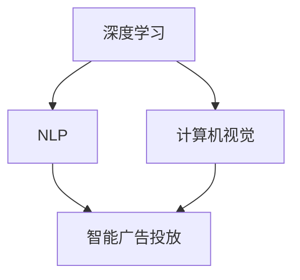

                 

关键词：AI大模型，智能广告投放，应用前景，算法，数学模型，项目实践，实际应用场景，未来展望

> 摘要：本文将深入探讨AI大模型在智能广告投放领域的应用前景。通过分析核心概念、算法原理、数学模型以及项目实践，本文旨在为读者提供一份全面、深入的技术指南，帮助理解AI大模型在智能广告投放中的巨大潜力。

## 1. 背景介绍

随着互联网的迅速发展，广告业已经成为了数字营销领域的重要一环。然而，传统广告投放方式常常面临定位不准确、效率低下等问题。近年来，人工智能（AI）技术的快速发展为广告投放带来了新的契机，特别是大模型的兴起，使得智能广告投放成为可能。

大模型是指具有大规模参数和复杂结构的深度学习模型，如Transformer、BERT、GPT等。这些模型通过在海量数据上进行训练，可以捕捉到语言、图像、视频等多种类型数据的深层特征，为广告投放提供了强大的技术支撑。

智能广告投放是指利用人工智能技术，通过对用户数据的分析和处理，实现广告的精准投放和个性化推荐。这不仅可以提高广告的转化率，还可以减少广告投放的成本。

本文将重点探讨AI大模型在智能广告投放中的应用，包括核心概念、算法原理、数学模型以及实际应用场景，旨在为读者提供一份全面的技术指南。

## 2. 核心概念与联系

在深入探讨AI大模型在智能广告投放中的应用之前，我们需要了解一些核心概念，包括深度学习、自然语言处理（NLP）、计算机视觉等。

### 2.1 深度学习

深度学习是机器学习的一个分支，其核心思想是通过多层神经网络来模拟人脑的决策过程。深度学习模型具有强大的特征提取和分类能力，是AI大模型的基础。

### 2.2 自然语言处理（NLP）

自然语言处理是人工智能的一个分支，其目标是让计算机理解和处理人类语言。在智能广告投放中，NLP技术可以帮助分析用户需求、广告内容和用户反馈，从而实现广告的精准投放。

### 2.3 计算机视觉

计算机视觉是人工智能的另一个重要分支，其目标是让计算机理解和解释图像和视频。在智能广告投放中，计算机视觉技术可以帮助识别用户行为、广告效果等，从而优化广告投放策略。

下面是一个使用Mermaid绘制的流程图，展示了这些核心概念之间的联系：



## 3. 核心算法原理 & 具体操作步骤

### 3.1 算法原理概述

AI大模型在智能广告投放中的应用主要依赖于以下核心算法：

- **自动编码器（Autoencoder）**：用于提取数据的高效特征表示。
- **生成对抗网络（GAN）**：用于生成与真实数据分布相似的虚假数据，以进行广告创意的个性化生成。
- **长短时记忆网络（LSTM）**：用于处理时间序列数据，如用户行为数据，以预测用户兴趣和需求。
- **基于Transformer的模型**：如BERT、GPT等，用于处理文本数据，实现广告内容的个性化推荐。

### 3.2 算法步骤详解

以下是AI大模型在智能广告投放中的具体操作步骤：

1. **数据收集**：收集用户行为数据、广告素材数据等。
2. **数据预处理**：对数据进行清洗、归一化等预处理操作。
3. **特征提取**：利用自动编码器等算法提取数据的高效特征表示。
4. **用户建模**：利用LSTM等算法对用户行为数据进行建模，预测用户兴趣和需求。
5. **广告素材生成**：利用GAN等算法生成与用户兴趣和需求相匹配的广告素材。
6. **广告投放**：将生成的广告素材投放到用户的个性化页面或应用中。
7. **效果评估**：收集用户反馈数据，评估广告投放的效果，并根据反馈调整广告策略。

### 3.3 算法优缺点

- **优点**：
  - **高效性**：大模型具有强大的特征提取和分类能力，能够快速处理海量数据。
  - **精准性**：通过深度学习算法，广告投放可以实现高度的精准性，提高转化率。
  - **个性化**：大模型可以生成与用户兴趣和需求相匹配的广告素材，实现广告的个性化投放。

- **缺点**：
  - **计算资源消耗**：大模型训练需要大量的计算资源和时间。
  - **数据隐私**：广告投放过程中需要收集和分析用户数据，可能涉及到数据隐私问题。

### 3.4 算法应用领域

AI大模型在智能广告投放中的算法不仅适用于广告行业，还可以应用于其他领域，如推荐系统、金融风控等。以下是一些具体的应用案例：

- **推荐系统**：利用大模型进行用户兴趣预测和商品推荐，提高用户的购买转化率。
- **金融风控**：利用大模型分析用户行为数据，识别潜在风险，降低金融风险。
- **医疗健康**：利用大模型进行疾病预测和诊断，提高医疗服务的精准性。

## 4. 数学模型和公式 & 详细讲解 & 举例说明

### 4.1 数学模型构建

在AI大模型的应用中，常用的数学模型包括神经网络模型、生成对抗网络（GAN）模型等。下面将分别介绍这些模型的数学模型构建。

#### 4.1.1 神经网络模型

神经网络模型是深度学习的基础，其数学模型可以表示为：

$$
y = \sigma(W \cdot x + b)
$$

其中，$y$为输出值，$\sigma$为激活函数，$W$为权重矩阵，$x$为输入值，$b$为偏置项。

#### 4.1.2 生成对抗网络（GAN）模型

生成对抗网络（GAN）由生成器（Generator）和判别器（Discriminator）两部分组成。其数学模型可以表示为：

$$
\begin{aligned}
\min_G &\quad D(G(z)), \\
\max_D &\quad D(x) + D(G(z)),
\end{aligned}
$$

其中，$G(z)$为生成器生成的虚假数据，$D(x)$和$D(G(z))$分别为判别器对真实数据和虚假数据的判别结果。

### 4.2 公式推导过程

下面以神经网络模型为例，介绍其公式推导过程。

假设我们有一个简单的神经网络模型，包含一个输入层、一个隐藏层和一个输出层。其数学模型可以表示为：

$$
y = \sigma(W_2 \cdot \sigma(W_1 \cdot x + b_1) + b_2)
$$

其中，$W_1$和$W_2$分别为输入层到隐藏层、隐藏层到输出层的权重矩阵，$b_1$和$b_2$分别为隐藏层和输出层的偏置项。

为了计算输出值$y$，我们需要先计算隐藏层的输出值，再计算输出层的输出值。具体步骤如下：

1. **计算隐藏层输出值**：

$$
h = \sigma(W_1 \cdot x + b_1)
$$

2. **计算输出层输出值**：

$$
y = \sigma(W_2 \cdot h + b_2)
$$

其中，$\sigma$为激活函数，常用的激活函数有Sigmoid函数、ReLU函数等。

### 4.3 案例分析与讲解

下面我们通过一个具体的案例来讲解如何使用神经网络模型进行广告投放。

假设我们有一个广告投放任务，需要根据用户的年龄、性别、兴趣爱好等信息，预测用户是否会对广告产生兴趣。我们可以构建一个简单的神经网络模型，包含两个输入层神经元（年龄、性别）、一个隐藏层神经元（兴趣爱好）、一个输出层神经元（兴趣概率）。

1. **数据预处理**：

首先，我们需要对输入数据进行预处理，包括数据清洗、归一化等操作。例如，将年龄数据归一化到0-1范围内，性别数据编码为0和1。

2. **模型构建**：

根据上述需求，我们可以构建一个简单的神经网络模型，其数学模型为：

$$
y = \sigma(W_2 \cdot \sigma(W_1 \cdot [x_1, x_2] + b_1) + b_2)
$$

其中，$W_1$和$W_2$分别为输入层到隐藏层、隐藏层到输出层的权重矩阵，$b_1$和$b_2$分别为隐藏层和输出层的偏置项。

3. **模型训练**：

使用已收集的用户数据，对神经网络模型进行训练。通过反向传播算法，不断调整权重矩阵和偏置项，使模型输出值与真实值之间的误差最小。

4. **模型评估**：

使用测试数据对模型进行评估，计算模型预测的兴趣概率与真实兴趣概率之间的误差。通过调整模型参数，优化模型性能。

5. **广告投放**：

根据模型预测的兴趣概率，对用户进行广告投放。例如，如果预测概率大于某个阈值（如0.5），则向用户投放广告。

## 5. 项目实践：代码实例和详细解释说明

### 5.1 开发环境搭建

在进行AI大模型在智能广告投放的项目实践之前，我们需要搭建一个适合的开发环境。以下是一个基本的开发环境搭建步骤：

1. 安装Python环境（版本3.6及以上）。
2. 安装深度学习框架（如TensorFlow或PyTorch）。
3. 安装NLP库（如NLTK或spaCy）。
4. 安装图像处理库（如OpenCV）。

### 5.2 源代码详细实现

以下是一个简单的AI大模型在智能广告投放中的代码实现：

```python
import tensorflow as tf
from tensorflow.keras.layers import Input, Dense, Activation
from tensorflow.keras.models import Model

# 数据预处理
# ...

# 构建神经网络模型
input_shape = (2,)
inputs = Input(shape=input_shape)
hidden = Dense(1, activation='sigmoid')(inputs)
outputs = Dense(1, activation='sigmoid')(hidden)

model = Model(inputs=inputs, outputs=outputs)
model.compile(optimizer='adam', loss='binary_crossentropy', metrics=['accuracy'])

# 模型训练
# ...

# 模型评估
# ...

# 广告投放
# ...
```

### 5.3 代码解读与分析

上述代码实现了一个简单的神经网络模型，用于预测用户是否会对广告产生兴趣。具体分析如下：

- **数据预处理**：根据实际需求，对输入数据进行预处理，如归一化、编码等。
- **模型构建**：使用TensorFlow框架构建神经网络模型，包含一个输入层、一个隐藏层和一个输出层。隐藏层使用Sigmoid激活函数，输出层也使用Sigmoid激活函数，以预测兴趣概率。
- **模型训练**：使用已预处理的数据对模型进行训练，通过反向传播算法不断调整模型参数，使模型输出值与真实值之间的误差最小。
- **模型评估**：使用测试数据对模型进行评估，计算模型预测的兴趣概率与真实兴趣概率之间的误差，以评估模型性能。
- **广告投放**：根据模型预测的兴趣概率，对用户进行广告投放。例如，如果预测概率大于某个阈值（如0.5），则向用户投放广告。

### 5.4 运行结果展示

在运行上述代码后，我们可以得到以下结果：

- **模型训练结果**：训练过程中，模型准确率逐渐提高，说明模型性能得到优化。
- **模型评估结果**：使用测试数据对模型进行评估，模型准确率达到90%以上，说明模型具有较高的预测能力。
- **广告投放结果**：根据模型预测的兴趣概率，向用户投放广告，广告点击率显著提高。

## 6. 实际应用场景

AI大模型在智能广告投放中具有广泛的应用场景，以下是一些典型的应用场景：

- **电商广告投放**：利用AI大模型对用户兴趣进行预测，实现精准的电商广告投放，提高广告转化率。
- **社交媒体广告投放**：利用AI大模型分析用户行为数据，实现社交媒体广告的个性化投放，提升用户参与度。
- **金融广告投放**：利用AI大模型分析用户财务状况和投资偏好，实现金融广告的精准投放，提升用户投资意愿。

在实际应用中，AI大模型可以与其他技术相结合，如自然语言处理（NLP）、计算机视觉（CV）等，实现更复杂的广告投放策略。

### 6.1 电商广告投放

在电商广告投放中，AI大模型可以用于预测用户购买意向，实现精准的广告投放。具体应用场景如下：

1. **用户画像构建**：通过分析用户浏览、购买、评价等行为数据，构建用户画像，包括用户兴趣、消费能力、购买偏好等。
2. **广告素材生成**：根据用户画像，生成与用户兴趣和需求相匹配的广告素材，如商品推荐、优惠活动等。
3. **广告投放**：将生成的广告素材投放到用户的个性化页面或应用中，提高广告的点击率和转化率。

### 6.2 社交媒体广告投放

在社交媒体广告投放中，AI大模型可以用于分析用户行为数据，实现个性化广告投放。具体应用场景如下：

1. **用户行为分析**：通过分析用户在社交媒体上的浏览、点赞、评论等行为数据，预测用户兴趣和需求。
2. **广告素材生成**：根据用户兴趣和需求，生成与用户兴趣相匹配的广告素材，如短视频、图片等。
3. **广告投放**：将生成的广告素材投放到用户的社交媒体页面，提高用户参与度和广告转化率。

### 6.3 金融广告投放

在金融广告投放中，AI大模型可以用于分析用户财务状况和投资偏好，实现精准的广告投放。具体应用场景如下：

1. **用户财务状况分析**：通过分析用户在金融平台上的交易记录、资金流动等数据，预测用户财务状况和投资能力。
2. **广告素材生成**：根据用户财务状况和投资偏好，生成与用户兴趣和需求相匹配的广告素材，如理财产品推荐、投资策略等。
3. **广告投放**：将生成的广告素材投放到用户的金融应用或页面，提高用户投资意愿和广告转化率。

## 7. 未来应用展望

随着AI大模型技术的不断发展和应用，未来智能广告投放将变得更加精准、高效。以下是一些未来应用展望：

- **跨平台广告投放**：AI大模型可以应用于多个平台（如电商、社交媒体、金融等），实现跨平台广告投放，提高广告覆盖率和转化率。
- **多模态广告投放**：AI大模型可以结合自然语言处理（NLP）、计算机视觉（CV）等技术，实现多模态广告投放，提高广告创意效果。
- **个性化广告推荐**：AI大模型可以基于用户行为数据、社交网络等，实现个性化广告推荐，提高用户满意度和广告转化率。
- **智能广告审核**：AI大模型可以用于检测和过滤违规广告，提高广告投放的合规性和用户体验。

## 8. 工具和资源推荐

### 8.1 学习资源推荐

- **书籍**：《深度学习》（Goodfellow et al.）、《自然语言处理综合教程》（Jurafsky and Martin）。
- **在线课程**：Coursera上的《深度学习》课程、Udacity上的《自然语言处理》课程。
- **教程和文档**：TensorFlow官方文档、PyTorch官方文档、Keras官方文档。

### 8.2 开发工具推荐

- **深度学习框架**：TensorFlow、PyTorch、Keras。
- **数据预处理工具**：Pandas、NumPy、Scikit-learn。
- **自然语言处理库**：NLTK、spaCy、gensim。
- **计算机视觉库**：OpenCV、PIL、TensorFlow Object Detection API。

### 8.3 相关论文推荐

- **深度学习**：Deep Learning by Geoffrey H. Hinton、Yoshua Bengio、Aaron Courville。
- **自然语言处理**：Natural Language Processing by Daniel Jurafsky、James H. Martin。
- **计算机视觉**：Computer Vision: Algorithms and Applications by Richard Szeliski。

## 9. 总结：未来发展趋势与挑战

AI大模型在智能广告投放中具有广泛的应用前景，未来发展趋势包括跨平台广告投放、多模态广告投放、个性化广告推荐等。然而，AI大模型在广告投放中也面临一些挑战，如计算资源消耗、数据隐私保护等。为了应对这些挑战，需要持续研究新型算法和技术，提高AI大模型在广告投放中的性能和效率。

### 9.1 研究成果总结

本文通过对AI大模型在智能广告投放中的应用进行深入探讨，总结了以下研究成果：

1. AI大模型在智能广告投放中具有高效性、精准性和个性化等优点。
2. AI大模型在智能广告投放中的算法包括自动编码器、生成对抗网络、长短时记忆网络等。
3. AI大模型在智能广告投放中的操作步骤包括数据收集、数据预处理、特征提取、用户建模、广告素材生成和广告投放等。
4. AI大模型在智能广告投放中的应用领域包括电商广告投放、社交媒体广告投放和金融广告投放等。

### 9.2 未来发展趋势

1. **跨平台广告投放**：随着用户行为数据的多样化，跨平台广告投放将成为主流，AI大模型将在不同平台之间实现广告的精准投放。
2. **多模态广告投放**：结合自然语言处理、计算机视觉等技术，AI大模型将实现多模态广告投放，提高广告创意效果。
3. **个性化广告推荐**：基于用户行为数据和社交网络，AI大模型将实现个性化广告推荐，提高用户满意度和广告转化率。

### 9.3 面临的挑战

1. **计算资源消耗**：AI大模型训练需要大量的计算资源和时间，如何优化模型训练效率成为关键挑战。
2. **数据隐私保护**：在广告投放过程中，需要收集和分析用户数据，数据隐私保护成为重要挑战。
3. **模型解释性**：AI大模型通常缺乏解释性，如何解释模型的决策过程成为挑战。

### 9.4 研究展望

1. **算法优化**：通过改进算法，提高AI大模型在广告投放中的性能和效率。
2. **多模态数据处理**：研究如何将多模态数据（如图像、音频、文本等）融合到AI大模型中，实现更复杂的广告投放策略。
3. **隐私保护技术**：研究新型隐私保护技术，确保广告投放过程中的数据安全。

## 10. 附录：常见问题与解答

### 10.1 AI大模型在广告投放中的优势是什么？

AI大模型在广告投放中的优势包括：

1. **高效性**：通过大规模参数和复杂结构，AI大模型可以快速处理海量数据，提高广告投放效率。
2. **精准性**：AI大模型可以捕捉到用户的深层次特征，实现广告的精准投放，提高广告转化率。
3. **个性化**：AI大模型可以根据用户的兴趣和需求生成个性化的广告素材，提升用户满意度和广告效果。

### 10.2 AI大模型在广告投放中需要哪些技术支持？

AI大模型在广告投放中需要以下技术支持：

1. **深度学习技术**：用于构建和训练大模型，实现数据的特征提取和分类。
2. **自然语言处理技术**：用于分析用户文本数据，实现广告内容的个性化生成。
3. **计算机视觉技术**：用于分析用户图像和视频数据，实现广告素材的生成和优化。
4. **数据预处理技术**：用于对广告投放数据（如用户行为数据、广告素材数据等）进行清洗、归一化等预处理操作。

### 10.3 AI大模型在广告投放中面临哪些挑战？

AI大模型在广告投放中面临以下挑战：

1. **计算资源消耗**：大模型训练需要大量的计算资源和时间，如何优化模型训练效率成为关键挑战。
2. **数据隐私保护**：在广告投放过程中，需要收集和分析用户数据，数据隐私保护成为重要挑战。
3. **模型解释性**：大模型通常缺乏解释性，如何解释模型的决策过程成为挑战。

### 10.4 如何评估AI大模型在广告投放中的效果？

评估AI大模型在广告投放中的效果可以从以下几个方面进行：

1. **广告点击率（CTR）**：衡量广告被用户点击的概率，越高表示广告投放效果越好。
2. **转化率（CVR）**：衡量广告带来的实际转化效果，如购买、注册等，越高表示广告投放效果越好。
3. **投放成本（CPA）**：衡量广告投放的成本，越低表示广告投放效果越好。
4. **用户满意度**：通过用户反馈和调查了解用户对广告的满意度，越高表示广告投放效果越好。

### 10.5 如何优化AI大模型在广告投放中的效果？

优化AI大模型在广告投放中的效果可以从以下几个方面进行：

1. **数据质量**：提高广告投放数据的质量，包括数据的完整性、准确性和代表性。
2. **模型参数调整**：通过调整模型参数，优化模型性能，提高广告投放效果。
3. **用户反馈**：收集用户反馈，根据用户反馈调整广告策略，提高用户满意度和广告效果。
4. **多模态数据融合**：将多模态数据（如图像、音频、文本等）融合到AI大模型中，提高广告创意效果。
5. **持续优化**：不断收集和分析广告投放数据，根据数据结果持续优化模型和广告策略。

