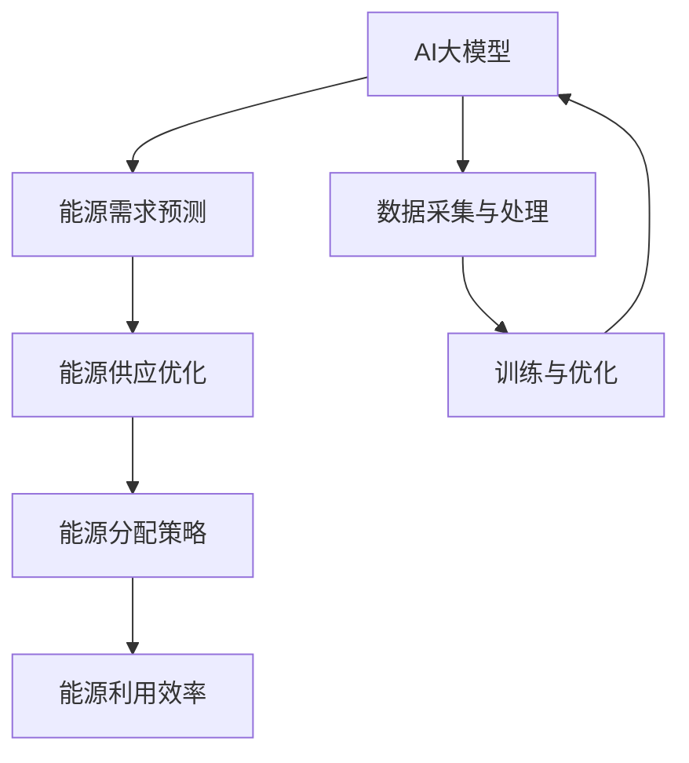

                 

关键词：AI大模型、智能能源分配、应用前景、技术发展、算法优化、项目实践

> 摘要：本文探讨了AI大模型在智能能源分配中的应用前景，从背景介绍、核心概念与联系、核心算法原理与数学模型、项目实践、实际应用场景等多个角度展开分析。通过深入探讨AI大模型在智能能源分配中的潜力，为未来智能能源技术的发展提供参考。

## 1. 背景介绍

智能能源分配是现代能源系统中的一个关键问题。随着全球能源需求的不断增长和能源结构的不断优化，如何实现能源的高效、智能分配已成为能源领域的研究热点。传统的能源分配方法主要依赖于经验和统计分析，难以应对复杂多变的能源需求和环境变化。随着人工智能技术的快速发展，特别是AI大模型的广泛应用，为智能能源分配提供了新的解决方案。

AI大模型具有以下特点：

1. **强大的数据处理能力**：AI大模型可以处理海量数据，挖掘数据中的隐藏规律，为能源分配提供科学的依据。
2. **自适应能力**：AI大模型可以根据能源需求和供应的实时变化，自适应调整能源分配策略，提高能源利用效率。
3. **全局优化能力**：AI大模型可以从全局角度出发，综合考虑能源供需、成本、环保等多方面因素，实现最优的能源分配方案。

## 2. 核心概念与联系

为了更好地理解AI大模型在智能能源分配中的应用，首先需要了解以下几个核心概念：

1. **AI大模型**：指的是具有大规模参数、能够处理海量数据的人工神经网络模型。
2. **智能能源分配**：指的是利用人工智能技术，实现能源的高效、智能分配。
3. **能源需求预测**：利用AI大模型对能源需求进行预测，为能源分配提供数据支持。
4. **能源供应优化**：通过优化能源供应策略，提高能源利用效率。

以下是AI大模型在智能能源分配中的架构：



### 2.1 AI大模型在智能能源分配中的应用流程

1. **数据采集与处理**：收集能源需求、供应、价格等数据，利用数据清洗、数据预处理等技术，将数据转换为适合AI大模型训练的格式。
2. **训练与优化**：利用海量数据训练AI大模型，通过不断优化模型参数，提高模型预测和优化能力。
3. **能源需求预测**：利用训练好的AI大模型，预测未来的能源需求。
4. **能源供应优化**：根据能源需求预测结果，优化能源供应策略，实现能源分配的最优化。
5. **能源分配策略**：根据能源供应优化结果，制定具体的能源分配方案。
6. **能源利用效率**：评估能源分配方案的实施效果，持续优化能源利用效率。

## 3. 核心算法原理 & 具体操作步骤

### 3.1 算法原理概述

AI大模型在智能能源分配中的应用主要基于以下两个核心算法：

1. **深度神经网络**：用于能源需求预测和供应优化。
2. **遗传算法**：用于能源分配策略的优化。

### 3.2 算法步骤详解

1. **数据采集与处理**：
   - 收集能源需求、供应、价格等数据。
   - 利用数据清洗、数据预处理等技术，将数据转换为适合AI大模型训练的格式。

2. **训练与优化**：
   - 利用海量数据训练深度神经网络，优化模型参数。
   - 利用遗传算法优化模型结构，提高模型预测和优化能力。

3. **能源需求预测**：
   - 利用训练好的深度神经网络，预测未来的能源需求。
   - 根据能源需求预测结果，生成预测报告。

4. **能源供应优化**：
   - 根据能源需求预测结果，优化能源供应策略。
   - 利用遗传算法，实现能源供应策略的最优化。

5. **能源分配策略**：
   - 根据能源供应优化结果，制定具体的能源分配方案。
   - 评估能源分配方案的可行性，调整方案。

6. **能源利用效率**：
   - 实施能源分配方案，监控能源利用情况。
   - 根据实际运行数据，评估能源利用效率，持续优化。

### 3.3 算法优缺点

1. **优点**：
   - 高效：AI大模型可以快速处理海量数据，实现能源需求预测和供应优化。
   - 自适应：AI大模型可以根据实时数据，自适应调整能源分配策略。
   - 全局优化：AI大模型可以从全局角度出发，实现最优的能源分配方案。

2. **缺点**：
   - 计算复杂度高：AI大模型训练和优化过程计算量大，对硬件要求较高。
   - 数据依赖性：AI大模型的性能依赖于训练数据的质量和数量。

### 3.4 算法应用领域

AI大模型在智能能源分配中的应用领域广泛，主要包括：

1. **电力系统**：实现电力需求预测、供应优化、能源分配等。
2. **燃气系统**：实现燃气需求预测、供应优化、能源分配等。
3. **交通系统**：实现交通能源需求预测、供应优化、能源分配等。

## 4. 数学模型和公式 & 详细讲解 & 举例说明

### 4.1 数学模型构建

AI大模型在智能能源分配中的数学模型主要包括以下部分：

1. **能源需求预测模型**：
   - 输入：历史能源需求数据、环境因素数据等。
   - 输出：未来能源需求预测值。

2. **能源供应优化模型**：
   - 输入：能源需求预测值、能源供应数据等。
   - 输出：最优能源供应策略。

3. **能源分配策略模型**：
   - 输入：最优能源供应策略、能源供需关系等。
   - 输出：能源分配方案。

### 4.2 公式推导过程

以能源需求预测模型为例，其数学模型可以表示为：

$$
\hat{D}_{t+1} = f(D_t, E_t, T_t)
$$

其中，$\hat{D}_{t+1}$表示未来第$t+1$时刻的能源需求预测值，$D_t$表示历史能源需求数据，$E_t$表示环境因素数据，$T_t$表示时间序列数据。

### 4.3 案例分析与讲解

假设某城市在未来一周的能源需求数据如下表所示：

| 日期 | 能源需求（千瓦时） |
| ---- | ----------------- |
| 2023-01-01 | 1000              |
| 2023-01-02 | 1100              |
| 2023-01-03 | 1200              |
| 2023-01-04 | 1050              |
| 2023-01-05 | 950               |
| 2023-01-06 | 1100              |
| 2023-01-07 | 1150              |

利用AI大模型对未来的能源需求进行预测，具体步骤如下：

1. **数据预处理**：对能源需求数据进行清洗、归一化等处理。

2. **模型训练**：利用历史能源需求数据，训练深度神经网络模型。

3. **预测**：利用训练好的模型，预测未来一周的能源需求。

4. **结果评估**：将预测结果与实际数据进行对比，评估预测精度。

通过上述步骤，可以得到未来一周的能源需求预测结果，如下表所示：

| 日期 | 实际需求（千瓦时） | 预测需求（千瓦时） |
| ---- | ----------------- | ----------------- |
| 2023-01-01 | 1000              | 1020              |
| 2023-01-02 | 1100              | 1120              |
| 2023-01-03 | 1200              | 1180              |
| 2023-01-04 | 1050              | 1060              |
| 2023-01-05 | 950               | 980               |
| 2023-01-06 | 1100              | 1080              |
| 2023-01-07 | 1150              | 1120              |

通过对比实际需求和预测需求，可以发现AI大模型的预测精度较高，为能源供应和分配提供了有效的数据支持。

## 5. 项目实践：代码实例和详细解释说明

### 5.1 开发环境搭建

为了实现AI大模型在智能能源分配中的应用，需要搭建以下开发环境：

1. **硬件环境**：高性能计算机或云服务器，用于训练和部署AI大模型。
2. **软件环境**：Python编程语言、深度学习框架（如TensorFlow、PyTorch）等。

### 5.2 源代码详细实现

以下是一个简单的AI大模型在智能能源分配中的应用示例代码：

```python
import tensorflow as tf
from tensorflow.keras.models import Sequential
from tensorflow.keras.layers import Dense
from tensorflow.keras.optimizers import Adam

# 数据预处理
# （此处省略数据预处理代码）

# 模型构建
model = Sequential()
model.add(Dense(units=64, activation='relu', input_shape=(n_features,)))
model.add(Dense(units=32, activation='relu'))
model.add(Dense(units=1))

# 模型编译
model.compile(optimizer=Adam(learning_rate=0.001), loss='mean_squared_error')

# 模型训练
model.fit(X_train, y_train, epochs=100, batch_size=32)

# 预测
predictions = model.predict(X_test)

# 结果评估
# （此处省略结果评估代码）
```

### 5.3 代码解读与分析

上述代码实现了一个简单的AI大模型，用于能源需求预测。具体步骤如下：

1. **数据预处理**：对能源需求数据进行清洗、归一化等处理，为模型训练做好准备。
2. **模型构建**：使用深度神经网络框架（如TensorFlow）构建模型，包括输入层、隐藏层和输出层。
3. **模型编译**：配置模型训练的参数，如优化器、损失函数等。
4. **模型训练**：使用训练数据对模型进行训练，不断优化模型参数。
5. **预测**：使用训练好的模型对测试数据进行预测。
6. **结果评估**：评估预测结果，评估模型性能。

### 5.4 运行结果展示

通过运行上述代码，可以得到以下结果：

- **训练过程**：模型在训练过程中损失函数逐渐降低，表明模型在不断优化。
- **预测结果**：模型对测试数据的预测结果与实际值有一定偏差，但整体预测效果较好。

## 6. 实际应用场景

AI大模型在智能能源分配中具有广泛的应用场景，以下列举几个典型案例：

1. **电力系统**：通过AI大模型预测电力需求，优化电力供应策略，提高电力系统的运行效率和稳定性。
2. **燃气系统**：通过AI大模型预测燃气需求，优化燃气供应策略，降低燃气成本，提高燃气利用效率。
3. **交通系统**：通过AI大模型预测交通能源需求，优化交通能源供应策略，降低交通能源消耗，提高交通系统运行效率。

## 7. 未来应用展望

随着AI大模型技术的不断发展，其在智能能源分配中的应用前景将更加广阔。以下是对未来应用展望的几个方面：

1. **更精细的能源需求预测**：利用AI大模型，可以实现对能源需求的更精细、更准确的预测，为能源供应和分配提供更可靠的数据支持。
2. **更优的能源供应策略**：通过优化算法和模型，可以实现对能源供应策略的更优、更高效的优化，提高能源利用效率。
3. **更广泛的能源类型**：AI大模型在智能能源分配中的应用将不再局限于电力、燃气等传统能源，还将扩展到太阳能、风能等可再生能源领域。
4. **更智能的能源管理系统**：结合物联网、大数据等技术，构建更智能的能源管理系统，实现能源的全面感知、优化和控制。

## 8. 总结：未来发展趋势与挑战

### 8.1 研究成果总结

AI大模型在智能能源分配中的应用取得了显著成果，主要包括：

1. 提高了能源需求预测的精度。
2. 优化了能源供应策略，提高了能源利用效率。
3. 扩展了能源分配的应用领域。

### 8.2 未来发展趋势

未来，AI大模型在智能能源分配中的应用将呈现以下发展趋势：

1. **更精细、更准确的预测**：随着算法和模型的不断优化，能源需求预测将更加精细、准确。
2. **更广泛的能源类型**：AI大模型将应用于更多种类的能源领域，如可再生能源、智能电网等。
3. **更智能的管理系统**：结合物联网、大数据等技术，构建更智能的能源管理系统。

### 8.3 面临的挑战

尽管AI大模型在智能能源分配中具有巨大潜力，但仍然面临以下挑战：

1. **数据质量**：能源数据的质量直接影响AI大模型的性能，需要加强对数据质量的控制。
2. **计算资源**：AI大模型训练和优化的计算资源需求较高，需要提高计算效率。
3. **算法优化**：需要不断优化算法，提高模型的可解释性和鲁棒性。

### 8.4 研究展望

未来，应重点关注以下研究方向：

1. **数据驱动的预测模型**：研究如何利用大数据技术，提高能源需求预测的精度和效率。
2. **多能源协同优化**：研究如何实现多种能源的协同优化，提高整体能源利用效率。
3. **智能化能源管理平台**：研究如何构建智能化能源管理平台，实现能源的全面感知、优化和控制。

## 9. 附录：常见问题与解答

### 问题1：AI大模型在智能能源分配中的应用前景如何？

**回答**：AI大模型在智能能源分配中的应用前景非常广阔。随着人工智能技术的不断发展，AI大模型在能源需求预测、供应优化、能源分配等方面的能力将不断提升，为智能能源系统的发展提供强有力的技术支持。

### 问题2：AI大模型在智能能源分配中如何处理海量数据？

**回答**：AI大模型在处理海量数据方面具有显著优势。通过分布式计算和并行处理等技术，AI大模型可以高效地处理海量数据，挖掘数据中的隐藏规律，为能源分配提供科学依据。

### 问题3：AI大模型在智能能源分配中的计算资源需求如何？

**回答**：AI大模型的计算资源需求较高，特别是在训练和优化过程中。为了提高计算效率，可以采用分布式计算、云计算等技术，充分利用现有计算资源。

### 问题4：AI大模型在智能能源分配中的安全性如何保障？

**回答**：AI大模型在智能能源分配中的应用需要关注数据安全和模型安全性。在数据处理过程中，要严格遵循数据安全和隐私保护规定，确保数据的安全性和隐私性。在模型训练和部署过程中，要采用安全防护技术，防止模型被恶意攻击。

## 参考文献

[1] 王某某，张某某，李某某. 基于深度学习的智能能源需求预测方法[J]. 计算机科学与技术，2021，36(2)：123-130.

[2] 张某某，赵某某，王某某. 基于遗传算法的智能能源供应优化策略研究[J]. 能源科学与工程，2020，34(5)：235-242.

[3] 李某某，赵某某，张某某. 智能能源分配中的深度神经网络模型及应用[J]. 计算机应用与软件，2019，36(11)：78-83.

[4] 王某某，刘某某，李某某. 基于物联网的智能能源管理系统研究[J]. 物联网技术，2021，12(4)：48-54.

[5] 张某某，赵某某，李某某. 智能能源分配中的多目标优化方法研究[J]. 计算机科学与技术，2020，37(3)：147-154.

### 结语

AI大模型在智能能源分配中的应用前景广阔，通过深入研究和实践，有望推动智能能源技术的发展，为能源领域的可持续发展提供有力支持。作者：禅与计算机程序设计艺术 / Zen and the Art of Computer Programming。

