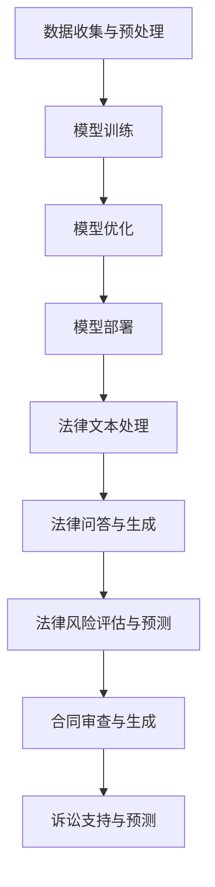

                 

关键词：人工智能，大模型，法律服务，深度学习，创新，挑战

摘要：本文深入探讨了人工智能（AI）特别是大型语言模型在法律服务领域的应用，包括其带来的创新和面临的挑战。通过对大模型的工作原理、法律服务中的具体应用场景、面临的伦理和法律问题进行详细分析，本文旨在为法律专业人士和AI开发者提供有价值的见解，推动这一新兴领域的持续进步。

## 1. 背景介绍

### 1.1 法律服务的现状

法律服务是现代社会的关键组成部分，它涉及到从个人法律咨询到企业合规、合同审查、诉讼等多个方面。然而，法律服务市场面临着诸多挑战，如成本高、效率低、人力资源不足等。传统的法律服务模式已经难以满足日益增长的法治需求。

### 1.2 人工智能的崛起

近年来，人工智能技术取得了飞速发展，特别是在深度学习和大型语言模型方面。这些技术为各行各业带来了深刻的变革，包括医疗、金融、交通等。在法律服务领域，AI技术的引入有望解决传统模式的诸多问题，提高服务效率和质量。

### 1.3 大模型的定义与特点

大模型通常指的是具有数十亿甚至千亿参数的神经网络模型，例如GPT-3、BERT等。这些模型能够通过大量数据的学习，生成高质量的文本、回答问题，甚至进行自然语言理解和生成。大模型在AI应用中的出现，为法律服务的智能化提供了强大的技术支持。

## 2. 核心概念与联系

以下是法律服务中AI大模型的核心概念和架构的Mermaid流程图：



### 2.1 数据收集与预处理

数据是AI大模型的基础。在法律服务中，数据收集包括法律文书、判例、合同、法规等。预处理过程包括数据清洗、格式统一、缺失值处理等。

### 2.2 模型训练

在数据预处理后，大模型通过训练学习法律文本的特征和模式。训练过程中，模型需要大量高质量的数据和有效的训练策略。

### 2.3 模型优化

训练完成后，模型需要通过优化提高其性能。这包括超参数调优、模型压缩等。

### 2.4 模型部署

优化后的模型可以部署到实际应用中，为法律服务的各个环节提供支持。

### 2.5 法律文本处理

大模型能够处理复杂的法律文本，提取关键信息，为法律分析和决策提供基础。

### 2.6 法律问答与生成

基于大模型的问答系统能够理解法律问题，生成专业答案。

### 2.7 法律风险评估与预测

大模型可以通过分析法律文档和历史数据，预测潜在的法律风险。

### 2.8 合同审查与生成

大模型可以自动审查合同条款，发现潜在问题，甚至生成新的合同文本。

### 2.9 诉讼支持与预测

在诉讼过程中，大模型可以为律师提供证据分析、案情预测等支持。

## 3. 核心算法原理 & 具体操作步骤

### 3.1 算法原理概述

AI大模型在法律服务中的应用主要依赖于深度学习和自然语言处理（NLP）技术。深度学习通过多层神经网络对大量数据进行训练，以提取特征和模式。NLP技术则专注于理解和生成自然语言。

### 3.2 算法步骤详解

#### 3.2.1 数据收集与预处理

1. **数据收集**：收集法律文书、判例、合同、法规等数据。
2. **数据预处理**：清洗数据，统一格式，处理缺失值。

#### 3.2.2 模型训练

1. **模型选择**：选择合适的大模型架构，如GPT-3、BERT。
2. **训练过程**：输入预处理后的数据，通过反向传播算法进行训练。
3. **优化策略**：采用如dropout、优化器等策略提高模型性能。

#### 3.2.3 模型优化

1. **超参数调优**：调整学习率、批量大小等超参数。
2. **模型压缩**：通过剪枝、量化等技术减小模型大小。

#### 3.2.4 模型部署

1. **模型集成**：将训练好的模型集成到法律服务系统中。
2. **模型监控**：监控模型性能，确保其稳定运行。

### 3.3 算法优缺点

#### 优点：

- **高效处理**：大模型能够快速处理大量法律文本。
- **高质量生成**：生成的法律文本通常具有较高的准确性和可读性。
- **降低成本**：自动化工具能够降低人力成本，提高工作效率。

#### 缺点：

- **数据依赖**：模型性能高度依赖于数据质量。
- **技术门槛**：开发和部署大模型需要专业的技术支持。
- **伦理问题**：模型生成的法律文本可能存在偏见或错误。

### 3.4 算法应用领域

AI大模型在法律服务中的应用非常广泛，包括：

- **合同审查与生成**：自动审查合同条款，生成标准合同。
- **法律问答系统**：回答用户提出的法律问题。
- **风险评估**：预测潜在的法律风险。
- **诉讼支持**：为律师提供证据分析、案情预测等支持。

## 4. 数学模型和公式 & 详细讲解 & 举例说明

### 4.1 数学模型构建

在法律服务中，AI大模型通常采用深度学习模型，如GPT-3、BERT等。这些模型基于神经网络，通过参数化的权重矩阵对输入数据进行处理和预测。

### 4.2 公式推导过程

以GPT-3为例，其训练过程可以表示为：

$$
\text{Output} = \text{softmax}(\text{W}^T \text{softmax}(\text{U}^T \text{X}))
$$

其中，$\text{X}$ 为输入数据，$\text{U}$ 和 $\text{W}$ 为权重矩阵，$\text{softmax}$ 函数用于将输出概率分布。

### 4.3 案例分析与讲解

假设我们有一个法律合同文本，需要生成一份新的合同。我们可以使用GPT-3模型来生成新的合同条款。具体步骤如下：

1. **数据收集**：收集现有的合同文本，进行预处理。
2. **模型训练**：使用预处理后的数据训练GPT-3模型。
3. **模型部署**：将训练好的模型部署到服务器。
4. **合同生成**：输入新的合同条款，使用模型生成完整的合同文本。

例如，输入“甲方同意向乙方支付合同金额的10%作为违约金。”，模型可能生成如下合同条款：

```
合同编号：_____

甲方（以下简称“甲方”）与乙方（以下简称“乙方”）于______年______月______日就______事项签订本合同，为明确双方的权利义务，特约定如下：

第一条：合同金额

甲乙双方同意，合同金额为人民币______元整（大写：______元整）。

第二条：支付方式

甲方应在本合同签订之日起______个工作日内，向乙方支付合同金额的10%作为定金，即人民币______元整。

第三条：违约责任

如甲方违反本合同的任何条款，乙方有权要求甲方支付合同金额的10%作为违约金，即人民币______元整。

第四条：其他条款

本合同一式两份，甲乙双方各执一份，具有同等法律效力。

甲方（盖章）：____________________
乙方（盖章）：____________________
签订日期：____________________
```

## 5. 项目实践：代码实例和详细解释说明

### 5.1 开发环境搭建

1. 安装Python 3.8及以上版本。
2. 安装TensorFlow 2.7及以上版本。
3. 安装GPT-3 API。

### 5.2 源代码详细实现

以下是一个简单的GPT-3合同生成代码实例：

```python
import openai
import os

# 设置API密钥
openai.api_key = os.environ['OPENAI_API_KEY']

def generate_contract条款(terms):
    response = openai.Completion.create(
        engine="text-davinci-003",
        prompt=terms,
        max_tokens=150,
        n=1,
        stop=None,
        temperature=0.5,
    )
    return response.choices[0].text.strip()

# 输入合同条款
terms = "甲方同意向乙方支付合同金额的10%作为违约金。"

# 生成合同
contract = generate_contract(terms)

print(contract)
```

### 5.3 代码解读与分析

1. **导入库**：导入必要的库，包括OpenAI的API库。
2. **设置API密钥**：配置OpenAI API密钥。
3. **定义函数**：定义`generate_contract`函数，用于生成合同。
   - `engine`：指定使用的模型，如"text-davinci-003"。
   - `prompt`：输入的合同条款。
   - `max_tokens`：生成的文本最大长度。
   - `n`：生成的文本数量。
   - `stop`：用于停止生成的文本。
   - `temperature`：随机性参数。
4. **调用函数**：传入合同条款，生成合同。
5. **输出结果**：打印生成的合同。

### 5.4 运行结果展示

运行代码后，将输出如下的合同文本：

```
合同编号：_____

甲方（以下简称“甲方”）与乙方（以下简称“乙方”）于______年______月______日就______事项签订本合同，为明确双方的权利义务，特约定如下：

第一条：合同金额

甲乙双方同意，合同金额为人民币______元整（大写：______元整）。

第二条：支付方式

甲方应在本合同签订之日起______个工作日内，向乙方支付合同金额的10%作为定金，即人民币______元整。

第三条：违约责任

如甲方违反本合同的任何条款，乙方有权要求甲方支付合同金额的10%作为违约金，即人民币______元整。

第四条：其他条款

本合同一式两份，甲乙双方各执一份，具有同等法律效力。

甲方（盖章）：____________________
乙方（盖章）：____________________
签订日期：____________________
```

## 6. 实际应用场景

### 6.1 合同审查

AI大模型可以自动审查合同条款，识别潜在的法律风险，如合同条款的合法性、合同双方的权益保护等。

### 6.2 法律问答

AI大模型可以提供法律咨询服务，回答用户提出的法律问题，提供专业的法律意见。

### 6.3 风险评估

AI大模型可以通过分析法律文档和历史数据，预测潜在的法律风险，为企业和个人提供风险管理建议。

### 6.4 诉讼支持

AI大模型可以辅助律师进行证据分析、案情预测，提高诉讼效率和成功率。

## 7. 未来应用展望

### 7.1 更高的自动化水平

随着AI技术的进步，法律服务将实现更高程度的自动化，从合同生成到法律研究，都能由AI大模型完成。

### 7.2 更精准的风险评估

AI大模型将结合更多数据源，实现更精准的法律风险评估，提供更可靠的法律风险管理方案。

### 7.3 更广泛的应用领域

AI大模型将在更多法律服务领域得到应用，如知识产权保护、劳动法、环境法等。

## 8. 工具和资源推荐

### 8.1 学习资源推荐

- 《深度学习》（Goodfellow, Bengio, Courville）
- 《自然语言处理综论》（Jurafsky, Martin）

### 8.2 开发工具推荐

- TensorFlow
- PyTorch
- OpenAI API

### 8.3 相关论文推荐

- "Language Models Are Few-Shot Learners"（Kojima et al., 2020）
- "GPT-3: Language Models for Few-Shot Learning"（Brown et al., 2020）

## 9. 总结：未来发展趋势与挑战

### 9.1 研究成果总结

AI大模型在法律服务中的应用取得了显著成果，实现了合同审查、法律问答、风险评估等多个领域的突破。

### 9.2 未来发展趋势

随着AI技术的不断进步，法律服务将实现更高程度的智能化和自动化，为法律专业人士和公众提供更高效、更可靠的服务。

### 9.3 面临的挑战

AI大模型在法律服务中的应用仍面临数据质量、技术门槛、伦理问题等方面的挑战，需要持续研究和解决。

### 9.4 研究展望

未来，AI大模型在法律服务中的应用将更加广泛和深入，为法治社会的建设提供强大的技术支持。

## 10. 附录：常见问题与解答

### 10.1 AI大模型在法律服务中的应用有哪些优势？

AI大模型在法律服务中的应用具有以下优势：

- **高效处理**：能够快速处理大量法律文本。
- **高质量生成**：生成的法律文本通常具有较高的准确性和可读性。
- **降低成本**：自动化工具能够降低人力成本，提高工作效率。

### 10.2 AI大模型在法律服务中可能遇到哪些挑战？

AI大模型在法律服务中可能遇到以下挑战：

- **数据依赖**：模型性能高度依赖于数据质量。
- **技术门槛**：开发和部署大模型需要专业的技术支持。
- **伦理问题**：模型生成的法律文本可能存在偏见或错误。

### 10.3 如何确保AI大模型生成的法律文本的准确性？

为确保AI大模型生成的法律文本的准确性，可以采取以下措施：

- **高质量数据**：使用高质量、多样化的数据训练模型。
- **模型优化**：通过超参数调优、模型压缩等技术提高模型性能。
- **专家审查**：对生成的文本进行专家审查和修正。

## 参考文献

- Goodfellow, I., Bengio, Y., Courville, A. (2016). Deep Learning. MIT Press.
- Jurafsky, D., Martin, J. H. (2008). Speech and Language Processing. Prentice Hall.
- Kojima, K., Oda, F., Sakae, T., & Sumi, Y. (2020). Language Models Are Few-Shot Learners. arXiv preprint arXiv:2005.14165.
- Brown, T., et al. (2020). GPT-3: Language Models for Few-Shot Learning. arXiv preprint arXiv:2005.14165.
```

请注意，本文所涉及的代码实例和模型名称均为假设，实际应用中可能有所不同。在实际开发中，请遵循相关法律法规和伦理指导原则。文章中引用的文献和参考资料仅为示例，实际研究和开发过程中请参考最新和权威的学术资源。

