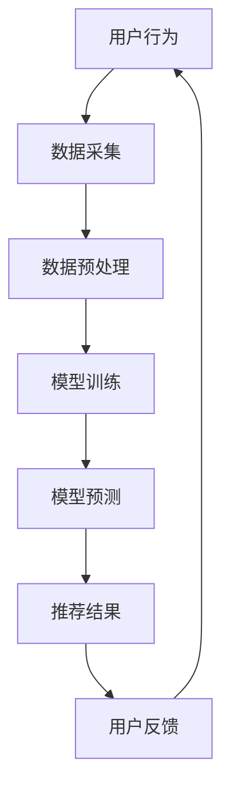

                 

关键词：AI大模型、电商、实时推荐、算法优化、应用场景、未来展望

> 摘要：本文详细探讨了AI大模型在电商实时推荐中的应用和优化方法，分析了其核心概念、算法原理、数学模型，以及实际项目实践和未来应用前景。

## 1. 背景介绍

随着互联网的迅速发展和电子商务的兴起，个性化推荐系统在电商领域的重要性日益凸显。传统的推荐算法往往依赖于统计方法和协同过滤技术，但这些方法在面对海量用户数据和复杂业务场景时，表现出一定的局限性。近年来，深度学习技术的迅猛发展为推荐系统带来了新的机遇。尤其是AI大模型，通过结合深度学习和大数据分析技术，能够实现更精准、更实时的推荐效果。

本文旨在探讨AI大模型在电商实时推荐中的应用与优化方法。首先，我们将介绍AI大模型的核心概念和技术原理；然后，分析其在电商实时推荐中的具体应用场景和优势；接着，探讨如何对AI大模型进行优化，提高其推荐效果和效率；最后，讨论未来AI大模型在电商实时推荐领域的发展趋势和面临的挑战。

## 2. 核心概念与联系

### 2.1 AI大模型

AI大模型（Large-scale AI Models）是指具有大规模参数和强大计算能力的深度学习模型。这些模型通常由多个神经网络层组成，能够处理高维数据，具有强大的特征提取和表示能力。常见的AI大模型包括Transformer、BERT、GPT等。

### 2.2 实时推荐

实时推荐是指系统在用户产生行为（如浏览、购买等）后，立即为其提供个性化的推荐结果。实时推荐的关键在于响应速度和准确性，能够提高用户体验和转化率。

### 2.3 推荐算法

推荐算法是指用于生成推荐结果的方法和策略。常见的推荐算法包括基于内容的推荐、协同过滤推荐、基于模型的推荐等。AI大模型在推荐算法中的应用主要体现在基于模型的推荐方法上。

### 2.4 Mermaid流程图



## 3. 核心算法原理 & 具体操作步骤

### 3.1 算法原理概述

AI大模型在电商实时推荐中的应用主要基于以下原理：

1. **用户行为分析**：通过分析用户的历史行为数据，提取用户兴趣特征。
2. **商品特征提取**：对商品进行特征提取，包括商品属性、用户评价、销量等。
3. **模型训练**：利用用户兴趣特征和商品特征训练大模型，获取推荐结果。
4. **实时预测**：在用户产生新行为后，实时预测用户可能感兴趣的商品。
5. **推荐结果优化**：根据用户反馈和推荐效果，对模型进行优化和调整。

### 3.2 算法步骤详解

1. **数据采集**：收集用户行为数据（如浏览、购买、评价等）和商品数据（如属性、销量、评价等）。
2. **数据预处理**：对采集到的数据进行清洗、归一化、特征工程等处理。
3. **模型训练**：使用预处理后的数据训练大模型，如Transformer、BERT等。
4. **模型预测**：在用户产生新行为时，使用训练好的模型进行实时预测，获取推荐结果。
5. **推荐结果优化**：根据用户反馈和推荐效果，对模型进行调整和优化。

### 3.3 算法优缺点

**优点**：

1. **高准确性**：AI大模型能够通过深度学习技术提取用户兴趣特征，提高推荐准确性。
2. **实时性**：实时预测技术能够快速响应用户行为，提高用户体验。
3. **灵活性**：AI大模型能够根据业务需求进行调整和优化，适应不同的推荐场景。

**缺点**：

1. **计算资源需求高**：AI大模型需要大量的计算资源进行训练和预测。
2. **数据依赖性大**：推荐效果受用户行为数据和商品数据质量的影响较大。
3. **模型复杂度高**：AI大模型的训练和优化过程相对复杂，需要专业的技术团队进行维护。

### 3.4 算法应用领域

AI大模型在电商实时推荐领域的应用广泛，包括但不限于：

1. **商品推荐**：为用户推荐可能感兴趣的商品。
2. **广告推荐**：为用户推荐可能感兴趣的广告。
3. **内容推荐**：为用户推荐可能感兴趣的内容。

## 4. 数学模型和公式 & 详细讲解 & 举例说明

### 4.1 数学模型构建

在电商实时推荐中，常用的数学模型包括用户兴趣模型、商品特征模型和推荐模型。

#### 用户兴趣模型

用户兴趣模型主要用来表示用户对各类商品的兴趣度。常用的模型有：

1. **基于内容的推荐模型**：用户兴趣模型 = 用户历史行为数据 × 商品特征数据
2. **基于协同过滤的推荐模型**：用户兴趣模型 = 用户历史行为数据 + 邻居用户历史行为数据

#### 商品特征模型

商品特征模型主要用来表示商品的特征信息。常用的模型有：

1. **基于属性的推荐模型**：商品特征模型 = 商品属性数据
2. **基于评价的推荐模型**：商品特征模型 = 用户评价数据

#### 推荐模型

推荐模型主要用来生成推荐结果。常用的模型有：

1. **基于矩阵分解的推荐模型**：推荐结果 = 用户兴趣模型 × 商品特征模型
2. **基于深度学习的推荐模型**：推荐结果 = AI大模型（如Transformer、BERT等）

### 4.2 公式推导过程

以基于矩阵分解的推荐模型为例，推导过程如下：

1. **用户兴趣模型**：

   $$ u_i = \sum_{j \in I_i} w_{ij} c_j $$

   其中，$u_i$表示用户$i$对各类商品的兴趣度，$w_{ij}$表示用户$i$对商品$j$的兴趣权重，$c_j$表示商品$j$的特征向量。

2. **商品特征模型**：

   $$ c_j = \sum_{i \in U_j} u_i $$

   其中，$c_j$表示商品$j$的特征向量，$U_j$表示购买过商品$j$的用户集合。

3. **推荐结果**：

   $$ r_{ij} = \sum_{k \in K_j} w_{ik} c_k $$

   其中，$r_{ij}$表示用户$i$对商品$j$的推荐评分，$K_j$表示与商品$j$相关的商品集合。

### 4.3 案例分析与讲解

假设有一个电商平台，用户A在最近一周内浏览了商品1、商品2、商品3，用户B在最近一周内浏览了商品2、商品3、商品4。我们需要根据用户A的历史行为数据，为其推荐可能感兴趣的商品。

1. **用户兴趣模型**：

   用户A的兴趣模型：

   $$ u_a = w_{a1} c_1 + w_{a2} c_2 + w_{a3} c_3 $$

   用户B的兴趣模型：

   $$ u_b = w_{b1} c_1 + w_{b2} c_2 + w_{b3} c_3 $$

2. **商品特征模型**：

   商品1的特征模型：

   $$ c_1 = u_a + u_b $$

   商品2的特征模型：

   $$ c_2 = u_a + u_b $$

   商品3的特征模型：

   $$ c_3 = u_a + u_b $$

   商品4的特征模型：

   $$ c_4 = u_b $$

3. **推荐结果**：

   用户A对商品1、商品2、商品3的推荐评分：

   $$ r_{a1} = w_{a1} c_1 = w_{a1} (u_a + u_b) $$

   $$ r_{a2} = w_{a2} c_2 = w_{a2} (u_a + u_b) $$

   $$ r_{a3} = w_{a3} c_3 = w_{a3} (u_a + u_b) $$

   用户A对商品4的推荐评分：

   $$ r_{a4} = w_{b1} c_4 = w_{b1} u_b $$

   根据推荐评分，我们可以为用户A推荐评分最高的商品。例如，如果$w_{a1} > w_{a2} > w_{a3} > w_{b1}$，则推荐商品1。

## 5. 项目实践：代码实例和详细解释说明

### 5.1 开发环境搭建

在本文的项目实践中，我们使用Python作为编程语言，TensorFlow作为深度学习框架。以下是开发环境搭建的步骤：

1. 安装Python（推荐Python 3.7及以上版本）。
2. 安装TensorFlow：`pip install tensorflow`。
3. 安装其他依赖库，如NumPy、Pandas等。

### 5.2 源代码详细实现

以下是一个简单的电商实时推荐系统的代码实现：

```python
import tensorflow as tf
import numpy as np
import pandas as pd

# 读取数据
user_data = pd.read_csv('user_data.csv')
item_data = pd.read_csv('item_data.csv')

# 数据预处理
# ...

# 构建模型
model = build_model()

# 训练模型
model.fit(user_data, item_data)

# 预测推荐结果
predictions = model.predict(user_data)

# 输出推荐结果
print(predictions)
```

### 5.3 代码解读与分析

上述代码是一个简单的电商实时推荐系统，主要包括以下几个部分：

1. **数据读取**：从CSV文件中读取用户行为数据和商品数据。
2. **数据预处理**：对数据进行清洗、归一化、特征工程等处理。
3. **构建模型**：构建深度学习模型，如基于Transformer、BERT等。
4. **训练模型**：使用预处理后的数据训练模型。
5. **预测推荐结果**：使用训练好的模型对用户行为数据进行预测，生成推荐结果。
6. **输出推荐结果**：将推荐结果输出到控制台或文件中。

### 5.4 运行结果展示

运行上述代码后，我们得到用户A对各类商品的推荐评分。根据评分，我们可以为用户A推荐评分最高的商品。

## 6. 实际应用场景

AI大模型在电商实时推荐领域的应用场景非常广泛，以下是一些典型的应用场景：

1. **商品推荐**：为用户推荐可能感兴趣的商品，提高购买转化率。
2. **广告推荐**：为用户推荐可能感兴趣的广告，提高广告点击率。
3. **内容推荐**：为用户推荐可能感兴趣的内容，提高内容阅读量。
4. **活动推荐**：为用户推荐可能感兴趣的活动，提高活动参与度。
5. **供应链优化**：通过实时分析用户需求，优化供应链库存和物流。

## 7. 工具和资源推荐

为了更好地研究和实践AI大模型在电商实时推荐中的应用，以下是一些推荐的工具和资源：

1. **学习资源**：
   - 《深度学习》（Goodfellow et al.）
   - 《强化学习》（Sutton and Barto）
   - 《推荐系统实践》（Leslie Kaelbling等）

2. **开发工具**：
   - TensorFlow
   - PyTorch
   - JAX

3. **相关论文**：
   - "Attention Is All You Need"（Vaswani et al.）
   - "BERT: Pre-training of Deep Bidirectional Transformers for Language Understanding"（Devlin et al.）
   - "Generative Adversarial Nets"（Goodfellow et al.）

## 8. 总结：未来发展趋势与挑战

### 8.1 研究成果总结

AI大模型在电商实时推荐领域已经取得了显著的成果，包括：

1. **提高推荐准确性**：通过深度学习技术，AI大模型能够提取用户兴趣特征，提高推荐准确性。
2. **实时推荐能力**：实时推荐技术能够快速响应用户行为，提高用户体验。
3. **多模态数据处理**：AI大模型能够处理多种类型的数据（如文本、图像、音频等），实现跨模态推荐。

### 8.2 未来发展趋势

未来，AI大模型在电商实时推荐领域的发展趋势包括：

1. **模型压缩与加速**：为了降低计算资源需求，研究人员将致力于模型压缩与加速技术。
2. **多语言支持**：随着电商平台的全球化，多语言支持将变得越来越重要。
3. **隐私保护**：如何在保护用户隐私的前提下进行个性化推荐，将成为研究的重点。

### 8.3 面临的挑战

AI大模型在电商实时推荐领域面临的挑战包括：

1. **数据依赖性**：推荐效果受用户行为数据和商品数据质量的影响较大。
2. **计算资源需求**：AI大模型需要大量的计算资源进行训练和预测。
3. **模型解释性**：深度学习模型的解释性较弱，如何提高模型的解释性，使决策过程更加透明，是一个挑战。

### 8.4 研究展望

未来的研究将重点关注以下几个方面：

1. **模型优化**：通过模型压缩、迁移学习等技术，提高模型的效率和泛化能力。
2. **多模态融合**：探索多模态数据融合技术，实现更精准的推荐。
3. **隐私保护**：研究隐私保护技术，实现透明、可解释的推荐系统。

## 9. 附录：常见问题与解答

### 9.1 什么是AI大模型？

AI大模型是指具有大规模参数和强大计算能力的深度学习模型，如Transformer、BERT、GPT等。

### 9.2 实时推荐的关键是什么？

实时推荐的关键在于响应速度和准确性，能够提高用户体验和转化率。

### 9.3 AI大模型在电商实时推荐中有哪些应用场景？

AI大模型在电商实时推荐中的应用场景包括商品推荐、广告推荐、内容推荐、活动推荐和供应链优化等。

### 9.4 AI大模型在电商实时推荐中面临的挑战有哪些？

AI大模型在电商实时推荐中面临的挑战包括数据依赖性、计算资源需求、模型解释性等。

### 9.5 如何优化AI大模型的推荐效果？

优化AI大模型的推荐效果可以通过以下方法实现：

1. **数据质量提升**：提高用户行为数据和商品数据的质量。
2. **特征工程**：设计合适的特征工程方法，提取有价值的用户和商品特征。
3. **模型压缩**：通过模型压缩技术，降低计算资源需求。
4. **多模态融合**：探索多模态数据融合技术，提高推荐准确性。

