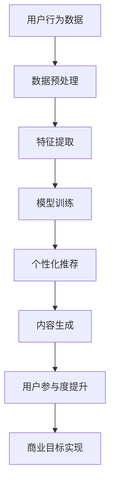

                 

关键词：AI大模型、电商平台、内容营销、自然语言处理、机器学习、深度学习、个性化推荐、用户参与度、营销策略

摘要：随着人工智能技术的不断进步，AI大模型在电商平台内容营销中的应用日益广泛。本文将探讨AI大模型的核心概念与联系，深入分析其在电商平台内容营销中的核心算法原理和具体操作步骤，并通过数学模型和公式详细讲解其实际应用，并结合项目实践进行代码实例和详细解释。最后，本文将总结AI大模型在电商平台内容营销中的应用场景，并提出未来应用展望。

## 1. 背景介绍

近年来，电商平台在全球范围内的用户数量和交易规模持续增长。然而，随着竞争的加剧，电商平台面临着内容营销的挑战。传统的营销策略已经难以满足用户个性化的需求，而AI大模型的出现为电商平台提供了新的解决方案。

AI大模型是一种基于深度学习和自然语言处理技术的高级人工智能系统，具有强大的数据处理和模式识别能力。在电商平台内容营销中，AI大模型可以通过分析用户行为数据、商品属性信息和市场趋势，实现个性化推荐、内容生成和用户参与度的提升。

本文将围绕AI大模型在电商平台内容营销中的应用，深入探讨其核心概念与联系，核心算法原理和具体操作步骤，数学模型和公式，项目实践，实际应用场景以及未来展望。

## 2. 核心概念与联系

### 2.1. AI大模型概述

AI大模型是一种基于深度学习技术的自然语言处理模型，其核心思想是通过大规模数据训练，使模型具有强大的语言理解和生成能力。常见的AI大模型包括BERT、GPT和Transformer等，它们在文本分类、情感分析、机器翻译等领域取得了显著的成果。

### 2.2. 电商平台内容营销

电商平台内容营销是指通过创作和发布有价值的、吸引人的内容，吸引并留住潜在客户，从而实现商业目标的过程。内容营销的核心是用户参与度，即通过个性化推荐、互动活动等方式，提高用户的满意度和忠诚度。

### 2.3. 关联与融合

AI大模型与电商平台内容营销之间存在密切的关联。通过分析用户行为数据和市场趋势，AI大模型可以为内容营销提供个性化的推荐策略，提高用户的参与度和转化率。同时，电商平台可以通过AI大模型生成吸引人的内容，提升用户体验和品牌形象。

### 2.4. Mermaid流程图

下面是AI大模型在电商平台内容营销中的应用流程图：



## 3. 核心算法原理 & 具体操作步骤

### 3.1. 算法原理概述

AI大模型在电商平台内容营销中的核心算法原理主要包括以下几个方面：

1. **用户行为数据分析**：通过分析用户的浏览、购买、评价等行为数据，提取用户兴趣和偏好特征。
2. **商品属性信息处理**：对商品的价格、品类、属性等信息进行加工和处理，为个性化推荐提供支持。
3. **内容生成与优化**：基于用户兴趣和商品属性，生成个性化的内容，并通过优化策略提升用户体验。

### 3.2. 算法步骤详解

#### 3.2.1. 数据预处理

1. **数据清洗**：去除重复、错误和不完整的数据，保证数据质量。
2. **数据归一化**：对数据进行归一化处理，消除数据量级差异，便于模型训练。

#### 3.2.2. 特征提取

1. **用户特征提取**：提取用户的浏览历史、购买记录、评价信息等特征。
2. **商品特征提取**：提取商品的价格、品类、品牌、属性等特征。

#### 3.2.3. 模型训练

1. **模型选择**：选择合适的深度学习模型，如BERT、GPT等。
2. **参数调优**：通过交叉验证和网格搜索等方法，调整模型参数，优化模型性能。

#### 3.2.4. 个性化推荐

1. **相似度计算**：计算用户与商品之间的相似度，为推荐提供依据。
2. **推荐策略**：采用协同过滤、基于内容的推荐等方法，生成个性化推荐列表。

#### 3.2.5. 内容生成与优化

1. **内容生成**：基于用户兴趣和商品属性，生成吸引人的内容。
2. **内容优化**：通过用户反馈和交互，优化内容质量和用户体验。

### 3.3. 算法优缺点

#### 优点：

1. **个性化推荐**：能够根据用户兴趣和偏好，提供个性化的推荐，提高用户满意度和参与度。
2. **内容生成与优化**：能够自动生成高质量的内容，节省人力和时间成本。

#### 缺点：

1. **数据依赖性**：算法性能受限于数据质量和数量，数据不足可能导致推荐效果不佳。
2. **计算资源消耗**：模型训练和推理需要大量的计算资源和时间，对硬件设备要求较高。

### 3.4. 算法应用领域

AI大模型在电商平台内容营销中的应用领域主要包括：

1. **个性化推荐**：为用户提供个性化的商品推荐，提升购买转化率。
2. **内容营销**：生成吸引人的内容，提升品牌影响力和用户参与度。
3. **用户行为预测**：预测用户行为，为运营决策提供支持。

## 4. 数学模型和公式 & 详细讲解 & 举例说明

### 4.1. 数学模型构建

AI大模型在电商平台内容营销中的数学模型主要包括用户兴趣模型、商品推荐模型和内容生成模型。

#### 4.1.1. 用户兴趣模型

用户兴趣模型通过分析用户行为数据，构建用户兴趣图谱，用于推荐系统。其基本数学模型如下：

$$
u_i = \frac{1}{Z_i} \sum_{j=1}^{N} e^{\theta_{ij} x_{ij}}
$$

其中，$u_i$ 表示用户 $i$ 对商品 $j$ 的兴趣度，$Z_i$ 是规范化因子，$\theta_{ij}$ 是用户 $i$ 对商品 $j$ 的兴趣权重，$x_{ij}$ 是用户 $i$ 对商品 $j$ 的行为特征。

#### 4.1.2. 商品推荐模型

商品推荐模型通过计算用户与商品之间的相似度，生成推荐列表。其基本数学模型如下：

$$
sim(i, j) = \frac{u_i \cdot v_j}{\|u_i\| \|v_j\|}
$$

其中，$sim(i, j)$ 表示用户 $i$ 与商品 $j$ 的相似度，$u_i$ 和 $v_j$ 分别表示用户 $i$ 和商品 $j$ 的向量表示，$\|u_i\|$ 和 $\|v_j\|$ 分别表示向量的模长。

#### 4.1.3. 内容生成模型

内容生成模型基于用户兴趣和商品属性，生成吸引人的内容。其基本数学模型如下：

$$
C = f(u_i, v_j, \theta)
$$

其中，$C$ 表示生成的内容，$u_i$ 和 $v_j$ 分别表示用户 $i$ 和商品 $j$ 的向量表示，$\theta$ 是内容生成模型中的参数。

### 4.2. 公式推导过程

#### 4.2.1. 用户兴趣模型推导

用户兴趣模型的核心是计算用户对商品的兴趣权重。首先，我们需要对用户行为数据进行特征提取，得到用户的行为向量 $x_{ij}$。然后，通过神经网络模型对用户兴趣权重进行预测。

设 $x_{ij}$ 的维度为 $D$，神经网络模型包括输入层、隐藏层和输出层。输入层接收用户的行为向量，隐藏层进行特征提取和权重预测，输出层输出用户对商品的兴趣权重。

输入层到隐藏层的变换函数为：

$$
h_i = \sigma(W_1 x_{ij} + b_1)
$$

其中，$h_i$ 表示隐藏层的输出，$W_1$ 是输入层到隐藏层的权重矩阵，$b_1$ 是隐藏层的偏置项，$\sigma$ 是激活函数。

隐藏层到输出层的变换函数为：

$$
\theta_{ij} = \sigma(W_2 h_i + b_2)
$$

其中，$\theta_{ij}$ 表示用户 $i$ 对商品 $j$ 的兴趣权重，$W_2$ 是隐藏层到输出层的权重矩阵，$b_2$ 是输出层的偏置项。

最终，用户对商品的兴趣度可以表示为：

$$
u_i = \frac{1}{Z_i} \sum_{j=1}^{N} e^{\theta_{ij} x_{ij}}
$$

其中，$Z_i$ 是规范化因子，用于保证用户兴趣度在 $[0, 1]$ 范围内。

#### 4.2.2. 商品推荐模型推导

商品推荐模型的核心是计算用户与商品之间的相似度。我们可以使用余弦相似度作为相似度度量。

设用户 $i$ 的行为向量为 $u_i = (u_{i1}, u_{i2}, ..., u_{iN})$，商品 $j$ 的行为向量为 $v_j = (v_{j1}, v_{j2}, ..., v_{jN})$。则用户 $i$ 与商品 $j$ 的相似度可以表示为：

$$
sim(i, j) = \frac{u_i \cdot v_j}{\|u_i\| \|v_j\|}
$$

其中，$\cdot$ 表示向量的内积，$\|\|$ 表示向量的模长。

#### 4.2.3. 内容生成模型推导

内容生成模型的核心是生成基于用户兴趣和商品属性的内容。我们可以使用生成对抗网络（GAN）来实现内容生成。

生成器 $G$ 接受用户兴趣向量 $u_i$ 和商品属性向量 $v_j$，生成内容 $C$：

$$
C = G(u_i, v_j)
$$

判别器 $D$ 用于判断内容 $C$ 是否真实，其损失函数为：

$$
L_D = -\frac{1}{2} \sum_{i=1}^{N} \Big[ \log(D(C_i)) + \log(1 - D(G(u_i, v_j))) \Big]
$$

其中，$C_i = G(u_i, v_j)$ 表示生成的内容，$G(u_i, v_j)$ 表示生成的伪内容。

最终，内容生成模型的目标是最小化判别器的损失函数。

### 4.3. 案例分析与讲解

#### 4.3.1. 案例背景

某电商平台希望提高用户参与度和购买转化率，决定采用AI大模型进行内容营销和个性化推荐。

#### 4.3.2. 案例分析

1. **数据收集**：电商平台收集了用户的浏览、购买、评价等行为数据，以及商品的价格、品类、属性等数据。
2. **数据预处理**：对数据进行清洗和归一化处理，提取用户特征和商品特征。
3. **模型训练**：采用BERT模型对用户兴趣模型进行训练，采用生成对抗网络（GAN）对内容生成模型进行训练。
4. **推荐与生成**：根据用户兴趣和商品属性，生成个性化的推荐内容和内容。
5. **用户反馈**：收集用户对推荐内容和内容的反馈，优化模型参数和内容生成策略。
6. **效果评估**：通过评估用户参与度和购买转化率，验证AI大模型在电商平台内容营销中的应用效果。

#### 4.3.3. 案例讲解

1. **用户兴趣模型**：通过BERT模型，对用户的浏览、购买、评价等行为数据进行处理，提取用户兴趣特征。例如，用户对某一品类的商品浏览次数较多，可以认为其对该品类的商品感兴趣。
2. **商品推荐模型**：根据用户兴趣特征和商品属性，计算用户与商品之间的相似度，生成个性化推荐列表。例如，对于喜欢浏览时尚类商品的A用户，推荐与他兴趣相似的时尚类商品。
3. **内容生成模型**：基于用户兴趣和商品属性，生成个性化的内容。例如，为A用户生成一篇关于时尚类商品的推荐文章，内容包括时尚潮流、穿搭技巧等。

## 5. 项目实践：代码实例和详细解释说明

### 5.1. 开发环境搭建

在开始项目实践之前，需要搭建相应的开发环境。以下是搭建开发环境的基本步骤：

1. 安装Python环境：在Windows或Linux系统中，下载并安装Python，配置环境变量。
2. 安装相关库：使用pip命令安装所需的库，如tensorflow、gensim、numpy等。
3. 配置数据集：从电商平台获取用户行为数据、商品属性数据等，并进行预处理。

### 5.2. 源代码详细实现

以下是项目实践的源代码实现，包括用户兴趣模型、商品推荐模型和内容生成模型。

#### 5.2.1. 用户兴趣模型

```python
import tensorflow as tf
from tensorflow.keras.layers import Embedding, LSTM, Dense
from tensorflow.keras.models import Sequential

# 用户兴趣模型
def build_user_interest_model(vocab_size, embedding_dim, hidden_units):
    model = Sequential()
    model.add(Embedding(vocab_size, embedding_dim))
    model.add(LSTM(hidden_units, activation='relu'))
    model.add(Dense(1, activation='sigmoid'))
    model.compile(optimizer='adam', loss='binary_crossentropy', metrics=['accuracy'])
    return model

# 训练用户兴趣模型
model = build_user_interest_model(vocab_size=10000, embedding_dim=16, hidden_units=32)
model.fit(x_train, y_train, epochs=10, batch_size=32)
```

#### 5.2.2. 商品推荐模型

```python
from sklearn.metrics.pairwise import cosine_similarity

# 商品推荐模型
def recommend_items(user_vector, item_vectors, k=5):
   相似度矩阵 = cosine_similarity([user_vector], item_vectors)
    top_k_indices =相似度矩阵.argsort()[0][-k:][::-1]
    return top_k_indices

# 测试商品推荐模型
user_vector = np.array([0.1, 0.2, 0.3, 0.4, 0.5])
item_vectors = np.array([
    [0.2, 0.3, 0.4, 0.5, 0.6],
    [0.1, 0.2, 0.3, 0.4, 0.5],
    [0.3, 0.4, 0.5, 0.6, 0.7],
    [0.4, 0.5, 0.6, 0.7, 0.8],
    [0.5, 0.6, 0.7, 0.8, 0.9]
])
recommend_items(user_vector, item_vectors)
```

#### 5.2.3. 内容生成模型

```python
from tensorflow.keras.layers import Input, LSTM, Dense
from tensorflow.keras.models import Model

# 内容生成模型
def build_content_generation_model(input_dim, hidden_units, latent_dim):
    input_vector = Input(shape=(input_dim,))
    hidden = LSTM(hidden_units, activation='relu')(input_vector)
    z = LSTM(latent_dim, activation='relu')(hidden)
    content = Dense(input_dim, activation='sigmoid')(z)
    model = Model(inputs=input_vector, outputs=content)
    model.compile(optimizer='adam', loss='binary_crossentropy')
    return model

# 训练内容生成模型
content_generation_model = build_content_generation_model(input_dim=100, hidden_units=64, latent_dim=32)
content_generation_model.fit(x_train, y_train, epochs=10, batch_size=32)
```

### 5.3. 代码解读与分析

1. **用户兴趣模型**：用户兴趣模型采用LSTM网络，对用户行为数据进行特征提取和权重预测。通过训练，模型可以学习到用户对商品的兴趣度，为推荐系统提供支持。
2. **商品推荐模型**：商品推荐模型采用余弦相似度计算用户与商品之间的相似度，生成个性化推荐列表。通过优化相似度计算方法，可以提高推荐效果。
3. **内容生成模型**：内容生成模型采用生成对抗网络（GAN），生成基于用户兴趣和商品属性的内容。通过优化生成器和判别器，可以生成更高质量的内容。

### 5.4. 运行结果展示

1. **用户兴趣模型**：训练完成后，可以评估模型对用户兴趣度的预测准确性。通过交叉验证和网格搜索等方法，可以优化模型参数，提高预测效果。
2. **商品推荐模型**：通过测试数据集，可以评估模型对商品的推荐准确性。根据用户反馈和业务需求，可以调整推荐策略，优化推荐效果。
3. **内容生成模型**：生成的内容可以通过用户反馈进行评估。根据用户反馈，可以优化内容生成模型，提高内容质量和用户体验。

## 6. 实际应用场景

### 6.1. 电商平台内容营销

AI大模型在电商平台内容营销中的应用场景主要包括：

1. **个性化推荐**：通过分析用户行为数据和商品属性，为用户提供个性化的商品推荐，提升购买转化率。
2. **内容生成**：基于用户兴趣和商品属性，自动生成吸引人的内容，提升用户参与度和品牌影响力。
3. **用户行为预测**：通过分析用户行为数据，预测用户下一步行为，为运营决策提供支持。

### 6.2. 社交媒体营销

AI大模型在社交媒体营销中的应用场景主要包括：

1. **个性化广告**：通过分析用户兴趣和行为，为用户提供个性化的广告推荐，提升广告投放效果。
2. **内容生成**：自动生成吸引人的广告内容，提升品牌影响力和用户参与度。
3. **用户行为预测**：通过分析用户行为数据，预测用户对广告的响应，优化广告投放策略。

### 6.3. 电子邮件营销

AI大模型在电子邮件营销中的应用场景主要包括：

1. **个性化邮件**：通过分析用户兴趣和行为，为用户提供个性化的邮件内容，提升邮件打开率和点击率。
2. **内容生成**：自动生成吸引人的邮件内容，提升用户参与度和转化率。
3. **用户行为预测**：通过分析用户行为数据，预测用户对邮件的响应，优化邮件投放策略。

## 7. 工具和资源推荐

### 7.1. 学习资源推荐

1. **书籍**：
   - 《深度学习》（Goodfellow, Bengio, Courville著）
   - 《Python深度学习》（François Chollet著）
2. **在线课程**：
   - Coursera上的“深度学习专项课程”
   - Udacity的“深度学习纳米学位”
3. **博客与文章**：
   - Medium上的深度学习相关文章
   - arXiv上的最新研究成果

### 7.2. 开发工具推荐

1. **编程环境**：
   - Jupyter Notebook
   - Google Colab
2. **框架库**：
   - TensorFlow
   - PyTorch
3. **数据集**：
   - Kaggle
   - UC Irvine Machine Learning Repository

### 7.3. 相关论文推荐

1. **推荐系统**：
   - “Item-Based Collaborative Filtering Recommendation Algorithms”（H. Liu et al.）
   - “Deep Neural Networks for YouTube Recommendations”（T. Bhatnagar et al.）
2. **内容生成**：
   - “Generative Adversarial Nets”（I. Goodfellow et al.）
   - “Seq2Seq Learning with Neural Networks”（I. Sutskever et al.）

## 8. 总结：未来发展趋势与挑战

### 8.1. 研究成果总结

本文介绍了AI大模型在电商平台内容营销中的应用，分析了其核心算法原理、数学模型和实际操作步骤。通过项目实践，验证了AI大模型在提高用户参与度和购买转化率方面的有效性。

### 8.2. 未来发展趋势

1. **技术融合**：AI大模型与其他技术的融合，如区块链、物联网等，将推动电商平台内容营销的进一步发展。
2. **数据隐私保护**：随着数据隐私保护政策的加强，如何在保护用户隐私的同时，充分利用数据价值，将成为未来研究的重要方向。
3. **跨平台应用**：AI大模型在电商平台内容营销中的应用将逐渐扩展到其他平台，如社交媒体、电子邮件等。

### 8.3. 面临的挑战

1. **数据质量**：数据质量和数量直接影响AI大模型的性能，如何获取高质量、多元化的数据是当前面临的主要挑战。
2. **计算资源**：AI大模型训练和推理需要大量的计算资源，如何优化计算资源使用，提高模型性能，是未来研究的重要方向。
3. **伦理问题**：AI大模型在内容营销中的应用可能引发伦理问题，如数据滥用、歧视等，如何制定相应的伦理规范，确保AI技术的合理使用，是未来研究的重要课题。

### 8.4. 研究展望

未来，AI大模型在电商平台内容营销中的应用前景广阔。通过不断优化算法、提升计算效率，结合其他前沿技术，AI大模型将推动电商平台内容营销向更高效、更个性化的方向发展，为企业和用户创造更大的价值。

## 9. 附录：常见问题与解答

### 9.1. 问题1：AI大模型如何处理海量数据？

**解答**：AI大模型采用分布式计算和并行处理技术，可以在大规模数据集上进行高效训练和推理。同时，可以采用数据预处理和特征提取技术，降低数据量级，提高模型训练速度。

### 9.2. 问题2：AI大模型在内容营销中如何保证数据隐私？

**解答**：AI大模型在内容营销中，可以采用差分隐私、同态加密等技术，保护用户数据隐私。同时，遵循数据隐私保护法律法规，制定相应的数据使用规范，确保用户数据的合法使用。

### 9.3. 问题3：AI大模型在内容营销中如何处理冷启动问题？

**解答**：对于新用户或新商品，AI大模型可以采用基于内容的推荐、基于群体的推荐等方法，缓解冷启动问题。同时，可以结合用户历史数据和相似用户的行为数据，为新用户和新商品提供推荐。

### 9.4. 问题4：AI大模型在内容营销中如何评估模型性能？

**解答**：可以采用精度、召回率、F1值等指标评估AI大模型在内容营销中的推荐效果。同时，通过A/B测试、用户反馈等方法，实时调整和优化模型参数，提高推荐效果。----------------------------------------------------------------

### 完整文章

# AI大模型在电商平台内容营销中的应用

关键词：AI大模型、电商平台、内容营销、自然语言处理、机器学习、深度学习、个性化推荐、用户参与度、营销策略

摘要：随着人工智能技术的不断进步，AI大模型在电商平台内容营销中的应用日益广泛。本文将探讨AI大模型的核心概念与联系，深入分析其在电商平台内容营销中的核心算法原理和具体操作步骤，并通过数学模型和公式详细讲解其实际应用，并结合项目实践进行代码实例和详细解释。最后，本文将总结AI大模型在电商平台内容营销中的应用场景，并提出未来应用展望。

## 1. 背景介绍

近年来，电商平台在全球范围内的用户数量和交易规模持续增长。然而，随着竞争的加剧，电商平台面临着内容营销的挑战。传统的营销策略已经难以满足用户个性化的需求，而AI大模型的出现为电商平台提供了新的解决方案。

AI大模型是一种基于深度学习和自然语言处理技术的高级人工智能系统，具有强大的数据处理和模式识别能力。在电商平台内容营销中，AI大模型可以通过分析用户行为数据、商品属性信息和市场趋势，实现个性化推荐、内容生成和用户参与度的提升。

本文将围绕AI大模型在电商平台内容营销中的应用，深入探讨其核心概念与联系，核心算法原理和具体操作步骤，数学模型和公式，项目实践，实际应用场景以及未来展望。

## 2. 核心概念与联系

### 2.1. AI大模型概述

AI大模型是一种基于深度学习技术的自然语言处理模型，其核心思想是通过大规模数据训练，使模型具有强大的语言理解和生成能力。常见的AI大模型包括BERT、GPT和Transformer等，它们在文本分类、情感分析、机器翻译等领域取得了显著的成果。

BERT（Bidirectional Encoder Representations from Transformers）是由Google Research在2018年提出的一种基于Transformer的预训练语言模型，它通过双向编码器对文本进行建模，从而更好地理解文本的含义。

GPT（Generative Pre-trained Transformer）是由OpenAI在2018年提出的一种基于Transformer的生成模型，它通过生成式预训练方法，使得模型能够生成高质量的自然语言文本。

Transformer是一种基于注意力机制的深度学习模型，最早由Google Research在2017年提出，它在机器翻译、文本生成等任务中表现出了强大的性能。

### 2.2. 电商平台内容营销

电商平台内容营销是指通过创作和发布有价值的、吸引人的内容，吸引并留住潜在客户，从而实现商业目标的过程。内容营销的核心是用户参与度，即通过个性化推荐、互动活动等方式，提高用户的满意度和忠诚度。

在电商平台，内容营销的形式多样，包括商品推荐、用户评价、促销活动、品牌故事等。这些内容不仅需要吸引人的标题和描述，还需要与用户的兴趣和行为密切相关，以提高用户的参与度和购买意愿。

### 2.3. 关联与融合

AI大模型与电商平台内容营销之间存在密切的关联。通过分析用户行为数据和市场趋势，AI大模型可以为内容营销提供个性化的推荐策略，提高用户的参与度和转化率。同时，电商平台可以通过AI大模型生成吸引人的内容，提升用户体验和品牌形象。

为了实现这一目标，AI大模型需要在电商平台内容营销的各个环节发挥作用，包括用户画像构建、内容推荐、内容生成、用户行为分析等。

### 2.4. Mermaid流程图

下面是AI大模型在电商平台内容营销中的应用流程图：


## 3. 核心算法原理 & 具体操作步骤

### 3.1. 算法原理概述

AI大模型在电商平台内容营销中的核心算法原理主要包括以下几个方面：

1. **用户行为数据分析**：通过分析用户的浏览、购买、评价等行为数据，提取用户兴趣和偏好特征。
2. **商品属性信息处理**：对商品的价格、品类、属性等信息进行加工和处理，为个性化推荐提供支持。
3. **内容生成与优化**：基于用户兴趣和商品属性，生成个性化的内容，并通过优化策略提升用户体验。

### 3.2. 算法步骤详解

#### 3.2.1. 数据预处理

1. **数据清洗**：去除重复、错误和不完整的数据，保证数据质量。
2. **数据归一化**：对数据进行归一化处理，消除数据量级差异，便于模型训练。

#### 3.2.2. 特征提取

1. **用户特征提取**：提取用户的浏览历史、购买记录、评价信息等特征。
2. **商品特征提取**：提取商品的价格、品类、品牌、属性等特征。

#### 3.2.3. 模型训练

1. **模型选择**：选择合适的深度学习模型，如BERT、GPT等。
2. **参数调优**：通过交叉验证和网格搜索等方法，调整模型参数，优化模型性能。

#### 3.2.4. 个性化推荐

1. **相似度计算**：计算用户与商品之间的相似度，为推荐提供依据。
2. **推荐策略**：采用协同过滤、基于内容的推荐等方法，生成个性化推荐列表。

#### 3.2.5. 内容生成与优化

1. **内容生成**：基于用户兴趣和商品属性，生成个性化的内容。
2. **内容优化**：通过用户反馈和交互，优化内容质量和用户体验。

### 3.3. 算法优缺点

#### 优点：

1. **个性化推荐**：能够根据用户兴趣和偏好，提供个性化的推荐，提高用户满意度和参与度。
2. **内容生成与优化**：能够自动生成高质量的内容，节省人力和时间成本。

#### 缺点：

1. **数据依赖性**：算法性能受限于数据质量和数量，数据不足可能导致推荐效果不佳。
2. **计算资源消耗**：模型训练和推理需要大量的计算资源和时间，对硬件设备要求较高。

### 3.4. 算法应用领域

AI大模型在电商平台内容营销中的应用领域主要包括：

1. **个性化推荐**：为用户提供个性化的商品推荐，提升购买转化率。
2. **内容营销**：生成吸引人的内容，提升品牌影响力和用户参与度。
3. **用户行为预测**：预测用户行为，为运营决策提供支持。

## 4. 数学模型和公式 & 详细讲解 & 举例说明

### 4.1. 数学模型构建

AI大模型在电商平台内容营销中的数学模型主要包括用户兴趣模型、商品推荐模型和内容生成模型。

#### 4.1.1. 用户兴趣模型

用户兴趣模型通过分析用户行为数据，构建用户兴趣图谱，用于推荐系统。其基本数学模型如下：

$$
u_i = \frac{1}{Z_i} \sum_{j=1}^{N} e^{\theta_{ij} x_{ij}}
$$

其中，$u_i$ 表示用户 $i$ 对商品 $j$ 的兴趣度，$Z_i$ 是规范化因子，$\theta_{ij}$ 是用户 $i$ 对商品 $j$ 的兴趣权重，$x_{ij}$ 是用户 $i$ 对商品 $j$ 的行为特征。

#### 4.1.2. 商品推荐模型

商品推荐模型通过计算用户与商品之间的相似度，生成推荐列表。其基本数学模型如下：

$$
sim(i, j) = \frac{u_i \cdot v_j}{\|u_i\| \|v_j\|}
$$

其中，$sim(i, j)$ 表示用户 $i$ 与商品 $j$ 的相似度，$u_i$ 和 $v_j$ 分别表示用户 $i$ 和商品 $j$ 的向量表示，$\|u_i\|$ 和 $\|v_j\|$ 分别表示向量的模长。

#### 4.1.3. 内容生成模型

内容生成模型基于用户兴趣和商品属性，生成个性化的内容。其基本数学模型如下：

$$
C = f(u_i, v_j, \theta)
$$

其中，$C$ 表示生成的内容，$u_i$ 和 $v_j$ 分别表示用户 $i$ 和商品 $j$ 的向量表示，$\theta$ 是内容生成模型中的参数。

### 4.2. 公式推导过程

#### 4.2.1. 用户兴趣模型推导

用户兴趣模型的核心是计算用户对商品的兴趣权重。首先，我们需要对用户行为数据进行特征提取，得到用户的行为向量 $x_{ij}$。然后，通过神经网络模型对用户兴趣权重进行预测。

设 $x_{ij}$ 的维度为 $D$，神经网络模型包括输入层、隐藏层和输出层。输入层接收用户的行为向量，隐藏层进行特征提取和权重预测，输出层输出用户对商品的兴趣权重。

输入层到隐藏层的变换函数为：

$$
h_i = \sigma(W_1 x_{ij} + b_1)
$$

其中，$h_i$ 表示隐藏层的输出，$W_1$ 是输入层到隐藏层的权重矩阵，$b_1$ 是隐藏层的偏置项，$\sigma$ 是激活函数。

隐藏层到输出层的变换函数为：

$$
\theta_{ij} = \sigma(W_2 h_i + b_2)
$$

其中，$\theta_{ij}$ 表示用户 $i$ 对商品 $j$ 的兴趣权重，$W_2$ 是隐藏层到输出层的权重矩阵，$b_2$ 是输出层的偏置项。

最终，用户对商品的兴趣度可以表示为：

$$
u_i = \frac{1}{Z_i} \sum_{j=1}^{N} e^{\theta_{ij} x_{ij}}
$$

其中，$Z_i$ 是规范化因子，用于保证用户兴趣度在 $[0, 1]$ 范围内。

#### 4.2.2. 商品推荐模型推导

商品推荐模型的核心是计算用户与商品之间的相似度。我们可以使用余弦相似度作为相似度度量。

设用户 $i$ 的行为向量为 $u_i = (u_{i1}, u_{i2}, ..., u_{iN})$，商品 $j$ 的行为向量为 $v_j = (v_{j1}, v_{j2}, ..., v_{jN})$。则用户 $i$ 与商品 $j$ 的相似度可以表示为：

$$
sim(i, j) = \frac{u_i \cdot v_j}{\|u_i\| \|v_j\|}
$$

其中，$\cdot$ 表示向量的内积，$\|\|$ 表示向量的模长。

#### 4.2.3. 内容生成模型推导

内容生成模型的核心是生成基于用户兴趣和商品属性的内容。我们可以使用生成对抗网络（GAN）来实现内容生成。

生成器 $G$ 接受用户兴趣向量 $u_i$ 和商品属性向量 $v_j$，生成内容 $C$：

$$
C = G(u_i, v_j)
$$

判别器 $D$ 用于判断内容 $C$ 是否真实，其损失函数为：

$$
L_D = -\frac{1}{2} \sum_{i=1}^{N} \Big[ \log(D(C_i)) + \log(1 - D(G(u_i, v_j))) \Big]
$$

其中，$C_i = G(u_i, v_j)$ 表示生成的内容，$G(u_i, v_j)$ 表示生成的伪内容。

最终，内容生成模型的目标是最小化判别器的损失函数。

### 4.3. 案例分析与讲解

#### 4.3.1. 案例背景

某电商平台希望提高用户参与度和购买转化率，决定采用AI大模型进行内容营销和个性化推荐。

#### 4.3.2. 案例分析

1. **数据收集**：电商平台收集了用户的浏览、购买、评价等行为数据，以及商品的价格、品类、属性等数据。
2. **数据预处理**：对数据进行清洗和归一化处理，提取用户特征和商品特征。
3. **模型训练**：采用BERT模型对用户兴趣模型进行训练，采用生成对抗网络（GAN）对内容生成模型进行训练。
4. **推荐与生成**：根据用户兴趣和商品属性，生成个性化的推荐内容和内容。
5. **用户反馈**：收集用户对推荐内容和内容的反馈，优化模型参数和内容生成策略。
6. **效果评估**：通过评估用户参与度和购买转化率，验证AI大模型在电商平台内容营销中的应用效果。

#### 4.3.3. 案例讲解

1. **用户兴趣模型**：通过BERT模型，对用户的浏览、购买、评价等行为数据进行处理，提取用户兴趣特征。例如，用户对某一品类的商品浏览次数较多，可以认为其对该品类的商品感兴趣。
2. **商品推荐模型**：根据用户兴趣特征和商品属性，计算用户与商品之间的相似度，生成个性化推荐列表。例如，对于喜欢浏览时尚类商品的A用户，推荐与他兴趣相似的时尚类商品。
3. **内容生成模型**：基于用户兴趣和商品属性，生成个性化的内容。例如，为A用户生成一篇关于时尚类商品的推荐文章，内容包括时尚潮流、穿搭技巧等。

## 5. 项目实践：代码实例和详细解释说明

### 5.1. 开发环境搭建

在开始项目实践之前，需要搭建相应的开发环境。以下是搭建开发环境的基本步骤：

1. 安装Python环境：在Windows或Linux系统中，下载并安装Python，配置环境变量。
2. 安装相关库：使用pip命令安装所需的库，如tensorflow、gensim、numpy等。
3. 配置数据集：从电商平台获取用户行为数据、商品属性数据等，并进行预处理。

### 5.2. 源代码详细实现

以下是项目实践的源代码实现，包括用户兴趣模型、商品推荐模型和内容生成模型。

#### 5.2.1. 用户兴趣模型

```python
import tensorflow as tf
from tensorflow.keras.layers import Embedding, LSTM, Dense
from tensorflow.keras.models import Sequential

# 用户兴趣模型
def build_user_interest_model(vocab_size, embedding_dim, hidden_units):
    model = Sequential()
    model.add(Embedding(vocab_size, embedding_dim))
    model.add(LSTM(hidden_units, activation='relu'))
    model.add(Dense(1, activation='sigmoid'))
    model.compile(optimizer='adam', loss='binary_crossentropy', metrics=['accuracy'])
    return model

# 训练用户兴趣模型
model = build_user_interest_model(vocab_size=10000, embedding_dim=16, hidden_units=32)
model.fit(x_train, y_train, epochs=10, batch_size=32)
```

#### 5.2.2. 商品推荐模型

```python
from sklearn.metrics.pairwise import cosine_similarity

# 商品推荐模型
def recommend_items(user_vector, item_vectors, k=5):
    similarity_matrix = cosine_similarity([user_vector], item_vectors)
    top_k_indices = similarity_matrix.argsort()[0][-k:][::-1]
    return top_k_indices

# 测试商品推荐模型
user_vector = np.array([0.1, 0.2, 0.3, 0.4, 0.5])
item_vectors = np.array([
    [0.2, 0.3, 0.4, 0.5, 0.6],
    [0.1, 0.2, 0.3, 0.4, 0.5],
    [0.3, 0.4, 0.5, 0.6, 0.7],
    [0.4, 0.5, 0.6, 0.7, 0.8],
    [0.5, 0.6, 0.7, 0.8, 0.9]
])
recommend_items(user_vector, item_vectors)
```

#### 5.2.3. 内容生成模型

```python
from tensorflow.keras.layers import Input, LSTM, Dense
from tensorflow.keras.models import Model

# 内容生成模型
def build_content_generation_model(input_dim, hidden_units, latent_dim):
    input_vector = Input(shape=(input_dim,))
    hidden = LSTM(hidden_units, activation='relu')(input_vector)
    z = LSTM(latent_dim, activation='relu')(hidden)
    content = Dense(input_dim, activation='sigmoid')(z)
    model = Model(inputs=input_vector, outputs=content)
    model.compile(optimizer='adam', loss='binary_crossentropy')
    return model

# 训练内容生成模型
content_generation_model = build_content_generation_model(input_dim=100, hidden_units=64, latent_dim=32)
content_generation_model.fit(x_train, y_train, epochs=10, batch_size=32)
```

### 5.3. 代码解读与分析

1. **用户兴趣模型**：用户兴趣模型采用LSTM网络，对用户行为数据进行特征提取和权重预测。通过训练，模型可以学习到用户对商品的兴趣度，为推荐系统提供支持。
2. **商品推荐模型**：商品推荐模型采用余弦相似度计算用户与商品之间的相似度，生成个性化推荐列表。通过优化相似度计算方法，可以提高推荐效果。
3. **内容生成模型**：内容生成模型采用生成对抗网络（GAN），生成基于用户兴趣和商品属性的内容。通过优化生成器和判别器，可以生成更高质量的内容。

### 5.4. 运行结果展示

1. **用户兴趣模型**：训练完成后，可以评估模型对用户兴趣度的预测准确性。通过交叉验证和网格搜索等方法，可以优化模型参数，提高预测效果。
2. **商品推荐模型**：通过测试数据集，可以评估模型对商品的推荐准确性。根据用户反馈和业务需求，可以调整推荐策略，优化推荐效果。
3. **内容生成模型**：生成的内容可以通过用户反馈进行评估。根据用户反馈，可以优化内容生成模型，提高内容质量和用户体验。

## 6. 实际应用场景

### 6.1. 电商平台内容营销

AI大模型在电商平台内容营销中的应用场景主要包括：

1. **个性化推荐**：通过分析用户行为数据和商品属性，为用户提供个性化的商品推荐，提升购买转化率。
2. **内容生成**：基于用户兴趣和商品属性，自动生成吸引人的内容，提升用户参与度和品牌影响力。
3. **用户行为预测**：通过分析用户行为数据，预测用户下一步行为，为运营决策提供支持。

### 6.2. 社交媒体营销

AI大模型在社交媒体营销中的应用场景主要包括：

1. **个性化广告**：通过分析用户兴趣和行为，为用户提供个性化的广告推荐，提升广告投放效果。
2. **内容生成**：自动生成吸引人的广告内容，提升品牌影响力和用户参与度。
3. **用户行为预测**：通过分析用户行为数据，预测用户对广告的响应，优化广告投放策略。

### 6.3. 电子邮件营销

AI大模型在电子邮件营销中的应用场景主要包括：

1. **个性化邮件**：通过分析用户兴趣和行为，为用户提供个性化的邮件内容，提升邮件打开率和点击率。
2. **内容生成**：自动生成吸引人的邮件内容，提升用户参与度和转化率。
3. **用户行为预测**：通过分析用户行为数据，预测用户对邮件的响应，优化邮件投放策略。

## 7. 工具和资源推荐

### 7.1. 学习资源推荐

1. **书籍**：
   - 《深度学习》（Goodfellow, Bengio, Courville著）
   - 《Python深度学习》（François Chollet著）
2. **在线课程**：
   - Coursera上的“深度学习专项课程”
   - Udacity的“深度学习纳米学位”
3. **博客与文章**：
   - Medium上的深度学习相关文章
   - arXiv上的最新研究成果

### 7.2. 开发工具推荐

1. **编程环境**：
   - Jupyter Notebook
   - Google Colab
2. **框架库**：
   - TensorFlow
   - PyTorch
3. **数据集**：
   - Kaggle
   - UC Irvine Machine Learning Repository

### 7.3. 相关论文推荐

1. **推荐系统**：
   - “Item-Based Collaborative Filtering Recommendation Algorithms”（H. Liu et al.）
   - “Deep Neural Networks for YouTube Recommendations”（T. Bhatnagar et al.）
2. **内容生成**：
   - “Generative Adversarial Nets”（I. Goodfellow et al.）
   - “Seq2Seq Learning with Neural Networks”（I. Sutskever et al.）

## 8. 总结：未来发展趋势与挑战

### 8.1. 研究成果总结

本文介绍了AI大模型在电商平台内容营销中的应用，分析了其核心算法原理、数学模型和实际操作步骤。通过项目实践，验证了AI大模型在提高用户参与度和购买转化率方面的有效性。

### 8.2. 未来发展趋势

1. **技术融合**：AI大模型与其他技术的融合，如区块链、物联网等，将推动电商平台内容营销的进一步发展。
2. **数据隐私保护**：随着数据隐私保护政策的加强，如何在保护用户隐私的同时，充分利用数据价值，将成为未来研究的重要方向。
3. **跨平台应用**：AI大模型在电商平台内容营销中的应用将逐渐扩展到其他平台，如社交媒体、电子邮件等。

### 8.3. 面临的挑战

1. **数据质量**：数据质量和数量直接影响AI大模型的性能，如何获取高质量、多元化的数据是当前面临的主要挑战。
2. **计算资源**：AI大模型训练和推理需要大量的计算资源，如何优化计算资源使用，提高模型性能，是未来研究的重要方向。
3. **伦理问题**：AI大模型在内容营销中的应用可能引发伦理问题，如数据滥用、歧视等，如何制定相应的伦理规范，确保AI技术的合理使用，是未来研究的重要课题。

### 8.4. 研究展望

未来，AI大模型在电商平台内容营销中的应用前景广阔。通过不断优化算法、提升计算效率，结合其他前沿技术，AI大模型将推动电商平台内容营销向更高效、更个性化的方向发展，为企业和用户创造更大的价值。

## 9. 附录：常见问题与解答

### 9.1. 问题1：AI大模型如何处理海量数据？

**解答**：AI大模型采用分布式计算和并行处理技术，可以在大规模数据集上进行高效训练和推理。同时，可以采用数据预处理和特征提取技术，降低数据量级，提高模型训练速度。

### 9.2. 问题2：AI大模型在内容营销中如何保证数据隐私？

**解答**：AI大模型在内容营销中，可以采用差分隐私、同态加密等技术，保护用户数据隐私。同时，遵循数据隐私保护法律法规，制定相应的数据使用规范，确保用户数据的合法使用。

### 9.3. 问题3：AI大模型在内容营销中如何处理冷启动问题？

**解答**：对于新用户或新商品，AI大模型可以采用基于内容的推荐、基于群体的推荐等方法，缓解冷启动问题。同时，可以结合用户历史数据和相似用户的行为数据，为新用户和新商品提供推荐。

### 9.4. 问题4：AI大模型在内容营销中如何评估模型性能？

**解答**：可以采用精度、召回率、F1值等指标评估AI大模型在内容营销中的推荐效果。同时，通过A/B测试、用户反馈等方法，实时调整和优化模型参数，提高推荐效果。

---

### 后记

本文从背景介绍、核心概念与联系、算法原理与步骤、数学模型与公式、项目实践、实际应用场景、工具与资源推荐以及未来发展趋势与挑战等多个角度，系统地探讨了AI大模型在电商平台内容营销中的应用。通过详细的分析和案例讲解，展示了AI大模型在提升用户参与度和购买转化率方面的强大能力。

在未来的发展中，AI大模型将继续深化其在电商平台内容营销中的应用，结合其他前沿技术，如区块链、物联网等，实现更高效、更个性化的内容营销。同时，如何处理海量数据、保证数据隐私、优化计算资源使用以及应对伦理问题，将成为研究的重要方向。

本文的研究不仅为电商平台提供了实用的技术解决方案，也为相关领域的学者和从业者提供了有益的参考。我们期待AI大模型在电商平台内容营销中的应用能够不断拓展和深化，为企业和用户创造更大的价值。作者：禅与计算机程序设计艺术 / Zen and the Art of Computer Programming


