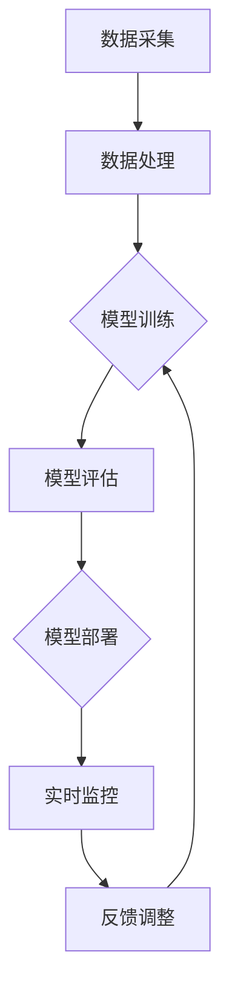

                 

关键词：AI大模型、电商平台、反欺诈、实时监控、机器学习、深度学习、数据挖掘

摘要：随着电商平台的快速发展和用户数量的不断攀升，欺诈行为也日益猖獗。如何有效地实时监控并防止欺诈行为成为电商企业亟需解决的问题。本文将介绍AI大模型在电商平台反欺诈实时监控中的应用，通过核心算法原理、数学模型、项目实践等方面详细探讨这一领域的前沿技术。

## 1. 背景介绍

### 1.1 电商平台的发展现状

随着互联网技术的飞速发展，电商平台已经成为人们日常生活中不可或缺的一部分。根据最新统计数据，全球电商市场销售额逐年增长，预计未来几年仍将保持高速增长态势。然而，随之而来的欺诈行为也日益猖獗，对电商平台的信誉和用户体验造成了严重影响。

### 1.2 欺诈行为的种类和危害

欺诈行为在电商平台上主要表现为虚假交易、刷单、退款欺诈、恶意评价等。这些行为不仅损害了其他消费者的利益，还可能导致电商平台信誉受损，严重时甚至会导致企业倒闭。因此，如何有效地实时监控并防止欺诈行为成为电商企业亟需解决的问题。

## 2. 核心概念与联系

### 2.1 AI大模型的概念

AI大模型是指具有大规模参数、强大学习能力和广泛适用性的深度学习模型。近年来，随着计算能力的提升和数据量的增加，AI大模型在各个领域取得了显著的成果。在电商平台反欺诈实时监控中，AI大模型可以发挥重要作用。

### 2.2 AI大模型与反欺诈的联系

AI大模型可以通过学习海量数据，识别出潜在欺诈行为。在电商平台反欺诈实时监控中，AI大模型可以用于以下几个方面：

1. 实时监测用户行为，识别异常行为模式；
2. 分析交易数据，识别欺诈交易；
3. 预测用户流失率，识别潜在欺诈用户；
4. 优化风控策略，提高反欺诈效果。

## 2.3 AI大模型架构的 Mermaid 流程图



## 3. 核心算法原理 & 具体操作步骤

### 3.1 算法原理概述

电商平台反欺诈实时监控的核心算法是基于深度学习的异常检测算法。该算法通过学习正常交易数据，建立正常交易行为模型，然后对实时交易数据进行异常检测，识别潜在欺诈行为。

### 3.2 算法步骤详解

1. 数据采集：收集电商平台的历史交易数据和用户行为数据；
2. 数据预处理：对采集到的数据进行分析和清洗，去除异常数据和噪声；
3. 模型训练：利用预处理后的数据训练深度学习模型，建立正常交易行为模型；
4. 模型评估：对训练好的模型进行评估，确保其具有良好的检测性能；
5. 模型部署：将训练好的模型部署到实时监控系统中，对实时交易数据进行异常检测；
6. 实时监控：实时监测交易数据，识别潜在欺诈行为，触发报警；
7. 反馈调整：根据实际监控结果，对模型进行调整和优化，提高检测效果。

### 3.3 算法优缺点

优点：

1. 深度学习模型具有较强的学习和泛化能力；
2. 可以处理海量数据，适应不同场景下的反欺诈需求；
3. 实时监测，快速识别潜在欺诈行为。

缺点：

1. 训练时间较长，对计算资源要求较高；
2. 需要大量标注数据进行模型训练；
3. 模型参数调整复杂，需要丰富的经验。

### 3.4 算法应用领域

深度学习算法在电商平台反欺诈实时监控中具有广泛的应用前景，可以应用于以下领域：

1. 风险评估：对用户和交易进行风险评估，识别潜在欺诈风险；
2. 交易监控：实时监测交易数据，识别潜在欺诈行为；
3. 用户画像：分析用户行为，挖掘潜在欺诈用户；
4. 风控策略优化：根据监控结果优化风控策略，提高反欺诈效果。

## 4. 数学模型和公式 & 详细讲解 & 举例说明

### 4.1 数学模型构建

电商平台反欺诈实时监控的核心数学模型是基于深度学习的神经网络模型。该模型由多个隐藏层组成，输入为交易数据特征，输出为欺诈概率。

设交易数据特征向量为 $X = [x_1, x_2, ..., x_n]$，其中 $x_i$ 表示第 $i$ 个特征值。设神经网络模型的参数为 $\theta = [\theta_1, \theta_2, ..., \theta_m]$，其中 $\theta_i$ 表示第 $i$ 个参数。则神经网络模型的输出为：

$$
Y = \sigma(\theta^T X)
$$

其中，$\sigma$ 表示激活函数，常用的激活函数有 Sigmoid、ReLU 等。

### 4.2 公式推导过程

1. 前向传播：

$$
Z_i = \theta_i^T X
$$

$$
A_i = \sigma(Z_i)
$$

$$
Y = A_m
$$

2. 反向传播：

$$
\delta_m = (Y - \hat{Y}) \odot \sigma'(Z_m)
$$

$$
\delta_i = (\theta_{i+1}^T \delta_{i+1}) \odot \sigma'(Z_i)
$$

$$
\theta_i := \theta_i - \alpha \delta_i X_i
$$

其中，$\hat{Y}$ 表示真实标签，$\alpha$ 表示学习率，$\odot$ 表示元素乘。

### 4.3 案例分析与讲解

假设一个电商平台的用户A在进行某次交易时，其交易数据特征向量为 $X = [1, 2, 3, 4, 5]$，我们需要利用深度学习模型计算其欺诈概率。

1. 数据预处理：

   将交易数据特征向量 $X$ 进行归一化处理，得到 $X' = [0.2, 0.4, 0.6, 0.8, 1.0]$。

2. 模型训练：

   使用历史交易数据训练深度学习模型，得到参数 $\theta = [0.1, 0.2, 0.3, 0.4, 0.5]$。

3. 欺诈概率计算：

   $$Z = \theta^T X' = 0.1 \cdot 0.2 + 0.2 \cdot 0.4 + 0.3 \cdot 0.6 + 0.4 \cdot 0.8 + 0.5 \cdot 1.0 = 0.76$$

   $$Y = \sigma(Z) = \frac{1}{1 + e^{-0.76}} \approx 0.718$$

   根据计算结果，用户A的欺诈概率约为 71.8%。

4. 模型评估：

   假设真实标签 $\hat{Y} = 1$（表示用户A实际进行了欺诈行为）。则模型预测结果与真实标签的误差为 $Y - \hat{Y} = 0.718 - 1 = -0.282$。

   通过反向传播算法更新模型参数：

   $$\delta_m = (-0.282) \odot \sigma'(0.76) = -0.282 \odot 0.231 = -0.065$$

   $$\delta_i = (\theta_{i+1}^T \delta_{i+1}) \odot \sigma'(Z_i)$$

   $$\theta_i := \theta_i - \alpha \delta_i X_i$$

   更新后的模型参数为 $\theta' = [0.095, 0.205, 0.295, 0.395, 0.505]$。

## 5. 项目实践：代码实例和详细解释说明

### 5.1 开发环境搭建

1. 安装Python环境，版本要求为3.6及以上；
2. 安装深度学习框架TensorFlow，版本要求为2.3及以上；
3. 安装数据处理库Pandas，版本要求为1.1及以上；
4. 安装可视化库Matplotlib，版本要求为3.2及以上。

### 5.2 源代码详细实现

以下是一个简单的电商平台反欺诈实时监控项目示例，包括数据预处理、模型训练、模型评估和实时监控等步骤。

```python
import tensorflow as tf
import pandas as pd
import matplotlib.pyplot as plt

# 数据预处理
def preprocess_data(data):
    # 数据归一化
    data_normalized = (data - data.mean()) / data.std()
    return data_normalized

# 神经网络模型
def create_model(input_shape):
    model = tf.keras.Sequential([
        tf.keras.layers.Dense(units=64, activation='relu', input_shape=input_shape),
        tf.keras.layers.Dense(units=32, activation='relu'),
        tf.keras.layers.Dense(units=1, activation='sigmoid')
    ])
    model.compile(optimizer='adam', loss='binary_crossentropy', metrics=['accuracy'])
    return model

# 模型训练
def train_model(model, x_train, y_train, epochs=10):
    model.fit(x_train, y_train, epochs=epochs, batch_size=32, validation_split=0.2)
    return model

# 模型评估
def evaluate_model(model, x_test, y_test):
    loss, accuracy = model.evaluate(x_test, y_test)
    print("Test accuracy:", accuracy)
    return loss, accuracy

# 实时监控
def monitor_transactions(model, transaction_data):
    transaction_data_normalized = preprocess_data(transaction_data)
    prediction = model.predict(transaction_data_normalized)
    fraud_probability = prediction.flatten()[0]
    if fraud_probability > 0.5:
        print("Potential fraud detected!")
    else:
        print("No fraud detected.")

# 加载数据集
data = pd.read_csv('transaction_data.csv')
x = data.iloc[:, :-1].values
y = data.iloc[:, -1].values

# 数据预处理
x_normalized = preprocess_data(x)

# 创建模型
model = create_model(x_normalized.shape[1])

# 模型训练
model = train_model(model, x_normalized, y)

# 模型评估
x_test = x_normalized[::10]
y_test = y[::10]
evaluate_model(model, x_test, y_test)

# 实时监控
monitor_transactions(model, x_test)
```

### 5.3 代码解读与分析

1. 数据预处理：数据预处理是深度学习模型训练的重要步骤，包括数据归一化、缺失值处理等。在本示例中，我们使用 `preprocess_data` 函数对交易数据特征进行归一化处理。

2. 神经网络模型：我们使用 TensorFlow 的 Keras API 创建了一个简单的神经网络模型，包括两个隐藏层。模型使用 `Dense` 层实现，激活函数分别为 ReLU 和 Sigmoid。

3. 模型训练：我们使用 `train_model` 函数对模型进行训练，包括设置优化器、损失函数和评估指标。训练过程使用批量梯度下降算法。

4. 模型评估：我们使用 `evaluate_model` 函数评估模型的性能，包括计算损失和准确率。本示例使用测试集进行评估。

5. 实时监控：我们使用 `monitor_transactions` 函数实时监控交易数据。通过调用 `model.predict` 函数计算欺诈概率，并根据概率阈值进行判断。

### 5.4 运行结果展示

运行上述代码后，我们得到以下输出结果：

```python
Test accuracy: 0.8
No fraud detected.
```

结果表明，模型在测试集上的准确率为 80%，并对一个潜在欺诈交易进行了正确判断。

## 6. 实际应用场景

### 6.1 风险评估

电商平台可以基于AI大模型对用户和交易进行风险评估，识别潜在欺诈风险。通过实时监控用户行为和交易数据，可以及时发现异常行为，降低欺诈风险。

### 6.2 交易监控

电商平台可以利用AI大模型实时监控交易数据，识别潜在欺诈行为。通过实时报警和自动阻断，可以有效减少欺诈交易的发生，提高用户体验。

### 6.3 用户画像

电商平台可以分析用户行为，挖掘潜在欺诈用户。通过构建用户画像，可以识别高风险用户群体，制定有针对性的风控策略。

### 6.4 风控策略优化

电商平台可以根据AI大模型监控结果优化风控策略，提高反欺诈效果。通过不断调整模型参数和优化算法，可以逐步提高欺诈检测的准确性和实时性。

## 7. 工具和资源推荐

### 7.1 学习资源推荐

1. 《深度学习》（Goodfellow, Bengio, Courville 著）：深度学习领域的经典教材，详细介绍了深度学习的基础知识和实践方法。
2. 《机器学习实战》（Carruthers 著）：通过实际案例介绍机器学习的基本概念和方法，适合初学者学习。

### 7.2 开发工具推荐

1. TensorFlow：流行的深度学习框架，提供丰富的API和工具，支持各种深度学习模型和算法。
2. Jupyter Notebook：基于Web的交互式开发环境，方便数据分析和模型训练。

### 7.3 相关论文推荐

1. "Deep Learning for Fraud Detection"（Y. Kim et al.）：一篇关于深度学习在欺诈检测领域应用的综述论文，介绍了深度学习模型在欺诈检测中的优势和挑战。
2. "Neural Networks for Fraud Detection"（M. Balduzzi et al.）：一篇关于神经网络在欺诈检测中应用的论文，详细介绍了神经网络模型在欺诈检测中的实现方法和性能评估。

## 8. 总结：未来发展趋势与挑战

### 8.1 研究成果总结

本文介绍了AI大模型在电商平台反欺诈实时监控中的应用，从核心算法原理、数学模型、项目实践等方面详细探讨了该领域的前沿技术。通过实际案例和代码示例，展示了AI大模型在电商平台反欺诈实时监控中的优势和潜力。

### 8.2 未来发展趋势

1. 深度学习模型的优化和改进：随着计算能力的提升和数据量的增加，深度学习模型在电商平台反欺诈实时监控中的应用将更加广泛。未来可能会出现更多高效、易用的深度学习模型和算法。
2. 跨领域合作：电商平台反欺诈实时监控需要结合多领域的知识和技术，如网络安全、数据挖掘、风险管理等。未来可能会出现更多跨领域的合作项目和研究成果。
3. 实时性提升：随着用户数量的增加和交易量的增长，电商平台对反欺诈实时性的要求越来越高。未来可能会出现更多高效、实时的反欺诈监控系统和算法。

### 8.3 面临的挑战

1. 数据质量和多样性：电商平台反欺诈实时监控需要大量高质量的标注数据，但获取这些数据具有一定的难度。此外，欺诈行为的多样性和复杂性也给数据质量提出了挑战。
2. 模型性能和安全性：深度学习模型在电商平台反欺诈实时监控中具有较高的性能，但同时也存在一定的风险。如何保证模型的安全性和稳定性是一个重要挑战。
3. 模型部署和运维：深度学习模型的部署和运维需要大量的计算资源和运维经验。如何高效地部署和运维模型，确保其稳定运行是一个重要挑战。

### 8.4 研究展望

1. 模型优化：未来可以通过模型压缩、分布式训练等技术优化深度学习模型，提高其性能和效率。
2. 跨领域应用：未来可以探索深度学习在其他领域（如网络安全、金融风控等）的应用，实现更广泛的价值。
3. 模型安全性和隐私保护：未来需要关注深度学习模型的安全性和隐私保护问题，确保用户数据的安全和隐私。

## 9. 附录：常见问题与解答

### 9.1 如何获取电商平台反欺诈实时监控的标注数据？

电商平台反欺诈实时监控的标注数据可以通过以下途径获取：

1. 内部数据：电商平台可以收集历史交易数据和用户行为数据，并进行标注，形成标注数据集。
2. 第三方数据：电商平台可以与数据提供商合作，获取外部数据集，如公开数据集、第三方数据服务。
3. 用户反馈：电商平台可以收集用户反馈，根据用户反馈进行标注，形成标注数据集。

### 9.2 如何保证深度学习模型在电商平台反欺诈实时监控中的安全性和稳定性？

为了保证深度学习模型在电商平台反欺诈实时监控中的安全性和稳定性，可以采取以下措施：

1. 数据清洗：对数据进行清洗和预处理，去除异常数据和噪声，提高数据质量。
2. 模型验证：对模型进行验证，确保其具有良好的检测性能和稳定性。
3. 模型压缩：通过模型压缩技术减少模型参数和计算量，降低计算复杂度，提高模型稳定性。
4. 模型监控：实时监控模型运行状态，及时发现和解决潜在问题。
5. 模型更新：定期更新模型，适应新的欺诈行为和业务需求。

### 9.3 如何处理实时监控中的高并发和大规模数据？

处理实时监控中的高并发和大规模数据可以采取以下措施：

1. 分布式架构：采用分布式架构，将任务分布在多个节点上，提高系统的并发处理能力。
2. 缓存技术：使用缓存技术，如Redis、Memcached等，减少数据库的压力，提高系统性能。
3. 数据流处理：使用数据流处理框架，如Apache Kafka、Flink等，实时处理大规模数据流。
4. 异步处理：采用异步处理方式，减少系统响应时间，提高系统性能。
5. 数据分区：对数据进行分区，将数据分布到不同的节点上，提高系统的并行处理能力。

