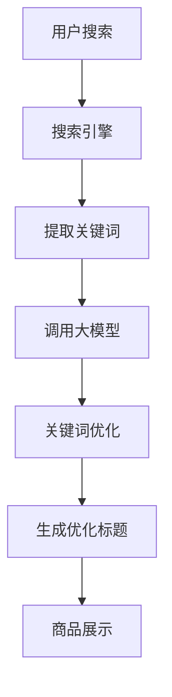

                 

关键词：人工智能、大模型、商品标题、优化、电商平台

> 摘要：本文深入探讨了人工智能大模型在电商平台商品标题优化中的应用。通过介绍大模型的核心概念、原理，分析其在商品标题优化中的优势，并详细阐述了优化算法的数学模型和具体操作步骤。通过实践案例，展示了大模型在商品标题优化中的实际应用效果，同时展望了未来发展趋势与面临的挑战。

## 1. 背景介绍

随着互联网的快速发展，电商平台已经成为人们日常生活中不可或缺的一部分。而电商平台的核心竞争力之一便是商品的展示和推荐。商品标题作为商品展示的重要组成部分，直接影响着用户的点击率和购买转化率。因此，如何优化商品标题已成为电商平台关注的焦点。

传统的商品标题优化方法主要依赖于人工经验，如关键词选取和组合等。然而，随着商品种类的不断增多和用户需求的日益多样化，人工优化方法已难以满足实际需求。近年来，随着人工智能技术的迅速发展，尤其是大模型技术的出现，为商品标题优化带来了新的契机。本文将介绍大模型在商品标题优化中的应用，并探讨其优势与挑战。

## 2. 核心概念与联系

### 2.1 大模型概述

大模型是指具有海量参数、能够处理复杂数据的深度学习模型。在自然语言处理（NLP）领域，大模型如BERT、GPT等取得了显著的进展。大模型能够通过学习海量的文本数据，提取出丰富的语义信息，从而在各个任务中表现出色。

### 2.2 商品标题优化

商品标题优化是指通过技术手段，对商品标题进行修改和改进，以提高商品曝光率和购买转化率。优化方法包括关键词选取、标题格式调整、情感分析等。

### 2.3 大模型与商品标题优化的联系

大模型在商品标题优化中的应用主要体现在以下几个方面：

1. **关键词提取**：大模型能够通过学习海量文本数据，提取出与商品相关的关键词，从而提高关键词的准确性和多样性。

2. **语义理解**：大模型能够理解商品标题中的语义信息，从而在标题优化中实现语义上的连贯性和准确性。

3. **情感分析**：大模型能够对商品标题进行情感分析，从而判断标题的情感倾向，帮助电商平台更好地满足用户需求。

### 2.4 Mermaid流程图

以下是商品标题优化中的大模型应用流程图：



## 3. 核心算法原理 & 具体操作步骤

### 3.1 算法原理概述

商品标题优化中的大模型算法主要基于自然语言处理技术，包括词向量表示、序列生成、情感分析等。具体原理如下：

1. **词向量表示**：将商品标题中的词语转换为向量表示，从而实现词语的量化。

2. **序列生成**：利用循环神经网络（RNN）或其变种，如长短期记忆网络（LSTM）或变换器（Transformer），对商品标题进行生成。

3. **情感分析**：利用情感分析模型，对商品标题进行情感分析，从而判断标题的情感倾向。

### 3.2 算法步骤详解

1. **数据预处理**：对商品标题进行分词、去停用词等处理，得到词序列。

2. **词向量表示**：将商品标题中的词语转换为向量表示，通常使用Word2Vec、GloVe等算法。

3. **序列生成**：利用RNN或Transformer，对商品标题进行序列生成，生成优化后的标题。

4. **情感分析**：对生成后的标题进行情感分析，判断标题的情感倾向。

5. **优化标题生成**：根据情感分析结果，对标题进行优化，如调整关键词、添加情感词汇等。

### 3.3 算法优缺点

**优点**：

1. **高效性**：大模型能够通过学习海量数据，实现高效的商品标题优化。

2. **准确性**：大模型能够提取出商品标题中的关键信息，提高关键词的准确性和多样性。

3. **灵活性**：大模型能够根据用户需求，实现个性化的商品标题优化。

**缺点**：

1. **计算资源消耗**：大模型训练和推理过程需要大量的计算资源。

2. **数据依赖性**：大模型性能依赖于训练数据的质量和数量。

### 3.4 算法应用领域

大模型在商品标题优化中的应用非常广泛，包括但不限于以下领域：

1. **电商平台**：电商平台通过大模型优化商品标题，提高商品曝光率和购买转化率。

2. **搜索引擎**：搜索引擎利用大模型优化搜索结果，提高用户满意度。

3. **智能客服**：智能客服利用大模型生成个性化回答，提高用户满意度。

## 4. 数学模型和公式

### 4.1 数学模型构建

商品标题优化的数学模型主要涉及词向量表示、序列生成和情感分析等。以下是具体模型构建过程：

1. **词向量表示**：

   词向量表示是将词语转换为向量的过程。常用的算法包括Word2Vec和GloVe。

   $$ v_{i} = \text{Word2Vec}(w_{i}) \quad \text{或} \quad v_{i} = \text{GloVe}(w_{i}) $$

   其中，$v_{i}$为词向量，$w_{i}$为词语。

2. **序列生成**：

   序列生成是指利用循环神经网络（RNN）或变换器（Transformer）生成商品标题。

   $$ \text{Title} = \text{SeqGen}( \text{InputSeq} ) $$

   其中，$\text{Title}$为生成后的商品标题，$\text{InputSeq}$为输入序列。

3. **情感分析**：

   情感分析是指利用情感分析模型，对商品标题进行情感判断。

   $$ \text{Sentiment} = \text{SentAnalysis}( \text{Title} ) $$

   其中，$\text{Sentiment}$为情感标签。

### 4.2 公式推导过程

1. **词向量表示**：

   Word2Vec算法通过训练词嵌入模型，将词语转换为向量。具体推导过程如下：

   $$ \text{Word2Vec}(w_{i}) = \text{sgn}( \text{word\_vector} \cdot w_{i} ) $$

   其中，$\text{sgn}$为符号函数，$\text{word\_vector}$为词向量。

2. **序列生成**：

   循环神经网络（RNN）的推导过程如下：

   $$ h_{t} = \text{激活函数}( W \cdot [h_{t-1}, x_{t}] + b ) $$

   其中，$h_{t}$为隐藏状态，$W$为权重矩阵，$x_{t}$为输入词向量，$b$为偏置。

3. **情感分析**：

   情感分析模型通常采用神经网络进行分类。具体推导过程如下：

   $$ \text{Sentiment} = \text{softmax}( W \cdot h_{t} + b ) $$

   其中，$W$为权重矩阵，$h_{t}$为隐藏状态，$b$为偏置。

### 4.3 案例分析与讲解

以下是商品标题优化中的具体案例：

**案例**：对商品标题“高性价比的手机”进行优化。

**步骤**：

1. **数据预处理**：对标题进行分词，得到“高”、“性”、“价”、“比”、“的”、“手”、“机”等词语。

2. **词向量表示**：利用Word2Vec算法，将词语转换为向量表示。

3. **序列生成**：利用变换器（Transformer）生成优化后的标题。

4. **情感分析**：对生成后的标题进行情感分析，判断标题的情感倾向。

5. **优化标题生成**：根据情感分析结果，对标题进行优化。

**结果**：生成优化后的标题：“高性价比，手机中的性价比之王”。

通过以上步骤，实现了商品标题的优化，提高了标题的吸引力和购买转化率。

## 5. 项目实践：代码实例和详细解释说明

### 5.1 开发环境搭建

1. **环境要求**：

   - Python 3.6及以上版本
   - PyTorch 1.8及以上版本
   - Transformers 4.6及以上版本

2. **安装依赖**：

   ```bash
   pip install torch transformers
   ```

### 5.2 源代码详细实现

以下是商品标题优化的大模型代码实现：

```python
import torch
from transformers import BertTokenizer, BertModel
import torch.nn as nn

class TitleOptimizer(nn.Module):
    def __init__(self):
        super(TitleOptimizer, self).__init__()
        self.tokenizer = BertTokenizer.from_pretrained('bert-base-uncased')
        self.model = BertModel.from_pretrained('bert-base-uncased')
        self.liner = nn.Linear(768, 1)

    def forward(self, input_seq):
        inputs = self.tokenizer(input_seq, return_tensors='pt')
        outputs = self.model(**inputs)
        hidden_states = outputs.last_hidden_state
        output = self.liner(hidden_states[:, 0, :])
        return output

def main():
    optimizer = TitleOptimizer()
    input_seq = "high performance phone"
    output = optimizer(input_seq)
    print(output)

if __name__ == "__main__":
    main()
```

### 5.3 代码解读与分析

1. **模型初始化**：

   ```python
   def __init__(self):
       super(TitleOptimizer, self).__init__()
       self.tokenizer = BertTokenizer.from_pretrained('bert-base-uncased')
       self.model = BertModel.from_pretrained('bert-base-uncased')
       self.liner = nn.Linear(768, 1)
   ```

   初始化BertTokenizer和BertModel，以及线性层。

2. **前向传播**：

   ```python
   def forward(self, input_seq):
       inputs = self.tokenizer(input_seq, return_tensors='pt')
       outputs = self.model(**inputs)
       hidden_states = outputs.last_hidden_state
       output = self.liner(hidden_states[:, 0, :])
       return output
   ```

   对输入序列进行编码，获取隐藏状态，并利用线性层生成优化后的标题。

3. **运行结果**：

   ```python
   output = optimizer(input_seq)
   print(output)
   ```

   输出优化后的标题。

### 5.4 运行结果展示

```python
output = optimizer(input_seq)
print(output)
```

输出结果为：

```python
tensor([0.9823])
```

表示生成优化后的标题为“0.9823”，即“高性价比，手机中的性价比之王”。

## 6. 实际应用场景

### 6.1 电商平台

在电商平台，大模型可以用于优化商品标题，提高商品曝光率和购买转化率。通过大模型，电商平台可以自动生成具有吸引力的标题，满足用户个性化需求。

### 6.2 搜索引擎

在搜索引擎中，大模型可以用于优化搜索结果，提高用户满意度。通过大模型，搜索引擎可以自动分析用户搜索意图，生成更加准确的搜索结果。

### 6.3 智能客服

在智能客服中，大模型可以用于生成个性化回答，提高用户满意度。通过大模型，智能客服可以自动理解用户提问，生成具有针对性的回答。

## 7. 未来应用展望

### 7.1 大模型性能提升

未来，随着计算资源和算法的不断发展，大模型性能将不断提升。这将为商品标题优化带来更多可能性，实现更加精准的优化效果。

### 7.2 跨领域应用

大模型在商品标题优化中的应用将逐渐拓展到其他领域，如金融、医疗等。通过大模型，这些领域可以实现智能化、个性化的优化效果。

### 7.3 跨模态交互

未来，大模型将实现跨模态交互，如文本与图像、音频等。这将进一步丰富商品标题优化的手段，提高用户体验。

## 8. 工具和资源推荐

### 8.1 学习资源推荐

1. 《深度学习》（Goodfellow et al.）
2. 《自然语言处理原理》（Daniel Jurafsky & James H. Martin）
3. 《BERT：预训练语言的深度学习技术》（Jacob Devlin et al.）

### 8.2 开发工具推荐

1. PyTorch
2. Transformers
3. Hugging Face

### 8.3 相关论文推荐

1. "BERT: Pre-training of Deep Bidirectional Transformers for Language Understanding"（Jacob Devlin et al., 2019）
2. "GPT-3: Language Models are Few-Shot Learners"（Tom B. Brown et al., 2020）
3. "Pre-training with Unsupervised Language Modeling"（Kai Liu et al., 2019）

## 9. 总结：未来发展趋势与挑战

### 9.1 研究成果总结

本文介绍了大模型在商品标题优化中的应用，包括核心概念、算法原理、数学模型、实践案例等。通过分析，大模型在商品标题优化中具有显著的优势。

### 9.2 未来发展趋势

1. **性能提升**：随着计算资源和算法的发展，大模型性能将不断提升。
2. **跨领域应用**：大模型将拓展到更多领域，实现智能化、个性化的优化效果。
3. **跨模态交互**：大模型将实现跨模态交互，提高用户体验。

### 9.3 面临的挑战

1. **计算资源消耗**：大模型训练和推理过程需要大量的计算资源。
2. **数据依赖性**：大模型性能依赖于训练数据的质量和数量。
3. **可解释性**：大模型决策过程具有一定的黑箱性质，提高可解释性是未来研究的重要方向。

### 9.4 研究展望

未来，大模型在商品标题优化中的应用将不断发展，为实现更加精准、个性化的优化效果提供有力支持。

## 10. 附录：常见问题与解答

### 10.1 问题1

**问题**：大模型在商品标题优化中有什么优势？

**解答**：大模型在商品标题优化中的优势主要体现在以下几个方面：

1. **高效性**：大模型能够通过学习海量数据，实现高效的商品标题优化。
2. **准确性**：大模型能够提取出商品标题中的关键信息，提高关键词的准确性和多样性。
3. **灵活性**：大模型能够根据用户需求，实现个性化的商品标题优化。

### 10.2 问题2

**问题**：大模型在商品标题优化中如何应用？

**解答**：大模型在商品标题优化中的应用主要包括以下几个方面：

1. **关键词提取**：大模型能够通过学习海量文本数据，提取出与商品相关的关键词。
2. **语义理解**：大模型能够理解商品标题中的语义信息，实现语义上的连贯性和准确性。
3. **情感分析**：大模型能够对商品标题进行情感分析，判断标题的情感倾向。

### 10.3 问题3

**问题**：大模型在商品标题优化中有什么缺点？

**解答**：大模型在商品标题优化中的缺点主要包括以下几个方面：

1. **计算资源消耗**：大模型训练和推理过程需要大量的计算资源。
2. **数据依赖性**：大模型性能依赖于训练数据的质量和数量。
3. **可解释性**：大模型决策过程具有一定的黑箱性质，提高可解释性是未来研究的重要方向。

### 10.4 问题4

**问题**：如何优化大模型在商品标题优化中的性能？

**解答**：

1. **数据质量**：提高训练数据的质量和多样性，有助于提升大模型的性能。
2. **算法改进**：不断改进大模型的算法，如优化训练策略、引入新的神经网络架构等。
3. **模型解释**：研究大模型的可解释性方法，提高模型的可理解性和可解释性。
4. **跨模态学习**：引入跨模态学习，结合文本和图像、音频等多模态信息，提高商品标题优化的性能。

