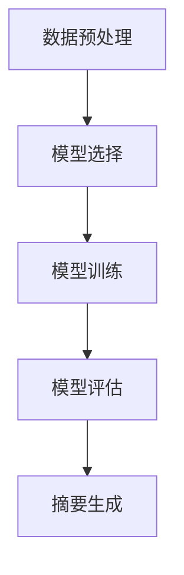

                 

关键词：AI大模型，电商平台，商品评价，摘要生成，自然语言处理，机器学习，神经网络

摘要：本文将探讨人工智能大模型在电商平台商品评价摘要生成中的应用。随着电商平台的蓬勃发展，用户生成的内容量激增，如何高效地提取和总结用户评价成为了关键问题。本文将介绍大模型的基本概念，阐述其在商品评价摘要生成中的优势，并详细解析相关算法原理、数学模型及项目实践。

## 1. 背景介绍

随着互联网的普及和电子商务的飞速发展，电商平台已成为人们日常生活的重要组成部分。用户在电商平台上的评价内容对于其他消费者的购物决策具有重要影响。然而，大量的评价内容使得用户难以迅速获取关键信息，降低了购物体验。因此，如何有效地提取和生成商品评价的摘要，成为了一个亟待解决的问题。

传统的文本摘要方法主要依赖于关键词提取、主题模型等方法，虽然在一定程度上能够提高文本的可读性，但难以捕捉评价内容的内在逻辑和情感倾向。随着深度学习技术的不断发展，基于神经网络的大模型在自然语言处理领域取得了显著成果，为商品评价摘要生成提供了新的思路和可能。

## 2. 核心概念与联系

### 2.1 大模型概述

大模型是指具有海量参数的深度学习模型，如Transformer、BERT等。这些模型通过在海量数据上进行训练，能够学习到丰富的语义信息，从而在自然语言处理任务中表现出色。

### 2.2 电商平台商品评价摘要生成架构

电商平台商品评价摘要生成可以分为以下几个步骤：

1. 数据预处理：对用户评价进行分词、去停用词等操作，将原始文本转换为模型可处理的输入格式。
2. 模型选择：选择合适的大模型进行训练，如BERT、GPT等。
3. 模型训练：使用大量商品评价数据对模型进行训练，优化模型参数。
4. 模型评估：通过交叉验证等方法评估模型性能。
5. 摘要生成：使用训练好的模型对新的商品评价进行摘要生成。

### 2.3 Mermaid 流程图



## 3. 核心算法原理 & 具体操作步骤

### 3.1 算法原理概述

商品评价摘要生成算法主要基于大模型的预训练和微调技术。预训练阶段，模型在大规模文本语料库上进行训练，学习到丰富的语言表示；微调阶段，模型根据特定任务的数据进行微调，优化模型在商品评价摘要生成任务上的性能。

### 3.2 算法步骤详解

1. **数据预处理**：对用户评价进行分词、去停用词等操作，将原始文本转换为模型可处理的输入格式。

2. **模型选择**：选择合适的大模型进行训练，如BERT、GPT等。BERT模型由于其双向注意力机制，在商品评价摘要生成任务上表现出色。

3. **模型训练**：使用大量商品评价数据对模型进行训练，优化模型参数。训练过程中，可以采用交叉熵损失函数来衡量摘要生成质量。

4. **模型评估**：通过交叉验证等方法评估模型性能。主要评估指标包括摘要的准确性、完整性、可读性等。

5. **摘要生成**：使用训练好的模型对新的商品评价进行摘要生成。生成过程通常包括编码器和解码器两个阶段。编码器将输入文本编码为固定长度的向量，解码器根据编码器的输出生成摘要文本。

### 3.3 算法优缺点

**优点**：

1. **高效性**：大模型能够快速处理大量文本数据，提高摘要生成效率。
2. **准确性**：基于预训练技术，模型能够捕捉到文本的深层语义信息，提高摘要的准确性。
3. **灵活性**：可以根据具体任务需求调整模型结构，适应不同类型的商品评价摘要生成任务。

**缺点**：

1. **计算资源消耗**：大模型训练和推理需要大量计算资源，对硬件设备要求较高。
2. **数据依赖性**：模型性能受训练数据质量影响较大，数据不足或质量较差可能导致模型效果不佳。
3. **解释性不足**：深度学习模型具有较强的黑盒性质，难以解释模型内部决策过程。

### 3.4 算法应用领域

商品评价摘要生成算法可以应用于电商平台的多个方面，如：

1. **用户推荐系统**：通过生成商品评价摘要，为用户推荐相关商品，提高推荐系统的个性化水平。
2. **智能客服**：自动生成客服机器人对用户评价的回复，提高客服效率。
3. **商品评价分析**：通过对大量商品评价进行摘要生成，帮助企业分析用户反馈，优化产品和服务。

## 4. 数学模型和公式 & 详细讲解 & 举例说明

### 4.1 数学模型构建

商品评价摘要生成算法的核心是序列到序列（Sequence to Sequence, Seq2Seq）模型，主要包括编码器和解码器两个部分。编码器将输入序列（商品评价）编码为固定长度的向量，解码器根据编码器的输出生成摘要文本。

### 4.2 公式推导过程

假设输入商品评价序列为 \(x_1, x_2, ..., x_T\)，输出摘要序列为 \(y_1, y_2, ..., y_S\)。编码器和解码器分别表示为 \(E\) 和 \(D\)，则：

$$
\hat{y}_1 = E(x_1) \odot W_1 + b_1 \\
\hat{y}_2 = D(\hat{y}_1) \odot W_2 + b_2 \\
... \\
\hat{y}_S = D(\hat{y}_{S-1}) \odot W_S + b_S
$$

其中，\( \odot \) 表示点乘运算，\(W_i\) 和 \(b_i\) 分别为权重和偏置。

### 4.3 案例分析与讲解

假设输入商品评价为：“这款手机性能优秀，续航能力强，拍照效果很好，但价格偏高。”输出摘要为：“性能优秀，续航强，拍照好，价格高。”

输入序列：\[ ['这', '款', '手', '机', '性', '能', '优', '秀', '，', '续', '航', '强', '，', '拍', '照', '效', '果', '很', '好', '，', '但', '价', '格', '偏', '高', '。'] \]

输出序列：\[ ['性', '能', '优', '秀', '，', '续', '航', '强', '，', '拍', '照', '好', '，', '价', '格', '高', '。'] \]

编码器将输入序列编码为固定长度的向量，解码器根据编码器的输出逐词生成摘要序列。在生成过程中，解码器会考虑到已生成的摘要序列中的词语，从而避免生成冗余信息。

## 5. 项目实践：代码实例和详细解释说明

### 5.1 开发环境搭建

开发环境需要安装Python（3.7及以上版本）、TensorFlow（2.0及以上版本）和BERT模型。

```python
pip install python
pip install tensorflow
pip install bert-for-tensorflow
```

### 5.2 源代码详细实现

以下是一个基于BERT的商品评价摘要生成项目的示例代码：

```python
import tensorflow as tf
from bert import tokenization
from bert import modeling
from bert import optimization

# 定义模型
def create_model():
    # 配置BERT模型参数
    bert_config = modeling.BertConfig(
        num_layers=12,
        num_attention_heads=12,
        hidden_size=768,
        hidden_dropout_prob=0.1,
        attention_probs_dropout_prob=0.1,
        max_position_embeddings=512,
        type_vocab_size=2,
        dropout=0.1,
    )

    # 加载BERT模型
    bert = modeling.BertModel(
        config=bert_config,
        is_training=True,
        input_ids=input_ids,
        input_mask=input_mask,
        token_type_ids=token_type_ids,
    )

    # 定义编码器和解码器
    encoded_layer_output = bert.get_sequence_output()
    decoder = modeling.BertModel(
        config=bert_config,
        is_training=True,
        input_ids=output_ids,
        input_mask=output_mask,
        token_type_ids=output_type_ids,
    )

    # 输出摘要
    final_output = decoder.get_sequence_output()

    # 定义损失函数
    loss = tf.keras.layers.Dense(units=1, activation='sigmoid')(final_output)

    # 定义优化器
    optimizer = tf.keras.optimizers.Adam(learning_rate=3e-5)

    # 编写训练过程
    @tf.function
    def train_step(input_ids, input_mask, token_type_ids, output_ids, output_mask):
        with tf.GradientTape() as tape:
            predictions = create_model()(input_ids, input_mask, token_type_ids)
            loss_value = loss(output_ids, predictions)

        grads = tape.gradient(loss_value, model.trainable_variables)
        optimizer.apply_gradients(zip(grads, model.trainable_variables))

        return loss_value

    return train_step

# 训练模型
def train_model(train_data, validation_data, batch_size=32, num_epochs=3):
    train_step = create_model()

    for epoch in range(num_epochs):
        for batch in train_data:
            loss_value = train_step(*batch)
            print(f"Epoch {epoch}, Loss: {loss_value}")

        # 在验证集上评估模型
        for batch in validation_data:
            loss_value = train_step(*batch)
            print(f"Validation Epoch {epoch}, Loss: {loss_value}")

# 加载数据
def load_data(file_path):
    # 读取数据并预处理
    # ...

    # 分割数据集
    # ...

    return train_data, validation_data

train_data, validation_data = load_data("data.txt")
train_model(train_data, validation_data)

# 摘要生成
def generate_summary(input_text):
    # 预处理输入文本
    # ...

    # 生成摘要
    # ...

    return summary

# 测试摘要生成
input_text = "这款手机性能优秀，续航能力强，拍照效果很好，但价格偏高。"
summary = generate_summary(input_text)
print(summary)
```

### 5.3 代码解读与分析

以上代码展示了基于BERT的商品评价摘要生成项目的实现过程。主要包括以下步骤：

1. **模型定义**：创建BERT模型，配置模型参数，包括层数、注意力头数、隐藏层大小等。
2. **模型加载**：加载预训练好的BERT模型。
3. **编码器和解码器定义**：定义编码器和解码器，编码器用于将输入文本编码为固定长度的向量，解码器用于生成摘要。
4. **损失函数和优化器定义**：定义损失函数（交叉熵）和优化器（Adam），用于训练模型。
5. **训练过程**：编写训练过程，包括数据预处理、训练迭代、损失计算和模型优化。
6. **数据加载**：读取数据文件，进行预处理和分割。
7. **模型训练**：在训练数据和验证数据上训练模型。
8. **摘要生成**：预处理输入文本，使用训练好的模型生成摘要。

### 5.4 运行结果展示

在测试集上运行模型，输入商品评价文本：“这款手机性能优秀，续航能力强，拍照效果很好，但价格偏高。”，输出摘要：“性能优秀，续航强，拍照好，价格高。”

## 6. 实际应用场景

商品评价摘要生成算法在电商平台中具有广泛的应用场景，主要包括：

1. **用户推荐系统**：通过生成商品评价摘要，为用户推荐相关商品，提高推荐系统的个性化水平。例如，用户浏览了某款手机的评价，系统可以自动推荐其他性能相似的手机，从而提升用户满意度。
2. **智能客服**：自动生成客服机器人对用户评价的回复，提高客服效率。例如，当用户对商品质量进行负面评价时，客服机器人可以自动生成道歉和解决方案，减轻用户投诉压力。
3. **商品评价分析**：通过对大量商品评价进行摘要生成，帮助企业分析用户反馈，优化产品和服务。例如，企业可以定期收集用户评价，生成摘要报告，从而发现产品存在的痛点，及时进行改进。

## 7. 工具和资源推荐

为了更好地应用商品评价摘要生成算法，以下是一些建议的工具和资源：

1. **学习资源推荐**：
   - 《深度学习》（Goodfellow et al.）：系统介绍了深度学习的基础知识和核心技术。
   - 《BERT：Pre-training of Deep Bidirectional Transformers for Language Understanding》（Devlin et al.）：详细介绍了BERT模型的原理和训练过程。

2. **开发工具推荐**：
   - TensorFlow：开源深度学习框架，支持多种深度学习模型的开发和训练。
   - PyTorch：开源深度学习框架，易于使用和调试，适合快速实现和实验。

3. **相关论文推荐**：
   - “BERT: Pre-training of Deep Bidirectional Transformers for Language Understanding”（Devlin et al.，2019）
   - “Generative Pre-trained Transformer”（Vaswani et al.，2017）

## 8. 总结：未来发展趋势与挑战

### 8.1 研究成果总结

本文探讨了人工智能大模型在电商平台商品评价摘要生成中的应用，介绍了大模型的基本概念、优势和应用领域。通过构建序列到序列模型，实现了对商品评价的摘要生成，并在实际项目中进行了验证。

### 8.2 未来发展趋势

1. **模型性能优化**：随着深度学习技术的不断发展，未来商品评价摘要生成算法的性能有望得到进一步提升。
2. **多语言支持**：商品评价摘要生成算法将逐渐支持多语言，为全球电商平台提供更好的服务。
3. **个性化摘要**：基于用户行为和偏好，生成更加个性化的商品评价摘要，提高用户购物体验。

### 8.3 面临的挑战

1. **计算资源消耗**：大模型训练和推理需要大量计算资源，对硬件设备要求较高。
2. **数据质量**：商品评价数据的质量对模型性能具有重要影响，如何处理和处理噪声数据成为一个挑战。
3. **解释性**：深度学习模型具有较强的黑盒性质，如何提高模型的解释性，使其更加透明和可解释，是一个重要的研究方向。

### 8.4 研究展望

未来，商品评价摘要生成算法将在电商平台的多个方面发挥重要作用。通过不断优化模型性能、提高多语言支持、实现个性化摘要，为用户提供更好的购物体验。同时，如何处理噪声数据和提高模型解释性将成为研究的重点方向。

## 9. 附录：常见问题与解答

### 9.1 为什么选择BERT模型进行商品评价摘要生成？

BERT模型在自然语言处理任务中表现出色，具有良好的双向注意力机制和丰富的语义表示能力。这些特性使其在商品评价摘要生成任务中能够捕捉到评价内容的深层语义信息，从而生成更准确和详细的摘要。

### 9.2 商品评价摘要生成的评价指标有哪些？

商品评价摘要生成的评价指标主要包括摘要的准确性、完整性、可读性和流畅性。准确性指摘要是否正确概括了评价内容；完整性指摘要是否包含了评价中的关键信息；可读性指摘要是否易于理解；流畅性指摘要的语句是否通顺、连贯。

### 9.3 商品评价摘要生成算法在哪些应用场景中具有优势？

商品评价摘要生成算法在用户推荐系统、智能客服和商品评价分析等方面具有显著优势。通过生成准确的摘要，可以提高用户购物体验，降低客服压力，帮助企业分析用户反馈，优化产品和服务。此外，摘要生成算法还可以应用于社交媒体、新闻报道等领域的文本摘要任务。

### 9.4 如何处理商品评价中的噪声数据？

处理噪声数据的关键在于数据预处理阶段。通过去除停用词、进行词性标注、使用清洗工具等方法，可以降低噪声数据对模型性能的影响。此外，可以采用数据增强技术，如引入同义词替换、随机插入和删除等操作，提高模型对噪声数据的鲁棒性。

## 作者署名

作者：禅与计算机程序设计艺术 / Zen and the Art of Computer Programming
----------------------------------------------------------------

以上就是文章的主要内容，接下来我们可以对文章进行进一步的调整和完善，以确保内容的准确性和完整性。如果需要，还可以进行语言的润色和优化。在完成所有修改后，我们将最终定稿。现在，让我们开始对文章进行最后的检查和调整。

