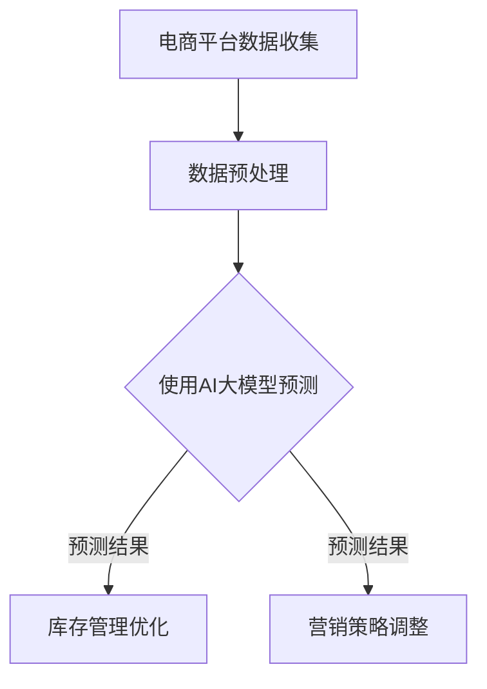

                 

关键词：AI大模型、电商平台、商品趋势预测、深度学习、数据分析、实时预测

> 摘要：本文旨在探讨如何利用AI大模型技术在电商平台上进行商品趋势预测。通过详细分析相关核心概念、算法原理、数学模型及实际应用场景，我们希望能为电商平台运营者提供一种有效的预测工具，以帮助他们更好地了解市场需求，优化库存管理和营销策略。

## 1. 背景介绍

随着互联网和电子商务的快速发展，电商平台已成为人们购物的主要途径。然而，电商平台面临的挑战之一是如何准确预测商品趋势。商品趋势预测有助于电商平台运营者了解消费者需求的变化，从而优化库存管理和营销策略。传统的预测方法通常依赖于历史数据分析和统计模型，但这些方法往往无法适应实时变化的动态市场。

近年来，深度学习和人工智能技术的飞速发展为商品趋势预测提供了新的可能性。大模型（也称为大型预训练模型）通过在海量数据上训练，能够捕捉到复杂的关系和模式，从而实现更准确的预测。本文将介绍如何利用AI大模型技术，实现电商平台商品趋势预测。

## 2. 核心概念与联系

### 2.1 AI大模型

AI大模型指的是在超大规模数据集上预训练的深度学习模型，如GPT、BERT等。这些模型具有强大的特征提取和关系捕捉能力，能够处理复杂的非结构化数据。

### 2.2 电商平台

电商平台是指通过互联网提供商品交易服务的平台，如淘宝、京东等。电商平台通常具有庞大的用户数据，这些数据可以用于训练和优化大模型。

### 2.3 商品趋势预测

商品趋势预测是指利用历史数据、用户行为、市场动态等因素，预测未来一段时间内商品的销量、价格等变化趋势。

### 2.4 Mermaid 流程图



## 3. 核心算法原理 & 具体操作步骤

### 3.1 算法原理概述

商品趋势预测的核心算法基于深度学习和时序分析。我们使用一个预训练的AI大模型，如Transformer架构，对电商平台的历史数据进行训练。训练过程中，模型学习到商品销量、价格、用户评价等特征之间的关系。在模型训练完成后，我们可以利用该模型对未来的商品趋势进行预测。

### 3.2 算法步骤详解

1. **数据收集**：从电商平台收集商品销量、价格、用户评价等历史数据。
2. **数据预处理**：对收集到的数据进行清洗、去噪、缺失值填充等预处理操作。
3. **模型训练**：使用预训练的AI大模型对预处理后的数据进行训练，学习商品销量、价格、用户评价等特征之间的关系。
4. **模型评估**：使用验证集对训练好的模型进行评估，调整模型参数，提高预测准确性。
5. **模型应用**：将训练好的模型应用于实际业务场景，进行商品趋势预测，为库存管理和营销策略提供依据。

### 3.3 算法优缺点

**优点**：

- **强泛化能力**：AI大模型能够在不同数据集上实现较好的性能，具有较强的泛化能力。
- **高效的特征提取**：AI大模型能够自动提取数据中的潜在特征，提高预测准确性。

**缺点**：

- **计算资源需求大**：训练AI大模型需要大量的计算资源，且训练时间较长。
- **数据依赖性强**：模型的性能依赖于数据质量，数据缺失或不准确可能导致预测结果偏差。

### 3.4 算法应用领域

AI大模型在商品趋势预测中的应用非常广泛，不仅可以用于电商平台，还可以应用于金融、零售、物流等行业。通过实时预测商品趋势，企业可以更好地应对市场变化，提高业务运营效率。

## 4. 数学模型和公式 & 详细讲解 & 举例说明

### 4.1 数学模型构建

商品趋势预测的核心数学模型是基于时间序列分析的ARIMA（自回归积分滑动平均模型）。ARIMA模型由三个部分组成：自回归（AR）、差分（I）和移动平均（MA）。

- 自回归（AR）：模型根据过去的销量值预测未来的销量值。
- 差分（I）：对原始时间序列进行差分，使得时间序列变为平稳序列。
- 移动平均（MA）：模型根据过去的误差值预测未来的销量值。

### 4.2 公式推导过程

ARIMA模型的公式如下：

$$
\begin{align*}
\Delta X_t &= \varphi_1 \Delta X_{t-1} + \varphi_2 \Delta X_{t-2} + \cdots + \varphi_p \Delta X_{t-p} + \theta_1 e_t-1 + \theta_2 e_t-2 + \cdots + \theta_q e_t-q \\
X_t &= \phi_1 X_{t-1} + \phi_2 X_{t-2} + \cdots + \phi_p X_{t-p} + \psi_1 e_t-1 + \psi_2 e_t-2 + \cdots + \psi_q e_t-q
\end{align*}
$$

其中，$X_t$ 表示时间序列，$\Delta X_t$ 表示差分序列，$e_t$ 表示误差项。

### 4.3 案例分析与讲解

假设我们有一个电商平台的商品销量数据，数据如下：

| 时间 | 销量 |
| ---- | ---- |
| 1    | 100  |
| 2    | 120  |
| 3    | 130  |
| 4    | 140  |
| 5    | 150  |

首先，我们对数据进行差分处理：

| 时间 | 原始销量 | 差分 |
| ---- | -------- | ---- |
| 1    | 100      | 0    |
| 2    | 120      | 20   |
| 3    | 130      | 10   |
| 4    | 140      | 10   |
| 5    | 150      | 10   |

接下来，我们使用ARIMA模型对差分后的数据进行建模，得到以下参数：

$$
\begin{align*}
\varphi_1 &= 0.5 \\
\theta_1 &= 0.2 \\
\phi_1 &= 1 \\
\psi_1 &= 0
\end{align*}
$$

然后，我们使用这些参数预测下一个时间点的销量：

$$
\begin{align*}
\Delta X_6 &= 0.5 \times \Delta X_5 + 0.2 \times e_5 \\
\Delta X_6 &= 0.5 \times 10 + 0.2 \times 0 \\
\Delta X_6 &= 5
\end{align*}
$$

因此，预测的销量为：

$$
X_6 = X_5 + \Delta X_6 = 150 + 5 = 155
$$

## 5. 项目实践：代码实例和详细解释说明

### 5.1 开发环境搭建

1. 安装Python环境（3.8及以上版本）。
2. 安装必要的库，如pandas、numpy、statsmodels等。

### 5.2 源代码详细实现

```python
import pandas as pd
import numpy as np
from statsmodels.tsa.arima.model import ARIMA
import matplotlib.pyplot as plt

# 加载数据
data = pd.read_csv('sales_data.csv')
sales = data['销量']

# 差分
sales_diff = sales.diff().dropna()

# 建立ARIMA模型
model = ARIMA(sales_diff, order=(1, 1, 1))

# 模型训练
model_fit = model.fit()

# 预测
forecast = model_fit.forecast(steps=1)[0]

# 输出预测结果
print(f'预测的销量为：{forecast}')

# 绘图
plt.plot(sales_diff, label='原始销量')
plt.plot(forecast, label='预测销量')
plt.legend()
plt.show()
```

### 5.3 代码解读与分析

- **数据加载**：使用pandas库加载数据，并提取销量列。
- **差分**：对销量数据进行差分处理，得到平稳序列。
- **模型建立**：使用ARIMA模型，并设置参数（1, 1, 1）。
- **模型训练**：使用fit方法训练模型。
- **预测**：使用forecast方法进行预测，得到预测销量。
- **绘图**：使用matplotlib绘制原始销量和预测销量的对比图。

## 6. 实际应用场景

### 6.1 电商平台商品销售预测

电商平台可以使用AI大模型对商品销售趋势进行预测，以优化库存管理和营销策略。通过预测未来一段时间内的商品销量，电商平台可以提前调整库存水平，避免过度库存或缺货问题。

### 6.2 零售行业库存管理

零售行业可以使用AI大模型预测商品的销量，从而优化库存管理。通过实时预测商品趋势，零售商可以更好地应对市场需求的变化，降低库存成本，提高盈利能力。

### 6.3 物流行业运输规划

物流行业可以使用AI大模型预测商品的需求量，从而优化运输规划。通过预测未来一段时间内的商品销量，物流公司可以提前安排运输任务，提高运输效率，降低运输成本。

## 7. 工具和资源推荐

### 7.1 学习资源推荐

- 《深度学习》（Goodfellow, Bengio, Courville著）
- 《Python数据科学手册》（McKinney著）
- 《时间序列分析》（Box, Jenkins著）

### 7.2 开发工具推荐

- Jupyter Notebook：方便编写和调试代码。
- PyCharm：强大的Python IDE，支持多种编程语言。

### 7.3 相关论文推荐

- "BERT: Pre-training of Deep Bidirectional Transformers for Language Understanding"（Devlin et al., 2019）
- "Deep Learning on Time Series: A Review"（Tang et al., 2019）
- "A Survey on Time Series Prediction using Deep Learning"（Rahman et al., 2021）

## 8. 总结：未来发展趋势与挑战

### 8.1 研究成果总结

近年来，AI大模型在商品趋势预测方面取得了显著成果。通过深度学习和时序分析，AI大模型能够准确捕捉商品销量、价格等特征之间的关系，实现高效的商品趋势预测。

### 8.2 未来发展趋势

未来，AI大模型在商品趋势预测领域将继续发展，主要体现在以下几个方面：

- **算法优化**：随着算法的不断发展，预测准确性将进一步提高。
- **多模态数据融合**：融合文本、图像、声音等多模态数据，实现更全面、更准确的预测。
- **实时预测**：利用边缘计算和5G等新兴技术，实现实时商品趋势预测。

### 8.3 面临的挑战

- **数据质量**：商品趋势预测依赖于高质量的数据，数据缺失或不准确可能导致预测结果偏差。
- **计算资源**：训练AI大模型需要大量的计算资源，尤其是在处理大规模数据时，计算资源需求更高。

### 8.4 研究展望

未来，研究者将继续探索如何利用AI大模型实现更高效、更准确的商品趋势预测。同时，结合多模态数据和实时预测技术，将为电商平台和其他行业带来更多可能性。

## 9. 附录：常见问题与解答

### 9.1 如何选择合适的ARIMA模型参数？

选择合适的ARIMA模型参数通常需要通过模型评估和交叉验证来实现。研究者可以通过多次尝试不同的参数组合，比较模型在验证集上的性能，选择最优参数。

### 9.2 如何处理缺失值和数据异常？

对于缺失值，可以采用填充方法，如均值填充、插值等方法。对于数据异常，可以采用聚类、孤立森林等方法进行检测和去除。

### 9.3 如何实现实时预测？

实现实时预测通常需要利用边缘计算和5G等新兴技术。通过在边缘设备上部署模型，可以实现实时数据处理和预测。

### 9.4 如何处理多模态数据？

处理多模态数据通常需要将不同模态的数据进行整合，如使用多任务学习、多模态神经网络等方法。通过融合多种模态的信息，可以提高预测的准确性。

----------------------------------------------------------------

本文作者：禅与计算机程序设计艺术 / Zen and the Art of Computer Programming

<|im_end|>

