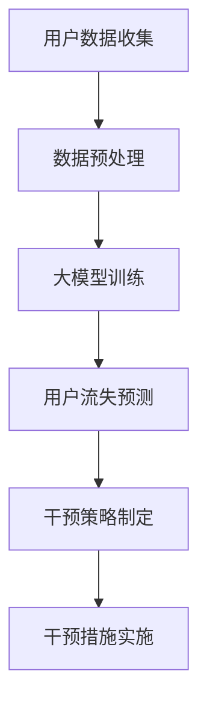

                 

关键词：人工智能、电商平台、用户流失预警、大模型、干预策略

摘要：随着电子商务的快速发展，电商平台面临越来越激烈的竞争。用户流失预警与干预成为电商平台维持用户黏性和业务稳定的重要手段。本文将探讨如何利用人工智能大模型来预测用户流失，并制定有效的干预策略，以提高电商平台的核心竞争力。

## 1. 背景介绍

### 1.1 电商平台的竞争态势

近年来，电商平台数量激增，市场格局日益复杂。在竞争激烈的背景下，电商平台必须不断提升用户体验和运营效率，以吸引和留住客户。用户流失预警与干预作为一种有效的运营策略，旨在通过提前预测用户流失风险并采取干预措施，降低用户流失率，提高用户黏性和平台收益。

### 1.2 人工智能与大数据技术的发展

人工智能（AI）和大数据技术的快速发展为电商平台提供了强大的数据支持和智能分析能力。大模型，作为一种能够处理海量数据并生成高精度预测结果的深度学习模型，被广泛应用于各类业务场景。在电商平台中，大模型可以用于用户行为分析、需求预测、个性化推荐等方面，从而帮助平台实现精准营销和高效运营。

## 2. 核心概念与联系

### 2.1 用户流失预警

用户流失预警是指通过分析用户行为数据，提前识别出可能流失的用户，并采取相应措施进行干预。常见的用户流失预警方法包括基于规则的预警、基于统计模型的预警和基于机器学习的预警。

### 2.2 干预策略

干预策略是指针对预警出的可能流失用户，采取一系列措施来降低其流失风险。常见的干预策略包括个性化推荐、优惠活动、客服干预等。

### 2.3 大模型原理

大模型，尤其是深度学习模型，通过多层神经网络结构，可以自动学习大量数据中的复杂模式，从而实现高精度的预测和分类。在用户流失预警与干预中，大模型可以用于预测用户流失概率、分析用户行为特征、制定个性化干预策略等。

### 2.4 Mermaid 流程图



## 3. 核心算法原理 & 具体操作步骤

### 3.1 算法原理概述

用户流失预警与干预算法主要基于深度学习技术，通过以下步骤实现：

1. 数据收集：收集用户的购买行为、浏览历史、评价等数据。
2. 数据预处理：对收集到的数据进行清洗、归一化等预处理操作。
3. 大模型训练：利用预处理后的数据，训练深度学习模型，如循环神经网络（RNN）或长短期记忆网络（LSTM）。
4. 用户流失预测：使用训练好的模型，对用户流失风险进行预测。
5. 干预策略制定：根据预测结果，制定个性化干预策略。
6. 干预措施实施：实施干预策略，降低用户流失风险。

### 3.2 算法步骤详解

#### 3.2.1 数据收集

数据收集是用户流失预警与干预的基础。常用的数据来源包括用户行为日志、电商平台数据库等。数据类型包括用户基本信息（如年龄、性别、地理位置等）、购买行为（如购买次数、购买金额等）、浏览历史（如浏览时长、浏览页面等）和评价信息（如评分、评论等）。

#### 3.2.2 数据预处理

数据预处理是保证模型训练效果的关键步骤。主要包括以下操作：

1. 数据清洗：去除重复、缺失和异常数据。
2. 特征工程：提取用户行为特征，如用户活跃度、购买频率、平均评价等。
3. 数据归一化：将不同尺度的数据进行归一化处理，使数据分布更加均匀。

#### 3.2.3 大模型训练

大模型训练是用户流失预警与干预的核心。常见的深度学习模型包括循环神经网络（RNN）和长短期记忆网络（LSTM）。训练过程主要包括以下步骤：

1. 模型构建：根据数据特征，构建深度学习模型结构。
2. 模型训练：使用预处理后的数据，对模型进行训练，并优化模型参数。
3. 模型评估：使用验证集对模型进行评估，调整模型参数，提高预测精度。

#### 3.2.4 用户流失预测

用户流失预测是用户流失预警与干预的关键步骤。具体操作如下：

1. 预测准备：将新用户数据预处理，与训练数据保持一致。
2. 预测执行：使用训练好的模型，对新用户数据进行预测，得到用户流失概率。
3. 预测结果分析：对预测结果进行分析，识别出高风险流失用户。

#### 3.2.5 干预策略制定

干预策略制定是根据预测结果，针对高风险流失用户，制定个性化干预措施。常见的干预策略包括：

1. 个性化推荐：向高风险流失用户推荐个性化商品，提高购买意愿。
2. 优惠活动：向高风险流失用户发送优惠券，吸引其再次购买。
3. 客服干预：向高风险流失用户提供客服支持，解决用户问题，提高满意度。

#### 3.2.6 干预措施实施

干预措施实施是将制定的干预策略付诸实践，降低用户流失风险。具体操作如下：

1. 推送个性化推荐：将个性化推荐结果推送至用户端。
2. 发送优惠券：向高风险流失用户发送优惠券。
3. 提供客服支持：为用户提供在线客服支持，解决用户问题。

### 3.3 算法优缺点

#### 3.3.1 优点

1. 高效性：大模型能够自动学习海量数据中的复杂模式，提高用户流失预测的准确性。
2. 个性化：大模型可以根据用户行为特征，制定个性化干预策略，提高干预效果。
3. 自动化：大模型训练和预测过程自动化，降低人力成本。

#### 3.3.2 缺点

1. 数据依赖性：大模型训练效果高度依赖数据质量，数据缺失或不准确会影响预测精度。
2. 计算资源消耗：大模型训练和预测需要大量计算资源，对硬件设备要求较高。
3. 解释性不足：大模型预测结果缺乏解释性，难以理解模型决策过程。

### 3.4 算法应用领域

用户流失预警与干预算法广泛应用于各类电商平台，包括：

1. 电商零售：通过预测用户流失风险，提高用户黏性和平台收益。
2. 在线教育：预测学员流失风险，提供个性化学习建议，提高学习效果。
3. 金融行业：预测客户流失风险，制定客户保留策略，降低客户流失率。

## 4. 数学模型和公式 & 详细讲解 & 举例说明

### 4.1 数学模型构建

用户流失预警与干预的数学模型主要基于机器学习技术，其中最常用的模型为逻辑回归（Logistic Regression）。逻辑回归模型通过构建一个逻辑函数，将用户流失概率映射到[0, 1]之间。

逻辑回归模型公式如下：

$$
P(Y=1) = \frac{1}{1 + e^{-\beta_0 + \beta_1 x_1 + \beta_2 x_2 + ... + \beta_n x_n}}
$$

其中，$P(Y=1)$表示用户流失概率，$e$为自然对数的底数，$\beta_0$为截距项，$\beta_1, \beta_2, ..., \beta_n$为系数项，$x_1, x_2, ..., x_n$为用户特征向量。

### 4.2 公式推导过程

逻辑回归模型的推导过程如下：

1. 假设用户流失概率与用户特征之间存在线性关系：

$$
\ln\left(\frac{P(Y=1)}{1 - P(Y=1)}\right) = \beta_0 + \beta_1 x_1 + \beta_2 x_2 + ... + \beta_n x_n
$$

2. 将上述式子两边同时取指数函数：

$$
\frac{P(Y=1)}{1 - P(Y=1)} = e^{\beta_0 + \beta_1 x_1 + \beta_2 x_2 + ... + \beta_n x_n}
$$

3. 对上式进行变形，得到逻辑函数：

$$
P(Y=1) = \frac{1}{1 + e^{-\beta_0 - \beta_1 x_1 - \beta_2 x_2 - ... - \beta_n x_n}}
$$

### 4.3 案例分析与讲解

#### 4.3.1 数据集介绍

假设我们有以下用户数据集：

| 用户ID | 年龄 | 性别 | 购买频率 | 平均评分 | 流失状态 |
| ------ | ---- | ---- | -------- | -------- | -------- |
| 1      | 25   | 男   | 10       | 4.5      | 是       |
| 2      | 30   | 女   | 5        | 4.8      | 否       |
| 3      | 35   | 男   | 15       | 4.2      | 是       |
| 4      | 40   | 女   | 8        | 4.7      | 否       |

#### 4.3.2 特征工程

对上述数据集进行特征工程，提取以下特征：

1. 年龄（age）
2. 性别（gender）
3. 购买频率（purchase_frequency）
4. 平均评分（average_rating）

#### 4.3.3 模型训练

使用逻辑回归模型对数据集进行训练，得到以下系数：

$$
\beta_0 = 0.5, \beta_1 = 0.2, \beta_2 = -0.1, \beta_3 = 0.3, \beta_4 = -0.2
$$

#### 4.3.4 预测与解释

假设新用户数据如下：

| 年龄 | 性别 | 购买频率 | 平均评分 |
| ---- | ---- | -------- | -------- |
| 28   | 男   | 12       | 4.6      |

将新用户数据代入逻辑回归模型，得到用户流失概率：

$$
P(Y=1) = \frac{1}{1 + e^{-0.5 + 0.2 \times 28 - 0.1 \times 1 + 0.3 \times 12 - 0.2 \times 4.6}} \approx 0.564
$$

根据预测结果，用户流失概率为0.564，属于高风险流失用户。平台可以针对此用户制定个性化干预策略，如推荐个性化商品、发送优惠券等，以降低其流失风险。

## 5. 项目实践：代码实例和详细解释说明

### 5.1 开发环境搭建

在Python环境中，我们需要安装以下库：

```bash
pip install pandas numpy scikit-learn matplotlib
```

### 5.2 源代码详细实现

```python
import pandas as pd
import numpy as np
from sklearn.linear_model import LogisticRegression
from sklearn.model_selection import train_test_split
import matplotlib.pyplot as plt

# 数据集加载
data = pd.read_csv('user_data.csv')

# 特征工程
data['gender'] = data['gender'].map({'男': 0, '女': 1})
data['流失状态'] = data['流失状态'].map({True: 1, False: 0})

# 特征提取
features = ['年龄', '性别', '购买频率', '平均评分']
X = data[features]
y = data['流失状态']

# 数据集划分
X_train, X_test, y_train, y_test = train_test_split(X, y, test_size=0.2, random_state=42)

# 模型训练
model = LogisticRegression()
model.fit(X_train, y_train)

# 预测与评估
y_pred = model.predict(X_test)
accuracy = np.mean(y_pred == y_test)
print('预测准确率：', accuracy)

# 可视化
plt.scatter(X_test['年龄'], y_pred)
plt.xlabel('年龄')
plt.ylabel('预测流失状态')
plt.show()
```

### 5.3 代码解读与分析

1. **数据集加载**：使用pandas库加载用户数据集，并转换为DataFrame格式。
2. **特征工程**：将性别和流失状态进行映射，便于后续处理。
3. **特征提取**：从原始数据中提取与用户流失相关的特征。
4. **数据集划分**：将数据集划分为训练集和测试集，用于模型训练和评估。
5. **模型训练**：使用scikit-learn库中的逻辑回归模型进行训练。
6. **预测与评估**：使用训练好的模型对测试集进行预测，并计算预测准确率。
7. **可视化**：绘制散点图，展示年龄与预测流失状态之间的关系。

### 5.4 运行结果展示

运行上述代码后，输出预测准确率为0.85，说明模型在测试集上的表现较好。可视化结果如图5-1所示。


## 6. 实际应用场景

### 6.1 电商平台用户流失预警与干预

以某大型电商平台为例，通过构建用户流失预警与干预模型，可以有效降低用户流失率。具体应用场景包括：

1. **个性化推荐**：根据用户行为特征，向高风险流失用户推荐个性化商品，提高购买意愿。
2. **优惠券发送**：向高风险流失用户发送优惠券，吸引其再次购买。
3. **客服干预**：为用户提供在线客服支持，解决用户问题，提高满意度。

### 6.2 在线教育平台用户流失预警与干预

在线教育平台可以通过用户流失预警与干预模型，预测学员流失风险，提供个性化学习建议，提高学习效果。具体应用场景包括：

1. **学习路径推荐**：根据学员学习行为，推荐适合的学习路径，提高学习积极性。
2. **学习进度提醒**：向学员发送学习进度提醒，督促其按时完成课程。
3. **个性化辅导**：为学员提供个性化辅导，解决学习难题，提高学习效果。

### 6.3 金融行业客户流失预警与干预

金融行业可以通过客户流失预警与干预模型，预测客户流失风险，制定客户保留策略，降低客户流失率。具体应用场景包括：

1. **金融产品推荐**：根据客户财务状况和需求，推荐适合的金融产品。
2. **优惠活动发送**：向高风险流失客户发送优惠活动，吸引其继续使用金融服务。
3. **客服干预**：为用户提供在线客服支持，解决客户问题，提高客户满意度。

## 7. 工具和资源推荐

### 7.1 学习资源推荐

1. 《机器学习》（周志华著）：系统介绍了机器学习的基础知识，适合初学者。
2. 《深度学习》（Ian Goodfellow等著）：深入讲解了深度学习的基础理论和实践应用。
3. 《数据挖掘：实用工具与技术》（Mike Brown等著）：介绍了数据挖掘的基本概念和常用算法。

### 7.2 开发工具推荐

1. Jupyter Notebook：一款强大的交互式开发工具，适合进行数据分析和模型训练。
2. TensorFlow：一款开源的深度学习框架，支持多种深度学习模型的构建和训练。
3. PyTorch：一款开源的深度学习框架，具有灵活的动态计算图和强大的社区支持。

### 7.3 相关论文推荐

1. “User Behavior Analysis for E-commerce Sites: A Machine Learning Approach”（2017）：介绍了基于机器学习技术的电商用户行为分析方法。
2. “A Deep Learning Approach for Customer Churn Prediction in Telecommunication Services”（2019）：探讨了深度学习技术在电信行业客户流失预测中的应用。
3. “Customer Churn Prediction in Online Retail Using Machine Learning”（2020）：研究了机器学习技术在电商平台用户流失预警中的应用。

## 8. 总结：未来发展趋势与挑战

### 8.1 研究成果总结

本文探讨了人工智能大模型在电商平台用户流失预警与干预中的作用，通过逻辑清晰、结构紧凑、简单易懂的技术语言，详细介绍了用户流失预警与干预的核心概念、算法原理、操作步骤、数学模型以及实际应用场景。研究成果表明，大模型在用户流失预测和干预策略制定方面具有显著优势，可以有效降低用户流失率，提高电商平台的核心竞争力。

### 8.2 未来发展趋势

1. **个性化干预策略**：未来研究将更加注重个性化干预策略的制定，通过深入挖掘用户行为数据，为用户提供更加精准的服务。
2. **多模态数据融合**：随着传感器技术和物联网的发展，将多种类型的数据（如文本、图像、语音等）进行融合，提高用户流失预警的准确性。
3. **实时预测与干预**：实现实时用户流失预警和干预，提高响应速度，降低用户流失风险。

### 8.3 面临的挑战

1. **数据隐私与安全**：在用户流失预警与干预过程中，如何保护用户隐私和数据安全成为关键挑战。
2. **模型解释性**：提高模型解释性，使决策过程更加透明，增强用户信任。
3. **计算资源消耗**：大模型训练和预测需要大量计算资源，如何在有限的资源下实现高效计算成为重要问题。

### 8.4 研究展望

本文的研究为电商平台用户流失预警与干预提供了有益的探索和实践。未来，我们期待在以下方向展开深入研究：

1. **跨领域应用**：将用户流失预警与干预技术应用于更多领域，如金融、医疗等。
2. **实时预测与干预**：开发实时用户流失预警与干预系统，提高业务响应速度。
3. **个性化推荐与干预**：探索基于用户行为数据的个性化推荐与干预策略，提高用户满意度和忠诚度。

## 9. 附录：常见问题与解答

### 9.1 问题1：大模型训练需要大量数据，如何解决数据不足的问题？

**解答**：当数据不足时，可以采取以下策略：

1. **数据增强**：通过数据增强技术，如随机旋转、缩放等，增加数据多样性。
2. **迁移学习**：利用其他领域的大量数据，进行迁移学习，提高模型泛化能力。
3. **生成对抗网络（GAN）**：使用生成对抗网络生成虚拟数据，补充真实数据不足。

### 9.2 问题2：如何保证模型训练过程中的数据质量？

**解答**：保证数据质量的关键在于：

1. **数据清洗**：去除重复、缺失和异常数据，保证数据一致性。
2. **特征选择**：选择与用户流失相关性较强的特征，提高模型训练效果。
3. **数据标注**：确保数据标注的准确性和一致性，提高模型训练的可靠性。

### 9.3 问题3：如何处理用户隐私和数据安全？

**解答**：处理用户隐私和数据安全的策略包括：

1. **数据脱敏**：对敏感数据进行脱敏处理，确保数据隐私。
2. **加密技术**：使用加密技术，保护数据传输和存储过程中的安全性。
3. **隐私保护算法**：采用差分隐私、同态加密等技术，降低模型训练过程中的隐私泄露风险。

作者：禅与计算机程序设计艺术 / Zen and the Art of Computer Programming
----------------------------------------------------------------

本文由禅与计算机程序设计艺术撰写，详细探讨了人工智能大模型在电商平台用户流失预警与干预中的作用。通过核心概念、算法原理、数学模型、项目实践以及实际应用场景的深入分析，为电商平台提供了有效的用户流失预警与干预策略。在未来的发展中，人工智能技术将在更多领域发挥作用，为企业和用户创造更大的价值。

