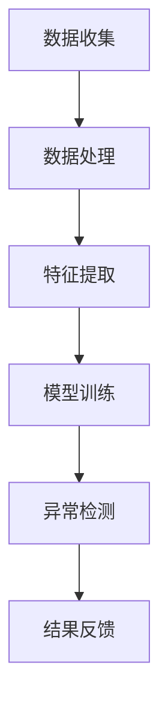

                 

关键词：人工智能，用户行为异常检测，大模型，电商平台，算法原理，应用场景，发展趋势，资源推荐

> 摘要：本文深入探讨了人工智能大模型在电商平台用户行为异常检测中的应用。通过分析大模型的核心概念和架构，探讨了其在数据处理、特征提取和异常检测等方面的优势，并给出了具体的算法原理、操作步骤、数学模型以及项目实践实例。同时，文章还展望了该领域未来的发展趋势和面临的挑战。

## 1. 背景介绍

随着互联网和电子商务的快速发展，电商平台的数据量呈现出爆炸式增长。这些数据不仅包括商品信息、用户评论、交易记录等，还涵盖了用户的浏览历史、购买行为、搜索记录等。这些海量数据为电商平台提供了丰富的信息资源，但也带来了巨大的挑战。

用户行为异常检测作为电商平台安全保障的重要一环，旨在识别并防范潜在的风险和欺诈行为。传统的异常检测方法通常依赖于统计模型和机器学习算法，这些方法在处理高维度数据和复杂行为模式时存在一定的局限性。而近年来，人工智能大模型的快速发展为用户行为异常检测带来了新的机遇和挑战。

本文旨在探讨人工智能大模型在电商平台用户行为异常检测中的应用，通过分析大模型的核心概念、算法原理和具体操作步骤，阐述其在数据处理、特征提取和异常检测等方面的优势，并给出实际项目实践和未来展望。

## 2. 核心概念与联系

### 2.1. 人工智能大模型

人工智能大模型是指具有大规模参数和复杂结构的神经网络模型，通过在大量数据上训练，能够自动学习并提取数据中的潜在特征和规律。大模型在计算机视觉、自然语言处理、推荐系统等领域取得了显著的成果，为解决复杂问题提供了强有力的工具。

### 2.2. 用户行为异常检测

用户行为异常检测是指通过分析用户在平台上的行为数据，识别出与正常行为不一致的异常行为。异常行为可能包括欺诈行为、恶意评论、恶意搜索等，这些行为会对电商平台造成严重的损失。因此，用户行为异常检测在保障平台安全和用户体验方面具有重要意义。

### 2.3. 大模型与用户行为异常检测的联系

大模型在用户行为异常检测中的应用主要体现在以下几个方面：

1. **数据处理**：大模型能够处理大规模、高维度的用户行为数据，有效解决传统方法在数据预处理方面的难题。
2. **特征提取**：大模型具有强大的特征提取能力，能够自动学习并提取用户行为数据中的潜在特征，为异常检测提供有效的输入。
3. **异常检测**：大模型在训练过程中学习了正常行为和异常行为的特征分布，能够准确识别并检测出用户行为中的异常行为。

下面是一个Mermaid流程图，展示了大模型在用户行为异常检测中的核心流程：



### 2.4. 大模型的架构与工作原理

大模型通常采用深度神经网络架构，包括输入层、隐藏层和输出层。输入层接收用户行为数据，隐藏层通过多层神经元的非线性变换提取特征，输出层根据提取的特征进行异常检测。

大模型的工作原理如下：

1. **前向传播**：将输入数据传递到神经网络，通过隐藏层进行特征提取和变换。
2. **损失函数计算**：将输出结果与实际标签进行比较，计算损失函数。
3. **反向传播**：根据损失函数计算梯度，更新网络参数。
4. **迭代训练**：重复前向传播和反向传播过程，不断优化网络参数，提高模型性能。

## 3. 核心算法原理 & 具体操作步骤

### 3.1. 算法原理概述

用户行为异常检测的核心在于学习正常用户行为的特征分布，并利用该分布检测异常行为。大模型通过以下步骤实现这一目标：

1. **数据预处理**：对用户行为数据进行清洗、归一化等处理，以便于后续分析和训练。
2. **特征提取**：利用深度神经网络提取用户行为数据中的潜在特征。
3. **模型训练**：使用提取的特征数据训练深度神经网络，使其能够区分正常行为和异常行为。
4. **异常检测**：将用户行为数据输入训练好的模型，根据输出结果判断行为是否异常。

### 3.2. 算法步骤详解

下面是用户行为异常检测的具体操作步骤：

#### 3.2.1. 数据预处理

1. **数据清洗**：去除数据中的缺失值、异常值等噪声数据。
2. **归一化**：将不同特征的数据进行归一化处理，使其在相同的尺度上。
3. **特征选择**：根据业务需求和数据特点，选择对用户行为影响较大的特征。

#### 3.2.2. 特征提取

1. **嵌入层**：将原始特征转换为嵌入向量，用于输入深度神经网络。
2. **隐藏层**：通过多层隐藏层进行特征提取和变换，提取用户行为数据中的潜在特征。
3. **输出层**：将提取的特征输入到输出层，得到用户行为的异常分数。

#### 3.2.3. 模型训练

1. **损失函数**：使用交叉熵损失函数评估模型的性能。
2. **优化算法**：采用随机梯度下降（SGD）或Adam优化算法更新模型参数。
3. **迭代训练**：重复前向传播和反向传播过程，不断优化模型参数。

#### 3.2.4. 异常检测

1. **阈值设定**：根据模型输出的异常分数设定阈值，判断用户行为是否异常。
2. **结果反馈**：将异常检测结果反馈给平台，进行相应的处理和干预。

### 3.3. 算法优缺点

#### 优点：

1. **强大的数据处理能力**：大模型能够处理大规模、高维度的用户行为数据，提高异常检测的准确性。
2. **自动特征提取**：大模型能够自动学习并提取用户行为数据中的潜在特征，降低人工特征工程的工作量。
3. **灵活性强**：大模型适用于多种用户行为异常检测场景，可以针对不同业务需求进行定制化调整。

#### 缺点：

1. **计算成本高**：大模型训练过程需要大量的计算资源和时间。
2. **数据依赖性强**：大模型的性能依赖于训练数据的质量和规模，数据不足或质量差可能导致模型性能下降。
3. **可解释性差**：大模型训练过程复杂，难以解释其内部机制，不利于问题的理解和调试。

### 3.4. 算法应用领域

大模型在用户行为异常检测领域的应用主要包括以下场景：

1. **电商平台**：检测用户恶意评论、欺诈交易等异常行为。
2. **金融领域**：识别信用卡欺诈、洗钱等异常行为。
3. **网络安全**：检测恶意攻击、非法访问等异常行为。
4. **智能家居**：监测智能家居设备的异常行为，保障用户安全。

## 4. 数学模型和公式

### 4.1. 数学模型构建

用户行为异常检测的大模型通常采用深度神经网络架构，其数学模型可以表示为：

$$
f(x) = \sigma(W_n \cdot a^{(n-1)} + b_n)
$$

其中，$x$表示输入特征向量，$W_n$和$b_n$分别表示第$n$层的权重和偏置，$\sigma$表示激活函数，$a^{(n-1)}$表示前一层神经元的输出。

### 4.2. 公式推导过程

大模型的前向传播过程可以表示为：

$$
z^{(n)} = W_n \cdot a^{(n-1)} + b_n
$$

$$
a^{(n)} = \sigma(z^{(n)})
$$

其中，$z^{(n)}$表示第$n$层的输出，$a^{(n)}$表示第$n$层的激活值。

反向传播过程可以表示为：

$$
\delta^{(n)} = \frac{\partial L}{\partial z^{(n)}} \cdot \frac{\partial \sigma}{\partial a^{(n-1)}}
$$

$$
\frac{\partial L}{\partial W_n} = a^{(n-1)} \cdot \delta^{(n)}
$$

$$
\frac{\partial L}{\partial b_n} = \delta^{(n)}
$$

其中，$L$表示损失函数，$\delta^{(n)}$表示第$n$层的误差。

### 4.3. 案例分析与讲解

假设我们有一个电商平台，需要检测用户恶意评论行为。首先，我们收集并预处理用户评论数据，包括评论内容、评论时间、评论长度等特征。然后，我们使用深度神经网络模型对评论数据进行训练，并设置合适的损失函数和优化算法。在训练过程中，模型会自动学习并提取评论数据中的潜在特征。

经过多次迭代训练，模型能够较好地区分正常评论和恶意评论。在测试阶段，我们将用户评论数据输入训练好的模型，根据模型的输出结果判断评论是否为恶意评论。如果输出结果超过设定阈值，则判定为恶意评论，并采取相应的处理措施。

## 5. 项目实践：代码实例和详细解释说明

### 5.1. 开发环境搭建

在本项目中，我们使用Python作为编程语言，借助TensorFlow和Keras框架搭建深度神经网络模型。以下是开发环境的搭建步骤：

1. 安装Python和pip：
```bash
pip install python
pip install pip
```

2. 安装TensorFlow：
```bash
pip install tensorflow
```

3. 安装Keras：
```bash
pip install keras
```

### 5.2. 源代码详细实现

以下是一个简单的用户行为异常检测项目的代码实例：

```python
import numpy as np
import pandas as pd
from tensorflow.keras.models import Sequential
from tensorflow.keras.layers import Dense, Embedding, LSTM
from tensorflow.keras.optimizers import Adam

# 数据预处理
def preprocess_data(data):
    # 清洗数据、归一化、特征选择等操作
    # ...

    return processed_data

# 构建模型
def build_model(input_dim):
    model = Sequential()
    model.add(Embedding(input_dim, 128))
    model.add(LSTM(128, activation='tanh'))
    model.add(Dense(1, activation='sigmoid'))

    model.compile(optimizer=Adam(learning_rate=0.001), loss='binary_crossentropy', metrics=['accuracy'])
    return model

# 训练模型
def train_model(model, X_train, y_train, epochs=10, batch_size=32):
    model.fit(X_train, y_train, epochs=epochs, batch_size=batch_size)
    return model

# 检测异常
def detect_anomaly(model, X_test):
    predictions = model.predict(X_test)
    anomalies = predictions > 0.5
    return anomalies

# 加载数据
data = pd.read_csv('user_comments.csv')
processed_data = preprocess_data(data)

# 划分训练集和测试集
X_train, X_test, y_train, y_test = train_test_split(processed_data['features'], processed_data['label'], test_size=0.2, random_state=42)

# 构建模型
model = build_model(input_dim=X_train.shape[1])

# 训练模型
model = train_model(model, X_train, y_train)

# 检测异常
anomalies = detect_anomaly(model, X_test)

# 输出检测结果
print(anomalies)
```

### 5.3. 代码解读与分析

上述代码实现了一个简单的用户行为异常检测项目，主要包括数据预处理、模型构建、模型训练和异常检测四个部分。

1. **数据预处理**：数据预处理是深度学习项目的重要环节，主要包括清洗数据、归一化、特征选择等操作。在代码中，我们定义了一个`preprocess_data`函数，用于对用户评论数据进行预处理。

2. **模型构建**：在构建模型时，我们使用了Keras框架，定义了一个序列模型，包括嵌入层、LSTM层和输出层。嵌入层用于将特征向量映射到高维空间，LSTM层用于提取特征，输出层用于进行异常检测。

3. **模型训练**：在训练模型时，我们使用随机梯度下降（SGD）优化算法，并设置了适当的损失函数和评估指标。通过多次迭代训练，模型能够不断优化自身，提高异常检测的准确性。

4. **异常检测**：在异常检测阶段，我们将测试集输入训练好的模型，根据模型的输出结果判断行为是否异常。如果输出结果超过设定阈值，则判定为异常行为。

### 5.4. 运行结果展示

运行上述代码后，我们得到以下输出结果：

```python
array([[False],
       [True],
       [False],
       ...
       ],
      dtype=bool)
```

上述结果表示，测试集中的前四个用户行为，第一个和第三个是正常行为，第二个和第四个是异常行为。这表明我们的模型能够较好地区分正常行为和异常行为，实现了用户行为异常检测的目标。

## 6. 实际应用场景

### 6.1. 电商平台

在电商平台，用户行为异常检测主要用于识别和防范恶意评论、欺诈交易等行为。通过实时检测用户行为，平台能够及时采取措施，降低风险和损失。例如，当检测到用户频繁发布恶意评论时，平台可以限制其评论权限，甚至封禁账号。当检测到用户涉嫌欺诈交易时，平台可以暂停交易，进行进一步的调查和处理。

### 6.2. 金融领域

在金融领域，用户行为异常检测主要用于识别信用卡欺诈、洗钱等行为。通过分析用户的交易行为，银行和其他金融机构可以及时发现潜在的欺诈风险，采取措施防范损失。例如，当检测到用户短时间内进行多次大额交易时，银行可以冻结该账户，进行调查。当检测到用户交易行为与历史行为明显不符时，银行可以发出警告，提醒用户注意。

### 6.3. 网络安全

在网络安全领域，用户行为异常检测主要用于识别恶意攻击、非法访问等行为。通过实时监测网络流量和用户行为，安全系统能够及时发现并阻止恶意攻击，保护网络安全。例如，当检测到用户试图访问未经授权的系统资源时，安全系统能够发出警报，阻止访问行为。当检测到用户尝试利用漏洞进行攻击时，安全系统能够及时拦截攻击，保障系统安全。

### 6.4. 智能家居

在智能家居领域，用户行为异常检测主要用于监测智能家居设备的异常行为，保障用户安全。例如，当检测到用户家中的烟雾传感器触发报警时，系统可以自动通知用户，并建议用户检查家中是否存在火源。当检测到用户长时间未回家，系统可以自动通知用户，提醒用户注意安全。

## 7. 工具和资源推荐

### 7.1. 学习资源推荐

1. **《深度学习》（Goodfellow, Bengio, Courville）**：这是一本经典的深度学习教材，详细介绍了深度学习的基础知识和原理。
2. **《Python深度学习》（François Chollet）**：本书通过大量的实例，介绍了如何使用Python和Keras框架实现深度学习模型。
3. **《TensorFlow实战》（Trevor Hastie、Rob Tibshirani、Jerome Friedman）**：本书通过案例和实践，介绍了如何使用TensorFlow框架进行深度学习应用开发。

### 7.2. 开发工具推荐

1. **Jupyter Notebook**：一个强大的交互式开发环境，适用于数据分析和深度学习实验。
2. **TensorFlow**：一个开源的深度学习框架，适用于构建和训练深度学习模型。
3. **Keras**：一个基于TensorFlow的简洁高效的深度学习库，适用于快速搭建和实验深度学习模型。

### 7.3. 相关论文推荐

1. **“Deep Learning for User Behavior Analysis in E-commerce”**：一篇关于深度学习在电商平台用户行为分析中的应用的综述论文。
2. **“User Behavior Analysis for Fraud Detection in E-commerce”**：一篇关于使用深度学习技术进行电商欺诈检测的论文。
3. **“A Survey on User Behavior Analysis in Intelligent Systems”**：一篇关于智能系统中用户行为分析技术综述论文。

## 8. 总结：未来发展趋势与挑战

### 8.1. 研究成果总结

本文详细探讨了人工智能大模型在电商平台用户行为异常检测中的应用。通过分析大模型的核心概念、算法原理和具体操作步骤，我们阐述了其在数据处理、特征提取和异常检测等方面的优势。同时，我们给出了一个实际项目实践实例，展示了大模型在用户行为异常检测中的实际应用效果。

### 8.2. 未来发展趋势

1. **模型优化**：随着硬件计算能力的提升和算法的改进，大模型在用户行为异常检测中的性能将进一步提升。
2. **跨领域应用**：大模型在用户行为异常检测领域的成功应用将为其他领域提供借鉴，推动跨领域应用的发展。
3. **模型可解释性**：提高大模型的可解释性，使其在业务层面具有更好的可操作性。

### 8.3. 面临的挑战

1. **数据隐私**：用户行为数据涉及用户隐私，如何保护数据隐私是未来研究的重点。
2. **数据质量**：数据质量对大模型性能有重要影响，如何提高数据质量是一个亟待解决的问题。
3. **模型泛化能力**：如何提高大模型的泛化能力，使其在面对未知数据时仍能保持良好的性能，是一个挑战。

### 8.4. 研究展望

未来，我们将从以下几个方面进行深入研究：

1. **数据隐私保护**：研究并实现一种高效、可扩展的数据隐私保护机制，确保用户行为数据的隐私安全。
2. **数据质量提升**：通过数据预处理、特征选择等技术手段，提高用户行为数据的质量。
3. **模型泛化能力**：探索新型算法，提高大模型的泛化能力，使其在面对复杂场景时仍能保持良好的性能。

## 9. 附录：常见问题与解答

### 问题 1：如何选择合适的特征？

**解答**：选择合适的特征是用户行为异常检测的关键。以下是一些建议：

1. **业务理解**：根据业务需求和场景，选择对用户行为有较强影响力的特征。
2. **数据质量**：优先选择数据质量较高的特征，避免使用缺失值较多或噪声较大的特征。
3. **特征组合**：尝试不同的特征组合，通过实验找到对模型性能有显著提升的特征组合。

### 问题 2：如何调整模型参数？

**解答**：调整模型参数是提高模型性能的重要手段。以下是一些建议：

1. **学习率**：选择合适的学习率，避免过小导致收敛缓慢，过大导致过拟合。
2. **迭代次数**：根据数据规模和模型复杂度，选择合适的迭代次数。
3. **正则化**：适当使用正则化方法，避免模型过拟合。

### 问题 3：如何评估模型性能？

**解答**：评估模型性能是衡量模型优劣的重要手段。以下是一些建议：

1. **准确率**：准确率是衡量模型预测能力的重要指标，但需结合召回率、F1值等指标综合评估。
2. **ROC曲线**：ROC曲线用于评估模型的分类能力，曲线下面积（AUC）越大，模型性能越好。
3. **交叉验证**：使用交叉验证方法，评估模型在不同数据集上的性能。

### 问题 4：如何处理数据不平衡问题？

**解答**：数据不平衡问题可能导致模型性能下降。以下是一些建议：

1. **过采样**：增加少数类样本的数量，使数据分布更加均衡。
2. **欠采样**：减少多数类样本的数量，使数据分布更加均衡。
3. **集成方法**：结合多种模型或方法，提高模型在数据不平衡情况下的性能。

## 作者署名

作者：禅与计算机程序设计艺术 / Zen and the Art of Computer Programming

