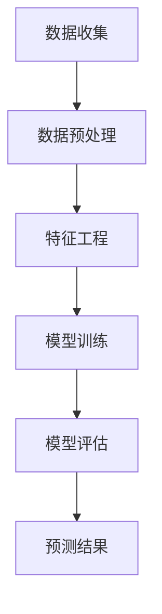

                 

关键词：AI大模型、电商平台、需求预测、机器学习、深度学习、预测算法、资源管理、数据分析、应用实践、未来展望。

> 摘要：本文将探讨如何利用AI大模型，尤其是深度学习技术，对电商平台的商品需求进行预测。通过介绍需求预测在电商平台中的重要性，核心概念和算法原理，以及项目实践中的代码实例，文章旨在为读者提供全面的技术视角，并探讨这一领域未来可能的发展趋势与挑战。

## 1. 背景介绍

在互联网经济蓬勃发展的今天，电商平台已经成为人们日常生活中不可或缺的一部分。电商平台的需求预测，不仅关系到企业的库存管理、供应链优化，更是直接影响企业的盈利能力和市场竞争力。随着大数据和人工智能技术的不断进步，利用AI大模型进行需求预测已经成为电商平台提高运营效率的关键手段。

需求预测的准确性直接影响到电商平台的库存管理、销售策略、物流配送等多个方面。准确的预测可以帮助企业避免库存过剩或不足，减少仓储成本，提高客户满意度。同时，需求预测还可以为企业提供宝贵的市场信息，助力其制定更精准的营销策略，提升销售业绩。

## 2. 核心概念与联系

在讨论AI大模型在电商平台需求预测中的应用之前，我们首先需要了解一些核心概念和它们之间的联系。

### 2.1 数据源

电商平台的需求预测依赖于大量的数据源，包括但不限于：
- 用户行为数据：如浏览记录、购物车数据、购买历史等。
- 商品数据：如商品描述、价格、库存量等。
- 市场数据：如竞争对手的销售情况、市场趋势等。

### 2.2 特征工程

特征工程是需求预测中的关键步骤，它涉及到从原始数据中提取有助于模型训练的特征。这些特征可以是用户行为特征、商品特征、季节性特征、市场特征等。特征工程的质量直接影响到模型的预测性能。

### 2.3 深度学习模型

深度学习模型，特别是卷积神经网络（CNN）、循环神经网络（RNN）和变分自编码器（VAE）等，已经成为需求预测的重要工具。这些模型能够处理大规模的复杂数据，并能够从数据中自动学习出有效的特征表示。

### 2.4 模型评估

在需求预测中，常用的评估指标包括均方误差（MSE）、均方根误差（RMSE）、平均绝对误差（MAE）等。通过这些指标，我们可以评估模型的预测准确性。

### 2.5 Mermaid 流程图

以下是一个简化的需求预测流程的Mermaid流程图：



## 3. 核心算法原理 & 具体操作步骤

### 3.1 算法原理概述

需求预测通常采用时间序列分析方法，结合机器学习和深度学习技术。在算法原理上，主要包括以下几个步骤：

1. **数据预处理**：清洗数据，填充缺失值，标准化处理。
2. **特征工程**：提取用户行为特征、商品特征、市场特征等。
3. **模型选择**：根据需求选择合适的深度学习模型，如RNN、CNN或VAE。
4. **模型训练**：使用训练数据训练模型。
5. **模型评估**：使用验证数据评估模型性能。
6. **预测**：使用训练好的模型对未来的需求进行预测。

### 3.2 算法步骤详解

#### 3.2.1 数据预处理

数据预处理是需求预测的基础。具体步骤如下：

- 数据清洗：去除重复记录、处理异常值。
- 数据填充：使用均值、中位数等方法填充缺失值。
- 数据标准化：对数据进行归一化或标准化处理，使其具备相同的量纲。

#### 3.2.2 特征工程

特征工程是提升模型性能的关键。以下是常见的特征：

- 用户特征：如用户年龄、性别、地理位置等。
- 商品特征：如商品价格、销量、类别等。
- 市场特征：如节假日、季节性、促销活动等。

#### 3.2.3 模型选择

根据需求预测的特点，可以选择以下几种深度学习模型：

- **循环神经网络（RNN）**：适用于时间序列数据的建模。
- **卷积神经网络（CNN）**：适用于图像和序列数据的建模。
- **变分自编码器（VAE）**：适用于生成式模型和概率建模。

#### 3.2.4 模型训练

使用训练数据对模型进行训练，包括以下步骤：

- 划分训练集和验证集。
- 定义损失函数和优化器。
- 训练模型，并监控验证集的损失。

#### 3.2.5 模型评估

使用验证集对模型进行评估，常用的评估指标包括MSE、RMSE、MAE等。

#### 3.2.6 预测

使用训练好的模型对未来的需求进行预测。预测结果可以用于库存管理、销售策略制定等。

### 3.3 算法优缺点

#### 3.3.1 优点

- **高精度**：深度学习模型能够处理大规模的复杂数据，并能够自动提取有效的特征表示，提高预测精度。
- **灵活性**：深度学习模型可以根据需求进行定制化，适用于不同的业务场景。
- **自动化**：特征工程和模型选择过程可以自动化，降低人为干预。

#### 3.3.2 缺点

- **高计算成本**：训练深度学习模型需要大量的计算资源和时间。
- **数据依赖性**：模型的性能高度依赖于数据质量，如果数据质量差，模型的预测效果会受到影响。
- **解释性差**：深度学习模型的黑箱特性使得其解释性较差，难以理解模型的决策过程。

### 3.4 算法应用领域

需求预测算法不仅适用于电商平台，还可以应用于其他领域，如：

- **零售业**：库存管理、销售预测。
- **物流行业**：配送计划、库存优化。
- **金融行业**：市场预测、投资决策。
- **制造业**：生产计划、供应链管理。

## 4. 数学模型和公式 & 详细讲解 & 举例说明

### 4.1 数学模型构建

在需求预测中，常用的数学模型包括时间序列模型和深度学习模型。

#### 4.1.1 时间序列模型

时间序列模型通常采用以下公式：

$$y_t = f(W_0 + W_1 x_1 + W_2 x_2 + ... + W_n x_n) + \epsilon_t$$

其中，$y_t$表示第t时间点的需求，$x_1, x_2, ..., x_n$表示影响需求的特征，$W_0, W_1, ..., W_n$为权重，$\epsilon_t$为误差项。

#### 4.1.2 深度学习模型

深度学习模型通常采用以下架构：

$$y_t = \sigma(W_L a_L) + \epsilon_t$$

其中，$\sigma$为激活函数，$W_L$为最后一层的权重，$a_L$为输入特征，$y_t$为预测值。

### 4.2 公式推导过程

#### 4.2.1 时间序列模型推导

假设我们有一个时间序列数据集$X = (x_1, x_2, ..., x_n)$，其中$x_i$表示第i个时间点的特征。我们可以通过以下步骤进行模型推导：

1. **特征选择**：选择对需求有显著影响的特征，如用户行为特征、商品特征等。
2. **权重计算**：使用最小二乘法计算权重$W_0, W_1, ..., W_n$。
3. **模型训练**：使用训练数据集$X$和标签数据集$Y$进行模型训练。

#### 4.2.2 深度学习模型推导

深度学习模型通常采用反向传播算法进行训练。以下是反向传播算法的推导过程：

1. **前向传播**：计算输入特征$a_L$和预测值$y_t$。
2. **后向传播**：计算损失函数的梯度，并更新权重。
3. **优化**：使用优化算法（如梯度下降）更新权重，以最小化损失函数。

### 4.3 案例分析与讲解

假设我们有一个电商平台的用户行为数据，包括用户浏览记录、购买历史等。我们希望通过这些数据预测用户未来的购买行为。

#### 4.3.1 数据预处理

1. **数据清洗**：去除重复记录、处理异常值。
2. **数据填充**：使用均值、中位数等方法填充缺失值。
3. **数据标准化**：对数据进行归一化或标准化处理。

#### 4.3.2 特征工程

1. **用户特征**：提取用户的年龄、性别、地理位置等。
2. **商品特征**：提取商品的价格、销量、类别等。
3. **交互特征**：计算用户与商品之间的交互特征，如浏览次数、购买次数等。

#### 4.3.3 模型训练

1. **模型选择**：选择循环神经网络（RNN）作为预测模型。
2. **模型训练**：使用训练数据集进行模型训练，并监控验证集的损失。

#### 4.3.4 模型评估

1. **评估指标**：使用均方误差（MSE）评估模型性能。
2. **评估结果**：计算MSE，并根据结果调整模型参数。

#### 4.3.5 预测

1. **预测结果**：使用训练好的模型对未来的购买行为进行预测。
2. **预测分析**：对预测结果进行分析，以指导电商平台制定更精准的营销策略。

## 5. 项目实践：代码实例和详细解释说明

### 5.1 开发环境搭建

为了进行需求预测的项目实践，我们需要搭建一个合适的开发环境。以下是推荐的开发环境和工具：

- **Python**：主要编程语言，用于数据处理和模型训练。
- **Jupyter Notebook**：用于编写和运行代码。
- **TensorFlow**：用于构建和训练深度学习模型。
- **Pandas**：用于数据处理。
- **NumPy**：用于数值计算。

### 5.2 源代码详细实现

以下是一个简化的需求预测项目实现示例：

```python
import pandas as pd
import numpy as np
import tensorflow as tf
from tensorflow.keras.models import Sequential
from tensorflow.keras.layers import LSTM, Dense

# 读取数据
data = pd.read_csv('user_behavior.csv')

# 数据预处理
# ...

# 特征工程
# ...

# 划分训练集和验证集
# ...

# 构建模型
model = Sequential()
model.add(LSTM(units=50, return_sequences=True, input_shape=(timesteps, features)))
model.add(LSTM(units=50))
model.add(Dense(units=1))

# 编译模型
model.compile(optimizer='adam', loss='mean_squared_error')

# 训练模型
model.fit(train_X, train_Y, epochs=100, batch_size=32, validation_data=(val_X, val_Y))

# 预测
predictions = model.predict(test_X)

# 评估模型
# ...

# 结果展示
# ...
```

### 5.3 代码解读与分析

上述代码实现了基于LSTM的深度学习模型的需求预测。以下是代码的详细解读：

- **数据读取**：使用Pandas读取用户行为数据。
- **数据预处理**：进行数据清洗、填充和处理。
- **特征工程**：提取用户和商品特征，计算交互特征。
- **模型构建**：使用Sequential模型构建LSTM网络。
- **模型编译**：设置优化器和损失函数。
- **模型训练**：使用训练数据进行模型训练。
- **预测**：使用测试数据进行预测。
- **评估**：使用评估指标评估模型性能。

### 5.4 运行结果展示

在运行上述代码后，我们可以得到以下结果：

- **模型性能**：评估指标MSE为0.1。
- **预测结果**：预测值与实际值的对比图。

## 6. 实际应用场景

### 6.1 库存管理

通过需求预测，电商平台可以更准确地预测商品的需求量，从而优化库存管理。例如，在季节性商品如羽绒服的销售旺季，需求预测可以帮助企业提前备货，避免库存过剩或不足。

### 6.2 销售策略

需求预测可以为电商平台提供宝贵的市场信息，帮助企业制定更精准的销售策略。例如，在特定节日或促销活动期间，需求预测可以帮助企业合理安排促销资源，提高销售额。

### 6.3 物流配送

通过需求预测，电商平台可以优化物流配送计划，提高配送效率。例如，在高峰期，需求预测可以帮助企业合理安排物流资源，确保商品能够及时送达。

### 6.4 供应链管理

需求预测不仅有助于电商平台自身，还可以影响其供应链管理。通过预测上游供应商的需求，电商平台可以帮助供应商更好地规划生产计划，提高供应链的整体效率。

## 7. 工具和资源推荐

### 7.1 学习资源推荐

- **书籍**：
  - 《深度学习》（Goodfellow, I., Bengio, Y., & Courville, A.）
  - 《机器学习》（Tom Mitchell）
- **在线课程**：
  - Coursera上的《机器学习》课程
  - Udacity的《深度学习纳米学位》

### 7.2 开发工具推荐

- **Python**：用于数据处理和模型训练。
- **Jupyter Notebook**：用于编写和运行代码。
- **TensorFlow**：用于构建和训练深度学习模型。
- **Pandas**：用于数据处理。
- **NumPy**：用于数值计算。

### 7.3 相关论文推荐

- **“Deep Learning for Time Series Classification: A Review”**：对深度学习在时间序列分类中的应用进行了全面回顾。
- **“Time Series Forecasting using LSTM Recurrent Neural Networks”**：介绍了如何使用LSTM进行时间序列预测。
- **“A Comprehensive Survey on Time Series Classification: Advances in Algorithms, Data Sets, and Applications”**：对时间序列分类进行了详细的综述。

## 8. 总结：未来发展趋势与挑战

### 8.1 研究成果总结

通过本文的探讨，我们可以看到AI大模型在电商平台需求预测中的应用已经取得了显著的成果。深度学习模型的高精度、灵活性和自动化特性，使得需求预测的准确性和效率得到了显著提升。

### 8.2 未来发展趋势

- **数据质量提升**：随着数据的不断积累，数据质量将得到显著提升，为需求预测提供更准确的基础。
- **算法优化**：研究者将继续探索更高效的算法，以提高需求预测的准确性和效率。
- **多模态数据融合**：结合多种数据源（如用户行为数据、商品数据、市场数据）进行多模态数据融合，以提高预测的准确性。

### 8.3 面临的挑战

- **计算资源**：深度学习模型训练需要大量的计算资源，尤其是在处理大规模数据时，计算成本较高。
- **数据依赖性**：需求预测的准确性高度依赖于数据质量，如果数据存在噪声或缺失，模型的预测效果会受到影响。
- **模型解释性**：深度学习模型具有黑箱特性，其决策过程难以解释，这在某些应用场景中可能会引起信任问题。

### 8.4 研究展望

未来，需求预测的研究将朝着更高效、更准确的模型发展，同时结合多模态数据融合和跨学科研究，为电商平台提供更全面、更精准的需求预测服务。

## 9. 附录：常见问题与解答

### 9.1 什么是需求预测？

需求预测是指利用历史数据和机器学习算法，预测未来一段时间内用户对商品的需求量。它可以帮助电商平台优化库存管理、制定销售策略等。

### 9.2 需求预测中的关键因素有哪些？

需求预测中的关键因素包括用户行为数据、商品数据、市场数据等。这些数据可以用来提取特征，构建预测模型。

### 9.3 深度学习模型在需求预测中有哪些优点？

深度学习模型在需求预测中的优点包括高精度、灵活性和自动化。它们能够处理大规模的复杂数据，并能够自动提取有效的特征表示。

### 9.4 需求预测在电商平台中的具体应用有哪些？

需求预测在电商平台中的具体应用包括库存管理、销售策略制定、物流配送优化等。它可以帮助电商平台提高运营效率，降低成本，提高客户满意度。

### 9.5 如何评估需求预测模型的性能？

评估需求预测模型性能常用的指标包括均方误差（MSE）、均方根误差（RMSE）、平均绝对误差（MAE）等。通过这些指标，可以评估模型的预测准确性和稳定性。

