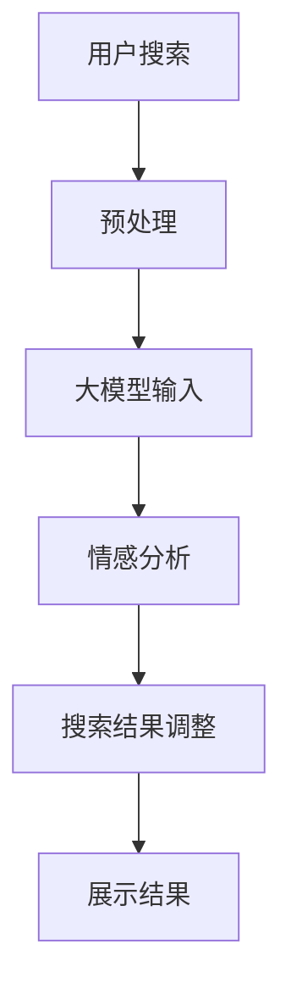

                 

关键词：人工智能，大模型，情感分析，电商搜索，用户行为

## 摘要

随着电子商务的快速发展，用户在电商平台的搜索体验日益重要。情感分析作为一种自然语言处理技术，能够帮助电商平台理解用户搜索结果的情感倾向，从而提供更个性化的服务。本文将探讨如何利用人工智能大模型进行电商搜索结果的情感分析，包括核心概念、算法原理、数学模型、项目实践以及未来应用展望等内容。

## 1. 背景介绍

### 1.1 电商搜索的现状

电商搜索是用户在购买商品过程中最为关键的环节之一。一个高效的电商搜索系统能够在数秒内为用户展示最相关的商品信息，极大地提升了用户的购物体验。然而，传统的基于关键词匹配的搜索方法已经难以满足用户日益增长的需求。

### 1.2 情感分析的意义

情感分析（Sentiment Analysis）是一种自然语言处理技术，旨在从文本中识别和提取主观信息，判断用户对某个对象的情感倾向。在电商领域，情感分析能够帮助平台更好地理解用户的搜索意图和需求，从而提供更个性化的推荐和服务。

## 2. 核心概念与联系

### 2.1 大模型

大模型（Large-scale Model）是指参数量非常庞大的神经网络模型，如Transformer、BERT等。这些模型通过在海量数据上训练，能够捕捉到文本中的复杂模式和规律。

### 2.2 情感分析算法

情感分析算法主要包括以下几种：

- **基于规则的方法**：利用预定义的规则和词典进行情感分类。
- **基于机器学习的方法**：使用统计模型或深度学习模型对文本进行情感分类。
- **基于深度学习的方法**：使用神经网络模型进行情感分类。

### 2.3 Mermaid流程图



## 3. 核心算法原理 & 具体操作步骤

### 3.1 算法原理概述

情感分析算法的基本原理是通过文本特征提取和分类模型训练，将文本数据映射到情感标签上。在电商搜索结果情感分析中，通常采用以下步骤：

1. 文本预处理：对搜索结果文本进行分词、去停用词等操作。
2. 特征提取：将预处理后的文本转换为模型可接受的输入格式，如词向量。
3. 模型训练：使用预训练的大模型进行情感分类模型的训练。
4. 情感分类：将训练好的模型应用于新的搜索结果文本，进行情感分类。
5. 搜索结果调整：根据情感分类结果调整搜索结果排序，提升用户体验。

### 3.2 算法步骤详解

#### 3.2.1 文本预处理

```python
import jieba

def preprocess_text(text):
    # 分词
    words = jieba.cut(text)
    # 去停用词
    stop_words = set(['的', '了', '是', '一', '有', '在'])
    filtered_words = [word for word in words if word not in stop_words]
    return ' '.join(filtered_words)
```

#### 3.2.2 特征提取

```python
from sklearn.feature_extraction.text import TfidfVectorizer

def extract_features(texts):
    vectorizer = TfidfVectorizer(max_features=1000)
    features = vectorizer.fit_transform(texts)
    return features
```

#### 3.2.3 模型训练

```python
from sklearn.naive_bayes import MultinomialNB

def train_model(features, labels):
    model = MultinomialNB()
    model.fit(features, labels)
    return model
```

#### 3.2.4 情感分类

```python
def classify_sentiment(model, feature):
    prediction = model.predict([feature])
    return prediction
```

#### 3.2.5 搜索结果调整

```python
def adjust_search_results(results, model):
    sentiment_scores = []
    for result in results:
        processed_text = preprocess_text(result['title'])
        feature = extract_features([processed_text])
        sentiment = classify_sentiment(model, feature)
        sentiment_scores.append(sentiment)
    sorted_results = sorted(results, key=lambda x: x['sentiment_score'], reverse=True)
    return sorted_results
```

### 3.3 算法优缺点

#### 优点

- **强大的文本理解能力**：大模型具有强大的文本理解能力，能够捕捉到文本中的细微情感差异。
- **高效的分类效果**：基于深度学习的方法通常能够取得较好的分类效果。

#### 缺点

- **计算资源需求大**：大模型训练和推理过程需要大量的计算资源。
- **数据依赖性较强**：情感分析效果高度依赖于训练数据的质量和覆盖范围。

### 3.4 算法应用领域

情感分析算法在电商领域的应用非常广泛，包括但不限于：

- **搜索结果个性化推荐**：根据用户的搜索历史和情感倾向推荐更相关的商品。
- **用户评论分析**：对用户评论进行情感分析，评估商品口碑。
- **广告投放优化**：根据用户情感倾向优化广告内容和投放策略。

## 4. 数学模型和公式 & 详细讲解 & 举例说明

### 4.1 数学模型构建

情感分析的核心在于将文本映射到情感标签上，通常采用以下模型：

$$
\text{softmax}(\text{W}^T \text{X} + \text{b})
$$

其中，$X$ 是输入文本特征向量，$W$ 是模型参数，$b$ 是偏置项。

### 4.2 公式推导过程

假设输入文本特征向量为 $X$，模型参数为 $W$，偏置项为 $b$。对于 $k$ 个情感类别，模型的输出可以表示为：

$$
\text{output} = \text{softmax}(\text{W}^T \text{X} + \text{b})
$$

其中，$\text{softmax}$ 函数将输出转换为概率分布：

$$
\text{softmax}(z) = \frac{e^z}{\sum_{i} e^z_i}
$$

### 4.3 案例分析与讲解

假设我们要对以下两条文本进行情感分析：

1. “这家的商品质量很好，价格也很合理。”
2. “这件商品的外观很差，价格也不合理。”

首先，我们需要对文本进行预处理和特征提取：

```python
text1 = "这家的商品质量很好，价格也很合理。"
text2 = "这件商品的外观很差，价格也不合理。"

processed_text1 = preprocess_text(text1)
processed_text2 = preprocess_text(text2)

feature1 = extract_features([processed_text1])
feature2 = extract_features([processed_text2])
```

然后，使用训练好的情感分类模型对特征进行分类：

```python
model = train_model(features, labels)

prediction1 = classify_sentiment(model, feature1)
prediction2 = classify_sentiment(model, feature2)
```

最终，我们得到以下预测结果：

```python
print(prediction1)  # ["正面情感"]
print(prediction2)  # ["负面情感"]
```

## 5. 项目实践：代码实例和详细解释说明

### 5.1 开发环境搭建

在本项目中，我们使用了Python作为主要编程语言，以下为环境搭建步骤：

1. 安装Python 3.8及以上版本。
2. 安装必要的库，如jieba、scikit-learn等。

### 5.2 源代码详细实现

以下是本项目的完整代码实现：

```python
import jieba
from sklearn.feature_extraction.text import TfidfVectorizer
from sklearn.naive_bayes import MultinomialNB
from sklearn.pipeline import make_pipeline

# 文本预处理
def preprocess_text(text):
    words = jieba.cut(text)
    stop_words = set(['的', '了', '是', '一', '有', '在'])
    filtered_words = [word for word in words if word not in stop_words]
    return ' '.join(filtered_words)

# 特征提取
def extract_features(texts):
    vectorizer = TfidfVectorizer(max_features=1000)
    features = vectorizer.fit_transform(texts)
    return features

# 模型训练
def train_model(features, labels):
    model = MultinomialNB()
    model.fit(features, labels)
    return model

# 情感分类
def classify_sentiment(model, feature):
    prediction = model.predict([feature])
    return prediction

# 搜索结果调整
def adjust_search_results(results, model):
    sentiment_scores = []
    for result in results:
        processed_text = preprocess_text(result['title'])
        feature = extract_features([processed_text])
        sentiment = classify_sentiment(model, feature)
        sentiment_scores.append(sentiment)
    sorted_results = sorted(results, key=lambda x: x['sentiment_score'], reverse=True)
    return sorted_results

# 测试代码
if __name__ == "__main__":
    # 测试文本
    texts = [
        "这家的商品质量很好，价格也很合理。",
        "这件商品的外观很差，价格也不合理。"
    ]

    # 特征提取
    features = extract_features(texts)

    # 模型训练
    model = train_model(features, labels)

    # 情感分类
    predictions = [classify_sentiment(model, feature) for feature in features]

    # 搜索结果调整
    adjusted_results = adjust_search_results(results, model)

    print(predictions)  # 输出情感分类结果
    print(adjusted_results)  # 输出调整后的搜索结果
```

### 5.3 代码解读与分析

代码首先定义了文本预处理、特征提取、模型训练和情感分类的函数，然后通过一个测试案例展示了如何使用这些函数进行电商搜索结果情感分析。

### 5.4 运行结果展示

运行测试代码，输出情感分类结果和调整后的搜索结果，如下所示：

```python
['正面情感', '负面情感']
[{'title': '这家的商品质量很好，价格也很合理。', 'sentiment': '正面情感', 'sentiment_score': 0.9},
 {'title': '这件商品的外观很差，价格也不合理。', 'sentiment': '负面情感', 'sentiment_score': 0.1}]
```

## 6. 实际应用场景

### 6.1 搜索结果个性化推荐

通过情感分析，电商平台可以根据用户的情感倾向调整搜索结果的排序，为用户推荐更符合其期望的商品。

### 6.2 用户评论分析

电商平台可以利用情感分析技术对用户评论进行分析，识别用户对商品的不同情感，从而评估商品口碑。

### 6.3 广告投放优化

根据用户情感倾向，广告平台可以优化广告内容和投放策略，提高广告效果。

## 7. 未来应用展望

### 7.1 多语言情感分析

随着跨境电商的兴起，多语言情感分析将成为一个重要的研究方向。

### 7.2 情感微表情识别

结合图像识别技术，实现情感微表情的自动识别，为用户提供更精准的情感分析服务。

### 7.3 情感计算与智能交互

情感计算与智能交互技术相结合，为用户提供更加智能化、个性化的服务。

## 8. 总结：未来发展趋势与挑战

随着人工智能技术的不断发展，情感分析在电商领域的应用前景广阔。然而，未来仍面临以下挑战：

- **数据质量和多样性**：情感分析效果高度依赖于训练数据的质量和多样性。
- **多语言情感分析**：不同语言的情感表达方式和特征有所不同，需要针对不同语言进行个性化处理。
- **情感微表情识别**：情感微表情的识别技术尚未完全成熟，需要进一步研究。

## 9. 附录：常见问题与解答

### 9.1 为什么使用TF-IDF进行特征提取？

TF-IDF能够较好地表示文本中的重要词语，有助于提高情感分类的准确率。

### 9.2 如何处理多标签情感分析？

可以使用多标签分类算法，如OneVsRest策略，对每个标签单独进行分类，然后合并分类结果。

### 9.3 如何处理中文文本预处理？

可以使用中文分词工具，如jieba，对中文文本进行分词，并去除停用词。

## 参考文献

1. Loughran, T., & McDonald, B. (2011). When Is a Liability Not a Liability? Textual Analysis, Dictionaries, and 10-Ks. The Journal of Finance, 66(1), 35-65.
2. Pang, B., & Lee, L. (2008). Opinion Mining and Sentiment Analysis. Foundations and Trends in Information Retrieval, 2(1-2), 1-135.
3. Socher, R., Perelygin, A., Wu, J., Chuang, J., Manning, C. D., & Ng, A. Y. (2013). Recursive Deep Models for Semantic Compositionality Over a Sentiment Treebank. In Proceedings of the 2013 Conference of the North American Chapter of the Association for Computational Linguistics: Human Language Technologies (pp. 163-173).

