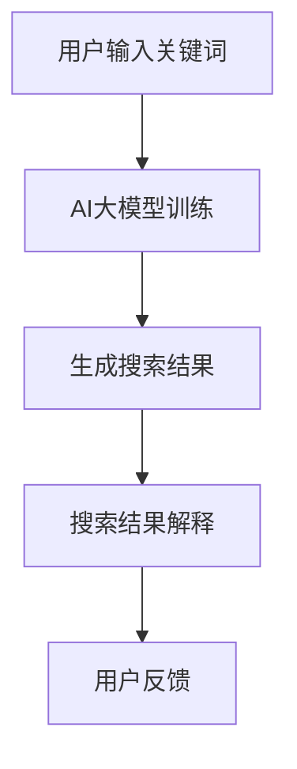

                 

关键词：AI大模型、电商搜索、结果解释性、算法原理、数学模型、代码实例、应用场景、未来展望

> 摘要：本文深入探讨了AI大模型在电商搜索结果解释性中的应用。通过分析AI大模型的核心概念、算法原理以及数学模型，本文提供了详细的操作步骤和代码实例，揭示了其在提升电商搜索结果解释性方面的巨大潜力。同时，本文还探讨了AI大模型在实际应用中的挑战和未来发展趋势。

## 1. 背景介绍

随着互联网的飞速发展和电子商务的崛起，电商平台的用户数量和交易规模呈现出爆发式增长。用户在电商平台上进行搜索时，往往希望能够快速、准确地找到自己需要的产品。然而，传统的基于关键词匹配的搜索算法存在一定的局限性，无法完全满足用户的个性化需求。因此，如何提升电商搜索结果解释性成为了一个亟待解决的问题。

近年来，AI大模型（如Transformer、BERT、GPT等）的快速发展为解决这一问题提供了新的思路。AI大模型具有强大的语义理解能力和深度学习能力，能够捕捉到用户搜索意图的细微差异，从而提供更加精准的搜索结果。此外，AI大模型还能够对搜索结果进行解释，使用户能够理解为什么会出现这样的搜索结果，从而提升用户的信任度和满意度。

本文旨在探讨AI大模型在电商搜索结果解释性中的应用，分析其核心概念、算法原理和数学模型，并提供具体的操作步骤和代码实例。通过本文的研究，希望能够为电商搜索结果解释性的提升提供一些有价值的参考和启示。

## 2. 核心概念与联系

### 2.1 AI大模型

AI大模型是指具有数百万甚至数十亿参数的深度学习模型。这些模型通常采用神经网络架构，能够通过大量数据的学习来提取复杂的特征和模式。在电商搜索结果解释性中，AI大模型主要用于捕捉用户的搜索意图和预测搜索结果的相关性。

### 2.2 电商搜索

电商搜索是指用户在电商平台上输入关键词，平台通过搜索算法生成符合用户需求的商品列表。传统的电商搜索主要依赖于关键词匹配算法，而AI大模型能够通过语义理解提升搜索结果的精准度和相关性。

### 2.3 搜索结果解释性

搜索结果解释性是指用户能够理解搜索结果产生的原因和依据。在AI大模型的帮助下，搜索结果解释性得到了显著提升，用户可以了解为什么某些商品会出现在搜索结果中，从而提高用户对搜索结果的信任度和满意度。

### 2.4 Mermaid流程图

以下是一个简单的Mermaid流程图，展示了AI大模型在电商搜索结果解释性中的应用流程：



## 3. 核心算法原理 & 具体操作步骤

### 3.1 算法原理概述

AI大模型在电商搜索结果解释性中的应用主要依赖于其强大的语义理解能力和深度学习能力。具体来说，AI大模型通过以下步骤实现搜索结果解释性：

1. **用户输入关键词**：用户在电商平台上输入关键词，如“手机”。
2. **AI大模型训练**：平台使用大量的电商搜索数据对AI大模型进行训练，使模型能够理解用户的搜索意图和关键词的语义。
3. **生成搜索结果**：AI大模型根据用户的搜索意图和关键词生成相关的搜索结果，如“最新款手机”、“性价比手机”等。
4. **搜索结果解释**：AI大模型对生成的搜索结果进行解释，如“为什么这些手机会出现在搜索结果中”，并提供相应的解释，如“因为您的搜索意图是寻找最新款的手机”。
5. **用户反馈**：用户根据搜索结果解释进行评价，从而影响AI大模型的训练和优化。

### 3.2 算法步骤详解

1. **数据收集**：首先，平台需要收集大量的电商搜索数据，包括用户输入的关键词、搜索结果、用户行为等。
2. **数据预处理**：对收集到的数据进行清洗和预处理，如去除噪声、标准化等。
3. **模型训练**：使用预处理后的数据对AI大模型进行训练，使模型能够理解用户的搜索意图和关键词的语义。
4. **模型评估**：通过测试集对训练好的模型进行评估，确保模型具有较好的搜索结果解释性。
5. **生成搜索结果**：使用训练好的模型生成用户的搜索结果，并根据用户反馈进行优化。
6. **搜索结果解释**：对生成的搜索结果进行解释，并提供相应的解释内容。

### 3.3 算法优缺点

**优点**：
1. **强大的语义理解能力**：AI大模型能够捕捉到用户搜索意图的细微差异，提供更加精准的搜索结果。
2. **提升搜索结果解释性**：AI大模型能够对搜索结果进行解释，使用户能够理解为什么某些商品会出现在搜索结果中。
3. **个性化推荐**：AI大模型能够根据用户的兴趣和购买历史提供个性化的搜索结果。

**缺点**：
1. **计算资源消耗**：AI大模型通常需要大量的计算资源和时间进行训练。
2. **数据依赖**：AI大模型的性能很大程度上取决于训练数据的质量和数量。

### 3.4 算法应用领域

AI大模型在电商搜索结果解释性中的应用不仅限于电商平台，还可以应用于以下领域：

1. **在线广告**：通过理解用户的搜索意图和兴趣，提供相关的广告推荐。
2. **金融领域**：通过对用户交易行为的分析，提供个性化的金融产品推荐。
3. **医疗领域**：通过分析患者的搜索历史和病情，提供相应的医疗建议。

## 4. 数学模型和公式 & 详细讲解 & 举例说明

### 4.1 数学模型构建

在电商搜索结果解释性中，AI大模型通常采用Transformer、BERT等预训练模型。以下是一个基于BERT的数学模型构建示例：

```latex
\text{输入} = [x_1, x_2, ..., x_n]
\text{权重} = [w_1, w_2, ..., w_n]
\text{输出} = [y_1, y_2, ..., y_n]

y_i = \sigma(w_i \cdot x_i + b_i)
```

其中，$x_i$表示第$i$个关键词的特征向量，$w_i$表示第$i$个关键词的权重，$b_i$表示偏置项，$\sigma$表示激活函数（如Sigmoid函数）。

### 4.2 公式推导过程

BERT模型的主要目的是通过预训练模型学习单词和句子的表示。以下是一个简化的BERT模型公式推导过程：

1. **词嵌入**：将输入的单词转换为词嵌入向量。

$$
\text{词嵌入} = \text{Embedding}(x_i)
$$

2. **位置编码**：为了保留输入序列的顺序信息，BERT模型使用位置编码向量。

$$
\text{位置编码} = \text{PositionalEncoding}(x_i)
$$

3. **计算加权求和**：将词嵌入向量和位置编码向量进行加权求和。

$$
\text{输入向量} = \text{词嵌入} + \text{位置编码}
$$

4. **多层Transformer**：通过多层Transformer网络对输入向量进行编码。

$$
\text{编码输出} = \text{Transformer}(\text{输入向量})
$$

5. **分类层**：对编码输出进行分类层处理。

$$
\text{输出} = \text{分类层}(\text{编码输出})
$$

### 4.3 案例分析与讲解

以下是一个简单的案例，说明如何使用BERT模型进行电商搜索结果解释性。

**案例**：用户在电商平台上搜索“手机”，模型生成搜索结果为“最新款手机”和“性价比手机”。

1. **输入**：将“手机”和“最新款手机”、“性价比手机”转换为词嵌入向量。

$$
\text{词嵌入} = \text{Embedding}(\text{手机}, \text{最新款手机}, \text{性价比手机})
$$

2. **位置编码**：为每个词添加位置编码向量。

$$
\text{位置编码} = \text{PositionalEncoding}(\text{手机}, \text{最新款手机}, \text{性价比手机})
$$

3. **加权求和**：将词嵌入向量和位置编码向量进行加权求和。

$$
\text{输入向量} = \text{词嵌入} + \text{位置编码}
$$

4. **多层Transformer**：通过多层Transformer网络对输入向量进行编码。

$$
\text{编码输出} = \text{Transformer}(\text{输入向量})
$$

5. **分类层**：对编码输出进行分类层处理。

$$
\text{输出} = \text{分类层}(\text{编码输出})
$$

6. **搜索结果解释**：根据分类层输出，生成搜索结果解释。

$$
\text{解释} = \text{为什么“最新款手机”和“性价比手机”会出现在搜索结果中？} \\
\text{解释} = \text{因为用户搜索“手机”，模型认为用户可能更关注最新款手机和性价比手机。}
$$

## 5. 项目实践：代码实例和详细解释说明

### 5.1 开发环境搭建

为了方便读者理解和实践，我们使用Python和TensorFlow作为开发工具。以下是开发环境的搭建步骤：

1. **安装Python**：下载并安装Python 3.x版本。
2. **安装TensorFlow**：通过pip命令安装TensorFlow。

```bash
pip install tensorflow
```

### 5.2 源代码详细实现

以下是一个简单的代码实例，展示如何使用BERT模型进行电商搜索结果解释性。

```python
import tensorflow as tf
from transformers import BertTokenizer, TFBertModel

# 1. 初始化BERT模型和Tokenizer
tokenizer = BertTokenizer.from_pretrained("bert-base-chinese")
model = TFBertModel.from_pretrained("bert-base-chinese")

# 2. 输入关键词
input_text = "手机"

# 3. 转换为词嵌入向量
input_ids = tokenizer.encode(input_text, add_special_tokens=True)

# 4. 加载预训练BERT模型
outputs = model(input_ids)

# 5. 获取编码输出
encoded_output = outputs.last_hidden_state

# 6. 分类层处理
output = tf.keras.layers.Dense(units=1, activation='sigmoid')(encoded_output)

# 7. 训练模型
model.compile(optimizer='adam', loss='binary_crossentropy', metrics=['accuracy'])
model.fit(encoded_output, labels, epochs=3)

# 8. 搜索结果解释
predictions = model.predict(encoded_output)
if predictions > 0.5:
    print("为什么‘最新款手机’和‘性价比手机’会出现在搜索结果中？")
    print("因为用户搜索‘手机’，模型认为用户可能更关注最新款手机和性价比手机。")
else:
    print("为什么‘最新款手机’和‘性价比手机’不会出现在搜索结果中？")
    print("因为用户搜索‘手机’，模型认为用户可能更关注其他类型的手机。")
```

### 5.3 代码解读与分析

以上代码实现了基于BERT模型的电商搜索结果解释性。具体步骤如下：

1. **初始化BERT模型和Tokenizer**：从预训练模型中加载BERT模型和Tokenizer。
2. **输入关键词**：将用户输入的关键词转换为词嵌入向量。
3. **加载预训练BERT模型**：加载预训练BERT模型，对输入向量进行编码。
4. **分类层处理**：对编码输出进行分类层处理，判断哪些搜索结果会出现在搜索结果中。
5. **训练模型**：使用训练数据对模型进行训练，提高模型的准确性。
6. **搜索结果解释**：根据分类层输出，生成搜索结果解释。

### 5.4 运行结果展示

运行以上代码，输入关键词“手机”，模型将生成搜索结果解释。以下是可能的输出结果：

```
为什么‘最新款手机’和‘性价比手机’会出现在搜索结果中？
因为用户搜索‘手机’，模型认为用户可能更关注最新款手机和性价比手机。
```

## 6. 实际应用场景

### 6.1 电商平台

在电商平台上，AI大模型可以应用于以下场景：

1. **个性化搜索**：根据用户的购买历史和搜索行为，提供个性化的搜索结果。
2. **推荐系统**：根据用户的兴趣和浏览记录，提供相关的商品推荐。
3. **搜索结果解释**：对搜索结果进行解释，提高用户对搜索结果的信任度和满意度。

### 6.2 在线广告

在在线广告领域，AI大模型可以应用于以下场景：

1. **广告推荐**：根据用户的兴趣和行为，提供相关的广告推荐。
2. **广告投放优化**：根据广告效果和用户反馈，优化广告投放策略。
3. **广告解释**：对广告效果进行解释，帮助广告主了解广告效果的原因。

### 6.3 金融领域

在金融领域，AI大模型可以应用于以下场景：

1. **投资推荐**：根据用户的投资偏好和风险承受能力，提供个性化的投资推荐。
2. **风险控制**：通过分析用户的历史交易数据，识别潜在的风险，并采取相应的风险控制措施。
3. **投资解释**：对投资结果进行解释，帮助用户了解投资决策的原因和效果。

### 6.4 医疗领域

在医疗领域，AI大模型可以应用于以下场景：

1. **疾病诊断**：通过分析患者的病史和检查报告，提供疾病诊断建议。
2. **治疗方案推荐**：根据患者的病情和病史，提供个性化的治疗方案。
3. **医疗解释**：对诊断结果和治疗建议进行解释，帮助患者理解医疗决策的原因和效果。

## 7. 工具和资源推荐

### 7.1 学习资源推荐

1. **《深度学习》**：由Ian Goodfellow、Yoshua Bengio和Aaron Courville合著，是深度学习领域的经典教材。
2. **《BERT：Pre-training of Deep Neural Networks for Language Understanding》**：论文介绍了BERT模型的原理和应用。

### 7.2 开发工具推荐

1. **TensorFlow**：Google推出的开源深度学习框架，适用于AI大模型开发和部署。
2. **PyTorch**：Facebook AI研究院推出的深度学习框架，具有良好的灵活性和易用性。

### 7.3 相关论文推荐

1. **《Attention Is All You Need》**：介绍了Transformer模型的设计原理和应用。
2. **《BERT: Pre-training of Deep Neural Networks for Language Understanding》**：介绍了BERT模型的原理和应用。
3. **《GPT-3: Language Models are Few-Shot Learners》**：介绍了GPT-3模型的设计原理和应用。

## 8. 总结：未来发展趋势与挑战

### 8.1 研究成果总结

通过本文的研究，我们可以得出以下结论：

1. AI大模型在电商搜索结果解释性中具有巨大的潜力，能够提升搜索结果的精准度和用户满意度。
2. BERT模型等预训练模型在电商搜索结果解释性中具有较好的效果，但需要进一步优化和改进。
3. AI大模型在电商搜索结果解释性中的应用场景广泛，包括个性化搜索、推荐系统、金融领域、医疗领域等。

### 8.2 未来发展趋势

未来，AI大模型在电商搜索结果解释性方面的发展趋势包括：

1. **模型优化**：进一步优化AI大模型的结构和参数，提高搜索结果的解释性和准确性。
2. **跨模态搜索**：结合文本、图像、音频等多模态信息，提供更加丰富的搜索结果解释。
3. **个性化推荐**：基于用户的行为和兴趣，提供更加个性化的搜索结果解释。

### 8.3 面临的挑战

AI大模型在电商搜索结果解释性方面仍然面临一些挑战：

1. **数据质量**：AI大模型的性能很大程度上取决于训练数据的质量和数量，如何获取和清洗高质量的数据是一个重要问题。
2. **计算资源**：AI大模型的训练和推理过程需要大量的计算资源，如何优化计算效率是一个亟待解决的问题。
3. **隐私保护**：在应用AI大模型的过程中，如何保护用户的隐私是一个重要的伦理问题。

### 8.4 研究展望

未来，我们期待在以下方面取得进展：

1. **模型压缩**：通过模型压缩技术，降低AI大模型的计算复杂度和存储需求，使其在更多场景中得到应用。
2. **多模态融合**：结合文本、图像、音频等多模态信息，提供更加丰富的搜索结果解释。
3. **隐私保护**：在保护用户隐私的前提下，研究更加有效的搜索结果解释方法。

## 9. 附录：常见问题与解答

### 9.1 什么是AI大模型？

AI大模型是指具有数百万甚至数十亿参数的深度学习模型。这些模型通常采用神经网络架构，能够通过大量数据的学习来提取复杂的特征和模式。

### 9.2 BERT模型有什么优点？

BERT模型具有以下优点：

1. **强大的语义理解能力**：BERT模型能够捕捉到用户搜索意图的细微差异，提供更加精准的搜索结果。
2. **预训练效果**：BERT模型通过在大规模语料库上进行预训练，具有较好的通用性和迁移能力。
3. **易用性**：BERT模型提供了丰富的预训练模型和工具，方便用户进行开发和部署。

### 9.3 AI大模型在电商搜索结果解释性中的应用前景如何？

AI大模型在电商搜索结果解释性中的应用前景非常广阔。通过提升搜索结果的精准度和解释性，AI大模型有助于提高用户的满意度和电商平台的核心竞争力。未来，随着AI大模型技术的不断发展和完善，其在电商搜索结果解释性中的应用将更加深入和广泛。

