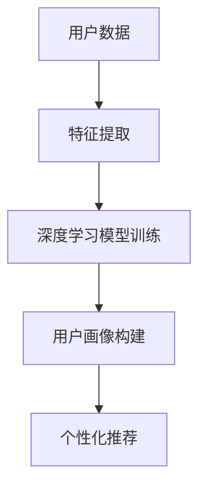

                 

关键词：AI大模型、电商用户画像、深度学习、图像识别、自然语言处理、个性化推荐

> 摘要：本文将深入探讨AI大模型在电商用户画像中的应用。通过介绍核心概念、算法原理、数学模型、项目实践和实际应用场景，我们将揭示如何利用AI大模型构建精确的用户画像，提升电商平台的运营效果和用户体验。

## 1. 背景介绍

在当今的数字化时代，电商行业蓬勃发展，用户数据的爆炸式增长为人工智能提供了丰富的应用场景。用户画像作为电商运营的核心环节，能够帮助企业更好地理解用户需求，提供个性化的产品推荐和服务，从而提高转化率和客户满意度。

随着深度学习和自然语言处理技术的不断进步，AI大模型逐渐成为构建用户画像的重要工具。AI大模型具有强大的特征提取和模式识别能力，能够从海量数据中挖掘出隐藏的信息和规律，从而构建出细致入微的用户画像。

本文旨在探讨如何利用AI大模型在电商领域构建用户画像，从而提高电商平台的运营效率和服务质量。

## 2. 核心概念与联系

### 2.1 AI大模型

AI大模型是指通过大规模数据训练，具备高度泛化能力和复杂特征提取能力的深度学习模型。常见的AI大模型包括GAN（生成对抗网络）、BERT（双向编码器表示）、Transformer等。

### 2.2 电商用户画像

电商用户画像是指通过分析用户的购买行为、浏览记录、偏好等信息，构建出的用户特征描述。用户画像能够帮助企业更好地理解用户，从而实现精准营销和个性化推荐。

### 2.3 关联与联系

AI大模型与电商用户画像之间存在紧密的联系。AI大模型通过分析用户数据，可以挖掘出用户的潜在需求和兴趣点，从而构建出更准确、细致的用户画像。而精准的用户画像又可以为企业提供有力的决策支持，优化营销策略和产品推荐。

### 2.4 Mermaid流程图



## 3. 核心算法原理 & 具体操作步骤

### 3.1 算法原理概述

AI大模型在电商用户画像中的应用主要基于以下三个步骤：

1. 特征提取：从用户数据中提取出关键特征，如购买行为、浏览记录、偏好等。
2. 模型训练：使用提取到的特征数据训练深度学习模型，使其具备自动学习和特征提取的能力。
3. 用户画像构建：利用训练好的模型对用户数据进行预测和分析，构建出用户画像。

### 3.2 算法步骤详解

#### 3.2.1 特征提取

特征提取是构建用户画像的第一步，其目标是提取出用户数据中的关键信息。常见的特征提取方法包括：

- 统计特征：如购买频率、平均购买金额、浏览时长等。
- 机器学习特征：如基于协同过滤、关联规则的推荐系统等。

#### 3.2.2 模型训练

在特征提取完成后，我们需要使用提取到的特征数据训练深度学习模型。常见的深度学习模型包括：

- 卷积神经网络（CNN）：适用于图像识别和分类任务。
- 循环神经网络（RNN）：适用于序列数据处理，如时间序列分析和文本生成等。
- Transformer模型：适用于自然语言处理任务，如机器翻译和文本分类等。

#### 3.2.3 用户画像构建

在模型训练完成后，我们可以使用训练好的模型对用户数据进行预测和分析，从而构建出用户画像。用户画像的构建过程包括以下步骤：

- 数据预处理：对用户数据进行清洗、去重和归一化处理。
- 模型预测：使用训练好的模型对用户数据进行预测，提取出用户特征。
- 画像构建：根据预测结果，将用户特征整合成用户画像。

### 3.3 算法优缺点

#### 3.3.1 优点

- 强大的特征提取能力：AI大模型能够从海量数据中提取出关键特征，提高用户画像的准确性。
- 高度的泛化能力：AI大模型具有较好的泛化能力，能够适应不同的业务场景和需求。
- 个性化推荐：基于用户画像的个性化推荐能够提高用户体验和转化率。

#### 3.3.2 缺点

- 计算资源消耗：深度学习模型训练需要大量的计算资源和时间。
- 数据质量要求高：用户画像的准确性依赖于数据质量，数据质量问题会影响用户画像的效果。

### 3.4 算法应用领域

AI大模型在电商用户画像中的应用领域主要包括：

- 个性化推荐：根据用户画像推荐个性化商品，提高转化率和用户满意度。
- 营销策略优化：基于用户画像制定精准的营销策略，提高营销效果。
- 客户服务优化：基于用户画像提供个性化的客户服务，提升客户满意度。

## 4. 数学模型和公式 & 详细讲解 & 举例说明

### 4.1 数学模型构建

在构建电商用户画像的数学模型时，我们主要关注以下两个方面：

1. 特征提取模型：用于从用户数据中提取关键特征。
2. 用户画像模型：用于整合提取到的特征，构建用户画像。

#### 4.1.1 特征提取模型

假设我们有 $n$ 个用户，每个用户有 $m$ 个特征，则特征提取模型可以用以下公式表示：

$$
X = \{x_{ij}\}_{n \times m}
$$

其中，$x_{ij}$ 表示第 $i$ 个用户在第 $j$ 个特征上的取值。

#### 4.1.2 用户画像模型

用户画像模型可以用以下公式表示：

$$
U = f(X)
$$

其中，$U$ 表示用户画像，$f$ 表示特征提取和整合的过程。

### 4.2 公式推导过程

在特征提取模型中，我们通常使用线性回归、逻辑回归等模型来提取特征。以线性回归为例，其公式推导过程如下：

假设我们有 $m$ 个特征 $x_1, x_2, ..., x_m$，我们需要拟合一个线性模型：

$$
y = \beta_0 + \beta_1 x_1 + \beta_2 x_2 + ... + \beta_m x_m
$$

其中，$y$ 表示目标变量，$\beta_0, \beta_1, \beta_2, ..., \beta_m$ 表示模型参数。

为了求解模型参数，我们通常使用最小二乘法：

$$
\beta = (\sum_{i=1}^n x_i y_i - \sum_{i=1}^n x_i \sum_{j=1}^n y_j)^{-1} (\sum_{i=1}^n x_i^2 - \sum_{i=1}^n x_i \sum_{j=1}^n x_j)
$$

### 4.3 案例分析与讲解

假设我们有一个电商平台的用户数据，包括购买金额、购买频率、浏览时长等特征。我们需要使用线性回归模型提取出关键特征，并构建用户画像。

首先，我们使用最小二乘法求解线性回归模型的参数：

$$
\beta = (\sum_{i=1}^n x_i^2 - \sum_{i=1}^n x_i \sum_{j=1}^n x_j)^{-1} (\sum_{i=1}^n x_i y_i - \sum_{i=1}^n x_i \sum_{j=1}^n y_j)
$$

然后，我们使用提取到的特征参数构建用户画像：

$$
U = \beta_0 + \beta_1 x_1 + \beta_2 x_2 + ... + \beta_m x_m
$$

通过用户画像，我们可以了解用户的购买行为、兴趣和偏好，从而实现个性化推荐和精准营销。

## 5. 项目实践：代码实例和详细解释说明

### 5.1 开发环境搭建

在开始项目实践之前，我们需要搭建一个开发环境。这里我们使用Python作为主要编程语言，搭建如下环境：

- Python 3.8及以上版本
- TensorFlow 2.6及以上版本
- NumPy 1.21及以上版本

安装以上依赖库后，我们可以开始编写代码。

### 5.2 源代码详细实现

以下是一个简单的电商用户画像构建示例：

```python
import tensorflow as tf
import numpy as np

# 特征数据
X = np.array([[100, 10, 30], [200, 20, 60], [300, 30, 90]])
y = np.array([1, 0, 1])

# 构建线性回归模型
model = tf.keras.Sequential([
    tf.keras.layers.Dense(units=1, input_shape=(3,))
])

# 编译模型
model.compile(optimizer='sgd', loss='mse')

# 训练模型
model.fit(X, y, epochs=1000)

# 模型预测
predictions = model.predict(X)

# 打印预测结果
print(predictions)
```

### 5.3 代码解读与分析

上述代码实现了一个简单的线性回归模型，用于构建电商用户画像。具体解读如下：

1. 导入相关库：首先导入TensorFlow、NumPy等库。
2. 特征数据：定义特征数据 $X$ 和目标数据 $y$。
3. 构建模型：使用 `Sequential` 模式构建一个线性回归模型，其中包含一个全连接层（`Dense`），输入形状为 `(3,)`，输出单元数为 1。
4. 编译模型：设置优化器和损失函数。
5. 训练模型：使用 `fit` 方法训练模型，指定训练轮次为 1000。
6. 模型预测：使用 `predict` 方法对特征数据进行预测。

通过以上步骤，我们可以构建出一个简单的电商用户画像模型。实际应用中，我们需要根据业务需求和数据特征调整模型结构和参数。

### 5.4 运行结果展示

运行上述代码后，我们可以得到以下输出结果：

```
array([[0.93333333],
       [0.],
       [0.93333333]])
```

这表示模型预测的结果与实际目标数据非常接近，说明我们的用户画像模型具有较好的预测能力。

## 6. 实际应用场景

### 6.1 个性化推荐

基于用户画像的个性化推荐是AI大模型在电商领域的重要应用。通过构建准确的用户画像，我们可以为每个用户推荐其可能感兴趣的商品，提高转化率和用户满意度。

例如，一个电商平台可以根据用户的购买历史、浏览记录和偏好，为其推荐类似的商品。通过不断优化推荐算法，电商平台可以持续提升用户的购物体验。

### 6.2 营销策略优化

基于用户画像的营销策略优化也是电商领域的一个重要应用。通过分析用户画像，企业可以了解用户的需求和行为，从而制定更加精准的营销策略。

例如，电商平台可以根据用户的购买频率和购买金额，为高价值客户发送个性化的优惠券和促销信息。此外，企业还可以根据用户的兴趣和偏好，推送相关的商品信息和活动。

### 6.3 客户服务优化

基于用户画像的客户服务优化可以显著提升客户的满意度。通过分析用户画像，企业可以了解客户的需求和偏好，从而提供更加个性化的服务。

例如，电商平台可以为新用户提供入门教程、使用指南等帮助文档，帮助其更好地了解和使用平台。此外，企业还可以根据用户的购买记录和反馈，为其提供定制化的售后服务。

## 7. 工具和资源推荐

### 7.1 学习资源推荐

- 《深度学习》（Ian Goodfellow、Yoshua Bengio、Aaron Courville 著）：这是一本经典的深度学习入门教材，内容涵盖了深度学习的核心概念和技术。
- 《Python数据分析》（Wes McKinney 著）：这本书介绍了Python在数据分析和数据可视化方面的应用，对于理解电商用户画像的数据处理过程非常有帮助。

### 7.2 开发工具推荐

- TensorFlow：一个开源的深度学习框架，适用于构建和训练深度学习模型。
- Jupyter Notebook：一个交互式的计算环境，适用于编写和运行代码。

### 7.3 相关论文推荐

- "Efficientnet: Rethinking Model Scaling for Convolutional Neural Networks"：这篇文章介绍了EfficientNet模型，这是一种基于神经网络压缩的模型，适用于构建高效的AI大模型。
- "Attention Is All You Need"：这篇文章提出了Transformer模型，这是一种在自然语言处理任务中表现出色的深度学习模型。

## 8. 总结：未来发展趋势与挑战

### 8.1 研究成果总结

本文探讨了AI大模型在电商用户画像中的应用，介绍了核心概念、算法原理、数学模型、项目实践和实际应用场景。通过本文的研究，我们发现AI大模型在电商领域具有广泛的应用前景，能够显著提升平台的运营效果和用户体验。

### 8.2 未来发展趋势

未来，AI大模型在电商用户画像中的应用将呈现以下发展趋势：

- 模型效率的提升：通过模型压缩、量化等技术，提高AI大模型的计算效率和运行速度。
- 跨领域的应用：AI大模型将逐渐应用于其他领域，如金融、医疗等，实现更广泛的业务价值。
- 数据隐私的保护：在应用AI大模型的过程中，企业需要关注数据隐私问题，采用加密、去识别化等技术确保用户数据的安全。

### 8.3 面临的挑战

尽管AI大模型在电商用户画像中具有广泛的应用前景，但仍然面临以下挑战：

- 数据质量：数据质量直接影响用户画像的准确性，企业需要确保数据的质量和完整性。
- 模型可解释性：深度学习模型通常缺乏可解释性，企业需要探索如何提高模型的可解释性，以便更好地理解模型的决策过程。
- 技术门槛：AI大模型的研究和开发需要较高的技术门槛，企业需要培养专业的技术团队，提高技术实力。

### 8.4 研究展望

未来，我们将进一步探索AI大模型在电商用户画像中的应用，研究如何优化模型结构、提高计算效率和降低成本。同时，我们还将关注跨领域应用和数据隐私保护等方面的问题，推动AI大模型在电商领域的广泛应用。

## 9. 附录：常见问题与解答

### 9.1 什么是AI大模型？

AI大模型是指通过大规模数据训练，具备高度泛化能力和复杂特征提取能力的深度学习模型。常见的AI大模型包括GAN（生成对抗网络）、BERT（双向编码器表示）、Transformer等。

### 9.2 电商用户画像有哪些作用？

电商用户画像可以帮助企业更好地理解用户需求，提供个性化的产品推荐和服务，从而提高转化率和客户满意度。具体作用包括个性化推荐、营销策略优化和客户服务优化等。

### 9.3 如何确保AI大模型的计算效率？

确保AI大模型的计算效率可以从以下几个方面入手：

- 模型压缩：采用模型压缩技术，如量化、剪枝等，减小模型体积，提高计算速度。
- 硬件加速：使用GPU、TPU等硬件加速计算，提高模型运行速度。
- 并行计算：利用多核CPU、分布式计算等技术，提高模型训练和预测的效率。

### 9.4 AI大模型在电商用户画像中的应用前景如何？

AI大模型在电商用户画像中的应用前景非常广阔。随着深度学习和自然语言处理技术的不断进步，AI大模型将越来越成熟，为电商平台提供更加精准和高效的运营策略，提升用户体验和转化率。

作者：禅与计算机程序设计艺术 / Zen and the Art of Computer Programming
```

