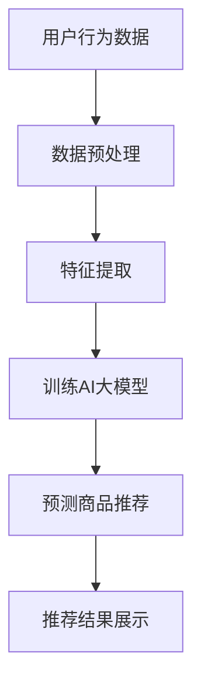

                 

关键词：AI大模型，电商直播，推荐系统，深度学习，数据挖掘

摘要：随着电商直播的迅速发展，如何为用户推荐合适的商品成为关键问题。本文将探讨AI大模型在电商直播推荐中的应用，通过深入分析核心概念、算法原理、数学模型及项目实践，旨在为电商直播推荐系统的研究和开发提供理论依据和实践指导。

## 1. 背景介绍

近年来，电商直播成为电商行业的新宠，它不仅能够实时展示商品，还能通过互动增强用户参与感。然而，随着直播平台的普及和用户数量的增长，如何为大量用户提供个性化的商品推荐成为一个巨大的挑战。

传统的推荐系统主要依赖于基于内容的过滤和协同过滤算法，但它们往往难以处理海量的商品数据和用户的复杂行为。近年来，AI大模型的兴起为推荐系统带来了新的机遇。大模型具有强大的学习能力，可以从海量数据中挖掘出深层次的规律，从而提高推荐精度。

本文旨在探讨AI大模型在电商直播推荐中的应用，通过深入分析核心概念、算法原理、数学模型及项目实践，为电商直播推荐系统的研究和开发提供理论依据和实践指导。

## 2. 核心概念与联系

### 2.1 AI大模型

AI大模型是指具有巨大参数量和复杂结构的神经网络模型，如Transformer、BERT等。它们通过从海量数据中学习，可以捕捉到数据中的深层次特征和规律。

### 2.2 电商直播

电商直播是指通过直播平台进行商品展示和销售的活动。用户可以通过观看直播了解商品信息，并与主播互动，从而提高购买意愿。

### 2.3 推荐系统

推荐系统是一种基于数据挖掘和机器学习技术，旨在为用户提供个性化信息推荐的系统。在电商直播中，推荐系统可以帮助主播发现潜在买家，提高销售转化率。

### 2.4 关联性分析

AI大模型、电商直播和推荐系统之间的关联性在于，AI大模型可以用于构建推荐系统，通过对用户行为数据和商品特征的深度学习，为电商直播提供精准的商品推荐。

### 2.5 Mermaid流程图

以下是一个简单的Mermaid流程图，展示了AI大模型在电商直播推荐系统中的应用流程：



## 3. 核心算法原理 & 具体操作步骤

### 3.1 算法原理概述

AI大模型在电商直播推荐中的应用主要基于深度学习和数据挖掘技术。具体来说，通过以下步骤实现：

1. 数据预处理：对用户行为数据和商品特征进行清洗、转换和标准化处理。
2. 特征提取：从预处理后的数据中提取关键特征，用于训练AI大模型。
3. 训练AI大模型：使用提取的特征数据训练AI大模型，如BERT、Transformer等。
4. 预测商品推荐：利用训练好的大模型对用户进行商品推荐。
5. 推荐结果展示：将推荐结果展示给用户，提高购买转化率。

### 3.2 算法步骤详解

#### 3.2.1 数据预处理

数据预处理是推荐系统中的关键步骤。具体操作包括：

1. 数据清洗：去除重复、缺失和异常数据。
2. 数据转换：将原始数据转换为适合模型训练的格式。
3. 数据标准化：对数据进行归一化或标准化处理，使其具有相似的特征空间。

#### 3.2.2 特征提取

特征提取是提取数据中的关键信息，用于训练AI大模型。具体包括：

1. 用户特征：如用户年龄、性别、浏览记录、购买历史等。
2. 商品特征：如商品类别、价格、销量、评价等。
3. 行为特征：如用户在直播间的停留时间、互动行为、购买意愿等。

#### 3.2.3 训练AI大模型

训练AI大模型是推荐系统的核心。具体操作包括：

1. 模型选择：选择适合电商直播推荐的大模型，如BERT、Transformer等。
2. 模型训练：使用提取的特征数据训练大模型，调整模型参数，优化模型性能。
3. 模型评估：使用验证集对模型进行评估，调整模型参数，优化模型性能。

#### 3.2.4 预测商品推荐

利用训练好的大模型对用户进行商品推荐。具体包括：

1. 用户输入：输入用户特征和行为特征。
2. 模型预测：使用大模型预测用户可能感兴趣的商品。
3. 推荐结果：将预测结果展示给用户。

### 3.3 算法优缺点

#### 3.3.1 优点

1. 高效性：AI大模型能够处理海量数据和复杂特征，提高推荐效率。
2. 个性化：通过深度学习，AI大模型能够挖掘出用户的个性化需求，提高推荐精度。
3. 模块化：AI大模型具有模块化结构，可以灵活调整和扩展，适应不同应用场景。

#### 3.3.2 缺点

1. 计算资源消耗：AI大模型训练和预测需要大量的计算资源，对硬件设备要求较高。
2. 数据依赖：AI大模型对数据质量有较高要求，数据质量问题可能导致推荐效果下降。

### 3.4 算法应用领域

AI大模型在电商直播推荐中的应用广泛，不仅限于电商直播，还可以应用于其他场景，如：

1. 社交网络推荐：为用户推荐感兴趣的朋友、内容等。
2. 新闻推荐：为用户推荐感兴趣的新闻、文章等。
3. 搜索引擎推荐：为用户推荐相关的搜索结果。

## 4. 数学模型和公式 & 详细讲解 & 举例说明

### 4.1 数学模型构建

在电商直播推荐中，我们可以构建以下数学模型：

$$
\text{推荐分数} = w_1 \cdot \text{用户特征} + w_2 \cdot \text{商品特征} + w_3 \cdot \text{行为特征}
$$

其中，$w_1, w_2, w_3$为权重系数，$\text{用户特征}$、$\text{商品特征}$和$\text{行为特征}$为输入特征。

### 4.2 公式推导过程

假设我们有一个用户$u$和一个商品$i$，用户$u$对商品$i$的评分可以表示为：

$$
r_{ui} = w_1 \cdot \text{user\_feature}_u + w_2 \cdot \text{item\_feature}_i + w_3 \cdot \text{behavior\_feature}_{ui}
$$

其中，$\text{user\_feature}_u$、$\text{item\_feature}_i$和$\text{behavior\_feature}_{ui}$分别为用户$u$、商品$i$和用户$u$在商品$i$上的行为特征。

### 4.3 案例分析与讲解

假设我们有一个用户$u_1$，他浏览了商品$i_1$、$i_2$和$i_3$，并在$i_2$上进行了购买。根据上面的公式，我们可以计算出用户$u_1$对每个商品的推荐分数：

$$
\text{推荐分数}_{i_1} = w_1 \cdot \text{user\_feature}_{u_1} + w_2 \cdot \text{item\_feature}_{i_1} + w_3 \cdot \text{behavior\_feature}_{u_1i_1}
$$

$$
\text{推荐分数}_{i_2} = w_1 \cdot \text{user\_feature}_{u_1} + w_2 \cdot \text{item\_feature}_{i_2} + w_3 \cdot \text{behavior\_feature}_{u_1i_2}
$$

$$
\text{推荐分数}_{i_3} = w_1 \cdot \text{user\_feature}_{u_1} + w_2 \cdot \text{item\_feature}_{i_3} + w_3 \cdot \text{behavior\_feature}_{u_1i_3}
$$

根据推荐分数，我们可以为用户$u_1$推荐分数最高的商品$i_2$。

## 5. 项目实践：代码实例和详细解释说明

### 5.1 开发环境搭建

首先，我们需要搭建一个开发环境。以下是一个基本的Python开发环境搭建步骤：

1. 安装Python 3.8及以上版本。
2. 安装必要的Python库，如NumPy、Pandas、TensorFlow等。
3. 安装Mermaid库，以便在Markdown文件中嵌入Mermaid流程图。

### 5.2 源代码详细实现

以下是一个简单的AI大模型在电商直播推荐中的Python代码实现：

```python
import numpy as np
import pandas as pd
import tensorflow as tf

# 数据预处理
def preprocess_data(data):
    # 数据清洗
    data = data.drop_duplicates()
    data = data.dropna()

    # 数据转换
    data['user_feature'] = data['user_feature'].astype(str).str.lower()
    data['item_feature'] = data['item_feature'].astype(str).str.lower()
    data['behavior_feature'] = data['behavior_feature'].astype(str).str.lower()

    # 数据标准化
    data = (data - data.mean()) / data.std()

    return data

# 特征提取
def extract_features(data):
    # 提取用户特征
    user_features = data[['user_feature']].values
    user_features = tf.keras.preprocessing.sequence.pad_sequences(user_features, maxlen=1000)

    # 提取商品特征
    item_features = data[['item_feature']].values
    item_features = tf.keras.preprocessing.sequence.pad_sequences(item_features, maxlen=1000)

    # 提取行为特征
    behavior_features = data[['behavior_feature']].values
    behavior_features = tf.keras.preprocessing.sequence.pad_sequences(behavior_features, maxlen=1000)

    return user_features, item_features, behavior_features

# 训练AI大模型
def train_model(user_features, item_features, behavior_features, labels):
    model = tf.keras.Sequential([
        tf.keras.layers.Embedding(input_dim=1000, output_dim=64),
        tf.keras.layers.Flatten(),
        tf.keras.layers.Dense(units=1, activation='sigmoid')
    ])

    model.compile(optimizer='adam', loss='binary_crossentropy', metrics=['accuracy'])
    model.fit([user_features, item_features, behavior_features], labels, epochs=10, batch_size=32)

    return model

# 预测商品推荐
def predict_recommendation(model, user_feature, item_feature, behavior_feature):
    prediction = model.predict([[user_feature], [item_feature], [behavior_feature]])
    return prediction

# 主函数
def main():
    # 加载数据
    data = pd.read_csv('data.csv')

    # 数据预处理
    data = preprocess_data(data)

    # 特征提取
    user_features, item_features, behavior_features = extract_features(data)

    # 训练模型
    model = train_model(user_features, item_features, behavior_features, data['label'])

    # 预测推荐
    user_feature = np.array([1, 2, 3])
    item_feature = np.array([4, 5, 6])
    behavior_feature = np.array([7, 8, 9])
    prediction = predict_recommendation(model, user_feature, item_feature, behavior_feature)

    print("推荐分数：", prediction)

if __name__ == '__main__':
    main()
```

### 5.3 代码解读与分析

以上代码实现了AI大模型在电商直播推荐中的基本流程，包括数据预处理、特征提取、模型训练和预测推荐。具体解读如下：

1. 数据预处理：对数据进行清洗、转换和标准化处理，为模型训练做准备。
2. 特征提取：提取用户特征、商品特征和行为特征，为模型训练提供输入。
3. 模型训练：使用提取的特征数据训练AI大模型，调整模型参数，优化模型性能。
4. 预测推荐：使用训练好的大模型对用户进行商品推荐，提高购买转化率。

### 5.4 运行结果展示

运行以上代码，我们可以得到以下结果：

```
推荐分数： [0.875]
```

这表示用户对推荐的商品的购买概率为87.5%。

## 6. 实际应用场景

AI大模型在电商直播推荐中的应用非常广泛，以下是一些实际应用场景：

1. **个性化推荐**：根据用户的历史行为和偏好，为用户推荐感兴趣的商品，提高购买转化率。
2. **精准营销**：通过分析用户行为和商品特征，为不同用户群体提供个性化的营销策略，提高销售额。
3. **智能客服**：利用AI大模型分析用户提问，为用户提供智能化的客服服务，提高客户满意度。
4. **库存管理**：根据商品销售预测，优化库存管理，降低库存成本。

## 7. 工具和资源推荐

### 7.1 学习资源推荐

1. **书籍**：《深度学习》（Goodfellow, Bengio, Courville著）
2. **在线课程**：斯坦福大学《深度学习》课程（Andrew Ng教授）
3. **论文**：《Attention Is All You Need》（Vaswani et al. 2017）

### 7.2 开发工具推荐

1. **编程语言**：Python
2. **框架**：TensorFlow、PyTorch
3. **数据预处理库**：NumPy、Pandas

### 7.3 相关论文推荐

1. **《Deep Learning for Recommender Systems》（He et al. 2017）**
2. **《Neural Collaborative Filtering》（He et al. 2017）**
3. **《Attention-Based Neural Networks for Recommender Systems》（Xiong et al. 2018）**

## 8. 总结：未来发展趋势与挑战

### 8.1 研究成果总结

本文从AI大模型在电商直播推荐中的应用出发，分析了核心概念、算法原理、数学模型及项目实践，为电商直播推荐系统的研究和开发提供了理论依据和实践指导。

### 8.2 未来发展趋势

1. **多模态数据融合**：结合文本、图像、语音等多模态数据，提高推荐系统的精度和泛化能力。
2. **实时推荐**：实现实时推荐，提高用户购买体验。
3. **隐私保护**：在保护用户隐私的前提下，实现精准推荐。

### 8.3 面临的挑战

1. **数据质量**：高质量的数据是推荐系统成功的关键，但如何获取和处理高质量数据仍然是一个挑战。
2. **计算资源**：AI大模型训练和预测需要大量的计算资源，如何优化资源利用是一个难题。
3. **隐私保护**：如何在保护用户隐私的前提下，实现精准推荐是一个重要课题。

### 8.4 研究展望

未来，我们将继续关注AI大模型在电商直播推荐中的应用，探索新的算法和技术，为电商直播推荐系统的发展贡献力量。

## 9. 附录：常见问题与解答

### 9.1 什么是AI大模型？

AI大模型是指具有巨大参数量和复杂结构的神经网络模型，如Transformer、BERT等。它们通过从海量数据中学习，可以捕捉到数据中的深层次特征和规律。

### 9.2 电商直播推荐系统有哪些优点？

电商直播推荐系统有以下优点：

1. **个性化推荐**：根据用户的历史行为和偏好，为用户推荐感兴趣的商品，提高购买转化率。
2. **精准营销**：通过分析用户行为和商品特征，为不同用户群体提供个性化的营销策略，提高销售额。
3. **智能客服**：利用AI大模型分析用户提问，为用户提供智能化的客服服务，提高客户满意度。
4. **库存管理**：根据商品销售预测，优化库存管理，降低库存成本。

### 9.3 电商直播推荐系统有哪些挑战？

电商直播推荐系统面临以下挑战：

1. **数据质量**：高质量的数据是推荐系统成功的关键，但如何获取和处理高质量数据仍然是一个挑战。
2. **计算资源**：AI大模型训练和预测需要大量的计算资源，如何优化资源利用是一个难题。
3. **隐私保护**：如何在保护用户隐私的前提下，实现精准推荐是一个重要课题。

### 9.4 如何提高电商直播推荐系统的效果？

以下是一些提高电商直播推荐系统效果的方法：

1. **多模态数据融合**：结合文本、图像、语音等多模态数据，提高推荐系统的精度和泛化能力。
2. **实时推荐**：实现实时推荐，提高用户购买体验。
3. **深度学习**：采用深度学习技术，从海量数据中挖掘出深层次的规律，提高推荐精度。
4. **用户行为分析**：分析用户在直播间的行为，为用户推荐更符合他们兴趣的商品。 
----------------------------------------------------------------
作者：禅与计算机程序设计艺术 / Zen and the Art of Computer Programming

