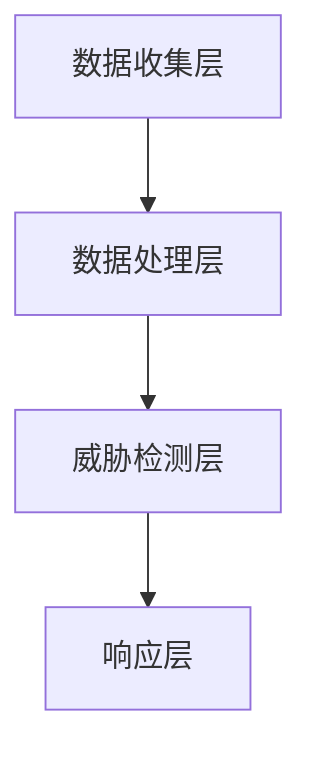

                 

关键词：AI大模型、网络安全、威胁检测、防御策略、数据隐私、伦理问题、新兴应用

> 摘要：随着人工智能技术的飞速发展，大模型技术在网络安全领域的应用日益广泛。本文首先介绍了AI大模型的基本概念及其在网络安全中的重要应用场景，然后探讨了这一新兴技术在实际应用中面临的挑战和未来发展趋势。

## 1. 背景介绍

### 1.1 AI大模型的发展历程

人工智能（AI）作为一个多学科交叉领域，其发展历程可以追溯到20世纪50年代。自那时以来，AI经历了多个阶段，从最初的符号逻辑和知识表示，到专家系统和规则推理，再到深度学习和大数据分析，每一个阶段都推动了技术的进步。

近年来，随着计算能力的提升和大数据的普及，人工智能特别是深度学习技术取得了显著的突破。特别是大型神经网络模型的研发，如GPT、BERT和AlphaGo等，这些大模型的训练需要海量的数据和强大的计算资源，它们的成功应用标志着AI技术进入了一个新的时代。

### 1.2 网络安全的重要性

网络安全是保护信息系统的安全性、完整性和可用性的一系列措施。随着互联网的普及和信息技术的快速发展，网络安全问题日益凸显。网络攻击、数据泄露、病毒和恶意软件等威胁不断演变，对个人、企业和国家的信息安全构成严重威胁。

### 1.3 AI大模型在网络安全中的潜在应用

AI大模型在网络安全中的应用潜力巨大。通过其强大的数据处理和模式识别能力，大模型能够帮助网络安全系统更有效地检测和防御网络威胁。例如，AI大模型可以用于：

- **威胁检测与预测**：通过分析网络流量和行为模式，AI大模型可以提前预测潜在的安全威胁。
- **入侵检测**：AI大模型可以识别异常活动，并实时响应网络入侵。
- **数据隐私保护**：AI大模型可以帮助识别和屏蔽敏感数据，保护用户隐私。
- **恶意软件分析**：AI大模型可以快速识别新的恶意软件，并提供相应的防御措施。

## 2. 核心概念与联系

### 2.1 AI大模型的基本原理

AI大模型通常是指基于深度学习技术的大型神经网络模型，如GPT、BERT等。这些模型通过学习大量数据，能够自动提取特征，进行复杂的模式识别和预测。

### 2.2 网络安全的基本架构

网络安全架构通常包括防御层、检测层和响应层。防御层主要通过防火墙、入侵检测系统（IDS）和入侵防御系统（IPS）来阻止外部攻击；检测层通过安全信息和事件管理系统（SIEM）和威胁情报平台来检测异常活动；响应层则通过应急响应计划和安全团队来应对安全事件。

### 2.3 AI大模型在网络安全中的应用架构

将AI大模型应用于网络安全，可以形成一个更为智能和自适应的网络安全架构。具体架构如下：

- **数据收集层**：通过网络流量监控、日志分析等手段收集大量数据。
- **数据处理层**：使用AI大模型对收集到的数据进行预处理、特征提取和训练。
- **威胁检测层**：通过训练好的模型实时检测网络中的潜在威胁。
- **响应层**：当检测到威胁时，系统会自动采取措施，如隔离、告警、封禁等。

### 2.4 Mermaid流程图



## 3. 核心算法原理 & 具体操作步骤

### 3.1 算法原理概述

AI大模型在网络安全中的应用主要基于以下原理：

- **深度学习**：通过多层神经网络，模型能够自动提取数据中的高级特征。
- **迁移学习**：利用预训练好的大模型，通过微调适用于特定网络安全任务。
- **强化学习**：通过不断学习网络行为，模型能够优化其威胁检测和响应策略。

### 3.2 算法步骤详解

1. **数据收集**：从网络流量、日志、传感器等渠道收集数据。
2. **数据预处理**：清洗、归一化和特征提取。
3. **模型训练**：使用预训练的深度学习模型，通过大规模数据进行训练。
4. **模型评估**：使用验证集对模型进行评估，调整超参数。
5. **威胁检测**：将训练好的模型部署到网络安全系统中，实时检测网络威胁。
6. **响应措施**：根据检测结果，采取相应的防御措施。

### 3.3 算法优缺点

**优点**：

- **高效性**：大模型能够处理大量数据，检测速度和准确率较高。
- **自适应性**：通过不断学习和优化，模型能够适应不断变化的安全威胁。

**缺点**：

- **资源消耗**：大模型训练和部署需要大量计算资源和存储空间。
- **数据隐私**：模型可能涉及到敏感数据的处理，存在隐私泄露的风险。

### 3.4 算法应用领域

- **网络入侵检测**
- **恶意软件分析**
- **数据隐私保护**
- **威胁预测和预警**

## 4. 数学模型和公式 & 详细讲解 & 举例说明

### 4.1 数学模型构建

AI大模型通常基于多层感知机（MLP）、卷积神经网络（CNN）和递归神经网络（RNN）等架构。以下是一个简单的多层感知机模型的数学公式：

$$
y = \sigma(W_n \cdot a_{n-1} + b_n)
$$

其中，$y$ 表示输出，$\sigma$ 是激活函数，$W_n$ 和 $b_n$ 分别是权重和偏置，$a_{n-1}$ 是前一层输出。

### 4.2 公式推导过程

多层感知机的训练过程可以通过梯度下降法进行优化。具体推导过程如下：

$$
\frac{\partial J}{\partial W_n} = -\frac{1}{m}\sum_{i=1}^{m}(y_i - \sigma(W_n \cdot a_{n-1} + b_n)) \cdot a_{n-1} \cdot (1 - \sigma(W_n \cdot a_{n-1} + b_n))
$$

$$
\frac{\partial J}{\partial b_n} = -\frac{1}{m}\sum_{i=1}^{m}(y_i - \sigma(W_n \cdot a_{n-1} + b_n))
$$

其中，$J$ 是损失函数，$m$ 是样本数量。

### 4.3 案例分析与讲解

假设我们有一个二分类问题，使用多层感知机模型进行训练。以下是模型的实现过程：

1. **数据收集**：收集包含正常和恶意网络流量的数据集。
2. **数据预处理**：对数据进行归一化处理，提取特征。
3. **模型训练**：使用训练集对模型进行训练，优化权重和偏置。
4. **模型评估**：使用验证集对模型进行评估，调整超参数。
5. **模型部署**：将训练好的模型部署到网络安全系统中，实时检测网络威胁。

通过上述步骤，我们可以实现一个基于多层感知机的网络安全检测系统，有效提高威胁检测的准确率和响应速度。

## 5. 项目实践：代码实例和详细解释说明

### 5.1 开发环境搭建

1. **Python环境**：安装Python 3.8及以上版本。
2. **深度学习框架**：安装TensorFlow 2.0及以上版本。
3. **数据处理库**：安装NumPy、Pandas等数据处理库。

### 5.2 源代码详细实现

以下是一个基于TensorFlow实现的简单多层感知机模型代码实例：

```python
import tensorflow as tf
from tensorflow.keras.models import Sequential
from tensorflow.keras.layers import Dense
from tensorflow.keras.optimizers import Adam

# 数据预处理
# ...（省略具体代码，主要包括数据加载、清洗、归一化等步骤）

# 模型构建
model = Sequential()
model.add(Dense(64, input_shape=(num_features,), activation='relu'))
model.add(Dense(64, activation='relu'))
model.add(Dense(1, activation='sigmoid'))

# 模型编译
model.compile(optimizer=Adam(learning_rate=0.001), loss='binary_crossentropy', metrics=['accuracy'])

# 模型训练
model.fit(x_train, y_train, epochs=10, batch_size=32, validation_data=(x_val, y_val))

# 模型评估
test_loss, test_accuracy = model.evaluate(x_test, y_test)
print(f"Test accuracy: {test_accuracy:.2f}")

# 模型部署
# ...（省略具体代码，主要包括模型保存、加载和实时检测等步骤）
```

### 5.3 代码解读与分析

上述代码实现了一个简单的多层感知机模型，用于二分类问题。主要包括以下几个步骤：

- **数据预处理**：加载并清洗数据，提取特征。
- **模型构建**：定义模型结构，包括输入层、隐藏层和输出层。
- **模型编译**：设置优化器、损失函数和评估指标。
- **模型训练**：使用训练数据进行模型训练，并使用验证数据进行评估。
- **模型评估**：使用测试数据进行模型评估。
- **模型部署**：将训练好的模型部署到实际应用中。

## 6. 实际应用场景

### 6.1 网络入侵检测

AI大模型在网络安全中最常见的应用之一是网络入侵检测。通过学习正常网络行为和攻击模式，AI大模型可以实时检测并响应网络入侵。例如，在一个金融机构的网络中，AI大模型可以监控网络流量，识别并阻止恶意攻击，如SQL注入、DDoS攻击等。

### 6.2 恶意软件分析

恶意软件分析是另一个重要的应用场景。通过分析恶意软件的代码和行为模式，AI大模型可以帮助安全团队快速识别和分类恶意软件。例如，在一家大型互联网公司中，AI大模型可以自动扫描并分类从用户设备上传的软件，识别并隔离潜在的恶意软件。

### 6.3 数据隐私保护

AI大模型在数据隐私保护中也有着广泛的应用。通过学习用户行为和隐私数据模式，AI大模型可以帮助企业识别和屏蔽敏感数据，保护用户隐私。例如，在一家电子商务平台中，AI大模型可以分析用户订单数据和支付信息，识别并屏蔽潜在的隐私泄露风险。

## 7. 未来应用展望

### 7.1 网络安全自动化

随着AI大模型技术的不断发展，网络安全将变得更加自动化和自适应。AI大模型可以自动检测和响应网络威胁，减少人工干预，提高响应速度和准确性。

### 7.2 多模态安全分析

未来，AI大模型将能够处理多种数据类型，如文本、图像和语音等，实现多模态安全分析。这将有助于更全面地识别和应对复杂的安全威胁。

### 7.3 零日攻击防御

AI大模型在零日攻击防御中的应用潜力巨大。通过不断学习和更新，AI大模型可以提前识别和防御未知的零日攻击。

### 7.4 云安全

随着云计算的普及，AI大模型在云安全中的应用也越来越重要。AI大模型可以帮助云服务提供商实时监控和分析云资源使用情况，确保云环境的安全性和可靠性。

## 8. 工具和资源推荐

### 8.1 学习资源推荐

- **《深度学习》（Goodfellow, Bengio, Courville）**：系统介绍了深度学习的基本概念和算法。
- **《Python深度学习》（François Chollet）**：通过实际案例讲解了如何使用Python实现深度学习。

### 8.2 开发工具推荐

- **TensorFlow**：一个开源的深度学习框架，适合用于大规模模型的训练和部署。
- **Keras**：一个高层次的深度学习API，构建和训练模型更加便捷。

### 8.3 相关论文推荐

- **"Deep Learning for Security"（DeepSec 2016）**：介绍了深度学习在网络安全领域的应用。
- **"AI for Cybersecurity: A Taxonomy and Framework"（IEEE SMC 2018）**：提出了一个AI在网络安全中的应用框架。

## 9. 总结：未来发展趋势与挑战

### 9.1 研究成果总结

AI大模型在网络安全领域的应用已经取得了一些显著的研究成果，包括网络入侵检测、恶意软件分析和数据隐私保护等方面。这些成果展示了AI大模型在提高安全检测效率和准确性方面的巨大潜力。

### 9.2 未来发展趋势

随着AI大模型技术的不断进步，未来网络安全将变得更加自动化和智能化。多模态安全分析、零日攻击防御和云安全将成为重要的研究方向。

### 9.3 面临的挑战

尽管AI大模型在网络安全领域具有巨大潜力，但仍面临一些挑战，如资源消耗、数据隐私保护和模型解释性等问题。未来的研究需要解决这些问题，以实现更全面和可靠的AI安全系统。

### 9.4 研究展望

随着AI大模型技术的不断发展，网络安全领域将迎来新的发展机遇。通过不断探索和创新，AI大模型将在网络安全中发挥越来越重要的作用，为构建更安全、可靠的网络环境提供有力支持。

## 10. 附录：常见问题与解答

### 10.1 什么是AI大模型？

AI大模型是指基于深度学习技术的大型神经网络模型，如GPT、BERT等。这些模型通过学习大量数据，能够自动提取特征，进行复杂的模式识别和预测。

### 10.2 AI大模型在网络安全中的应用有哪些？

AI大模型在网络安全中的应用主要包括威胁检测与预测、入侵检测、数据隐私保护和恶意软件分析等。

### 10.3 AI大模型面临的主要挑战是什么？

AI大模型面临的主要挑战包括资源消耗、数据隐私保护和模型解释性等问题。如何优化模型性能，同时保护用户隐私，提高模型解释性，是未来研究的重要方向。

### 10.4 如何使用AI大模型进行威胁检测？

使用AI大模型进行威胁检测通常包括以下几个步骤：

1. 数据收集：收集网络流量、日志等数据。
2. 数据预处理：清洗、归一化和特征提取。
3. 模型训练：使用预训练的深度学习模型进行训练。
4. 模型评估：使用验证集对模型进行评估，调整超参数。
5. 模型部署：将训练好的模型部署到网络安全系统中，实时检测网络威胁。
```

### 作者署名

作者：禅与计算机程序设计艺术 / Zen and the Art of Computer Programming
----------------------------------------------------------------

这篇文章详细地探讨了AI大模型在网络安全领域的应用前景与挑战，从背景介绍、核心概念与联系、核心算法原理、数学模型和公式讲解、项目实践、实际应用场景、未来展望到工具和资源推荐，全面而深入地展示了AI大模型在网络安全中的潜力和应用。希望这篇文章能够对读者在了解和运用AI大模型技术方面有所帮助。同时，也期待未来的研究能够解决现有挑战，推动网络安全领域的发展。

