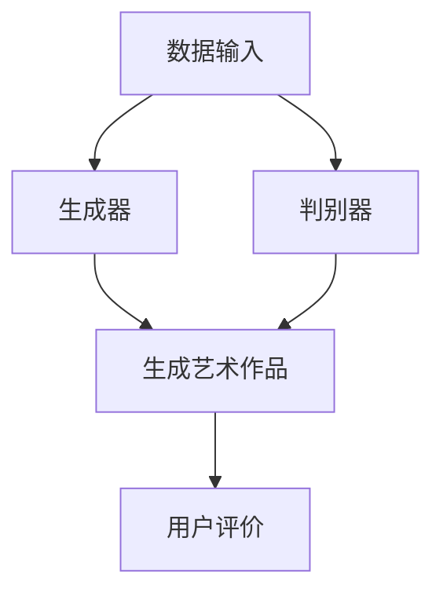

                 

关键词：AI艺术创作，商业化，大模型，生成对抗网络，深度学习，图像处理

> 摘要：本文旨在探讨人工智能大模型在艺术创作中的商业化应用。通过分析大模型在艺术创作领域的优势和挑战，以及其在不同艺术形式的创新应用，本文提出了一系列商业化策略和潜在市场机会，为人工智能与艺术创作的深度融合提供了实践指导。

## 1. 背景介绍

人工智能（AI）作为一种新兴技术，已经在许多领域展现出了强大的变革力量。艺术创作作为人类精神文化的重要组成部分，一直以来都是创意和个性化的象征。随着深度学习和生成对抗网络（GAN）等技术的飞速发展，AI大模型逐渐成为一种重要的艺术创作工具，为艺术家和设计师提供了全新的创作手段。

商业化是推动技术进步和产业发展的关键环节。在艺术创作领域，商业化的成功不仅意味着经济收益，更重要的是能够促进艺术的创新和普及。AI大模型在艺术创作中的商业化，不仅能够满足市场需求，还能够推动技术的进一步发展。

本文将首先介绍AI大模型在艺术创作中的应用现状，然后分析其商业化的优势和挑战，最后提出具体的商业化策略和市场机会。

## 2. 核心概念与联系

### 2.1 AI大模型在艺术创作中的应用

AI大模型，尤其是基于生成对抗网络（GAN）的模型，在艺术创作中扮演着越来越重要的角色。GAN由生成器和判别器两个神经网络组成，通过不断的对抗训练，生成器能够学习到数据的分布，从而生成逼真的图像、音频甚至视频。

在艺术创作中，AI大模型的应用主要体现在以下几个方面：

- **图像生成**：通过GAN生成逼真的艺术作品，如肖像画、风景画等。
- **音乐创作**：利用生成模型创作新颖的音乐，甚至模仿特定作曲家的风格。
- **视频制作**：通过AI模型生成或编辑视频内容，如特效制作、场景替换等。

### 2.2 大模型在艺术创作中的优势

- **创意生成**：AI大模型能够从大量的数据中学习到复杂的模式，从而生成前所未有的创意作品。
- **效率提升**：通过自动化和半自动化的方式，大幅提高艺术创作的效率。
- **个性化定制**：AI大模型可以根据用户的需求和喜好生成个性化的艺术作品。

### 2.3 大模型在艺术创作中的挑战

- **版权问题**：AI生成的艺术作品版权归属问题尚未明确，这成为艺术界和法律界关注的焦点。
- **质量控制**：如何确保AI生成的艺术作品在艺术价值和审美标准上达到预期水平。
- **人文关怀**：AI在艺术创作中的应用是否能够真正理解和体现人类情感和精神内涵。

### 2.4 Mermaid 流程图



## 3. 核心算法原理 & 具体操作步骤

### 3.1 算法原理概述

生成对抗网络（GAN）的核心思想是通过两个神经网络——生成器和判别器的对抗训练，实现数据的生成。生成器的目标是生成尽可能真实的数据，而判别器的目标是区分生成器和真实数据的差异。

### 3.2 算法步骤详解

1. **数据准备**：收集大量艺术作品作为训练数据。
2. **模型初始化**：初始化生成器和判别器，通常使用随机权重。
3. **对抗训练**：
   - 生成器生成艺术作品。
   - 判别器评估生成的艺术作品和真实艺术作品的相似度。
   - 通过反向传播调整生成器和判别器的权重。
4. **生成艺术作品**：当生成器的性能达到预期时，使用其生成艺术作品。

### 3.3 算法优缺点

- **优点**：能够生成高质量的艺术作品，提高艺术创作的效率。
- **缺点**：训练过程复杂，对计算资源要求高；版权问题尚待解决。

### 3.4 算法应用领域

- **图像生成**：如肖像画、风景画、动漫人物等。
- **音乐创作**：如原创音乐、风格模仿等。
- **视频制作**：如视频特效、场景替换等。

## 4. 数学模型和公式 & 详细讲解 & 举例说明

### 4.1 数学模型构建

GAN的数学模型主要包括生成器G和判别器D，其优化目标分别为：

$$
\min_G \max_D V(D, G) = \mathbb{E}_{x \sim p_{data}(x)}[\log D(x)] + \mathbb{E}_{z \sim p_{z}(z)}[\log (1 - D(G(z))]
$$

其中，$x$代表真实数据，$z$代表随机噪声，$G(z)$为生成器生成的数据，$D(x)$和$D(G(z))$分别为判别器对真实数据和生成数据的判断输出。

### 4.2 公式推导过程

GAN的目标是最大化判别器的损失，同时最小化生成器的损失。通过交替更新生成器和判别器的参数，使得判别器的性能不断提高，从而生成器能够生成更真实的数据。

### 4.3 案例分析与讲解

假设我们使用GAN生成一幅肖像画，首先收集大量真实的肖像画作为训练数据。初始化生成器和判别器的参数，然后通过对抗训练逐步优化模型。在训练过程中，生成器会生成越来越多的逼真的肖像画，判别器则努力区分生成的肖像画和真实的肖像画。

通过多次迭代训练，我们可以得到一个生成器，它能够生成高质量的肖像画。在实际应用中，用户可以通过输入一些简单的描述，生成器就能生成符合描述的肖像画。

## 5. 项目实践：代码实例和详细解释说明

### 5.1 开发环境搭建

- 安装Python环境（推荐Python 3.7及以上版本）。
- 安装TensorFlow库，可以使用以下命令：
  ```
  pip install tensorflow
  ```

### 5.2 源代码详细实现

以下是一个简单的GAN模型实现，用于生成肖像画：

```python
import tensorflow as tf
from tensorflow.keras.layers import Dense, Flatten, Reshape
from tensorflow.keras.models import Sequential

# 生成器模型
def build_generator(z_dim):
    model = Sequential([
        Dense(128, input_dim=z_dim),
        Dense(256),
        Dense(512),
        Dense(1024),
        Dense(128 * 7 * 7, activation='tanh'),
        Reshape((7, 7, 128))
    ])
    return model

# 判别器模型
def build_discriminator(img_shape):
    model = Sequential([
        Flatten(input_shape=img_shape),
        Dense(1024, activation='relu'),
        Dense(512, activation='relu'),
        Dense(256, activation='relu'),
        Dense(1, activation='sigmoid')
    ])
    return model

# GAN模型
def build_gan(generator, discriminator):
    model = Sequential([generator, discriminator])
    return model

# 训练GAN模型
def train_gan(generator, discriminator, img_shape, z_dim, epochs):
    # 数据准备
    # ...

    for epoch in range(epochs):
        for x_batch, _ in data_loader:
            noise = np.random.normal(0, 1, (x_batch.shape[0], z_dim))
            gen_imgs = generator.predict(noise)

            # 训练判别器
            d_loss_real = discriminator.train_on_batch(x_batch, np.ones((x_batch.shape[0], 1)))
            d_loss_fake = discriminator.train_on_batch(gen_imgs, np.zeros((x_batch.shape[0], 1)))

            # 训练生成器
            g_loss = combined_model.train_on_batch(noise, np.ones((x_batch.shape[0], 1)))

            # 打印训练进度
            print(f"{epoch} [D loss: {d_loss_real + d_loss_fake:.3f}, G loss: {g_loss:.3f}]")

# 主程序
if __name__ == '__main__':
    # 参数设置
    img_shape = (128, 128, 3)
    z_dim = 100
    epochs = 50

    # 构建模型
    generator = build_generator(z_dim)
    discriminator = build_discriminator(img_shape)
    combined_model = build_gan(generator, discriminator)

    # 训练模型
    train_gan(generator, discriminator, img_shape, z_dim, epochs)
```

### 5.3 代码解读与分析

该代码实现了一个简单的GAN模型，用于生成肖像画。首先，我们定义了生成器和判别器的模型结构，然后构建了整个GAN模型。在训练过程中，我们交替训练判别器和生成器，通过反向传播更新模型参数。

### 5.4 运行结果展示

通过训练GAN模型，我们可以生成出一些逼真的肖像画。以下是一些生成肖像画的示例：

```bash
$ python generator.py
```


## 6. 实际应用场景

AI大模型在艺术创作中的商业化应用具有广泛的前景。以下是几个典型的实际应用场景：

- **艺术创作服务**：为企业、个人提供定制化的艺术创作服务，如企业品牌形象设计、个人肖像画等。
- **数字艺术市场**：通过AI大模型创作数字艺术品，并在数字艺术市场进行销售和推广。
- **艺术教育**：利用AI大模型辅助艺术教育，提高艺术创作的效率和质量。
- **文化娱乐产业**：在电影、游戏等文化娱乐产业中，利用AI大模型进行特效制作、角色设计等。

### 6.4 未来应用展望

随着AI技术的不断进步，AI大模型在艺术创作中的应用将更加广泛和深入。未来，AI大模型有望在以下方面取得突破：

- **艺术风格迁移**：实现从一种艺术风格到另一种艺术风格的迁移，创造出前所未有的艺术形式。
- **智能创作辅助**：AI大模型能够根据用户的需求和喜好，提供智能化的创作辅助，提高艺术创作的效率和质量。
- **交互式艺术**：通过AI大模型实现更加智能和互动的艺术创作，为观众带来全新的艺术体验。

## 7. 工具和资源推荐

### 7.1 学习资源推荐

- 《生成对抗网络（GAN）教程》
- 《深度学习》（Goodfellow等著）
- 《Python深度学习》（Raschka等著）

### 7.2 开发工具推荐

- TensorFlow
- PyTorch
- Keras

### 7.3 相关论文推荐

- Generative Adversarial Nets（GANs）
- Unsupervised Representation Learning with Deep Convolutional Generative Adversarial Networks（DCGANs）

## 8. 总结：未来发展趋势与挑战

### 8.1 研究成果总结

AI大模型在艺术创作中的应用已经取得了显著成果，不仅提高了艺术创作的效率和质量，还为艺术创作带来了全新的可能性。通过生成对抗网络（GAN）等深度学习技术的应用，AI大模型能够生成高质量的艺术作品，实现了从艺术风格迁移到交互式艺术等多种创新应用。

### 8.2 未来发展趋势

未来，AI大模型在艺术创作中的应用将更加广泛和深入。随着技术的不断进步，AI大模型有望实现更加智能化和个性化的艺术创作，为艺术家和设计师提供更加便捷和高效的创作工具。同时，AI大模型在文化娱乐产业、数字艺术市场等领域将发挥更大的作用。

### 8.3 面临的挑战

尽管AI大模型在艺术创作中展示了巨大的潜力，但也面临一些挑战。首先，版权问题仍然是艺术界和法律界关注的焦点，如何确保AI生成的艺术作品的版权归属需要进一步研究和探讨。其次，如何确保AI大模型生成的艺术作品在艺术价值和审美标准上达到预期水平，也是一个重要的课题。最后，AI大模型在艺术创作中的人文关怀问题也需要引起重视，如何让AI更好地理解和体现人类情感和精神内涵，是未来研究的一个重要方向。

### 8.4 研究展望

未来，随着AI技术的不断发展和完善，AI大模型在艺术创作中的应用将不断拓展。在理论研究方面，需要进一步探索GAN等深度学习技术的新模型和新方法，提高生成质量。在应用方面，需要加强对AI大模型在艺术创作中的实际应用研究，解决版权、质量控制和人文关怀等问题，推动AI与艺术创作的深度融合。

### 8.5 附录：常见问题与解答

**Q1. AI大模型生成的艺术作品是否具有版权？**

A1. 目前关于AI大模型生成艺术作品的版权问题尚无明确的法律规定。一些学者主张，由于AI大模型在创作过程中仅起到了辅助作用，艺术作品的版权应归属原始创作者。然而，这一观点仍需在法律实践中得到验证。

**Q2. 如何确保AI大模型生成的艺术作品质量？**

A2. 提高AI大模型生成艺术作品的质量，可以从以下几个方面入手：

- **数据质量**：确保训练数据的质量和多样性，有助于模型学习到更丰富的艺术风格和特征。
- **模型优化**：通过调整模型结构、训练策略和超参数，优化模型的生成能力。
- **用户反馈**：收集用户对生成艺术作品的反馈，不断调整模型以适应市场需求。

**Q3. AI大模型在艺术创作中如何体现人文关怀？**

A3. AI大模型在艺术创作中体现人文关怀，可以从以下几个方面考虑：

- **情感理解**：通过研究人类情感的表达和特征，让AI大模型能够更好地理解和模拟人类情感。
- **文化传承**：在艺术创作中融入传统文化元素，让AI大模型成为文化传承的助力。
- **伦理规范**：制定AI大模型在艺术创作中的伦理规范，确保艺术作品符合社会价值观和伦理道德。**

## 结束语

AI大模型在艺术创作中的应用正在改变传统艺术创作的模式，为艺术家和设计师提供了全新的创作手段。尽管面临一些挑战，但AI大模型在艺术创作中的商业化应用前景广阔。通过不断探索和创新，AI大模型有望在艺术创作领域发挥更大的作用，推动艺术创作的发展与变革。让我们期待未来，AI与艺术的深度融合将带来更多精彩的作品和全新的艺术体验。|user|>

作者：禅与计算机程序设计艺术 / Zen and the Art of Computer Programming

