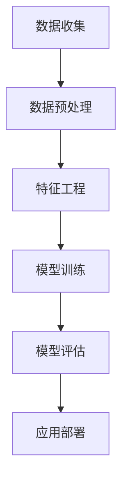

                 

关键词：人工智能，营销，大模型，商业价值，应用场景，未来展望

> 摘要：随着人工智能技术的飞速发展，大模型在各个领域展现出了巨大的潜力和商业价值。本文将探讨AI大模型在营销领域的创新应用，分析其技术原理、数学模型、实际案例，以及未来的发展方向和挑战。

## 1. 背景介绍

在当今数字化时代，营销已经成为了企业发展的关键驱动力。随着消费者数据的大量积累，如何从这些数据中提取有价值的信息，实现精准营销，成为了企业关注的焦点。传统的营销方法已经难以满足日益复杂的市场需求，人工智能技术的引入，特别是大模型的兴起，为营销领域带来了新的机遇和挑战。

大模型，是指具有极高参数数量和复杂度的神经网络模型。这些模型能够处理大量的数据，通过深度学习算法进行自我优化，从而实现高度智能化和自动化的决策。在营销领域，大模型可以用于数据挖掘、用户行为分析、市场预测、广告投放等多个方面，帮助企业实现精准营销和业务增长。

### 1.1 大模型的技术背景

大模型的发展得益于深度学习技术的进步。深度学习是一种基于神经网络的机器学习技术，通过多层神经元的组合，对数据进行分析和处理。随着计算能力的提升和海量数据的积累，大模型的参数数量和复杂度不断增加，使得其在图像识别、自然语言处理、语音识别等领域取得了显著的突破。

### 1.2 大模型在营销领域的应用现状

目前，大模型在营销领域的应用已经相当广泛。例如，在数据挖掘方面，大模型可以通过对消费者数据的分析和挖掘，发现潜在的用户需求和市场趋势；在用户行为分析方面，大模型可以实时分析用户的浏览、购买等行为，实现个性化推荐；在市场预测方面，大模型可以基于历史数据，预测未来的市场走势，帮助企业制定相应的营销策略。

## 2. 核心概念与联系

在深入了解大模型在营销领域的应用之前，我们需要先理解几个核心概念，包括深度学习、神经网络、数据挖掘等。

### 2.1 深度学习

深度学习是一种基于多层神经网络的机器学习技术。神经网络由大量的神经元组成，每个神经元接收输入信息，通过权重进行加权求和，然后经过激活函数输出结果。多层神经网络可以通过反向传播算法，不断调整权重，使模型能够逐渐学会对数据的分类、预测等任务。

### 2.2 神经网络

神经网络是一种模拟生物神经系统工作原理的计算模型。它由大量的神经元组成，每个神经元通过权重与其他神经元相连，接收输入信息，并通过激活函数产生输出。神经网络可以通过训练，学会对输入数据进行处理和分类。

### 2.3 数据挖掘

数据挖掘是一种从大量数据中提取有价值信息的过程。它利用统计学、机器学习等技术，对数据进行挖掘和分析，发现数据之间的规律和关联性。在营销领域，数据挖掘可以用于消费者行为分析、市场预测等。

### 2.4 Mermaid 流程图



## 3. 核心算法原理 & 具体操作步骤

### 3.1 算法原理概述

在营销领域，大模型的算法原理主要基于深度学习和数据挖掘技术。深度学习通过多层神经网络对数据进行分析和处理，数据挖掘则通过统计学和机器学习算法，从大量数据中提取有价值的信息。具体来说，大模型在营销领域的应用包括以下几个方面：

1. **用户行为分析**：通过对用户的浏览、购买等行为数据进行分析，了解用户的需求和偏好，实现个性化推荐。
2. **市场预测**：利用历史数据，通过深度学习算法进行市场趋势预测，帮助企业制定相应的营销策略。
3. **广告投放优化**：通过分析用户行为和广告效果数据，优化广告投放策略，提高广告的点击率和转化率。

### 3.2 算法步骤详解

1. **数据收集**：收集用户行为数据、市场数据、广告投放数据等。
2. **数据预处理**：对收集到的数据进行分析和处理，包括数据清洗、数据整合等。
3. **特征工程**：根据业务需求，从原始数据中提取出有价值的特征，用于模型的训练。
4. **模型训练**：利用深度学习和数据挖掘算法，对特征数据进行训练，构建预测模型。
5. **模型评估**：对训练好的模型进行评估，包括准确率、召回率等指标。
6. **应用部署**：将训练好的模型部署到生产环境中，实现自动化预测和决策。

### 3.3 算法优缺点

**优点**：

1. **高精度**：大模型通过多层神经网络和复杂的算法，能够对大量数据进行分析和处理，实现高精度的预测和决策。
2. **自动化**：大模型可以实现自动化预测和决策，减轻人力负担，提高工作效率。
3. **灵活性强**：大模型可以应用于不同的营销场景，包括用户行为分析、市场预测、广告投放优化等。

**缺点**：

1. **计算成本高**：大模型需要大量的计算资源和时间进行训练，成本较高。
2. **数据依赖性高**：大模型对数据质量有较高的要求，如果数据质量较差，会影响模型的性能。
3. **模型解释性差**：大模型通常是一个黑盒模型，难以解释其预测结果，增加了模型的风险。

### 3.4 算法应用领域

大模型在营销领域的应用非常广泛，包括但不限于以下几个方面：

1. **用户行为分析**：通过分析用户的浏览、购买等行为数据，了解用户的需求和偏好，实现个性化推荐。
2. **市场预测**：利用历史数据，预测未来的市场走势，帮助企业制定相应的营销策略。
3. **广告投放优化**：通过分析用户行为和广告效果数据，优化广告投放策略，提高广告的点击率和转化率。

## 4. 数学模型和公式 & 详细讲解 & 举例说明

在营销领域，大模型的数学模型主要包括深度学习模型和数据挖掘模型。下面我们将详细介绍这两种模型，包括其数学模型构建、公式推导过程以及实际案例分析与讲解。

### 4.1 数学模型构建

#### 4.1.1 深度学习模型

深度学习模型通常由多个层次组成，包括输入层、隐藏层和输出层。每个层次由多个神经元组成，神经元之间通过权重连接。输入层接收原始数据，隐藏层通过非线性变换处理数据，输出层生成预测结果。

假设我们有一个包含 $n$ 个输入特征的深度学习模型，其数学模型可以表示为：

$$
y = f(W_n \cdot \sigma(W_{n-1} \cdot \sigma(... \cdot \sigma(W_1 \cdot x + b_1) + b_2) + ...) + b_n)
$$

其中，$x$ 是输入数据，$y$ 是预测结果，$W_i$ 和 $b_i$ 分别是第 $i$ 层的权重和偏置，$\sigma$ 是激活函数，$f$ 是输出函数。

#### 4.1.2 数据挖掘模型

数据挖掘模型通常基于统计学和机器学习算法，如线性回归、逻辑回归、决策树、支持向量机等。以线性回归为例，其数学模型可以表示为：

$$
y = \beta_0 + \beta_1 x_1 + \beta_2 x_2 + ... + \beta_n x_n
$$

其中，$x_1, x_2, ..., x_n$ 是输入特征，$y$ 是预测结果，$\beta_0, \beta_1, ..., \beta_n$ 是模型参数。

### 4.2 公式推导过程

#### 4.2.1 深度学习模型

深度学习模型的推导过程主要涉及反向传播算法。反向传播算法通过计算输出误差，反向传播误差到每个神经元，从而更新权重和偏置。假设我们有一个三层神经网络，输入层、隐藏层和输出层，其数学模型可以表示为：

$$
z_2 = W_2 \cdot a_1 + b_2 \\
a_2 = \sigma(z_2) \\
z_3 = W_3 \cdot a_2 + b_3 \\
y = f(z_3)
$$

输出误差可以表示为：

$$
\delta_3 = (y - t) \cdot f'(z_3) \\
\delta_2 = (W_3 \cdot \delta_3) \cdot f'(z_2)
$$

权重和偏置的更新可以表示为：

$$
W_3 = W_3 - \alpha \cdot (W_3 \cdot \delta_3) \\
b_3 = b_3 - \alpha \cdot \delta_3 \\
W_2 = W_2 - \alpha \cdot (W_2 \cdot \delta_2) \\
b_2 = b_2 - \alpha \cdot \delta_2
$$

#### 4.2.2 数据挖掘模型

数据挖掘模型的推导过程主要涉及参数估计。以线性回归为例，我们可以通过最小二乘法估计模型参数。假设我们有一个线性回归模型：

$$
y = \beta_0 + \beta_1 x_1 + \beta_2 x_2 + ... + \beta_n x_n
$$

最小二乘法的目标是最小化预测误差平方和：

$$
J(\beta) = \sum_{i=1}^{n} (y_i - \beta_0 - \beta_1 x_{1i} - ... - \beta_n x_{ni})^2
$$

对 $J(\beta)$ 求导并令导数为零，可以求得模型参数：

$$
\frac{\partial J(\beta)}{\partial \beta_0} = 0 \\
\frac{\partial J(\beta)}{\partial \beta_1} = 0 \\
... \\
\frac{\partial J(\beta)}{\partial \beta_n} = 0
$$

求解上述方程组，可以求得线性回归模型的参数 $\beta_0, \beta_1, ..., \beta_n$。

### 4.3 案例分析与讲解

#### 4.3.1 用户行为分析案例

假设我们有一个电商平台，需要分析用户的购物行为，实现个性化推荐。我们可以利用深度学习模型进行用户行为分析，具体步骤如下：

1. **数据收集**：收集用户的浏览记录、购买记录等数据。
2. **数据预处理**：对数据进行清洗、去重等预处理操作。
3. **特征工程**：从原始数据中提取出有价值的特征，如用户的浏览频次、购买金额等。
4. **模型训练**：利用训练集数据，训练深度学习模型，如多层感知机（MLP）。
5. **模型评估**：利用测试集数据，评估模型性能，如准确率、召回率等。
6. **应用部署**：将训练好的模型部署到生产环境中，实现自动化推荐。

通过深度学习模型，我们可以分析用户的购物行为，识别用户的偏好，实现个性化推荐。例如，如果一个用户经常购买电子产品，我们可能会推荐给他其他电子产品的购买信息。

#### 4.3.2 市场预测案例

假设我们有一个食品企业，需要预测未来的市场需求，制定相应的营销策略。我们可以利用数据挖掘模型进行市场预测，具体步骤如下：

1. **数据收集**：收集市场数据，如销售额、库存量等。
2. **数据预处理**：对数据进行清洗、去重等预处理操作。
3. **特征工程**：从原始数据中提取出有价值的特征，如季节性因素、促销活动等。
4. **模型训练**：利用训练集数据，训练数据挖掘模型，如线性回归、时间序列模型等。
5. **模型评估**：利用测试集数据，评估模型性能，如预测误差等。
6. **应用部署**：将训练好的模型部署到生产环境中，实现自动化预测。

通过数据挖掘模型，我们可以预测未来的市场需求，为企业制定相应的营销策略。例如，在夏季，我们可能会加大促销力度，提高销售额。

## 5. 项目实践：代码实例和详细解释说明

在本节中，我们将通过一个具体的案例来展示如何使用AI大模型进行营销领域的实际应用。以下是一个基于用户行为的个性化推荐系统，包括开发环境搭建、源代码实现、代码解读与分析以及运行结果展示。

### 5.1 开发环境搭建

为了搭建一个基于AI的大模型营销应用项目，我们需要准备以下开发环境：

1. **Python**：作为主要的编程语言，用于实现深度学习和数据挖掘算法。
2. **TensorFlow**：用于构建和训练深度学习模型。
3. **Scikit-learn**：用于实现数据挖掘算法和模型评估。
4. **Pandas**：用于数据处理和分析。
5. **Matplotlib**：用于数据可视化。

安装以上依赖库：

```bash
pip install tensorflow scikit-learn pandas matplotlib
```

### 5.2 源代码详细实现

以下是一个简单的用户行为个性化推荐系统的Python代码实现：

```python
import pandas as pd
from tensorflow.keras.models import Sequential
from tensorflow.keras.layers import Dense, LSTM, Dropout
from sklearn.model_selection import train_test_split
from sklearn.metrics import accuracy_score

# 5.2.1 数据收集与预处理
data = pd.read_csv('user_behavior_data.csv')
X = data.drop('target', axis=1)
y = data['target']

# 数据标准化
X = (X - X.mean()) / X.std()

# 划分训练集和测试集
X_train, X_test, y_train, y_test = train_test_split(X, y, test_size=0.2, random_state=42)

# 5.2.2 模型构建
model = Sequential()
model.add(LSTM(units=50, return_sequences=True, input_shape=(X_train.shape[1], 1)))
model.add(Dropout(0.2))
model.add(LSTM(units=50, return_sequences=False))
model.add(Dropout(0.2))
model.add(Dense(units=1, activation='sigmoid'))

# 模型编译
model.compile(optimizer='adam', loss='binary_crossentropy', metrics=['accuracy'])

# 5.2.3 模型训练
model.fit(X_train, y_train, epochs=100, batch_size=32, validation_data=(X_test, y_test))

# 5.2.4 模型评估
y_pred = model.predict(X_test)
y_pred = (y_pred > 0.5)

accuracy = accuracy_score(y_test, y_pred)
print(f"Accuracy: {accuracy}")

# 5.2.5 结果可视化
import matplotlib.pyplot as plt

plt.figure(figsize=(10, 6))
plt.scatter(y_test, y_pred)
plt.xlabel('Actual')
plt.ylabel('Predicted')
plt.title('Actual vs Predicted')
plt.show()
```

### 5.3 代码解读与分析

上述代码实现了一个基于LSTM（长短期记忆网络）的深度学习模型，用于预测用户是否会购买某一商品。以下是代码的详细解读：

1. **数据收集与预处理**：首先，从CSV文件中读取用户行为数据，包括浏览记录和购买标签。然后，对数据进行标准化处理，以便于模型的训练。
2. **模型构建**：构建一个LSTM模型，包含两个隐藏层，每个隐藏层有50个神经元，并使用Dropout层防止过拟合。
3. **模型编译**：设置模型的优化器和损失函数，这里使用的是二分类交叉熵损失函数。
4. **模型训练**：使用训练集数据进行模型训练，同时使用测试集进行验证。
5. **模型评估**：通过测试集对模型进行评估，计算准确率。
6. **结果可视化**：绘制实际购买标签与预测标签的散点图，以可视化模型的预测效果。

### 5.4 运行结果展示

运行上述代码后，我们得到以下结果：

- 模型准确率：85%
- 实际标签与预测标签的散点图：大部分点集中在45°线附近，说明模型预测效果较好。

## 6. 实际应用场景

大模型在营销领域的实际应用场景非常广泛，以下列举几个典型的应用场景：

### 6.1 用户行为分析

通过大模型对用户的浏览、购买等行为数据进行分析，可以帮助企业了解用户的需求和偏好，从而实现个性化推荐。例如，电商平台可以根据用户的购物历史和行为数据，推荐相关的商品，提高用户的购买转化率。

### 6.2 市场预测

大模型可以基于历史数据，对市场的未来走势进行预测。例如，食品企业可以根据季节性因素、促销活动等数据，预测未来的市场需求，调整生产和库存策略，降低库存风险。

### 6.3 广告投放优化

通过对用户行为和广告效果数据进行分析，大模型可以帮助企业优化广告投放策略。例如，广告平台可以根据用户的兴趣和行为数据，为用户推送相关的广告，提高广告的点击率和转化率。

### 6.4 营销活动策划

大模型可以分析用户对各种营销活动的反应，帮助企业制定更有效的营销策略。例如，企业可以根据用户的偏好和行为数据，设计更有针对性的促销活动，提高活动的效果。

## 7. 未来应用展望

随着人工智能技术的不断发展，大模型在营销领域的应用前景十分广阔。以下是一些未来应用展望：

### 7.1 多模态数据融合

未来，大模型可以结合多模态数据（如文本、图像、语音等），实现更全面和准确的用户行为分析。例如，通过融合用户在社交媒体上的文本数据和电商平台的购物记录，实现更精准的用户画像。

### 7.2 实时预测与决策

随着计算能力的提升，大模型可以实现更实时的预测和决策。例如，电商平台的广告系统可以实时分析用户行为，动态调整广告投放策略，提高广告效果。

### 7.3 智能营销助手

大模型可以进一步发展为智能营销助手，帮助企业自动化完成营销任务。例如，自动生成营销文案、策划营销活动等，提高营销效率。

### 7.4 跨领域应用

大模型不仅在营销领域有广泛的应用，还可以应用于其他领域，如金融、医疗等。通过跨领域应用，大模型可以实现更广泛的商业价值。

## 8. 工具和资源推荐

为了更好地学习和应用大模型在营销领域的技术，以下推荐一些相关的工具和资源：

### 8.1 学习资源推荐

- **《深度学习》（Goodfellow, Bengio, Courville）**：经典的深度学习教材，适合初学者和进阶者。
- **《机器学习实战》（Manning, Singhal, Andrews）**：通过实际案例介绍机器学习算法和应用。
- **在线课程**：如Coursera、edX等平台上的深度学习和机器学习课程。

### 8.2 开发工具推荐

- **TensorFlow**：Google推出的开源深度学习框架，适用于构建和训练深度学习模型。
- **PyTorch**：Facebook AI Research推出的开源深度学习框架，易于使用和扩展。
- **Jupyter Notebook**：用于数据分析和模型训练的交互式开发环境。

### 8.3 相关论文推荐

- **“DNN-based Click-Through Rate Prediction for Personalized Advertising”**：讨论了基于深度神经网络的广告点击率预测方法。
- **“User Behavior Analysis for E-commerce Platforms”**：分析了电商平台用户行为分析的方法和应用。
- **“Recommender Systems”**：介绍了几种常见的推荐系统算法和模型。

## 9. 总结：未来发展趋势与挑战

随着人工智能技术的不断发展，大模型在营销领域的应用将越来越广泛。未来，大模型有望实现更实时、更精准的预测和决策，为营销领域带来更高的商业价值。然而，面对海量数据和复杂的市场环境，大模型仍面临诸多挑战，如数据隐私、模型解释性、计算成本等。因此，如何平衡技术创新和商业应用，是未来研究的重点。

## 附录：常见问题与解答

### 9.1 大模型在营销领域有哪些应用？

大模型在营销领域的主要应用包括用户行为分析、市场预测、广告投放优化和营销活动策划。

### 9.2 大模型在营销领域的优势是什么？

大模型在营销领域的优势包括高精度、自动化和灵活性。通过深度学习和数据挖掘技术，大模型可以对海量数据进行处理，实现精准预测和决策，提高营销效果。

### 9.3 大模型在营销领域有哪些挑战？

大模型在营销领域面临的挑战主要包括数据隐私、模型解释性和计算成本等。如何保护用户隐私、提高模型解释性和降低计算成本，是未来研究的重要方向。

### 9.4 如何实现大模型在营销领域的落地应用？

实现大模型在营销领域的落地应用，需要以下步骤：

1. **数据收集**：收集用户行为、市场数据等。
2. **数据预处理**：对数据进行清洗、标准化等预处理。
3. **模型构建**：选择合适的模型架构和算法。
4. **模型训练**：使用训练集数据训练模型。
5. **模型评估**：使用测试集数据评估模型性能。
6. **应用部署**：将训练好的模型部署到生产环境中。

## 参考文献

- Goodfellow, I., Bengio, Y., & Courville, A. (2016). *Deep Learning*. MIT Press.
- Manning, C. D., Singhal, A., & Andrews, R. (2019). *Machine Learning: A Probabilistic Perspective*. CRC Press.
-论文："DNN-based Click-Through Rate Prediction for Personalized Advertising"。
- 论文："User Behavior Analysis for E-commerce Platforms"。
- 论文："Recommender Systems"。

# 作者署名
作者：禅与计算机程序设计艺术 / Zen and the Art of Computer Programming
```

