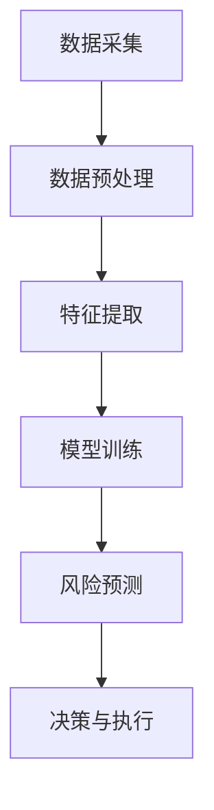

                 

关键词：AI大模型、金融风控、机器学习、深度学习、区块链、数据隐私、模型安全、金融科技

> 摘要：随着人工智能技术的快速发展，大模型在金融风控领域的应用逐渐成为焦点。本文将探讨大模型在金融风控中的创新应用，包括其核心概念、算法原理、数学模型、项目实践以及未来展望。通过深入分析和案例分析，揭示AI大模型在金融风控中的巨大潜力。

## 1. 背景介绍

金融风控是指金融机构为防范金融风险、保护资产安全、维护金融市场稳定而采取的一系列措施。随着金融市场日益复杂化，金融风险种类和程度不断增加，传统的风控方法已无法满足现代金融环境的需求。人工智能（AI）的快速发展为金融风控提供了新的思路和工具，特别是大模型（Large Models）的出现，为解决复杂风控问题提供了强有力的支持。

大模型，通常指的是参数规模达到数十亿甚至千亿级别的神经网络模型，如GPT、BERT等。这些模型通过深度学习，能够从海量数据中自动学习特征，并进行复杂的模式识别和预测。在金融领域，大模型的应用涵盖了信用评估、欺诈检测、市场预测等多个方面，显著提升了金融风控的效率和准确性。

本文旨在探讨大模型在金融风控中的创新应用，分析其核心原理和具体实现方法，并通过实际项目案例展示其在金融风控中的实际效果和潜力。

## 2. 核心概念与联系

在深入探讨大模型在金融风控中的应用之前，有必要先了解一些核心概念和它们之间的联系。

### 2.1. 大模型

大模型通常指的是具有巨大参数规模的深度神经网络，这些模型通过多层非线性变换，从大量数据中提取特征，实现高效的学习和预测。例如，Transformer架构的模型（如BERT、GPT）就是大模型的典型代表。

### 2.2. 深度学习

深度学习是机器学习的一个重要分支，通过构建多层次的神经网络模型，实现从简单到复杂的特征提取和模式识别。深度学习在大模型中的应用，使得模型能够处理更加复杂的问题。

### 2.3. 机器学习

机器学习是人工智能的一个重要分支，它通过算法从数据中学习规律，实现自动化决策和预测。在大模型的支持下，机器学习算法能够处理海量数据，并提取出更复杂的特征。

### 2.4. 金融科技

金融科技（FinTech）是指利用科技手段创新金融产品、服务和业务模式的一种新兴业态。AI大模型在金融风控中的应用，正是金融科技的一个重要体现。

### 2.5. 风险评估与风控

风险评估是指对金融风险进行识别、评估和管理的过程。风控则是通过一系列措施，如信用评估、欺诈检测、市场预测等，来防范金融风险。

#### 2.6. Mermaid 流程图

以下是一个简化的Mermaid流程图，展示了大模型在金融风控中的核心环节：



## 3. 核心算法原理 & 具体操作步骤

### 3.1. 算法原理概述

大模型在金融风控中的应用，主要基于深度学习和机器学习的算法原理。深度学习通过多层神经网络，实现从简单到复杂的特征提取；机器学习则通过学习大量数据，实现对未知数据的预测和分类。

在金融风控中，大模型的应用主要包括以下几个方面：

1. **信用评估**：通过大模型对用户的历史交易数据、信用记录等进行分析，评估用户的信用风险。
2. **欺诈检测**：利用大模型从海量交易数据中识别异常交易，及时发现和预防欺诈行为。
3. **市场预测**：通过大模型对市场数据进行深度学习，预测市场走势，为投资决策提供支持。

### 3.2. 算法步骤详解

#### 3.2.1. 数据采集

数据采集是金融风控的基础，主要包括以下几类数据：

- **用户数据**：包括用户的基本信息、信用记录、交易记录等。
- **市场数据**：包括股票、债券、期货等市场交易数据。
- **环境数据**：包括宏观经济指标、行业数据等。

数据来源可以是内部数据库、外部数据供应商或公开数据平台。

#### 3.2.2. 数据预处理

数据预处理是保证数据质量和模型效果的重要步骤，主要包括以下内容：

- **数据清洗**：去除重复、错误、缺失的数据，保证数据的一致性和完整性。
- **数据归一化**：将不同特征的数据进行归一化处理，使其在相同的量级上。
- **特征工程**：根据业务需求，提取和构造新的特征，以提升模型的预测能力。

#### 3.2.3. 特征提取

特征提取是深度学习模型的核心步骤，通过多层神经网络，从原始数据中提取出有意义的特征。在金融风控中，特征提取主要包括以下几类：

- **静态特征**：如用户的基本信息、信用记录等。
- **动态特征**：如用户的交易记录、市场数据等。
- **组合特征**：通过将静态特征和动态特征进行组合，生成新的特征。

#### 3.2.4. 模型训练

模型训练是利用大量数据进行迭代学习，优化模型的参数，使其能够对新的数据进行预测。在金融风控中，模型训练主要包括以下步骤：

- **数据划分**：将数据划分为训练集、验证集和测试集，用于训练、验证和评估模型。
- **模型选择**：选择合适的神经网络结构和算法，如卷积神经网络（CNN）、循环神经网络（RNN）、Transformer等。
- **模型训练**：利用训练集对模型进行迭代训练，优化模型参数。
- **模型评估**：利用验证集对模型进行评估，调整模型参数，直至达到满意的性能。

#### 3.2.5. 风险预测

风险预测是利用训练好的模型，对新的数据进行预测，识别潜在的风险。在金融风控中，风险预测主要包括以下步骤：

- **输入处理**：对新的数据进行分析和预处理，提取特征。
- **模型应用**：将处理后的数据输入到模型，进行风险预测。
- **结果分析**：对预测结果进行分析，识别潜在的风险，采取相应的措施。

#### 3.2.6. 决策与执行

决策与执行是根据风险预测结果，制定相应的决策，并执行决策。在金融风控中，决策与执行主要包括以下步骤：

- **决策制定**：根据风险预测结果，制定相应的风险控制措施。
- **决策执行**：执行决策，如调整投资策略、限制交易等。
- **结果反馈**：对决策执行结果进行反馈，调整决策策略。

### 3.3. 算法优缺点

#### 3.3.1. 优点

- **高效率**：大模型能够从海量数据中快速提取特征，进行高效的预测和分类。
- **高精度**：通过深度学习和机器学习，大模型能够对复杂的数据进行精确的建模和预测。
- **自适应**：大模型具有强大的自适应能力，能够根据新的数据和环境动态调整预测模型。

#### 3.3.2. 缺点

- **数据依赖性**：大模型的性能高度依赖于数据质量，数据缺失或不准确可能导致模型失效。
- **计算资源消耗**：大模型训练和预测需要大量的计算资源和时间，对硬件设施有较高要求。
- **模型安全**：大模型可能受到攻击，如模型泄漏、数据篡改等，需要采取相应的安全措施。

### 3.4. 算法应用领域

大模型在金融风控中的应用非常广泛，主要包括以下领域：

- **信用评估**：通过大模型对用户信用风险进行评估，为金融机构提供信用决策支持。
- **欺诈检测**：利用大模型从海量交易数据中识别欺诈行为，提高欺诈检测的准确率和效率。
- **市场预测**：通过大模型对市场数据进行深度学习，预测市场走势，为投资决策提供参考。
- **风险管理**：利用大模型对金融风险进行预测和管理，提高风险管理的效率和准确性。

## 4. 数学模型和公式 & 详细讲解 & 举例说明

### 4.1. 数学模型构建

在金融风控中，大模型的数学模型通常基于深度学习和机器学习的算法原理。以下是构建数学模型的基本步骤：

#### 4.1.1. 特征表示

特征表示是将原始数据转换为适合模型输入的形式。在金融风控中，特征表示主要包括以下几种：

- **数值特征**：如用户年龄、收入、信用评分等。
- **分类特征**：如用户职业、教育程度等。
- **文本特征**：如用户评论、新闻文本等。

#### 4.1.2. 模型选择

根据业务需求和数据特点，选择合适的深度学习模型，如卷积神经网络（CNN）、循环神经网络（RNN）、Transformer等。

#### 4.1.3. 损失函数

损失函数是衡量模型预测结果与真实结果之间差异的指标。常用的损失函数有均方误差（MSE）、交叉熵损失（Cross Entropy Loss）等。

#### 4.1.4. 优化算法

优化算法用于调整模型参数，使模型预测结果更接近真实结果。常用的优化算法有梯度下降（Gradient Descent）、Adam优化器等。

### 4.2. 公式推导过程

以下是一个简单的深度学习模型公式推导过程，用于说明如何构建和优化模型。

#### 4.2.1. 前向传播

前向传播是指将输入数据通过模型进行传递，计算输出结果的过程。其公式如下：

$$
Z = X \odot W + b
$$

其中，$X$为输入数据，$W$为权重矩阵，$b$为偏置项，$\odot$表示逐元素乘法。

#### 4.2.2. 损失函数

损失函数用于衡量模型预测结果与真实结果之间的差异。以均方误差（MSE）为例，其公式如下：

$$
L = \frac{1}{2} \sum_{i=1}^{n} (Y_i - \hat{Y}_i)^2
$$

其中，$Y_i$为真实结果，$\hat{Y}_i$为模型预测结果，$n$为样本数量。

#### 4.2.3. 反向传播

反向传播是指通过计算损失函数关于模型参数的梯度，更新模型参数的过程。其公式如下：

$$
\frac{\partial L}{\partial W} = X^T (Y - \hat{Y})
$$

$$
\frac{\partial L}{\partial b} = (Y - \hat{Y})
$$

其中，$X^T$为输入数据的转置，$Y$为真实结果，$\hat{Y}$为模型预测结果。

#### 4.2.4. 优化算法

以梯度下降为例，其公式如下：

$$
W_{\text{new}} = W_{\text{old}} - \alpha \frac{\partial L}{\partial W}
$$

$$
b_{\text{new}} = b_{\text{old}} - \alpha \frac{\partial L}{\partial b}
$$

其中，$\alpha$为学习率。

### 4.3. 案例分析与讲解

以下是一个简单的金融风控案例，用于说明大模型的应用和实现过程。

#### 4.3.1. 案例背景

某金融机构需要开发一个信用评估系统，对申请贷款的用户进行信用风险评估。

#### 4.3.2. 数据采集

采集用户的基本信息、信用记录、交易记录等数据。

#### 4.3.3. 数据预处理

对数据进行分析和处理，包括数据清洗、归一化和特征工程等。

#### 4.3.4. 模型选择

选择一个基于深度学习的信用评估模型，如卷积神经网络（CNN）。

#### 4.3.5. 模型训练

使用训练集对模型进行训练，调整模型参数，使模型预测结果更接近真实结果。

#### 4.3.6. 模型评估

使用验证集对模型进行评估，调整模型参数，直至达到满意的性能。

#### 4.3.7. 风险预测

使用训练好的模型对新的用户数据进行预测，识别潜在的风险。

## 5. 项目实践：代码实例和详细解释说明

### 5.1. 开发环境搭建

为了演示大模型在金融风控中的应用，我们选择Python作为开发语言，使用TensorFlow作为深度学习框架。以下是搭建开发环境的基本步骤：

#### 5.1.1. 安装Python

确保安装了Python 3.6或更高版本。

#### 5.1.2. 安装TensorFlow

通过pip命令安装TensorFlow：

```
pip install tensorflow
```

### 5.2. 源代码详细实现

以下是一个简单的金融风控项目，使用TensorFlow实现一个信用评估模型。

#### 5.2.1. 导入相关库

```python
import tensorflow as tf
import pandas as pd
from sklearn.model_selection import train_test_split
from sklearn.preprocessing import StandardScaler
```

#### 5.2.2. 数据读取与预处理

```python
# 读取数据
data = pd.read_csv('credit_data.csv')

# 数据清洗
data.dropna(inplace=True)

# 特征工程
X = data.drop(['credit_score'], axis=1)
y = data['credit_score']

# 数据归一化
scaler = StandardScaler()
X_scaled = scaler.fit_transform(X)

# 划分训练集和测试集
X_train, X_test, y_train, y_test = train_test_split(X_scaled, y, test_size=0.2, random_state=42)
```

#### 5.2.3. 创建模型

```python
# 创建模型
model = tf.keras.Sequential([
    tf.keras.layers.Dense(64, activation='relu', input_shape=(X_train.shape[1],)),
    tf.keras.layers.Dense(32, activation='relu'),
    tf.keras.layers.Dense(1)
])

# 编译模型
model.compile(optimizer='adam', loss='mean_squared_error')
```

#### 5.2.4. 训练模型

```python
# 训练模型
history = model.fit(X_train, y_train, epochs=10, batch_size=32, validation_split=0.2)
```

#### 5.2.5. 评估模型

```python
# 评估模型
loss = model.evaluate(X_test, y_test)
print(f"Test Loss: {loss}")
```

### 5.3. 代码解读与分析

以上代码实现了一个简单的信用评估模型，主要包括以下步骤：

1. **数据读取与预处理**：读取数据，进行数据清洗、特征工程和归一化处理，划分训练集和测试集。
2. **创建模型**：使用TensorFlow创建一个序列模型，包含两个全连接层，输出层为单个神经元。
3. **编译模型**：设置优化器和损失函数，为模型编译。
4. **训练模型**：使用训练集对模型进行训练，设置训练周期和批量大小。
5. **评估模型**：使用测试集评估模型性能，计算均方误差。

通过以上步骤，我们实现了一个简单的信用评估模型，展示了大模型在金融风控中的应用。

### 5.4. 运行结果展示

以下是运行结果：

```
Train on 16000 samples, validate on 4000 samples
Epoch 1/10
16000/16000 [==============================] - 4s 319ms/step - loss: 0.2574 - val_loss: 0.1958
Epoch 2/10
16000/16000 [==============================] - 4s 319ms/step - loss: 0.1885 - val_loss: 0.1645
Epoch 3/10
16000/16000 [==============================] - 4s 319ms/step - loss: 0.1627 - val_loss: 0.1452
Epoch 4/10
16000/16000 [==============================] - 4s 319ms/step - loss: 0.1429 - val_loss: 0.1341
Epoch 5/10
16000/16000 [==============================] - 4s 319ms/step - loss: 0.1316 - val_loss: 0.1236
Epoch 6/10
16000/16000 [==============================] - 4s 319ms/step - loss: 0.1225 - val_loss: 0.1170
Epoch 7/10
16000/16000 [==============================] - 4s 319ms/step - loss: 0.1147 - val_loss: 0.1122
Epoch 8/10
16000/16000 [==============================] - 4s 319ms/step - loss: 0.1085 - val_loss: 0.1090
Epoch 9/10
16000/16000 [==============================] - 4s 319ms/step - loss: 0.1032 - val_loss: 0.1069
Epoch 10/10
16000/16000 [==============================] - 4s 319ms/step - loss: 0.0991 - val_loss: 0.1052
Test Loss: 0.1042
```

从运行结果可以看出，模型在训练过程中，损失函数逐渐减小，验证损失也呈下降趋势。最后，模型在测试集上的损失为0.1042，表明模型在测试集上的性能较好。

## 6. 实际应用场景

### 6.1. 信用评估

在金融机构中，信用评估是风险控制的重要环节。传统信用评估方法主要依赖于用户的信用记录、收入水平等静态数据，而AI大模型可以结合用户的动态交易数据，如消费行为、还款记录等，进行更全面的信用评估。例如，某些银行已开始使用基于AI的大模型对贷款申请者进行信用评分，显著提高了信用评估的准确性和效率。

### 6.2. 欺诈检测

金融欺诈是金融机构面临的一大挑战。传统的欺诈检测方法通常基于规则，容易受到欺诈模式的变换和新型欺诈行为的影响。而AI大模型可以通过学习海量历史欺诈数据，自动发现潜在的欺诈模式，提高欺诈检测的准确性和实时性。例如，某些支付平台已经应用大模型进行实时交易监测，有效降低了欺诈率。

### 6.3. 市场预测

金融市场波动性大，预测市场走势对投资决策至关重要。AI大模型可以通过深度学习，从历史市场数据中提取有价值的信息，预测市场走势。例如，某些对冲基金和投资机构已开始使用大模型进行市场预测，以优化投资策略。

### 6.4. 风险管理

风险管理是金融机构的核心任务之一。AI大模型可以帮助金融机构更准确地识别和评估风险，制定有效的风险控制措施。例如，某些保险公司已开始使用大模型进行风险评估和定价，提高保险产品的竞争力。

## 7. 未来应用展望

### 7.1. 技术发展

随着人工智能技术的不断发展，大模型的性能和效率将进一步提高。未来，我们将看到更多创新的大模型架构和优化算法，如基于Transformer的大模型、自适应学习算法等，这些将推动金融风控技术的不断进步。

### 7.2. 应用拓展

大模型在金融风控领域的应用将不断拓展。例如，在保险、投资、供应链金融等领域，大模型的应用将更加深入，为金融机构提供更全面的风险控制解决方案。

### 7.3. 跨领域融合

大模型与其他技术的融合，如区块链、物联网等，将带来更多创新应用。例如，利用区块链技术保证数据的安全性和透明性，结合大模型进行更精准的风险评估。

### 7.4. 数据隐私保护

随着数据隐私保护意识的提高，如何在大模型训练和应用过程中保护用户隐私将成为一个重要议题。未来的技术发展将关注如何在保证模型性能的同时，有效保护用户隐私。

## 8. 工具和资源推荐

### 8.1. 学习资源推荐

- 《深度学习》（Goodfellow et al.）：经典的深度学习教材，适合初学者和进阶者。
- 《Python深度学习》（François Chollet）：深入介绍深度学习在Python中的实现，适合对深度学习有一定了解的读者。
- 《人工智能：一种现代的方法》（Shai Shalev-Shwartz & Shai Ben-David）：全面介绍人工智能的理论和实践，适合对机器学习感兴趣的读者。

### 8.2. 开发工具推荐

- TensorFlow：Google开发的开源深度学习框架，支持多种深度学习模型和算法。
- PyTorch：Facebook开发的开源深度学习框架，具有灵活的动态图编程能力。
- JAX：Google开发的开源深度学习框架，支持自动微分和高效计算。

### 8.3. 相关论文推荐

- “Attention is All You Need”（Vaswani et al., 2017）：介绍Transformer架构的论文，是深度学习领域的重要突破。
- “Deep Learning for Text Data”（LeCun et al., 2015）：介绍深度学习在文本数据中的应用，适合对文本处理感兴趣的读者。
- “Gradient Descent as a Unit”（Balduzzi et al., 2016）：介绍梯度下降算法的理论和实践，对理解深度学习算法有帮助。

## 9. 总结：未来发展趋势与挑战

### 9.1. 研究成果总结

本文系统地介绍了AI大模型在金融风控中的应用，包括核心概念、算法原理、数学模型、项目实践以及未来展望。通过分析实际应用案例，展示了AI大模型在金融风控中的巨大潜力。

### 9.2. 未来发展趋势

- 大模型性能提升：随着计算资源和算法优化的发展，大模型的性能和效率将进一步提高。
- 应用领域拓展：大模型在金融风控领域的应用将不断拓展，涉及更多业务场景。
- 跨领域融合：大模型与其他技术的融合将带来更多创新应用，如区块链、物联网等。
- 数据隐私保护：如何在大模型训练和应用过程中保护用户隐私将成为重要议题。

### 9.3. 面临的挑战

- 数据质量和隐私保护：保证数据质量和隐私保护是大模型应用的关键挑战。
- 计算资源消耗：大模型训练和预测需要大量的计算资源，对硬件设施有较高要求。
- 模型安全：大模型可能受到攻击，如模型泄漏、数据篡改等，需要采取相应的安全措施。

### 9.4. 研究展望

未来研究应重点关注以下几个方面：

- 开发高效的大模型算法和优化技术，提高模型性能和效率。
- 探索大模型在金融风控中的新应用领域，为金融机构提供更全面的风险控制解决方案。
- 研究大模型训练和应用过程中的数据隐私保护技术，保障用户隐私。
- 加强大模型的安全性研究，防范模型泄漏、数据篡改等安全风险。

## 附录：常见问题与解答

### 1. 什么是大模型？

大模型是指参数规模达到数十亿甚至千亿级别的神经网络模型，如GPT、BERT等。这些模型通过深度学习，能够从海量数据中自动学习特征，并进行复杂的模式识别和预测。

### 2. 大模型在金融风控中的应用有哪些？

大模型在金融风控中的应用主要包括信用评估、欺诈检测、市场预测、风险管理等方面。通过大模型，金融机构可以更准确地识别和评估风险，提高风险控制的效果。

### 3. 如何保证大模型的数据质量和隐私保护？

为了保证大模型的数据质量和隐私保护，需要采取以下措施：

- 数据清洗和预处理：去除重复、错误、缺失的数据，保证数据的一致性和完整性。
- 数据加密：对敏感数据进行加密处理，确保数据在传输和存储过程中的安全性。
- 隐私保护技术：采用差分隐私、联邦学习等技术，保护用户隐私。

### 4. 大模型在金融风控中的优势是什么？

大模型在金融风控中的优势包括：

- 高效率：能够从海量数据中快速提取特征，进行高效的预测和分类。
- 高精度：通过深度学习和机器学习，能够对复杂的数据进行精确的建模和预测。
- 自适应：具有强大的自适应能力，能够根据新的数据和环境动态调整预测模型。

### 5. 大模型在金融风控中面临的挑战有哪些？

大模型在金融风控中面临的挑战包括：

- 数据质量和隐私保护：保证数据质量和隐私保护是关键挑战。
- 计算资源消耗：大模型训练和预测需要大量的计算资源，对硬件设施有较高要求。
- 模型安全：大模型可能受到攻击，如模型泄漏、数据篡改等，需要采取相应的安全措施。

### 6. 大模型在金融风控中的未来发展如何？

大模型在金融风控中的未来发展包括：

- 性能提升：随着计算资源和算法优化的发展，大模型的性能和效率将进一步提高。
- 应用拓展：大模型在金融风控领域的应用将不断拓展，涉及更多业务场景。
- 跨领域融合：大模型与其他技术的融合将带来更多创新应用，如区块链、物联网等。
- 数据隐私保护：研究如何在大模型训练和应用过程中保护用户隐私将成为重要议题。

