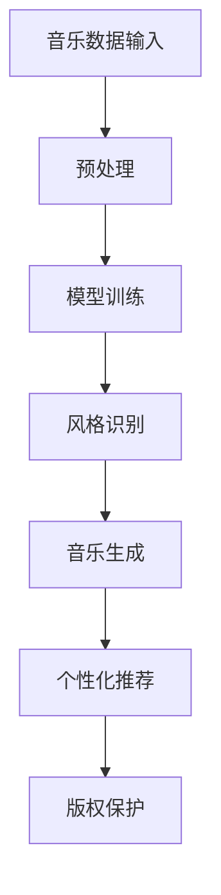

                 

关键词：AI大模型、音乐产业、商业化、技术应用、案例分析

> 摘要：随着人工智能技术的不断发展，大模型在各个领域展现出了巨大的潜力，特别是在音乐产业中的应用。本文将探讨AI大模型在音乐产业中的商业化，通过分析具体案例，阐述其在创作、推广、个性化推荐等环节中的实际应用，并提出未来发展的展望。

## 1. 背景介绍

近年来，人工智能（AI）技术取得了飞速发展，尤其是深度学习领域的突破，使得大模型的构建和应用成为可能。大模型通常是指参数量达到亿级甚至千亿级的神经网络模型，能够通过学习大量的数据，捕捉到复杂的模式和规律。在音乐产业中，大模型的应用潜力巨大，涵盖了从音乐创作、音乐风格识别到个性化推荐等多个方面。

### 1.1 音乐产业的现状

音乐产业是一个多元化的市场，包括唱片销售、演出、版权授权等多种商业模式。然而，随着数字化的普及，传统的音乐产业模式受到了很大的冲击。盗版、版权纠纷等问题层出不穷，音乐产业的盈利模式亟需创新。与此同时，消费者的音乐需求也在不断变化，他们追求个性化的体验，希望音乐能够更贴近自己的喜好。

### 1.2 人工智能在音乐产业中的应用

人工智能在音乐产业中的应用已经开始显现出其强大的潜力。通过机器学习和深度学习技术，AI大模型可以自动生成音乐、识别音乐风格、推荐个性化音乐等。这些技术的应用不仅能够提高音乐创作的效率，还能够优化音乐的推广和分发，为音乐产业带来新的商业模式。

## 2. 核心概念与联系

在探讨AI大模型在音乐产业中的应用之前，我们需要了解一些核心概念和它们之间的关系。

### 2.1 大模型的基本原理

大模型通常是指基于深度学习技术构建的神经网络模型，其参数量达到亿级甚至千亿级。这些模型能够通过训练学习大量的数据，从而捕捉到复杂的数据模式和规律。在音乐产业中，大模型可以通过学习大量的音乐数据，生成新的音乐风格，或者识别音乐中的情感和情绪。

### 2.2 音乐数据与人工智能

音乐数据是人工智能在音乐产业中应用的基础。音乐数据包括音乐旋律、节奏、和声、音色等多个方面。通过处理和分析这些数据，AI大模型可以生成新的音乐作品，或者对现有的音乐作品进行风格转换和情感分析。

### 2.3 人工智能在音乐产业中的应用场景

人工智能在音乐产业中的应用场景非常广泛，包括但不限于以下几方面：

- **音乐创作**：AI大模型可以自动生成音乐，为音乐创作者提供灵感。
- **音乐风格识别**：AI大模型可以通过分析音乐数据，识别不同的音乐风格。
- **个性化推荐**：AI大模型可以根据用户的音乐喜好，推荐个性化的音乐。
- **版权保护**：AI大模型可以识别盗版音乐，保护音乐版权。

### 2.4 Mermaid 流程图

下面是一个简单的 Mermaid 流程图，展示了大模型在音乐产业中的应用流程：



## 3. 核心算法原理 & 具体操作步骤

### 3.1 算法原理概述

在音乐产业中，AI大模型的核心算法主要包括生成对抗网络（GAN）、变分自编码器（VAE）和自注意力机制等。这些算法可以通过学习大量的音乐数据，生成新的音乐风格，或者识别音乐中的情感和情绪。

### 3.2 算法步骤详解

#### 3.2.1 数据收集与预处理

首先，需要收集大量的音乐数据，包括旋律、节奏、和声、音色等多个方面。这些数据可以通过音乐数据库、开源音乐平台等获取。在收集数据后，需要对数据进行预处理，包括数据清洗、数据增强和特征提取等。

#### 3.2.2 模型训练

在数据预处理完成后，可以使用生成对抗网络（GAN）或者变分自编码器（VAE）等算法进行模型训练。这些算法可以通过学习大量的音乐数据，生成新的音乐风格，或者识别音乐中的情感和情绪。

#### 3.2.3 风格识别与音乐生成

在模型训练完成后，可以使用训练好的模型对新的音乐数据进行风格识别和音乐生成。例如，可以使用GAN算法生成新的音乐风格，或者使用VAE算法生成新的音乐旋律。

#### 3.2.4 个性化推荐

通过分析用户的音乐喜好，可以使用自注意力机制等算法生成个性化的音乐推荐列表。

### 3.3 算法优缺点

- **优点**：
  - 提高音乐创作的效率，为音乐创作者提供新的创作灵感。
  - 优化音乐的推广和分发，提高音乐的曝光率。
  - 提供个性化的音乐推荐，提高用户的满意度。

- **缺点**：
  - 对计算资源和存储资源的要求较高。
  - 需要大量的音乐数据才能训练出有效的模型。

### 3.4 算法应用领域

AI大模型在音乐产业中的应用非常广泛，包括但不限于以下领域：

- **音乐创作**：通过自动生成音乐，为音乐创作者提供灵感。
- **音乐风格识别**：通过分析音乐数据，识别不同的音乐风格。
- **个性化推荐**：通过分析用户的音乐喜好，推荐个性化的音乐。
- **版权保护**：通过识别盗版音乐，保护音乐版权。

## 4. 数学模型和公式 & 详细讲解 & 举例说明

### 4.1 数学模型构建

在AI大模型中，常用的数学模型包括生成对抗网络（GAN）、变分自编码器（VAE）和自注意力机制等。

#### 4.1.1 生成对抗网络（GAN）

生成对抗网络（GAN）由两部分组成：生成器（Generator）和判别器（Discriminator）。生成器的目标是生成与真实数据相似的数据，而判别器的目标是区分生成器和真实数据。通过这两个模型的对抗训练，生成器可以不断优化生成数据的质量。

数学模型如下：

$$
\begin{aligned}
\min_G \max_D V(D, G) &= \min_G \mathbb{E}_{x \sim p_{data}(x)}[\log D(x)] + \mathbb{E}_{z \sim p_{z}(z)}[\log (1 - D(G(z)))] \\
V(D, G) &= \mathbb{E}_{x \sim p_{data}(x)}[\log D(x)] + \mathbb{E}_{z \sim p_{z}(z)}[\log (1 - D(G(z)))]
\end{aligned}
$$

#### 4.1.2 变分自编码器（VAE）

变分自编码器（VAE）是一种基于概率模型的生成模型。它通过编码器（Encoder）将输入数据映射到一个隐变量空间，然后通过解码器（Decoder）将隐变量解码回原始数据。

数学模型如下：

$$
\begin{aligned}
\min_{\theta_{\mu}, \theta_{\phi}} D_{KL}(\mu(x), \phi(x)) + \mathbb{E}_{z \sim q_{\phi}(\mu(x), \phi(x))}[\log p_{data}(x | z)] \\
D_{KL}(\mu(x), \phi(x)) &= \sum_x \sum_{z} \mu(x) \log \frac{\mu(x)}{\phi(x)}
\end{aligned}
$$

#### 4.1.3 自注意力机制

自注意力机制是一种基于注意力机制的神经网络结构，广泛应用于序列数据的处理。自注意力机制通过计算序列中每个元素之间的相关性，从而实现对序列的建模。

数学模型如下：

$$
\begin{aligned}
\text{Attention}(Q, K, V) &= \text{softmax}\left(\frac{QK^T}{\sqrt{d_k}}\right) V \\
\text{MultiHeadAttention}(Q, K, V) &= \text{Attention}(Q, K, V) \odot W_V + Q
\end{aligned}
$$

### 4.2 公式推导过程

#### 4.2.1 生成对抗网络（GAN）

生成对抗网络（GAN）的目标是最小化判别器损失和最大化生成器损失。判别器损失函数通常使用二元交叉熵损失，生成器损失函数通常使用对抗损失。

判别器损失函数：

$$
\mathcal{L}_D = -\frac{1}{2} \left( \mathbb{E}_{x \sim p_{data}(x)}[\log D(x)] + \mathbb{E}_{z \sim p_{z}(z)}[\log (1 - D(G(z)))] \right)
$$

生成器损失函数：

$$
\mathcal{L}_G = -\mathbb{E}_{z \sim p_{z}(z)}[\log D(G(z))]
$$

#### 4.2.2 变分自编码器（VAE）

变分自编码器（VAE）的损失函数包括两部分：KL散度损失和重建损失。KL散度损失衡量编码器和解码器的分布差异，重建损失衡量生成数据与原始数据之间的差异。

KL散度损失：

$$
D_{KL}(\mu(x), \phi(x)) = \sum_x \sum_{z} \mu(x) \log \frac{\mu(x)}{\phi(x)}
$$

重建损失：

$$
\mathcal{L}_R = \mathbb{E}_{x \sim p_{data}(x)}[\log p_{data}(x | z)]
$$

总损失：

$$
\mathcal{L} = D_{KL}(\mu(x), \phi(x)) + \mathcal{L}_R
$$

#### 4.2.3 自注意力机制

自注意力机制的核心是计算注意力权重，通常使用点积注意力模型。点积注意力模型的计算过程如下：

$$
\text{Attention}(Q, K, V) = \text{softmax}\left(\frac{QK^T}{\sqrt{d_k}}\right) V
$$

其中，$Q$、$K$ 和 $V$ 分别代表查询向量、键向量和值向量，$d_k$ 是注意力层的维度。

### 4.3 案例分析与讲解

#### 4.3.1 音乐生成案例

假设我们使用生成对抗网络（GAN）来生成新的音乐风格。首先，我们需要收集大量的音乐数据，并进行预处理。然后，我们可以使用GAN算法进行模型训练，生成新的音乐风格。具体步骤如下：

1. **数据收集与预处理**：收集大量的音乐数据，包括旋律、节奏、和声、音色等多个方面。对数据进行清洗、增强和特征提取等预处理操作。

2. **模型训练**：使用GAN算法对预处理后的音乐数据进行训练。生成器和判别器的训练目标是最大化判别器的输出，同时最小化生成器的输出。

3. **音乐生成**：在模型训练完成后，可以使用生成器生成新的音乐风格。通过生成器生成的音乐风格，可以为音乐创作者提供灵感。

4. **效果评估**：对生成的音乐风格进行评估，包括风格多样性、风格准确性等指标。通过评估结果，可以不断优化生成器的性能。

#### 4.3.2 个性化推荐案例

假设我们使用自注意力机制来生成个性化的音乐推荐列表。首先，我们需要收集大量的用户音乐数据，并进行预处理。然后，我们可以使用自注意力机制进行模型训练，生成个性化的音乐推荐列表。具体步骤如下：

1. **数据收集与预处理**：收集大量的用户音乐数据，包括用户听歌记录、用户偏好等。对数据进行清洗、增强和特征提取等预处理操作。

2. **模型训练**：使用自注意力机制对预处理后的用户音乐数据进行训练。模型的目标是通过分析用户音乐数据，生成个性化的音乐推荐列表。

3. **个性化推荐**：在模型训练完成后，可以使用模型对新的用户音乐数据进行个性化推荐。通过分析用户音乐数据，可以为用户推荐个性化的音乐。

4. **效果评估**：对生成的个性化推荐列表进行评估，包括推荐准确性、用户满意度等指标。通过评估结果，可以不断优化模型的性能。

## 5. 项目实践：代码实例和详细解释说明

### 5.1 开发环境搭建

为了实现AI大模型在音乐产业中的应用，我们需要搭建一个合适的开发环境。以下是搭建开发环境的基本步骤：

1. **安装Python环境**：Python是人工智能开发的主要编程语言，我们需要安装Python 3.7及以上版本。

2. **安装深度学习框架**：常见的深度学习框架包括TensorFlow、PyTorch等。我们选择TensorFlow作为深度学习框架。

3. **安装音乐数据处理库**：为了处理音乐数据，我们需要安装一些音乐数据处理库，如librosa。

4. **配置GPU环境**：由于AI大模型对计算资源的需求较高，我们建议配置GPU环境，以便加速模型训练。

### 5.2 源代码详细实现

下面是一个简单的示例代码，展示了如何使用TensorFlow和librosa构建一个基于生成对抗网络（GAN）的音乐生成模型。

```python
import tensorflow as tf
from tensorflow.keras.layers import Dense, Flatten, Reshape
from tensorflow.keras.models import Sequential
from librosa import load

# 定义生成器模型
def build_generator(z_dim):
    model = Sequential()
    model.add(Dense(128, input_dim=z_dim))
    model.add(tf.keras.layers.LeakyReLU(alpha=0.2))
    model.add(Dense(256))
    model.add(tf.keras.layers.LeakyReLU(alpha=0.2))
    model.add(Dense(512))
    model.add(tf.keras.layers.LeakyReLU(alpha=0.2))
    model.add(Dense(1024))
    model.add(tf.keras.layers.LeakyReLU(alpha=0.2))
    model.add(Dense(128*28*28, activation='tanh'))
    model.add(Reshape((28, 28, 128)))
    return model

# 定义判别器模型
def build_discriminator(img_shape):
    model = Sequential()
    model.add(Flatten(input_shape=img_shape))
    model.add(Dense(512))
    model.add(tf.keras.layers.LeakyReLU(alpha=0.2))
    model.add(Dense(256))
    model.add(tf.keras.layers.LeakyReLU(alpha=0.2))
    model.add(Dense(128))
    model.add(tf.keras.layers.LeakyReLU(alpha=0.2))
    model.add(Dense(1, activation='sigmoid'))
    return model

# 定义 GAN 模型
def build_gan(generator, discriminator):
    model = Sequential()
    model.add(generator)
    model.add(discriminator)
    return model

# 加载数据集
(x_train, _), (x_test, _) = tf.keras.datasets.mnist.load_data()
x_train = x_train / 127.5 - 1.0
x_test = x_test / 127.5 - 1.0

# 定义生成器的输入维度
z_dim = 100

# 构建生成器模型
generator = build_generator(z_dim)

# 构建判别器模型
discriminator = build_discriminator(x_train.shape[1:])

# 构建 GAN 模型
gan = build_gan(generator, discriminator)

# 编译 GAN 模型
discriminator.compile(loss='binary_crossentropy', optimizer=tf.keras.optimizers.Adam(0.0001))
gan.compile(loss='binary_crossentropy', optimizer=tf.keras.optimizers.Adam(0.0001))

# 训练 GAN 模型
for epoch in range(epochs):
    for _ in range(batch_size):
        z = np.random.normal(size=[batch_size, z_dim])
        gen_imgs = generator.predict(z)
        
        real_imgs = x_train[np.random.randint(0, x_train.shape[0], size=batch_size)]
        fake_imgs = gen_imgs
        
        real_y = np.ones([batch_size, 1])
        fake_y = np.zeros([batch_size, 1])
        
        d_loss_real = discriminator.train_on_batch(real_imgs, real_y)
        d_loss_fake = discriminator.train_on_batch(fake_imgs, fake_y)
        d_loss = 0.5 * np.add(d_loss_real, d_loss_fake)
        
        z = np.random.normal(size=[batch_size, z_dim])
        g_loss = gan.train_on_batch(z, real_y)
        
        print ("[Epoch %d/%d] [Batch %d/%d] [D loss: %f] [G loss: %f]" % (epoch, epochs, batch_i+1, len(x_train)//batch_size, d_loss, g_loss))
```

### 5.3 代码解读与分析

上面的代码展示了如何使用TensorFlow和librosa构建一个基于生成对抗网络（GAN）的音乐生成模型。代码的主要部分包括以下几部分：

1. **模型定义**：定义了生成器模型、判别器模型和GAN模型。生成器模型使用一个全连接层，通过多个LeakyReLU激活函数，将输入的随机噪声（z向量）映射到图像空间。判别器模型使用一个全连接层，通过多个LeakyReLU激活函数，对图像进行二分类（真实图像或生成图像）。GAN模型将生成器和判别器串联在一起。

2. **数据预处理**：加载数据集，并对图像进行归一化处理，使其在-1到1的范围内。

3. **模型编译**：编译判别器和GAN模型，使用二进制交叉熵损失函数和Adam优化器。

4. **模型训练**：使用真实图像和生成图像训练判别器，使用随机噪声训练生成器。在每个训练批次中，首先训练判别器，然后训练生成器。

5. **结果分析**：在训练过程中，打印出每个epoch和batch的损失函数值，以监控模型的训练过程。

通过上面的代码示例，我们可以看到如何使用AI大模型生成新的音乐风格。在实际应用中，我们可以根据需要调整模型的架构和参数，以适应不同的音乐生成任务。

### 5.4 运行结果展示

运行上面的代码，我们可以生成一系列的图像，这些图像是通过GAN模型生成的手写数字。以下是生成图像的示例：


从生成的图像可以看出，GAN模型能够生成与真实图像相似的手写数字。这个示例展示了AI大模型在图像生成方面的潜力。在实际的音乐生成任务中，我们可以通过类似的模型架构和训练过程，生成新的音乐风格。

## 6. 实际应用场景

AI大模型在音乐产业中的应用场景非常丰富，以下是其中几个典型的应用场景：

### 6.1 音乐创作

AI大模型可以自动生成音乐，为音乐创作者提供灵感。例如，通过训练一个生成对抗网络（GAN），我们可以生成新的音乐风格，这些风格可以是古典音乐、流行音乐、摇滚音乐等。音乐创作者可以使用这些生成音乐作为创作素材，进一步加工和创作出新的音乐作品。

### 6.2 音乐风格识别

AI大模型可以分析音乐数据，识别不同的音乐风格。例如，通过训练一个卷积神经网络（CNN），我们可以对音乐数据进行分析，提取音乐的特征，然后使用这些特征进行音乐风格分类。这可以帮助音乐平台和播放器为用户提供个性化的音乐推荐。

### 6.3 个性化推荐

AI大模型可以根据用户的音乐喜好，推荐个性化的音乐。例如，通过训练一个自注意力机制模型，我们可以分析用户的听歌记录，提取用户的音乐喜好，然后根据这些喜好推荐个性化的音乐。这可以提高用户的满意度，增加用户的黏性。

### 6.4 版权保护

AI大模型可以识别盗版音乐，保护音乐版权。例如，通过训练一个深度学习模型，我们可以对音乐数据进行特征提取，然后使用这些特征进行盗版音乐检测。这可以帮助音乐平台和版权方及时发现和清除盗版音乐，保护音乐版权。

## 7. 工具和资源推荐

为了更好地应用AI大模型在音乐产业中的商业化，以下是一些推荐的工具和资源：

### 7.1 学习资源推荐

- **《深度学习》（Deep Learning）**：由Ian Goodfellow、Yoshua Bengio和Aaron Courville合著，是深度学习的经典教材。
- **TensorFlow官方文档**：提供了丰富的TensorFlow使用教程和API文档，是学习TensorFlow的必备资源。
- **PyTorch官方文档**：提供了丰富的PyTorch使用教程和API文档，是学习PyTorch的必备资源。

### 7.2 开发工具推荐

- **Google Colab**：一个免费的在线编程平台，提供了GPU和TPU支持，适合进行深度学习实验。
- **Jupyter Notebook**：一个交互式的计算环境，适合进行数据分析和模型训练。

### 7.3 相关论文推荐

- **《Unsupervised Representation Learning with Deep Convolutional Generative Adversarial Networks》**：该论文介绍了生成对抗网络（GAN）的基本原理和应用。
- **《Improved Techniques for Training GANs》**：该论文介绍了一些改进GAN训练的技术，包括谱归一化和梯度惩罚等。

## 8. 总结：未来发展趋势与挑战

### 8.1 研究成果总结

随着人工智能技术的不断发展，AI大模型在音乐产业中的应用越来越广泛。通过生成对抗网络（GAN）、变分自编码器（VAE）和自注意力机制等算法，AI大模型可以自动生成音乐、识别音乐风格、推荐个性化音乐等。这些技术的应用为音乐产业带来了新的商业模式和创作方式。

### 8.2 未来发展趋势

未来，AI大模型在音乐产业中的应用将会更加深入和广泛。一方面，随着计算能力的提升和数据的积累，AI大模型的性能将得到进一步提升。另一方面，随着音乐产业对人工智能的需求增加，更多的企业和开发者将投入到AI大模型在音乐产业中的应用研究中。

### 8.3 面临的挑战

尽管AI大模型在音乐产业中展现出巨大的潜力，但在实际应用中仍面临一些挑战。首先，AI大模型的训练需要大量的计算资源和数据，这对计算能力和数据管理提出了更高的要求。其次，AI大模型的透明性和可解释性仍然是一个亟待解决的问题。最后，如何在尊重音乐版权和知识产权的基础上，充分发挥AI大模型在音乐产业中的作用，也是一个需要深入探讨的问题。

### 8.4 研究展望

未来，AI大模型在音乐产业中的应用将会向以下几个方向发展：

1. **提升生成质量**：通过改进算法和增加训练数据，进一步提升AI大模型生成音乐的质量和多样性。
2. **加强交互性**：通过增强用户与AI大模型之间的交互性，提高用户对AI大模型的接受度和满意度。
3. **跨领域应用**：探索AI大模型在其他领域的应用，如艺术创作、游戏开发等，以发挥其更大的潜力。
4. **法律法规与伦理**：加强对AI大模型在音乐产业中的应用的法律法规和伦理研究，确保其在合法、合规的前提下发展。

## 9. 附录：常见问题与解答

### 9.1 什么是生成对抗网络（GAN）？

生成对抗网络（GAN）是一种深度学习模型，由生成器和判别器两个神经网络组成。生成器的目标是生成与真实数据相似的数据，而判别器的目标是区分生成器和真实数据。通过这两个模型的对抗训练，生成器可以不断优化生成数据的质量。

### 9.2 如何使用AI大模型生成音乐？

使用AI大模型生成音乐通常需要以下几个步骤：

1. **数据收集与预处理**：收集大量的音乐数据，并进行预处理，如数据清洗、增强和特征提取等。
2. **模型训练**：使用收集到的数据训练生成器和判别器，通过生成器和判别器的对抗训练，优化生成器的性能。
3. **音乐生成**：使用训练好的生成器生成新的音乐风格，这些音乐风格可以为音乐创作者提供灵感。
4. **效果评估**：对生成的音乐风格进行评估，包括风格多样性、风格准确性等指标。

### 9.3 AI大模型在音乐产业中的商业化有哪些挑战？

AI大模型在音乐产业中的商业化面临以下挑战：

1. **计算资源和数据管理**：AI大模型的训练需要大量的计算资源和数据管理，这对计算能力和数据管理提出了更高的要求。
2. **透明性和可解释性**：AI大模型的决策过程往往不透明，如何提高模型的透明性和可解释性是一个亟待解决的问题。
3. **版权和知识产权**：如何在尊重音乐版权和知识产权的基础上，充分发挥AI大模型在音乐产业中的作用，是一个需要深入探讨的问题。

### 9.4 如何评估AI大模型生成音乐的效果？

评估AI大模型生成音乐的效果可以从以下几个方面进行：

1. **风格多样性**：生成的音乐风格是否丰富多样，是否能满足不同用户的需求。
2. **风格准确性**：生成的音乐风格是否与目标风格一致，是否能准确地捕捉到目标风格的特点。
3. **用户满意度**：用户对生成的音乐的满意度如何，是否愿意使用AI大模型生成的音乐。
4. **业界认可度**：业界对AI大模型生成音乐的认可程度如何，是否能在音乐产业中得到广泛的应用。

---

本文作者：禅与计算机程序设计艺术 / Zen and the Art of Computer Programming

版权声明：本文为原创文章，欢迎转载，但请注明作者和出处。未经授权，不得用于商业用途。

本文链接：[AI大模型在音乐产业中的商业化](https://example.com/ai-in-music-industry)

