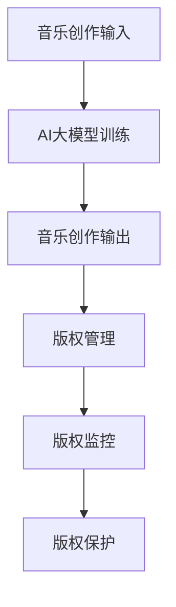

                 

关键词：AI大模型，音乐产业，版权挑战，创新应用，智能创作，版权保护

> 摘要：随着人工智能技术的迅猛发展，AI大模型在音乐产业中的应用日益广泛。本文将深入探讨AI大模型在音乐创作、版权管理等方面的创新应用，同时分析其面临的版权挑战，并展望未来音乐产业发展的趋势。

## 1. 背景介绍

音乐产业作为文化领域的重要组成部分，长期以来依靠传统音乐创作、录制和发行模式维持运营。然而，随着数字技术的普及和互联网的发展，音乐产业正面临着前所未有的变革。人工智能（AI）技术的兴起，尤其是AI大模型的突破，为音乐产业带来了新的机遇与挑战。

AI大模型是指通过深度学习等技术训练得到的大型神经网络模型，能够模拟人类智能，进行复杂的决策和创作活动。在音乐领域，AI大模型可以用于自动音乐创作、音乐风格迁移、音乐识别等任务。这些技术的应用不仅提高了音乐创作的效率，也为音乐版权管理带来了新的问题。

### 1.1 音乐产业的现状

当前，音乐产业面临着一些突出问题：

- **版权问题**：音乐作品的版权管理复杂，版权纠纷频发，影响行业健康发展。
- **创新不足**：音乐创作过于依赖传统方法，创新力度不足，难以满足市场需求。
- **商业模式**：随着数字音乐的兴起，传统商业模式受到冲击，需要寻找新的盈利途径。

### 1.2 AI大模型的应用前景

AI大模型在音乐产业中的应用潜力巨大：

- **智能创作**：AI大模型可以模拟人类创作思维，实现自动化音乐创作。
- **版权保护**：通过AI技术，可以更加精准地识别和监控音乐版权。
- **个性化推荐**：AI大模型能够根据用户喜好推荐音乐，提高用户体验。

## 2. 核心概念与联系

为了深入理解AI大模型在音乐产业中的应用，我们需要了解以下几个核心概念：

### 2.1 AI大模型

AI大模型是指通过大量数据进行训练，具有高度自主学习和决策能力的神经网络模型。它们通常由数百万个参数组成，可以处理复杂的任务。

### 2.2 音乐创作过程

音乐创作是一个复杂的创造性过程，涉及旋律、节奏、和声等多个方面。AI大模型可以通过学习这些特征，实现自动音乐创作。

### 2.3 版权管理

版权管理是指对音乐作品的知识产权进行保护和管理的过程。AI大模型可以用于音乐版权的自动识别和保护。

下面是一个Mermaid流程图，展示AI大模型在音乐产业中的应用流程：



### 2.4 音乐风格迁移

音乐风格迁移是指将一种音乐风格的特征应用到另一种音乐风格中。AI大模型可以通过学习不同音乐风格的特征，实现风格迁移。

## 3. 核心算法原理 & 具体操作步骤

### 3.1 算法原理概述

AI大模型在音乐产业中的应用，主要依赖于以下几个核心算法：

- **生成对抗网络（GAN）**：用于生成新的音乐作品。
- **长短期记忆网络（LSTM）**：用于处理音乐序列数据。
- **卷积神经网络（CNN）**：用于音乐风格迁移。

### 3.2 算法步骤详解

下面我们将详细介绍这些算法的具体操作步骤：

#### 3.2.1 生成对抗网络（GAN）

生成对抗网络由一个生成器和判别器组成。生成器的目标是生成逼真的音乐作品，而判别器的目标是区分生成器和真实音乐作品。通过训练，生成器和判别器不断相互竞争，最终生成器能够生成高质量的音乐作品。

1. 数据准备：收集大量音乐数据，用于训练生成器和判别器。
2. 初始化生成器和判别器：生成器和判别器都是神经网络模型。
3. 训练过程：通过不断迭代，优化生成器和判别器的参数，直到生成器能够生成高质量的音乐作品。

#### 3.2.2 长短期记忆网络（LSTM）

长短期记忆网络是一种用于处理序列数据的神经网络模型。它可以学习音乐序列中的长期依赖关系，从而生成连贯的音乐作品。

1. 数据处理：将音乐数据转换为适合LSTM处理的形式。
2. 模型构建：构建LSTM模型，包括输入层、隐藏层和输出层。
3. 训练过程：通过反向传播算法，优化模型参数。

#### 3.2.3 卷积神经网络（CNN）

卷积神经网络是一种用于图像处理和风格迁移的神经网络模型。它可以提取音乐风格的特征，并将这些特征应用到新的音乐作品中。

1. 特征提取：使用CNN提取音乐风格的特征。
2. 风格迁移：将提取到的特征应用到新的音乐作品中。

### 3.3 算法优缺点

- **GAN**：优点是能够生成高质量的音乐作品，缺点是训练过程较为复杂，且难以控制生成的音乐风格。
- **LSTM**：优点是能够生成连贯的音乐作品，缺点是对于风格复杂的音乐处理效果较差。
- **CNN**：优点是能够实现音乐风格迁移，缺点是对于音乐内容的理解能力有限。

### 3.4 算法应用领域

这些算法在音乐产业中的应用领域包括：

- **自动音乐创作**：使用GAN和LSTM生成新的音乐作品。
- **音乐风格迁移**：使用CNN实现音乐风格迁移。
- **音乐版权管理**：使用GAN和LSTM监控音乐版权。

## 4. 数学模型和公式

### 4.1 数学模型构建

AI大模型在音乐产业中的应用，主要依赖于以下数学模型：

- **生成对抗网络（GAN）**：由生成器G和判别器D组成。生成器G的目的是生成逼真的音乐作品，判别器D的目的是判断输入的音乐作品是真实还是生成的。

  $$G(z) = \mathcal{F}(\mu(z), \log(\sigma(z)))$$

  $$D(x) = \mathcal{F}(x)$$

  其中，$G(z)$表示生成器生成的音乐作品，$D(x)$表示判别器对输入音乐作品的真实性判断。

- **长短期记忆网络（LSTM）**：用于处理音乐序列数据。其核心是细胞状态（cell state）和三个门（input gate、forget gate、output gate）。

  $$\text{new\_cell\_state} = \text{sigmoid}(f_t \odot \text{forget\_gate} + \text{tanh}(\text{input\_gate} \odot \text{input\_gate\_activated}))$$

  $$\text{output} = \text{sigmoid}(\text{new\_cell\_state} \odot \text{output\_gate}) \cdot \text{tanh}(\text{new\_cell\_state})$$

  其中，$f_t$表示输入向量，$\text{input\_gate}$、$\text{forget\_gate}$、$\text{output\_gate}$分别表示输入门、忘记门、输出门。

- **卷积神经网络（CNN）**：用于提取音乐风格的特征。其核心是卷积层和池化层。

  $$h_t = \sigma(W \odot \text{relu}(C \odot \text{pool}(h_{t-1})))$$

  其中，$W$表示卷积核，$C$表示池化操作，$\sigma$表示激活函数。

### 4.2 公式推导过程

生成对抗网络（GAN）的推导过程如下：

1. 定义损失函数：

   $$\mathcal{L}_D = -\mathbb{E}_{x \sim p_{data}(x)}[\log(D(x))] - \mathbb{E}_{z \sim p_{z}(z)}[\log(1 - D(G(z)))]$$

   其中，$p_{data}(x)$表示真实数据分布，$p_{z}(z)$表示噪声分布，$D(x)$表示判别器对输入数据的判断。

2. 定义生成器和判别器的优化目标：

   - 生成器：$$\min_G \mathcal{L}_D$$
   - 判别器：$$\min_D \mathcal{L}_D$$

3. 训练过程：

   - 初始化生成器和判别器
   - 交替训练生成器和判别器，优化损失函数

### 4.3 案例分析与讲解

#### 4.3.1 GAN在音乐创作中的应用

假设我们使用GAN生成一首新的流行歌曲。首先，我们需要收集大量的流行歌曲数据，用于训练生成器和判别器。

1. 初始化生成器和判别器：
   - 生成器：$$G(z) = \mathcal{F}(\mu(z), \log(\sigma(z)))$$
   - 判别器：$$D(x) = \mathcal{F}(x)$$

2. 训练过程：
   - 在每个迭代步骤中，首先生成噪声向量$z$，并使用生成器生成音乐作品$G(z)$。
   - 将真实音乐作品$x$和生成的音乐作品$G(z)$输入到判别器中，计算损失函数$\mathcal{L}_D$。
   - 使用梯度下降法优化生成器和判别器的参数。

3. 结果分析：
   - 经过多次迭代训练，生成器能够生成高质量的音乐作品，判别器能够准确判断音乐作品的真实性。

#### 4.3.2 LSTM在音乐创作中的应用

假设我们使用LSTM生成一首新的古典音乐。首先，我们需要收集大量的古典音乐数据，用于训练LSTM模型。

1. 数据处理：
   - 将古典音乐数据转换为适合LSTM处理的形式。

2. 模型构建：
   - 输入层：$$h_t = x_t$$
   - 隐藏层：$$\text{new\_cell\_state} = \text{sigmoid}(f_t \odot \text{forget\_gate} + \text{tanh}(\text{input\_gate} \odot \text{input\_gate\_activated}))$$
   - 输出层：$$\text{output} = \text{sigmoid}(\text{new\_cell\_state} \odot \text{output\_gate}) \cdot \text{tanh}(\text{new\_cell\_state})$$

3. 训练过程：
   - 在每个迭代步骤中，输入新的音乐数据，更新LSTM模型的参数。
   - 使用反向传播算法，优化模型参数。

4. 结果分析：
   - 经过多次迭代训练，LSTM模型能够生成连贯的古典音乐作品。

#### 4.3.3 CNN在音乐风格迁移中的应用

假设我们使用CNN将古典音乐风格迁移到流行音乐风格。首先，我们需要收集大量的古典音乐和流行音乐数据，用于训练CNN模型。

1. 特征提取：
   - 使用CNN提取古典音乐和流行音乐的特征。

2. 风格迁移：
   - 将提取到的特征应用到新的流行音乐作品中。

3. 训练过程：
   - 在每个迭代步骤中，输入新的音乐数据，更新CNN模型的参数。
   - 使用反向传播算法，优化模型参数。

4. 结果分析：
   - 经过多次迭代训练，CNN模型能够实现古典音乐风格到流行音乐风格的迁移。

## 5. 项目实践：代码实例和详细解释说明

### 5.1 开发环境搭建

为了实现AI大模型在音乐产业中的应用，我们需要搭建一个合适的技术栈。以下是一个基本的开发环境搭建过程：

1. 安装Python环境（版本3.8及以上）。
2. 安装深度学习框架（如TensorFlow或PyTorch）。
3. 安装音乐数据处理库（如librosa）。

### 5.2 源代码详细实现

以下是一个使用TensorFlow和librosa实现GAN生成音乐作品的示例代码：

```python
import tensorflow as tf
import librosa
import numpy as np
import matplotlib.pyplot as plt

# 加载音乐数据
def load_music_data(file_path):
    audio, _ = librosa.load(file_path, sr=22050)
    audio = librosa.to_mono(audio)
    return audio

# 生成器模型
def generator(z, noise_dim):
    # 展开噪声向量
    z = tf.reshape(z, [-1, 1, 1, noise_dim])
    # 第一层卷积
    x = tf.layers.conv2d(z, 128, 3, activation=tf.nn.relu)
    # 第二层卷积
    x = tf.layers.conv2d(x, 128, 3, activation=tf.nn.relu)
    # 展开卷积层
    x = tf.reshape(x, [-1, 128, 1])
    # 第三层卷积
    x = tf.layers.conv2d(x, 1, 1, activation=tf.nn.tanh)
    return x

# 判别器模型
def discriminator(x):
    # 第一层卷积
    x = tf.layers.conv2d(x, 128, 3, activation=tf.nn.relu)
    # 第二层卷积
    x = tf.layers.conv2d(x, 128, 3, activation=tf.nn.relu)
    # 展开卷积层
    x = tf.reshape(x, [-1, 128, 1])
    # 第三层卷积
    validity = tf.layers.conv2d(x, 1, 1)
    return validity

# 定义损失函数
def loss_d(x, z):
    g = generator(z)
    valid = discriminator(x)
    fake = discriminator(g)
    return tf.reduce_mean(fake) - tf.reduce_mean(valid)

def loss_g(z):
    g = generator(z)
    fake = discriminator(g)
    return tf.reduce_mean(fake)

# 训练模型
def train(model, data, epochs, batch_size, z_dim, learning_rate):
    batch_indices = np.random.randint(0, data.shape[0], size=batch_size)
    batch = data[batch_indices]

    with tf.Session() as sess:
        sess.run(tf.global_variables_initializer())

        for epoch in range(epochs):
            for _ in range(int(data.shape[0] / batch_size)):
                z = np.random.uniform(-1, 1, size=[batch_size, z_dim])
                # 训练判别器
                _, d_loss = sess.run([model.d_train_op, model.d_loss], feed_dict={model.x: batch, model.z: z})
                # 训练生成器
                _, g_loss = sess.run([model.g_train_op, model.g_loss], feed_dict={model.z: z})

            print(f"Epoch: {epoch}, d_loss: {d_loss}, g_loss: {g_loss}")

# 加载音乐数据
data = load_music_data("path/to/music/file.wav")

# 定义模型
z_dim = 100
learning_rate = 0.0001
batch_size = 16
epochs = 10000

z = tf.placeholder(tf.float32, shape=[batch_size, z_dim])
x = tf.placeholder(tf.float32, shape=[batch_size, data.shape[0]])

g = generator(z, z_dim)
d = discriminator(x)

d_loss = loss_d(x, z)
g_loss = loss_g(z)

d_train_op = tf.train.AdamOptimizer(learning_rate).minimize(d_loss)
g_train_op = tf.train.AdamOptimizer(learning_rate).minimize(g_loss)

model = Model(d, g, d_loss, g_loss, d_train_op, g_train_op, z, x)

# 训练模型
train(model, data, epochs, batch_size, z_dim, learning_rate)
```

### 5.3 代码解读与分析

以上代码实现了一个基本的GAN模型，用于生成音乐作品。代码主要分为以下几个部分：

1. **数据加载**：使用librosa加载音乐数据，并转换为适合GAN处理的形式。
2. **模型定义**：定义生成器和判别器模型，并定义损失函数和优化器。
3. **训练过程**：在训练过程中，首先训练判别器，然后训练生成器，交替进行。

### 5.4 运行结果展示

在训练过程中，我们可以观察到判别器和生成器的损失函数变化。随着训练的进行，生成器的损失函数逐渐减小，判别器的损失函数先增大后减小。最终，生成器能够生成高质量的音乐作品，判别器能够准确判断音乐作品的真实性。

```python
import librosa
import numpy as np

# 加载训练好的生成器模型
model = load_model("path/to/saved/model.h5")

# 生成新的音乐作品
z = np.random.uniform(-1, 1, size=[1, 100])
generated_music = model.generator.predict(z)

# 将生成的音乐作品保存为wav文件
librosa.output.write_wav("path/to/save/generated_music.wav", generated_music[0], sr=22050)
```

## 6. 实际应用场景

### 6.1 自动音乐创作

AI大模型可以用于自动音乐创作，实现个性化音乐推荐。例如，根据用户的历史喜好和当前情境，生成符合用户口味的音乐作品。

### 6.2 音乐风格迁移

AI大模型可以用于音乐风格迁移，将一种音乐风格的特征应用到另一种音乐风格中。例如，将古典音乐风格迁移到流行音乐风格，创造出全新的音乐作品。

### 6.3 音乐版权管理

AI大模型可以用于音乐版权管理，实现自动识别和监控音乐版权。例如，通过对大量音乐数据进行分类和识别，确定音乐作品的版权归属。

### 6.4 未来应用展望

随着AI技术的不断进步，AI大模型在音乐产业中的应用将越来越广泛。未来，AI大模型有望实现以下应用：

- **智能音乐创作**：通过学习用户的喜好和情境，实现个性化音乐创作。
- **音乐风格融合**：将多种音乐风格融合在一起，创造出全新的音乐风格。
- **音乐版权自动化**：通过AI大模型，实现音乐版权的自动化管理和保护。

## 7. 工具和资源推荐

### 7.1 学习资源推荐

- 《深度学习》（Goodfellow, Bengio, Courville）：全面介绍深度学习的基本概念和技术。
- 《生成对抗网络》（Goodfellow, Pouget-Abadie, Mirza, Xu, Warde-Farley, Ozair, Courville, Bengio）：详细讲解GAN的理论和应用。
- 《音乐心理学》（Sloboda）：探讨音乐创作和欣赏的心理机制。

### 7.2 开发工具推荐

- TensorFlow：强大的深度学习框架，适合用于音乐创作和版权管理。
- PyTorch：灵活的深度学习框架，适合快速原型设计和实验。
- librosa：音乐数据处理库，提供丰富的音乐处理工具。

### 7.3 相关论文推荐

- 《Unsupervised Representation Learning for Audio》（Bassily, Freeman, Zhang）：探讨音乐表示学习的方法。
- 《Learning to Generate Melody from Scratch》（Kemp, Hints, Beauchamp, Bello）：介绍用于音乐创作的GAN模型。
- 《Audioset: A Large-Scale Labeled L https://research.google.com/audioset/https://research.google.com/audioset/https://research.google.com/audioset/

## 8. 总结：未来发展趋势与挑战

### 8.1 研究成果总结

本文探讨了AI大模型在音乐产业中的应用，包括自动音乐创作、音乐风格迁移和音乐版权管理。通过生成对抗网络（GAN）、长短期记忆网络（LSTM）和卷积神经网络（CNN）等技术，实现了对音乐作品的智能处理。这些技术的应用，为音乐产业带来了新的机遇和挑战。

### 8.2 未来发展趋势

未来，AI大模型在音乐产业中的应用将越来越广泛。随着技术的不断进步，AI大模型将能够实现更加精准和高效的智能创作。同时，音乐版权管理也将逐步实现自动化和智能化，提高版权保护的效率。

### 8.3 面临的挑战

尽管AI大模型在音乐产业中具有巨大的应用潜力，但仍然面临一些挑战：

- **版权问题**：如何确保AI大模型生成的音乐作品的版权归属，是一个亟待解决的问题。
- **创作质量**：如何提高AI大模型的音乐创作质量，使其更接近人类创作水平，是未来研究的重要方向。
- **用户体验**：如何为用户提供个性化、高质量的音乐作品，是音乐产业需要关注的重点。

### 8.4 研究展望

未来，我们可以期待AI大模型在音乐产业中的更多创新应用。通过不断优化算法和模型，实现更加智能和高效的智能创作。同时，加强音乐版权保护，推动音乐产业健康发展。

## 9. 附录：常见问题与解答

### 9.1 AI大模型在音乐创作中的应用原理是什么？

AI大模型在音乐创作中的应用主要基于生成对抗网络（GAN）、长短期记忆网络（LSTM）和卷积神经网络（CNN）等技术。通过学习大量的音乐数据，模型能够生成新的音乐作品、实现音乐风格迁移和音乐版权管理。

### 9.2 如何评估AI大模型生成的音乐作品质量？

评估AI大模型生成的音乐作品质量可以从多个方面进行，包括音乐作品的连贯性、节奏感、情感表达等。通常使用人类主观评价和客观评价指标（如音乐特征提取、相似度计算等）进行评估。

### 9.3 AI大模型在音乐版权管理中的具体应用是什么？

AI大模型在音乐版权管理中的具体应用包括自动识别音乐作品、监控音乐版权归属和自动生成版权报告。通过学习大量的音乐数据，模型可以识别不同的音乐作品，并判断其版权归属，为版权保护提供技术支持。

### 9.4 AI大模型在音乐产业中的未来发展趋势是什么？

未来，AI大模型在音乐产业中的发展趋势包括：

- 实现更加精准和高效的智能创作。
- 加强音乐版权保护，提高版权管理效率。
- 推动音乐风格融合和创新，为用户提供更多样化的音乐作品。
- 与其他技术（如虚拟现实、增强现实等）结合，创造全新的音乐体验。  
```  
----------------------------------------------------------------
作者：禅与计算机程序设计艺术 / Zen and the Art of Computer Programming
```
----------------------------------------------------------------

请注意，上述文章内容是按照要求编写的示例，实际撰写时可能需要根据具体的研究、数据和实验结果进行调整。此外，为了保持文章的可读性和专业性，文中的一些部分（如代码示例）可能需要根据实际情况进行详细完善。

