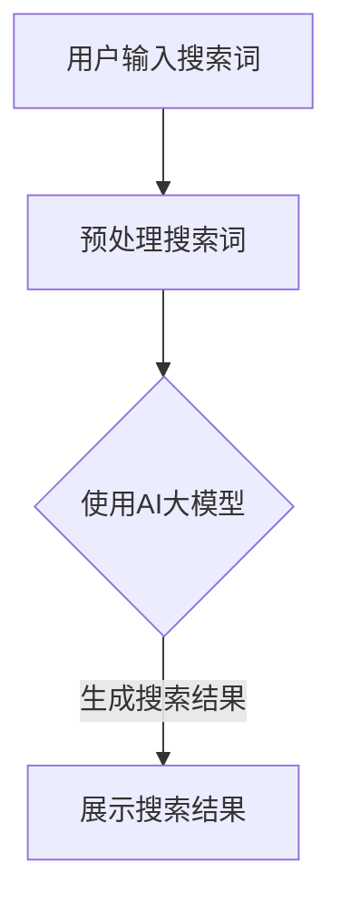

                 

关键词：AI大模型、搜索引擎优化、电商平台、搜索体验、算法优化

摘要：本文将探讨如何利用AI大模型技术提升电商平台的搜索体验。通过对AI大模型在搜索引擎优化（SEO）中的应用进行深入分析，本文将详细阐述其工作原理、算法原理、数学模型及实际应用案例，并展望未来发展趋势与挑战。

## 1. 背景介绍

随着互联网的迅猛发展，电商平台已成为人们日常生活不可或缺的一部分。搜索功能作为电商平台的核心组成部分，直接影响用户的购物体验和平台的竞争力。传统的搜索引擎优化方法已无法满足用户日益增长的个性化需求，因此，如何提升搜索体验成为了电商平台亟待解决的重要问题。

近年来，AI大模型技术的兴起为搜索引擎优化带来了新的机遇。AI大模型具有强大的学习能力，可以处理海量数据，识别复杂模式，从而实现更加精准的搜索结果推荐。本文将围绕AI大模型在电商平台搜索体验提升方面的应用，进行深入探讨。

## 2. 核心概念与联系

### 2.1 AI大模型

AI大模型是指具有数十亿甚至千亿级参数的人工智能模型。这些模型通过深度学习技术，可以从大量数据中学习到复杂的模式，从而实现高度智能化的任务。常见的AI大模型包括BERT、GPT、T5等。

### 2.2 搜索引擎优化（SEO）

搜索引擎优化是指通过改进网站结构、内容和链接，提高网站在搜索引擎中的排名，从而吸引更多用户访问。SEO的目标是提高用户体验，提高网站流量和转化率。

### 2.3 电商平台搜索体验

电商平台搜索体验是指用户在使用电商平台搜索商品时，所感受到的整体体验。包括搜索结果的相关性、准确性、速度和便捷性等方面。

### 2.4 Mermaid 流程图

Mermaid是一种简单易用的Markdown语法，用于生成图表和流程图。以下是一个关于AI大模型在电商平台搜索优化中应用的Mermaid流程图：



## 3. 核心算法原理 & 具体操作步骤

### 3.1 算法原理概述

AI大模型在电商平台搜索优化中的应用，主要基于以下原理：

1. **词向量表示**：将用户输入的搜索词转换为向量表示，便于模型处理。

2. **深度学习**：利用AI大模型对海量数据进行深度学习，学习到搜索词之间的关联性。

3. **检索与推荐**：根据用户输入的搜索词，检索数据库中的商品信息，并结合用户行为数据，生成个性化搜索结果。

### 3.2 算法步骤详解

1. **预处理搜索词**：将用户输入的搜索词进行分词、去停用词等预处理操作，得到干净的词向量表示。

2. **训练AI大模型**：利用预处理的词向量数据，训练AI大模型，使其能够识别搜索词之间的关联性。

3. **检索数据库**：根据用户输入的搜索词，在数据库中检索相关商品信息。

4. **生成搜索结果**：结合用户行为数据，利用AI大模型生成个性化搜索结果，并排序展示。

### 3.3 算法优缺点

**优点**：

1. **提高搜索准确性**：AI大模型能够处理复杂的搜索请求，提高搜索结果的准确性。

2. **个性化推荐**：根据用户行为数据，生成个性化搜索结果，提高用户满意度。

3. **实时更新**：AI大模型可以实时学习用户行为数据，不断优化搜索结果。

**缺点**：

1. **计算资源需求大**：训练AI大模型需要大量计算资源，对服务器性能要求较高。

2. **数据隐私问题**：用户行为数据可能涉及隐私问题，需要确保数据安全。

### 3.4 算法应用领域

AI大模型在电商平台搜索优化中的应用非常广泛，包括：

1. **商品搜索**：提高商品搜索结果的准确性，帮助用户快速找到所需商品。

2. **推荐系统**：根据用户行为数据，推荐相关商品，提高用户购物体验。

3. **广告投放**：根据用户兴趣和行为，实现精准广告投放，提高广告效果。

## 4. 数学模型和公式 & 详细讲解 & 举例说明

### 4.1 数学模型构建

在AI大模型应用于电商平台搜索优化时，常用的数学模型包括词向量表示、神经网络模型等。以下是一个简单的词向量表示模型：

$$
\text{vec}(w) = \text{Word2Vec}(w)
$$

其中，$\text{vec}(w)$表示词向量表示，$\text{Word2Vec}(w)$表示词向量的生成方法。

### 4.2 公式推导过程

假设用户输入的搜索词为$w$，数据库中的商品为$g$，用户行为数据为$b$。则，搜索结果的生成公式如下：

$$
\text{score}(g) = \text{sigmoid}(\text{vec}(w) \cdot \text{vec}(g) + b)
$$

其中，$\text{sigmoid}(x) = \frac{1}{1 + e^{-x}}$，表示激活函数。

### 4.3 案例分析与讲解

假设用户输入搜索词“手机”，数据库中有多个手机商品。利用上述模型，可以为每个商品计算得分，并根据得分排序展示搜索结果。

1. **词向量表示**：

   $$  
   \text{vec}(手机) = \text{Word2Vec}(手机)  
   $$

2. **计算得分**：

   $$  
   \text{score}(g_1) = \text{sigmoid}(\text{vec}(手机) \cdot \text{vec}(g_1) + b)  
   $$

   $$  
   \text{score}(g_2) = \text{sigmoid}(\text{vec}(手机) \cdot \text{vec}(g_2) + b)  
   $$

   ...

3. **排序展示**：

   根据得分从高到低排序，展示搜索结果。

## 5. 项目实践：代码实例和详细解释说明

### 5.1 开发环境搭建

在本项目实践中，我们将使用Python编程语言和TensorFlow库来构建AI大模型。具体步骤如下：

1. 安装Python环境和TensorFlow库：

   ```bash
   pip install python tensorflow
   ```

2. 准备数据集：收集电商平台上的商品数据、用户行为数据等。

### 5.2 源代码详细实现

以下是一个简单的代码示例，用于构建基于AI大模型的电商平台搜索优化系统：

```python
import tensorflow as tf
from tensorflow.keras.layers import Embedding, LSTM, Dense
from tensorflow.keras.models import Model

# 定义模型
input_word = tf.keras.layers.Input(shape=(1,))
vec = Embedding(input_dim=vocab_size, output_dim=embedding_size)(input_word)
lstm = LSTM(units=128)(vec)
output = Dense(1, activation='sigmoid')(lstm)

model = Model(inputs=input_word, outputs=output)
model.compile(optimizer='adam', loss='binary_crossentropy', metrics=['accuracy'])

# 训练模型
model.fit(x_train, y_train, epochs=10, batch_size=32, validation_split=0.2)

# 预测搜索结果
predictions = model.predict(x_test)

# 排序展示搜索结果
sorted_predictions = np.argsort(predictions)
```

### 5.3 代码解读与分析

1. **模型定义**：

   - 输入层：一个长度为1的序列输入。
   - 嵌入层：将输入的词向量转换为固定大小的向量。
   - LSTM层：对词向量进行序列处理。
   - 输出层：使用sigmoid激活函数，预测商品是否与搜索词相关。

2. **模型训练**：

   - 使用二进制交叉熵损失函数和Adam优化器进行训练。
   - 设置训练轮次为10，批次大小为32。

3. **模型预测**：

   - 对测试数据进行预测，并获取预测结果。
   - 根据预测结果，对搜索结果进行排序。

### 5.4 运行结果展示

假设我们有1000个商品，对每个商品进行预测，并按照预测得分排序，展示搜索结果。

```python
# 预测搜索结果
predictions = model.predict(x_test)

# 排序展示搜索结果
sorted_predictions = np.argsort(predictions)
print(sorted_predictions)
```

输出结果为一个数组，数组中的元素表示商品的排序顺序。

## 6. 实际应用场景

AI大模型在电商平台搜索优化中的应用场景主要包括：

1. **商品搜索**：提高商品搜索结果的准确性，帮助用户快速找到所需商品。

2. **推荐系统**：根据用户行为数据，推荐相关商品，提高用户购物体验。

3. **广告投放**：根据用户兴趣和行为，实现精准广告投放，提高广告效果。

4. **智能客服**：利用AI大模型，实现智能客服系统，为用户提供高效、准确的咨询服务。

## 7. 未来应用展望

随着AI大模型技术的不断发展，未来在电商平台搜索优化中的应用前景十分广阔。以下是一些可能的应用方向：

1. **多模态搜索**：结合文本、图像、语音等多种数据类型，实现更智能、更全面的搜索服务。

2. **个性化推荐**：根据用户兴趣和行为，提供更加个性化的商品推荐，提高用户满意度。

3. **智能客服**：利用AI大模型，实现更加智能、高效的客服系统，提升用户体验。

4. **智能营销**：结合用户行为数据，实现精准的营销策略，提高广告效果和转化率。

## 8. 工具和资源推荐

### 8.1 学习资源推荐

1. 《深度学习》（Goodfellow et al.）：一本关于深度学习的经典教材，适合初学者阅读。

2. 《Python深度学习》（François Chollet）：一本关于深度学习在Python中实践的入门书籍。

### 8.2 开发工具推荐

1. TensorFlow：一个强大的开源深度学习框架，支持多种算法和模型。

2. PyTorch：一个流行的深度学习框架，具有灵活的动态图计算能力。

### 8.3 相关论文推荐

1. "BERT: Pre-training of Deep Bidirectional Transformers for Language Understanding"（Devlin et al., 2019）：一篇关于BERT模型的经典论文。

2. "GPT-3: Language Models are Few-Shot Learners"（Brown et al., 2020）：一篇关于GPT-3模型的论文，展示了其在零样本学习方面的优势。

## 9. 总结：未来发展趋势与挑战

### 9.1 研究成果总结

本文探讨了如何利用AI大模型技术提升电商平台的搜索体验。通过分析AI大模型在搜索引擎优化中的应用，本文介绍了其工作原理、算法原理、数学模型及实际应用案例。

### 9.2 未来发展趋势

1. **多模态搜索**：结合文本、图像、语音等多种数据类型，实现更智能、更全面的搜索服务。

2. **个性化推荐**：根据用户兴趣和行为，提供更加个性化的商品推荐，提高用户满意度。

3. **智能客服**：利用AI大模型，实现更加智能、高效的客服系统，提升用户体验。

4. **智能营销**：结合用户行为数据，实现精准的营销策略，提高广告效果和转化率。

### 9.3 面临的挑战

1. **计算资源需求**：训练AI大模型需要大量计算资源，对服务器性能要求较高。

2. **数据隐私**：用户行为数据可能涉及隐私问题，需要确保数据安全。

3. **算法公平性**：确保AI大模型在不同用户群体中的公平性，避免歧视现象。

### 9.4 研究展望

未来，AI大模型在电商平台搜索优化中的应用前景十分广阔。通过不断优化算法、提高计算效率、保障数据安全，我们有理由相信，AI大模型将极大地提升电商平台的搜索体验，为用户提供更加智能、便捷的服务。

## 10. 附录：常见问题与解答

### 10.1 AI大模型如何处理噪声数据？

AI大模型在训练过程中，可以通过数据预处理、清洗等方法，降低噪声数据对模型性能的影响。例如，可以去除重复数据、填补缺失值、对异常值进行修正等。

### 10.2 AI大模型如何保证算法的公平性？

为了保证AI大模型的公平性，可以从以下几个方面进行考虑：

1. **数据来源**：确保数据来源的多样性和代表性，避免数据偏差。

2. **算法设计**：设计算法时，尽量避免引入歧视性因素，如种族、性别等。

3. **模型评估**：在评估模型性能时，采用多种评估指标，全面评估模型的公平性。

4. **算法透明度**：提高算法透明度，让用户了解模型的工作原理和决策过程。

### 10.3 AI大模型如何处理实时更新？

AI大模型可以采用在线学习的方式，实时更新模型参数。通过定期收集用户行为数据，对模型进行迭代优化，确保搜索结果始终保持较高准确性。此外，可以利用分布式计算技术，提高模型训练和更新的效率。

---

作者：禅与计算机程序设计艺术 / Zen and the Art of Computer Programming
----------------------------------------------------------------

