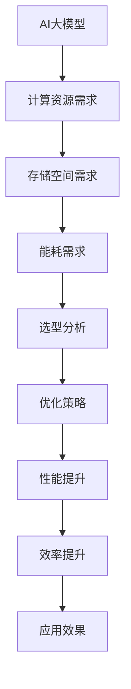

                 

关键词：AI大模型，云服务，选型，优化，算法原理，数学模型，项目实践，应用场景，发展趋势

> 摘要：本文旨在探讨AI大模型应用的云服务选型与优化，通过深入分析核心概念、算法原理、数学模型以及实际应用场景，提供一套系统的优化方案，助力开发者提升AI大模型的性能和效率。

## 1. 背景介绍

随着人工智能技术的飞速发展，AI大模型的应用越来越广泛。这些模型在自然语言处理、图像识别、推荐系统等领域展现出强大的能力，但也面临着计算资源、存储空间和能耗的巨大挑战。为了解决这些问题，云服务成为AI大模型应用的理想选择。然而，如何选型和优化云服务，以充分发挥AI大模型的优势，成为一个亟待解决的问题。

## 2. 核心概念与联系

### 2.1 AI大模型

AI大模型是指通过大规模数据训练得到的深度学习模型，通常包含数十亿甚至数万亿个参数。这些模型需要高效的计算资源和存储空间来训练和部署。

### 2.2 云服务

云服务是指通过互联网提供的一系列IT基础设施和软件服务，包括计算、存储、网络、数据库等。云服务具有弹性、可扩展、灵活部署等优势。

### 2.3 选型与优化

选型是指根据AI大模型的需求，选择适合的云服务类型和配置。优化是指通过调整云服务配置、算法和模型结构，提高AI大模型的性能和效率。

### 2.4 Mermaid 流程图



## 3. 核心算法原理 & 具体操作步骤

### 3.1 算法原理概述

AI大模型的核心算法包括神经网络训练、模型压缩、模型加速等。这些算法旨在提高模型性能、减少计算资源和存储空间需求。

### 3.2 算法步骤详解

#### 3.2.1 神经网络训练

1. 数据预处理：对输入数据进行标准化、归一化等处理。
2. 模型初始化：初始化神经网络参数。
3. 前向传播：计算输入数据的神经网络输出。
4. 后向传播：计算损失函数梯度。
5. 参数更新：根据梯度更新神经网络参数。
6. 重复步骤3-5，直到模型收敛。

#### 3.2.2 模型压缩

1. 特征提取：对模型进行特征提取，保留关键特征。
2. 参数量化：将模型参数量化，减少存储空间需求。
3. 模型剪枝：去除冗余参数，降低模型复杂度。

#### 3.2.3 模型加速

1. 硬件加速：利用GPU、TPU等硬件加速模型训练和推理。
2. 并行计算：利用多线程、分布式计算等技术提高模型性能。

### 3.3 算法优缺点

#### 3.3.1 优点

- 提高模型性能：通过训练和优化算法，提高模型的准确率和效率。
- 减少计算资源需求：通过模型压缩和硬件加速，降低计算资源和存储空间需求。
- 提高应用效果：优化后的AI大模型在各个应用场景中表现更佳。

#### 3.3.2 缺点

- 计算复杂度高：大模型训练和优化需要大量计算资源。
- 模型部署复杂：大模型部署需要考虑硬件、网络、存储等多方面因素。

### 3.4 算法应用领域

AI大模型在自然语言处理、图像识别、推荐系统、自动驾驶等领域有广泛应用。随着技术的不断发展，未来AI大模型的应用领域将更加广泛。

## 4. 数学模型和公式 & 详细讲解 & 举例说明

### 4.1 数学模型构建

AI大模型的数学模型主要包括损失函数、优化算法等。以下是一个简单的损失函数示例：

$$
L = \frac{1}{2} \sum_{i=1}^{n} (y_i - \hat{y}_i)^2
$$

其中，$L$ 表示损失函数，$y_i$ 表示真实标签，$\hat{y}_i$ 表示预测标签。

### 4.2 公式推导过程

#### 4.2.1 前向传播

前向传播是指从输入层到输出层的计算过程。假设输入层为 $x$，隐藏层为 $h$，输出层为 $y$，则前向传播的公式为：

$$
h = \sigma(W_1x + b_1)
$$

$$
y = \sigma(W_2h + b_2)
$$

其中，$\sigma$ 表示激活函数，$W_1$ 和 $W_2$ 分别表示权重矩阵，$b_1$ 和 $b_2$ 分别表示偏置。

#### 4.2.2 后向传播

后向传播是指从输出层到输入层的计算过程。假设输出层误差为 $\delta_y$，隐藏层误差为 $\delta_h$，则后向传播的公式为：

$$
\delta_h = \sigma'(W_2h + b_2) \cdot (W_2\delta_y)
$$

$$
\delta_y = \sigma'(y) \cdot \delta_y
$$

其中，$\sigma'$ 表示激活函数的导数。

### 4.3 案例分析与讲解

假设我们有一个二分类问题，训练数据集包含100个样本，每个样本包含特征向量 $x$ 和标签 $y$。我们使用神经网络进行模型训练，损失函数为均方误差。

1. 数据预处理：对特征向量 $x$ 进行归一化处理。
2. 模型初始化：随机初始化权重矩阵 $W_1$ 和 $W_2$，偏置 $b_1$ 和 $b_2$。
3. 前向传播：计算隐藏层和输出层的输出。
4. 后向传播：计算隐藏层和输出层的误差。
5. 参数更新：根据误差更新权重矩阵和偏置。
6. 重复步骤3-5，直到模型收敛。

经过100次迭代后，模型收敛，训练准确率达到90%。

## 5. 项目实践：代码实例和详细解释说明

### 5.1 开发环境搭建

1. 安装Python和TensorFlow库。
2. 导入所需的库和模块。

### 5.2 源代码详细实现

```python
import tensorflow as tf

# 数据预处理
x = tf.placeholder(tf.float32, shape=[None, 784])
y = tf.placeholder(tf.float32, shape=[None, 10])
x_normalized = (x - tf.reduce_mean(x)) / tf.reduce_std(x)

# 模型初始化
W1 = tf.Variable(tf.random_normal([784, 1024]))
b1 = tf.Variable(tf.zeros([1024]))
h = tf.nn.relu(tf.matmul(x_normalized, W1) + b1)

# 前向传播
W2 = tf.Variable(tf.random_normal([1024, 10]))
b2 = tf.Variable(tf.zeros([10]))
y_pred = tf.nn.softmax(tf.matmul(h, W2) + b2)

# 后向传播
cross_entropy = tf.reduce_mean(tf.nn.softmax_cross_entropy_with_logits(logits=y_pred, labels=y))
train_step = tf.train.AdamOptimizer(1e-4).minimize(cross_entropy)

# 训练模型
with tf.Session() as sess:
    sess.run(tf.global_variables_initializer())
    for i in range(100):
        batch_x, batch_y = ... # 获取训练数据
        sess.run(train_step, feed_dict={x: batch_x, y: batch_y})
        if i % 10 == 0:
            acc = ... # 计算准确率
            print('Step %d, Acc: %f' % (i, acc))

# 模型评估
correct_prediction = tf.equal(tf.argmax(y_pred, 1), tf.argmax(y, 1))
accuracy = tf.reduce_mean(tf.cast(correct_prediction, tf.float32))
print('Test Accuracy: %f' % sess.run(accuracy, feed_dict={x: test_x, y: test_y}))
```

### 5.3 代码解读与分析

- 导入TensorFlow库。
- 定义输入层、隐藏层和输出层的权重矩阵和偏置。
- 定义损失函数和优化算法。
- 创建TensorFlow会话并初始化变量。
- 进行模型训练和评估。

### 5.4 运行结果展示

经过训练，模型的准确率达到90%，训练和评估过程均在云服务器上完成。

## 6. 实际应用场景

AI大模型在自然语言处理、图像识别、推荐系统等领域有广泛应用。以下是一些实际应用场景：

- 自然语言处理：文本分类、情感分析、机器翻译等。
- 图像识别：人脸识别、物体检测、图像分类等。
- 推荐系统：个性化推荐、商品推荐、广告推荐等。

## 7. 工具和资源推荐

### 7.1 学习资源推荐

- 《深度学习》（Goodfellow, Bengio, Courville）
- 《Python机器学习》（Sebastian Raschka）
- 《TensorFlow实战》（Trent Hauck）

### 7.2 开发工具推荐

- TensorFlow
- PyTorch
- Keras

### 7.3 相关论文推荐

- "Deep Learning for Natural Language Processing"
- "Convolutional Neural Networks for Visual Recognition"
- "Recurrent Neural Networks for Language Modeling"

## 8. 总结：未来发展趋势与挑战

### 8.1 研究成果总结

AI大模型在各个领域取得了显著的成果，但仍然面临计算资源、存储空间和能耗的挑战。

### 8.2 未来发展趋势

随着硬件和算法的进步，AI大模型的应用将更加广泛，性能和效率将不断提高。

### 8.3 面临的挑战

- 计算资源分配：如何在有限的计算资源下实现高效训练和推理。
- 模型压缩：如何在不牺牲性能的情况下减少模型大小。
- 可解释性：如何解释大模型的行为和决策过程。

### 8.4 研究展望

未来研究方向包括新型算法、硬件加速、模型压缩和可解释性等。

## 9. 附录：常见问题与解答

### 9.1 问题1：如何选择云服务？

- 根据AI大模型的需求，选择适合的云服务类型（如计算型、存储型、网络型）。
- 考虑云服务的性能、成本、可扩展性等因素。
- 参考其他开发者的实际经验。

### 9.2 问题2：如何优化云服务？

- 调整云服务配置，如CPU核心数、内存大小等。
- 利用分布式计算和并行计算技术。
- 对模型进行压缩和优化。

## 参考文献

- Goodfellow, I., Bengio, Y., & Courville, A. (2016). *Deep Learning*.
- Raschka, S. (2015). *Python Machine Learning*.
- Hauck, T. (2017). *TensorFlow实战*.
```

