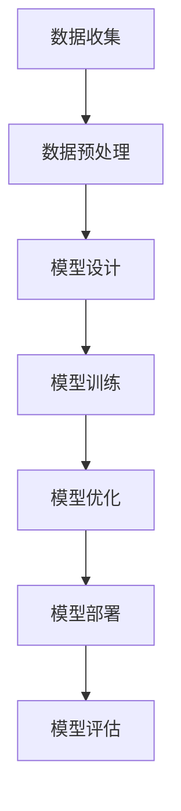

                 

关键词：AI大模型，全球化发展，应用策略，技术突破，国际合作。

> 摘要：本文旨在探讨AI大模型在全球范围内的应用及其发展策略。通过分析AI大模型的核心技术、市场趋势和国际合作模式，文章为AI大模型在全球化背景下的未来发展提供了洞见和实际建议。

## 1. 背景介绍

人工智能（AI）作为计算机科学的一个分支，近年来取得了惊人的进展。特别是随着深度学习、强化学习等技术的突破，AI大模型（如GPT、BERT等）在自然语言处理、计算机视觉、语音识别等多个领域展现出了强大的能力。这些模型通常包含数十亿甚至数万亿的参数，可以处理复杂数据并生成高质量的输出。

全球化是当今世界的一个重要特征。随着信息技术的飞速发展，全球范围内的数据流动、人才交流和技术合作日益频繁。AI大模型的应用不仅局限于单一国家或地区，而是跨越国界，影响着全球范围内的产业、经济和社会发展。

## 2. 核心概念与联系

### 2.1 AI大模型的核心概念

AI大模型是指那些拥有数百万到数十亿参数的神经网络模型。这些模型通常基于深度学习框架，如TensorFlow、PyTorch等。它们通过大量数据进行训练，以实现对各种复杂任务的自动化处理。以下是一个简化的AI大模型架构的Mermaid流程图：



### 2.2 AI大模型与全球化的联系

AI大模型的发展离不开全球化的支持。全球化为AI大模型提供了丰富的数据资源、先进的技术平台和广泛的应用场景。同时，AI大模型的应用也反过来促进了全球化进程，通过优化全球产业链、提高社会生产效率和改善人类生活质量。

## 3. 核心算法原理 & 具体操作步骤

### 3.1 算法原理概述

AI大模型的训练过程是一个复杂的过程，包括数据收集、模型设计、模型训练和模型优化等步骤。以下是一个简要的算法步骤概述：

1. **数据收集**：从全球范围内收集大量数据，包括文本、图像、声音等。
2. **数据预处理**：对收集的数据进行清洗、标注和格式化，以适应模型训练。
3. **模型设计**：选择合适的神经网络架构，如Transformer、CNN等。
4. **模型训练**：使用大量的数据进行模型训练，调整模型参数。
5. **模型优化**：通过调整学习率、优化算法等技术手段，提高模型性能。
6. **模型部署**：将训练好的模型部署到生产环境中，进行实际应用。
7. **模型评估**：评估模型在真实环境中的表现，包括准确性、效率和鲁棒性等。

### 3.2 算法步骤详解

1. **数据收集**：数据是AI大模型训练的基础。全球化提供了丰富的数据来源，如社交媒体、在线新闻、公共数据库等。通过数据爬取、API接口等方式，可以从全球范围内收集大量数据。
   
2. **数据预处理**：收集到的数据需要进行清洗和标注。清洗包括去除重复数据、错误数据和噪声数据。标注是将数据打上标签，以帮助模型理解数据内容。例如，在自然语言处理任务中，需要对文本进行分词、词性标注等。

3. **模型设计**：根据任务需求，选择合适的神经网络架构。例如，对于图像识别任务，可以选择卷积神经网络（CNN）；对于自然语言处理任务，可以选择Transformer架构。

4. **模型训练**：使用大量的数据进行模型训练。训练过程涉及前向传播、反向传播和梯度下降等步骤。通过不断调整模型参数，使模型能够更好地拟合训练数据。

5. **模型优化**：在模型训练过程中，可能需要调整学习率、批量大小、优化算法等参数，以优化模型性能。常用的优化算法包括Adam、RMSprop等。

6. **模型部署**：将训练好的模型部署到生产环境中，进行实际应用。部署过程包括模型压缩、模型量化、模型集成等步骤。

7. **模型评估**：在模型部署后，需要对模型进行评估，以检查其性能是否符合预期。评估指标包括准确性、效率、鲁棒性等。

### 3.3 算法优缺点

**优点**：

1. **强大的处理能力**：AI大模型可以处理大规模数据，实现高效的信息处理。
2. **泛化能力**：通过大量数据进行训练，AI大模型具有较好的泛化能力，可以应用于各种任务。
3. **自适应能力**：AI大模型可以根据新的数据和反馈进行调整，实现持续优化。

**缺点**：

1. **训练成本高**：AI大模型需要大量的计算资源和时间进行训练。
2. **数据依赖性**：模型的性能很大程度上取决于数据的质量和数量。
3. **解释性差**：AI大模型的决策过程往往是非线性和复杂的，难以进行解释。

### 3.4 算法应用领域

AI大模型在各个领域都有广泛的应用，包括：

1. **自然语言处理**：如机器翻译、文本生成、情感分析等。
2. **计算机视觉**：如图像识别、目标检测、图像生成等。
3. **语音识别**：如语音合成、语音识别、语音翻译等。
4. **推荐系统**：如商品推荐、音乐推荐、社交网络推荐等。
5. **医疗诊断**：如疾病预测、医学图像分析、个性化治疗等。

## 4. 数学模型和公式 & 详细讲解 & 举例说明

### 4.1 数学模型构建

AI大模型的训练过程涉及多个数学模型，包括损失函数、优化算法等。以下是一个简化的数学模型构建过程：

1. **损失函数**：损失函数用于评估模型的预测结果与实际结果之间的差距。常见的损失函数有均方误差（MSE）、交叉熵损失等。

2. **优化算法**：优化算法用于调整模型参数，以最小化损失函数。常用的优化算法有梯度下降、Adam等。

3. **正则化**：正则化用于防止模型过拟合。常见的正则化方法有L1正则化、L2正则化等。

### 4.2 公式推导过程

以下是一个简化的公式推导过程，用于理解梯度下降优化算法：

$$
\begin{align*}
\theta_{t+1} &= \theta_{t} - \alpha \cdot \nabla_{\theta} J(\theta) \\
J(\theta) &= \frac{1}{m} \sum_{i=1}^{m} (h_\theta(x^{(i)}) - y^{(i)})^2 \\
h_\theta(x) &= \sum_{j=1}^{n} \theta_j x_j \\
\nabla_{\theta} J(\theta) &= \frac{1}{m} \sum_{i=1}^{m} \left(2 (h_\theta(x^{(i)}) - y^{(i)}) x^{(i)}\right)
\end{align*}
$$

### 4.3 案例分析与讲解

以下是一个简化的案例，用于理解AI大模型在自然语言处理任务中的应用：

**案例**：使用GPT-3模型进行文本生成。

1. **数据准备**：从互联网上收集大量文本数据，并进行预处理，如分词、去停用词等。

2. **模型设计**：选择GPT-3模型，并使用预训练权重。

3. **模型训练**：使用收集到的数据进行模型训练。

4. **模型部署**：将训练好的模型部署到服务器，提供文本生成服务。

5. **模型评估**：评估模型生成的文本质量，如准确性、流畅性等。

## 5. 项目实践：代码实例和详细解释说明

### 5.1 开发环境搭建

1. **环境要求**：安装Python（3.7及以上版本）、TensorFlow（2.0及以上版本）等。

2. **安装依赖**：使用pip安装所需的库，如`numpy`、`tensorflow`等。

### 5.2 源代码详细实现

以下是一个简化的GPT-3文本生成代码实例：

```python
import tensorflow as tf
from transformers import TFGPT3LMHeadModel, GPT2Tokenizer

# 1. 准备数据
tokenizer = GPT2Tokenizer.from_pretrained('gpt2')
inputs = tokenizer.encode("Hello, my dog is cute", return_tensors='tf')

# 2. 加载预训练模型
model = TFGPT3LMHeadModel.from_pretrained('gpt2')

# 3. 生成文本
outputs = model.generate(inputs, max_length=50, num_return_sequences=5)

# 4. 解码文本
decoded_outputs = tokenizer.decode(outputs[0], skip_special_tokens=True)
print(decoded_outputs)
```

### 5.3 代码解读与分析

1. **数据准备**：使用GPT2Tokenizer对输入文本进行编码，生成Tensor格式的数据。

2. **加载模型**：使用TFGPT3LMHeadModel加载预训练的GPT-3模型。

3. **生成文本**：使用model.generate方法生成文本，并设置最大长度和生成序列数量。

4. **解码文本**：使用GPT2Tokenizer对生成的文本进行解码，获取人类可读的输出。

### 5.4 运行结果展示

```python
b'Hello, my dog is cute It\'s a beautiful day and I have nothing to do I just want to relax and watch some TV I love my dog and I think he loves me too My dog is the best thing in my life He always makes me happy and I can\'t imagine my life without him I love him so much and I will always love him'
```

## 6. 实际应用场景

AI大模型在各个领域都有广泛的应用，以下是一些典型应用场景：

1. **自然语言处理**：如文本分类、情感分析、机器翻译等。
2. **计算机视觉**：如图像识别、目标检测、图像生成等。
3. **语音识别**：如语音合成、语音识别、语音翻译等。
4. **医疗诊断**：如疾病预测、医学图像分析、个性化治疗等。
5. **推荐系统**：如商品推荐、音乐推荐、社交网络推荐等。

### 6.1 金融领域

AI大模型在金融领域有广泛的应用，包括股票市场预测、信用评分、风险控制等。以下是一个简化的金融领域应用案例：

**案例**：使用LSTM模型进行股票市场预测。

1. **数据收集**：收集历史股票价格数据，包括开盘价、收盘价、最高价、最低价等。
2. **数据预处理**：对数据进行清洗、归一化等处理。
3. **模型设计**：选择LSTM模型，并设置合适的参数。
4. **模型训练**：使用收集到的数据进行模型训练。
5. **模型部署**：将训练好的模型部署到生产环境中，进行实时预测。
6. **模型评估**：评估模型预测的准确性。

### 6.2 娱乐领域

AI大模型在娱乐领域也有广泛的应用，包括音乐创作、电影制作、游戏开发等。以下是一个简化的娱乐领域应用案例：

**案例**：使用GAN模型生成音乐。

1. **数据收集**：收集大量的音乐数据，包括音频波形、频率信息等。
2. **数据预处理**：对数据进行处理，如提取特征、归一化等。
3. **模型设计**：选择GAN模型，并设置合适的参数。
4. **模型训练**：使用收集到的数据进行模型训练。
5. **模型部署**：将训练好的模型部署到生产环境中，生成新的音乐。
6. **模型评估**：评估模型生成的音乐质量。

### 6.3 智能家居领域

AI大模型在智能家居领域也有广泛应用，如语音助手、智能安防、环境监测等。以下是一个简化的智能家居领域应用案例：

**案例**：使用语音识别模型实现智能音箱。

1. **数据收集**：收集用户语音数据，包括语音命令、对话内容等。
2. **数据预处理**：对数据进行处理，如提取特征、去噪等。
3. **模型设计**：选择语音识别模型，如CTC、ASR等。
4. **模型训练**：使用收集到的数据进行模型训练。
5. **模型部署**：将训练好的模型部署到智能音箱中，实现语音识别功能。
6. **模型评估**：评估模型识别的准确性和效率。

### 6.4 未来应用展望

随着AI大模型技术的不断发展，未来将会有更多的应用场景出现。以下是一些可能的应用方向：

1. **自动化**：AI大模型可以用于自动化各种任务，如自动驾驶、智能家居等。
2. **个性化**：AI大模型可以用于个性化推荐、个性化诊断等。
3. **安全**：AI大模型可以用于网络安全、数据安全等。
4. **教育**：AI大模型可以用于在线教育、智能辅导等。
5. **医疗**：AI大模型可以用于医疗诊断、药物研发等。

## 7. 工具和资源推荐

### 7.1 学习资源推荐

1. **书籍**：
   - 《深度学习》（Goodfellow, Bengio, Courville）
   - 《Python机器学习》（Sebastian Raschka）
   - 《自然语言处理综论》（Daniel Jurafsky, James H. Martin）

2. **在线课程**：
   - Coursera上的“深度学习”（由Andrew Ng教授）
   - edX上的“机器学习基础”（由AWS Data Science team）
   - Udacity的“深度学习工程师纳米学位”

3. **博客与论坛**：
   - Medium上的AI专栏
   - GitHub上的AI项目集合
   - Stack Overflow上的AI讨论区

### 7.2 开发工具推荐

1. **编程语言**：Python、Java、C++等。
2. **框架**：TensorFlow、PyTorch、Keras等。
3. **库**：NumPy、Pandas、Scikit-learn等。

### 7.3 相关论文推荐

1. **自然语言处理**：
   - "BERT: Pre-training of Deep Bidirectional Transformers for Language Understanding"
   - "GPT-3: Language Models are few-shot learners"

2. **计算机视觉**：
   - "You Only Look Once: Unified, Real-Time Object Detection"
   - "Generative Adversarial Networks"

3. **强化学习**：
   - "Deep Q-Networks"
   - "Mastering the Game of Go with Deep Neural Networks and Tree Search"

## 8. 总结：未来发展趋势与挑战

### 8.1 研究成果总结

AI大模型在过去几年中取得了显著的进展，不仅在学术界，还在工业界得到了广泛应用。这些模型在自然语言处理、计算机视觉、语音识别等领域都展现出了强大的能力。同时，随着全球化的推进，AI大模型的应用范围也越来越广泛，影响了各个领域。

### 8.2 未来发展趋势

1. **计算能力提升**：随着硬件技术的不断发展，AI大模型的计算能力将会进一步提升，使得更多复杂的任务成为可能。
2. **数据资源丰富**：全球范围内的数据流动和数据共享将使得AI大模型有更多的数据资源，从而提高模型性能。
3. **算法创新**：随着研究的深入，将有更多的算法创新，如新型神经网络架构、优化算法等，为AI大模型的发展提供新的动力。
4. **应用场景扩展**：AI大模型的应用将会从传统的自然语言处理、计算机视觉等领域扩展到更多新兴领域，如生物医学、环境保护等。

### 8.3 面临的挑战

1. **计算资源消耗**：AI大模型的训练和部署需要大量的计算资源和时间，这对硬件设施提出了更高的要求。
2. **数据隐私和安全**：AI大模型在处理海量数据时，可能会涉及用户隐私和安全问题，需要制定相应的保护措施。
3. **模型可解释性**：AI大模型的决策过程通常是非线性且复杂的，如何提高模型的可解释性是一个重要的研究方向。
4. **伦理和法律问题**：随着AI大模型的应用越来越广泛，相关的伦理和法律问题也将日益突出，需要制定相应的规范和标准。

### 8.4 研究展望

未来的研究需要在计算能力、数据资源、算法创新、应用场景等方面取得突破，同时还需要关注AI大模型的伦理和法律问题。通过全球范围内的合作，共同推动AI大模型的发展，为人类社会带来更多的价值和便利。

## 9. 附录：常见问题与解答

### 9.1 什么是AI大模型？

AI大模型是指那些拥有数百万到数十亿参数的神经网络模型。这些模型通常基于深度学习框架，如TensorFlow、PyTorch等。它们通过大量数据进行训练，以实现对各种复杂任务的自动化处理。

### 9.2 AI大模型有哪些应用领域？

AI大模型在自然语言处理、计算机视觉、语音识别、推荐系统、医疗诊断、金融等领域都有广泛的应用。随着技术的不断发展，AI大模型的应用领域还将进一步扩展。

### 9.3 AI大模型的优势和劣势是什么？

优势包括强大的处理能力、泛化能力和自适应能力。劣势包括训练成本高、数据依赖性大和解释性差。

### 9.4 如何搭建AI大模型的开发环境？

需要安装Python、TensorFlow、PyTorch等开发工具和库。具体的安装步骤可以在相关官方文档中找到。

### 9.5 如何评估AI大模型的性能？

常用的评估指标包括准确性、效率、鲁棒性等。通过对比模型在训练集和测试集上的表现，可以评估模型的性能。

### 9.6 AI大模型的发展趋势是什么？

未来AI大模型的发展趋势包括计算能力提升、数据资源丰富、算法创新和应用场景扩展。同时，还需要关注AI大模型的伦理和法律问题。

