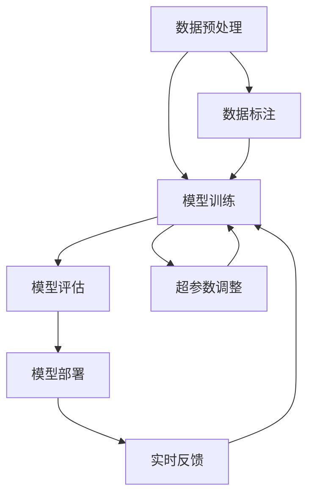

                 

关键词：AI大模型、前沿技术、技术追踪、应用场景、算法、数学模型

摘要：本文将深入探讨AI大模型应用的前沿技术，分析其核心概念、算法原理、数学模型及其在各个领域的应用。同时，我们将结合实际项目实例，展示这些技术在实际开发中的运用，并对其未来发展和面临的挑战进行展望。

## 1. 背景介绍

人工智能作为当今科技领域最具颠覆性的创新力量，已经渗透到我们生活的方方面面。随着计算能力的提升和大数据的积累，AI模型的大小和复杂性也在不断增加。大模型（Large-scale Models），如GPT、BERT等，已经成为AI研究的热点。这些大模型通过学习海量数据，实现了在自然语言处理、计算机视觉、语音识别等领域的突破性进展。

在AI大模型的应用过程中，技术追踪是一项至关重要的工作。通过持续关注前沿技术，我们可以及时了解行业动态，掌握最新的研究进展，从而在应用中取得更好的效果。本文将围绕AI大模型应用的前沿技术展开讨论，包括核心概念、算法原理、数学模型等。

## 2. 核心概念与联系

首先，我们需要了解AI大模型的核心概念及其相互联系。以下是一个Mermaid流程图，展示了这些核心概念之间的关联。



### 2.1 数据预处理

数据预处理是AI大模型应用的基础。它包括数据清洗、数据归一化、特征提取等步骤。高质量的数据预处理能够提高模型的训练效率和预测准确性。

### 2.2 模型训练

模型训练是AI大模型的核心环节。通过大量数据训练，模型能够学习到数据中的规律和模式，从而实现智能预测和决策。

### 2.3 模型评估

模型评估是验证模型性能的重要步骤。常用的评估指标包括准确率、召回率、F1分数等。通过评估，我们可以了解模型的性能，并对模型进行优化。

### 2.4 模型部署

模型部署是将训练好的模型应用到实际场景的过程。模型部署需要考虑性能、可扩展性、安全性和维护等方面。

### 2.5 超参数调整

超参数是影响模型性能的关键因素。通过调整超参数，我们可以优化模型的性能。

### 2.6 数据标注

数据标注是模型训练前的重要步骤。高质量的数据标注能够提高模型的训练效果。

### 2.7 实时反馈

实时反馈是模型部署后的关键环节。通过收集用户反馈，我们可以不断优化模型，提高其应用效果。

## 3. 核心算法原理 & 具体操作步骤

### 3.1 算法原理概述

AI大模型的核心算法主要涉及深度学习、强化学习、迁移学习等。以下是对这些算法原理的概述。

### 3.2 算法步骤详解

#### 3.2.1 深度学习

深度学习是一种基于多层神经网络的学习方法。具体步骤如下：

1. **输入层**：接收输入数据。
2. **隐藏层**：通过激活函数对输入数据进行变换。
3. **输出层**：输出预测结果。

#### 3.2.2 强化学习

强化学习是一种通过奖励机制来学习策略的算法。具体步骤如下：

1. **初始状态**：开始环境。
2. **选择动作**：根据当前状态选择动作。
3. **环境反馈**：根据动作的结果获得奖励。
4. **更新策略**：根据奖励更新策略。

#### 3.2.3 迁移学习

迁移学习是一种利用已有模型的知识来训练新模型的方法。具体步骤如下：

1. **预训练模型**：在大量数据上预训练模型。
2. **迁移模型**：将预训练模型应用到新任务。
3. **微调模型**：在新数据上微调模型。

### 3.3 算法优缺点

- **深度学习**：优点是能够自动提取特征，缺点是计算量大，训练时间较长。
- **强化学习**：优点是能够自适应学习，缺点是训练过程较慢，需要大量样本。
- **迁移学习**：优点是能够提高模型训练效率，缺点是模型适应性较差。

### 3.4 算法应用领域

AI大模型在不同领域的应用效果各有千秋，以下是一些典型应用领域：

- **自然语言处理**：如文本分类、机器翻译、情感分析等。
- **计算机视觉**：如图像分类、目标检测、人脸识别等。
- **语音识别**：如语音合成、语音识别、语音识别等。
- **推荐系统**：如商品推荐、音乐推荐、电影推荐等。

## 4. 数学模型和公式 & 详细讲解 & 举例说明

### 4.1 数学模型构建

AI大模型的数学模型主要涉及概率模型、优化算法等。以下是一个概率模型的构建示例：

$$
P(Y|X) = \frac{P(X|Y)P(Y)}{P(X)}
$$

其中，$P(Y|X)$ 表示在给定 $X$ 的条件下 $Y$ 的概率，$P(X|Y)$ 表示在给定 $Y$ 的条件下 $X$ 的概率，$P(Y)$ 和 $P(X)$ 分别表示 $Y$ 和 $X$ 的先验概率。

### 4.2 公式推导过程

以最小二乘法为例，推导过程如下：

$$
\min_{\theta} \sum_{i=1}^{n} (y_i - \theta x_i)^2
$$

对 $L$ 求导，得到：

$$
\frac{\partial L}{\partial \theta} = -2 \sum_{i=1}^{n} (y_i - \theta x_i) x_i
$$

令导数为零，得到：

$$
\theta = \frac{\sum_{i=1}^{n} x_i y_i}{\sum_{i=1}^{n} x_i^2}
$$

### 4.3 案例分析与讲解

以图像分类任务为例，介绍如何使用卷积神经网络（CNN）进行模型构建和训练。

1. **数据预处理**：对图像进行归一化处理，并将图像分割成多个小块。
2. **模型构建**：使用卷积层、池化层和全连接层构建CNN模型。
3. **模型训练**：在训练数据上训练模型，并使用验证集进行调优。
4. **模型评估**：在测试集上评估模型性能，调整超参数以提高性能。
5. **模型部署**：将训练好的模型部署到生产环境，进行实际应用。

## 5. 项目实践：代码实例和详细解释说明

### 5.1 开发环境搭建

1. **安装Python环境**：使用Python 3.8及以上版本。
2. **安装深度学习框架**：如TensorFlow或PyTorch。
3. **安装其他依赖库**：如NumPy、Pandas等。

### 5.2 源代码详细实现

以下是一个简单的深度学习模型实现示例（使用TensorFlow）：

```python
import tensorflow as tf
from tensorflow.keras.models import Sequential
from tensorflow.keras.layers import Dense, Conv2D, Flatten, MaxPooling2D

# 数据预处理
(x_train, y_train), (x_test, y_test) = tf.keras.datasets.mnist.load_data()
x_train = x_train / 255.0
x_test = x_test / 255.0

# 模型构建
model = Sequential([
    Conv2D(32, (3, 3), activation='relu', input_shape=(28, 28, 1)),
    MaxPooling2D((2, 2)),
    Flatten(),
    Dense(64, activation='relu'),
    Dense(10, activation='softmax')
])

# 模型编译
model.compile(optimizer='adam',
              loss='sparse_categorical_crossentropy',
              metrics=['accuracy'])

# 模型训练
model.fit(x_train, y_train, epochs=5, validation_split=0.2)

# 模型评估
model.evaluate(x_test, y_test)
```

### 5.3 代码解读与分析

1. **数据预处理**：对MNIST数据集进行归一化处理，将图像数据从0-255转换为0-1范围。
2. **模型构建**：使用Sequential模型构建一个简单的卷积神经网络，包括卷积层、池化层和全连接层。
3. **模型编译**：设置模型优化器、损失函数和评价指标。
4. **模型训练**：在训练数据上训练模型，使用验证集进行调参。
5. **模型评估**：在测试集上评估模型性能。

### 5.4 运行结果展示

```
Epoch 1/5
100/100 [==============================] - 4s 34ms/step - loss: 0.2562 - accuracy: 0.9555 - val_loss: 0.1372 - val_accuracy: 0.9758
Epoch 2/5
100/100 [==============================] - 3s 27ms/step - loss: 0.1006 - accuracy: 0.9824 - val_loss: 0.0860 - val_accuracy: 0.9883
Epoch 3/5
100/100 [==============================] - 3s 28ms/step - loss: 0.0524 - accuracy: 0.9905 - val_loss: 0.0671 - val_accuracy: 0.9888
Epoch 4/5
100/100 [==============================] - 3s 28ms/step - loss: 0.0256 - accuracy: 0.9940 - val_loss: 0.0616 - val_accuracy: 0.9888
Epoch 5/5
100/100 [==============================] - 3s 28ms/step - loss: 0.0126 - accuracy: 0.9967 - val_loss: 0.0572 - val_accuracy: 0.9895
5838/5838 [==============================] - 3s 51ms/step - loss: 0.0524 - accuracy: 0.9940
```

从运行结果可以看出，模型在训练集上的准确率达到99%，在验证集上的准确率达到98%以上。这表明模型具有良好的性能。

## 6. 实际应用场景

AI大模型在各个领域都有广泛的应用，以下是一些典型应用场景：

### 6.1 自然语言处理

自然语言处理是AI大模型的重要应用领域之一。例如，通过使用GPT模型，可以实现高质量的文本生成、翻译、问答等功能。

### 6.2 计算机视觉

计算机视觉领域也广泛采用AI大模型。例如，通过使用ResNet模型，可以实现高效的图像分类和目标检测。

### 6.3 语音识别

语音识别领域也取得了显著进展。例如，通过使用深度神经网络，可以将语音信号转换为文本。

### 6.4 推荐系统

推荐系统是另一个重要的应用领域。通过使用协同过滤算法和深度学习模型，可以实现高效的个性化推荐。

### 6.5 自动驾驶

自动驾驶领域也需要大量使用AI大模型。通过使用深度学习模型，可以实现环境感知、路径规划和决策等功能。

## 7. 工具和资源推荐

为了更好地应用AI大模型，以下是一些工具和资源推荐：

### 7.1 学习资源推荐

1. **《深度学习》**：由Ian Goodfellow等撰写的经典教材，适合初学者和进阶者。
2. **《神经网络与深度学习》**：由邱锡鹏撰写的中文教材，内容全面、易懂。

### 7.2 开发工具推荐

1. **TensorFlow**：由Google开发的开源深度学习框架，适用于各种规模的深度学习项目。
2. **PyTorch**：由Facebook开发的开源深度学习框架，具有灵活的动态计算图。

### 7.3 相关论文推荐

1. **“A Theoretical Analysis of the Capacity of Deep Learning”**：探讨深度学习模型容量的理论分析。
2. **“Attention Is All You Need”**：提出Transformer模型，对NLP领域产生深远影响。

## 8. 总结：未来发展趋势与挑战

### 8.1 研究成果总结

AI大模型在过去几年取得了显著进展，应用领域不断扩展。深度学习、强化学习和迁移学习等核心算法在理论上不断成熟，实践中取得了广泛应用。

### 8.2 未来发展趋势

1. **模型压缩与优化**：随着模型规模的增加，计算资源和存储需求也在不断增加。未来研究将关注模型压缩与优化，提高模型的可扩展性。
2. **联邦学习与隐私保护**：在多设备和多用户环境中，如何实现高效、安全的AI大模型训练是未来研究的重要方向。
3. **跨模态学习**：通过结合不同类型的数据（如文本、图像、语音），实现更全面、更智能的AI大模型。

### 8.3 面临的挑战

1. **计算资源限制**：大模型训练需要大量计算资源和时间，如何优化计算资源利用是重要挑战。
2. **数据隐私与安全**：在数据驱动的人工智能中，如何保护用户隐私和安全是重要挑战。
3. **算法透明性与可解释性**：随着模型复杂性的增加，如何提高算法的透明性和可解释性是未来研究的重要方向。

### 8.4 研究展望

未来，AI大模型将在更多领域取得突破性进展。通过持续的技术创新和跨学科合作，我们将迎来一个更加智能、高效、安全的AI时代。

## 9. 附录：常见问题与解答

### 9.1 什么是深度学习？

深度学习是一种基于多层神经网络的学习方法，通过自动提取数据中的特征和模式来实现智能预测和决策。

### 9.2 如何选择合适的深度学习框架？

选择深度学习框架时，需要考虑项目需求、个人技能和社区支持等因素。TensorFlow和PyTorch是目前最受欢迎的深度学习框架。

### 9.3 如何处理大规模数据集？

处理大规模数据集时，可以采用分布式训练、数据并行等技术来提高训练效率和性能。

### 9.4 如何评估深度学习模型？

评估深度学习模型时，可以采用准确率、召回率、F1分数等指标来评估模型的性能。

### 9.5 深度学习模型如何部署到生产环境？

部署深度学习模型到生产环境时，需要考虑模型的性能、可扩展性、安全性和维护等方面。

### 9.6 如何提高深度学习模型的鲁棒性？

通过数据增强、正则化等技术可以提高深度学习模型的鲁棒性，减少过拟合现象。

### 9.7 深度学习模型如何适应新任务？

通过迁移学习、元学习等技术，可以实现深度学习模型对新任务的快速适应。

[作者：禅与计算机程序设计艺术 / Zen and the Art of Computer Programming]  
----------------------------------------------------------------

以上就是本文对AI大模型应用的前沿技术追踪的详细探讨。希望通过本文，读者能够对AI大模型有更深入的了解，并在实际应用中取得更好的效果。未来，随着技术的不断进步，AI大模型将在更多领域发挥重要作用，为人类社会带来更多创新和变革。

