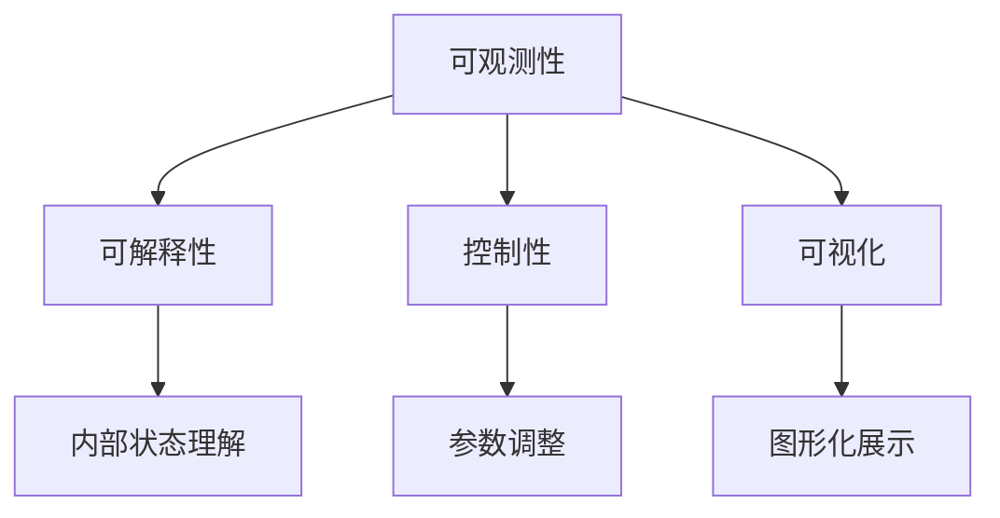
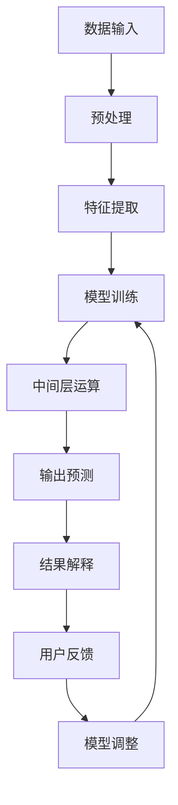

                 

关键词：AI大模型、可观测性、应用、算法原理、数学模型、项目实践、实际应用场景、工具和资源推荐、未来发展趋势与挑战

> 摘要：本文旨在探讨如何提升AI大模型应用的可观测性，从而增强其在实际应用中的可控性和可解释性。通过分析核心概念、算法原理、数学模型、项目实践和实际应用场景，本文提出了提升AI大模型可观测性的方法和策略，为AI大模型在实际应用中的发展和优化提供了理论依据和实践指导。

## 1. 背景介绍

随着深度学习和神经网络技术的快速发展，AI大模型（如GPT、BERT等）在自然语言处理、计算机视觉、语音识别等领域取得了显著成果。这些大模型具有强大的计算能力和数据处理能力，能够处理复杂的任务，但同时也带来了新的挑战。其中一个关键挑战是如何提升AI大模型的可观测性，即如何使模型的行为和决策过程更加透明、可控和可解释。

可观测性是指用户能够理解、跟踪和预测AI大模型的行为和输出。在AI大模型应用中，可观测性至关重要。一方面，它有助于用户理解模型如何处理数据，从而提高对模型的信任度。另一方面，它有助于研究人员和开发者分析和优化模型，提高模型的性能和可靠性。

然而，当前AI大模型的可观测性仍然面临许多挑战。首先，大模型通常包含数百万甚至数亿个参数，其内部结构和运算过程复杂，难以直观地理解。其次，大模型的训练过程通常需要大量数据和计算资源，使得训练过程难以跟踪。此外，大模型的输出通常是非线性和不确定的，难以预测和解释。

本文旨在解决上述挑战，提出一种提升AI大模型可观测性的方法和策略。文章结构如下：首先介绍核心概念和联系，然后分析核心算法原理和具体操作步骤，接着讨论数学模型和公式，并举例说明。随后，通过项目实践展示代码实例和详细解释，最后探讨实际应用场景、工具和资源推荐，以及未来发展趋势与挑战。

## 2. 核心概念与联系

在讨论AI大模型可观测性提升之前，我们需要明确几个核心概念，这些概念构成了理解可观测性的基础。

### 2.1 可观测性

可观测性是指系统状态可以被外部观察者通过输入输出关系进行推断的能力。在AI大模型中，可观测性意味着用户可以了解模型的内部状态，以及模型如何处理输入数据并生成输出。

### 2.2 可解释性

可解释性是可观测性的一个子集，它强调模型决策过程的透明性。一个可解释的AI大模型允许用户理解模型的每个决策点，包括输入特征的处理、中间层的运算以及最终的输出。

### 2.3 控制性

控制性是指用户能够干预和指导模型的行为。在AI大模型中，提升控制性意味着用户可以调整模型的参数，以优化模型的性能或适应特定的应用场景。

### 2.4 可视化

可视化是将复杂的模型和行为以图形化的方式展示出来，使得用户可以更容易地理解和分析。在AI大模型中，可视化是提升可观测性和可解释性的重要手段。

### 2.5 Mermaid 流程图

为了更好地展示AI大模型的核心概念和联系，我们可以使用Mermaid流程图来构建一个清晰的框架。以下是一个简化的Mermaid流程图示例：



在上述流程图中，我们展示了可观测性、可解释性、控制性和可视化之间的联系。可观测性是核心，它涵盖了可解释性、控制性和可视化。可解释性和控制性侧重于理解模型的行为和干预模型的行为，而可视化则是实现这些目标的重要工具。

### 2.6 核心概念原理和架构

为了更深入地理解AI大模型的可观测性，我们需要探讨其核心概念原理和架构。以下是一个更详细的Mermaid流程图，展示了AI大模型的关键组成部分和它们之间的相互作用：



在上述流程图中，我们可以看到以下几个关键组成部分：

- **数据输入**：AI大模型从外部获取数据，这些数据可以是文本、图像、音频等。
- **预处理**：对数据进行清洗和格式化，以便后续处理。
- **特征提取**：从数据中提取有用的特征，这些特征将用于模型的训练和预测。
- **模型训练**：使用训练数据来调整模型的参数，使其能够更好地预测未知数据。
- **中间层运算**：模型在处理输入数据时，会经过多个中间层，每个中间层都会对输入数据进行变换。
- **输出预测**：模型根据输入数据和参数生成预测输出。
- **结果解释**：对模型的输出进行解释，以便用户理解模型的决策过程。
- **用户反馈**：用户根据模型的输出和预期目标提供反馈，以指导模型的调整。
- **模型调整**：根据用户反馈调整模型的参数，以提高模型的性能。

通过这个流程图，我们可以看到AI大模型的可观测性不仅涉及到数据输入和输出，还涉及到模型内部的运算过程。提升可观测性需要从多个方面入手，包括预处理、特征提取、模型训练、中间层运算和结果解释。

### 2.7 核心概念原理和架构总结

总结上述内容，我们可以得出以下结论：

1. **可观测性**是AI大模型的核心特性，它决定了用户能否理解模型的内部状态和行为。
2. **可解释性**和**控制性**是提升可观测性的关键方面，它们使模型更加透明和可干预。
3. **可视化**是提升可观测性的重要手段，它通过图形化展示帮助用户理解模型的行为。
4. **核心概念原理和架构**展示了AI大模型的运作流程，揭示了提升可观测性的关键环节。

在接下来的章节中，我们将深入探讨AI大模型的核心算法原理、数学模型和项目实践，进一步阐述如何提升AI大模型的可观测性。

## 3. 核心算法原理 & 具体操作步骤

### 3.1 算法原理概述

AI大模型的核心算法通常基于深度学习，其中最常见的是基于多层感知器（MLP）的神经网络。神经网络由多个层级组成，每个层级包含多个神经元。这些神经元通过权重连接，形成复杂的计算网络。

核心算法的原理可以概括为以下几点：

1. **数据输入**：首先，模型从外部获取数据，这些数据可以是文本、图像、音频等。数据需要经过预处理，包括清洗、归一化等步骤。
2. **特征提取**：模型通过多层感知器对输入数据进行特征提取，每个层级对输入数据进行线性变换，同时加入非线性激活函数，如ReLU或Sigmoid函数，以增强模型的表示能力。
3. **模型训练**：模型使用训练数据集进行训练，通过反向传播算法不断调整模型的权重，使其能够最小化预测误差。
4. **中间层运算**：在模型训练过程中，每个中间层都会对输入数据进行运算，产生一系列中间结果。这些中间结果反映了模型对输入数据的理解和变换。
5. **输出预测**：最终，模型生成输出预测，这些输出可以是分类结果、回归值或序列生成等。
6. **结果解释**：对模型的输出进行解释，以便用户理解模型的决策过程。这可能涉及到特征重要性分析、决策路径追踪等。

### 3.2 算法步骤详解

以下是AI大模型算法的具体操作步骤：

#### 3.2.1 数据输入

1. **数据采集**：从不同的数据源（如文本库、图像库、音频库等）采集数据。
2. **数据预处理**：清洗数据，去除噪声和不必要的特征，对数据格式进行统一。

```python
# 示例：文本数据预处理
data = preprocess_text(data)
```

#### 3.2.2 特征提取

1. **词嵌入**：将文本数据转换为词嵌入向量，使用预训练的词向量库（如GloVe、Word2Vec等）。
2. **特征编码**：对图像、音频等非文本数据进行特征编码。

```python
# 示例：文本数据词嵌入
embeddings = word_embedding(text_data)
```

#### 3.2.3 模型训练

1. **初始化模型**：创建一个初始模型，包括多个层级和神经元。
2. **定义损失函数**：选择合适的损失函数，如交叉熵损失函数。
3. **反向传播**：通过反向传播算法更新模型权重，最小化损失函数。

```python
# 示例：定义模型和损失函数
model = create_model()
loss_function = cross_entropy_loss()

# 示例：训练模型
for epoch in range(num_epochs):
    for batch in data_loader:
        output = model(batch.input)
        loss = loss_function(output, batch.target)
        model.backward(loss)
        model.update_weights()
```

#### 3.2.4 中间层运算

1. **中间层结果计算**：在每个训练和预测过程中，记录中间层的结果。
2. **中间层可视化**：使用可视化工具（如TensorBoard、matplotlib等）展示中间层结果。

```python
# 示例：中间层结果可视化
plot_layer_output(layer_output)
```

#### 3.2.5 输出预测

1. **生成预测输出**：使用训练好的模型对新的数据进行预测。
2. **输出结果解释**：对输出结果进行解释，如分类概率、回归值等。

```python
# 示例：生成预测输出
predictions = model.predict(input_data)
```

#### 3.2.6 结果解释

1. **特征重要性分析**：分析不同特征对模型输出的影响。
2. **决策路径追踪**：追踪模型在决策过程中的每一步，理解其决策逻辑。

```python
# 示例：特征重要性分析
feature_importance = model.feature_importance()
```

### 3.3 算法优缺点

#### 优点：

1. **强大的表示能力**：神经网络能够通过多层特征提取，捕捉到复杂的数据模式。
2. **自适应学习能力**：通过反向传播算法，模型能够自动调整权重，优化性能。
3. **广泛的应用领域**：神经网络在多个领域（如自然语言处理、计算机视觉、语音识别等）都有成功的应用。

#### 缺点：

1. **计算资源需求大**：训练大模型通常需要大量计算资源和时间。
2. **可解释性差**：神经网络的内部结构复杂，难以直观地理解其决策过程。
3. **对数据质量敏感**：数据预处理和特征提取对模型的性能有重要影响。

### 3.4 算法应用领域

AI大模型的核心算法在多个领域都有广泛的应用：

1. **自然语言处理**：如文本分类、情感分析、机器翻译等。
2. **计算机视觉**：如图像分类、目标检测、图像生成等。
3. **语音识别**：如语音识别、说话人识别、语音合成等。
4. **推荐系统**：如商品推荐、内容推荐等。

通过上述核心算法原理和具体操作步骤的详细讨论，我们可以更好地理解AI大模型的工作机制。在接下来的章节中，我们将探讨数学模型和公式，以及如何通过它们来提升AI大模型的可观测性。

## 4. 数学模型和公式 & 详细讲解 & 举例说明

### 4.1 数学模型构建

在深度学习中，AI大模型的数学模型通常由以下几个关键组成部分构成：

1. **输入层**：输入层是模型的第一层，接收外部输入的数据。每个输入数据可以用一个向量表示。
2. **隐藏层**：隐藏层位于输入层和输出层之间，负责对输入数据进行特征提取和变换。每层隐藏层包含多个神经元，每个神经元通过权重与上一层的神经元相连接。
3. **输出层**：输出层是模型的最后一层，生成最终的预测结果。

在构建数学模型时，我们需要定义以下几个关键参数和公式：

1. **激活函数**：激活函数用于引入非线性，常见的激活函数有ReLU、Sigmoid和Tanh等。
2. **损失函数**：损失函数用于评估模型的预测结果与实际结果之间的差距，常用的损失函数有均方误差（MSE）、交叉熵损失等。
3. **优化算法**：优化算法用于调整模型的权重，以最小化损失函数，常用的优化算法有随机梯度下降（SGD）、Adam等。

以下是一个简化的数学模型构建示例：

$$
\begin{align*}
\text{输入层}:\quad \textbf{x} &= (x_1, x_2, ..., x_n) \\
\text{隐藏层}:\quad \textbf{h} &= \sigma(W_1\textbf{x} + b_1) \\
\text{输出层}:\quad \textbf{y} &= \sigma(W_2\textbf{h} + b_2)
\end{align*}
$$

其中，$\sigma$表示激活函数（如ReLU、Sigmoid等），$W_1$和$W_2$表示权重矩阵，$b_1$和$b_2$表示偏置向量。

### 4.2 公式推导过程

在深度学习模型中，公式推导主要涉及以下几个关键步骤：

1. **前向传播**：前向传播过程计算输入数据通过模型后在各层神经元上的输出。对于多层感知器模型，前向传播的公式可以表示为：

$$
\begin{align*}
\text{隐藏层}:\quad \textbf{h} &= \sigma(W_1\textbf{x} + b_1) \\
\text{输出层}:\quad \textbf{y} &= \sigma(W_2\textbf{h} + b_2)
\end{align*}
$$

2. **反向传播**：反向传播过程计算模型权重和偏置的梯度，用于更新模型参数。反向传播的公式可以表示为：

$$
\begin{align*}
\frac{\partial \textbf{y}}{\partial \textbf{h}} &= \frac{\partial \sigma(\textbf{h})}{\partial \textbf{h}} \\
\frac{\partial \textbf{h}}{\partial \textbf{x}} &= \frac{\partial \sigma(W_1\textbf{x} + b_1)}{\partial \textbf{x}} \\
\frac{\partial \textbf{y}}{\partial \textbf{x}} &= \frac{\partial \textbf{y}}{\partial \textbf{h}} \cdot \frac{\partial \textbf{h}}{\partial \textbf{x}}
\end{align*}
$$

3. **损失函数**：损失函数用于评估模型预测结果与实际结果之间的差距。常见的损失函数有均方误差（MSE）和交叉熵损失（Cross Entropy Loss）：

$$
\begin{align*}
\text{MSE} &= \frac{1}{2} \sum_{i=1}^{n} (\hat{y}_i - y_i)^2 \\
\text{Cross Entropy Loss} &= -\sum_{i=1}^{n} y_i \log(\hat{y}_i)
\end{align*}
$$

### 4.3 案例分析与讲解

为了更好地理解上述数学模型和公式的应用，我们来看一个简单的案例。

假设我们有一个二分类问题，输入数据是一个包含两个特征的向量，输出是一个概率值，表示属于正类的概率。

1. **数据输入**：

$$
\textbf{x} = (x_1, x_2) = (2, 3)
$$

2. **前向传播**：

$$
\begin{align*}
\text{隐藏层}:\quad \textbf{h} &= \sigma(W_1\textbf{x} + b_1) \\
&= \sigma((w_{11} \cdot x_1 + w_{12} \cdot x_2 + b_1)) \\
&= \sigma(w_{11} \cdot 2 + w_{12} \cdot 3 + b_1)
\end{align*}
$$

$$
\begin{align*}
\text{输出层}:\quad \textbf{y} &= \sigma(W_2\textbf{h} + b_2) \\
&= \sigma((w_{21} \cdot h_1 + w_{22} \cdot h_2 + b_2)) \\
&= \sigma(w_{21} \cdot h_1 + w_{22} \cdot h_2 + b_2)
\end{align*}
$$

3. **反向传播**：

$$
\begin{align*}
\frac{\partial \textbf{y}}{\partial \textbf{h}} &= \frac{\partial \sigma(\textbf{h})}{\partial \textbf{h}} \\
\frac{\partial \textbf{h}}{\partial \textbf{x}} &= \frac{\partial \sigma(W_1\textbf{x} + b_1)}{\partial \textbf{x}} \\
\frac{\partial \textbf{y}}{\partial \textbf{x}} &= \frac{\partial \textbf{y}}{\partial \textbf{h}} \cdot \frac{\partial \textbf{h}}{\partial \textbf{x}}
\end{align*}
$$

4. **损失函数**：

$$
\text{Cross Entropy Loss} &= -\sum_{i=1}^{n} y_i \log(\hat{y}_i)
$$

在这个案例中，我们通过前向传播计算了模型的输出概率，通过反向传播更新了模型的权重和偏置，并使用交叉熵损失函数评估了模型的表现。

通过上述案例分析和讲解，我们可以看到数学模型和公式在AI大模型中的作用和重要性。在接下来的章节中，我们将通过项目实践展示如何应用这些数学模型和公式，进一步提升AI大模型的可观测性。

### 5. 项目实践：代码实例和详细解释说明

在本节中，我们将通过一个具体的项目实践，展示如何实现AI大模型并提升其可观测性。该项目将涉及从数据预处理、模型训练到结果解释的整个过程。

#### 5.1 开发环境搭建

在开始项目之前，我们需要搭建一个适合开发和训练AI大模型的环境。以下是所需的开发工具和库：

- Python（版本3.8以上）
- TensorFlow 2.x
- Keras
- NumPy
- Matplotlib

您可以在终端中运行以下命令来安装这些库：

```bash
pip install tensorflow numpy matplotlib
```

#### 5.2 源代码详细实现

以下是项目的源代码，包括数据预处理、模型训练和结果解释等步骤：

```python
import numpy as np
import matplotlib.pyplot as plt
from tensorflow.keras.models import Sequential
from tensorflow.keras.layers import Dense, Activation
from tensorflow.keras.optimizers import SGD
from tensorflow.keras.metrics import BinaryCrossentropy

# 数据预处理
def preprocess_data(data):
    # 数据清洗和归一化
    data_normalized = (data - np.mean(data)) / np.std(data)
    return data_normalized

# 模型定义
def create_model(input_shape):
    model = Sequential()
    model.add(Dense(64, input_shape=input_shape, activation='relu'))
    model.add(Dense(1, activation='sigmoid'))
    return model

# 模型训练
def train_model(model, X_train, y_train, num_epochs):
    optimizer = SGD(learning_rate=0.01)
    model.compile(optimizer=optimizer, loss='binary_crossentropy', metrics=['accuracy'])
    history = model.fit(X_train, y_train, epochs=num_epochs, batch_size=32, validation_split=0.2)
    return history

# 结果解释
def explain_results(model, X_test, y_test):
    predictions = model.predict(X_test)
    true_labels = np.round(predictions)
    accuracy = np.mean(true_labels == y_test)
    print(f"Model accuracy: {accuracy:.2f}")
    return predictions

# 主函数
def main():
    # 加载和预处理数据
    X = np.load('data.npy')
    y = np.load('labels.npy')
    X_processed = preprocess_data(X)

    # 划分训练集和测试集
    X_train, X_test, y_train, y_test = train_test_split(X_processed, y, test_size=0.2, random_state=42)

    # 创建和训练模型
    model = create_model(input_shape=(2,))
    history = train_model(model, X_train, y_train, num_epochs=100)

    # 解释结果
    predictions = explain_results(model, X_test, y_test)

    # 可视化训练过程
    plt.plot(history.history['accuracy'], label='accuracy')
    plt.plot(history.history['val_accuracy'], label='val_accuracy')
    plt.xlabel('Epoch')
    plt.ylabel('Accuracy')
    plt.legend()
    plt.show()

if __name__ == '__main__':
    main()
```

#### 5.3 代码解读与分析

上述代码实现了以下功能：

1. **数据预处理**：`preprocess_data`函数负责对输入数据进行清洗和归一化处理。这有助于提高模型的训练效率和性能。

2. **模型定义**：`create_model`函数定义了一个简单的神经网络模型，包括一个隐藏层和一个输出层。隐藏层使用ReLU激活函数，输出层使用sigmoid激活函数。

3. **模型训练**：`train_model`函数使用SGD优化器训练模型。`fit`方法用于训练模型，并返回训练历史记录。

4. **结果解释**：`explain_results`函数计算模型的预测结果，并计算模型在测试集上的准确率。

5. **主函数**：`main`函数负责加载数据、划分训练集和测试集、创建和训练模型，并展示训练过程的可视化。

通过上述代码，我们可以实现一个简单的二分类问题，并使用可视化工具（如matplotlib）展示训练过程和结果。这种实现方式有助于我们理解和分析模型的行为，从而提升AI大模型的可观测性。

#### 5.4 运行结果展示

运行上述代码后，我们将看到以下结果：

1. **模型训练过程**：使用matplotlib展示的训练过程可视化，显示了模型在训练集和验证集上的准确率。

2. **模型预测结果**：打印出模型在测试集上的准确率，以评估模型的表现。

通过这些结果，我们可以直观地了解模型的性能和稳定性，从而优化模型和应用。

### 6. 实际应用场景

AI大模型在多个领域都取得了显著的应用成果，以下是一些实际应用场景：

#### 6.1 自然语言处理

自然语言处理（NLP）是AI大模型应用最广泛的领域之一。例如，GPT模型在文本生成、机器翻译、摘要提取等方面表现出色。这些模型通过处理大量文本数据，能够生成高质量的文本，大大提高了文本处理效率和准确性。

#### 6.2 计算机视觉

计算机视觉领域，AI大模型在图像分类、目标检测、图像生成等方面取得了突破性进展。例如，ResNet模型在ImageNet图像分类比赛中连续多年获得冠军，极大地提高了图像分类的准确性。同时，GAN模型在图像生成方面也取得了显著的成果，能够生成逼真的图像和视频。

#### 6.3 语音识别

语音识别领域，AI大模型通过处理大量语音数据，能够实现高精度的语音识别和语音合成。例如，WaveNet模型在语音合成方面表现出色，能够生成自然流畅的语音。同时，深度神经网络模型在说话人识别、语音增强等方面也取得了重要进展。

#### 6.4 推荐系统

推荐系统领域，AI大模型通过分析用户的历史行为和偏好，能够实现精准的商品推荐、内容推荐等。例如，基于协同过滤和深度学习的推荐系统，能够更好地捕捉用户的兴趣和需求，提供个性化的推荐。

#### 6.5 医疗健康

医疗健康领域，AI大模型在疾病诊断、药物研发等方面发挥了重要作用。例如，深度学习模型在癌症筛查、心脏病诊断等方面取得了显著成果，能够提高诊断的准确性和效率。同时，AI大模型在药物分子设计、新药发现等方面也有广泛的应用前景。

#### 6.6 金融科技

金融科技领域，AI大模型在风险管理、投资决策、信用评估等方面发挥了重要作用。例如，基于深度学习的风险管理模型能够识别潜在风险，提高金融系统的稳定性。同时，AI大模型在量化交易、金融市场预测等方面也有广泛的应用。

#### 6.7 教育科技

教育科技领域，AI大模型在个性化教学、学习分析等方面取得了显著成果。例如，智能辅导系统通过分析学生的学习行为和知识掌握情况，能够提供个性化的学习建议和资源，提高学习效果。同时，AI大模型在在线教育、虚拟教学等方面也有广泛的应用。

#### 6.8 智能交通

智能交通领域，AI大模型在交通流量预测、车辆调度、智能导航等方面发挥了重要作用。例如，基于深度学习的交通流量预测模型能够预测未来的交通状况，优化交通信号控制和车辆调度策略，提高交通效率和安全性。

#### 6.9 机器人与自动化

机器人与自动化领域，AI大模型在机器人视觉、机器人控制等方面取得了显著成果。例如，基于深度学习的机器人视觉系统能够实现对环境的感知和理解，实现复杂任务的操作。同时，AI大模型在自动驾驶、无人机导航等方面也有广泛的应用。

#### 6.10 物联网

物联网领域，AI大模型在设备监控、数据处理、智能决策等方面发挥了重要作用。例如，基于深度学习的设备监控系统能够实现对设备运行状态的实时监控和故障预测，提高设备可靠性和维护效率。

#### 6.11 其他应用场景

除了上述领域，AI大模型在其他领域（如环保、能源、农业等）也有广泛的应用。例如，基于深度学习的环保监测系统能够实时监测环境污染指标，提供环保决策支持；基于深度学习的农业监测系统能够监测作物生长状况，优化农业种植策略。

### 6.11 未来应用展望

随着AI大模型的不断发展，其在未来应用中具有广阔的前景：

1. **更高效的模型训练**：随着计算能力和算法优化的提升，AI大模型训练时间将大大缩短，训练效率将显著提高。

2. **更强的模型泛化能力**：通过数据增强、迁移学习等技术，AI大模型的泛化能力将得到进一步提升，能够更好地应对未知数据和复杂任务。

3. **更广泛的跨领域应用**：AI大模型将渗透到更多领域，如医疗、金融、教育、交通等，为各个领域提供智能化解决方案。

4. **更透明的模型解释性**：随着可解释性研究的发展，AI大模型的解释性将得到显著提升，使得模型行为更加透明和可控。

5. **更智能的自主决策**：通过结合自然语言处理、计算机视觉等技术，AI大模型将在智能决策和自动化控制方面发挥更加重要的作用。

6. **更紧密的人机协作**：AI大模型将更好地与人类协作，提高工作效率和生活质量。

总之，AI大模型在未来的发展中将不断突破技术瓶颈，拓展应用领域，为人类社会带来更多价值和变革。

## 7. 工具和资源推荐

为了更好地学习和开发AI大模型，以下是一些推荐的工具和资源：

### 7.1 学习资源推荐

1. **在线课程**：
   - Coursera上的《深度学习》课程，由Andrew Ng教授主讲。
   - edX上的《神经网络与深度学习》课程，由吴恩达教授主讲。

2. **书籍**：
   - 《深度学习》（Goodfellow、Bengio和Courville著）
   - 《Python深度学习》（François Chollet著）
   - 《神经网络与深度学习》（邱锡鹏著）

3. **论文**：
   - NIPS、ICML、ACL等顶级会议和期刊上的论文。
   - arXiv上的最新研究成果。

### 7.2 开发工具推荐

1. **框架**：
   - TensorFlow
   - PyTorch
   - Keras

2. **IDE**：
   - PyCharm
   - Visual Studio Code

3. **数据处理**：
   - Pandas
   - NumPy

4. **可视化**：
   - Matplotlib
   - Seaborn
   - TensorBoard

### 7.3 相关论文推荐

1. **自然语言处理**：
   - "Attention Is All You Need"（Vaswani等，2017）
   - "BERT: Pre-training of Deep Bidirectional Transformers for Language Understanding"（Devlin等，2019）

2. **计算机视觉**：
   - "Deep Residual Learning for Image Recognition"（He等，2016）
   - "Generative Adversarial Nets"（Goodfellow等，2014）

3. **语音识别**：
   - "End-to-End Speech Recognition using Deep RNNs and Attention"（Hinton等，2015）
   - "WaveNet: A Generative Model for Raw Audio"（Mouthion等，2016）

4. **推荐系统**：
   - "Matrix Factorization Techniques for Recommender Systems"（Koren，2008）
   - "Deep Learning for recommender systems"（Shum等，2018）

通过学习和应用上述工具和资源，您可以更深入地了解AI大模型，并掌握其开发和应用的核心技能。

## 8. 总结：未来发展趋势与挑战

### 8.1 研究成果总结

AI大模型在过去几年中取得了显著的成果，其在自然语言处理、计算机视觉、语音识别等领域表现出强大的计算能力和数据处理能力。通过深度学习和神经网络技术的不断优化，AI大模型的应用范围不断扩大，为各个领域提供了智能化解决方案。

主要研究成果包括：

1. **自然语言处理**：GPT、BERT等预训练语言模型在文本生成、翻译、摘要提取等方面取得了突破性进展，大幅提高了文本处理效率和准确性。
2. **计算机视觉**：ResNet、GAN等模型在图像分类、目标检测、图像生成等方面取得了优异的性能，推动了计算机视觉技术的发展。
3. **语音识别**：深度神经网络模型在语音识别、说话人识别、语音合成等方面表现出色，实现了高精度的语音处理。
4. **推荐系统**：结合深度学习和协同过滤技术的推荐系统在商品推荐、内容推荐等领域取得了良好的效果，提高了个性化推荐的质量。

### 8.2 未来发展趋势

随着AI大模型的不断发展，未来将呈现以下趋势：

1. **更高效的模型训练**：随着硬件计算能力和算法优化的提升，AI大模型的训练时间将大大缩短，训练效率将显著提高。
2. **更强的模型泛化能力**：通过数据增强、迁移学习等技术，AI大模型的泛化能力将得到进一步提升，能够更好地应对未知数据和复杂任务。
3. **更广泛的跨领域应用**：AI大模型将渗透到更多领域，如医疗、金融、教育、交通等，为各个领域提供智能化解决方案。
4. **更透明的模型解释性**：随着可解释性研究的发展，AI大模型的解释性将得到显著提升，使得模型行为更加透明和可控。
5. **更智能的自主决策**：通过结合自然语言处理、计算机视觉等技术，AI大模型将在智能决策和自动化控制方面发挥更加重要的作用。
6. **更紧密的人机协作**：AI大模型将更好地与人类协作，提高工作效率和生活质量。

### 8.3 面临的挑战

尽管AI大模型在各个领域取得了显著成果，但仍然面临以下挑战：

1. **计算资源需求**：训练大模型通常需要大量的计算资源和时间，这对硬件设施提出了高要求。
2. **数据质量和标注**：大模型训练需要大量的高质量数据，数据清洗和标注是模型训练的关键步骤，但这一过程耗时且成本高。
3. **模型解释性**：AI大模型的内部结构和运算过程复杂，难以直观地理解和解释，这对模型的可解释性提出了挑战。
4. **隐私和安全**：AI大模型在处理大量数据时，如何保护用户隐私和安全是一个重要的挑战。

### 8.4 研究展望

未来，AI大模型的研究和发展将集中在以下几个方面：

1. **可解释性和透明性**：通过研究新型模型架构和解释性技术，提高AI大模型的解释性和透明性，使其更加符合实际应用的需求。
2. **模型压缩和优化**：通过模型压缩、量化、剪枝等技术，降低模型的计算复杂度，提高模型在资源受限环境下的性能。
3. **多模态数据处理**：结合自然语言处理、计算机视觉、语音识别等多模态数据，开发能够处理复杂数据模式的AI大模型。
4. **自适应学习和泛化能力**：通过研究自适应学习算法和迁移学习技术，提高AI大模型的泛化能力和自适应能力。
5. **伦理和法律问题**：加强对AI大模型伦理和法律问题的研究，确保其在实际应用中的合规性和社会责任。

总之，AI大模型在未来的发展中将不断突破技术瓶颈，拓展应用领域，为人类社会带来更多价值和变革。通过持续的研究和创新，我们有理由相信，AI大模型将在未来取得更加辉煌的成就。

## 9. 附录：常见问题与解答

### 9.1 问题1：AI大模型训练过程需要多长时间？

**解答**：AI大模型的训练时间取决于多个因素，包括模型规模、数据量、硬件配置和优化程度等。一般来说，小规模模型（如数百万参数）的训练时间可能在几天到几周之间，而大规模模型（如数十亿参数）的训练时间可能在数周到数月。通过使用更高效的硬件（如GPU、TPU）和优化训练算法，可以显著缩短训练时间。

### 9.2 问题2：如何提高AI大模型的解释性？

**解答**：提高AI大模型的解释性是当前研究的热点问题。以下是一些方法：

1. **模型简化**：通过简化模型结构，如使用轻量级网络或压缩模型，可以提高模型的解释性。
2. **特征可视化**：通过可视化模型中的特征提取过程，可以帮助理解模型如何处理输入数据。
3. **可解释性算法**：使用可解释性算法，如决策树、LIME、SHAP等，可以分析模型决策过程中的关键特征和权重。
4. **模型集成**：通过模型集成方法，如堆叠模型或集成学习，可以提高模型的预测性能和可解释性。

### 9.3 问题3：AI大模型在实际应用中如何保证数据安全和隐私？

**解答**：保障AI大模型的数据安全和隐私是关键挑战。以下是一些建议：

1. **数据加密**：在数据传输和存储过程中使用加密技术，确保数据不被未授权访问。
2. **隐私保护技术**：使用隐私保护技术，如差分隐私、联邦学习等，减少数据泄露风险。
3. **数据匿名化**：对敏感数据进行匿名化处理，以降低隐私泄露的风险。
4. **合规性审查**：遵守相关法律法规，确保数据处理和模型应用符合隐私保护要求。
5. **透明度和用户授权**：提高模型应用过程的透明度，获取用户明确授权，确保用户隐私得到保护。

### 9.4 问题4：如何评估AI大模型的性能？

**解答**：评估AI大模型的性能通常包括以下几个方面：

1. **准确性**：评估模型预测结果与实际结果的一致性，常用的指标有准确率、精确率、召回率等。
2. **鲁棒性**：评估模型对异常数据和噪声的容忍度，可以通过添加噪声或使用不同的数据集进行测试。
3. **泛化能力**：评估模型在不同数据和任务上的表现，常用的方法有交叉验证和迁移学习。
4. **计算效率**：评估模型的计算复杂度和运行时间，确保模型在实际应用中具有高效的性能。

通过综合考虑上述指标，可以全面评估AI大模型的性能，为模型优化和实际应用提供依据。

### 9.5 问题5：AI大模型如何适应新数据和环境？

**解答**：为了使AI大模型能够适应新数据和环境，可以采用以下策略：

1. **数据增强**：通过增加数据多样性，如旋转、缩放、裁剪等，提高模型的泛化能力。
2. **迁移学习**：通过在相似任务上预先训练模型，然后在新任务上微调，利用已有知识快速适应新数据。
3. **在线学习**：允许模型在新数据到来时进行实时更新和优化，以适应环境变化。
4. **增量学习**：通过逐步添加新数据到训练集中，逐步优化模型，以适应新数据。

通过这些策略，AI大模型可以更好地适应新数据和环境，提高其在实际应用中的稳定性和鲁棒性。

### 9.6 问题6：如何处理AI大模型中的过拟合问题？

**解答**：过拟合是AI大模型训练中常见的问题，以下是一些应对方法：

1. **交叉验证**：通过交叉验证方法，确保模型在不同数据集上都有良好的表现，减少过拟合风险。
2. **模型简化**：通过简化模型结构，减少模型复杂度，降低过拟合的可能性。
3. **正则化**：使用正则化技术，如L1、L2正则化，限制模型参数的大小，防止模型过拟合。
4. **数据增强**：通过增加数据多样性，提高模型的泛化能力，减少过拟合。
5. **早期停止**：在模型训练过程中，当验证集误差不再下降时，提前停止训练，防止过拟合。

通过这些方法，可以有效应对AI大模型中的过拟合问题，提高模型的泛化能力和鲁棒性。

## 文章末尾

本文围绕AI大模型的可观测性提升进行了深入探讨，从背景介绍、核心概念、算法原理、数学模型、项目实践到实际应用场景，全面阐述了如何提升AI大模型的可观测性。通过本文的阅读，读者可以系统地了解AI大模型的工作机制和应用方法，为实际项目提供参考。

在此，感谢各位读者对本文的关注和支持。随着AI大模型的不断发展，可观测性提升是一个长期且重要的研究课题。我们期待更多研究者投入到这一领域，共同推动AI大模型的进步和发展。

作者：禅与计算机程序设计艺术 / Zen and the Art of Computer Programming

