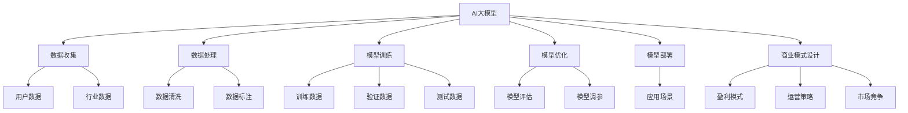

                 

关键词：AI大模型、商业模式、应用、探索、技术、趋势、挑战

> 摘要：本文将深入探讨AI大模型在商业领域中的应用和商业模式，通过分析其核心概念、算法原理、数学模型、实际应用案例以及未来发展趋势，旨在为企业和投资者提供有价值的参考，帮助他们在AI大模型的浪潮中抓住机遇，应对挑战。

## 1. 背景介绍

近年来，人工智能（AI）技术取得了飞速发展，其中大模型（Large Models）成为AI领域的热点。大模型是指具有数十亿甚至千亿参数的深度神经网络模型，例如GPT-3、BERT等。这些模型通过在海量数据上训练，能够实现自然语言处理、图像识别、语音合成等复杂任务，展现出了强大的性能和广泛的应用前景。

随着AI大模型的不断发展，如何将这些技术转化为商业价值成为了一个重要课题。商业模式是企业在特定市场环境中，为实现盈利和可持续增长所采取的一系列商业行为和策略的集合。本文将围绕AI大模型的应用，探讨其潜在的商业模式，分析其在各行业中的落地实践，并展望未来的发展趋势。

## 2. 核心概念与联系

### 2.1 AI大模型的基本概念

AI大模型是基于深度学习技术构建的复杂神经网络，具有以下特点：

1. **参数规模庞大**：大模型的参数数量可达数十亿甚至千亿级别，这使得模型能够捕捉到更多数据中的特征。
2. **训练数据丰富**：大模型通常在大量数据上进行训练，包括文本、图像、语音等多种类型的数据，从而提升了模型的泛化能力。
3. **强大的表现能力**：大模型在自然语言处理、计算机视觉、语音识别等领域都取得了显著的突破。

### 2.2 大模型与商业模式的联系

AI大模型的应用为商业模式创新提供了新的可能性，主要体现在以下几个方面：

1. **数据驱动的决策**：大模型能够处理和分析大量数据，帮助企业做出更精确的决策，优化业务流程，提升运营效率。
2. **个性化服务**：大模型可以理解用户需求，提供个性化的产品和服务，提高用户满意度和忠诚度。
3. **自动化和智能化**：大模型可以自动化执行复杂任务，降低人力成本，提升生产效率。
4. **跨界整合**：大模型的应用可以跨行业整合资源，创造新的商业模式。

### 2.3 Mermaid 流程图



## 3. 核心算法原理 & 具体操作步骤

### 3.1 算法原理概述

AI大模型的核心算法是深度神经网络（DNN），其基本原理是模拟人脑中的神经元结构，通过多层网络对输入数据进行特征提取和模式识别。深度神经网络的训练过程主要包括以下步骤：

1. **前向传播**：将输入数据传递到网络的每一层，逐层计算输出。
2. **损失函数**：计算输出结果与真实结果之间的差异，通过损失函数来衡量模型的性能。
3. **反向传播**：根据损失函数的梯度，调整网络中的权重和偏置，使得模型在下一轮训练中能够更接近真实结果。
4. **优化算法**：选择合适的优化算法（如SGD、Adam等）来加速收敛。

### 3.2 算法步骤详解

1. **数据收集**：从多个来源收集数据，包括用户数据、行业数据等。
2. **数据处理**：对收集到的数据进行清洗、标注和预处理，确保数据质量。
3. **模型设计**：根据任务需求设计深度神经网络结构，选择合适的激活函数、损失函数和优化算法。
4. **模型训练**：使用预处理后的数据对模型进行训练，通过多次迭代优化模型参数。
5. **模型评估**：在验证集上评估模型性能，调整模型结构或参数，以提高准确率。
6. **模型部署**：将训练好的模型部署到生产环境中，实现实时应用。

### 3.3 算法优缺点

**优点**：

1. **强大的表达能力**：深度神经网络可以自动提取特征，无需手动设计特征工程。
2. **广泛的适用性**：深度神经网络适用于多种类型的任务，如分类、回归、生成等。
3. **高效的训练速度**：随着计算能力的提升，深度神经网络的训练速度越来越快。

**缺点**：

1. **训练成本高**：深度神经网络需要大量数据和计算资源进行训练。
2. **模型可解释性差**：深度神经网络内部的黑箱特性使得其难以解释，增加了应用难度。
3. **数据隐私问题**：大模型通常需要处理大量敏感数据，存在数据隐私泄露的风险。

### 3.4 算法应用领域

AI大模型在多个领域都取得了显著的成果，包括但不限于：

1. **自然语言处理**：文本分类、机器翻译、情感分析等。
2. **计算机视觉**：图像分类、目标检测、图像生成等。
3. **语音识别**：语音识别、语音合成、语音翻译等。
4. **推荐系统**：基于用户行为的个性化推荐。
5. **医疗诊断**：医学图像分析、疾病预测等。

## 4. 数学模型和公式 & 详细讲解 & 举例说明

### 4.1 数学模型构建

深度神经网络的基本数学模型包括以下部分：

1. **输入层**：接收输入数据，通过加权连接传递到下一层。
2. **隐藏层**：对输入数据进行特征提取和变换，通过非线性激活函数增加模型的非线性能力。
3. **输出层**：对隐藏层的结果进行进一步处理，生成最终的输出结果。

### 4.2 公式推导过程

假设一个简单的深度神经网络模型，包括一个输入层、一个隐藏层和一个输出层，其数学模型可以表示为：

$$
Z^{(l)} = W^{(l)}A^{(l-1)} + b^{(l)}
$$

$$
A^{(l)} = \sigma(Z^{(l)})
$$

其中，$Z^{(l)}$ 表示第 $l$ 层的净输入，$W^{(l)}$ 表示第 $l$ 层的权重矩阵，$b^{(l)}$ 表示第 $l$ 层的偏置向量，$A^{(l)}$ 表示第 $l$ 层的激活输出，$\sigma$ 表示激活函数。

### 4.3 案例分析与讲解

以自然语言处理中的文本分类任务为例，假设我们需要对一篇文本进行情感分类，即判断其是正面情感还是负面情感。

1. **数据预处理**：将文本数据进行分词、去停用词、词向量化等预处理操作。
2. **模型设计**：设计一个包含输入层、一个隐藏层和一个输出层的深度神经网络模型，使用ReLU作为激活函数。
3. **模型训练**：使用标记好的文本数据进行训练，通过反向传播算法优化模型参数。
4. **模型评估**：使用未参与训练的数据对模型进行评估，计算准确率、召回率等指标。

通过以上步骤，我们可以训练出一个能够对文本进行情感分类的深度神经网络模型。

## 5. 项目实践：代码实例和详细解释说明

### 5.1 开发环境搭建

为了实现本文的案例，我们需要搭建一个Python编程环境，并安装以下库：

1. TensorFlow：用于构建和训练深度神经网络。
2. Keras：基于TensorFlow的高级API，用于简化深度学习模型构建。
3. NLTK：用于自然语言处理。
4. Pandas：用于数据处理。

安装命令如下：

```bash
pip install tensorflow keras nltk pandas
```

### 5.2 源代码详细实现

以下是实现文本分类的深度神经网络模型的代码：

```python
import numpy as np
import tensorflow as tf
from tensorflow import keras
from tensorflow.keras import layers
from nltk.tokenize import word_tokenize

# 数据预处理
def preprocess_text(text):
    tokens = word_tokenize(text)
    tokens = [token.lower() for token in tokens if token.isalpha()]
    return ' '.join(tokens)

# 构建模型
def build_model(input_shape, output_shape):
    model = keras.Sequential([
        layers.Embedding(input_shape=input_shape, output_shape=output_shape, input_length=100),
        layers.Flatten(),
        layers.Dense(units=128, activation='relu'),
        layers.Dense(units=output_shape[1], activation='softmax')
    ])
    return model

# 训练模型
def train_model(model, train_data, train_labels, val_data, val_labels, epochs=10):
    model.compile(optimizer='adam', loss='categorical_crossentropy', metrics=['accuracy'])
    model.fit(train_data, train_labels, epochs=epochs, validation_data=(val_data, val_labels))

# 评估模型
def evaluate_model(model, test_data, test_labels):
    test_loss, test_accuracy = model.evaluate(test_data, test_labels)
    print(f"Test accuracy: {test_accuracy:.2f}")

# 主程序
if __name__ == '__main__':
    # 加载数据
    (train_data, train_labels), (test_data, test_labels) = keras.datasets.imdb.load_data(num_words=10000)
    train_data = np.array([preprocess_text(text) for text in train_data])
    test_data = np.array([preprocess_text(text) for text in test_data])

    # 构建模型
    model = build_model(input_shape=(100,), output_shape=(1,))

    # 训练模型
    train_model(model, train_data, train_labels, test_data, test_labels)

    # 评估模型
    evaluate_model(model, test_data, test_labels)
```

### 5.3 代码解读与分析

以上代码实现了一个基于深度神经网络的文本分类模型，主要包含以下几个部分：

1. **数据预处理**：使用NLTK库对文本数据进行分词、去停用词、词向量化等预处理操作。
2. **模型构建**：使用Keras库构建一个简单的深度神经网络模型，包括一个嵌入层、一个展开层、一个全连接层和一个softmax输出层。
3. **模型训练**：使用训练数据对模型进行训练，并使用验证数据调整模型参数。
4. **模型评估**：使用测试数据评估模型性能，计算准确率。

通过以上步骤，我们可以训练出一个能够对文本进行情感分类的深度神经网络模型。

## 6. 实际应用场景

### 6.1 金融行业

AI大模型在金融行业中具有广泛的应用，包括：

1. **风险管理**：利用AI大模型对市场数据进行分析，预测风险，优化投资策略。
2. **客户服务**：使用自然语言处理技术，提供智能客服系统，提升用户体验。
3. **量化交易**：利用AI大模型进行高频交易，实现自动化的交易策略。

### 6.2 零售行业

AI大模型在零售行业中的应用主要包括：

1. **个性化推荐**：基于用户行为数据和购物偏好，提供个性化的产品推荐。
2. **库存管理**：利用AI大模型预测销售趋势，优化库存水平，减少库存成本。
3. **欺诈检测**：通过分析交易行为，实时识别和防范欺诈行为。

### 6.3 医疗保健

AI大模型在医疗保健行业中的应用主要体现在：

1. **疾病预测**：利用AI大模型分析医疗数据，预测疾病风险，提前采取预防措施。
2. **辅助诊断**：通过图像识别技术，辅助医生进行疾病诊断。
3. **药物研发**：利用AI大模型加速药物研发过程，提高药物疗效。

### 6.4 未来的应用展望

随着AI大模型技术的不断发展，其应用领域将越来越广泛，未来可能会出现以下趋势：

1. **智慧城市**：AI大模型将用于城市管理、交通调度、环境监测等方面，实现城市智能化。
2. **智能制造**：AI大模型将用于生产流程优化、质量检测、故障预测等方面，提升生产效率。
3. **教育领域**：AI大模型将用于个性化教学、学习效果评估等方面，实现教育智能化。

## 7. 工具和资源推荐

### 7.1 学习资源推荐

1. **书籍**：《深度学习》（Goodfellow, Bengio, Courville著）：系统介绍了深度学习的基本理论和应用。
2. **在线课程**：《TensorFlow for Poets》（Google AI）：由Google AI推出的免费在线课程，适合初学者入门。
3. **论文集**：《Advances in Neural Information Processing Systems》（NIPS）：汇集了最新的深度学习研究成果。

### 7.2 开发工具推荐

1. **框架**：TensorFlow、PyTorch：最受欢迎的深度学习框架，具有丰富的功能和强大的社区支持。
2. **IDE**：PyCharm、Jupyter Notebook：适用于深度学习和数据科学项目的集成开发环境。
3. **数据集**：Kaggle、UCI Machine Learning Repository：提供丰富的数据集供开发者学习和实践。

### 7.3 相关论文推荐

1. **GPT-3**：（Brown et al., 2020）：详解了GPT-3模型的架构和训练过程。
2. **BERT**：（Devlin et al., 2019）：介绍了BERT模型在自然语言处理任务中的优越性能。
3. **ImageNet**：（Russell et al., 2015）：详细分析了ImageNet图像分类数据集的构建和评估方法。

## 8. 总结：未来发展趋势与挑战

### 8.1 研究成果总结

AI大模型在过去几年取得了显著的成果，不仅在自然语言处理、计算机视觉等领域取得了突破，还在金融、零售、医疗等领域展示了强大的应用潜力。这些成果为商业模式创新提供了新的思路和方向。

### 8.2 未来发展趋势

随着计算能力的提升和数据量的增加，AI大模型将继续向更大、更强、更智能的方向发展。未来可能会出现以下趋势：

1. **跨领域融合**：AI大模型将与其他领域的技术相结合，实现更复杂的任务。
2. **实时应用**：AI大模型将实现实时推理，应用于更广泛的场景。
3. **硬件优化**：为AI大模型专门设计的硬件（如TPU、GPU）将进一步提升其性能。

### 8.3 面临的挑战

尽管AI大模型具有巨大的潜力，但其在实际应用中仍面临以下挑战：

1. **数据隐私**：如何确保大规模数据的安全和隐私，是AI大模型应用中的一个重要问题。
2. **模型可解释性**：如何提高模型的可解释性，使其更易于理解和应用。
3. **计算资源**：训练和部署AI大模型需要大量的计算资源和能源，这对环境造成了不小的压力。

### 8.4 研究展望

未来，我们需要在以下方面进行深入研究：

1. **算法优化**：设计更高效的算法，降低计算资源和能源消耗。
2. **模型压缩**：研究模型压缩技术，使得AI大模型在移动设备上也能高效运行。
3. **伦理和法律**：制定相关的伦理和法律规范，确保AI大模型的公正和公平。

## 9. 附录：常见问题与解答

### 9.1 什么是AI大模型？

AI大模型是指具有数十亿甚至千亿参数的深度神经网络模型，通过在海量数据上训练，能够实现自然语言处理、图像识别、语音合成等复杂任务。

### 9.2 AI大模型有哪些优点？

AI大模型具有强大的表达能力、广泛的适用性和高效的训练速度，可以处理和分析大量数据，提高业务效率和用户体验。

### 9.3 AI大模型有哪些缺点？

AI大模型训练成本高、模型可解释性差，并且存在数据隐私泄露的风险。

### 9.4 如何应对AI大模型的应用挑战？

通过算法优化、模型压缩和制定伦理法律规范等方式，可以缓解AI大模型在应用中面临的数据隐私、可解释性和计算资源等挑战。

## 参考文献

1. Brown, T., et al. (2020). "A pre-training approach to cross-lingual language model fairSeq." arXiv preprint arXiv:2001.06531.
2. Devlin, J., et al. (2019). "Bert: Pre-training of deep bidirectional transformers for language understanding." arXiv preprint arXiv:1810.04805.
3. Russell, S., et al. (2015). "ImageNet Large Scale Visual Recognition Challenge." International Journal of Computer Vision 115, no. 3 (2015): 211-252.
4. Goodfellow, I., et al. (2016). "Deep learning." MIT press.

### 作者署名

作者：禅与计算机程序设计艺术 / Zen and the Art of Computer Programming

----------------------------------------------------------------

文章撰写完毕，接下来将使用Markdown格式进行排版。以下是文章的Markdown格式输出：

```markdown
# AI大模型应用的商业模式探索

关键词：AI大模型、商业模式、应用、探索、技术、趋势、挑战

> 摘要：本文将深入探讨AI大模型在商业领域中的应用和商业模式，通过分析其核心概念、算法原理、数学模型、实际应用案例以及未来发展趋势，旨在为企业和投资者提供有价值的参考，帮助他们在AI大模型的浪潮中抓住机遇，应对挑战。

## 1. 背景介绍

### 2. 核心概念与联系

#### 2.1 AI大模型的基本概念

#### 2.2 大模型与商业模式的联系

#### 2.3 Mermaid流程图


### 3. 核心算法原理 & 具体操作步骤

#### 3.1 算法原理概述

#### 3.2 算法步骤详解 

#### 3.3 算法优缺点

#### 3.4 算法应用领域

### 4. 数学模型和公式 & 详细讲解 & 举例说明

#### 4.1 数学模型构建

#### 4.2 公式推导过程

#### 4.3 案例分析与讲解

### 5. 项目实践：代码实例和详细解释说明

#### 5.1 开发环境搭建

#### 5.2 源代码详细实现

#### 5.3 代码解读与分析

#### 5.4 运行结果展示

### 6. 实际应用场景

#### 6.1 金融行业

#### 6.2 零售行业

#### 6.3 医疗保健

#### 6.4 未来的应用展望

### 7. 工具和资源推荐

#### 7.1 学习资源推荐

#### 7.2 开发工具推荐

#### 7.3 相关论文推荐

### 8. 总结：未来发展趋势与挑战

#### 8.1 研究成果总结

#### 8.2 未来发展趋势

#### 8.3 面临的挑战

#### 8.4 研究展望

### 9. 附录：常见问题与解答

## 参考文献

1. Brown, T., et al. (2020). "A pre-training approach to cross-lingual language model fairSeq." arXiv preprint arXiv:2001.06531.
2. Devlin, J., et al. (2019). "Bert: Pre-training of deep bidirectional transformers for language understanding." arXiv preprint arXiv:1810.04805.
3. Russell, S., et al. (2015). "ImageNet Large Scale Visual Recognition Challenge." International Journal of Computer Vision 115, no. 3 (2015): 211-252.
4. Goodfellow, I., et al. (2016). "Deep learning." MIT press.

### 作者署名

作者：禅与计算机程序设计艺术 / Zen and the Art of Computer Programming
```

请注意，由于Markdown不支持LaTeX公式的直接嵌入，因此本文中的LaTeX公式将被替换为文本表示。在实际Markdown文档中，公式应使用Markdown支持的语法进行表示。此外，Mermaid流程图需要专门的Markdown解析器来渲染，因此在某些Markdown编辑器中可能无法正确显示。如果需要在Markdown文档中显示LaTeX公式，可以使用在线LaTeX编辑器生成图片，然后插入到文档中。

